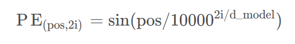

# Transfomer 全细节详解

## 一. 引言

近几年，越来越多得深度学习网络出现在了我们得视野当中，并且这个研发速度在不断得上升。在这些众多的模型中，有一个模型占有这举足轻重得地位！那就是 Transformer。 尤其是在自然语言处理, Transformer的到来犹如龙卷风一般震惊学术界。 这个新的模型一出现就打破了多个自然语言处理的表现记录并一举成为了最先进的深度网络模型之一。 Transformer 在机器翻译，智能对话，甚至搜索引擎上都展现出了强大的能力。

那这样一个在深度学习领域中如传奇一般的模型到底是怎么work的呢？ 其凭什么超越曾经的RNN，LSTM，GRU这些NLP之王呢？ 在接下来的文章中，我们将逐一介绍Transformer中设计的一些方法和机制。

## 二. What is Transformer？

### SeqToSeq模型

在学习Transformer之前，我们需要先了解什么是SeqToSeq模型。 在自然语言处理领域，特别是机器翻译类的任务中，我们经常会听到类似于LSTM， RNN之类的模型算法。 这些都是典型的SeqToSeq模型。

从名字上我们就可以很明显的看出，**SeqToSeq模型顾名思义就是给定义一个序列作为输入，其将输出另一个序列**。这样特性就非常符合处理一些类似与机器翻译的任务。 这个序列转序列的工作原理主要基于SeqToSeq模型的两大组成结构：**编码器（Encoder）和 解码器（Decoder）**。


从上图我们可以看出，序列数据从左边输入，通过编码器将输入数据转化为了成了一个Feature Vector，然后再将这个Feature Vector输入至解码器解码并输出一段新的序列。 如果我们的任务是翻译，那左边编码器的输入就可以是中文的一短句子，右边解码器的输出就可能是一段翻译后的英文句子。

那为什么这样的一个模型架构可以实现这样的一种翻译呢？其实**重点就在于编码器和解码器中间的这个Feature Vector或这叫Context Vector**。这是个什么东西呢？ 学术点说，这是**两个序列所在的空间以外的一个映射空间中两个序列共同的映射序列**。 听起来很绕，我将用一个例子来解释这句话，大家理解了这个例子后可以在回头来细品这句话。


我们知道“Bonjour”和“Hello”分别是法语和英文中的你好的意思。 这两个背后的概念意思都是“你好”，不同的只是他们的表达方式。 这也是**为什么不同的语言可以进行互相翻译，因为他们背后的意思是相同的，只是不同人群对这个相同的意思的不同表罢了**。 拿“你好”举例子，当我们翻译法语中的“Boujour”时，我们大脑是先将Bonjour所表达的概念意识提取出来，这也就是一个编码的过程。 然后提取出来的这个意识概念也就是我们的Feature Vector. 接下来我们的大脑就会基于这个意识概念，去我们大脑中的英语语言库中把与这个意识概念匹配的英文单词提取出来， 这也就是解码的过程。

但是，我们还不会法语和用英语的时候，我们是不知道Bonjour和Hello背后的意思的，更不知道这两个单词背后所表达意识概念是关联的。 所以我们在学习这两个语言的过程中，无非就是**将两种不同表达方式的语言关联并映射同一个意识概念上**。 所以我们**训练SeqToSeq模型过程也与之类似，无非就是寻找某一种映射方式，使得输入的序列和输出的序列可以被映射到一个相同的意识概念上，也就是我们的Feature Vector**。

### RNN


以上这个图就是RNN模型的一个架构。 左边部分是RNN的一个模型的简洁表示，但其实他是一个循环结构，我们可以将循环展开得到图中右边的结构。 其中的X XX对应的是序列数据， h hh则是我们之前提到的Feature Vector。 我们可以看到在这样的一个循环架构下，序列数据按照顺序被循环的输入，然后在每一次循环中我们的Feature Vector都会从新的输入中获取到新的信息并实现更新。 因此，当循环结束后，我们最后获取到的Feature Vector将包含了整个序列的信息，并且这个最终的Feature Vector也同时包含了序列被输入的顺序信息。 这样的一个过程就是RNN下的一个编码过程。 那接下来的解码过程就很简单了。 只需要在同样的结构基础上，在每一个循环中加一个output的线性变换就可以了，如下图：


类似RNN这样的算法模型又两个很大的问题：

1. **Feature Vector 所包含的信息有限**：由于过长的输入序列和有限的Feature Vector尺寸。从RNN的架构中我们可以看出，Feature Vector都是基于新的输入通过线性变换进行更新的。 但是当我们的序列很长的时候，循环到最后，可能一开始被加入至Feature Vector的序列信息已经再多次循环线性变换下被慢慢的稀释掉了， 这导致我们最后的Feature Vector 并不能很好地完整地表达整个序列。再来，我们输入序列的长度是可变的，但是我们的Feature Vector尺寸是从一开始就被固定的，因此**Feature Vector尺寸大小也成为了Feature Vector尺寸表达能力的一个瓶颈**。
2. **Feature Vector所包含的信息太多**：RNN的编码过程其实就是一个字一个字的去理解序列的意思，并尝试将所有字的的信息都纳入Feature Vector。假设我们被要求看一本书并理解其中内容然后写一份简介， 我们需要将这本书中的的每一个字每一句话都看明白才能理解并写出一份简介吗？ 想必大家都是不需要的。 往往，我们只需要快速理解这本书的一些关键词，关键句，关键段落，就能很快地对这本书有大致的理解，并写出一份简介。  但很显然，这显得有点多余。 因此， 在一些情况下， 我们并不需要Feature Vector无差别的表达序列中的所有信息，只需要一些关键的信息即可。

最后，类似RNN这样的循环算法还有一个工程上的通病。因为这类循环算法不论是在编码和解码过程中，数据流的的走向都是按顺序串行的，因此在训练和预测过程中，这个算法都较为低效，无法并行处理。

基于这些问题，我们的Transformer算法就横空出世了。 Transformer的出现一下子解决了以上所有问题。 非常值得关注的是Transformer在解决Feature Vector所包含的信息太多，这一问题上引入的一个叫做Atention Mechanism的注意力机制。 小编在这里先简单介绍一下注意力机制的核心概念， 以便帮助读者理解接下来注意力机制在Transformer中的应用。

### Attention

我们之前提到过，当我们看一本书的时候，我们并不会从头到尾一字一句的去理解拿一本书，而是通过快速阅读，**将注意力放在一些关键词和关键句上**。 这样的一个例子就能很充分的体现Attention Mechanism的工作原理。 将这样的一个机制运用到RNN中，就为如下图所示：


从以上这个新的结构中，我们会发现。 编码器保持不变，但是在解码过程中，每一个output的输出不再仅仅只依赖于h这样的一个Feature Vector,而是需要另外多考虑一个 C. 而这个C也就是编码器部分中所有Feature Vector的一个加权平均。 这样做的好处就是， **在解码过程中，我们可以以不同权重将注意力放在所有编码过程产生的Feature Vector的中间结果，也就相当于我们在做翻译的时候可以选择性的将一些重心放在输入的某些关键词上**。

那问题来了， 我们要如何知道要放多少注意力在某个关键词上呢？ 或者说，这个加权平均中的权重要如何获得呢？ 这个其实没有固定的方法，一般来说会基于问题和想要达到的目标进行设计。 以上这个RNN为例，一个简单的权重设计方法可以为：拿当前解码循环得到的Feature Vector分别与编码过程中所有的Feature Vector进行点积从而得到权重。为什么使用点积呢？ 回顾线性代数， 我们知道两个向量点积可以得到两个向量的相似度。 因此我们使用相似度作为权重来表示我们对不同编码过程中的Feature Vector的不同关注程度。 具体如下图


以上我们使用了RNN的例子来阐述Attention Mechanism的工作原理，其主要的思想可以被应用在许多不同的问题中，但是值得注意的是，在不同的问题和不同的目的下，我们需要设计不同的方式来计算或者训练注意力权重。

虽然使用将Attention Mechanism运用到类似RNN这样的循环模型下可以或多或少的解决了2. Feature Vector所包含的信息太多的问题。 但是考虑到RNN这类模型的循环架构， Feature Vector对较长输入序列的信息的表达能力还是存在较大的瓶颈问题。 同时，这样循环依赖的模型结构从工程角度上来说，都是较不高效的；无法实现并行训练。

因此， 综合考虑这所有问题，在“Attention Is All You Need”，XXX基于SeqToSeq的模型框架，创新设计了一个新的模型架构， 名Transformer。

## 三. Transfomer概览


从上图我们可以看出Transfomer沿用了SeqToSeq模型的架构： Encoder -> Feature Vector -> Decoder. 但与同样使用了SeqToSeq模型的RNN这类循环算法不同的是， 这个新的Transformer架构中并没有出现任何循环的结构，这不仅使得模型可以并行训练，同时除了在解码器中引入了Attention Mechanism, 作者在编码器中也同样使用了一种叫Self-Attention的注意力机制。 这样的一种机制保证了序列中每一个经过编码器的词向量都会同时包含其在这该序列中的上下文信息， 这使得编码器最终输出的Feature Vector所包含的信息量远远大于循环算法中Feature Vector所能表达的上下文信息。

Transformer的核心思想包括：

1. 自注意力机制（Self-Attention）： 模型能够同时考虑输入序列中的所有位置，而不是像传统的固定窗口大小的卷积或循环神经网络一样逐步处理。
2. 位置编码（Positional Encoding）： 由于Transformer没有显式的顺序信息，为了保留输入序列中元素的位置信息，需要添加位置编码。
3. 多头注意力（Multi-Head Attention）： 将自注意力机制应用多次，通过多个注意力头来捕捉不同的关系。
4. 前馈神经网络（Feedforward Neural Network）： 每个注意力子层后接一个前馈神经网络，用于学习非线性关系。

简单介绍了一下Transformer相比于传统循环算法的优势。 我们接下来具体介绍一下Transformer的架构组成部分。

首先，显而易见，作为SeqToSeq模型的变体，Transformer主要**编码器和解码器**两大部分组成：

- 编码器（Encoder）负责把自然语言序列映射成为隐藏层(上图中第2步用九宫格比喻的部分)

- 解码器（Decoder）再把隐藏层映射为自然语言序列，从而使我们可以解决类似机器翻译这样的问题。

进一步看， 编码器和解码器的内部主要成分为：

- 词嵌入层（Input Embedding） 负责将自然语言转化为与其对应的独一无二的词向量表达
- 位置嵌入层（Positional Embedding） 负责将输入序列中的位置信息写入词向量
- 编码/解码块（Encoder/Decoder Block） 为编码器或解码器中主要的编码或解码模块， 负责对具有位置信息的词向量进行编码或解码，图中**N x** 表示Transformer中的编码器或解码器可由**N**个编码/解码块叠加组成，形成一个纵向的深度网络

以上就是Transformer的一个概览，接下来我们将具体介绍Transformer的细节。


## 四. 编码器

我们会重点介绍编码器的结构，因为理解了编码器中的结构, 理解解码器就非常简单了。回顾一下：编码器部分, 即把自然语言序列映射为隐藏层的数学表达的过程。

以下为单独一个解码器部分的结构示意图：


### 0. Data Preparing

就如同任何其他模型，我们在做任何事情之前，首先要做的就是要对数据进行处理。 假如说我们的任务是机器翻译， 那我们的原始数据可能是即包含翻以前的句子以及翻译后的句子的。 因此我们需要他们分开来。 然后因为我们的数据都是实际的自然语言字符串， 我们需要分别为翻以前和翻译后的语言做一个字典， 并用ID进行**索引**。 然后通过这个字典将我们数据中的所有句子进行ID化。 最后因为我们一般训练一个模型都是batch by batch训练的， 我们需要进一步对我们的数据进行分批处理。

以上就是一个简单的数据处理， 注意! 经过这个模块后，数据将被按批次分开，每一批数据的矩阵维度是**batch size×sentence length**

### 1. Input Embedding（词嵌入）

在0. Data Preparing部分， 我们对输入的中文和英文进行了ID化， 虽然这样的数字表示是计算机能理解的语言， 但是其实还不够。 因为这样的编号处理并不能表达出这些词或字背后的语义或词性信息， 其相当于仅仅只是起到了索引的作用。 基于这些编号，我们没有办法区分哪些编号所代表的是动词或者名词， 我们没有办法区分哪些编号背后的意思是相似的。 因此**我们需要将这些编码进一步做一个词嵌入的处理，使用更高维度， 更具表达能力的向量来代表这些词或字**。

那我们要怎么去做这么一个词嵌入呢获得这些词的向量表示呢？ 市面上有许多模型比如GloVe这类基于数理统计的模型和Bert这类基于神经网络的学习嵌入模型。 为了简单，我们这里使用一个简单的全连接神经网络作为我们词嵌入的学习模块。 具体操作如下：

首先，我们需要将我们ID化的输入数据转化为One-Hot Representation。 也就是：


然后，我们将转化后的数据输入一个尺寸为 **vocabs×desired embedding length**的全连接网络层。最终输出的就是原始数据经过词嵌入后的词向量矩阵了， 其尺寸为 **len of input×desired embedding length** 具体如下


通过以上这个词嵌入模型，我们就可以在训练整个Transformer模型的同时，学习并更新出最佳的对应原始数据的词向量了。

当我们完成了词向量的嵌入后， 下一步，我们需要每个词的位置信息写入词向量中， 这个步骤也叫Positional Encodding。

### 2. Positional Encodding（位置编码）

在开篇我们说过， **Transformer并不具备类似RNN这样的循环迭代结构， 因此其并不具备理解输入序列的顺序信息的能力。** 因此，我们需要**额外的将一些关于序列中元素的相对或绝对位置信息注入我们的词向量中**。 为了这一目的， 我们在词嵌入模块后增加了一个层位置编码模块。**该模块会生成一个与输入词向量相同尺寸的位置编码向量， 并将该位置向量直接与输入的词向量进行相加获得一个具备位置信息的词向量。**这样，不同位置的词将拥有不同的词嵌入值，从而使模型能够区分它们。

那我们要如何获得所谓的位置编码向量呢？ 市面上有许多方法，有通过学习的，也有通过固定算法的。 这里， 为了不进一步增加需要学习的参数， 我们使用一个基于不同频率的正弦和余弦编码算法， 即：




以上公式中， pos为词在句子的顺位或下表， i为该词所对应的词向量中元素的下标， d_model 为一个词向量的长度。

那以上这两个公式是什么意呢？其实很简单。

1. 一个句子中，下标为pos的词向量所对应的相同尺寸的位置向量的偶数下标元素的位置编码为 sin(pos/100002i/d_model) 
2. 一个句子中，下标为pos的词向量所对应的相同尺寸的位置向量的奇数下标元素的位置编码为cos(pos/10000^{2i/d\_model})


这里补充一下： 为什么用这个算法能保证每一个顺位都能获得一个唯一位置信息向量呢？

我们通过以下这个图来说明来说明：


从上图我们可以看出， 基于横向维度坐标，该算法生成了不同周期频率的正弦和余弦。 通过这些这些不同周期的正弦和余弦交叉组合， 我们就可以为每一个不同顺位的词生成一个唯一位置向量。这样，每个位置 ( pos ) 都对应一个唯一的位置编码向量，将这个向量加和到词嵌入中，就能够考虑位置信息。

以上就是Positional Encoding的内容。 到此为止， 我们已经顺利完成了对输入数据的处理， 接下来我们将正式进入编码器的核心部分。

### 3. Attention in Transformer

我们再文章开篇简单介绍了一下注意力机制， 这节我们将细致介绍一下注意力机制在Transformer中的应用。

#### 详细解读自注意力机制

1. **注意力的概念：**
   注意力机制模拟了人类视觉系统的工作原理，即在处理某个任务时，我们不是对所有信息一视同仁，而是在某个时刻关注一部分信息，而另一时刻可能关注其他信息。在自注意力机制中，**模型通过学习到的权重分配给输入序列中的不同位置，以便在生成输出时更加关注相关的部分**。

2. 自注意力机制的基本原理：

   - Query（查询）： 通过将输入序列与权重矩阵相乘，得到每个位置的查询向量。**查询向量用于衡量每个位置与其他位置的相关性**。
   - Key（键）： 通过将输入序列与权重矩阵相乘，得到每个位置的键向量。**键向量用于被查询向量衡量**，从而计算注意力分布。
   - Value（值）： 通过将输入序列与权重矩阵相乘，得到每个位置的值向量。**值向量将根据注意力分布加权求和，形成最终的输出**。

3. 注意力分布计算：

   1. 计算相似度： 通过查询向量和键向量的点积，计算每个位置的相似度得分。
   2. 缩放： 为了**避免相似度过大导致的梯度消失或梯度爆炸问题**，一般会对相似度进行缩放，常用的缩放因子是输入维度的平方根。
   3. Softmax： 对缩放后的相似度应用Softmax函数，得到注意力权重分布。Softmax确保所有权重的总和为1，使其成为有效的概率分布。
   4. 注意力加权求和： 将值向量按照得到的注意力权重进行加权求和，得到最终的自注意力输出。

4. 多头注意力（Multi-Head Attention）：

   为了增强模型的表达能力，自注意力机制通常会使用多个独立的注意力头。每个头学习不同的查询、键、值权重矩阵，最后将多个头的输出拼接在一起并通过线性映射进行融合。

5. 位置编码（Positional Encoding）：

   自注意力机制没有直接考虑序列中元素的顺序，为了捕捉序列的位置信息，常常会在输入序列中添加位置编码。位置编码是一个与位置有关的可学习参数，使得模型能够更好地处理序列的顺序信息。

   

自注意力机制的引入有效地捕捉了序列中不同位置之间的关系，使得模型能够在输入序列中动态地分配注意力。这种机制的引入是Transformer模型成功的关键之一，尤其在处理长距离依赖关系时表现优异。

在Transformer中， 注意力机制分别被应用在了编码和解码过程中，在两个场景下，注意力机制被应用的方式和动机是有所不同的。在这节内容，我们将主要介绍注意力机制在编码器中的应用， 即：Self-Attention

#### a. Self-Attention(自注意力机制)

什么是自注意力机制?? 跟注意力机制有什么关系？？

放心， 在小编第一次看的这个高大上的词是也是一脸懵X。 但其实并不难理解， 让小编慢慢道来。

假设，以下是一个我们想要翻译的英文句子：

”The animal didn't cross the street because it was too tired”

请问， 这个句子中的 “it” 指的是什么呢？ 是“street”呢？ 还是 “animal”？ 对于人类来说，这是再简单不过了， 当然是“animal”啦。但是对于机器来说，这并不简单。

Self-Attention就是的初衷就是为了去实现这么一个对于人类来说再简单不过的功能。 其核心目标就是，在对一个输入单词进行编码的时候同时考虑到这个单词与句子中的其他单词的关系，并将该单词与其上下文信息打包起来进行输出。也就是说当编码器在编码“it”这个单词的时候， 其会将“animal”与“it”关联起来并输出。

这样的一个机制，不知道大家是否感到似曾相识。 在RNN这类迭代算法中， 在某一个编码循环时，RNN的编码器不也是将一个代表了之前看到过的句子的上下文意思的Feature Vector融入当下正在处理的单词输入吗？ 所以说，因为Transformer不存在这样的循环迭代结构， 因此作者就想通过Self-Attention这样一个机制来复现循环迭代模型中的上下文表达能力

接下来， 我们来深入介绍一下Self-Attention的算法细节。

首先， 计算Self-Attention， 我们需要针对每一个输入词向量，分别生成三个维度相同的向量：Query Vector、 Key Vector 和 Value Vector. 这三个向量的生成是由输入词向量与三个维度为**length input vector×len of QKV vector**可训练的参数矩阵点积而得到的， 这里给这三个参数矩阵分别命名为： WQ  、WK和WV 。

在以下图中， 我们假设由两个分别代表“Thinking”和“Machine”两个单词的、长度为4的输入词向量。 并且我们希望基于这两个输入， 我们可以生成两组长度分别都为3的Q，K，V向量。


>**注意**， 为了方便展示，这里我们的**QKV**的长度设置为3， 但实际会更长， 论文中使用的是128这样的一个长度

Ok, 我们知道了怎么计算得到Query Vector、 Key Vector 和 Value Vector这三个东西。 那他们是什么呢？ 干嘛用的呢？

还记得，在开篇介绍注意力机制的时候， 小编说过**注意力的机制本质就是在处理一个输入input的同时， 基于一定的权重，选择性的将当前输入数据以外的其他数据也纳入考量范围内**。 所以同样的， 针对当下这个例子，我们在处理比如“Thinking”这个单词的词向量的时候， 我们也希望可以，基于一定权重，将注意力分配到不仅仅“Thinking”上，同时也将“Machines”考虑在内。 那这个**权重的计算就需要使用到Query Vector和Key Vector 了**！

所以**Query Vector和Key Vector的作用就是用来为每一个输入词向量分别计算一个Attention Score**。 这个Attention Score其实也很简单。 我们知道， 向量的点积表达了两个向量的相似度。 基于此， 我们可以用以下这个公式求得不同词向量之间的相似度， 并用这个相似度为每一个词向量生成一个Score Vector。


在下图中， 同样的，我们用“Thinking”作为例子。
针对“Thinking”这个词向量， 我们基于以上公式，我们将“Thinking”自身的q1与自身的k1及“Machines”的k2 进行点积， 并获得一个二维的Score Vector， 其中的元素值分别为：q1 ⋅ k1 = 112 和 q1 ⋅ k2 = 96 。


得到了"Thinking"得Score Vector之后， 我们就可以用Softmax来做获得权重了。 但是， 在那之前我们还需要做一件事, 我们需要对Score除以$\sqrt {d_k} $ , 也就QKV向量长度开根号。

为什么要在Softmax归一化之前加除以$\sqrt {d_{k}} $这么一步操作呢？假设 q 和 k 是独立的随机变量，平均值为 0，方差 1，这样他们的点积后形成的注意力值为 $q⋅k=\sum_{i=1}^{d_k}{q_i k_i}$，均值为 0 但方差放大为 $d_k$ 。为了抵消这种影响，我们除以$\sqrt {d_k} $来**将方差缩小回1，这样可以使得Softmax归一化时结果更稳定（不至于点积后得到注意力的值差别太大），以便反向传播时获取平衡的梯度**。

拿图中的例子， 我们分别做一个没去方差的Softmax，和一个去方差的Softmax

```python
import torch
import torch.nn.functional as F

print (f"没去方差的Softmax: {F.softmax(torch.tensor([112.0,96.0]), dim = 0)}\n")
print (f"去了方差的Softmax: {F.softmax(torch.tensor([14.0,12.0]), dim = 0)}")

'''
没去方差的Softmax: tensor([1.0000e+00, 1.1254e-07])

去了方差的Softmax: tensor([0.8808, 0.1192])
'''

```

从以上例子可以看出， 去了方差后的Softmax明显能给出一个更加平滑的结果

Ok， 针对一个输入词向量， 我们得到了一个最终的Softmax Score， 这个分数代表了针对输入的词向量， 其他词向量（包括输入自己）占输出向量的比例有多大。 显然，输入的 q 与自己的 k 点积后获得的Score肯定是最大的， 但我们更在意的是与其他词的 k 点积后获得Score, 虽然这些Score的值可能表较小， 但他们所表达的输入词向量的上下文信息是非常重要的！！ 这也正式注意力机制的目的所在！

最后， 我们只需要将这些权重分别于其对应**Value**向量相乘并求和，就可以的出最终的输出了。 如下图：


有得读者可能会问， 为什么这里是用权重乘上Value向量， 而不是输入词向量本身呢？ 其实不是不可以， 包括我们甚至也可以直接拿词向量进行相互点积获得Attention Score。 之前说过， 注意力机制，是一种既定得概念， 但这个概念得实现方式是不固定的； 针对不同问题以及不同目标， 权重的计算以及输出的计算是一个设计和实验的结果。 显然对于Transformer的作者来说， 在经过不断的设计和实验后，他发现用QKV向量去计算权重和输出是最优的。 但不排除可能想出更好的方法呢！

以上就是自注意力机制的讲解。 为了方便大家理解，我们这里是以向量的角度来解释的。 但实际操作的时候， 我们会使用矩阵运算来同时批量地为所有词向量计算QKV以及最终输出的。

其实也很简单， 在计算QKV的时候， 我们将所有的输入词向量拼起来形成一个输入矩阵， 然后在直接那这个输入矩阵与可训练参数矩阵$W^Q$ 、$W^K$ 和$ W^V$进行点积， 从而得到矩阵形式的QKV。 具体如下：


下一步， 我们将Q矩阵和K矩阵进行点积，一次性获得所有词向量对应的Attention Score。 然后我们除以$\sqrt {d_k} $, 并进行Softmax归一化的到注意力权重矩阵。 最后通过注意力权重矩阵与V矩阵的点积， 我们就可以得到一个包含每一个输入词向量上下文信息的输出矩阵Z。 具体如下图：


以上就是注意力机制以及其矩阵运算的介绍。 但是（好多但是。。。I know。。）， 作者在自注意力机制的基础上做了一些额外的延申， 他引入了另外一个叫做 Multi-Head Attention的机制来更进一步提升自注意力机制的表现能力。

#### b. Multi-Head Attention（多头注意力机制）

这一步其实也很好理解。 与 a. Self-Attention(自注意力机制) 中一样， 我们首先计算QKV矩阵。如下图


但是，与之前不同的是， 下一步我们并不会直接拿以上的QKV矩阵去计算注意力， 我们要做的是将QKV平等拆分成多份（or 多头）。如下图：


> **注意**：这里方便展示，我们只拆成两份，或者说两个头， 正常论文中是8个头， 但显然这里**QKV**不支持我们等分拆成8份

将QKV进行拆分后， 剩下的就简单了。 我们只需要分别用这些拆分后的QKV矩阵分别计算注意力权重，并加权求和得到输出。


但是问题来了， 我们现在有两个输出结果， 但是**注意力机制层 之后的模块是指望一个与词向量矩阵相同尺寸的输入的**。因此我们这边要做的是将这些多头注意力的输出结果拼接起来。 然后假设如果我们拼接后后输出的尺寸是 [# of words×C,] 我们即需要用一个尺寸为 [C×word embedding length] 可学习参数矩阵与拼接后后的输出点积得到一个与输入词向量矩阵尺寸 [# of words×word embedding length]相同的最终输出。具体如下图：


那位什么要这么做呢， 这其实是有一点集成模型的思想在里面的。 我们相当于是基于同一笔数据， 同时计算了多个注意力矩阵， 然后最后的输出结果是这些多个注意力矩阵的加权平均的结果。通过引入这样的继承思想， 作者发现Transformer整体的表现有了显著的提高


多头注意力机制的引入具有以下几个优势：

1. 多头并行计算： 不同注意力头可以并行计算，提高了计算效率。

2. 学习不同表示： 不同头关注输入序列的不同部分，有助于模型学习更丰富、更复杂的特征表示。
3. 提高模型泛化能力： 多头注意力可以使模型在处理不同类型的信息时更加灵活，提高了模型的泛化能力。

通过这种方式，多头注意力机制在Transformer模型中起到了至关重要的作用，使得模型能够更好地捕捉输入序列中的关系，提高了模型的表达能力。

以上就是编码器中自注意力机制的的部分， 接下来我们要对子注意力机制的输出使用Layer Normalization和残差连接进行进一步的要优化处理。

### 4. 残差连接

残差连接， 又叫skip-connect， 这是一个广泛被用许多深度学习网络中的一个Technique， 其中最著名的就是ResNet。

残差连接的公式非常简单：
$$
Y=X+H(X,W)
$$
其中 X 为输入数据， H 为神经网络的隐藏层，W 为隐藏层中可训练的参数。

为什么要使用残差连接呢？首先大家已经形成了一个通识，在一定程度上，网络越深表达能力越强，性能越好。

不过，好是好了，随着网络深度的增加，带来了许多问题，梯度消散，梯度爆炸；在resnet出来之前大家没想办法去解决吗？当然不是。更好的优化方法，更好的初始化策略，BN层，Relu等各种激活函数，都被用过了，但是仍然不够，改善问题的能力有限，直到残差连接被广泛使用。

大家都知道深度学习依靠误差的链式反向传播来进行参数更新，假如我们有这样一个函数：


其中的 f , g , k大家可以自行脑补为卷积函数，激活函数， softmax 函数。 随意。。

接下来我们使用反向链式反向传播来对参数进行更新， 也就是求 cost 对 f 的导数， 即：


这样的反向传播更新参数是有隐患的。 **以上这个链式求导其实是很短的， 可能仅仅只是一个深层网络中某一层的链式求导部分。 想想如过我们把一整个很深的网络的的求导都列出来，一旦其中某一个导数很小，零点几这样，多次连乘后梯度可能越来越小，这就是常说的梯度消散，对于深层网络，传到浅层几乎就没了**（梯度为零）。

但是如果使用了残差，以上函数就会变为：


然后在经过求导，我们就会得到


我们可以看出， 通过使用残差每一个导数就加上了一个恒等项1。此时就算原来的导数 $\frac {df}{dx} $ 很小，这时候误差仍然能够有效的反向传播，这就是残差连接核心思想。

因为我们的 Transformer 是一个纵向的深度模型， 同样的使用残差连接可以有效的提高整个模型的训练效率。

### 5. LayerNorm

LayerNormalization的作用是把神经网络中隐藏层归一为标准正态分布, 也就是 i.i.d（独立同分布）, 以起到加快训练速度, 加速收敛的作用:


用每一行的每一个元素减去这行的均值, 再除以这行的标准差, 从而得到归一化后的数值, ϵ \epsilonϵ是为了防止除0 00;
之后引入两个可训练参数 $\alpha, \beta $来弥补归一化的过程中损失掉的信息, 注意$\odot$表示元素相乘而不是点积, 我们一般初始化 $ \alpha$ 为全1, 而 $\beta $为全0.

### 6. Feed Foward（非线性前向传播）


这一步其实很简单， 无非就是对我们上一个Attention层（经过AddNorm）的输出进行其实就是两层线性映射并用在中间用一个非线性激活函数激活， 即：


> 注意这里我们使用Relu作为我们的激活函数， 并且在完成了Feed Foward之后， 我们同样需要对其输出进行**残差连接和Layer Normalization**处理


### 公式总结

**字向量与位置编码**


**自注意力机制**


残差连接与 Layer Normalization（第一次）


FeedForward，其实就是两层线性映射并用激活函数（比如说 ReLU）激活：


残差连接与 Layer Normalization（第二次）


将以上步骤重复（2）N次， 默认N=6，编码器就结束了

## 五. 解码器


通过以上对编码器的讲解，解码器的理解就很容易了，因为解码器整体结构以编码器基本一致。 唯一不同的其在**Decoder Block**中新增了一个**Dec-Enc Multi-Head Attention**模块。


这个架构中，Dec MHA是一个与Encoder中的Self Attention一样的模块， 其计算Query，Key， Value时使用的输入都是共用上一隐层的输出。

但是， 对于这个Decoder Block中的第二个Attention模块Dec-Enc MHA来说，计算Key时使用的输入则为同为Decoder的上一隐层的输出， 而计算Query和Value时使用的输入却是来自于Encoder的最后输出的。

具体如下图：


其实， 这里的Attention机制的思路跟我一开始介绍Attention应用在RNN上的思路是基本一样的， 只是在RNN中， 我们是直接拿解码器的Feature Vector h 与 编码器中的所有Feature Vector交叉点积得到权重，然后使用这些权重与编码器中所有的Feature Vector h相乘求和。 在Dec-Enc MHA 中， 我们同样也是这样的一个思路， 只是我们用QKV代替了Feature Vector罢了

以上就是Decoder Block与Encoder Block的不同之处，其他的部分（AddNorm，FeedFoward）都与Encoder Block一致。 并且同样的， 论文中使用了6个如上的Encoder Block叠在一起，形成一个深度的解码器

最后，当我们的数据经过了编码器与解码器之后， 我们需要对最终得输出进行一个线性变化，或者说pooling， 从而将每一个词向量对应得输出向量转换成一个长度为字典长度得向量， 然后在使用一个Softmax得到最终得输出。 得到这个输出后，我们就可以使用CrossEntropyLoss去计算损失，更新参数， 优化迭代模型了。


## 重点

Q：为什么论文使用 Scaled Dot-Product Attention？

> 因为注意力机制一般有两种，additive attention和dot-product attention，文章选择后者是因为实现起来简单，additive attention可以处理query和key不等长的情况

Q：为什么注意力机制中要除一个 $\sqrt{d_k} $ 呢?


>这算是一个经典问题了，先看一下上图中的公式，可以看到在Q和K乘完以后，除以一个$\sqrt{d_k} $，原因是由于在反向传播的过程中需要求softmax函数的导数，但是该函数的导数在输入为类似为x=[0,0,0,1]（即某个元素过于大，其他元素都很小）时候，其导数是0，导致反向传播过程中的链式求导为0，使得模型无法继续学习。即避免梯度消失

Q：多头注意力的多头是干什么？

>由于CNN有一个卷积核就有一个输出通道，每个不同的输出通道分别识别不同的模式，这个是非常好的，为了使注意力机制也有类似的功能，文章采用多头来模拟CNN，使得不同的头提取出不同的特征

Q：代码中是如何实现多头的？

>多头本来的意思是使用24个512->64的线形层，每个 Q\K\V 使用8个，把Q，K，V从512映射成8×64，分成8组，分别进行计算注意力，最后再拼起来为512维，再经过一个线形层得到最后的输出，但是代码具体实现不是进行这么多次小矩阵乘法，而是使用一次大矩阵乘法代替8个小举证乘法，具体如下：实际的代码实现是用一个512---->512的大的线形层直接获得8组的总共的输出，再把输出划分为8×64
>

Q：

>


Q：

>


# Ref

序列模型之王 - Transfomer 全细节详解：https://blog.csdn.net/Kuo_Jun_Lin/article/details/114241287

详解深度学习中的Normalization，BN/LN/WN：https://zhuanlan.zhihu.com/p/33173246

经典论文阅读】如何理解Transformers以及Transfomer中的问题和解答————看李沐讲Transformers: https://blog.csdn.net/weixin_51539394/article/details/142629314


