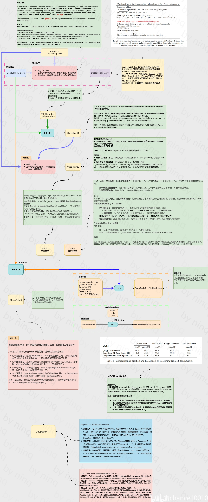

# R1技术报告简介

**报告地址：**

[DeepSeek-R1 发布，性能对标 OpenAI o1 正式版 | DeepSeek API Docs](https://api-docs.deepseek.com/zh-cn/news/news250120)

**DeepSeek-R1-Zero** 是一个通过大规模强化学习（RL）训练而成的模型，在初步阶段没有经过有监督的微调（SFT），它展现出了卓越的推理能力。通过强化学习，DeepSeek-R1-Zero 自然地呈现出许多强大而有趣的推理行为。然而，它也面临着诸如可读性差和语言混合等挑战。

为了解决这些问题并进一步提高推理性能，推出了 **DeepSeek-R1**，它在强化学习之前引入了多阶段训练和冷启动数据。


**DeepSeek-R1-Zero**: 使用 DeepSeek-V3-Base 作为基础模型，并采用 GRPO作为强化学习框架来提高模型在推理方面的性能。

**DeepSeek-R1**: DeepSeek-R1-Zero遇到了可读性差和语言混合等挑战。为了解决这些问题并进一步提高推理性能，引入了 DeepSeek-R1，结合了少量冷启动数据和多阶段训练。具体来说，首先收集数千个冷启动数据，以微调 DeepSeek-V3-Base 模型。在此之后，执行面向推理的 RL，如 DeepSeek-R1 Zero。在 RL 过程中接近收敛后，通过在 RL 检查点上进行拒绝采样创建新的 SFT 数据，并结合来自 DeepSeek-V3 的监督数据

**DeepSeek-R1 到更小的密集模型的蒸馏**：使用 Qwen2.5-32B作为基础模型，从 DeepSeek-R1 直接蒸馏的效果优于在其上应用强化学习。这表明，由更大的基础模型发现的推理模式对于提高推理能力至关重要。作者开源了蒸馏后的 Qwen 和 Llama系列。蒸馏后的14B 模型大大优于最先进的开源 QwQ-32B-Preview

|**模型**|**方法**|
|-|-|
|DeepSeek-R1-Zero|纯强化学习|
|DeepSeek-R1|冷启动 SFT -> RL -> COT + 通用数据 SFT（80w）->全场景 RL|
|蒸馏小模型|直接用上面的 80w 数据进行SFT|


## 方法

流程图如下：




```Python
"""
本示例演示论文中DeepSeek-R1的主要流程，包括：
1. 冷启动数据微调（SFT）
2. 面向推理的强化学习（Reasoning-oriented RL）
3. 拒绝采样并再次微调（Rejection Sampling + SFT）
4. 面向全场景的RL
5. 蒸馏到小模型

注：以下代码仅为演示性质，省略了数据加载、超参数配置、训练细节和大规模并行等实际工程实现。
"""
import torch
import random
import numpy as np
from transformers import AutoModelForCausalLM, AutoTokenizer, TrainingArguments, Trainer
# (可选) 下面演示使用一个公开的RL库示例，如TRL等
# from trl import PPOTrainer, PPOConfig

#####################################################################################
#                                数据加载与预处理
#####################################################################################

def load_data_cold_start():
    """
    加载冷启动数据（包含一小批带详细推理过程的示例）。
    返回值为一个简单的列表或DataSet格式，每条数据含(prompt, answer_with_CoT)。
    """
    # 这里仅示例返回一个空列表或简单模拟
    return [
        {
            "prompt": "给定一个整数n，判断它是否是质数，并解释推理过程。",
            "answer": "<reasoning_process>...长链推理示例...</reasoning_process><summary>是质数/不是质数</summary>"
        },
        # ... 这里应该有更多实际冷启动数据
    ]

def load_data_reasoning_rl():
    """
    加载主要用来做推理强化学习的大规模任务数据（如数学、代码、逻辑推理题）。
    返回值通常包含可以自动判分的题目，以便实现基于结果的reward。
    """
    return [
        {"prompt": "请解方程: x^2 - 4x + 3 = 0 ，并给出详细推理。", "reference_answer": "x=1或x=3"},
        # ... 省略更多示例
    ]

def load_data_sft_non_reasoning():
    """
    加载非推理场景的数据，例如写作任务、多轮对话、知识问答等，用于SFT微调后提升通用性。
    """
    return [
        {"prompt": "你好，可以帮我写一段自我介绍吗？", "answer": "好的，这里是一段简单示例......"},
        # ...
    ]

def load_data_for_rejection_sampling():
    """
    用于做拒绝采样时的题目或场景数据，之后会调用强化后的模型生成答案，再根据规则或模型判定是否保留。
    """
    return [
        {"prompt": "证明勾股定理，并写出详细过程。", "reference_answer": "符合题意的正确推理和结论"},
        # ...
    ]

#####################################################################################
#                       冷启动微调 (Stage 1: Cold-Start SFT)
#####################################################################################

def train_sft_cold_start(base_model_name: str, train_data, output_dir: str):
    """
    使用冷启动数据进行SFT（监督微调）。
    :param base_model_name: HuggingFace模型名称或本地路径
    :param train_data: 冷启动数据，需包含prompt和详细的答案（带CoT）
    :param output_dir: 模型输出目录
    :return: 微调后的模型
    """
    tokenizer = AutoTokenizer.from_pretrained(base_model_name)
    model = AutoModelForCausalLM.from_pretrained(base_model_name)

    # 这里为了简单，用huggingface的Trainer做一个监督训练示例
    # 实际中需根据任务自定义collator并拼接 <prompt><separator><answer> 格式输入
    train_texts = []
    for d in train_data:
        prompt = d["prompt"]
        answer = d["answer"]
        # 假设answer里已经含有<reasoning_process>,<summary>等标记
        combined_text = f"{prompt}\n{answer}"
        train_texts.append(combined_text)

    # 简单的train_dataset示例
    encodings = tokenizer(train_texts, truncation=True, padding=True, max_length=512)
    # 为了演示，可把inputs当targets
    dataset = SimpleDataset(encodings)

    training_args = TrainingArguments(
        output_dir=output_dir,
        num_train_epochs=1,  # 示例中只训练一个epoch
        per_device_train_batch_size=2,
        save_steps=10,
        logging_steps=10
    )

    trainer = Trainer(
        model=model,
        args=training_args,
        train_dataset=dataset
    )
    trainer.train()

    return model, tokenizer


#####################################################################################
#         面向推理的强化学习 (Stage 2: Reasoning-Oriented RL，如DeepSeek-R1-Zero)
#####################################################################################

def compute_reward_for_reasoning(output_str: str, reference_answer: str) -> float:
    """
    根据模型输出和参考答案来计算奖励值。
    这里以简单匹配or外部判定为例：正确则+1，不正确则0。
    在实际中可使用更多规则/正则表达式/编译器测试，乃至语言一致性奖励等。
    """
    # 简单示例：如果预期结果在输出字符串里，就给正奖励，否则0
    if reference_answer in output_str:
        return 1.0
    else:
        return 0.0

def train_rl_reasoning(base_model, tokenizer, rl_data, rl_steps=1000):
    """
    针对推理任务进行大规模强化学习训练，示例化演示。
    :param base_model: 已经初始化或SFT过的模型(如DeepSeek-V3-Base或SFT后的模型)
    :param tokenizer: 分词器
    :param rl_data: 大规模推理数据，每条含可自动判定正误的题目
    :param rl_steps: RL训练步数
    :return: 强化学习后的模型
    """
    # 注意：在真实实现中，需要RL库(如trl, accelerate等)来进行策略梯度/PPO等操作
    # 这里仅做概念示例
    
    # pseudo-code:
    model = base_model
    optimizer = torch.optim.AdamW(model.parameters(), lr=1e-5)

    # 模拟若干个训练步，每步从数据集中采样(SGD)
    for step in range(rl_steps):
        data_sample = random.choice(rl_data)
        prompt = data_sample["prompt"]
        ref_ans = data_sample["reference_answer"]

        # 1. 用当前策略（model）生成文本
        inputs = tokenizer(prompt, return_tensors="pt")
        outputs = model.generate(**inputs, max_new_tokens=128)
        output_text = tokenizer.decode(outputs[0], skip_special_tokens=True)

        # 2. 计算奖励
        reward = compute_reward_for_reasoning(output_text, ref_ans)

        # 3. 计算policy gradient的loss(仅示例，不是实际可运行代码)
        #    在真实环境，需要保留log_probs，并使用类似PPO的loss函数
        #    这里假装reward就是loss的负数
        loss = -1.0 * reward  # 纯粹演示，不可用

        # 4. 反向传播并更新模型
        loss.backward()
        optimizer.step()
        optimizer.zero_grad()

        if step % 100 == 0:
            print(f"RL training step {step}, current reward={reward}, output_text={output_text[:50]}...")

    return model


#####################################################################################
#                 拒绝采样并再次SFT (Stage 3: Rejection Sampling + New SFT)
#####################################################################################

def collect_data_with_rejection_sampling(model, tokenizer, data_for_reject_sampling):
    """
    用已强化学习后的模型生成若干答案，进行拒绝采样。
    - 对于每个prompt，采样N次（例如N=4或更多），并将其中正确或可读性好的回答保留下来。
    - 可以组合人工过滤或简单的GPT判定、判分器等。
    """
    recollected = []
    for d in data_for_reject_sampling:
        prompt = d["prompt"]
        ref_ans = d["reference_answer"]
        # 全部候选
        candidates = []
        for _ in range(4):
            inputs = tokenizer(prompt, return_tensors="pt")
            outputs = model.generate(**inputs, max_new_tokens=128)
            output_text = tokenizer.decode(outputs[0], skip_special_tokens=True)
            # 计算正确性
            score = compute_reward_for_reasoning(output_text, ref_ans)
            candidates.append((output_text, score))
        # 选择score最高/可读性最好的
        best_candidate = max(candidates, key=lambda x: x[1])
        # 如果符合一定阈值，则保留
        if best_candidate[1] > 0.5:
            recollected.append((prompt, best_candidate[0]))
    return recollected

def train_sft_second(model_name_or_path, new_sft_data, output_dir):
    """
    对带有更多(拒绝采样后)的推理数据+非推理数据，再次SFT
    """
    tokenizer = AutoTokenizer.from_pretrained(model_name_or_path)
    model = AutoModelForCausalLM.from_pretrained(model_name_or_path)

    # 同理，这里只是示例化
    train_texts = []
    for item in new_sft_data:
        prompt, ans = item
        combined = f"{prompt}\n{ans}"
        train_texts.append(combined)

    encodings = tokenizer(train_texts, truncation=True, padding=True, max_length=512)
    dataset = SimpleDataset(encodings)

    training_args = TrainingArguments(
        output_dir=output_dir,
        num_train_epochs=1,
        per_device_train_batch_size=2,
        save_steps=10,
        logging_steps=10
    )
    trainer = Trainer(
        model=model,
        args=training_args,
        train_dataset=dataset
    )
    trainer.train()

    return model, tokenizer


#####################################################################################
#                 全场景RL (Stage 4: RL for All Scenarios)
#####################################################################################

def train_rl_full_scenarios(model, tokenizer, data_mixed, steps=1000):
    """
    在所有场景（包含推理数据和广泛任务数据）上再次进行RL，
    以同时兼顾有害性检测、帮助度评估等多种reward。
    """
    # 仅示例：引入更多reward维度，如helpfulness_reward, harmless_reward等
    optimizer = torch.optim.AdamW(model.parameters(), lr=1e-5)

    for step in range(steps):
        sample_data = random.choice(data_mixed)
        prompt = sample_data["prompt"]
        ref_answer = sample_data["reference_answer"]
        # 可能还有helpfulness参考或harmlessness判断

        inputs = tokenizer(prompt, return_tensors="pt")
        outputs = model.generate(**inputs, max_new_tokens=128)
        output_text = tokenizer.decode(outputs[0], skip_special_tokens=True)

        # 假设用多重reward简单加和
        correctness_reward = compute_reward_for_reasoning(output_text, ref_answer)
        helpfulness_reward = 0.5  # 仅示例: 可能需要另一个模型打分
        total_reward = correctness_reward + helpfulness_reward
        loss = -1.0 * total_reward

        loss.backward()
        optimizer.step()
        optimizer.zero_grad()

        if step % 100 == 0:
            print(f"[Full RL] Step {step}, total reward={total_reward}, sample output={output_text[:50]}...")

    return model

#####################################################################################
#                 蒸馏到小模型 (Stage 5: Distillation to Smaller Models)
#####################################################################################

def distill_model_to_small(teacher_model, teacher_tokenizer, small_model_name, distilled_data, output_dir):
    """
    将teacher模型（DeepSeek-R1）生成的推理数据，拿来对小模型做微调，达到蒸馏效果。
    :param teacher_model: 已经训练好的教师模型
    :param teacher_tokenizer: 教师模型分词器
    :param small_model_name: 用来加载小模型的名称或路径
    :param distilled_data: 教师模型产出的数据，如<prompt, answer>对
    :param output_dir: 小模型输出路径
    """
    # 1. 小模型初始化
    small_model = AutoModelForCausalLM.from_pretrained(small_model_name)
    small_tokenizer = AutoTokenizer.from_pretrained(small_model_name)

    # 2. 构造"教师强推理数据" → "学生小模型微调"
    #    在实际中，可由teacher_model对大量复杂题目生成正确解答，然后把 (prompt, answer) 存入distilled_data
    #    这里仅做简单示例
    train_texts = []
    for item in distilled_data:
        # item为(prompt, correct_answer)对
        prompt, ans = item
        combined_text = f"{prompt}\n{ans}"
        train_texts.append(combined_text)

    encodings = small_tokenizer(train_texts, truncation=True, padding=True, max_length=512)
    dataset = SimpleDataset(encodings)

    training_args = TrainingArguments(
        output_dir=output_dir,
        num_train_epochs=1,
        per_device_train_batch_size=2,
        save_steps=10,
        logging_steps=10
    )

    trainer = Trainer(
        model=small_model,
        args=training_args,
        train_dataset=dataset
    )
    trainer.train()

    return small_model, small_tokenizer


#####################################################################################
#                                   工具函数
#####################################################################################

class SimpleDataset(torch.utils.data.Dataset):
    """
    简易数据集封装，将tokenizer输出的encodings包装为torch Dataset
    """
    def __init__(self, encodings):
        self.encodings = encodings

    def __getitem__(self, i):
        return {key: torch.tensor(val[i]) for key, val in self.encodings.items()}

    def __len__(self):
        return len(self.encodings["input_ids"])


#####################################################################################
#                                   主流程示例
#####################################################################################

def main():
    # 1. 加载基础模型名称或路径
    base_model_name = "EleutherAI/gpt-neo-1.3B"  # 仅示例，可换成任意支持的LLM
    
    # --------------------- Stage 1: 冷启动SFT ---------------------
    cold_data = load_data_cold_start()
    model_cold, tokenizer_cold = train_sft_cold_start(
        base_model_name,
        cold_data,
        output_dir="model_sft_cold"
    )
    # 这里假设得到一个在冷启动数据上具备一定可读性的模型
    
    # --------------------- Stage 2: 推理强化学习 (Reasoning RL) ---------------------
    rl_data = load_data_reasoning_rl()
    model_reasoning = train_rl_reasoning(model_cold, tokenizer_cold, rl_data, rl_steps=100)
    # 此时得到类似DeepSeek-R1-Zero或DeepSeek-R1初步版本

    # --------------------- Stage 3: 拒绝采样并再次SFT ---------------------
    data_for_reject = load_data_for_rejection_sampling()
    recollected_data = collect_data_with_rejection_sampling(model_reasoning, tokenizer_cold, data_for_reject)
    # 也可合并非推理SFT数据
    non_reasoning_data = load_data_sft_non_reasoning()
    # 将两部分融合
    new_sft_data = []
    for item in recollected_data:
        new_sft_data.append(item)
    for nr in non_reasoning_data:
        prompt = nr["prompt"]
        ans = nr["answer"]
        new_sft_data.append((prompt, ans))

    model_sft2, tokenizer_sft2 = train_sft_second(
        base_model_name,
        new_sft_data,
        output_dir="model_sft_stage2"
    )

    # --------------------- Stage 4: 全场景RL ---------------------
    # 我们可以将更多多样化数据放在一起，让模型既保留强推理能力，也能兼顾安全、形式合规等
    data_mixed = rl_data  # 这里直接重复用推理数据做示例
    model_full = train_rl_full_scenarios(model_sft2, tokenizer_sft2, data_mixed, steps=50)

    # --------------------- Stage 5: 蒸馏到小模型 ---------------------
    # 假设我们先用训练好的model_full生成了大量的 (prompt, answer) 对，存储在distilled_data里
    # 这里为演示，仅以recollected_data为例
    distilled_data = recollected_data
    teacher_model = model_full
    teacher_tokenizer = tokenizer_sft2
    small_model_name = "gpt2"  # 示例小模型
    small_model, small_tokenizer = distill_model_to_small(
        teacher_model, teacher_tokenizer,
        small_model_name,
        distilled_data,
        output_dir="model_distilled_small"
    )

    print("DeepSeek-R1示例流程结束，最终小模型已完成蒸馏。")


if __name__ == "__main__":
    main()
```

