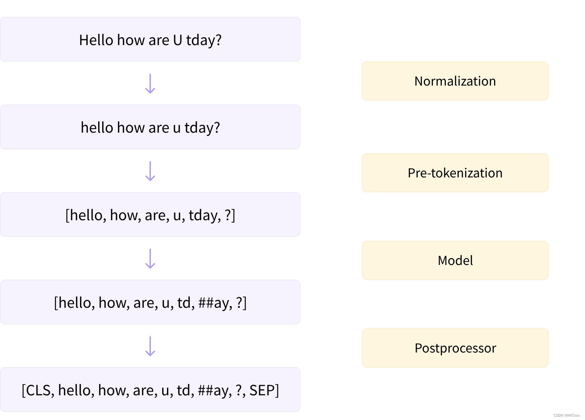

在深入探讨Transformer模型中常用的三种子词分词算法（Byte-Pair Encoding [BPE]、WordPiece和Unigram）之前，我们先来看看每个分词器对文本进行预处理的步骤。这是分词流程的高级概述：



在将文本分割成子词（根据模型需求）之前，分词器会执行两个步骤：**归一化**和**预分词**。

## **归一化**

归一化步骤包括一些通用的清理工作，如删除不必要的空格、小写转换以及移除重音符号。如果你了解[Unicode归一化](http://www.unicode.org/reports/tr15/)（如NFC或NFKC），那么这可能也是分词器会应用的。

🤗 Transformers的`tokenizer`对象有一个名为`backend_tokenizer`的属性，可以访问到🤗 Tokenizers库的底层分词器：

```
from transformers import AutoTokenizer

tokenizer = AutoTokenizer.from_pretrained("bert-base-uncased")
print(type(tokenizer.backend_tokenizer))
```

```
<class 'tokenizers.Tokenizer'>
```

`tokenizer`对象的`normalizer`属性有一个`normalize_str()`方法，我们可以用它来查看归一化是如何进行的：

```
print(tokenizer.backend_tokenizer.normalizer.normalize_str("Héllò hôw are ü?"))
```

```
'hello how are u?'
```

## Pre-tokenization

如接下来的章节所述，分词器不能直接对原始文本进行训练。相反，我们首先需要将文本分割成小片段，如单词。这就是预分词步骤的作用。如我们在[第2章](https://huggingface.co/course/chapter2)中所见，基于单词的分词器可以简单地将原始文本按空格和标点符号分割成单词。这些单词将成为分词器在训练过程中学习的子词边界。

要查看快速分词器如何进行预分词，我们可以使用`tokenizer`对象的`pre_tokenizer`属性的`pre_tokenize_str()`方法：

```
tokenizer.backend_tokenizer.pre_tokenizer.pre_tokenize_str("Hello, how are  you?")
```

```
[('Hello', (0, 5)), (',', (5, 6)), ('how', (7, 10)), ('are', (11, 14)), ('you', (16, 19)), ('?', (19, 20))]
```

注意分词器已经在跟踪偏移量，这是它如何提供上一节中使用的偏移量映射的方式。在这个例子中，分词器忽略了两个空格，并将它们替换为一个，但`are`和`you`之间的偏移量跳跃是为了反映这一点。

| **模型** | **BPE**                                        | **WordPiece**                                                | **Unigram**                                        |
| -------- | ---------------------------------------------- | ------------------------------------------------------------ | -------------------------------------------------- |
| 训练     | 从一个小词汇表开始，学习合并令牌的规则         | 从一个小词汇表开始，学习合并令牌的规则                       | 从一个大词汇表开始，学习移除令牌的规则             |
| 训练步骤 | 合并最常见对的令牌                             | 合并频率最高的对的令牌，优先考虑每个令牌频率较低的对，以提高整体频率 | 移除词汇表中所有最小化整个语料库损失的令牌         |
| 学习内容 | 合并规则和词汇表                               | 只有词汇表                                                   | 每个令牌的分数的词汇表                             |
| 编码     | 将单词分割成字符，然后应用训练中学到的合并规则 | 从开头开始查找最长的在词汇表中的子词，然后对剩余部分做同样的操作 | 找到最可能的分割成令牌的方式，使用训练中学到的分数 |

