# 图解GPT

内容组织：

- 图解GPT
  - 什么是语言模型
    - 自编码（auto-encoder）语言模型
    - 自回归（auto-regressive）语言模型
  - 基于Transformer的语言模型
  - Transformer进化
  - GPT2概述
  - GPT2详解
    - 输入编码
    - 多层Decoder
    - Decoder中的Self-Attention
  - 详解Self-Attention
    - 可视化Self-Attention
    - 图解Masked Self-attention
    - GPT2中的Self-Attention
    - GPT2全连接神经网络
  - 语言模型应用
    - 机器翻译
    - 生成摘要
    - 迁移学习
    - 音乐生成
  - 总结
  - 致谢

除了BERT以外，另一个预训练模型GPT也给NLP领域带来了不少轰动，本节也对GPT做一个详细的讲解。

OpenAI提出的GPT-2模型(https://openai.com/blog/better-language-models/)能够写出连贯并且高质量的文章，比之前语言模型效果好很多。GPT-2是基于Transformer搭建的，相比于之前的NLP语言模型的区别是：基于Transformer大模型、，在巨大的数据集上进行了预训练。在本章节中，我们将对GPT-2的结构进行分析，对GPT-2的应用进行学习，同时还会深入解析所涉及的self-attention结构。本文可以看作是篇章2.2图解Transformer、2.3图解BERT的一个补充。

这篇文章翻译自[GPT2](http://jalammar.github.io/illustrated-gpt2)。

## 语言模型和GPT-2

### 什么是语言模型

本文主要描述和对比2种语言模型：

- 自编码（auto-encoder）语言模型
- 自回归（auto-regressive）语言模型


先看自编码语言模型。
自编码语言模型典型代表就是篇章2.3所描述的BERT。如下图所示，自编码语言模型通过随机Mask输入的部分单词，然后预训练的目标是预测被Mask的单词，不仅可以融入上文信息，还可以自然的融入下文信息。

图： BERT mask

自编码语言模型的优缺点：

- 优点：自然地融入双向语言模型，同时看到被预测单词的上文和下文
- 缺点：训练和预测不一致。训练的时候输入引入了[Mask]标记，但是在预测阶段往往没有这个[Mask]标记，导致预训练阶段和Fine-tuning阶段不一致。

接着我们来看看什么是常用的自回归（auto-regressive）语言模型：语言模型根据输入句子的一部分文本来预测下一个词。日常生活中最常见的语言模型就是输入法提示，它可以根据你输入的内容，提示下一个单词。

 

图：输入提示

自回归语言模型的优点和缺点：

- 优点：对于生成类的NLP任务，比如文本摘要，机器翻译等，从左向右的生成内容，天然和自回归语言模型契合。
- 缺点：由于一般是从左到右（当然也可能从右到左），所以只能利用上文或者下文的信息，不能同时利用上文和下文的信息。

GPT-2属于自回归语言模型，相比于手机app上的输入提示，GPT-2更加复杂，功能也更加强大。因为，OpenAI的研究人员从互联网上爬取了40GB的WebText数据集，并用该数据集训练了GPT-2模型。我们可以直接在[AllenAI GPT-2 Explorer网站](https://gpt2.apps.allenai.org/?text=Joel)上试用GPT-2模型。
图：自回归GPT-2

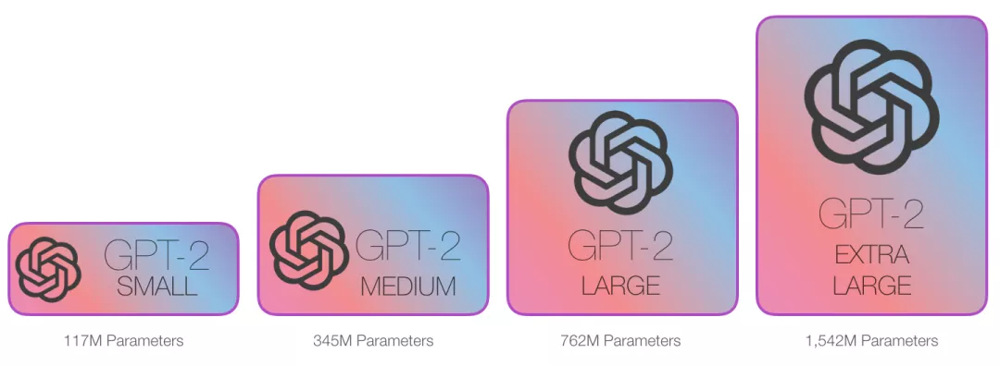图：多种GPT模型

### 基于Transformer的语言模型

正如我们在图解Transformer所学习的，原始的Transformer模型是由 Encoder部分和Decoder部分组成的，它们都是由多层transformer堆叠而成的。原始Transformer的seq2seq结构很适合机器翻译，因为机器翻译正是将一个文本序列翻译为另一种语言的文本序列。

图：原始Transformer结构

但如果要使用Transformer来解决语言模型任务，并不需要完整的Encoder部分和Decoder部分，于是在原始Transformer之后的许多研究工作中，人们尝试只使用Transformer Encoder或者Decoder，并且将它们堆得层数尽可能高，然后使用大量的训练语料和大量的计算资源（数十万美元用于训练这些模型）进行预训练。比如BERT只使用了Encoder部分进行masked language model（自编码）训练，GPT-2便是只使用了Decoder部分进行自回归（auto regressive）语言模型训练。
图：GPT、BERT、Transformer-XL

图：层数越来越多的GPT2模型


### Transformer进化

Transformer的Encoder进化成了BERT，Decoder进化成了GPT2。

首先看Encoder部分。


图：encoder

原始的Transformer论文中的Encoder部分接受特定长度的输入（如 512 个 token）。如果一个输入序列比这个限制短，我们可以使用pad填充序列的其余部分。如篇章2.3所讲，BERT直接使用了Encoder部分。

再回顾下Decoder部分
与Encoder相比，Decoder部分多了一个Encoder-Decoder self-attention层，使Decoder可以attention到Encoder编码的特定的信息。

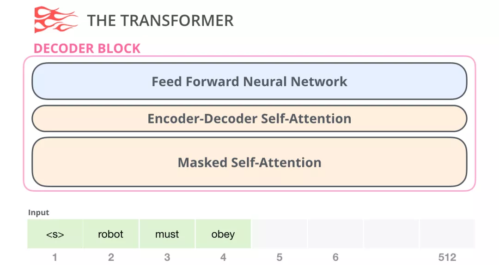图： decoder

Decoder中的的 Masked Self-Attention会屏蔽未来的token。具体来说，它不像 BERT那样直接将输入的单词随机改为mask，而是通过改变Self-Attention的计算，来屏蔽未来的单词信息。

例如，我们想要计算位置4的attention，我们只允许看到位置4以前和位置4的token。

图： decoder只能看到以前和现在的token

由于GPT2基于Decoder构建，所以BERT和GPT的一个重要区别来了：由于BERT是基于Encoder构建的，BERT使用是Self Attention层，而GPT2基于Decoder构建，GPT-2 使用masked Self Attention。一个正常的 Self Attention允许一个位置关注到它两边的信息，而masked Self Attention只让模型看到左边的信息：

图： self attention vs mask self attention

那么GPT2中的Decoder长什么样子呢？先要说一下[Generating Wikipedia by Summarizing Long Sequences](https://arxiv.org/pdf/1801.10198.pdf)这篇文章，它首先提出基于Transformer-Decoder部分进行语言模型训练。由于去掉了Encoder部分，于是Encoder-Decoder self attention也不再需要，新的Transformer-Decoder模型如下图所示：

图： transformer-decoder

随后OpenAI的GPT2也使用的是上图的Transformer-Decoder结构。

### GPT2概述

现在来拆解一个训练好的GPT-2，看看它是如何工作的。

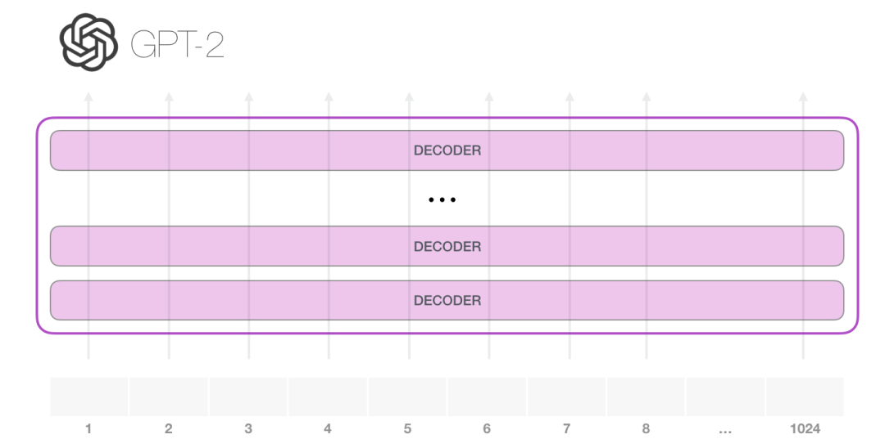图：拆解GPT2

GPT-2能够处理1024 个token。每个token沿着自己的路径经过所有的Decoder层。试用一个训练好的GPT-2模型的最简单方法是让它自己生成文本（这在技术上称为：生成无条件文本）。或者，我们可以给它一个提示，让它谈论某个主题（即生成交互式条件样本）。

在漫无目的情况下，我们可以简单地给它输入一个特殊的\<s>初始token，让它开始生成单词。如下图所示：


图：GPT2初始token

由于模型只有一个输入，因此只有一条活跃路径。\<s> token在所有Decoder层中依次被处理，然后沿着该路径生成一个向量。根据这个向量和模型的词汇表给所有可能的词计算出一个分数。在下图的例子中，我们选择了概率最高的 the。下一步，我们把第一步的输出添加到我们的输入序列，然后让模型做下一个预测。


动态图：拆解GPT2

请注意，第二条路径是此计算中唯一活动的路径。GPT-2 的每一层都保留了它对第一个 token所编码的信息，而且会在处理第二个 token 时直接使用它：GPT-2 不会根据第2个 token 重新计算第一个 token。

不断重复上述步骤，就可以生成更多的单词了。


### GPT2详解

#### 输入编码

现在我们更深入了解和学习GPT，先看从输入开始。与之前我们讨论的其他 NLP 模型一样，GPT-2 在嵌入矩阵中查找输入的单词的对应的 embedding 向量。如下图所示：每一行都是词的 embedding：这是一个数值向量，可以表示一个词并捕获一些含义。这个向量的大小在不同的 GPT-2 模型中是不同的。最小的模型使用的 embedding 大小是 768。

图：token embedding

于是在开始时，我们会在嵌入矩阵查找第一个 token \<s> 的 embedding。在把这个 embedding 传给模型的第一个模块之前，我们还需要融入位置编码（参考篇章2.2详解Transformer），这个位置编码能够指示单词在序列中的顺序。

图：位置编码

图： token+position

于是输入的处理：得到词向量+位置编码

#### 多层Decoder

第一层Decoder现在可以处理 \<s> token所对应的向量了：首先通过 Self Attention 层，然后通过全连接神经网络。一旦Transformer 的第1个Decoder处理了\<s> token，依旧可以得到一个向量，这个结果向量会再次被发送到下一层Decoder。

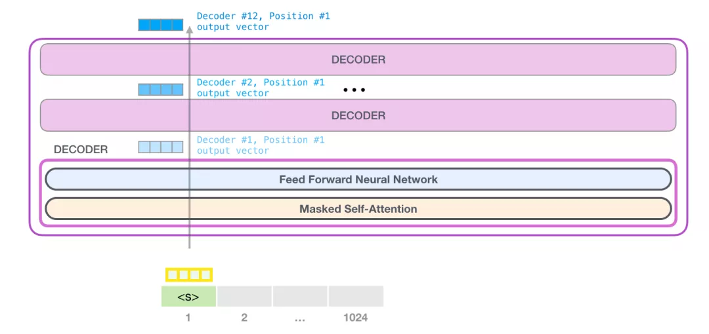图：多层编码

#### Decoder中的Self-Attention

Decoder中包含了Masked Self-Attention，由于Mask的操作可以独立进行，于是我们先独立回顾一下self-attention操作。语言严重依赖于上下文。给个例子：

```
机器人第2定律：机器人必须服从人给予 它 的命令，当 该命令 与 第一定律 冲突时例外。
```

例句中包含了多个代词。如果不结合它们所指的上下文，就无法理解或者处理这些词。当一个模型处理这个句子，它必须能够知道：

- 它 指的是机器人
- 该命令 指的是这个定律的前面部分，也就是 人给予 它 的命令
- 第一定律 指的是机器人第一定律

self-attention所做的事情是：它通过对句子片段中每个词的相关性打分，并将这些词的表示向量根据相关性加权求和，从而让模型能够将词和其他相关词向量的信息融合起来。

举个例子，如下图所示，最顶层的Decoder中的 Self Attention 层在处理单词 `it` 的时候关注到` a robot`。于是self-attention传递给后续神经网络的`it` 向量，是3个单词对应的向量和它们各自分数的加权和。


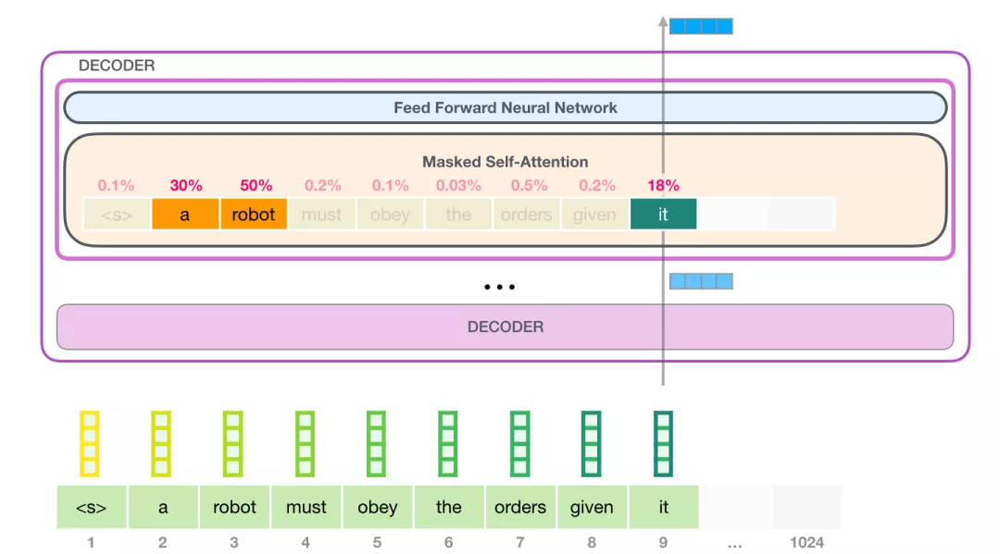图：it的attention

**Self-Attention 过程**

Self-Attention 沿着句子中每个 token 进行处理，主要组成部分包括 3 个向量。

- Query：Query 向量是由当前词的向量表示获得，用于对其他所有单词（使用这些单词的 key 向量）进行评分。
- Key：Key 向量由句子中的所有单词的向量表示获得，可以看作一个标识向量。
- Value：Value 向量在self-attention中与Key向量其实是相同的。

图： query

一个粗略的类比是把它看作是在一个文件柜里面搜索，Query 向量是一个便签，上面写着你正在研究的主题，而 Key 向量就像是柜子里的文件夹的标签。当你将便签与标签匹配时，我们取出匹配的那些文件夹的内容，这些内容就是 Value 向量。但是你不仅仅是寻找一个 Value 向量，而是找到一系列Value 向量。

将 Query 向量与每个文件夹的 Key 向量相乘，会为每个文件夹产生一个分数（从技术上来讲：点积后面跟着 softmax）。

图： score

我们将每个 Value 向量乘以对应的分数，然后求和，就得到了 Self Attention 的输出。

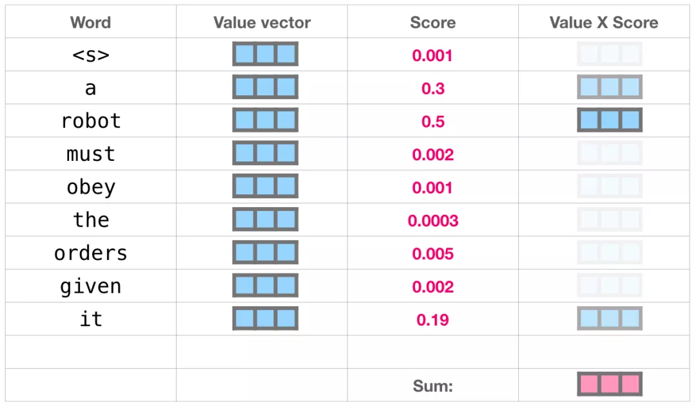图：Self Attention 的输出

这些加权的 Value 向量会得到一个向量，比如上图，它将 50% 的注意力放到单词 robot 上，将 30% 的注意力放到单词 a，将 19% 的注意力放到单词 it。

而所谓的Masked self attention指的的是：将mask位置对应的的attention score变成一个非常小的数字或者0，让其他单词再self attention的时候（加权求和的时候）不考虑这些单词。

**模型输出**

当模型顶部的Decoder层产生输出向量时（这个向量是经过 Self Attention 层和神经网络层得到的），模型会将这个向量乘以一个巨大的嵌入矩阵（vocab size x embedding size）来计算该向量和所有单词embedding向量的相关得分。

图：顶部的模块产生输出

回忆一下，嵌入矩阵中的每一行都对应于模型词汇表中的一个词。这个相乘的结果，被解释为模型词汇表中每个词的分数，经过softmax之后被转换成概率。

图：token概率

我们可以选择最高分数的 token（top_k=1），也可以同时考虑其他词（top k）。假设每个位置输出k个token，假设总共输出n个token，那么基于n个单词的联合概率选择的输出序列会更好。

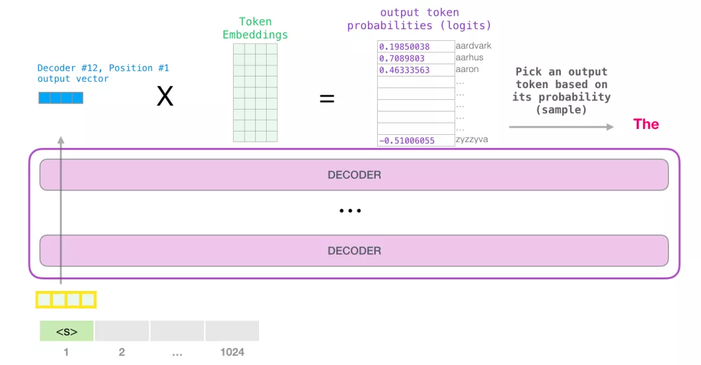图：top 1选择输出

这样，模型就完成了一次迭代，输出一个单词。模型会继续迭代，直到所有的单词都已经生成，或者直到输出了表示句子末尾的 token。

## 详解Self-Attention

现在我们基本知道了 GPT-2 是如何工作的。如果你想知道 Self Attention 层里面到底发生了什么，那么文章接下来的额外部分就是为你准备的，我添加这个额外的部分，来使用更多可视化解释 Self Attention，

在这里指出文中一些过于简化的说法：

- 我在文中交替使用 token 和 词。但实际上，GPT-2 使用 Byte Pair Encoding 在词汇表中创建 token。这意味着 token 通常是词的一部分。
- 我们展示的例子是在推理模式下运行。这就是为什么它一次只处理一个 token。在训练时，模型将会针对更长的文本序列进行训练，并且同时处理多个 token。同样，在训练时，模型会处理更大的 batch size，而不是推理时使用的大小为 1 的 batch size。
- 为了更加方便地说明原理，我在本文的图片中一般会使用行向量。但有些向量实际上是列向量。在代码实现中，你需要注意这些向量的形式。
- Transformer 使用了大量的层归一化（layer normalization），这一点是很重要的。我们在图解Transformer中已经提及到了一部分这点，但在这篇文章，我们会更加关注 Self Attention。
- 有时我需要更多的框来表示一个向量，例如下面这幅图：

图：输入与输出维度

### 可视化Self-Attention

在这篇文章的前面，我们使用了这张图片来展示：Self Attention如何处理单词 `it`。

图：it的attention

在这一节，我们会详细介绍如何实现这一点。请注意，我们会讲解清楚每个单词都发生了什么。这就是为什么我们会展示大量的单个向量，而实际的代码实现，是通过巨大的矩阵相乘来完成的。

让我们看看一个简单的Transformer，假设它一次只能处理 4 个 token。

Self-Attention 主要通过 3 个步骤来实现：

- 为每个路径创建 Query、Key、Value 矩阵。
- 对于每个输入的 token，使用它的 Query 向量为所有其他的 Key 向量进行打分。
- 将 Value 向量乘以它们对应的分数后求和。

图：3步

(1) 创建 Query、Key 和 Value 向量

让我们关注第一条路径。我们会使用它的 Query 向量，并比较所有的 Key 向量。这会为每个 Key 向量产生一个分数。Self Attention 的第一步是为每个 token 的路径计算 3 个向量。

图：第1步

(2) 计算分数

现在我们有了这些向量，我们只对步骤 2 使用 Query 向量和 Value 向量。因为我们关注的是第一个 token 的向量，我们将第一个 token 的 Query 向量和其他所有的 token 的 Key 向量相乘，得到 4 个 token 的分数。

图：第2步

(3) 计算和

我们现在可以将这些分数和 Value 向量相乘。在我们将它们相加后，一个具有高分数的 Value 向量会占据结果向量的很大一部分。

图：第3步

分数越低，Value 向量就越透明。这是为了说明，乘以一个小的数值会稀释 Value 向量。

如果我们对每个路径都执行相同的操作，我们会得到一个向量，可以表示每个 token，其中包含每个 token 合适的上下文信息。这些向量会输入到 Transformer 模块的下一个子层（前馈神经网络）。

图：汇总


### 图解Masked Self-attention

现在，我们已经了解了 Transformer 的 Self Attention 步骤，现在让我们继续研究 masked Self Attention。Masked Self Attention 和 Self Attention 是相同的，除了第 2 个步骤。

现在假设模型有2个 token 作为输入，我们正在观察（处理）第二个 token。在这种情况下，最后 2 个 token 是被屏蔽（masked）的。所以模型会干扰评分的步骤。它总是把未来的 token 评分设置为0，因此模型不能看到未来的词，如下图所示：

图：masked self attention

这个屏蔽（masking）经常用一个矩阵来实现，称为 attention mask矩阵。依旧以4个单词的序列为例（例如：robot must obay orders）。在一个语言建模场景中，这个序列会分为 4 个步骤处理：每个步骤处理一个词（假设现在每个词就是是一个token）。另外，由于模型是以 batch size 的形式工作的，我们可以假设这个简单模型的 batch size 为4，它会将4个序列生成任务作为一个 batch 处理，如下图所示，左边是输入，右边是label。

图：batch形式的输入和输出

在矩阵的形式中，我们使用Query 矩阵和 Key 矩阵相乘来计算分数。将其可视化如下。但注意，单词无法直接进行矩阵运算，所以下图的单词还需要对应成一个向量。

图：Query和Keys的相关矩阵

在做完乘法之后，我们加上三角形的 attention mask。它将我们想要屏蔽的单元格设置为负无穷大或者一个非常大的负数（例如 GPT-2 中的 负十亿）：

图：加上attetnion的mask

然后对每一行应用 softmax，会产生实际的分数，我们会将这些分数用于 Self Attention。

图：softmax

这个分数表的含义如下：

- 当模型处理数据集中的第 1 个数据（第 1 行），其中只包含着一个单词 （robot），它将 100% 的注意力集中在这个单词上。
- 当模型处理数据集中的第 2 个数据（第 2 行），其中包含着单词（robot must）。当模型处理单词 must，它将 48% 的注意力集中在 robot，将 52% 的注意力集中在 must。
- 诸如此类，继续处理后面的单词。

到目前为止，我们就搞明白了mask self attention啦。

### GPT2中的Self-Attention

让我们更详细地了解 GPT-2的masked self attention。

*模型预测的时候：每次处理一个 token*

但我们用模型进行预测的时候，模型在每次迭代后只添加一个新词，那么对于已经处理过的token来说，沿着之前的路径重新计算 Self Attention 是低效的。那么GPT-2是如何实现高效处理的呢？

先处理第一个token a，如下图所示（现在暂时忽略 \<s>）。

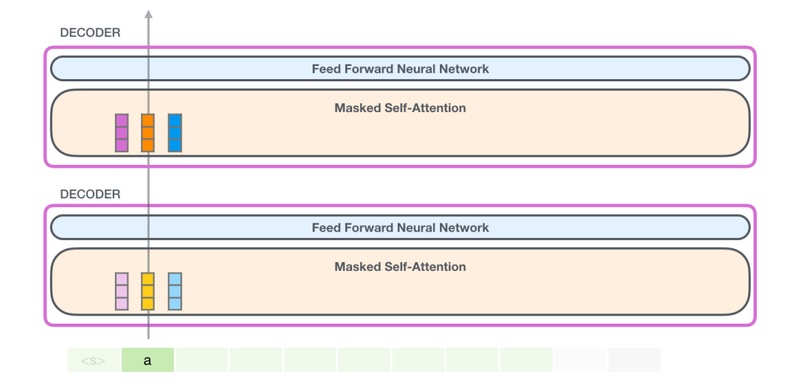图：gpt2第一个token

GPT-2 保存 token `a` 的 Key 向量和 Value 向量。每个 Self Attention 层都持有这个 token 对应的 Key 向量和 Value 向量：

图：gpt2的词a

现在在下一个迭代，当模型处理单词 robot，它不需要生成 token a 的 Query、Value 以及 Key 向量。它只需要重新使用第一次迭代中保存的对应向量：

图：gpt2的词robot

`(1) 创建 Query、Key 和 Value 矩阵`

让我们假设模型正在处理单词 `it`。进入Decoder之前，这个 token 对应的输入就是 `it` 的 embedding 加上第 9 个位置的位置编码：

图：处理it

Transformer 中每个层都有它自己的参数矩阵（在后文中会拆解展示）。embedding向量我们首先遇到的权重矩阵是用于创建 Query、Key、和 Value 向量的。

图：处理it

Self-Attention 将它的输入乘以权重矩阵（并添加一个 bias 向量，此处没有画出)

这个相乘会得到一个向量，这个向量是 Query、Key 和 Value 向量的拼接。
图：Query、Key 和 Value


得到Query、Key和Value向量之后，我们将其拆分multi-head，如下图所示。其实本质上就是将一个大向量拆分为多个小向量。

图：multi head

为了更好的理解multi head，我们将其进行如下展示：


图：multi head

`(2) 评分`

我们现在可以继续进行评分，假设我们只关注一个 attention head（其他的 attention head 也是在进行类似的操作）。

图：打分

现在，这个 token 可以根据其他所有 token 的 Key 向量进行评分（这些 Key 向量是在前面一个迭代中的第一个 attention head 计算得到的）：

图： 加权和

`(3) 求和`

正如我们之前所看的那样，我们现在将每个 Value 向量乘以对应的分数，然后加起来求和，得到第一个 attention head 的 Self Attention 结果：

图：

`合并 attention heads`

multi head对应得到多个加权和向量，我们将他们都再次拼接起来：

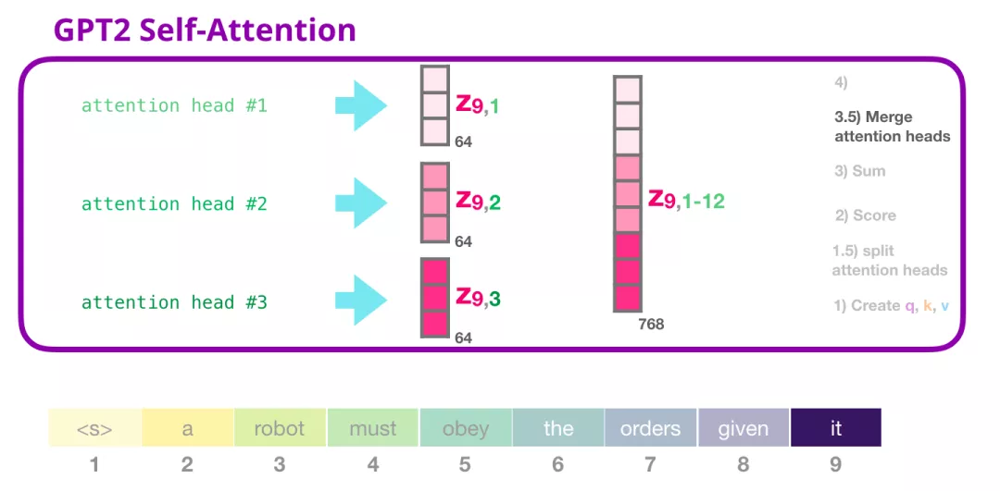图：拼接multi head多个加权和向量

再将得到的向量经过一个线性映射得到想要的维度，随后输入全连接网络。

`(4) 映射（投影）`

我们将让模型学习如何将拼接好的 Self Attention 结果转换为前馈神经网络能够处理的输入。在这里，我们使用第二个巨大的权重矩阵，将 attention heads 的结果映射到 Self Attention 子层的输出向量：

图：映射

通过以上步骤，我们产生了一个向量，我们可以把这个向量传给下一层：

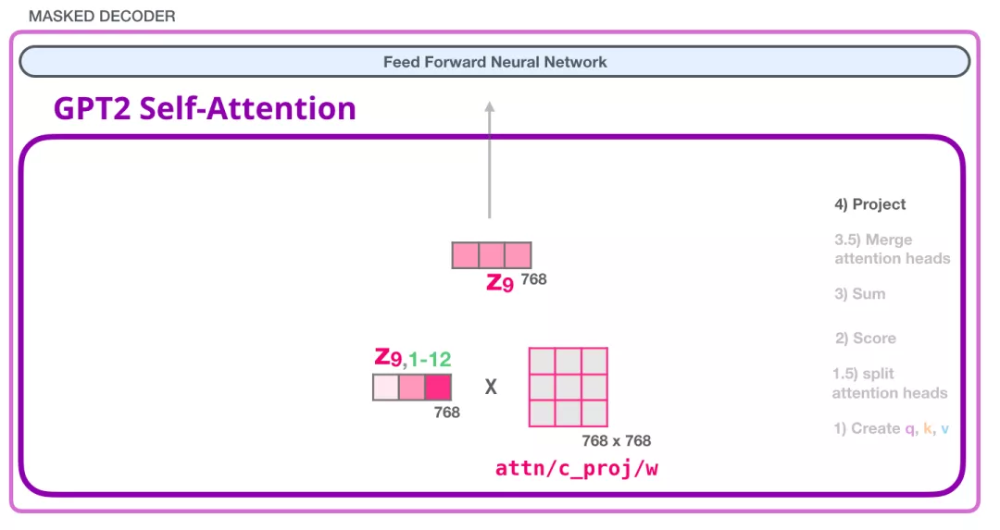图：传给下一层

### GPT-2 全连接神经网络

`第 1 层`

全连接神经网络是用于处理 Self Attention 层的输出，这个输出的表示包含了合适的上下文。全连接神经网络由两层组成。第一层是模型大小的 4 倍（由于 GPT-2 small 是 768，因此这个网络会有3072个神经元）。


动态图：全连接层

没有展示 bias 向量

`第 2 层. 把向量映射到模型的维度`

第 2 层把第一层得到的结果映射回模型的维度（在 GPT-2 small 中是 768）。这个相乘的结果是 Transformer 对这个 token 的输出。

图：全连接层

没有展示 bias 向量

总结一下，我们的输入会遇到下面这些权重矩阵：

图：汇总

每个模块都有它自己的权重。另一方面，模型只有一个 token embedding 矩阵和一个位置编码矩阵。


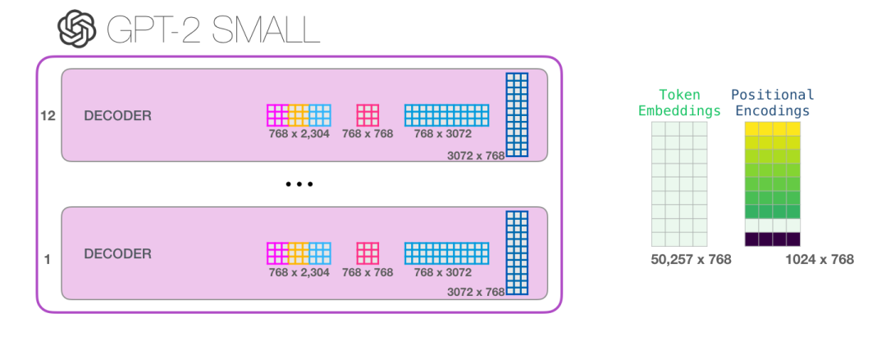图：总结

如果你想查看模型的所有参数，我在这里对它们进行了统计：

图：总结
由于某些原因，它们加起来是 124 M，而不是 117 M。我不确定这是为什么，但这个就是在发布的代码中展示的大小（如果我错了，请纠正我）。

## 语言模型应用

只有 Decoder 的 Transformer 在语言模型之外一直展现出不错的效果。它已经被成功应用在了许多应用中，我们可以用类似上面的可视化来描述这些成功应用。让我们看看这些应用，作为这篇文章的结尾。

### 机器翻译

进行机器翻译时，Encoder 不是必须的。我们可以用只有 Decoder 的 Transformer 来解决同样的任务：

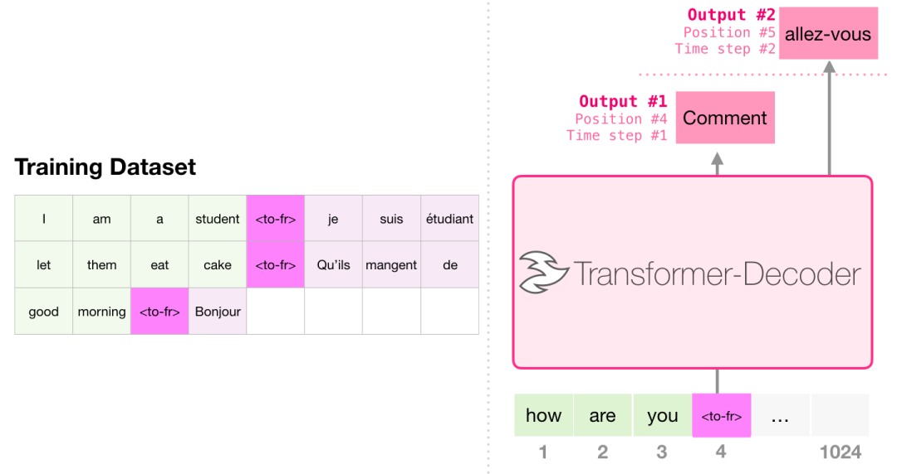图：翻译

### 生成摘要

这是第一个只使用 Decoder 的 Transformer 来训练的任务。它被训练用于阅读一篇维基百科的文章（目录前面去掉了开头部分），然后生成摘要。文章的实际开头部分用作训练数据的标签：
图：

论文里针对维基百科的文章对模型进行了训练，因此这个模型能够总结文章，生成摘要：

图：摘要

### 迁移学习

在 Sample Efficient Text Summarization Using a Single Pre-Trained Transformer(https://arxiv.org/abs/1905.08836) 中，一个只有 Decoder 的 Transformer 首先在语言模型上进行预训练，然后微调进行生成摘要。结果表明，在数据量有限制时，它比预训练的 Encoder-Decoder Transformer 能够获得更好的结果。

GPT-2 的论文也展示了在语言模型进行预训练的生成摘要的结果。

### 音乐生成

Music Transformer(https://magenta.tensorflow.org/music-transformer) 论文使用了只有 Decoder 的 Transformer 来生成具有表现力的时序和动态性的音乐。音乐建模 就像语言建模一样，只需要让模型以无监督的方式学习音乐，然后让它采样输出（前面我们称这个为 漫步）。

你可能会好奇在这个场景中，音乐是如何表现的。请记住，语言建模可以把字符、单词、或者单词的一部分（token），表示为向量。在音乐表演中（让我们考虑一下钢琴），我们不仅要表示音符，还要表示速度--衡量钢琴键被按下的力度。

图：音乐生成

一场表演就是一系列的 one-hot 向量。一个 midi 文件可以转换为下面这种格式。论文里使用了下面这种输入序列作为例子：

图：音乐生成


这个输入系列的 one-hot 向量表示如下：

图：音乐生成

我喜欢论文中的音乐 Transformer 展示的一个 Self Attention 的可视化。我在这基础之上添加了一些注释：

图：音乐生成

这段音乐有一个反复出现的三角形轮廓。Query 矩阵位于后面的一个峰值，它注意到前面所有峰值的高音符，以知道音乐的开头。这幅图展示了一个 Query 向量（所有 attention 线的来源）和前面被关注的记忆（那些受到更大的softmax 概率的高亮音符）。attention 线的颜色对应不同的 attention heads，宽度对应于 softmax 概率的权重。

## 总结

现在，我们结束了 GPT-2 的旅程，以及对其父模型（只有 Decoder 的 Transformer）的探索。我希望你看完这篇文章后，能对 Self Attention 有一个更好的理解，也希望你能对 Transformer 内部发生的事情有更多的理解。


## 致谢

主要由哈尔滨工业大学张贤同学翻译（经过原作者授权）撰写，由多多同学组织和整理。

