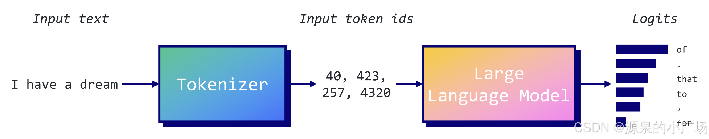
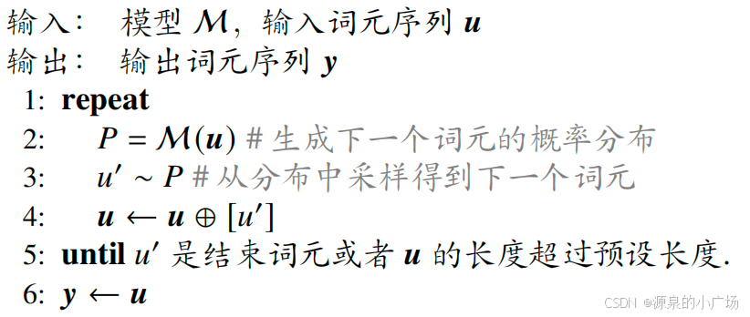
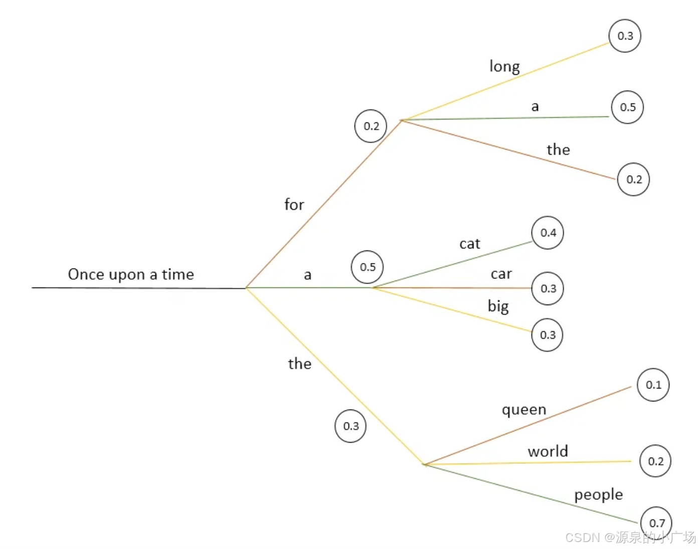
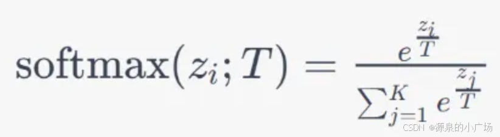

# LLM生成/预测

大模型的生成过程本质上是一种概率采样机制。在这个过程中，模型根据输入信息预测每个词汇出现的概率，并逐步生成文本。因此，选择合适的解码策略至关重要，因为它直接影响到生成内容的质量和连贯性。

解码策略不仅决定了生成的文本是否符合上下文的逻辑，还影响到文本的多样性和创造性。不同的解码策略，如贪心搜索、束搜索和采样方法（如top-k和核采样），在输出内容时展现出不同的特点。例如，贪心搜索可能会快速找到一个可行的输出，但可能缺乏多样性；而束搜索则能够在生成过程中保持多个候选文本，从而提高输出的质量。

## 语言模型生成文本过程描述

语言模型通过根据输入上下文预测序列中的下一个token来生成文本。此过程始于将输入文本分解为可管理的片段或token。

token可以是单个字符或整个单词或短语，具体取决于模型的设计以及捕捉的语言细节水平。词级tokenizer将文本分割为完整单词，而子词tokenizer则将单词分解为更小的单位，如前缀、词根和后缀。子词tokenizer在词汇大小和处理未知词汇的能力之间取得了平衡。

每个token由一个整数表示，将其映射到模型词汇中的唯一标识符。该词汇是模型识别的所有唯一token的预定义列表，类似于语言字典。例如，“beyond”可能被分配为整数1234，而子词“be”可能被分配为5678。

在tokenize之后，token的数值表示将由模型处理，其中包括神经网络层和Transformer中的自注意力机制。这些组件协同工作以预测序列中的下一个token。

在最后一层中，模型将输入序列转换为logit向量，每个条目表示词汇中每个token的得分。这些logits指示每个token在序列中作为下一个token的可能性，但它们不是概率且总和不等于1。



softmax函数将logits转换为概率。它将logits缩放到0和1之间，使其值总和为1，从而形成整个词汇中所有可能下一个token的概率分布。例如，如果当前序列为“The basketball team clinched”，模型可能预测下一个token为“the”的概率为0.298，“their”为0.213，“another”为0.125，等等。

 注意Logits是机器学习模型最后一层输出的原始未归一化得分，在应用任何激活函数之前。这些得分表示模型对每个可能结果的信心。然而，由于logits不是概率，它们的总和不等于1，并且不能直接解释。

在计算概率后，模型根据这些概率使用各种解码策略选择下一个token。这些策略从简单地选择最可能的token到更复杂的方法（如引入随机性或考虑多个顶级候选项）各不相同。所选token会被添加到现有序列中，然后作为新输入反馈给模型。这个过程重复进行：模型处理扩展后的序列，生成一组新的logits和概率，并选择下一个token。这个循环持续，直到满足停止条件，例如达到最大序列长度或生成特殊的结束token。



## 预测流程-手撕

类似于分类器通常会选择概率最大的标签，对于文本生成任务，最直接的方法就是每次取概率最大的token_id，接下来我以贪心搜索为例介绍文本生成的流程。

LLM的logit是batch size * seq length * token num，**在训练时，模型通常是用第 i-1 位的 logit 去预测第 i 位的 token id，所以预测时用最后一位的 logit 去预测新的 token id**，结果softrmax后，我们得到新的 token id，然后**按照 auto regressive 的风格，把新 token id加入到 之前的 token id 序列中， 再用相同的方法得到下一个 token id**。这就是预测的整体流程， 贪心搜索只不过决定了新的 token id 的选择。

```python
import os
import json
import torch
import argparse
from tqdm import tqdm
from pprint import pprint

from transformers import AutoTokenizer, AutoModelForCausalLM

DEVICE = torch.device("cuda:7" if torch.cuda.is_available() else "cpu")


# local_cache_dir is for mannually downloading model params to local env
local_cache_dir = "../../DataCollection/officials/gpt2"
model = AutoModelForCausalLM.from_pretrained(local_cache_dir, output_hidden_states=True).to(DEVICE)
tokenizer = AutoTokenizer.from_pretrained(local_cache_dir)

# Encode initial input
input_text = "What is star war?"
input_ids = tokenizer.encode(input_text, return_tensors='pt').to(DEVICE)  # Shape: [1, 4]

# Set the number of tokens to generate
num_tokens_to_generate = 100

# Iteratively generate tokens
# for _ in tqdm(range(num_tokens_to_generate), mininterval=1):
for _ in range(num_tokens_to_generate):

    # Get model output logits
    outputs = model(input_ids)  # Shape: [1, current_length, 50257] or [batch_size, token length, vocab size]
    logits = outputs.logits

    '''
    Predict the next token based on the last position
    i.e., the i-th position logits is for predicting the i+1-th token
    In this case, we want to predict the next token based on previous tokens, so we use the logits of the final token.
    If you see the source code of forward function, you can notice the shifting of labels and logits for aligning.
    '''
    next_token_logits = logits[:, -1, :]  # Shape: [1, 50257], corresponding to each vocab

    '''
    Greedy decoding: select the token with the highest probability
    Supposily you can try top-k and beam search
    '''
    greedy_token_id = torch.argmax(next_token_logits, dim=-1)  # Shape: [1]

    # Append the predicted token to the input_ids
    input_ids = torch.cat([input_ids, greedy_token_id.unsqueeze(-1)], dim=-1).to(DEVICE)  # Shape: [1, current_length + 1]

    # print(tokenizer.decode(input_ids.squeeze(), skip_special_tokens=True))

# Decode the entire sequence of tokens
generated_text = tokenizer.decode(input_ids.squeeze(), skip_special_tokens=True)
print("Generated Text:\n", generated_text)
```


以下是 decode 后的预测结果。

```python
Generated Text:
 What is star war?

Star wars are the most common form of warfare in the world. The most common form of warfare is the war of attrition. The most common form of warfare is the war of attrition.

Star wars are the most common form of warfare in the world. The most common form of warfare is the war of attrition. The most common form of warfare is the war of attrition.

Star wars are the most common form of warfare in the world. The most common form of warfare is
```


# 解码策略

解码策略决定了语言模型在预测所有可能token的概率后如何选择下一个token。这些策略对生成文本的质量和多样性有很大影响。解码策略主要分为两类：确定性和随机性。

- **确定性策略**：在相同输入下，确定性策略将始终生成相同的输出，不涉及任何随机性。
- **随机策略**：在选择过程中引入随机性，旨在产生更丰富和创造性的输出，但可预测性较低。

## 确定性策略

### 贪心搜索 Greedy Search

```python
# encode context the generation is conditioned on
model_inputs = tokenizer('I enjoy walking with my cute dog', return_tensors='pt').to(DEVICE)

pprint(model_inputs, width=100)
```

贪心搜索是一种解码方法，在每个步骤中选择最可能的token作为下一个token。这意味着它始终选择每个阶段概率最高的token，忽略所有其他可能的选项。

**优点**：

- **效率**：贪心解码简单且快速，适用于速度敏感的应用。
- **低计算成本**。

**缺点**：

- **重复性**：往往生成重复和可预测的文本。
- **缺乏创造性**：总是选择最可能的下一个token，未考虑更广泛的上下文或替代选项，可能降低文本质量和多样性。


```python
# generate 40 new tokens
# the output of generate is a `GenerateDecoderOnlyOutput` object, we only need the first attribute.
greedy_output = model.generate(**model_inputs, 
    max_new_tokens=40, 
    # max_length=50, 
    )

token_ids = torch.squeeze(greedy_output[0])
print(tokenizer.decode(token_ids, skip_special_tokens=True))
```


```python
I enjoy walking with my cute dog, but I'm not sure if I'll ever be able to walk with my dog. I'm not sure if I'll ever be able to walk with my dog.

I'm not sure
```


在给定上下文生成的词语是合理的，但模型很快开始重复自己！这是语言生成中一个非常常见的问题，尤其在贪婪搜索和波束搜索中更为明显。

然而，贪婪搜索的主要缺点是**它会错过那些被低概率词遮挡的高概率词**。其实是因为它的**视野窗口只有1，因此无法做出偏长远的判断**。

针对贪心搜索的局限性进行改进有以下几种方案：

1. 束搜索（Beam Search）：该方法通过保留前 n 个最高概率的句子来避免局部最优的问题。当 n = 1 时，束搜索变为贪心搜索。每一步选择联合概率最高的候选句子，最终选出整体生成概率最高的句子。

2. 长度惩罚（Length Penalty）： 通过在生成概率计算中引入长度惩罚，避免生成较短句子的倾向。具体做法是将句子概率除以其长度的指数幂 α，鼓励生成更长的句子。

3. 重复惩罚（Repetition Penalty）：  使用 n-元惩罚来减少重复生成的词元。出现惩罚和频率惩罚是更“温和”的策略，分别通过降低已生成词元的概率来减少重复的可能性。


### 束搜索

**Beam search 通过在每个时间步保留最可能的 num_beams 个假设**，最终选择总体概率最高的假设，从而降低了遗漏隐藏的高概率词序列的风险。在每个时间步骤维持一个包含 K 个最有可能序列的束，其中 K 被称为束宽度。这个过程会持续进行，直到达到预定义的最大长度或出现结束序列标记。这种方法生成的文本质量更高，具体取决于束的大小，但由于计算量比贪心搜索更多，可能会较慢。



以上图为例，我们从给定的序列“Once upon a time”开始，对于束宽度 K=2，下一个最可能的两个词元是“a”和“the”。在下一次迭代中，我们有两个序列（“a”, “cat”），其概率为 0.20（0.5×0.4），还有一个序列（“the”, “people”），其概率更高为 0.21（0.3×0.7）。因此，束搜索可以选择概率更高的序列“the people”作为生成序列。如果我们增加束宽度 K，算法可以探索更多的序列，从而生成更高质量的文本，但这会增加计算成本。因此，这两者之间存在权衡。

Beam search 总能找到比贪心搜索（greedy search）具有更高概率的输出序列（一个范围内的概率乘机更高，因为 **Beam search 的视野比贪心搜索更远**），但并不能保证找到最可能的输出。

```python
# activate beam search and early_stopping
beam_output = model.generate(
    **model_inputs,
    max_new_tokens=40,
    num_beams=5,
    early_stopping=True
)

token_ids = torch.squeeze(beam_output[0])
print(tokenizer.decode(token_ids, skip_special_tokens=True))
```

```python
I enjoy walking with my cute dog, but I'm not sure if I'll ever be able to walk with him again.

I'm not sure if I'll ever be able to walk with him again. I'm not sure
```

尽管结果可能更流畅，但输出仍然包含相同词序列的重复。一个简单的解决方法是引入 n-gram 惩罚（即词序列惩罚）。**最常见的 n-gram 惩罚通过手动将可能产生已出现过的 n-gram 的下一个词的概率设为 0，从而确保不会有 n-gram 重复出现**。

### n-gram惩罚-避免文本大量重复

 重复惩罚是为了降低生成重复词元的概率，可以通过 n-元惩罚或其他机制来实现。对于 n-元惩罚，公式为：
$$
P_{\text{penalized}}(w) = P(w) \times (1 - \text{Penalty}(n))
$$
Penalty(n) 是基于当前生成的重复 n-元词的惩罚值。其他惩罚机制有出现惩罚（Presence Penalty）和频率惩罚（Frequency Penalty）。

.png)

.png)

```python
# introduce n-grams (a.k.a word sequences of n words) penalties
# by default, this penalty will set the possibiliy to 0
# The repetition_penalty parameter can be set to discourage the model from generating repeated n-grams. A value greater than 1.0 penalizes repetition. 
beam_output = model.generate(
    **model_inputs,
    max_new_tokens=40,
    num_beams=5,
    no_repeat_ngram_size=2,
    repetition_penalty=1.5,
    early_stopping=True
)

print("[Output (Beam Search)(n-grams penalty)]: ")
token_ids = torch.squeeze(beam_output[0])
print(tokenizer.decode(token_ids, skip_special_tokens=True))
```


```python
Setting `pad_token_id` to `eos_token_id`:None for open-end generation.
[Output (Beam Search)(n-grams penalty)]: 
I enjoy walking with my cute dog, but I don't think I'll ever be able to walk with her again."

"You're right," she said. "I'm going to have to get used to it. I
```


### 单个输入一次性生成多个结果

通过设置 num_return_sequences，可以获得多个结果序列，这适用于 **beam search 和采样方法**。

**注意默认情况下，generate 使用贪婪搜索，它只会有一个预测结果，因此无论 num_return_sequences 的值是多少，都会得到相同的序列。**

```python
# activate beam search and early_stopping
beam_output = model.generate(
    **model_inputs,
    max_new_tokens=40,
    num_beams=5,
    no_repeat_ngram_size=2, 
    num_return_sequences=5, 
    early_stopping=True
)

token_ids = torch.squeeze(beam_output[0])
for j in range(token_ids.shape[0]):
    print(tokenizer.decode(token_ids[j], skip_special_tokens=True))
    print(20*'=')
```


```python
I enjoy walking with my cute dog, but I'm not sure if I'll ever be able to walk with him again.

I've been thinking about this for a while now, and I think it's time for me to
====================
I enjoy walking with my cute dog, but I'm not sure if I'll ever be able to walk with her again.

I've been thinking about this for a while now, and I think it's time for me to
====================
I enjoy walking with my cute dog, but I'm not sure if I'll ever be able to walk with him again.

I've been thinking about this for a while now, and I think it's a good idea to
====================
I enjoy walking with my cute dog, but I'm not sure if I'll ever be able to walk with him again.

I've been thinking about this for a while now, and I think it's time to take a
====================
I enjoy walking with my cute dog, but I'm not sure if I'll ever be able to walk with him again.

I've been thinking about this for a while now, and I think it's a good idea.
====================
```


高质量的人类语言并不遵循高概率下一词的分布。

换句话说，作为人类，我们希望生成的文本能够带来惊喜，而不是无聊或可预测的。因**此概率最优并不是很好的策略，但这不代表我们应该选择概率很小的词，我们要在这两者间平衡下**。


## 随机策略（概率采样）

### top-k采样

在 top-k采样中，**模型会筛选出 k 个最可能的下一 token，并将概率质量重新分配到这 K 个token，然后在他们之中随机采样**。

1. **计算token概率**：在模型处理输入文本后，它会预测可能的下一个 token 的概率分布。
2. **筛选 top-k**：与考虑所有可能的 token 不同，top-k 采样**将选择范围缩小到概率最高的 k 个 token** 。这种“剪枝”减少了潜在输出空间，专注于最可能的下一 token ，而忽略了不太可能的选项。
3. **随机采样**：从 top-k token 中，**重新分配他们的概率**（默认平等概率），根据它们的概率随机采样一个 token ，而不是总是选择最高概率的词元。这种方式引入了多样性，使生成的文本更加丰富多样。
4. **控制输出多样性**：通过调整 k 的值，高 k 值（例如 50 或 100）允许更多的选择，增加了多样性和创造性，但可能降低连贯性。低 k 值（例如 5 或 10）限制了选项，通常使文本更具确定性和集中性，但有时也会导致内容过于重复或保守。

top-k 采样通过直接剔除概率较低的词元，限制模型从概率最高的前 k 个词元中进行采样。例如，若使用 top-3 采样，模型将仅从概率最大的三个词元中进行采样。

```python
topk_output = model.generate(**model_inputs, 
    max_new_tokens=40,
    do_sample=True, 
    top_k=50
    )

token_ids = torch.squeeze(topk_output[0])
print(tokenizer.decode(token_ids, skip_special_tokens=True))
```


```python
I enjoy walking with my cute dog Molly. We share a bit and we're sure we'll be spending a lot less.

I always have the sneaking suspicion that sometimes pets get a bit petty, but it turns out
```


然而，top-k采样的一个问题是，它不会动态调整从下一个 token 的概率分布中过滤的 token 。这可能会导致问题，因为某些 token 可能来自非常陡峭的分布（即**集中于少数词的分布，这时更容易加入很低概率的 token ，保留他们的意义不大**），而其他词则来自更平坦的分布（这种情况 token 的选择更正常）。

因此，将采样池限制为固定大小 k 可能会导致模型在陡峭分布中产生无意义的内容，而在平坦分布中限制模型的创造力。

### top-p采样

与仅从最可能的 k 个 token 中采样不同，top-p 采样选择的是**累计概率超过阈值 p 的最小 token 集合**。

它与 top-k 的区别仅在于筛选方式。top-k 采样选择个体概率最高的前 k 个 token ，而 top-p 采样则考虑累计概率至少为 p 的最小 token 集合，即概率较大的那些 token 。

由于 top-k 采样策略并不考虑整体概率分布， 因此固定的常数 *𝑘* 可能无法适应不同的上下文语境。 Top-p 采样（又称核采样）从符合特定概率条件的最小词元集合中进行采样，要求该集合中所有词元的累积概率大于或等于预设阈值 p。其具体实现步骤为：

1. 按生成概率对词元进行排序；
2. 不断将词元添加到临时集合，直到集合的累积概率首次超过阈值 p。

```python
topp_output = model.generate(**model_inputs, 
    max_new_tokens=40,
    do_sample=True, 
    top_p=0.92
    )

token_ids = torch.squeeze(topp_output[0])
print(tokenizer.decode(token_ids, skip_special_tokens=True))
```


```python
I enjoy walking with my cute dog and she is so much fun. She always is happy to meet my furry friends. She has a very friendly, warm, friendly demeanor and she likes playing with my pet! I am a huge fan
```


在开放式语言生成中，top-p 和 top-k 采样似乎比传统的贪心搜索和 beam search 生成更流畅的文本。但有人证明，贪**心搜索和 beam search 的明显缺陷（主要是生成重复词序列）是由模型本身（尤其是模型的训练方式）引起的，而不是生成方法的问题**。

### temperature

采样方法过程中都涉及到对部分数据采样，但通常都会把他们原始的概率进行调整。概率调整时的重要参数就是 **temperature，它在文本生成中用于控制生成内容的随机性或创造性。通过调整可能生成的下一个 token 的概率分布，temperature 参数可以让模型生成的文本更保守或更具有创意**。

温度（T）通过在应用softmax之前将每个logit除以T来调整softmax函数：



1. **调整概率分布**：
   - temperature 会对每个可能生成的下一个 token 的概率分布进行缩放。**temperature 越高**，分布越“平”，即模型对每个候选 token 的选择倾向性降低，更可能从更大范围的 token 中随机选取下一个 token 。
   - **temperature 越低**，分布越“尖”，模型会更偏向选择高概率的候选 token ，这样生成的文本就会更可预测和连贯。
2. **取值范围**：
   - **temperature = 1.0**：默认设置，不对分布做任何调整。
   - **temperature < 1.0**（如 0.7）：temperature 较低时，模型会更“保守”，更倾向于选择概率较高的词。生成的文本通常更连贯，重复性较高。
   - **temperature > 1.0**（如 1.5）：temperature 较高时，模型会更“大胆”，更可能生成较为意外或有创意的内容，但同时也会增加生成出不连贯内容的风险。
3. **使用不同 temperature 的场景**：
   - **低温（0.2-0.7）**：适合用于事实性回答，或需要精准和可预测的场景。
   - **高温（1.2-1.5）**：适合用于创意性任务，比如写故事或开放式对话，适合需要多样性和独特性的场景。

这里 temperature 和生成的关系类似于温度对分子活动的影响，温度越高分子活动越活泼，反之越冷淡。

# pipeline批预测

这是单个数据的生成，与generate函数有着相同的参数。

```python
import os
import json
import torch
import argparse
from tqdm import tqdm
from pprint import pprint
from transformers import pipeline

from transformers import AutoTokenizer, AutoModelForCausalLM

DEVICE = torch.device("cuda:7" if torch.cuda.is_available() else "cpu")


# local_cache_dir is for mannually downloading model params to local env
local_cache_dir = "../../DataCollection/officials/gpt2"

pipe = pipeline(task='text-generation', model=local_cache_dir, device=DEVICE)

if not pipe.tokenizer.pad_token_id:
    pipe.tokenizer.pad_token_id = pipe.tokenizer.eos_token_id

result = pipe("Once upon a time", 
            max_new_tokens=50, 
            # top_k=50, 
            top_p=0.92,
            temperature=0.7,
            num_return_sequences=2,
            )
for item in result:
    print(item['generated_text'])
    print(20*'=')
```


批量预测

```python
prompts = ["The future of technology is", "Once upon a time in a distant land", "Artificial intelligence has changed"]
results = pipe(prompts, max_length=50, batch_size=8)

for idx, result in enumerate(results):
    print(f"Prompt {idx + 1}: {prompts[idx]}")
    print(result[0]['generated_text'])
    print(20*'=')
```


```python
A decoder-only architecture is being used, but right-padding was detected! For correct generation results, please set `padding_side='left'` when initializing the tokenizer.
Prompt 1: The future of technology is
The future of technology isThe future of technology is changing more quickly than ever. The ability to connect to your computer and get access to and manipulate your information is gaining momentum, and companies are starting to realize that it is extremely valuable.
====================
Prompt 2: Once upon a time in a distant land
Once upon a time in a distant land when I was a boy, my father asked me why I'd joined the British Army. I explained that it was for the military's own bad. I remember being in a room full of young men with red
====================
Prompt 3: Artificial intelligence has changed
Artificial intelligence has changedIt has become too big, too high and too expensive for our everyday lives, with the main goal of giving us all the tools we need for achieving our goals or making sure we're doing something good. For
====================
```

# 参考

https://blog.csdn.net/weixin_65514978/article/details/143059617

