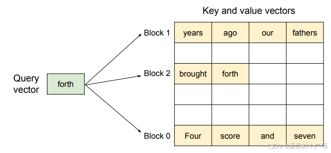
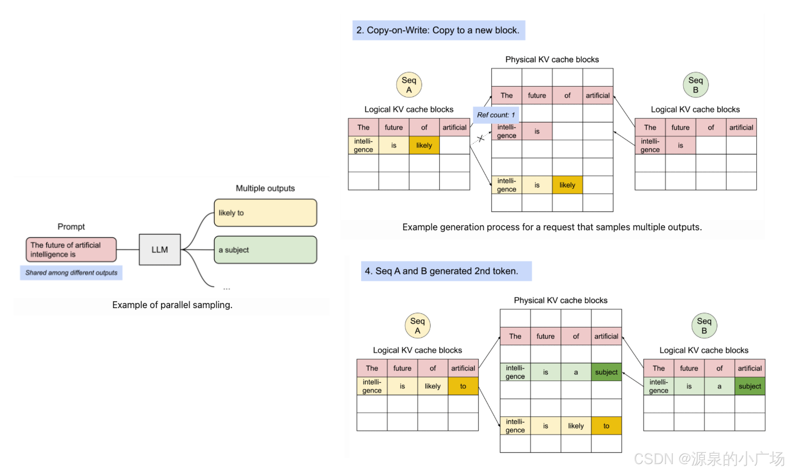

## PagedAttention

大模型在生成过程中面临内存限制。**在生成的解码部分，为先前token生成的所有注意力键和值都存储在 GPU 内存中以供重复使用。这被称为 KV Cache**，在 《Transformer KV Cache原理深入浅出》有做过详细说明。所谓KV Cache，这里再简单解释下，在基于Transformer的大模型解码过程中，随着每个输入token被处理，模型生成相应的注意力键和值张量。这些键和值张量编码了关于当前输入及其与上下文关系的重要信息。模型不是在解码过程的每个步骤中从头重新计算这些与注意力相关的张量，而是将它们存储在 GPU 内存中。

像 GPT - 4 这样的大模型可以有数万亿个参数，使得它们能力非常强大，但在服务期间进行推理时也极其消耗内存。内存的主要瓶颈是由于 KV 缓存。对于大模型和长序列，会占用大量内存。对于一个具有 130 亿参数的大模型，KV 缓存的大小可以达到占比30%以上。另外，KV 缓存的大小也是动态且不可预测的，取决于输入序列的长度。

此外，现有系统中的 KV 缓存内存管理，存在三种类型的内存浪费 —— **预留内存(给当前生成预留且会使用到的内存)、内部碎片(预留但不会用到的)和外部碎片(两个不同生成的内存在实际存储中的碎片)**。每个内存槽中的token代表其 KV 缓存。相同的token在不同位置时可以具有不同的 KV 缓存。

因此，Kwon 等人提出PagedAttention技术，大幅减少大模型 KV 缓存的内存占用，从而使得大模型更高效利用内存且易于访问。PagedAttention背后的核心思想是将每个序列的 KV 缓存分割成更小、更易于管理的 “页” 或块。每个块包含固定数量token的键值向量。这样，在注意力计算期间可以更高效地加载和访问 KV 缓存。

 分页注意力算法的图示，其中注意力键和值向量作为非连续的块存储在内存中

 PagedAttention管理用于存储键和值向量的内存的方法**类似于操作系统处理虚拟内存的方式**。**分页注意力将数据的逻辑组织与其物理存储解耦**。属于一个序列的逻辑块使用块表映射到可能不连续的物理块。有利于内存利用，在生成新token时可以分配新的物理块。PagedAttention通过将 KV 缓存分割成通过查找表访问的块来优化内存使用。**因此，KV 缓存不需要存储在连续的内存中，并且可以根据需要分配块**。内存效率可以提高内存受限工作负载下的 GPU 利用率，因此可以支持更多的推理批次。

使用查找表访问内存块也有助于进行 KV 共享，对于并行采样有帮助，在并行采样中，对于相同的提示同时生成多个输出。在这种情况下，缓存的 KV 块可以在多次生成之间共享。

PagedAttention处理流程：

1. 分割 KV 缓存：将 KV 缓存分成固定大小的块或 “页”。每个块包含原始缓存中的一部分键值对。

2. 构建查找表：构建并维护一个查找表，该表将查询键映射到存储相应值的特定页。这个表将每个可能的查询键映射到存储相应值的特定页。实现快速分配和检索。
3. 选择性加载：在推理期间，模型仅加载处理当前输入序列所需的页。与加载整个 KV 缓存相比，可以大幅减少总体内存占用。
4. 注意力计算：加载相关页后，模型可以像之前一样进行注意力计算，根据需要从加载的页中访问键值对。

PagedAttention已被 vLLM 采用，vLLM 是由加州伯克利开发的用于快速 LLM 推理和服务的开源库。vLLM 支持在线服务和离线推理，可以通过Python 库直接在 Python 脚本中使用。

## PagedAttention的优势与挑战

- 好处：接近最优的内存利用率，在分页注意力中，内存浪费主要局限于输入序列的最后一个块。接近最优的内存使用，平均只有大约 4% 的浪费。这种内存效率的大幅提升使系统能够将更多序列批处理在一起，从而提高 GPU 利用率并显著增加总体吞吐量。

- 挑战：查找表的开销，用于将查询键映射到 KV 缓存页的查找表在推理期间会增加一些计算开销。模型需要在加载相关页之前执行此查找，如果实现效率不高，可能会影响推理速度。根据具体的实现和页的大小，可能会引入一些延迟。例如，如果页太小，频繁的页加载和卸载可能会引入延迟。

## 参考

https://blog.csdn.net/weixin_65514978/article/details/141609201?spm=1001.2014.3001.5501