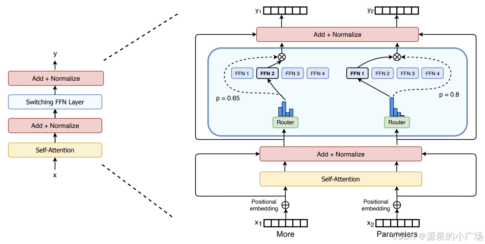
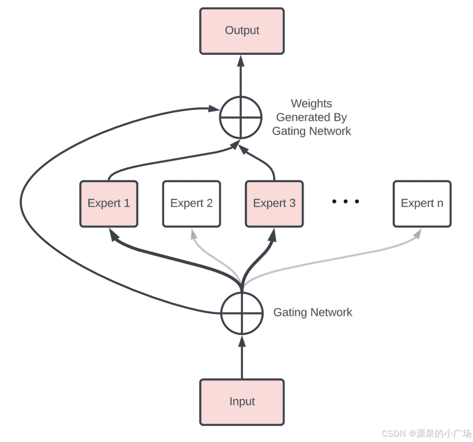
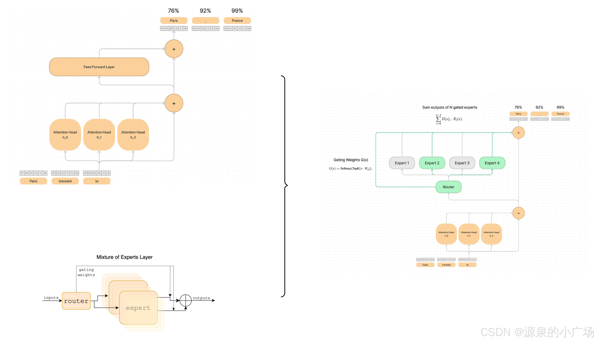
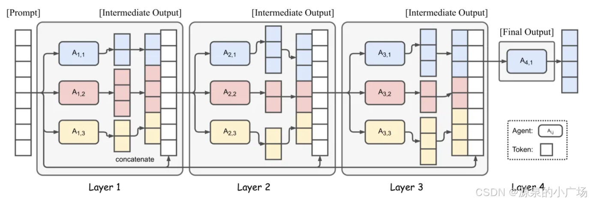
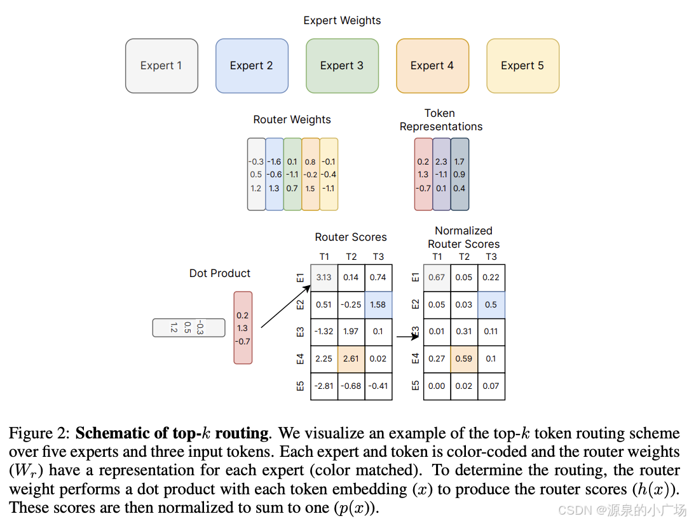
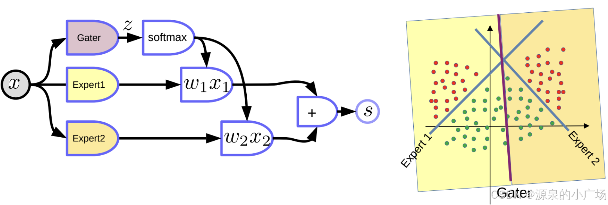

# 混合专家模型MOE

## 介绍

---

### 简介

**专家混合（Mixture of Experts, MoE）** 是一种机器学习技术，将模型划分为多个专门的子模型（称为“专家”），并根据输入动态选择其中的一部分进行计算。这是一种**条件计算（Conditional Computation）**方法，旨在通过只激活部分模型组件，提高神经网络的计算效率和扩展性。

### MoE 的核心概念

1. **专家（Experts）**：
   - 专家是整个 MoE 模型中的子模型或神经网络组件，每个专家专注于处理某类特定的输入。
2. **门控网络（Gating Network）**：
   - 一个较小的网络，用于根据输入决定激活哪些专家。门控网络输出一个分布（通常是概率分布），用于选择一部分专家。
3. **稀疏激活（Sparse Activation）**：
   - 不是对每个输入都激活所有专家，而是仅激活一小部分专家。这大大降低了计算成本。
4. **条件计算（Conditional Computation）**：
   - 根据输入特性动态选择计算路径，模型的不同部分处理不同的输入，提升效率。

---

### MoE 的工作原理

1. **输入路由**：
   - 输入先通过门控网络，门控网络根据输入特性决定激活哪些专家。
2. **专家计算**：
   - 被激活的专家独立处理输入，并生成各自的输出。通常只有部分专家被激活。
3. **输出聚合**：
   - 将激活专家的输出按照门控网络的权重聚合，通常是加权求和。

### MoE 特点 

Mixture of Experts（MoE，专家混合）【1】架构是一种神经网络架构，旨在通过有效分配计算负载来扩展[模型规模](https://edu.csdn.net/cloud/pm_summit?utm_source=blogglc&spm=1001.2101.3001.7020)。MoE 架构通过在推理和训练过程中仅使用部分 “专家”（子模型），优化了资源利用率，从而能够处理复杂任务。

在具体介绍 MoE 之前，先抛出 MoE 的一些表现【2】：

> - 与密集模型相比，**预训练速度快得多**。
> - 与具有相同参数数量的模型相比，**推理速度更快**。
> - 由于所有 Experts 都加载在内存中，所以需要大量的显存。
> - 在微调方面面临许多挑战，但最近关于 MoE 指令微调的工作很有前景。

### 为什么大模型行业会发展出 MoE 网络结构？

其实从上述 MoE 的特点，可能聪明的读者已经能大概想到原因。最主要的原因还是成本和可扩展性，**更大的模型训练和服务成本可能高达数千万美元。MoE 的出现是为了在大规模模型中有效利用计算资源，提高模型的训练效率和推理速度**。随着深度学习模型的规模越来越大，尤其是在处理自然语言处理和计算机视觉等复杂任务时，传统的密集模型（dense models）在计算和内存需求上变得非常昂贵和难以扩展。**MoE 通过选择性地激活一部分模型参数（即 “专家”），而不是全部参数，从而减轻计算负担**。

具体来说，MoE 模型将任务中的每个输入样本（如一个文本片段或图像块）分配给一个或多个专家进行处理，而不是让所有专家都处理所有样本。这种机制使得：

1.  **计算资源更高效**：仅激活部分专家意味着计算资源被集中在最相关的部分，从而减少了不必要的计算开销。

2.  **提高训练和推理效率**：由于每个输入只需经过部分专家处理，因此整个模型的训练和推理速度可以显著提高。模型可以在更短的时间内处理更多的数据。

3.  **保持模型质量**：通过有效的专家选择和负载均衡机制，MoE 模型能够在较少的计算资源下仍然保持与传统密集模型相当的性能。

此外，MoE 还带来了在大规模分布式系统中更好的扩展性和灵活性。由于专家可以分布在不同的计算节点上，这种架构特别适合在大规模分布式环境中运行，从而支持更大的模型和数据集。


#### 传统模型的计算成本

- 假设模型有 $N$ 个参数，每次前向传播都需要计算所有 $N$ 个参数。
- 当模型的参数规模扩大到数十亿或数万亿时，计算量和硬件需求随之成倍增加，无法高效运行。

#### MoE 模型的计算成本

- 假设模型有 $N$ 个参数，但通过稀疏激活机制，每次前向传播时，只有 $k$ 个专家（通常占总专家数的 1%-10%）被激活。
- 如果每个专家的参数量是 $M$，那么实际计算的参数量是 $k \cdot M$，远小于 $N$。

有了以上内容的铺垫，我们接下来就开始具体分析下 MoE 的网络结构，以及它是怎么运作的。

**因此计算成本在模型参数量不变的情况下降低，对应的，可以增大模型参数量且保持类似密集模型的计算成本。**

---

## MoE 概念介绍

---

大模型之所以效果突出，很大原因是提供了更大规模的参数、更大规模的数据，通过压缩信息，获得更好的模型质量。**在给定固定的计算预算的情况下，训练一个更大的模型但步数更少，比训练一个更小的模型但步数更多，相对来说收益更高**。

MoE 模型的目标，就是希望模型能够以少得多的计算量进行预训练，这意味着在与密集模型相同的计算预算下，可以进一步扩展模型或数据集的规模。模型的预期目标是，在预训练期间，MoE 模型应该比其对应的 Dense 模型应该更快地达到相同的质量。当然这是一种理想的状态。

在 Transformer 模型的背景（[可参考 Transformer 的原理介绍](https://blog.csdn.net/weixin_65514978/article/details/140954252 "可参考Transformer的原理介绍")）下，MoE 模型由两个主要元素组成：

> **使用稀疏的 MoE 层来代替密集的前馈网络（FFN）层**。MoE 层有一定数量的 “专家”(比如 8 个），其中每个专家是一个神经网络。实际上，专家可以是前馈神经网络，但也可以是更复杂的网络，甚至本身就是一个混合专家模型，从而形成分层混合专家模型。说实话，这种处理，很难不让人怀疑是大力出奇迹的做法。不过很多场景下，比如传统的[机器学习](https://edu.csdn.net/cloud/sd_summit?utm_source=glcblog&spm=1001.2101.3001.7020)，也有类似的集成学习的思想，通过多模型的 stacking、ensemble 等形成更庞大的模型组合，来达到更优的效果。
>
> **一个门控网络或路由器，用于确定将哪些 token 发送给哪个专家**。例如，在下面的图像中， “More” 被发送到第二个专家，标记 “Parameters” 被发送到第一个网络。当然也可以将一个 token 发送给多个专家。如何将一个 token 路由到一个专家是使用 MoE 模型时的关键点， 路由器由学习到的参数组成，并与网络的其他部分同时进行预训练。



概括来看，**在 MoE 模型中，用混合专家层替换 Transformer 模型的每个前馈网络层，混合专家层由一个门控网络和一定数量的专家组成**。

- 在 MoE 模型的核心是 “专家” 子网络。这些专家是更大神经网络中的独立模块，每个模块都能够处理输入数据。其概念是**不同的专家专注于输入数据的不同方面，从而使模型能够有效利用专门的知识**。
- 门控机制是一个关键组件，负责将输入引导至适当的专家网络。它根据一组门控值来决定每个专家的参与程度。门控机制可以实现为稠密或稀疏结构，其中稀疏结构由于选择性地激活部分专家，因而在计算上更加高效。在稀疏 MoE 模型中，路由算法在决定哪些专家被激活以处理特定输入时起着重要作用。这些算法的复杂性各不相同，需考虑平衡模型的准确性和计算效率。路由算法的选择对模型的性能和推理速度有明显的影响【3】。

---

## 业内 MoE 的应用示例

---

### 谷歌 Gemini 使用混合专家模型（MoE）

谷歌的 Gemini 1.5 采用了混合专家（MoE）架构 [4，5，6]。这种架构使 Gemini 1.5 在训练和服务方面更加高效。它将请求路由到一组较小的 “专家” 神经网络，因此响应更快且质量更高 [5]。首个发布用于早期测试的 Gemini 1.5 模型是 Gemini 1.5 Pro，属于中型[多模态](https://edu.csdn.net/cloud/ml_summit?utm_source=glcblog&spm=1001.2101.3001.7020)模型，性能与 1.0 Ultra 相当。



### Mixtral 8x7B 使用稀疏混合专家模型（SMoE）

Mixtral 8x7B 采用稀疏混合专家（SMoE）架构 [7，8]。它与 Mistral 7B 具有相同的架构，不同之处在于每一层都由八个前馈模块（即专家）组成 。对于每个 token，在每一层，一个路由网络选择两个专家来处理当前状态并合并它们的输出。尽管每个 token 只涉及两个专家，但在每个时间步选择的专家可以不同。因此每个 token 可以访问 47B 的参数，但在推理期间仅使用 13B 的活跃参数。Mixtral 8x7B 的模型表现与 GPT-3.5 相当。



---

## MoE 具体的运作方式

--------------

相信前述内容已经帮助读者建立了 MoE 的概念以及要解决的问题。那么接下来我们看一下，MoE 具体是怎么运作的【7】。

首先引入混合专家的想法，其实很直接，就是希望不同的专家角色，关注不同的领域。例如 某部分的专家网络专注于数学能力的提升。另一部分专注编程能力的加强。这由此引出一个关键概念：**稀疏性**【2】。稀疏性利用了条件计算的理念。**在 Dense 模型中，所有输入都会使用所有参数，而稀疏性则允许仅运行系统的一部分**【13】。条件计算的思想（网络的一部分在每个示例的基础上被激活）使得可以在不增加计算量的情况下扩大模型的规模，因此，每个 MoE 层中使用了成千上万的专家。不过更多的专家可以提高样本效率并加快速度，但这些收益逐渐递减（尤其是在超过 256 或 512 个专家之后），而且推理时需要更多的显存。



在语言建模和 Transformer 的架构背景下，引入混合专家模型，需要注意专家们一次帮助预测一个 token。路由器决定在每个 token 处哪个专家处于活动状态。专家网络通过门控线性组合来组合以预测下一个 token。

_i E_i(x).png)

在这种设置中，所有专家都为所有输入运行加权乘法运算。但是，如果 G 为 0，在这种情况下，就不需要计算相应的专家操作，因此可以节省计算资源。

**由于专家网络在一个 Transformer 模块内，路由是逐个 token 进行的（注意它替代的Position-wise FFN）。**当 token X 进入时，Transformer 模块的工作是预测下一个 token Y。Transformer 模块通过自注意力机制可以访问所有先前的上下文。然后自注意力机制的输出作为条件，路由器判断输入到哪 k 个专家网络。

那么路由是如何工作的？**实际上，路由只是一个位于注意力头和 K 个专家集合之间的 softmax 层。这个层学习哪种专家最适合哪种类型的 token**。

.png)

此外，也有学者【9】探索了其他门控机制，如 Noisy Top-k Gating。该门控方法引入了一些（可调节的）噪声，然后保留前 k 个值。具体来说：

      _i).png)

只选择前 k 个值。通过使用足够低的 k 值（例如一两个），可以比激活许多专家时更快地进行训练和推理。**为什么不只选择最顶级的专家呢？最初的推测是，路由到多个专家是为了让门控网络学习如何路由到不同的专家，因此至少要选择两个专家。**比如 Mixtral 8x7B 仅根据路由器的对数几率选择前两个专家来进行处理以预测下一个 token。以下给出路由可视化图【10】。



对于什么时候使用 MoE 还是 Dense mode，需要根据实际情况分析。专家对于高吞吐量且有多台机器的场景很有用。在预训练的固定计算预算下，稀疏模型更为理想。而在显存较小的低吞吐量场景中，稠密模型更为适合。注意稀疏模型和稠密模型的参数数量不能直接比较，因为两者代表的东西大不相同。

---

## MoE 代码示例​​​​​​​

------------------

这里给出一个代码示例【11，12】，帮助进一步理解 MoE 的思想。在实际的 LLM 中，代码需要做一定的调整，但大概的思路上是可以参考的，只是希望用代码能更直观理解。



```
class Expert(nn.Module):
  def  __init__(self, input_size, output_size): 
    super(Expert, self).__init__()
    self.linear = nn.Linear(input_size, output_size)
    
  def forward(self, data):
    x = self.linear(data)
    return x
 
 
class GatingNetwork(nn.Module):
  def __init__(self, input_size, num_experts):
    super(GatingNetwork, self).__init__()
    self.linear1 = nn.Linear(input_size, 4)
    self.relu = nn.ReLU()
    self.linear2 = nn.Linear(4, num_experts)
    self.softmax = nn.Softmax(dim=-1)
  
  def forward(self, data): 
    x = self.linear1(data)
    x = self.relu(x)
    x = self.linear2(x)
    x = self.softmax(x)
    return x
 
 
class MixtureOfExperts(nn.Module):
  def __init__(self, num_experts=2):
    super(MixtureOfExperts, self).__init__()  
    self.expert1 = Expert(2,1)
    self.expert2 = Expert(2,1)
    self.gating =  GatingNetwork(2, num_experts)
    self.sigmoid = nn.Sigmoid()
      
  def forward(self, data):
    expert1_output = self.expert1(data)
    expert2_output = self.expert2(data)  
    
    gating_output =  self.gating(data)
 
    s = (expert1_output*gating_output[:,0][:,None] + 
         expert2_output*gating_output[:,1][:,None])
    
    a = self.sigmoid(s)
    
    return a
 
  def backward(self, y_hat, labels, criterion, optimizer): 
    optimizer.zero_grad()
    loss = criterion(y_hat, labels)    
    loss.backward()
    optimizer.step()
    return loss.item()
 
 
# Define the model, loss, and optimizer
moe = MixtureOfExperts()
criterion = nn.MSELoss() 
optimizer = torch.optim.Adam(moe.parameters(),lr=0.01)
 
# Define the learning rate scheduler
scheduler = torch.optim.lr_scheduler.ConstantLR(optimizer) 
 
# Convert data and labels to float tensors
data_tensor = data.float()
labels_tensor = labels.view(-1, 1).float()
 
# Training loop
num_epochs = 500 
for epoch in tqdm(range(num_epochs)):
    # Forward pass
    y_hat = moe.forward(data)
 
    # Backward pass and optimization
    loss_value = moe.backward(y_hat, labels_tensor, criterion, optimizer)
 
    # Decay the learning rate
    scheduler.step()
 
 
expert1_weights = moe.expert1.linear.weight.detach()[0,0]
expert2_weights = moe.expert2.linear.weight.detach()[0,0]
 
expert1_bias = moe.expert1.linear.bias.detach()
expert2_bias = moe.expert2.linear.bias.detach()
 
gating_weights = moe.gating.linear2.weight.detach().flatten()
 
x_line = np.linspace(min(data[:, 0]), max(data[:, 0]), 100)
 
y_line1 = expert1_weights * x_line + 5
y_line2 = expert2_weights * x_line + 5
 
class_0 = data[labels == 0]
class_1 = data[labels == 1]
plt.scatter(class_0[:, 0], class_0[:, 1], label='Class 0', alpha=0.5)
plt.scatter(class_1[:, 0], class_1[:, 1], label='Class 1', alpha=0.5)
 
plt.plot(x_line, y_line1, label='Expert 1', alpha = 1)
plt.plot(x_line, y_line2, label='Expert 2', alpha = 1)
 
plt.xlabel('Feature 1')
plt.ylabel('Feature 2')
plt.grid(True, c='gray')
plt.legend()
plt.autoscale()
plt.show()
```

---

## MoE 面临的挑战

---

虽然混合专家模型与密集模型相比具有高效预训练和更快推理等优点，但它们也带来了挑战【2，3】。训练、微调和预测过程中面临以下几个主要挑战：

> #### 1. **训练不稳定性**
>
> *   **梯度更新不稳定**：在训练过程中，由于每个输入样本仅触发部分专家（通常是 Top-k），导致不同专家的梯度更新频率不同。这种不均衡的梯度更新可能会导致模型参数更新不稳定，影响整体模型的收敛性。
> *   **专家过度专门化**：部分专家可能会被频繁使用，而其他专家很少被选择，导致某些专家过度专门化，无法处理多样化的输入。这种不均衡会影响模型的泛化能力。
>
> #### 2. **负载均衡问题**
>
> *   **负载不均衡**：由于路由机制的随机性和输入数据的特性，可能导致某些专家承载的计算负载远高于其他专家。这种负载不均衡不仅会影响计算效率，还可能导致模型的训练效果不佳。
> *   **过度复杂的路由机制**：复杂的路由机制可能带来计算开销，尤其是在处理大规模数据时，这种开销会显著影响训练速度。
>
> #### 3. **微调挑战**
>
> *   **迁移学习效果不确定**：MoE 模型的微调可能会面临迁移学习效果不确定的问题。由于专家的选择可能与特定任务密切相关，微调时某些专家可能并未得到充分训练，从而影响模型在新任务上的表现。
> *   **专家容量调整**：在微调过程中，如何设置合适的专家容量以平衡计算资源和模型性能，是一个关键挑战。过大的专家容量会浪费计算资源，而过小的容量可能无法充分利用模型的潜力。
>
> #### 4. **预测和推理中的挑战**
>
> *   **推理效率**：在推理阶段，MoE 模型需要根据输入选择合适的专家，这种选择过程增加了计算复杂度，尤其是在实时推理的场景中，可能会影响推理速度。
> *   **专家激活的效率**：在大规模模型中，通常只有一小部分专家被激活，这可能导致计算资源的浪费。此外，专家的选择机制也会影响推理的负载均衡。
> *   **部署复杂性**：MoE 模型通常比传统的密集模型更加复杂，在实际部署中可能需要针对不同硬件环境进行优化。此外，不同专家之间的通信成本和数据传输延迟也会影响模型的部署效率。
>
> #### 5. **模型大小和计算资源**
>
> *   **参数量巨大**：MoE 模型通常包含大量参数（例如数千亿或数万亿参数），这对计算资源提出了极高的要求。训练和推理阶段都需要高效的分布式计算框架来支持。
> *   **高内存消耗**：在训练和推理过程中，由于需要同时加载多个专家模型，因此内存消耗显著增加，这对硬件配置提出了更高的要求。比如虽然一个混合专家模型可能有很多参数，但在推理期间只使用其中的一部分。与具有相同参数数量的密集模型相比，这导致推理速度快得多。然而，所有参数都需要加载在内存中，所以内存需求很高。例如，对于像 Mixtral 8x7B 这样的混合专家模型，需要有足够的显存来容纳一个密集的 47B 参数模型。为什么是 47B 参数而不是 8×7B = 56B 呢？这是因为在混合专家模型中，只有前馈网络层被视为单独的专家，模型的其余参数是共享的。同时，假设每个标记只使用两个专家，推理速度（浮点运算次数）就像使用一个 12B 模型（而不是 14B 模型），因为它计算 2×7B 的矩阵乘法，但有一些层是共享的。

这些问题有的也许已经不是问题，在发展过程中已经被逐步解决。这里抛出来，主要是带给读者相应的思考，技术带来一定优势的背后，往往存在一定的工程或者其他挑战，多思考可以帮助避免很多不必要的问题出现。业内目前有大量基座模型的公司在尝试 MoE 架构，也许是一种在算力资源等受限情况下的一种可行解决方案。

---

## 参考材料

-------

【1】Fedus, William, Barret Zoph, and Noam Shazeer. "Switch transformers: Scaling to trillion parameter models with simple and efficient sparsity." _Journal of Machine Learning Research_ 23.120 (2022): 1-39.

【2】[Mixture of Experts Explained](https://huggingface.co/blog/moe "Mixture of Experts Explained")

【3】[Deep Dive into Mixture of Experts for LLM Models](https://medium.com/@marketing_novita.ai/deep-dive-into-mixture-of-experts-for-llm-models-4bf609bc82a0 "Deep Dive into Mixture of Experts for LLM Models")

【4】[Our next-generation model: Gemini 1.5](https://blog.google/technology/ai/google-gemini-next-generation-model-february-2024/ "Our next-generation model: Gemini 1.5")

【5】[Gemini 1.5: Unlocking multimodal understanding across millions of tokens of context](https://arxiv.org/abs/2403.05530 "Gemini 1.5: Unlocking multimodal understanding across millions of tokens of context")

【6】[An Introduction to Gemini by Google DeepMind](https://www.baeldung.com/cs/gemini-google-deepmind "An Introduction to Gemini by Google DeepMind")

【7】[Arxiv Dives — How Mixture of Experts works with Mixtral 8x7B](https://medium.com/@oxenai/arxiv-dives-how-mixture-of-experts-works-with-mixtral-8x7b-4acbbc64010d "Arxiv Dives — How Mixture of Experts works with Mixtral 8x7B")

【8】[Mixtral of Experts](https://arxiv.org/pdf/2401.04088 "Mixtral of Experts")

【9】[OUTRAGEOUSLY LARGE NEURAL NETWORKS](https://arxiv.org/pdf/1701.06538 "OUTRAGEOUSLY LARGE NEURAL NETWORKS"): THE SPARSELY-GATED MIXTURE-OF-EXPERTS LAYER

【10】[A REVIEW OF SPARSE EXPERT MODELS IN DEEP LEARNING](https://arxiv.org/pdf/2209.01667 "A REVIEW OF SPARSE EXPERT MODELS IN DEEP LEARNING")

【11】[Mixture of Experts Model](https://github.com/ozyurtf/mixture-of-experts?tab=readme-ov-file "Mixture of Experts Model")

【12】[How does Mixture-of-Experts (MoE) work](https://www.kaggle.com/code/aliabdin1/how-does-mixture-of-experts-moe-work "How does Mixture-of-Experts (MoE) work")

【13】[MOE & MOA for Large Language Models](https://towardsdatascience.com/moe-moa-for-large-language-models-c1cafeffd6a5 "MOE & MOA for Large Language Models")