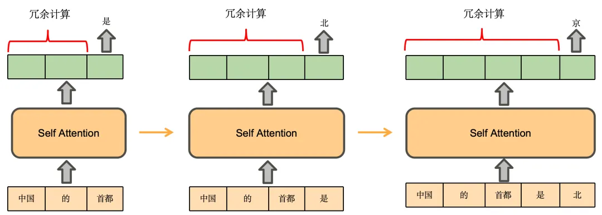

# KV Cache

KV Cache 是大模型推理性能优化的一个常用技术，该技术可以在不影响任何计算精度的前提下，**通过空间换时间的思想**，提高推理性能。

## 有无KV cache的文本生成速度对比

```
import numpy as np
import time
import torch
from transformers import AutoModelForCausalLM, AutoTokenizer
NAME_OR_PATH = r'***************'
device = "cuda" if torch.cuda.is_available() else "cpu"
tokenizer = AutoTokenizer.from_pretrained(NAME_OR_PATH)
model = AutoModelForCausalLM.from_pretrained(NAME_OR_PATH).to(device)
model.config.pad_token_id = tokenizer.eos_token_id
for use_cache in (True, False):
  times = []
  for _ in range(10):  # measuring 10 generations
    start = time.time()
    model.generate(**tokenizer("What is KV caching?", return_tensors="pt").to(device), use_cache=use_cache, max_new_tokens=10)
    times.append(time.time() - start)
  print(f"{'with' if use_cache else 'without'} KV caching: {round(np.mean(times), 3)} +- {round(np.std(times), 3)} seconds")
  #===================================max_new_tokens=1=======================================================
with KV caching: 0.072 +- 0.008 seconds
without KV caching: 0.081 +- 0.02 seconds
#===================================max_new_tokens=10=======================================================
with KV caching: 0.428 +- 0.021 seconds
without KV caching: 0.751 +- 0.04 seconds
#===================================max_new_tokens=100=======================================================
with KV caching: 4.606 +- 0.072 seconds
without KV caching: 19.257 +- 1.663 seconds
#===================================max_new_tokens=1000=======================================================
with KV caching: 42.941 +- 0.711 seconds
without KV caching: 349.954 +- 1.523 seconds

```

使用KV Cache的推理速度是明显优于没有使用KV Cache的，而且生成的token越长速度提升就越明显，当最大生成token数为1000时，近10倍的加速，一次推理近6分钟。

## 为什么KV Cache能加速

### 冗余计算

我们先推理一下基于Decoder架构的大模型的生成过程。用户输入“中国的首都”，模型续写得到的输出为“是北京”，模型的生成过程如下：

1. 将“中国的首都”输入模型，得到每个token的注意力表示（绿色部分）。使用“首都”的注意力表示，预测得到下一个token为“是”

2. 将“是”拼接到原来的输入，得到“中国的首都是”，将其输入模型，得到注意力表示，使用“是”的注意力表示，预测得到下一个token为“北”
3. 将“北”拼接到原来的输入，依此类推，预测得到“京”，最终得到“中国的首都是北京”



即在预测“是”时，实际发生的计算是这样的：


$$
Token1→Att 1(Q,K,V)=softmaxed(Q_1K_1^T ) V_1  \\
Token2→Att 2 (Q,K,V)=softmaxed(Q_2K_1^T ) V_1  +softmaxed(Q_2K_2^T ) V_2  \\
Token3→Att 3 (Q,K,V)=softmaxed(Q_3K_1^T ) V_1  +softmaxed(Q_3K_2^T ) V_2 +softmaxed(Q_3K_3^T ) V_2
$$


- 对于 Token1 的计算，由于 $Q_1K_2^T$ 和 $Q_1K_3^T$ 会 mask 掉，所以在计算 Token1 时仅与时仅与 $Q_1, K_1, V_1$有关

- 对于 Token2 的计算，由于 $Q_2K_3^T$ 会 mask 掉，所以在计算Token2时仅与 时仅与时仅与 $Q_2, K_1, K_2, V_1, V_2$有关
- 对于 Token3 的计算，仅与 $Q_3, K_1, K_2, K_3, V_1, V_2,V_3$ 有关

由此发现在计算 Token3 时，**我们仅需 $Q_3$ 与所有的 与所有的与所有的KV值即可**，而不需要对之前的 Token 进行重复计算（**后续的新token不会对之前的token有任何影响，即使再次计算，结果还是不会变的**），所以当前方式存在大量冗余计算，可以得出以下结论：

1. Att*k*(*Q*,*K*,*V*)的计算过程中，主要与$Q_k
   $有关
2. 每一次生成新的Token都需要用到之前的KV，所以我们需要把每一步的KV缓存起来

由于Causal Mask矩阵的存在，预测下一个token只与输入的最后一个token的QKV和历史token的KV有关；如果没有Causal Mask，比如说是encoder架构，每次推理时每个token需要考虑所有输入的token，所以得到的注意力值都会变化，就不存在重复计算的情况。


### KV Cache是如何进行的？

KV Cache的本质是以空间换时间，它将历史输入的token的KV缓存下来，避免每步生成都重新计算历史的KV值。一个典型的带有 KV cache 优化的生成大模型的推理过程包含了两个阶段：

1. 预填充阶段：输入一个prompt序列，为每个transformer层生成 key cache 和 value cache（KV cache）（每层都需要保存），此步骤为并行同时计算序列的KV值

2. 解码阶段：使用之前的KV cache并计算当前的KV值，并将当前的KV值保存到cache中，然后生成token

### 为什么只需要KV

记住对于 Token3 的计算，仅与 $Q_3, K_1, K_2, K_3, V_1, V_2,V_3$ 有关

预测新的token只与输入的最后一个token相关，输入的最后一个token因为只需要计算注意力值，而注意力的值需要将输入token的V值进行加权即得到结果，进行加权就需要将当前的Q与与所有的K进行计算得到权重，所以只需要缓存历史token的KV值。

对于Q，生成新token需要该位置的Q（仅一个，且用之后不会再次被用），和先前的KV值，所以无需保存新token的Q。而先前的KV值是不会变的，因此也没必要保留他们的Q来再次计算。因此对于这两类token，保留Q毫无意义。

### 结论

1. KV Cache是通过空间换时间，避免重复计算进而提升推理速度

2. 预测新token只与输入的最后一个token的注意力值相关，而注意力值与最后一个token的Q和所有输入token的KV相关，每一层的注意力不变，进而每一层的KV都是不变的
3. 只适用于Decoder架构，因为只与之前的token进行计算，得到的注意力值不会变化，第一层、第二层、第三层到第l ll层； 如果只有一层，那就不仅仅适用于Decoder架构


## kv cache参数量估计

假设输入序列的长度为s，输出序列的长度为n，层数为l，以float16来保存KV cache，那么KV cache的峰值显存占用大小为 $b*(s+n)h*l*2*2 =4lh(s +n)$。这里第一个2表示K/V cache，第个2表示float16占2个bytes。
以GPT3为例，对比KV cache与模型参数占用显存的大小。GPT3模型占用显存大小为350GB。假设批次大小b=64，输入序列长度 =512，输出序列长度n =32，则KV cache占用显存大约为 $4lh(s + n)$= 164,282,499,072bytes约等于164GB，大约是模型参数显存的0.5倍


## 代码

```
class GPT2Attention(nn.Module):
    def __init__(self):
        super().__init__()
        # ...
    def forward(
        self,
        hidden_states: Optional[Tuple[torch.FloatTensor]],
        layer_past: Optional[Tuple[torch.Tensor]] = None,
        attention_mask: Optional[torch.FloatTensor] = None,
        head_mask: Optional[torch.FloatTensor] = None,
        encoder_hidden_states: Optional[torch.Tensor] = None,
        encoder_attention_mask: Optional[torch.FloatTensor] = None,
        use_cache: Optional[bool] = False,
        output_attentions: Optional[bool] = False,
    ) -> Tuple[Union[torch.Tensor, Tuple[torch.Tensor]], ...]:
        # hidden_states对应query
        # encoder_hidden_states对应key和value
        if encoder_hidden_states is not None:
            if not hasattr(self, "q_attn"):
                raise ValueError(
                    "If class is used as cross attention, the weights `q_attn` have to be defined. "
                    "Please make sure to instantiate class with `GPT2Attention(..., is_cross_attention=True)`."
                )

            query = self.q_attn(hidden_states)
            key, value = self.c_attn(encoder_hidden_states).split(self.split_size, dim=2)
            attention_mask = encoder_attention_mask
        else:
            query, key, value = self.c_attn(hidden_states).split(self.split_size, dim=2)

        query = self._split_heads(query, self.num_heads, self.head_dim)
        key = self._split_heads(key, self.num_heads, self.head_dim)
        value = self._split_heads(value, self.num_heads, self.head_dim)

		# =========== kv cache ===========
        if layer_past is not None:
            past_key, past_value = layer_past
            # 切成多头以后，shape是[bs, num_heads, seq_length, head_dim]，所以dim=-2就是seq_length对应的那个维度，拼一下就有了新的kvcache，上面的hidden_states应该是只有最后一个token的embedding，输入应该是[batch_size, embedding_dims]
            key = torch.cat((past_key, key), dim=-2)
            value = torch.cat((past_value, value), dim=-2)
        # =========== kv cache ===========

        if use_cache is True:
            present = (key, value)
        else:
            present = None

        if self.reorder_and_upcast_attn:
            attn_output, attn_weights = self._upcast_and_reordered_attn(query, key, value, attention_mask, head_mask)
        else:
            attn_output, attn_weights = self._attn(query, key, value, attention_mask, head_mask)

        attn_output = self._merge_heads(attn_output, self.num_heads, self.head_dim)
        attn_output = self.c_proj(attn_output)
        attn_output = self.resid_dropout(attn_output)

        outputs = (attn_output, present)
        if output_attentions:
            outputs += (attn_weights,)

        # 最后输出的present就是当前的kvcache
        return outputs  # a, present, (attentions)

```

