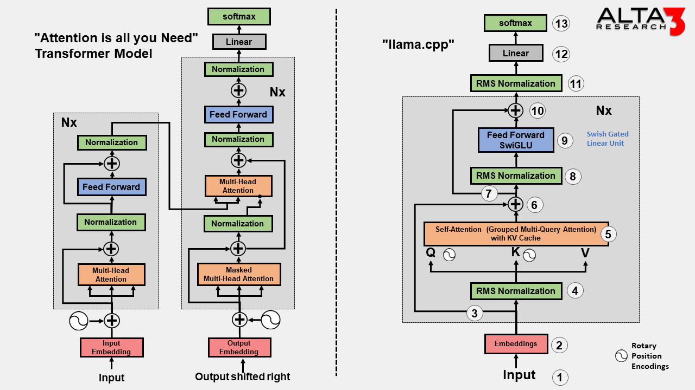
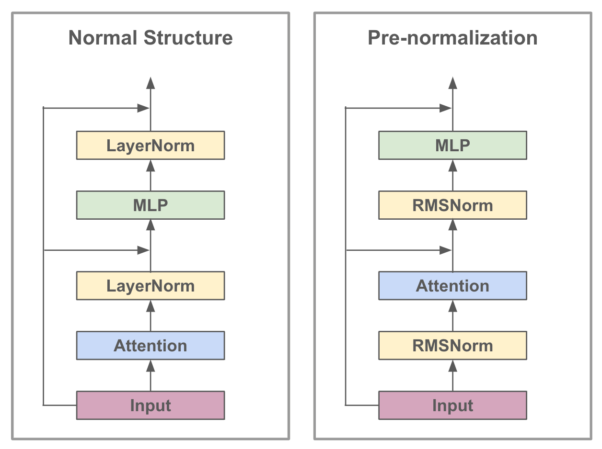

# LLaMa-1

## 简介

LLM通常在参数量提升到一定程度后出现一些奇特的特性，如Few-shot甚至Zero-shot的In-context learning能力。过去的研究主要集中在如何增加模型的参数量上，然而，最近的研究表明，**当计算预算一定的情况下，小一些的模型在更多的训练数据上训练会得到比大参数模型（更少的数据）更好的效果**。例如，尽管Hoffmann等人(2022)建议在200B个token上训练10B模型，但我们发现即使在1T个token之后，7B模型的性能仍在继续提高。

本文的工作重点是训练一系列语言模型，使用更多的token，在各种推理预算下实现最佳性能。所得模型称为LLaMA，其参数范围从7B到65B，与现有最佳LLM相比具有竞争力。例如，LLaMA-13B在大多数基准测试中优于GPT-3，尽管体积小了10倍。在更大的规模上，LLaMA-65B参数模型也可以与最好的大型语言模型(如Chinchilla或PaLM-540B)相媲美。

与Chinchilla, PaLM或GPT-3不同，LLaMA只使用公开可用的数据，而大多数现有模型依赖于非公开可用或未记录的数据。本文的后续部分概述了我们对Transformer架构所做的修改，以及我们的训练方法。然后报告模型的性能，并在一组标准基准上与其他LLM进行比较。最后，我们使用来自负责任的人工智能社区的一些最新基准，揭示了我们模型中编码的一些偏见和毒性。

## 预训练数据

训练数据集是几个来源的混合，如表1所示，涵盖了不同的领域。本文只使用公开可用的数据，并且与开源兼容。以下混合数据及其在训练集中所代表的百分比如下：

- **English CommonCrawl [67%].** 对2017-2020的CommonCrawl进行非英语去除和行级别的去重处理。
- **C4 [15%].** 即T5模型训练时使用的数据集。
- **Github [4.5%].** 使用Google BigQuery.上的Apache, BSD and MIT licenses数据。
- **Wikipedia [4.5%].** 截止到2022-08的多语言版本Wikipedia语料。
- **Gutenberg and Books3 [4.5%].** 书籍语料进行了去重。
- **ArXiv [2.5%].** 删除掉第一个Section之前的所有内容，并去除了.tex中的注释。
- **Stack Exchange [2%].** 保留了来自28个最大网站的数据，从文本中删除了HTML标签，并按分数(从最高到最低)对答案进行了排序。

本文使用字节对编码(BPE)算法对数据进行分词，使用SentencePiece的实现。值得注意的是，我们将所有数字拆分为单个数字，并使用字节来分解未知的UTF-8字符。总的来说，整个训练数据集在分词后大约包含1.4T个token。对于我们的大多数训练数据，每个token在训练期间只使用一次，除了Wikipedia和Books域，我们在其上执行大约两个epoch。

## 架构

LLaMA基于transformer架构并利用几类改进，以下是与原始架构的主要区别，以及我们找到这种变化的灵感的地方(括号内):

- **Pre-normalization [GPT3].** 为了提高训练的稳定性，我们对每个Transformer sub-layer的输入进行归一化，而不是对输出进行归一化。LLaMA使用了RMSNorm归一化函数。
- **SwiGLU activation function [PaLM].** 为了提高性能，使用SwiGLU激活函数取代了ReLU非线性。
- **Rotary Embeddings [GPTNeo].** 删除了绝对位置嵌入，取而代之的是在网络的每一层添加旋转位置嵌入(RoPE)。

这些优化措施使得LLaMA模型在保持高效性的同时，也具备了更强的泛化能力和鲁棒性。

## 优化器

使用了AdamW优化器，并使用cosine learning rate schedule，使得最终学习率等于最大学习率的10%，设置0.1的权重衰减和1.0的梯度裁剪。warmup的step为2000，并根据模型的大小改变学习率和批处理大小(详见表2)。

## 高效实现

作者做了一些优化来提高模型的训练速度。首先，使用因果多头注意的有效实现来减少内存使用和运行时间。该实现可在xformers库中获得。为了进一步提高训练效率，通过检查点减少了在向后传递过程中重新计算的激活量。更准确地说，节省了计算成本高的激活，比如线性层的输出。这是通过手动实现transformer层的backward函数来实现的，而不是依赖于PyTorch的autograd。此外，还尽可能地覆盖激活的计算和gpu之间通过网络的通信(由于all_reduce操作)。

> First, we use an efficient implementation of the causal multi-head attention to reduce memory usage and runtime. This implementation, available in the xformers library,2 is inspired by Rabe and Staats (2021) and uses the backward from Dao et al. (2022). This is achieved by not storing the attention weights and not computing the key/query scores that are masked due to the causal nature of the language modeling task.
>
> To further improve training efficiency, we reduced the amount of activations that are recomputed during the backward pass with checkpointing. More precisely, we save the activations that are expensive to compute, such as the outputs of linear layers. This is achieved by manually implementing the backward function for the transformer layers, instead of relying on the PyTorch autograd.
>
> Moreover, we also overlap the computation of activations and the communication between GPUs over the network (due to all_reduce operations) as much as possible.

训练65b参数模型时，我们的代码在2048 A100 GPU和80GB RAM上处理大约380个token/秒/GPU。这意味着在包含1.4T token的数据集上进行训练大约需要21天。

## 代码

- https://github.com/karpathy/nano-llama31/tree/master
- https://github.com/naklecha/llama3-from-scratch
- https://github.com/Lightning-AI/lit-llama

# 参考

- https://blog.csdn.net/weixin_44826203/article/details/129255185
- https://xumimi-ai.blog.csdn.net/article/details/132034312
- https://github.com/karpathy/nano-llama31/tree/master
