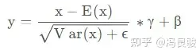
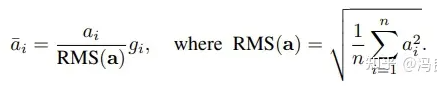
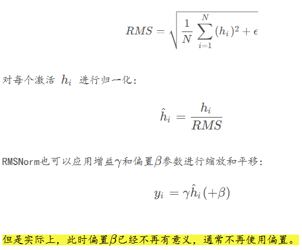

# LLaMa-1

## 简介

LLM通常在参数量提升到一定程度后出现一些奇特的特性，如Few-shot甚至Zero-shot的In-context learning能力。过去的研究主要集中在如何增加模型的参数量上，然而，最近的研究表明，**当计算预算一定的情况下，小一些的模型在更多的训练数据上训练会得到比大参数模型（更少的数据）更好的效果**。例如，尽管Hoffmann等人(2022)建议在200B个token上训练10B模型，但我们发现即使在1T个token之后，7B模型的性能仍在继续提高。

本文的工作重点是训练一系列语言模型，使用更多的token，在各种推理预算下实现最佳性能。所得模型称为LLaMA，其参数范围从7B到65B，与现有最佳LLM相比具有竞争力。例如，LLaMA-13B在大多数基准测试中优于GPT-3，尽管体积小了10倍。在更大的规模上，LLaMA-65B参数模型也可以与最好的大型语言模型(如Chinchilla或PaLM-540B)相媲美。

与Chinchilla, PaLM或GPT-3不同，LLaMA只使用公开可用的数据，而大多数现有模型依赖于非公开可用或未记录的数据。本文的后续部分概述了我们对Transformer架构所做的修改，以及我们的训练方法。然后报告模型的性能，并在一组标准基准上与其他LLM进行比较。最后，我们使用来自负责任的人工智能社区的一些最新基准，揭示了我们模型中编码的一些偏见和毒性。

## 预训练数据

训练数据集是几个来源的混合，如表1所示，涵盖了不同的领域。本文只使用公开可用的数据，并且与开源兼容。以下混合数据及其在训练集中所代表的百分比如下：


- **English CommonCrawl [67%].** 对2017-2020的CommonCrawl进行非英语去除和行级别的去重处理。
- **C4 [15%].** 即T5模型训练时使用的数据集。
- **Github [4.5%].** 使用Google BigQuery.上的Apache, BSD and MIT licenses数据。
- **Wikipedia [4.5%].** 截止到2022-08的多语言版本Wikipedia语料。
- **Gutenberg and Books3 [4.5%].** 书籍语料进行了去重。
- **ArXiv [2.5%].** 删除掉第一个Section之前的所有内容，并去除了.tex中的注释。
- **Stack Exchange [2%].** 保留了来自28个最大网站的数据，从文本中删除了HTML标签，并按分数(从最高到最低)对答案进行了排序。

本文使用字节对编码(BPE)算法对数据进行分词，使用SentencePiece的实现。值得注意的是，我们将所有数字拆分为单个数字，并使用字节来分解未知的UTF-8字符。总的来说，整个训练数据集在分词后大约包含1.4T个token。对于我们的大多数训练数据，每个token在训练期间只使用一次，除了Wikipedia和Books域，我们在其上执行大约两个epoch。

## 架构

LLaMA基于transformer架构并利用几类改进，以下是与原始架构的主要区别，以及我们找到这种变化的灵感的地方(括号内):

- **Pre-normalization [GPT3].** 为了提高训练的稳定性，我们对每个Transformer sub-layer的输入进行归一化，而不是对输出进行归一化。LLaMA使用了RMSNorm归一化函数。
- **SwiGLU activation function [PaLM].** 为了提高性能，使用SwiGLU激活函数取代了ReLU非线性。
- **Rotary Embeddings [GPTNeo].** 删除了绝对位置嵌入，取而代之的是在网络的每一层添加旋转位置嵌入(RoPE)。

这些优化措施使得LLaMA模型在保持高效性的同时，也具备了更强的泛化能力和鲁棒性。

## 优化器

使用了AdamW优化器，并使用cosine learning rate schedule，使得最终学习率等于最大学习率的10%，设置0.1的权重衰减和1.0的梯度裁剪。warmup的step为2000，并根据模型的大小改变学习率和批处理大小(详见表2)。

## 高效实现

作者做了一些优化来提高模型的训练速度。首先，使用因果多头注意的有效实现来减少内存使用和运行时间。该实现可在xformers库中获得。为了进一步提高训练效率，通过检查点减少了在向后传递过程中重新计算的激活量。更准确地说，节省了计算成本高的激活，比如线性层的输出。这是通过手动实现transformer层的backward函数来实现的，而不是依赖于PyTorch的autograd。此外，还尽可能地覆盖激活的计算和gpu之间通过网络的通信(由于all_reduce操作)。

> First, we use an efficient implementation of the causal multi-head attention to reduce memory usage and runtime. This implementation, available in the xformers library,2 is inspired by Rabe and Staats (2021) and uses the backward from Dao et al. (2022). This is achieved by not storing the attention weights and not computing the key/query scores that are masked due to the causal nature of the language modeling task.
>
> To further improve training efficiency, we reduced the amount of activations that are recomputed during the backward pass with checkpointing. More precisely, we save the activations that are expensive to compute, such as the outputs of linear layers. This is achieved by manually implementing the backward function for the transformer layers, instead of relying on the PyTorch autograd.
>
> Moreover, we also overlap the computation of activations and the communication between GPUs over the network (due to all_reduce operations) as much as possible.

训练65b参数模型时，我们的代码在2048 A100 GPU和80GB RAM上处理大约380个token/秒/GPU。这意味着在包含1.4T token的数据集上进行训练大约需要21天。

# RMS Normalization原理

说RMS Normalization之前，先讲Layer Normalization 和 Batch Normalization。

BN和LN是两种常见的归一化方法。它们的目的是帮助模型训练更稳定、收敛更快。BN是在Batch维度上进行归一化，即对同一batch中每个特征维度的值进行归一化。LN则是在层的维度上进行归一化，即对每一个样本的特征进行归一化。RMS Normalization属于LN。

再来说RMS Normalization和Layer Normalization。

- Layer Normalization：利用均值和方差对特征进行归一化。
- RMS Normalization：利用均方根对特征进行归一化。

LLaMA架构中采用RMS Normalization的原因是**通过只计算均方根，从而减少计算量，同时在实验中也确实获得了更加稳定的训练**。

在这里插入一点NLP任务中，对于将特征进行“归一化”目的的一些个人小理解：在NLP中，使用Layer Normalization进行归一化是为了使输入特征在每一层的神经元中保持稳定的分布，避免特征值之间出现过大的波动。通过归一化，Layer Normalization 将特征重新调整为均值为 0、方差为 1 的分布，从而让模型的训练更加稳定和高效，使得数据变得更加“平滑”。这里的“平滑”是指数值的尺度更一致、更稳定，不会有特别大的数值差异，能够防止特征值在网络层中传递时变得过大或过小。这种一致性有助于缓解模型训练中的一些问题，如梯度爆炸或梯度消失，并能让模型更容易优化。在使用RMS Normalization进行归一化则是直接使特征本身的数值变得更加“平滑”。

|          | Layer Normalization (LayerNorm)                                                                                                                                                                 | RMS Normalization                                                                                                                                                                                                                                                                                                      |
| -------- | ----------------------------------------------------------------------------------------------------------------------------------------------------------------------------------------------- | ---------------------------------------------------------------------------------------------------------------------------------------------------------------------------------------------------------------------------------------------------------------------------------------------------------------------- |
| 原理     | 对每个维度的特征张量进行0均值，1方差的归一化操作``LayerNorm 是一种标准化方法，它计算一个样本的均值和方差，然后使用这些来对样本进行归一化。这种方法是独立于批量大小的，使得模型更加稳定。 | RMSNorm是对LayerNorm的一个改进，没有做re-center操作（移除了其中的均值项），可以看作LayerNorm在均值为0时的一个特例。**论文通过实验证明，re-center操作不重要**。``RMSNorm 也是一种标准化方法，但与 LayerNorm 不同，它不是使用整个样本的均值和方差，而是使用平方根的均值来归一化，这样做可以降低噪声的影响。 |
| 公式     |                                                                                                                                              |                                                                                                                                                                                                                                                                     |
| 公式解释 | 这里的x可以理解为 张量中具体某一维度的所有元素，比如对于 shape 为 (2,2,4) 的张量 input，若指定归一化的操作为第三个维度，则会对第三个维度中的四个张量，各进行上述的一次计算                      | 这里的 ai与Layer Norm中的 x 等价，作者认为这种模式在简化了Layer Norm的同时，可以在各个模型上减少约 7%∼64% 的计算时间                                                                                                                                                                                                  |

注意RMS后面还有 $g_i$，这是缩放参数。代表归一化后仍需要乘以一个参数。

## 论文

Root Mean Square Layer Normalization

https://arxiv.org/abs/1910.07467

层归一化（LayerNorm）在各种深度神经网络的应用比较成功，可以稳定模型训练、促进模型收敛。但LN的缺点是计算开销较大，模型一旦比较大，LN的缺点就更加突出。LN有两个特性：**重新居中（re-centering）不变性和重新缩放（re-scaling）不变性**。本篇论文假设 **LayerNorm 中的重新居中不变性是可有可无的**，并提出均方根层归一化（RMSNorm）。


RMSNorm在LayerNorm的基础上，RMSNorm不再求均值 $\mu$ 和标准差 $\sigma$，而是直接计算均方根



简单截了1张实验结果图，其中“Testxx”栏表示数据集的评价指标，越大越好，“Time”栏表示运行了k个Step所花的时间，越少越好。


主要还是比较RMSNorm是否比LN的时间短，并且效果不相上下？根据上述4张图，可以看到RMSNorm确实比LN要好一点。

## 代码

```python
import torch
 
 
class RMSNorm(torch.nn.Module):  # nn.Module是所有层的父类，层元素就必须继承nn.Module
    def __init__(self, dim, eps):  # 用于储存层的元素
        super().__init__()
        self.weight = torch.nn.Parameter(torch.ones(dim))  # 初始化权重参数
        self.eps = eps  # 防止根号下为0
 
    def _norm(self, x):  # 定义类函数里的方法（"_"表示只在该类的内部调用）
        return x * torch.rsqrt(x.pow(2).mean(-1, keepdim=True) + self.eps)
        # x.pow(2)：求平方
        # x.pow(2).mean(-1, keepdim=True)：所有的平方求一个均值
        # x.pow(2).mean(-1, keepdim=True) + self.eps：加上一个防止根号下为0的元素
        # torch.rsqrt(x.pow(2).mean(-1, keepdim=True) + self.eps)：开平方再求导
        # rsqrt(x) = 1 / sqrt(x)
        # x * torch.rsqrt(x.pow(2).mean(-1, keepdim=True) + self.eps)：最后用求得的导数乘以x
 
    def forward(self, x):  # 数据流
        output = self._norm(x.float().type_as(x))  # 将x变成浮点数进行归一化，并保持x原始的数据类型
        return output * self.weight  # 将归一化后的输出乘以可学习的参数 weight,调整每一个维度的缩放
 
 
if __name__ == '__main__':
 
    batch_size = 1
    dim = 4  # 特征维度
    x = torch.Tensor([0.1, 0.1, 0.2, 0.3])
    # 初始化RMSNorm对象
    rms_norm = RMSNorm(dim=dim, eps=0)
    output = rms_norm(x)
 
    print("输入数据: \n", x)
    print("RMSNorm输出数据: \n", output)
```

## 参考

- https://blog.csdn.net/qq_43592352/article/details/137399273
- https://blog.csdn.net/nghhfgh/article/details/142814773
- https://blog.csdn.net/qq_39970492/article/details/131125752

# SwiGLU

# 参考

https://blog.csdn.net/weixin_44826203/article/details/129255185

https://xumimi-ai.blog.csdn.net/article/details/132034312

https://github.com/karpathy/nano-llama31/tree/master
