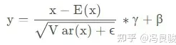
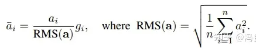
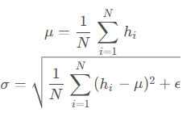
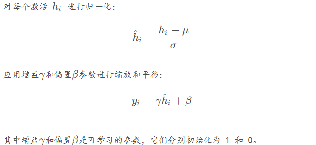
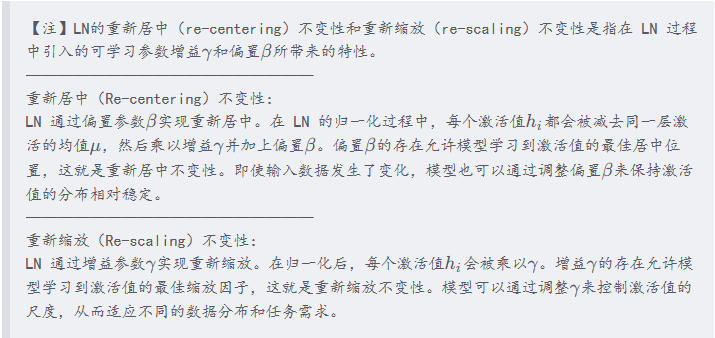
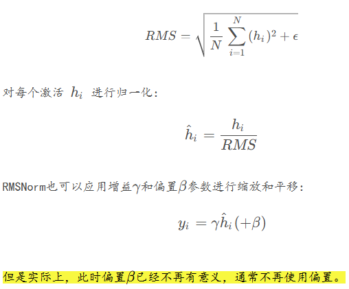
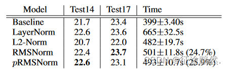

# RMS Normalization原理

说RMS Normalization之前，先讲Layer Normalization 和 Batch Normalization。

BN和LN是两种常见的归一化方法。它们的目的是帮助模型训练更稳定、收敛更快。BN是在Batch维度上进行归一化，即对同一batch中每个特征维度的值进行归一化。LN则是在层的维度上进行归一化，即对每一个样本的特征进行归一化。RMS Normalization属于LN。

再来说RMS Normalization和Layer Normalization。

- Layer Normalization：利用均值和方差对特征进行归一化。
- RMS Normalization：利用均方根对特征进行归一化。

LLaMA架构中采用RMS Normalization的原因是**通过只计算均方根，从而减少计算量，同时在实验中也确实获得了更加稳定的训练**。

在这里插入一点NLP任务中，对于将特征进行“归一化”目的的一些个人小理解：在NLP中，使用Layer Normalization进行归一化是为了使输入特征在每一层的神经元中保持稳定的分布，避免特征值之间出现过大的波动。通过归一化，Layer Normalization 将特征重新调整为均值为 0、方差为 1 的分布，从而让模型的训练更加稳定和高效，使得数据变得更加“平滑”。这里的“平滑”是指数值的尺度更一致、更稳定，不会有特别大的数值差异，能够防止特征值在网络层中传递时变得过大或过小。这种一致性有助于缓解模型训练中的一些问题，如梯度爆炸或梯度消失，并能让模型更容易优化。在使用RMS Normalization进行归一化则是直接使特征本身的数值变得更加“平滑”。

|          | Layer Normalization (LayerNorm)                              | RMS Normalization                                            |
| -------- | ------------------------------------------------------------ | ------------------------------------------------------------ |
| 原理     | 对每个维度的特征张量进行0均值，1方差的归一化操作。 LayerNorm 是一种标准化方法，它计算一个样本的均值和方差，然后使用这些来对样本进行归一化。这种方法是独立于批量大小的，使得模型更加稳定。 | RMSNorm是对LayerNorm的一个改进，没有做re-center操作（移除了其中的均值项），可以看作LayerNorm在均值为0时的一个特例。论文通过实验证明，re-center操作不重要。<br/>RMSNorm 也是一种标准化方法，但与 LayerNorm 不同，它不是使用整个样本的均值和方差，而是使用平方根的均值来归一化，这样做可以降低噪声的影响。 |
| 公式     |         |         |
| 公式解释 | 这里的x可以理解为 张量中具体某一维度的所有元素，比如对于 shape 为 (2,2,4) 的张量 input，若指定归一化的操作为第三个维度，则会对第三个维度中的四个张量，各进行上述的一次计算 | 这里的 ai与Layer Norm中的 x 等价，作者认为这种模式在简化了Layer Norm的同时，可以在各个模型上减少约 7%∼64% 的计算时间 |

注意RMS后面还有 $g_i$，这是缩放参数。代表**归一化后仍需要乘以一个重新缩放参数**。

## 论文

Root Mean Square Layer Normalization

https://arxiv.org/abs/1910.07467

层归一化（LayerNorm）在各种深度神经网络的应用比较成功，可以稳定模型训练、促进模型收敛。但LN的缺点是计算开销较大，模型一旦比较大，LN的缺点就更加突出。LN有两个特性：**重新居中（re-centering）不变性和重新缩放（re-scaling）不变性**。本篇论文假设 **LayerNorm 中的重新居中不变性是可有可无的**，并提出均方根层归一化（RMSNorm）。







RMSNorm在LayerNorm的基础上，RMSNorm不再求均值 $\mu$ 和标准差 $\sigma$，而是直接计算均方根



简单截了1张实验结果图，其中“Testxx”栏表示数据集的评价指标，越大越好，“Time”栏表示运行了k个Step所花的时间，越少越好。



主要还是比较RMSNorm是否比LN的时间短，并且效果不相上下？根据上述4张图，可以看到RMSNorm确实比LN要好一点。

## 代码

```python
import torch
 
 
class RMSNorm(torch.nn.Module):  # nn.Module是所有层的父类，层元素就必须继承nn.Module
    def __init__(self, dim, eps):  # 用于储存层的元素
        super().__init__()
        self.weight = torch.nn.Parameter(torch.ones(dim))  # 初始化权重参数
        self.eps = eps  # 防止根号下为0
 
    def _norm(self, x):  # 定义类函数里的方法（"_"表示只在该类的内部调用）
        return x * torch.rsqrt(x.pow(2).mean(-1, keepdim=True) + self.eps)
        # x.pow(2)：求平方
        # x.pow(2).mean(-1, keepdim=True)：所有的平方求一个均值
        # x.pow(2).mean(-1, keepdim=True) + self.eps：加上一个防止根号下为0的元素
        # torch.rsqrt(x.pow(2).mean(-1, keepdim=True) + self.eps)：开平方再求导
        # rsqrt(x) = 1 / sqrt(x)
        # x * torch.rsqrt(x.pow(2).mean(-1, keepdim=True) + self.eps)：最后用求得的导数乘以x
 
    def forward(self, x):  # 数据流
        output = self._norm(x.float().type_as(x))  # 将x变成浮点数进行归一化，并保持x原始的数据类型
        return output * self.weight  # 将归一化后的输出乘以可学习的参数 weight,调整每一个维度的缩放
 
 
if __name__ == '__main__':
 
    batch_size = 1
    dim = 4  # 特征维度
    x = torch.Tensor([0.1, 0.1, 0.2, 0.3])
    # 初始化RMSNorm对象
    rms_norm = RMSNorm(dim=dim, eps=0)
    output = rms_norm(x)
 
    print("输入数据: \n", x)
    print("RMSNorm输出数据: \n", output)
```

## 参考

- https://blog.csdn.net/qq_43592352/article/details/137399273
- https://blog.csdn.net/nghhfgh/article/details/142814773
- https://blog.csdn.net/qq_39970492/article/details/131125752
