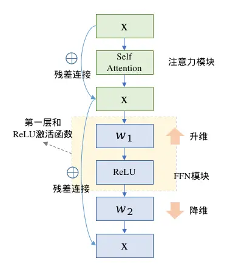
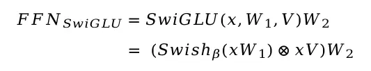
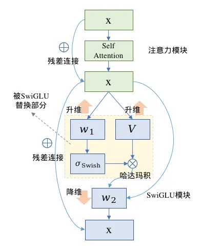
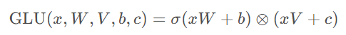
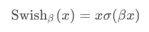
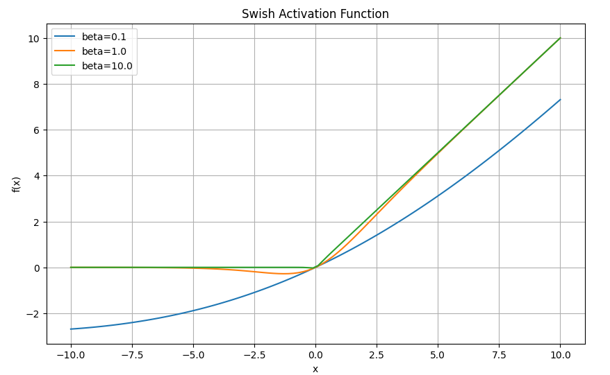
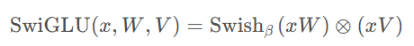
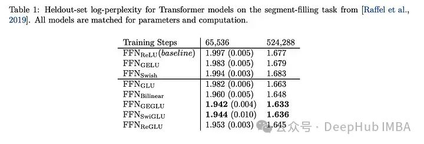

# SwiGLU

SwiGLU是[GLU](https://so.csdn.net/so/search?q=GLU&spm=1001.2101.3001.7020)的一种变体，其中包含了GLU和Swish激活函数。

SwiGLU本质上是对Transformer的FFN前馈传播层的`第一层全连接`和`ReLU`进行了替换，在原生的FFN中采用两层全连接，第一层升维，第二层降维回归到输入维度，两层之间使用ReLE激活函数，计算流程图如下（省略LayerNorm模块）



SwiGLU也是全连接配合激活函数的形式，不同的是SwiGLU采用两个权重矩阵和输入分别变换，再配合Swish激活函数做哈达马积的操作，因为FFN本身还有第二层全连接，所以带有SwiGLU激活函数的FFN模块一共有三个权重矩阵，用公式表达如下






## GLU

GLU(Gated Linear Units,门控线性单元)2引入了两个不同的线性层，其中一个首先经过sigmoid函数，其结果将和另一个线性层的输出进行逐元素相乘作为最终的输出：



这里 W , V 以及 b,c 分别是这两个线性层的参数；$\sigma(xW+b)$ 作为门控，控制 $xV+c$ 的输出。

这里使用 $\sigma$ 作为激活函数，修改改激活函数得到的变体通常能带来更好的性能表现，比如SwiGLU修改激活函数为Swish。我们来看下Swish激活函数。

GLU提出于2016年发表的论文《nguage modeling with gated convolutional networks》中，GLU是一种类似LSTM带有门机制的网络结构，同时它类似Transformer一样具有可堆叠性和残差连接，**它的作用是完成对输入文本的表征，通过门机制控制信息通过的比例，来让模型自适应地选择哪些单词和特征对预测下一个词有帮助，通过堆叠来挖掘高阶语义，通过残差连接来缓解堆叠的梯度消失和爆炸**。


## Swish

Swish激活函数的形式为：



其中 $\sigma(x)$ 是Sigmoid函数（$x\sigma(x)$在python中是silu函数）；$\beta$ 是一个可学习的参数。

可以通过下面的代码画出Swish激活函数在不同参数 $\beta$ 下的图像：

```python
import numpy as np
import matplotlib.pyplot as plt

def swish(x, beta):
  return x / (1 + np.exp(-beta*x))

x = np.linspace(-10, 10, 100)
betas = [0.1, 1.0, 10.0]

plt.figure(figsize=(10, 6))

for beta in betas:
    y = swish(x, beta)
    plt.plot(x, y, label=f'beta={beta}')

plt.legend()
plt.title('Swish Activation Function')
plt.xlabel('x')
plt.ylabel('f(x)')
plt.grid(True)
plt.show()
```



可以看到，当 $\beta$ 趋近于0 时，Swish函数趋近于线性函数 $y=x^2$ ；当 $\beta$ 趋近于无穷大时，Swish函数趋近于ReLU函数；当 $\beta$ 取值为 1 时，Swish函数是光滑且非单调的，等价于参考4中介绍的SiLU。

Swish与ReLU之间最显著的区别是当 x < 0 时Swish的非单调“凸起”。Swish可以比ReLU激活函数更好，因为它在0附近提供了更平滑的转换，这可以带来更好的优化。

## SwiGLU



```python
import torch
from torch import nn
import torch.nn.functional as F

class FeedForward(nn.Module):
    def __init__(self, hidden_size: int, intermediate_size: int) -> None:
       	super().__init__()

        self.w1 = nn.Linear(hidden_size, intermediate_size, bias=False)
        self.w2 = nn.Linear(intermediate_size, hidden_size, bias=False)
        self.w3 = nn.Linear(hidden_size, intermediate_size, bias=False)
        
    def forward(self, x: torch.Tensor) -> torch.Tensor:
        # x: (batch_size, seq_len, hidden_size)
        # w1(x) -> (batch_size, seq_len, intermediate_size)
        # w3(x) -> (batch_size, seq_len, intermediate_size)
        # w2(*) -> (batch_size, seq_len, hidden_size)
    	return self.w2(F.silu(self.w1(x)) * self.w3(x))

```

其实就是用一组参数来计算门，然后将门值作用到输出上，类似LSTM的记忆门，遗忘门。

SwiGLU的优势主要体现在以下几个方面：

- 提升性能：SwiGLU被应用于Transformer架构中的前馈神经网络（FFN）层，用于增强性能
- 可微性：SwiGLU是处处可微的非线性函数[
- 自适应性：GLU是一种类似于长短期记忆网络（LSTM）带有门机制的网络结构，通过门机制控制信息通过的比例，来让模型自适应地选择哪些单词和特征对预测下一个词有帮助

SwiGLU与其他GLU变体进行比较，我们可以看到SwiGLU在两种预训练期间都表现得更好。



效果表现得最好，所以现在的llm，如LLAMA, OLMO和PALM都在其实现中采用SwiGLU。但是为什么SwiGLU比其他的好呢？论文中只给了测试结果而且并没有说明原因，而是说：

> We offer no explanation as to why these architectures seem to work; we  attribute their success, as all else, to divine benevolence.

作者说炼丹成功了。

但是现在已经是2024年了我们可以强行的解释一波：

1. Swish对于负值的响应相对较小克服了 ReLU 某些神经元上输出始终为零的缺点
2. GLU 的门控特性，这意味着它可以根据输入的情况决定哪些信息应该通过、哪些信息应该被过滤。这种机制可以使网络更有效地学习到有用的表示，有助于提高模型的泛化能力。在大语言模型中，这对于处理长序列、长距离依赖的文本特别有用。
3. SwiGLU 中的参数 W1,W2,W3,b1,b2,b3W1,W2,W3,b1,b2,b3 可以通过训练学习，使得模型可以根据不同任务和数据集动态调整这些参数，增强了模型的灵活性和适应性。
4. 计算效率相比某些较复杂的激活函数（如 GELU）更高，同时仍能保持较好的性能。这对于大规模语言模型的训练和推理是很重要的考量因素。

选择 SwiGLU  作为大语言模型的激活函数，主要是因为它综合了非线性能力、门控特性、梯度稳定性和可学习参数等方面的优势。在处理语言模型中复杂的语义关系、长依赖问题、以及保持训练稳定性和计算效率方面，SwiGLU 表现出色，因此被广泛采用。


## 参考

- https://blog.csdn.net/2401_85325397/article/details/139306896
- https://blog.csdn.net/baoyan2015/article/details/138137549
- https://blog.csdn.net/yjw123456/article/details/138441972