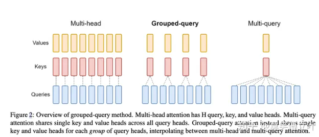
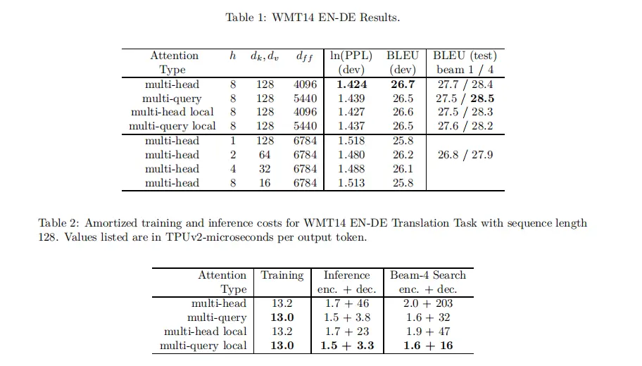

Multi Query Attention(MQA)在2019年就被提出来了，用于推理加速，但在当时并没有受到很多关注，毕竟一张2080就能跑Bert-base了。随着LLM的大火，MQA所带来的收益得以放大。

## 1. GQA的定义

Grouped-Query Attention (GQA) 是对 Multi-Head Attention (MHA) 和 Multi-Query Attention (MQA) 的扩展。通过提供计算效率和模型表达能力之间的灵活权衡，实现了查询头的分组。**GQA将查询头分成了G个组，每个组共享一个公共的键（K）和值（V）投影**。

## 2.GQA的变体

GQA有三种变体：

1. GQA-1：一个单独的组，等同于 Multi-Query Attention (MQA)。
2. GQA-H：组数等于头数，基本上与 Multi-Head Attention (MHA) 相同。
3. GQA-G：一个中间配置，具有G个组，平衡了效率和表达能力。

## 3.GQA的优势

使用G个组可以减少存储每个头的键和值所需的内存开销，特别是在具有大的上下文窗口或批次大小的情况下。GQA提供了对模型质量和效率的细致控制。

```
MHA: Q, K, V = (512, 768), # seq_len, hidden_dim
			拆成8个头：
			Q : (8, 512, 96) 
			k, v: (8, 512, 96)
MQA: 
 Q -> (512, 768) 
 K -> (512, 96)
 v -> (512, 96)
把Q拆成8个头：
Q： (8, 512, 96)
K, V：(512, 96)
```

可以看到参数数量大幅减少。



实验指标略微降低，但推理加速（dec部分）非常明显。

## 4.GQA的实现

GQA的最简形式可以通过实现 GroupedQueryAttention 类来实现。GroupedQueryAttention 类继承自 Attention 类，重写了 forward 方法，其中使用了 MultiQueryAttention 类的实例来处理每个组的查询。通过将每个组的结果拼接起来，然后与投影矩阵进行矩阵乘法运算，最终得到 GQA 的输出。


## pytorch 示例实现：

假设我们有以下初始化的query, key, value：

```
# shapes: (batch_size, seq_len, num_heads, head_dim)
query = torch.randn(1, 256, 8, 64)
key = torch.randn(1, 256, 2, 64)
value = torch.randn(1, 256, 2, 64)
```

### 1. 确定分组数量

首先，我们需要确定将查询头分为多少组。在这个例子中，我们有8个查询头，而键和值的头数为2，所以我们可以将查询头分为4组，每组有2个查询头。

### 2. 对查询进行分组

然后，我们将查询头分组。我们可以使用 torch.chunk 函数将查询张量沿着头维度分割成4个组，每个组有2个头。

```python
query_groups = torch.chunk(query, 4, dim=2)  # shape of each group: (1, 256, 2, 64)
```

### 3. 计算注意力分数

对于每一个查询组，我们计算它与键的注意力分数。我们首先计算查询组和键的点积，然后通过 `torch.softmax` 函数得到注意力分数。

```python
attention_scores = []
for query_group in query_groups:
    score = torch.matmul(query_group, key.transpose(-2, -1))  # shape: (1, 256, 2, 2)
    score = torch.softmax(score, dim=-1)
    attention_scores.append(score)
```

### 4. 计算注意力输出

接下来，我们使用注意力分数对值进行加权求和，得到每一个查询组的注意力输出。

```python
attention_scores = []
for query_group in query_groups:
    score = torch.matmul(query_group, key.transpose(-2, -1))  # shape: (1, 256, 2, 2)
    score = torch.softmax(score, dim=-1)
    attention_scores.append(score)
```

### 5. 拼接输出

最后，我们将所有查询组的注意力输出拼接起来，得到最终的 Grouped Query Attention 的输出。

```python
attention_outputs = []
for score in attention_scores:
    output = torch.matmul(score, value)  # shape: (1, 256, 2, 64)
    attention_outputs.append(output)
```

这就是 Grouped Query Attention 的实现过程。在这个过程中，我们将查询头分组，然后对每一个查询组分别计算注意力分数和输出，最后将所有查询组的输出拼接起来。这样可以减少存储每个头的键和值所需的内存开销，特别是在具有大的上下文窗口或批次大小的情况下。