# Rotary Position Embedding (RoPE, 旋转式位置编码)

旋转式位置编码（RoPE）最早是论文`[1]`提出的一种能够将相对位置信息依赖集成到 self-attention 中并提升 transformer 架构性能的位置编码方式。而目前很火的 LLaMA 模型也是采用该位置编码方式。

## attention回忆

首先论文中定义一个长度为 `N` 的输入序列为：


其中 `wi` 表示输入序列中第 `i` 个 token，而输入序列 `SN` 对应的 embedding 表示为：


其中 `xi` 表示第 `i` 个 token `wi` 对应的 `d` 维词嵌入向量。

Transformer中模型不涉及RNN的循环和CNN的卷积，为了学习到sequence中的前后顺序关系，增加了position embedding。因此接着在做 self-attention 之前，会用词嵌入向量计算 `q, k, v` 向量同时加入位置信息，函数公式表达如下：


其中 `qm` 表示第 `m` 个 token 对应的词向量 `xm` 集成位置信息 `m` 之后的 query 向量。而 `kn` 和 `vn` 则表示第 `n` 个 token 对应的词向量 `xn` 集成位置信息 `n` 之后的 key 和 value 向量。

而基于 transformer 的位置[编码方法](https://zhida.zhihu.com/search?content_id=230994010&content_type=Article&match_order=1&q=编码方法&zhida_source=entity)都是着重于构造一个合适的 `f{q,k,v}` 函数形式。

而计算第 m 个词嵌入向量 `xm` 对应的 self-attention 输出结果，就是 `qm` 和其他 `kn` 都计算一个 attention score ，然后再将 attention score 乘以对应的 `vn` 再求和得到输出向量 `om`：


## 绝对位置编码

对于位置编码，常规的做法是在计算 query, key 和 value 向量之前，会计算一个**位置编码向量** `pi` 加到词嵌入 `xi` 上，位置编码向量 `pi` 同样也是 `d` 维向量，然后再乘以对应的变换矩阵`W{q,k,v}`：


而经典的位置编码向量 `pi` 的计算方式是：


其中 $p_{i,2t}$ 表示位置 `d` 维度向量 `pi` 中的第 `2t` 位置分量也就是偶数索引位置的计算公式，而  $p_{i,2t+1}$ 就对应第 `2t+1` 位置分量也就是奇数索引位置的计算公式。


示例如下, 对`I am a robot`进行编码：


编码过程中d_model=4, 论文中的10000对应改为100，结果如下：


- **优势：** 实现简单，可预先计算好，不用参与训练，速度快。
- **劣势：** 没有外推性，即如果预训练最大长度为512的话，那么最多就只能处理长度为512的句子，再长就处理不了了。当然，也可以将超过512的位置向量随机初始化，然后继续微调。

## **旋转式位置编码**

接着论文中提出为了能利用上 token 之间的相对位置信息，假定 query 向量 `qm` 和 key 向量 `kn` 之间的内积操作可以被一个函数 `g` 表示，该函数 `g` 的输入是词嵌入向量 `xm` ， `xn` 和它们之间的相对位置 `m-n`：


RoPE编码要解决的问题中计算**QK内积只依赖相对位置** `m-n`。接下来的目标就是找到一个等价的位置编码方式，从而使得上述关系成立。

假定现在词嵌入向量的维度是两维 `d=2`，这样就可以利用上2维度平面上的向量的几何性质，然后论文中提出了一个满足上述关系的 `f` 和 `g` 的形式如下：


其中`Re[x]` 表示一个复数 `x` 的实部部分，而 $(W_kx_n)∗$ 则表示复数 Wkxn 的共轭。

这就涉及到了复数（**注意这里我们已经得到了初步答案，但 $e^i$ 是复数，而其他符号是矩阵，因此接下来就是把复数转换为矩阵形式**）

### 复数

首先看到上述 `f` 和 `g` 公式中有个指数函数：$ e^{ix}$

这个其实是欧拉公式，其中 `x` 表示任意实数， `e` 是自然对数的底数，`i` 是复数中的虚数单位，则根据欧拉公式有：


则是上述指数函数可以表示为实部为 `cosx`，虚部为 `sinx` 的一个复数，欧拉公式 建立了指数函数、三角函数和复数之间的桥梁。

则上述 `f` 和 `g` 公式重新表示为


```
import numpy as np
import matplotlib.pyplot as plt

# Define the input vector x = (0, 1)
x = np.array([0, 1])

# Function to compute rotation matrix
def rotate(vector, angle):
    rotation_matrix = np.array([
        [np.cos(angle), -np.sin(angle)],
        [np.sin(angle), np.cos(angle)]
    ])
    return rotation_matrix @ vector

# Angles for rotation (in radians)
angles = np.linspace(0, 2 * np.pi, 16, endpoint=False)

# Create a figure
plt.figure(figsize=(8, 8))
origin = np.array([0, 0])  # Origin for the vectors

for angle in angles:
    rotated_vector = rotate(x, angle)
    plt.quiver(*origin, *rotated_vector, angles='xy', scale_units='xy', scale=1, color="blue")
    # plt.text(rotated_vector[0] * 0.75, rotated_vector[1] * 0.75, f"{angle}°", fontsize=9, color="blue")

# Plot original vector for reference
plt.quiver(*origin, *x, angles='xy', scale_units='xy', scale=1, color="red", label="Original (0,1)")

# Add labels and grid
plt.title("Rotations of Vector (0, 1) by Different Angles")
plt.xlabel("X-axis")
plt.ylabel("Y-axis")
plt.axhline(0, color='gray', linewidth=0.5, linestyle='--')
plt.axvline(0, color='gray', linewidth=0.5, linestyle='--')
plt.grid(color='gray', linestyle='--', linewidth=0.5)
plt.legend()
plt.axis('equal')  # Equal aspect ratio
plt.show()

```

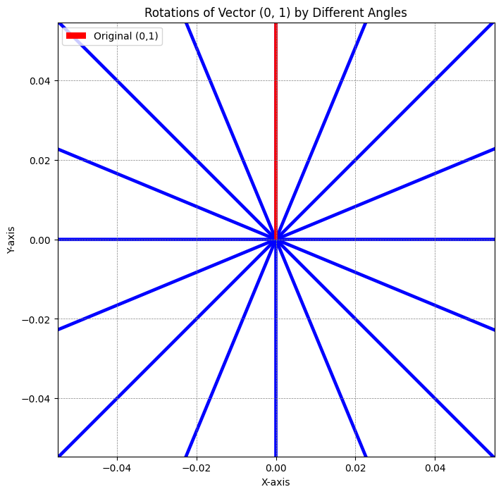

这是一个旋转示意图

## 返回到位置编码


假设 `Wq` 是个二维矩阵，`xm` 是个二维向量，相乘的结果也是一个二维向量，这里用 `qm` 表示：


然后首先将 `qm` 表示成复数形式（**注意，一个 1×2 的矩阵可以表示为复数形式，通常是因为复数可以被看作一个二维向量，具体表示为实部和虚部。例如，复数 z=a+b 可以表示为矩阵 [a,b]，其中 a 是实部，b 是虚部。**）


将结果重新表达成实数向量形式就是：


这不就是 query 向量乘以了一个旋转矩阵吗


这就是为什么叫做旋转式位置编码的原因。

同理可得 key 向量 `kn` ：


## 验证 f 内积是否真正有效

最后还有个函数 `g`：


其中 `Re[x]` 表示一个复数 `x` 的实部部分，而 $(W_kx_n)^∗$ 则表示复数 $W_kx_n$  的共轭。

复习一下[共轭复数](https://zhida.zhihu.com/search?content_id=230994010&content_type=Article&match_order=1&q=共轭复数&zhida_source=entity)的定义：

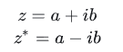

所以可得：

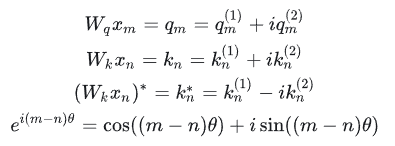

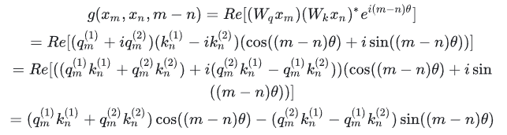

ok，接下来我们就要证明函数 `g` 的计算公式是成立的。

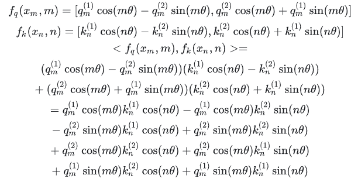

再结合一下三角函数的一些性质

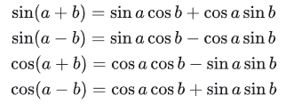

整理一下

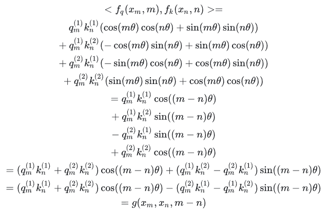

这就证明上述关系是成立的，位置 m 的 query 和位置 n 的 key 的内积就是函数 `g`。

把上面的式子用矩阵向量乘的形式来表达就是：

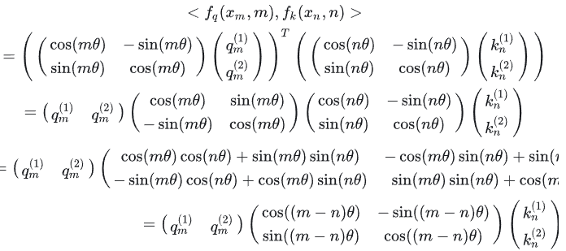

## GPT推导

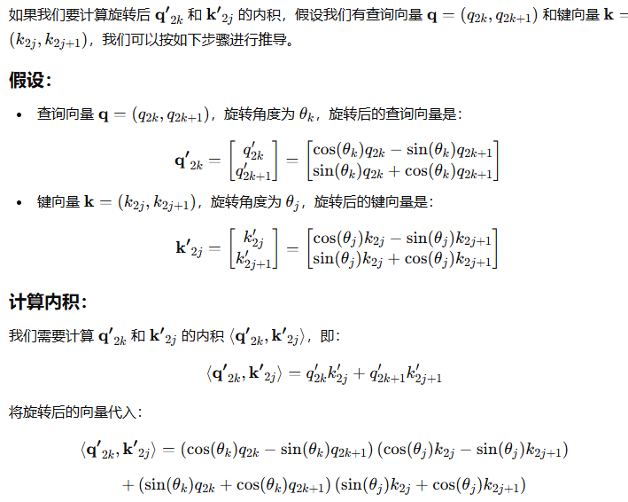

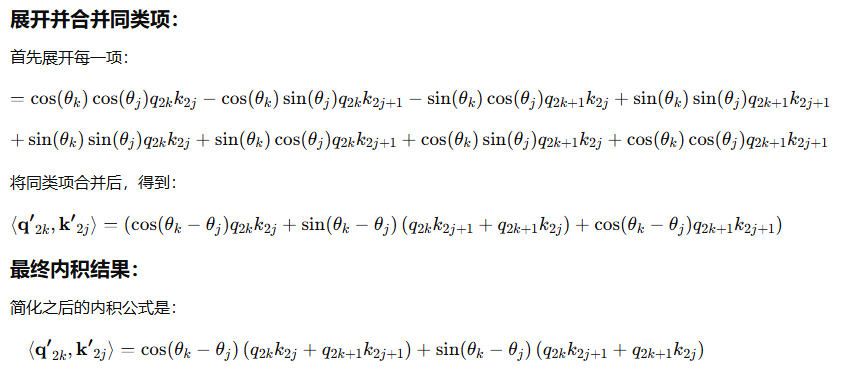

内积的结果与旋转角度 $\theta_k - \theta_j$ 有关，体现了两个维度之间的旋转差异。虽然这会夹杂同组embedding的信息，但无伤大雅。


## 扩展到n

然后上面的讲解是假定的词嵌入维度是2维向量，而对于d >= 2 的通用情况，则是将词嵌入向量元素按照两两一组分组，每组应用同样的旋转操作且每组的旋转角度计算方式如下：
$$
θj=10000^{2(j−1)/d},j∈[1,2,...,d/2]
$$
所以简单来说 RoPE 的 self-attention 操作的流程是，对于 token 序列中的每个词嵌入向量，首先计算其对应的 query 和 key 向量，然后对每个 token 位置都计算对应的旋转位置编码，接着对每个 token 位置的 query 和 key 向量的元素按照 两两一组 应用旋转变换，最后再计算 query 和 key 之间的内积得到 self-attention 的计算结果。

论文中有个很直观的图片展示了[旋转变换](https://zhida.zhihu.com/search?content_id=230994010&content_type=Article&match_order=2&q=旋转变换&zhida_source=entity)的过程：

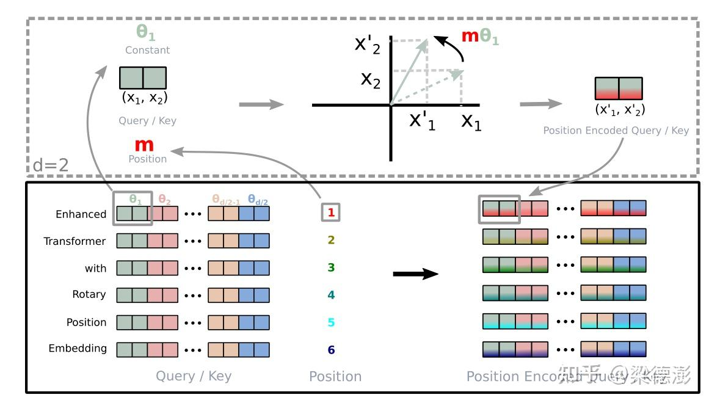

从二维扩到N维，对应的QK计算中相对位置只依赖R的矩阵

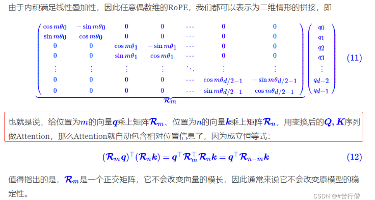

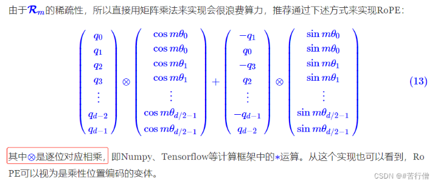


## 为什么是对两两一组的embedding做旋转

**复数限制**： 复数自然适用于二维旋转，复数乘法的几何意义就是二维平面上的旋转。如果扩展到更高维度，则需要使用更复杂的旋转矩阵（如四元数或正交矩阵），但这些计算复杂度较高，且不容易映射到嵌入向量的相对位置关系。

------

### 具体拆解

#### **每对的旋转公式**

假设输入的嵌入维度为 dd，RoPE 会将嵌入划分为 $d/2$ 组，每组两维。例如，第 k 对分量为 $(x_{2k}, x_{2k+1})$，其旋转位置编码为：

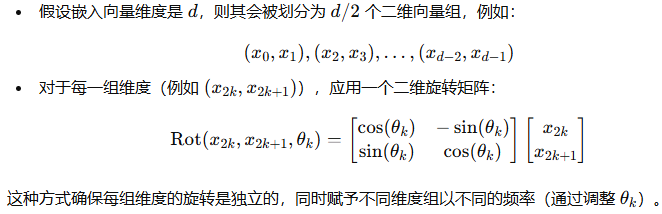

1. **对内的旋转角度**： 在每对分量内，旋转的角度是 **一致的**（即 $m \theta_k$），因此这一对分量被视为一个二维向量整体进行旋转。注意旋转时是两个embedding的每个维度的两个值进行旋转，因此每两组都会结合对方的信息。
2. **对间的角度差异**： 不同的对对应的旋转步长 $\theta_k$ 是不同的，$\theta_k$ 通常呈现指数缩放。这种设计使得不同的维度组能够捕捉不同的频率信息。

这种设计通过多频率编码让模型既能捕捉局部特征又能捕捉全局特征，从而提升了对相对位置关系的建模能力。

------

### 几何解释

- **每对维度的旋转**：
  - 在二维平面上，将 $(x_{2k}, x_{2k+1})$ 看成一个二维向量。旋转矩阵的作用是将这个向量围绕原点旋转一个角度 $m \theta_k$，保持其模长（大小）不变，只改变方向。
- **不同对的旋转**：
  - 第 k 对和第 l 对旋转的角度分别是 $m \theta_k$ 和 $m \theta_l$，由于$\theta_k \neq \theta_l$，不同维度的频率信息被解耦，使得模型能够捕捉多尺度的位置关系。

------

### **关键问题：是否“旋转到同一个角度”？**

#### 回答：

**不是旋转到同一个角度。**

- 对于每对维度内的两个分量，旋转角度是相同的（例如，第 k 对分量在二维平面上整体旋转 $m \theta_k$）。
- 但不同对的旋转角度 $m \theta_k$ 和 $m \theta_l$ 是不同的。更高的维度对应更低的频率旋转。

------

### 为什么这么设计？

1. **保留局部和全局信息**：
   - 较大的 $\theta_k$ 对应高频旋转（局部变化），适合捕捉局部依赖关系。
   - 较小的 $\theta_k$ 对应低频旋转（全局变化），适合捕捉全局依赖关系。
2. **多尺度特性**：
   - 不同对的旋转频率构成了一个频率谱，使得模型能够从多尺度的角度理解位置关系。
3. **相对位置编码**：
   - 这种设计保证了点积计算中，不同对的频率不会相互干扰，而是线性叠加，最终通过 $\sum_k e^{i (m-n)\theta_k}$ 表达相对位置关系。

------

### 


## 参考

1. https://zhuanlan.zhihu.com/p/642884818

2. https://blog.csdn.net/weixin_43646592/article/details/130924280

3. https://blog.csdn.net/qinduohao333/article/details/131090280