# Rotary Position Embedding (RoPE, 旋转式位置编码)

旋转式位置编码（RoPE）最早是论文`[1]`提出的一种能够将相对位置信息依赖集成到 self-attention 中并提升 transformer 架构性能的位置编码方式。而目前很火的 LLaMA 模型也是采用该位置编码方式。

## attention回忆

首先论文中定义一个长度为 `N` 的输入序列为：

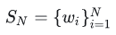

其中 `wi` 表示输入序列中第 `i` 个 token，而输入序列 `SN` 对应的 embedding 表示为：

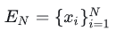

其中 `xi` 表示第 `i` 个 token `wi` 对应的 `d` 维词嵌入向量。

Transformer中模型不涉及RNN的循环和CNN的卷积，为了学习到sequence中的前后顺序关系，增加了position embedding。因此接着在做 self-attention 之前，会用词嵌入向量计算 `q, k, v` 向量同时加入位置信息，函数公式表达如下：

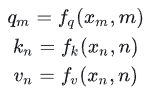

其中 `qm` 表示第 `m` 个 token 对应的词向量 `xm` 集成位置信息 `m` 之后的 query 向量。而 `kn` 和 `vn` 则表示第 `n` 个 token 对应的词向量 `xn` 集成位置信息 `n` 之后的 key 和 value 向量。

而基于 transformer 的位置[编码方法](https://zhida.zhihu.com/search?content_id=230994010&content_type=Article&match_order=1&q=编码方法&zhida_source=entity)都是着重于构造一个合适的 `f{q,k,v}` 函数形式。

而计算第 m 个词嵌入向量 `xm` 对应的 self-attention 输出结果，就是 `qm` 和其他 `kn` 都计算一个 attention score ，然后再将 attention score 乘以对应的 `vn` 再求和得到输出向量 `om`：

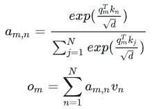

## 绝对位置编码

对于位置编码，常规的做法是在计算 query, key 和 value 向量之前，会计算一个**位置编码向量** `pi` 加到词嵌入 `xi` 上，位置编码向量 `pi` 同样也是 `d` 维向量，然后再乘以对应的变换矩阵`W{q,k,v}`：

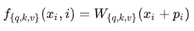

而经典的位置编码向量 `pi` 的计算方式是：

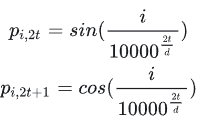

其中 $p_{i,2t}$ 表示位置 `d` 维度向量 `pi` 中的第 `2t` 位置分量也就是偶数索引位置的计算公式，而  $p_{i,2t+1}$ 就对应第 `2t+1` 位置分量也就是奇数索引位置的计算公式。

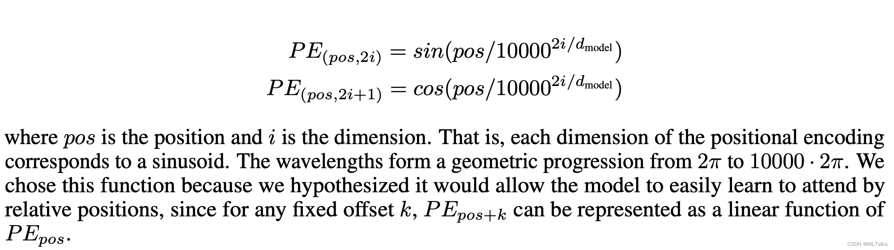

示例如下, 对`I am a robot`进行编码：

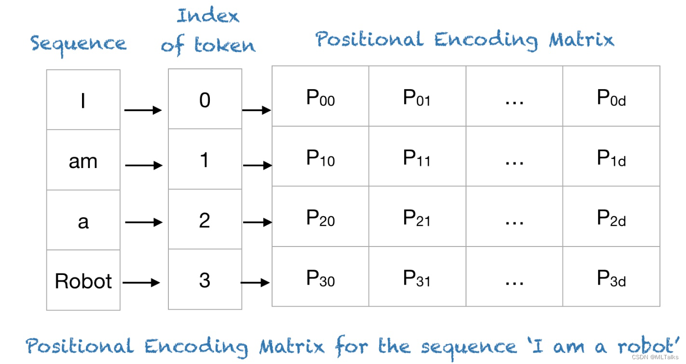

编码过程中d_model=4, 论文中的10000对应改为100，结果如下：

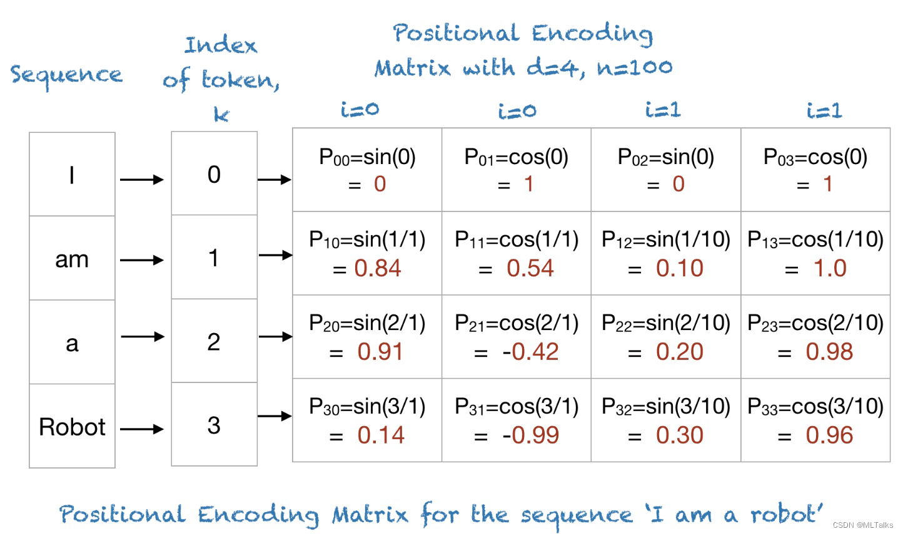

- **优势：** 实现简单，可预先计算好，不用参与训练，速度快。
- **劣势：** 没有外推性，即如果预训练最大长度为512的话，那么最多就只能处理长度为512的句子，再长就处理不了了。当然，也可以将超过512的位置向量随机初始化，然后继续微调。

## **旋转式位置编码**

接着论文中提出为了能利用上 token 之间的相对位置信息，假定 query 向量 `qm` 和 key 向量 `kn` 之间的内积操作可以被一个函数 `g` 表示，该函数 `g` 的输入是词嵌入向量 `xm` ， `xn` 和它们之间的相对位置 `m-n`：

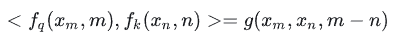

RoPE编码要解决的问题中计算**QK内积只依赖相对位置** `m-n`。接下来的目标就是找到一个等价的位置编码方式，从而使得上述关系成立。

假定现在词嵌入向量的维度是两维 `d=2`，这样就可以利用上2维度平面上的向量的几何性质，然后论文中提出了一个满足上述关系的 `f` 和 `g` 的形式如下：

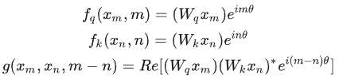

这就涉及到了复数

### 复数

首先看到上述 `f` 和 `g` 公式中有个指数函数：$ e^{ix}$

这个其实是欧拉公式，其中 `x` 表示任意实数， `e` 是自然对数的底数，`i` 是复数中的虚数单位，则根据欧拉公式有：

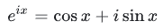

则是上述指数函数可以表示为实部为 `cosx`，虚部为 `sinx` 的一个复数，欧拉公式 建立了指数函数、三角函数和复数之间的桥梁。

则上述 `f` 和 `g` 公式重新表示为

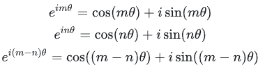

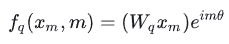

其中 `Wq` 是个二维矩阵，`xm` 是个二维向量，相乘的结果也是一个二维向量，这里用 `qm` 表示：

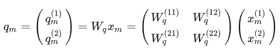

然后首先将 `qm` 表示成复数形式

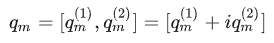

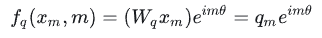

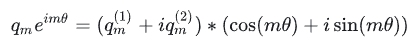

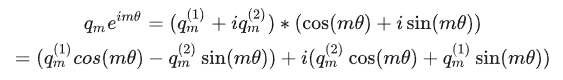

将结果重新表达成实数向量形式就是：

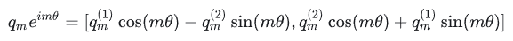

这不就是 query 向量乘以了一个旋转矩阵吗

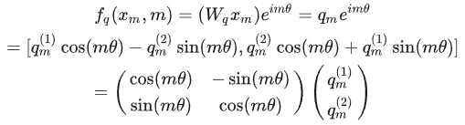

这就是为什么叫做旋转式位置编码的原因。

同理可得 key 向量 `kn` ：

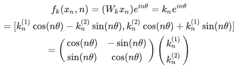

最后还有个函数 `g`：

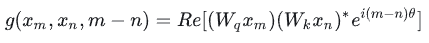

其中 `Re[x]` 表示一个复数 `x` 的实部部分，而 $(W_kx_n)^∗$ 则表示复数 $W_kx_n$  的共轭。

## 参考

https://zhuanlan.zhihu.com/p/642884818

https://blog.csdn.net/weixin_43646592/article/details/130924280

https://blog.csdn.net/qinduohao333/article/details/131090280