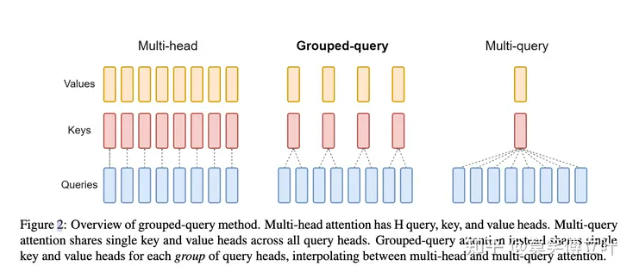
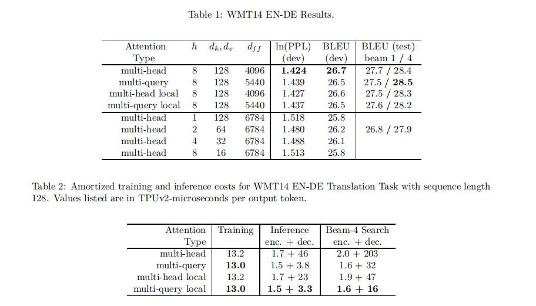

Multi Query Attention(MQA)在2019年就被提出来了，用于推理加速，但在当时并没有受到很多关注，毕竟一张2080就能跑Bert-base了。随着LLM的大火，MQA所带来的收益得以放大。

## GQA的定义

Grouped-Query Attention (GQA) 是对 Multi-Head Attention (MHA) 和 Multi-Query Attention (MQA) 的扩展。通过提供计算效率和模型表达能力之间的灵活权衡，实现了查询头的分组。**GQA将查询头分成了G个组，每个组共享一个公共的键（K）和值（V）投影**。

## GQA的变体

GQA有三种变体：

1. GQA-1：一个单独的组，等同于 Multi-Query Attention (MQA)。
2. GQA-H：组数等于头数，基本上与 Multi-Head Attention (MHA) 相同。
3. GQA-G：一个中间配置，具有G个组，平衡了效率和表达能力。

## GQA的优势

使用G个组可以减少存储每个头的键和值所需的内存开销，特别是在具有大的上下文窗口或批次大小的情况下。GQA提供了对模型质量和效率的细致控制。

```
MHA: Q, K, V = (512, 768), # seq_len, hidden_dim
			拆成8个头：
			Q : (8, 512, 96) 
			k, v: (8, 512, 96)
MQA: 
 Q -> (512, 768) 
 K -> (512, 96)
 v -> (512, 96)
把Q拆成8个头：
Q： (8, 512, 96)
K, V：(512, 96)
```

可以看到参数数量大幅减少。



实验指标略微降低，但推理加速（dec部分）非常明显。


## GQA的实现

GQA的最简形式可以通过实现 GroupedQueryAttention 类来实现。GroupedQueryAttention 类继承自 Attention 类，重写了 forward 方法，其中使用了 MultiQueryAttention 类的实例来处理每个组的查询。通过将每个组的结果拼接起来，然后与投影矩阵进行矩阵乘法运算，最终得到 GQA 的输出。

## GQA的关键点

- 分组查询: 在GQA中，查询（query）被分成多个组，每个组独立计算注意力权重。这种分组可以减少计算量，因为每组的查询数量减少了。

- 共享键和值: 尽管查询被分组，GQA会在所有组中共享键（key）和值（value），从而减少内存消耗，并确保模型的注意力机制仍然能够有效捕捉输入之间的关系。

- 计算效率: 通过减少查询的数量，GQA大幅降低了计算成本，使得模型可以更高效地处理大规模数据，尤其是在资源有限的环境中。

- 保留性能: 尽管进行了分组，GQA仍然能够保持与标准多头自注意力机制相似的性能。实验表明，在许多任务中，GQA可以在减少计算和内存使用的同时，仍然取得与传统方法相当的结果。


## pytorch 示例实现：

假设我们有以下初始化的query, key, value：

```
# shapes: (batch_size, seq_len, num_heads, head_dim)
query = torch.randn(1, 256, 8, 64)
key = torch.randn(1, 256, 2, 64)
value = torch.randn(1, 256, 2, 64)
```

### 1. 确定分组数量

首先，我们需要确定将查询头分为多少组。在这个例子中，我们有8个查询头，而键和值的头数为2，所以我们可以将查询头分为4组，每组有2个查询头。

### 2. 对查询进行分组

然后，我们将查询头分组。我们可以使用 torch.chunk 函数将查询张量沿着头维度分割成4个组，每个组有2个头。

```python
query_groups = torch.chunk(query, 4, dim=2)  # shape of each group: (1, 256, 2, 64)
```

### 3. 计算注意力分数

对于每一个查询组，我们计算它与键的注意力分数。我们首先计算查询组和键的点积，然后通过 `torch.softmax` 函数得到注意力分数。

```python
attention_scores = []
for query_group in query_groups:
    score = torch.matmul(query_group, key.transpose(-2, -1))  # shape: (1, 256, 2, 2)
    score = torch.softmax(score, dim=-1)
    attention_scores.append(score)
```

### 4. 计算注意力输出

接下来，我们使用注意力分数对值进行加权求和，得到每一个查询组的注意力输出。

```python
attention_scores = []
for query_group in query_groups:
    score = torch.matmul(query_group, key.transpose(-2, -1))  # shape: (1, 256, 2, 2)
    score = torch.softmax(score, dim=-1)
    attention_scores.append(score)
```

### 5. 拼接输出

最后，我们将所有查询组的注意力输出拼接起来，得到最终的 Grouped Query Attention 的输出。

```python
attention_outputs = []
for score in attention_scores:
    output = torch.matmul(score, value)  # shape: (1, 256, 2, 64)
    attention_outputs.append(output)
```

这就是 Grouped Query Attention 的实现过程。在这个过程中，我们将查询头分组，然后对每一个查询组分别计算注意力分数和输出，最后将所有查询组的输出拼接起来。这样可以减少存储每个头的键和值所需的内存开销，特别是在具有大的上下文窗口或批次大小的情况下。

## 自己实现的版本

```
class GroupQueryAttention(nn.Module):
    """
    分组查询注意力,与多头注意力的区别在于，多个query共享1对key和value
    """
    def __init__(self, config:LLaMaConfig) -> None:
        super(GroupQueryAttention, self).__init__()

        assert config.num_attention_heads % config.num_key_value_heads == 0
        assert config.embed_dim % config.num_attention_heads == 0 

        # query的head最多，所以单头的dim由query来决定，实际上kv的参数量少了
        self.num_q_heads = config.num_attention_heads
        self.num_kv_heads = config.num_key_value_heads
        self.num_groups = config.num_attention_heads // config.num_key_value_heads
        self.head_dim = config.embed_dim // config.num_attention_heads


        self.q_proj = nn.Linear(config.embed_dim, config.embed_dim)
        self.k_proj = nn.Linear(config.embed_dim, self.head_dim*config.num_key_value_heads)
        self.v_proj = nn.Linear(config.embed_dim, self.head_dim*config.num_key_value_heads)
        self.o_proj = nn.Linear(config.embed_dim, config.embed_dim)
        self.dropout = nn.Dropout(config.prob_dropout)

    def forward(self, 
                query:torch.tensor, 
                key:torch.tensor, 
                value:torch.tensor, 
                freqs_cis_real_and_imag:torch.tensor, 
                mask:torch.tensor=None
                ):
        assert query.shape == key.shape == value.shape
        batch_size, seq_len, num_emb = query.shape

        # 映射
        Q = self.q_proj(query)
        K = self.k_proj(key)
        V = self.v_proj(value)
        # print(Q.shape, K.shape, V.shape)

        # 拆分出头
        # Q shape (batch_size, seq_len, num_q_heads, head_dim)
        # KV shape (batch_size, seq_len, num_kv_heads, head_dim)
        Q = torch.reshape(Q, (batch_size, seq_len, self.num_q_heads, self.head_dim))
        K = torch.reshape(K, (batch_size, seq_len, self.num_kv_heads, self.head_dim))
        V = torch.reshape(V, (batch_size, seq_len, self.num_kv_heads, self.head_dim))
        # print(Q.shape, K.shape, V.shape)

        # 翻转 head和seq两个维度
        # Q shape (batch_size, num_q_heads, seq_len, head_dim)
        # KV shape (batch_size, num_kv_heads, seq_len, head_dim)
        Q = Q.transpose(1,2)
        K = K.transpose(1,2)
        V = V.transpose(1,2)
        # print(Q.shape, K.shape, V.shape)

        # 复制k和v的头，用repeat_interleave而不是repeat
        # QKV shape (batch_size, num_q_heads, seq_len, head_dim)
        K = K.repeat_interleave(self.num_groups, dim=1)
        V = V.repeat_interleave(self.num_groups, dim=1)
        # print(Q.shape, K.shape, V.shape)
        
        # 应用旋转位置编码
        Q = apply_rope(Q, freqs_cis_real_and_imag)
        K = apply_rope(K, freqs_cis_real_and_imag)

        # 之后就和正常的MHA一样
        atten_score = Q @ K.transpose(-1,-2) / math.sqrt(self.head_dim)
        if mask is not None:
            atten_score = atten_score.masked_fill(mask==0, float('-inf'))
        atten_weight = torch.softmax(atten_score, dim=-1)
        # print(atten_weight.shape)

        y = atten_weight @ V
        y = y.transpose(1,2).contiguous().reshape((batch_size, seq_len, -1))

        y = self.o_proj(y)
        y = self.dropout(y)

        return y 
```

