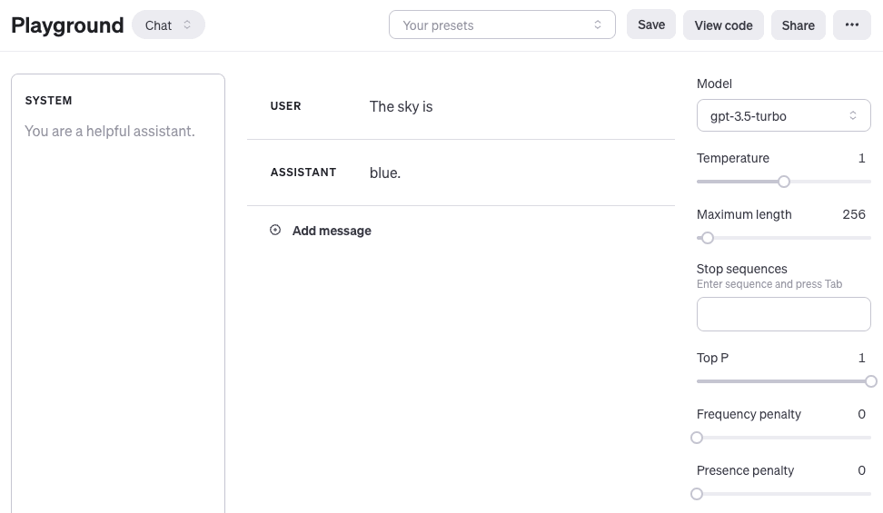

# 提示工程简介

提示工程是一个较新的学科，应用于开发和优化提示词（Prompt），帮助用户有效地将语言模型用于各种应用场景和研究领域。掌握了提示工程相关技能将有助于用户更好地了解大型语言模型的能力和局限性。研究人员可利用提示工程来提高大语言模型处理复杂任务场景的能力，如问答和算术推理能力。开发人员可通过提示工程设计和研发出强大的技术，实现和大语言模型或其他生态工具的高效接轨。

本指南介绍了提示词相关的基础知识，帮助用户了解如何通过提示词和大语言模型进行交互并提供指导建议。

除非另有说明，本指南默认所有示例都是在 OpenAI 的 Playground 上使用 `gpt-3.5-turbo` 进行测试。模型使用默认配置，即 temperature=1 和 top_p=1 。这些提示也应适用于具有类似功能的其他模型，如gpt-3.5-turbo，但模型响应可能会有所不同。

---

# 模型设置

使用提示词时，您通常会通过 API 或直接与大语言模型进行交互。你可以通过配置一些参数以获得不同的提示结果。调整这些设置对于提高响应的可靠性非常重要，你可能需要进行一些实验才能找出适合您的用例的正确设置。以下是使用不同LLM提供程序时会遇到的常见设置：

1. **Temperature**：简单来说，`temperature` 的参数值越小，模型就会返回越确定的一个结果。如果调高该参数值，大语言模型可能会返回更随机的结果，也就是说这可能会带来更多样化或更具创造性的产出。（调小`temperature`）实质上，你是在增加其他可能的 token 的权重。在实际应用方面，对于质量保障（QA）等任务，我们可以设置更低的 `temperature` 值，以促使模型基于事实返回更真实和简洁的结果。 对于诗歌生成或其他创造性任务，适度地调高 `temperature` 参数值可能会更好。

2. **Top_p**：同样，使用 `top_p`（与 `temperature` 一起称为核采样（nucleus sampling）的技术），可以用来控制模型返回结果的确定性。如果你需要准确和事实的答案，就把参数值调低。如果你在寻找更多样化的响应，可以将其值调高点。

   使用Top P意味着只有词元集合（tokens）中包含`top_p`概率质量的才会被考虑用于响应，因此较低的`top_p`值会选择最有信心的响应。这意味着较高的`top_p`值将使模型考虑更多可能的词语，包括不太可能的词语，从而导致更多样化的输出。

   一般建议是改变 Temperature 和 Top P 其中一个参数就行，不用两个都调整。

3. **Max Length**：您可以通过调整 `max length` 来控制大模型生成的 token 数。指定 Max Length 有助于防止大模型生成冗长或不相关的响应并控制成本。

4. **Stop Sequences**：`stop sequence` 是一个字符串，可以阻止模型生成 token，指定 `stop sequences` 是控制大模型响应长度和结构的另一种方法。例如，您可以通过添加 “11” 作为 `stop sequence` 来告诉模型生成不超过 10 个项的列表。

5. **Frequency Penalty**：`frequency penalty` 是对下一个生成的 token 进行惩罚，这个惩罚和 token 在响应和提示中已出现的次数成比例， `frequency penalty` 越高，某个词再次出现的可能性就越小，这个设置通过给 重复数量多的 Token 设置更高的惩罚来减少响应中单词的重复。

6. **Presence Penalty**：`presence penalty` 也是对重复的 token 施加惩罚，但与 `frequency penalty` 不同的是，惩罚对于所有重复 token 都是相同的。出现两次的 token 和出现 10 次的 token 会受到相同的惩罚。 此设置可防止模型在响应中过于频繁地生成重复的词。 如果您希望模型生成多样化或创造性的文本，您可以设置更高的 `presence penalty`，如果您希望模型生成更专注的内容，您可以设置更低的 `presence penalty`。

与 `temperature` 和 `top_p` 一样，一般建议是改变 `frequency penalty` 和 `presence penalty` 其中一个参数就行，不要同时调整两个。

在我们开始一些基础示例之前，请记住最终生成的结果可能会和使用的大语言模型的版本而异。

---

# 基本概念

## 给 LLM 提示（具体且明确的指令，而不是单纯的文本）

你可以通过简单的提示词（Prompts）获得大量结果，但**结果的质量与你提供的信息数量和完善度有关**。一个提示词可以包含你传递到模型的_指令_或_问题_等信息，也可以包含其他详细信息，如_上下文_、_输入_或_示例_等。你可以通过这些元素来更好地指导模型，并因此获得更好的结果。

看下面一个简单的示例：

_提示词：_

```
The sky is
```

_输出：_

```
blue.
```

如果你正在使用 OpenAI Playground 或其他任何 LLM Playground，你可以按照以下屏幕截图中的方式提示模型：



需要注意的是，当使用 OpenAI 的 `gpt-4` 或者 `gpt-3.5-turbo` 等聊天模型时，你可以使用三个不同的角色来构建 prompt： `system`、`user` 和 `assistant`。其中 `system` 不是必需的，但有助于设定 `assistant` 的整体行为，帮助模型了解用户的需求，并根据这些需求提供相应的响应。上面的示例仅包含一条 `user` 消息，你可以使用 `user` 消息直接作为 prompt。为简单起见，本指南所有示例（除非明确提及）将仅使用 `user` 消息来作为 `gpt-3.5-turbo` 模型的 prompt。上面示例中 `assistant` 的消息是模型的响应。你还可以定义 `assistant` 消息来传递模型所需行为的示例。你可以在[此处 (opens in a new tab)](https://www.promptingguide.ai/models/chatgpt) 了解有关使用聊天模型的更多信息。

从上面的提示示例中可以看出，语言模型能够基于我们给出的上下文内容 `"The sky is"` 完成续写。输出可能是出乎意料的，或者与你想要完成的任务相去甚远。实际上，这个基本示例突出了提供更多上下文或明确指示你想要实现什么的必要性。这正是提示工程的核心所在。

让我们试着改进一下：

_提示词：_

```
Complete the sentence: 
The sky is
```

_输出：_

```
blue during the day and dark at night.
```

结果是不是要好一些了？**本例中，我们告知模型去完善句子，因此输出结果看起来要好得多，因为它完全按照你告诉它要做的（“完善句子”）去做。**在本指南中，这种设计有效的提示词以指导模型执行期望任务的方法被称为**提示工程**。

以上示例基本说明了现阶段的大语言模型能够发挥的功能作用。它们可以用于执行各种高级任务，如文本概括、数学推理、代码生成等。

---

提示词格式（Q&A）
---------------

前文中我们还是采取的比较简单的提示词。 标准提示词应该遵循以下格式：

```
<问题>?
```

或

```
<指令>
```

你可以将其格式化为问答（QA）格式，这在许多问答数据集中是标准格式，如下所示：

```
Q: <问题>?
A: 
```

当像上面那样提示时，这也被称为**零样本提示**，即你**直接提示模型给出一个回答，而没有提供任何关于你希望它完成的任务的示例或示范**。一些大型语言模型具备进行零样本提示的能力，但这取决于手头任务的复杂性和知识，以及模型被训练以在其上表现良好的任务。

具体的零样本提示示例如下：

_提示：_

```
Q: What is prompt engineering?
```

对于一些较新的模型，你可以省略 “Q:” 部分，因为模型会根据序列（译注：输入的提示词）的构成将其理解为问答任务。换句话说，提示可以简化如下：

_提示词_

```
What is prompt engineering?

```

基于以上标准格式（format），一种流行且有效的提示技术被称为**少样本提示**，其中你提供示例（即示范）。你可以按照以下格式组织少样本提示：

```
<问题>?
<答案>
<问题>?
<答案>
<问题>?
<答案>
<问题>?
```

问答格式的版本看起来像这样：

```
Q: <问题>?
A: <答案>
Q: <问题>?
A: <答案>
Q: <问题>?
A: <答案>
Q: <问题>?
A:
```

请记住，使用问答格式并非必须。提示格式取决于手头的任务。例如，你可以执行一个简单的分类任务，并给出如下所示的示例来给任务示范：

_提示词：_

```
This is awesome! // Positive
This is bad! // Negative
Wow that movie was rad! // Positive
What a horrible show! //
```

_输出：_

```
Negative
```

语言模型可以基于一些说明了解和学习某些任务，而小样本提示正好可以赋能上下文学习能力。我们将在接下来的章节中更广泛的讨论如何使用零样本提示和小样本提示。

---

# 提示词要素（指令+上下文+输入数据+输出指示）

如果您接触过大量提示工程相关的示例和应用，您会注意到提示词是由一些要素组成的。

提示词可以包含以下任意要素：

- **指令**：想要模型执行的特定任务或指令。
- **上下文**：包含外部信息或额外的上下文信息，引导语言模型更好地响应。
- **输入数据**：用户输入的内容或问题。
- **输出指示**：指定输出的类型或格式。

为了更好地演示提示词要素，下面是一个简单的提示，旨在完成文本分类任务：

*提示词*

```
请将文本分为中性、否定或肯定
文本：我觉得食物还可以。
情绪：
```

在上面的提示示例中，

- 指令是“将文本分类为中性、否定或肯定”
- 输入数据是“我认为食物还可以”部分
- 使用的输出指示是“情绪：”

请注意，此基本示例不使用上下文，但也可以作为提示的一部分提供。例如，此文本分类提示的上下文可以是作为提示的一部分提供的其他示例，以帮助模型更好地理解任务并引导预期的输出类型。

注意，提示词所需的格式取决于您想要语言模型完成的任务类型，并非所有以上要素都是必须的。我们会在后续的指南中提供更多更具体的示例。

---

# 设计提示的通用技巧

以下是设计提示时需要记住的一些技巧：

### 从简单开始（不应一开始就直接解决复杂的大任务）

在开始设计提示时，你应该记住，这实际上是一个迭代过程，需要大量的实验才能获得最佳结果。使用来自OpenAI或Cohere的简单的 playground 是一个很好的起点。

你可以从简单的提示词开始，并逐渐添加更多元素和上下文（因为你想要更好的结果）。因此，在这个过程中不断迭代你的提示词是至关重要的。阅读本指南时，你会看到许多示例，其中具体性、简洁性和简明性通常会带来更好的结果。

**当你有一个涉及许多不同子任务的大任务时，可以尝试将任务分解为更简单的子任务，并随着结果的改善逐步构建。这避免了在提示设计过程中一开始就添加过多的复杂性。**

---

### 指令

你可以使用命令来指示模型执行各种简单任务，例如“写入”、“分类”、“总结”、“翻译”、“排序”等，从而为各种简单任务设计有效的提示。

请记住，你还需要进行大量实验以找出最有效的方法。以不同的关键词（keywords），上下文（contexts）和数据（data）试验不同的指令（instruction），看看什么样是最适合你特定用例和任务的。通常，上下文越具体和跟任务越相关则效果越好。在接下来的指南中，我们将讨论样例和添加更多上下文的重要性。

有些人建议将指令放在提示的开头。**另有人则建议是使用像“###”这样的清晰分隔符来分隔指令和上下文**。

例如：

*提示：*

```
### 指令 ###
将以下文本翻译成西班牙语：
文本：“hello！”
```

*输出：*

```
¡Hola!
```

---

### 具体性（示例输出）

要非常具体地说明你希望模型执行的指令和任务。提示越具描述性和详细，结果越好。特别是当你对生成的结果或风格有要求时，这一点尤为重要。不存在什么特定的词元（tokens）或关键词（tokens）能确定带来更好的结果。更重要的是要有一个具有良好格式和描述性的提示词。**事实上，在提示中提供示例对于获得特定格式的期望输出非常有效**。

在设计提示时，还应注意提示的长度，因为提示的长度是有限制的。想一想你需要多么的具体和详细。包含太多不必要的细节不一定是好的方法。这些细节应该是相关的，并有助于完成手头的任务。这是你需要进行大量实验的事情。我们鼓励大量实验和迭代，以优化适用于你应用的提示。

例如，让我们尝试从一段文本中提取特定信息的简单提示。

*提示：*

```
提取以下文本中的地名。
所需格式：
地点：<逗号分隔的公司名称列表>
输入：“虽然这些发展对研究人员来说是令人鼓舞的，但仍有许多谜团。里斯本未知的香帕利莫德中心的神经免疫学家 Henrique Veiga-Fernandes 说：“我们经常在大脑和我们在周围看到的效果之间有一个黑匣子。”“如果我们想在治疗背景下使用它，我们实际上需要了解机制。””
```

*输出：*

```
地点：里斯本，香帕利莫德中心
```

输入文本来自[这篇 Nature 文章(opens in a new tab)](https://www.nature.com/articles/d41586-023-00509-z)。

### 避免不明确（越直接且连贯）

给定上述关于详细描述和改进格式的建议，很容易陷入陷阱：想要在提示上过于聪明，从而可能创造出不明确的描述。通常来说，具体和直接会更好。这里的类比非常类似于有效沟通——越直接，信息传达得越有效。

例如，你可能有兴趣了解提示工程的概念。你可以尝试这样做：

```
解释提示工程的概念。保持解释简短，只有几句话，不要过于描述。
```

从上面的提示中不清楚要使用多少句子以及什么风格。尽管你可能仍会从上述提示中得到较好的响应，但**更好的提示应当是非常具体、简洁并且切中要点的**。例如：

```
使用 2-3 句话向高中学生解释提示工程的概念。
```

---

### 做什么还是不做什么?（避免说不要做什么，而应该说要做什么）

设计提示时的另一个常见技巧是**避免说不要做什么，而应该说要做什么**。这样（说要做什么）更加的具体，并且聚焦于（有利于模型生成良好回复的）细节上。

以下是一个电影推荐聊天机器人的示例，因为我写的指令——关注于不要做什么，而失败了。

*提示：*

```
以下是向客户推荐电影的代理程序。不要询问兴趣。不要询问个人信息。
客户：请根据我的兴趣推荐电影。代理：
```

*输出：*

```
当然，我可以根据你的兴趣推荐电影。你想看什么类型的电影？你喜欢动作片、喜剧片、爱情片还是其他类型的电影？
```

以下是更好的提示：

*提示：*

```
以下是向客户推荐电影的代理程序。代理负责从全球热门电影中推荐电影。它应该避免询问用户的偏好并避免询问个人信息。如果代理没有电影推荐，它应该回答“抱歉，今天找不到电影推荐。”。
```顾客：请根据我的兴趣推荐一部电影。
客服：
```

*输出：*

```
抱歉，我没有关于你兴趣的任何信息。不过，这是目前全球热门的电影列表：[电影列表]。希望你能找到喜欢的电影！
```

上述示例中的一些内容摘自 ["Best practices for prompt engineering with OpenAI API" article.](https://help.openai.com/en/articles/6654000-best-practices-for-prompt-engineering-with-openai-api)


