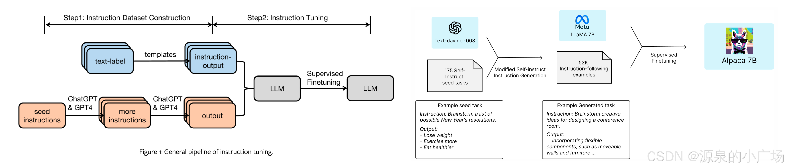
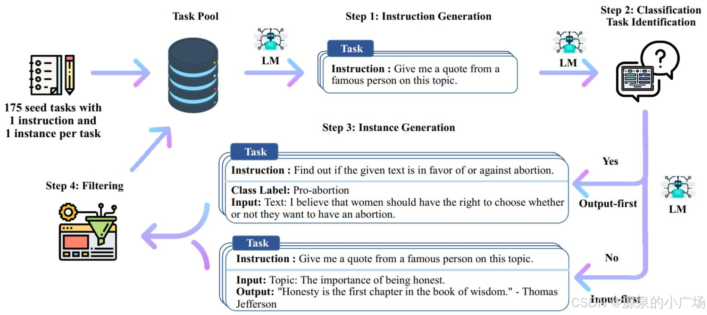

# Self-instruct / Alpaca





Self-Instruct 过程是一种迭代自举算法，它从一组手动编写的指令种子集开始，并用它们来提示语言模型生成新的指令以及相应的输入 - 输出实例。然后对这些生成结果进行过滤以去除低质量或相似的实例，所得数据被添加回任务池中。这个过程可以重复多次，从而产生大量的指令数据集合，可用于微调语言模型以更有效地遵循指令。

## 加载模型

```python
model_name_or_path = '../DataCollection/officials/Qwen2.5-1.5b-Instruct'

model = AutoModelForCausalLM.from_pretrained(
    model_name_or_path,
)

tokenizer = AutoTokenizer.from_pretrained(
    model_name_or_path,
    padding_side="right",
    use_fast=False,
)
```

注意需要检查tokenizer.pad_token_id，因为在padding时会用到，其他eos之类的不需要检查。

## 加载json数据

数据原始格式(假设只有两条微调数据)

```json
[
    {
        "instruction": "Give three tips for staying healthy.",
        "input": "",
        "output": "1.Eat a balanced diet and make sure to include plenty of fruits and vegetables. \n2. Exercise regularly to keep your body active and strong. \n3. Get enough sleep and maintain a consistent sleep schedule."
    },
    {
        "instruction": "What are the three primary colors?",
        "input": "",
        "output": "The three primary colors are red, blue, and yellow."
    },
]
```

每条都是三元组的形式， 数据字段如下：

- instruction（指令）：描述模型应执行的任务。52000 条指令中的每一条都是唯一的。

- input（输入）：任务的可选上下文或输入。大约 40% 的示例有输入。（可选的，因为可有可无，所以需要有两种拼接格式）
- output（输出）：由 text-davinci-003 生成的指令答案。

```python
def _make_r_io_base(f, mode: str):
    if not isinstance(f, io.IOBase):
        f = open(f, mode=mode)
    return f

def jload(f, mode="r"):
    """Load a .json file into a dictionary."""
    f = _make_r_io_base(f, mode)
    jdict = json.load(f)
    f.close()
    return jdict

# 加载指令微调数据，格式为list[dict]
data_path = './alpaca_data.json'
# data_path = './alpaca_data_100.json'
list_data_dict = jload(data_path)

print(len(list_data_dict))
pprint(list_data_dict[0])
```

输出

```
52002
{'input': '',
 'instruction': 'Give three tips for staying healthy.',
 'output': '1.Eat a balanced diet and make sure to include plenty of fruits '
           'and vegetables. \n'
           '2. Exercise regularly to keep your body active and strong. \n'
           '3. Get enough sleep and maintain a consistent sleep schedule.'}
```

## 拼接dict数据

```python
PROMPT_DICT = {
    "prompt_input": (
        "Below is an instruction that describes a task, paired with an input that provides further context. "
        "Write a response that appropriately completes the request.\n\n"
        "### Instruction:\n{instruction}\n\n### Input:\n{input}\n\n### Response:"
    ),
    "prompt_no_input": (
        "Below is an instruction that describes a task. "
        "Write a response that appropriately completes the request.\n\n"
        "### Instruction:\n{instruction}\n\n### Response:"
    ),
}
prompt_input, prompt_no_input = PROMPT_DICT["prompt_input"], PROMPT_DICT["prompt_no_input"]
sources = [
    prompt_input.format_map(example) if example.get("input", "") != "" else prompt_no_input.format_map(example)
    for example in list_data_dict
]
targets = [f"{example['output']}{tokenizer.eos_token}" for example in list_data_dict]
```

```
pprint(list_data_dict[0])
print(10*'-')
print(sources[0])
print(10*'-')
print(targets[0])
```

输出

```python
{'input': '',
 'instruction': 'Give three tips for staying healthy.',
 'output': '1.Eat a balanced diet and make sure to include plenty of fruits '
           'and vegetables. \n'
           '2. Exercise regularly to keep your body active and strong. \n'
           '3. Get enough sleep and maintain a consistent sleep schedule.'}
----------
Below is an instruction that describes a task. Write a response that appropriately completes the request.

### Instruction:
Give three tips for staying healthy.

### Response:
----------
1.Eat a balanced diet and make sure to include plenty of fruits and vegetables. 
2. Exercise regularly to keep your body active and strong. 
3. Get enough sleep and maintain a consistent sleep schedule.<|im_end|>
```

注意并不是直接拼接，而是**加入了类似system prompt的前置说明**，和**指令和生成内容的标识符**

## 预处理数据 tokenize

这一节将句子转换为input_ids和label。注意label只有output部分内容是有有效的，其他无效（包括prompt）。在指令微调（Instruction Tuning）中，通常我们仅设置输出部分的 label（即目标序列）是有效的，而忽略输入部分的 label，这是因为以下原因：

在指令微调（Instruction Tuning）中，通常我们仅设置输出部分的 label（即目标序列）是有效的，而忽略输入部分的 label，这是因为以下原因：

1.输入部分是提示（Prompt），无需计算损失

- 指令微调的核心目标是让模型学会在特定提示（Prompt）下生成符合预期的输出。
- 输入部分（指令和上下文）作为条件提供给模型，用于引导模型生成合适的输出。它本身并不需要预测，因此不应对输入部分计算损失或更新权重。
- 如果对输入部分计算损失，模型可能会尝试“记住”输入，而非专注于学习如何生成正确的输出。

2.语言模型的自回归性质

- Transformer 模型（如 GPT 或 LLaMA）的自回归训练目标是最大化下一个 token 的概率。
- 在微调时，**输入部分（Prompt）已经是已知的条件**，因此模型的主要任务是基于输入生成正确的输出（即目标文本）。对输入部分计算损失没有意义。

3.对齐训练目标

- 微调的训练目标是让模型在给定提示下生成期望的响应。这种训练目标的优化重点是输出部分的预测。
- 通过忽略输入部分的 label，只优化输出部分的生成，能够更准确地对齐训练目标与实际使用目标。

4.对生成任务的意义

- 指令微调模型通常应用于生成任务（如回答问题、对话、翻译等），**其重点是生成的内容，而非输入的内容**。
- 忽略输入部分的 label 有助于模型专注于如何生成符合上下文和指令的内容，而不是浪费资源在回归输入上。

5.实际效果

- 如果强行对输入部分计算损失，训练后的模型可能会出现以下问题：生成的输出可能更倾向于复制输入内容，而非理解指令后生成有意义的回答。对生成任务的泛化能力较弱，因为输入部分的损失干扰了输出部分的优化。

6.避免梯度干扰

- 如果对输入部分和输出部分同时计算损失，模型可能会受到梯度干扰：输入部分的 token 会被错误地视为目标，导致模型尝试“预测”已知的输入内容。
- 这会对生成任务的优化目标造成负面影响，降低模型在输出部分生成正确内容的能力。

总结：在指令微调时，只对输出部分计算 label 是为了：

- 专注于优化生成目标。
- 避免梯度干扰。
- 提高模型对指令生成任务的泛化能力。

```python
IGNORE_INDEX = -100

def _tokenize_fn(strings: Sequence[str], tokenizer: AutoTokenizer) -> Dict:
    """Tokenize a list of strings."""
    # 先将每个元素tokenize，按照最大长度padding，但实际每次只输入一个句子，根本不会padding
    tokenized_list = [
        tokenizer(
            text,
            return_tensors="pt",
            padding="longest",
            max_length=tokenizer.model_max_length,
            truncation=True,
        )
        for text in strings
    ]
    # 取出input_ids和labels为数组
    input_ids = labels = [tokenized.input_ids[0] for tokenized in tokenized_list]
    # 统计每个句子的非 padding token 的 token 数量
    input_ids_lens = labels_lens = [
        tokenized.input_ids.ne(tokenizer.pad_token_id).sum().item() for tokenized in tokenized_list
    ]
    return dict(
        input_ids=input_ids,
        labels=labels,
        input_ids_lens=input_ids_lens,
        labels_lens=labels_lens,
    )

def preprocess(
    sources: Sequence[str],
    targets: Sequence[str],
    tokenizer: AutoTokenizer,
) -> Dict:
    """Preprocess the data by tokenizing."""
    # 将prompt和预期输出组合
    examples = [s + t for s, t in zip(sources, targets)]
    # 分别对组合字符串和单独prompt进行tokenize
    examples_tokenized, sources_tokenized = [_tokenize_fn(strings, tokenizer) for strings in (examples, sources)]
    input_ids = examples_tokenized["input_ids"]
    labels = copy.deepcopy(input_ids)
    # 将 prompt 部分的 label 设置为 -100 (交叉熵的忽略 index)
    for label, source_len in zip(labels, sources_tokenized["input_ids_lens"]):
        label[:source_len] = IGNORE_INDEX
    return dict(input_ids=input_ids, labels=labels)

data_dict = preprocess(sources, targets, tokenizer)
```

```python
for k in data_dict.keys():
    print(len(data_dict[k]))
    print(data_dict[k][0])
```

```python
52002
tensor([ 38214,    374,    458,   7600,    429,  16555,    264,   3383,     13,
          9645,    264,   2033,    429,  34901,  44595,    279,   1681,    382,
         14374,  29051,    510,  35127,   2326,  10414,    369,  19429,   9314,
           382,  14374,   5949,     25,     16,   5142,    266,    264,  23831,
          9968,    323,   1281,   2704,    311,   2924,  11260,    315,  25322,
           323,  23880,     13,    715,     17,     13,  32818,  15502,    311,
          2506,    697,   2487,   4541,    323,   3746,     13,    715,     18,
            13,   2126,   3322,   6084,    323,  10306,    264,  12966,   6084,
          9700,     13, 151645])
52002
tensor([  -100,   -100,   -100,   -100,   -100,   -100,   -100,   -100,   -100,
          -100,   -100,   -100,   -100,   -100,   -100,   -100,   -100,   -100,
          -100,   -100,   -100,   -100,   -100,   -100,   -100,   -100,   -100,
          -100,   -100,   -100,   -100,     16,   5142,    266,    264,  23831,
          9968,    323,   1281,   2704,    311,   2924,  11260,    315,  25322,
           323,  23880,     13,    715,     17,     13,  32818,  15502,    311,
          2506,    697,   2487,   4541,    323,   3746,     13,    715,     18,
            13,   2126,   3322,   6084,    323,  10306,    264,  12966,   6084,
          9700,     13, 151645])
```

## 封装为dataset

```python
class SupervisedDataset(Dataset):

    def __init__(self, input_ids, labels):
        super(SupervisedDataset, self).__init__()
        self.input_ids = input_ids
        self.labels = labels

    def __len__(self):
        return len(self.input_ids)

    def __getitem__(self, i) -> Dict[str, torch.Tensor]:
        return dict(input_ids=self.input_ids[i], labels=self.labels[i])
    
ds = SupervisedDataset(**data_dict)
```

这时候每个句子还是单独的tensor，由于transformer中的已有DataCollator一般不会接受label（会报错，一般只接受input_ids和attention_mask），所以需要单独写一个DataCollator

## padding DataCollator

```python
@dataclass
class DataCollatorForSupervisedDataset(object):
    """Collate examples for supervised fine-tuning."""

    tokenizer: AutoTokenizer

    def __call__(self, instances: Sequence[Dict]) -> Dict[str, torch.Tensor]:
        input_ids, labels = tuple([instance[key] for instance in instances] for key in ("input_ids", "labels"))
        # input_ids 用 pad_token_id 补齐
        input_ids = torch.nn.utils.rnn.pad_sequence(
            input_ids, batch_first=True, padding_value=self.tokenizer.pad_token_id
        )
        # labels 用 IGNORE_INDEX 补齐
        labels = torch.nn.utils.rnn.pad_sequence(labels, batch_first=True, padding_value=IGNORE_INDEX)
        return dict(
            input_ids=input_ids,
            labels=labels,
            attention_mask=input_ids.ne(self.tokenizer.pad_token_id), # attention_mask 直接基于 input_ids
        )

dc = DataCollatorForSupervisedDataset(tokenizer)
# DataCollator的输入是list[dict[str, tensor]]
ret = [ds[index] for index in range(2,4)]
ret = dc(ret)
print([len(input_ids) for input_ids in ret['input_ids']])
```

注意DataCollator的输入是list[dict[str, tensor]]，不要直接把dataset的元素以dataset[a:b]的格式输入给DataCollator。

## train

```python
train_dataset = SupervisedDataset(**data_dict)
eval_dataset=None
data_collator = DataCollatorForSupervisedDataset(tokenizer)
```

```python
training_args = TrainingArguments(output_dir='./output',
                                  num_train_epochs=3,
                                  per_device_train_batch_size=8,
                                  per_device_eval_batch_size=8,
                                  gradient_accumulation_steps=8,
                                  evaluation_strategy='no',
                                  save_strategy='steps',
                                  save_steps=2000,
                                  save_total_limit=1,
                                  learning_rate=2e-5,
                                  weight_decay=0.,
                                  warmup_ratio=0.03,
                                  lr_scheduler_type='cosine',
                                  logging_steps=1,
                                  report_to=[]
                                  )
trainer = Trainer(model=model, 
                  tokenizer=tokenizer, 
                  args=training_args, 
                  train_dataset=train_dataset,
                  eval_dataset=eval_dataset,
                  data_collator=data_collator,
                  )
trainer.train()
```


# 改进Alpaca源码

## 改进文件读取和预处理

1.huggingface的dataset读取

```python
from datasets import load_dataset

dataset = load_dataset('json', 
                       data_dir='/data02/hyzhang10/pengxia2/tws/data', 
                       data_files={
                           'train': 'alpaca_data_100.json', 
                        #    'test': 'alpaca_data_100.json'
                           }
                       )
print(dataset)
```

输出

```
DatasetDict({
    train: Dataset({
        features: ['instruction', 'input', 'output'],
        num_rows: 100
    })
})
```

2.dataset的批量预处理

```python
IGNORE_INDEX = -100
PROMPT_DICT = {
    "prompt_input": (
        "Below is an instruction that describes a task, paired with an input that provides further context. "
        "Write a response that appropriately completes the request.\n\n"
        "### Instruction:\n{instruction}\n\n### Input:\n{input}\n\n### Response:"
    ),
    "prompt_no_input": (
        "Below is an instruction that describes a task. "
        "Write a response that appropriately completes the request.\n\n"
        "### Instruction:\n{instruction}\n\n### Response:"
    ),
}
prompt_input, prompt_no_input = PROMPT_DICT["prompt_input"], PROMPT_DICT["prompt_no_input"]

def preprocess_func(example):
    source = prompt_input.format_map(example) if example.get("input", "") != "" else prompt_no_input.format_map(example)
    target = f"{example['output']}{tokenizer.eos_token}"
    full_example = source + target
    full_example_tokenzied = tokenizer(full_example, return_tensors="pt",padding="longest", max_length=tokenizer.model_max_length, truncation=True)
    input_ids = full_example_tokenzied['input_ids'][0]
    labels = copy.deepcopy(input_ids)
    source_tokenzied = tokenizer(source, return_tensors="pt",padding="longest", max_length=tokenizer.model_max_length, truncation=True)
    labels[:len(source_tokenzied['input_ids'][0])] = IGNORE_INDEX
    return dict(
        input_ids=input_ids, 
        labels=labels
    )


# preprocess_func(dataset['train'][0])
train_ds = dataset['train'].map(preprocess_func, remove_columns=list(dataset['train'].features.keys()))
print(train_ds)
```

输出

```
Dataset({
    features: ['input_ids', 'labels'],
    num_rows: 100
})
```

## 半精度训练

原始Alpaca训练7B模型需要四张A100卡，不算数据单独模型训练也需要100GB以上的显存，这里我改为bf16训练，可用一张A800(80G)训练。更改的地方包括 

1.模型加载，加载时设置torch_dtype

```
model_name_or_path = '../DataCollection/officials/Llama-2-7b'
# model_name_or_path = '../DataCollection/officials/Qwen2.5-1.5b-Instruct'

model = AutoModelForCausalLM.from_pretrained(
    model_name_or_path,
    torch_dtype=torch.bfloat16
)

tokenizer = AutoTokenizer.from_pretrained(
    model_name_or_path,
    padding_side="right",
    use_fast=False,
)
```

必须要在加载前设置，不然训练时还会以默认的fp32加载入cuda，最终还会OOM


2.训练参数，增加bf16=True

```python
training_args = TrainingArguments(output_dir='./output',
                                  num_train_epochs=3,
                                  per_device_train_batch_size=2,
                                  per_device_eval_batch_size=8,
                                  gradient_accumulation_steps=8,
                                  evaluation_strategy='no',
                                  save_strategy='steps',
                                  save_steps=2000,
                                  save_total_limit=1,
                                  learning_rate=2e-5,
                                  weight_decay=0.,
                                  warmup_ratio=0.03,
                                  lr_scheduler_type='cosine',
                                  logging_steps=1,
                                  report_to=[],
                                  bf16=True
                                  )
trainer = Trainer(model=model, 
                  tokenizer=tokenizer, 
                  args=training_args, 
                  train_dataset=train_dataset,
                  eval_dataset=eval_dataset,
                  data_collator=data_collator,
                  )
train_output = trainer.train()
```

