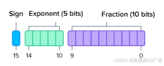

# 显存占用估计

## 影响大模型显存占用的关键项

显存对于大模型很重要，在训练和推理过程中涉及大量计算。特别是使用 Transformer 架构的大模型（如 [GPT 系列](https://blog.csdn.net/weixin_65514978/article/details/141018827)、[Llama 系列](https://blog.csdn.net/weixin_65514978/article/details/141356008)等），高度依赖并行计算。模型由多层组成，每层包含的参数（权重）需要加载到显存中，以支持快速高效地访问。Transformer 中的注意力机制涉及词元之间的上下文和关系，需要大量的显存。

大模型利用显存高效处理推理过程中的大量数据和计算，相应的使用方式主要包含如下：

1. **模型参数**：常见的大模型目前涉及数十亿甚至含数万亿的参数，在推理过程中这些参数存储在显存中。这是当前大模型显存使用的主要部分。
2. **激活值**：大模型的每一层计算，都可能会生成大量的激活数据，这些中间结果数据会暂时存储在显存中，以便后续计算。
3. **批处理大小**：大模型通过批量处理输入来提高效率。较大的批处理 size 需要更多显存来同时容纳多个输入。
4. **精度**：大模型使用的数值精度会明显影响显存使用。精度指的是用于推理的不同类型的浮点数。较低的精度（如 FP16）能够减少显存需求，使得在同样的显存大小内可以容纳更大的模型或批处理，且对准确性的影响较小。

## **精度**

这里我们对精度展开讲一下，在大模型的量化或者优化层面，经常会看到对精度的选择。模型训练和推理的速度随着大模型的推广使用变得越来越重要，减小计算过程中数据的长度从而降低存储和带宽，该方案能够快速提升大模型的计算效率。

浮点精度是一种通过二进制表示数字的方式。最常见的浮点精度格式有半精度（FP16）、单精度（FP32）和双精度（FP64），每种格式在特定应用中都有各自的优点、缺点和适用性。浮点精度的结构设计可以定义广泛的数值范围。第一个二进制位表示数的正负号；接下来的二进制位表示以 2 为底的指数，用于表示整数部分；最后一组二进制位表示有效位（也称为尾数），用于表示小数点后的数值。

### FP32

FP32 或单精度 32 位浮点精度使用 32 位二进制来表示数值。这种格式是使用最广泛的浮点精度格式，它在一定程度上牺牲了部分精度，以较少的数字表示更轻量的数值。较少的数字占用更少的内存，从而提高计算速度。

>          FP32 单精度使用：
>
>         *   1 位表示正负号；
>         *   8 位表示以 2 为底的指数；
>         *   23 位表示小数部分（也称为有效位或尾数）。        


### FP64

FP64 或双精度 64 位浮点精度使用 64 位二进制来表示系统计算中的数值。该格式在主流选项中提供最高的精度，非常适合对精度和准确性有严格要求的应用。

>         FP64 双精度使用：
>
>         *   1 位表示正负号；
>         *   11 位表示以 2 为底的指数；
>         *   52 位表示小数部分（也称为有效位或尾数）。


进一步，对 FP16、BF16、T32 做介绍：

### FP16 

FP16 或半精度 16 位浮点精度仅使用 16 位二进制。**这种格式在深度学习工作负载中正呈上升趋势，逐渐取代传统的 FP32。由于神经网络中的较低精度权重似乎并不会对模型的性能产生重大影响，FP32 的额外精度可以被用来换取更高的计算速度。** FP16 主要用于深度学习模型的训练和推理，以实现快速计算，在单位时间内执行更多的计算。

>  FP16 半精度使用：
>
>  *   1 位表示正负号；
>  *   5 位表示以 2 为底的指数；
>  *   10 位表示小数部分（也称为有效位或尾数）。



### BF16

BF16 或 BFloat16 是由谷歌开发的一种格式，称为 “Brain Floating Point Format”（大脑浮点格式）。谷歌发现 **FP16 并未考虑深度学习的应用，因为其范围过于有限。虽然仍然使用 16 位二进制，他们重新分配了位数，使其范围更接近 FP32**。由于 BF16 和 FP32 使用相同数量的位表示指数，将 FP32 转换为 BF16 更加快速且简单，只需忽略部分小数位。 BF16 正在成为运行和训练原本使用 FP32 的深度神经网络时替代 FP16 的标准。BF16 也是在 FP32 和 BF16 之间进行混合精度计算的理想选择。由于 BF16 在指数方面与 FP32 相似，它可以作为一种直接替代，提供较少小数位的精度，同时使用的位数减半。存储 BF16 所需的内存较低，加上转换的简便性，在原生 FP32 计算的工作负载中使用 BF16 可以显著提高速度。

**和FP32同样用了8位代表以 2 为底的指数，相比下小数位少了**

>                 BF16 使用：
>
>         *   1 位表示正负号；
>         *   8 位表示以 2 为底的指数；
>         *   7 位表示小数部分（即有效位或尾数）。


### TF32

TF32 或 Tensor-Float32 是由 NVIDIA 制作的一种数学模式，将 FP32 的 32 位表示值压缩为 19 位。类似于 BF16 的功能，TF32 使用相同的 8 位来定义指数，以保持与 FP32 相同的范围和易于转换的特性，同时使用来自 FP16 的 10 位尾数 / 小数部分。由于使用了与 FP32 相同的 8 位指数，TF32 是 NVIDIA GPU 执行 FP32 计算的一种方式，它将 FP32 的 23 位尾数缩短并舍入为 TF32 的 10 位。**TF32 与 FP32 浮点数的比较： 从技术上讲，TF32 是一种 19 位二进制格式，是在表示值的小数部分上精度较低的 FP32**。NVIDIA Ampere 及以后的 Tensor Cores 在进行矩阵乘法时，使用将 FP32 输入转换为 TF32 的方式来进行操作，并将矩阵乘积的结果输出为 FP32 以便进一步计算。其工作过程如下：在进行矩阵运算时，FP32 首先通过将 23 位尾数 / 小数部分四舍五入为 10 位或第 10 位小数，转换为 TF32。接下来执行 FP32 矩阵计算，然后将输出的 TF32 值重新定义为 FP32 值。后续的非矩阵乘法操作将使用 FP32。


>         TF32 或 Tensor-Float32 使用：
>
>         *   1 位表示正负号；
>         *   8 位表示以 2 为底的指数；
>         *   10 位表示小数部分（即有效位或尾数）。


至于整型数的表示，则更加简单，只需要去除尾数部分即可。以表格形式展示以上的数据类型精度，可以更好地帮助理解，可以参考下。这里注意一下，这里面的数值精度列是指保留的十进制小数部分的位数。


---

附上浮点数的最大数值计算方式

FP32（单精度浮点数）的最大值由 IEEE 754 标准定义，可以通过其结构计算。FP32 的格式如下：

- **1 位符号位（S）**：0 表示正数，1 表示负数。
- **8 位指数位（E）**：以偏置（bias）表示，偏置值为 127。
- **23 位尾数位（M）**：隐含一个最高有效位 1，即 $1.M$。

### 最大值的计算步骤

1. **符号位**：

   - 正数最大值的符号位为 00。

2. **指数位**：

   - 指数取最大值 254254 (255255 表示特殊值，如无穷大或 NaN)，真实指数为 $254−127=127254 - 127 = 127$。

3. **尾数位**：

   - 尾数的 23 位全为 11，对应 $M=1.111...111=2−2−23M = 1.111...111 = 2 - 2^{-23}$。

4. **公式**： 浮点数的值为：

   $(-1)^S \times 2^{E-127} \times (1 + M)$

   最大值时：

   $2^{127} \times (2 - 2^{-23})$

### 具体计算

- $2^{127}$: 一个非常大的数字。
- $2 - 2^{-23}$: 接近于 2，为 1.999999880790710449218751.99999988079071044921875。

两者相乘得到最大值。  

这个网站可以可视化如何计算。
https://evanw.github.io/float-toy/

### Python 计算

以下是用 Python 验证 FP32 的最大值：

```python
# FP32 最大值计算
max_fp32 = (2 ** 127) * (2 - 2 ** -23)
print(max_fp32)
```


## GPU 内存占用估算公式

### 推理

我们刚讨论了影响大模型显存占用大小的影响因素以及给出了一个具体的案例讲解。这里再介绍一下看到的内存占用估算方法, 仅供参考。【1】给出了如下计算公式，也就是在参数量乘对应精度 byte 的基础上，再乘 1.2 的系数。


如果只是进行推理的话，还是比较容易计算的。目前模型的参数绝大多数都是`float32`类型, 占用4个字节。所以一个粗略的计算方法就是，**每10亿个参数，占用4G显存** (实际应该是 $10^9*4/1024/1024/1024=3.725G$，为了方便可以记为4G)。

比如LLaMA的参数量为7000559616，那么全精度加载这个模型参数需要的显存为：

```python
7000559616 * 4 / 1024 ** 3 = 26.08G
```

用半精度的`FP16/BF16`来加载，这样每个参数只占2个字节，所需显存就降为一半，只需要13.04G。

注意上面只是加载模型到显存，模型运算时的一些临时变量也需要申请空间，比如你beam search的时候。所以真正做推理的时候记得留一些Buffer，不然就容易OOM。

### 训练

在使用 Adam 优化器训练模型时，计算模型的 **总大小** 和 **训练时的内存使用量** 需要考虑以下几个因素，包括模型参数、优化器状态、以及训练过程中的中间激活值。以下是具体计算步骤：

------

#### **1. 模型的总大小**

模型的总大小主要由以下因素决定：

- **参数数量 N**：模型中权重参数的总数。
- **数据类型 D**：参数存储所需的每个参数的字节数，例如 `float32` 占用 4 字节，`float16` 占用 2 字节。

**模型大小公式**：

$$模型大小=N×D\text{模型大小} = N \times D$$

**示例**： 如果模型有 $N = 10^9$ 个参数（10 亿），存储为 `float32`（4 字节），则模型总大小为：

$模型大小=10^9×4=4 GB\text{模型大小} = 10^9 \times 4 = 4 \, \text{GB}$

------

#### **2. 训练时的内存使用**

使用 Adam 优化器时，训练的内存使用主要包括以下部分：

1. **模型参数（Weights）**：模型的参数需要存储在 GPU 中进行前向和反向传播。占用内存大小为 $N \times D $。
2. **梯度（Gradients）**：反向传播时，每个参数都会计算对应的梯度，同样占用 $N \times D$。
3. **优化器状态（Adam 的一阶和二阶动量）**：
   - Adam 需要为每个参数维护两个状态变量：一阶动量 $m_t$ 和二阶动量 $v_t$，每个状态的大小也是 $N \times D$。
   - 总的优化器状态占用内存为 $2 \times N \times D$。
4. **激活值（Activations）**：
   - 在前向传播中，每一层的中间激活值需要存储，以便在反向传播时使用。
   - 激活值的内存需求与批量大小（Batch Size）、输入大小、模型结构等有关，记为 $A$。
5. **临时缓冲区（Buffers）**：
   - 在训练中，矩阵计算和数据拷贝等操作需要临时内存，记为 $B$，这通常取决于具体的硬件和框架实现。

#### **总内存使用公式**：

$$
总内存=参数+梯度+优化器状态+激活值+缓冲区\text{总内存} = \text{参数} + \text{梯度} + \text{优化器状态} + \text{激活值} + \text{缓冲区} \\
总内存=4×N×D+A+B\text{总内存} = 4 \times N \times D + A + B
$$

------

#### **3. 示例计算**

假设：

- 参数数量：$N = 10^9$（10 亿参数）。
- 数据类型：`float32`（4 字节）。
- 激活值内存：$A = 4 \, \text{GB}$。
- 临时缓冲区：$B = 2 \, \text{GB}$。

计算：

1. **模型参数内存**：$N \times D = 10^9$。
2. **梯度内存**：$N \times D = 4 \, \text{GB}$。
3. **优化器状态内存**：$N \times D = 2 \times 4 = 8 \, \text{GB}$。
4. **激活值内存**：$A = 4 \, \text{GB}$。
5. **缓冲区内存**：$B = 2 \, \text{GB}$。

**总内存**：

$\text{总内存} = 4 + 4 + 8 + 4 + 2 = 22 \, \text{GB}$

------

#### **4. 影响内存使用的优化方法**

1. **混合精度训练（Mixed Precision Training）**：
   - 使用 `float16` 存储参数、梯度和优化器状态，内存占用减半（每个参数 2 字节）。
   - 激活值有时仍需使用 `float32` 存储。
2. **梯度检查点（Gradient Checkpointing）**：
   - 减少激活值内存 AA 的需求，通过在反向传播中重新计算部分激活值来节省内存，但增加了计算时间。
3. **分布式训练（Distributed Training）**：
   - 在多个 GPU 或节点之间划分模型参数和激活值，降低单个设备的内存需求。
4. **稀疏优化器**：
   - 对于大规模稀疏模型，可以使用稀疏优化器减少优化器状态的内存需求。

------

### **总结**

训练时的内存使用可以通过以下公式估算：

总内存=4×N×D+A+B\text{总内存} = $4 \times N \times D + A + B$

其中：

- $4 \times N \times D$：模型参数、梯度和优化器状态。
- $A$：激活值内存，与批量大小和模型结构有关。
- $B$：临时缓冲区内存，与硬件和框架实现有关。

通过调整数据类型（`float16`）、批量大小、梯度检查点等，可以显著减少内存需求。


## 显存需求计算在线工具

https://huggingface.co/spaces/hf-accelerate/model-memory-usage

https://rahulschand.github.io/gpu_poor/