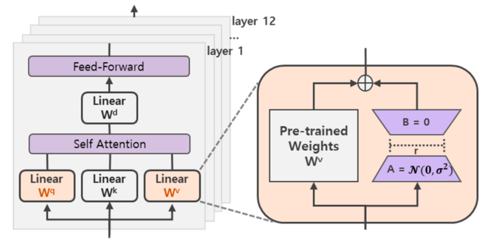
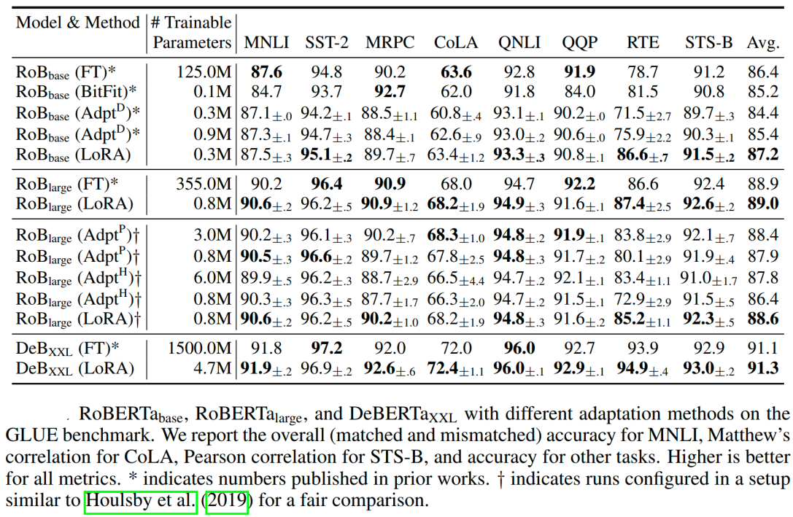

# LoRA微调

神经网络包含很多全连接层，其借助于矩阵乘法得以实现，然而，很多全连接层的权重矩阵都是满秩的。当针对特定任务进行微调后，**模型中权重矩阵其实具有很低的本征秩**（intrinsic rank），因此，论文的作者认为**权重更新的那部分参数矩阵尽管随机投影到较小的子空间，仍然可以有效的学习，可以理解为针对特定的下游任务这些权重矩阵就不要求满秩**。

## 基础知识
**矩阵的秩**：秩的定义是矩阵中的线性无关行或列的最大数量。  

矩阵的秩的度量其实就是**矩阵的行列之间的相关性**。如果矩阵的各行或列是**线性无关**的，矩阵就是**满秩**的。  

**低秩矩阵** 指矩阵的秩相对矩阵的行数或列数而言很小。  

**低秩（Low-rank）的意义** 低秩矩阵的每行或者每列都可以用其他的行或者列线性表示，这说明这个矩阵包含了大量的冗余信息。

## 技术原理
LoRA（论文：**LoRA: LOW-RANK ADAPTATION OF LARGE LANGUAGE MODELS**），该方法的核心思想就是**通过低秩分解来模拟参数的改变量，从而以极小的参数量来实现大模型的间接训练。**
在涉及到矩阵相乘的模块，在原始的PLM旁边增加一个新的通路，通过前后两个矩阵`A`,`B`相乘，第一个矩阵`A`负责降维，第二个矩阵`B`负责升维，中间层维度为`r`，从而来模拟所谓的本征秩（intrinsic rank）。


可训练层维度和预训练模型层维度一致为`d`，先将维度`d`通过全连接层降维至r，再从`r`通过全连接层映射回`d`维度，其中，`r<<d`，`r`是矩阵的秩，这样矩阵计算就从`d x d`变为`d x r + r x d`，参数量减少很多。

若原本全连接层为`768×768`。我们通过`A`,`B`替代，可以变成`768×8 `、`8×768`。
参数量从`768×768`变成了`768×8 + 8×768`


微调时，**固定模型的其他参数，只优化新增的两个矩阵**`A`**,**`B`**的权重参数**，将PLM（Pre-trained Language Model）跟新增的通路两部分的结果加起来作为最终的结果（两边通路的输入跟输出维度是一致的），即`h=Wx+BAx`。**第一个矩阵的A的权重参数会通过高斯函数初始化**，而**第二个矩阵的B的权重参数则会初始化为零矩阵**，这样能保证训练开始时新增的通路BA=0从而对模型结果没有影响。
$$
h=W_{0} x+\Delta W x=W_{0} x+B A x
$$

在推理时，将左右两部分的结果加到一起即可，`h=Wx+BAx=(W+BA)x`，所以只要将训练完成的矩阵乘积`BA`跟原本的权重矩阵`W`加到一起作为新权重参数替换原本PLM的W即可，对于推理来说，不会增加额外的计算资源。

此外，Transformer的权重矩阵包括Attention模块里用于计算`query`, `key`, `value`的`Wq`，`Wk`，`Wv`以及多头attention的`Wo`,以及MLP层的权重矩阵，LoRA只应用于Attention模块中的4种权重矩阵，而且**通过消融实验发现同时调整 Wq 和 Wv 会产生最佳结果**。

实验还发现，保证权重矩阵的种类的数量比起增加隐藏层维度r更为重要，增加r并不一定能覆盖更加有意义的子空间。


那么关于秩的选择，通常情况下，rank为4，8，16即可。

通过实验也发现，在众多数据集上LoRA在只训练极少量参数的前提下，最终在性能上能和全量微调匹配，甚至在某些任务上优于全量微调。


## 代码示例

使用Qwen2.5-1.5B进行代码演示

```Python
from transformers import AutoModelForCausalLM, AutoTokenizer
model_path = '/Qwen/Qwen2___5-1___5B-Instruct'
model = AutoModelForCausalLM.from_pretrained(
    model_path,
    torch_dtype="auto",
    device_map="auto"
)
tokenizer = AutoTokenizer.from_pretrained(model_path)
print(model)
```

加载一个原始的Qwen model

```Python
Qwen2ForCausalLM(
  (model): Qwen2Model(
    (embed_tokens): Embedding(151936, 1536)
    (layers): ModuleList(
      (0-27): 28 x Qwen2DecoderLayer(
        (self_attn): Qwen2SdpaAttention(
          (q_proj): Linear(in_features=1536, out_features=1536, bias=True)
          (k_proj): Linear(in_features=1536, out_features=256, bias=True)
          (v_proj): Linear(in_features=1536, out_features=256, bias=True)
          (o_proj): Linear(in_features=1536, out_features=1536, bias=False)
          (rotary_emb): Qwen2RotaryEmbedding()
        )
        (mlp): Qwen2MLP(
          (gate_proj): Linear(in_features=1536, out_features=8960, bias=False)
          (up_proj): Linear(in_features=1536, out_features=8960, bias=False)
          (down_proj): Linear(in_features=8960, out_features=1536, bias=False)
          (act_fn): SiLU()
        )
        (input_layernorm): Qwen2RMSNorm((1536,), eps=1e-06)
        (post_attention_layernorm): Qwen2RMSNorm((1536,), eps=1e-06)
      )
    )
    (norm): Qwen2RMSNorm((1536,), eps=1e-06)
  )
  (lm_head): Linear(in_features=1536, out_features=151936, bias=False)
)
```

导入LoRA的配置

```Python
from peft import LoraConfig, TaskType, get_peft_model
config = LoraConfig(task_type=TaskType.CAUSAL_LM, target_modules=['q_proj', 'v_proj'], modules_to_save=['lm_head'], r=16, lora_alpha=16)
config
```

这里的`task_type`为任务类型，因为Qwen属于因果模型，因此这里选择`CAUSAL_LM`，

其他选择如下(源码目录为：**/peft/utils/peft_types.py**)：

```Python
class TaskType(str, enum.Enum):
    """
    Enum class for the different types of tasks supported by PEFT.

    Overview of the supported task types:
    - SEQ_CLS: Text classification.
    - SEQ_2_SEQ_LM: Sequence-to-sequence language modeling.
    - CAUSAL_LM: Causal language modeling.
    - TOKEN_CLS: Token classification.
    - QUESTION_ANS: Question answering.
    - FEATURE_EXTRACTION: Feature extraction. Provides the hidden states which can be used as embeddings or features
      for downstream tasks.
    """

    SEQ_CLS = "SEQ_CLS"
    SEQ_2_SEQ_LM = "SEQ_2_SEQ_LM"
    CAUSAL_LM = "CAUSAL_LM"
    TOKEN_CLS = "TOKEN_CLS"
    QUESTION_ANS = "QUESTION_ANS"
    FEATURE_EXTRACTION = "FEATURE_EXTRACTION"
```

其他比较重要的参数如下：

1. `r` :LoRA模型的注意力维度（也叫秩）。表示低秩适应矩阵的维度。
2. `target_modules`:要应用LoRA的模块名称。如果是字符串，会执行正则匹配；如果是列表，会精确匹配或检查模块名是否以指定的字符串结尾。
3. `lora_dropout`:LoRA层的dropout概率，防止过拟合。
4. `modules_to_save`:除了LoRA适配器层之外，还要保存并训练的模块。用于某些模型，如分类任务中的输出层。
5. `lora_alpha：`**缩放因子**,起到的是调节作用。

    在 LoRA 中，`lora_alpha` 是一个缩放因子，用来控制微调部分 ( $A \cdot B$) 对原始权重矩阵 $W_0 $的影响。其目的是为了更好地调节微调的幅度，从而避免对原始模型造成过大的扰动。

    具体来说，调整后的模型权重可以表示为：

$$
W_{\text {new }}=W_{0}+\frac{\alpha}{r}(A \cdot B)
$$

   - $W_0$是原始模型的权重矩阵。

   - $ A \cdot B $是通过低秩矩阵计算出来的增量。

   - $\alpha$是 `lora_alpha`，用于缩放 ( $ A \cdot B $ ) 的值。

   - $r$ 是低秩矩阵的秩$rank$，用于标准化。

`target_modules`参数如果不指定的话，会根据微调的模型选择默认的modules。

源码目录为：**/peft/utils/**[**constants.py**](http://constants.py)

```Python
TRANSFORMERS_MODELS_TO_LORA_TARGET_MODULES_MAPPING = {
    "t5": ["q", "v"],
    "mt5": ["q", "v"],
    "bart": ["q_proj", "v_proj"],
    "gpt2": ["c_attn"],
    "bloom": ["query_key_value"],
    "blip-2": ["q", "v", "q_proj", "v_proj"],
    "opt": ["q_proj", "v_proj"],
    "gptj": ["q_proj", "v_proj"],
    "gpt_neox": ["query_key_value"],
    "gpt_neo": ["q_proj", "v_proj"],
    "bert": ["query", "value"],
    "roberta": ["query", "value"],
    "xlm-roberta": ["query", "value"],
    "electra": ["query", "value"],
    "deberta-v2": ["query_proj", "value_proj"],
    "deberta": ["in_proj"],
    "layoutlm": ["query", "value"],
    "llama": ["q_proj", "v_proj"],
    "chatglm": ["query_key_value"],
    "gpt_bigcode": ["c_attn"],
    "mpt": ["Wqkv"],
    "RefinedWebModel": ["query_key_value"],
    "RefinedWeb": ["query_key_value"],
    "falcon": ["query_key_value"],
    "btlm": ["c_proj", "c_attn"],
    "codegen": ["qkv_proj"],
    "mistral": ["q_proj", "v_proj"],
    "mixtral": ["q_proj", "v_proj"],
    "stablelm": ["q_proj", "v_proj"],
    "phi": ["q_proj", "v_proj", "fc1", "fc2"],
    "gemma": ["q_proj", "v_proj"],
}
```

因为Qwen2并没有默认值，因此需要我们指定微调的modules，我们指定微调模型的`q_proj` 和`v_proj`两个投影层。

然后我们通过`get_peft_model`函数得到需要微调的模型。

```Python
lora_model = get_peft_model(model, config)  
print(lora_model)
```

lora_model的结构如下：

```Python
PeftModelForCausalLM(
  (base_model): LoraModel(
    (model): Qwen2ForCausalLM(
      (model): Qwen2Model(
        (embed_tokens): Embedding(151936, 1536)
        (layers): ModuleList(
          (0-27): 28 x Qwen2DecoderLayer(
            (self_attn): Qwen2SdpaAttention(
              (q_proj): lora.Linear(
                (base_layer): Linear(in_features=1536, out_features=1536, bias=True)
                (lora_dropout): ModuleDict(
                  (default): Identity()
                )
                (lora_A): ModuleDict(
                  (default): Linear(in_features=1536, out_features=16, bias=False)
                )
                (lora_B): ModuleDict(
                  (default): Linear(in_features=16, out_features=1536, bias=False)
                )
                (lora_embedding_A): ParameterDict()
                (lora_embedding_B): ParameterDict()
              )
              (k_proj): Linear(in_features=1536, out_features=256, bias=True)
              (v_proj): lora.Linear(
                (base_layer): Linear(in_features=1536, out_features=256, bias=True)
                (lora_dropout): ModuleDict(
                  (default): Identity()
                )
                (lora_A): ModuleDict(
                  (default): Linear(in_features=1536, out_features=16, bias=False)
                )
                (lora_B): ModuleDict(
                  (default): Linear(in_features=16, out_features=256, bias=False)
                )
                (lora_embedding_A): ParameterDict()
                (lora_embedding_B): ParameterDict()
              )
              (o_proj): Linear(in_features=1536, out_features=1536, bias=False)
              (rotary_emb): Qwen2RotaryEmbedding()
            )
            (mlp): Qwen2MLP(
              (gate_proj): Linear(in_features=1536, out_features=8960, bias=False)
              (up_proj): Linear(in_features=1536, out_features=8960, bias=False)
              (down_proj): Linear(in_features=8960, out_features=1536, bias=False)
              (act_fn): SiLU()
            )
            (input_layernorm): Qwen2RMSNorm((1536,), eps=1e-06)
            (post_attention_layernorm): Qwen2RMSNorm((1536,), eps=1e-06)
          )
        )
        (norm): Qwen2RMSNorm((1536,), eps=1e-06)
      )
      (lm_head): ModulesToSaveWrapper(
        (original_module): Linear(in_features=1536, out_features=151936, bias=False)
        (modules_to_save): ModuleDict(
          (default): Linear(in_features=1536, out_features=151936, bias=False)
        )
      )
    )
  )
)
```

可以看到需要我们微调的`q_proj` 和`v_proj`投影层多了`lora_A`和`lora_B`两个分路。

打印下可学习的参数

```Python
lora_model.print_trainable_parameters()  
# trainable params: 235,552,768 || all params: 1,779,267,072 || trainable%: 13.2388

```

可以看到训练的参数仅仅是是全部参数的 13.23%。

lora模型定义好后，就可以训练了

```Python
from transformers import DataCollatorForSeq2Seq, TrainingArguments, Trainer
args = TrainingArguments(
    output_dir="./output_model/",  
    per_device_train_batch_size=16,  
    gradient_accumulation_steps=8,  
    logging_steps=50,  
    num_train_epochs=3 
    
)
trainer = Trainer(
    model=lora_model,
    args=args,
    tokenizer=tokenizer,
    train_dataset=tokenized_ds,
    data_collator=DataCollatorForSeq2Seq(tokenizer=tokenizer, padding=True),
)  
trainer.train()  

```

接着我们看下具体执行代码的时候lora是如何执行的

源码目录：**/peft/tuners/lora/layer.py** 

为了方便我们只看 **Linear**类。

```Python
    def forward(self, x: torch.Tensor, *args: Any, **kwargs: Any) -> torch.Tensor:
        self._check_forward_args(x, *args, **kwargs)
        adapter_names = kwargs.pop("adapter_names", None)

        if self.disable_adapters:
            if self.merged:
                self.unmerge()
            result = self.base_layer(x, *args, **kwargs)
        elif adapter_names is not None:
            result = self._mixed_batch_forward(x, *args, adapter_names=adapter_names, **kwargs)
        elif self.merged:
            result = self.base_layer(x, *args, **kwargs)
        else:
            result = self.base_layer(x, *args, **kwargs)
            torch_result_dtype = result.dtype
            for active_adapter in self.active_adapters:
                if active_adapter not in self.lora_A.keys():
                    continue
                lora_A = self.lora_A[active_adapter]
                lora_B = self.lora_B[active_adapter]
                dropout = self.lora_dropout[active_adapter]
                scaling = self.scaling[active_adapter]
                x = x.to(lora_A.weight.dtype)

                if not self.use_dora[active_adapter]:
                    result = result + lora_B(lora_A(dropout(x))) * scaling
                else:
                    x = dropout(x)
                    result = result + self._apply_dora(x, lora_A, lora_B, scaling, active_adapter)

            result = result.to(torch_result_dtype)

        return result
```

可以看到数据`x`有两条分路：1. 原始的PLM。2. **`lora_B(lora_A(dropout(x))) * scaling`**其中**`scaling`**可以参考我上文提到的**`lora_alpha`** 参数。
两条分路的相加为最后的结果。
  
训练完成后，需要合并lora模型 

```Python
from peft import PeftModel
lora_train_model = PeftModel.from_pretrained(model, model_id="./output_model/checkpoint")

merge_model = lora_train_model.merge_and_unload()
merge_model.save_pretrained("./output_model/merge_model")

```

完整代码请参考lora.ipynb，本文对过程只做简单的讲解。


## 参考
【通俗易懂理解全量微调和LoRA微调】 [https://www.bilibili.com/video/BV1tthPeFEWb/?share_source=copy_web&vd_source=5b4170cace78b47030b76c83c2d0dace](https://www.bilibili.com/video/BV1tthPeFEWb/?share_source=copy_web&vd_source=5b4170cace78b47030b76c83c2d0dace)

【【手把手带你实战HuggingFace Transformers-高效微调篇】LoRA 原理与实战】 [https://www.bilibili.com/video/BV13w411y7fq/?share_source=copy_web&vd_source=5b4170cace78b47030b76c83c2d0dace](https://www.bilibili.com/video/BV13w411y7fq/?share_source=copy_web&vd_source=5b4170cace78b47030b76c83c2d0dace)

[通过代码，一步步解析ChatGLM的Lora微调实现细节_chatglm lora-CSDN博客](https://blog.csdn.net/weixin_41712499/article/details/136666112)