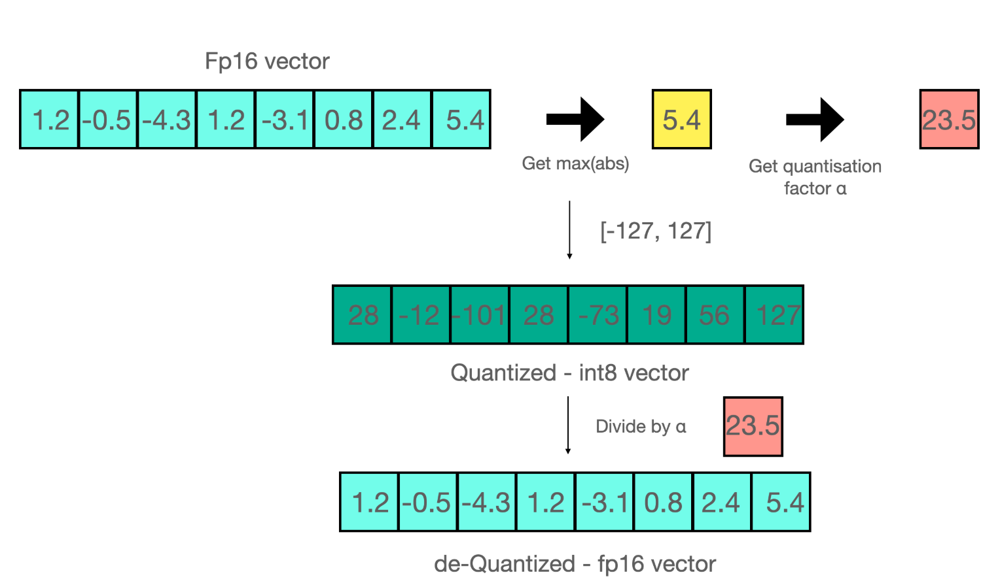
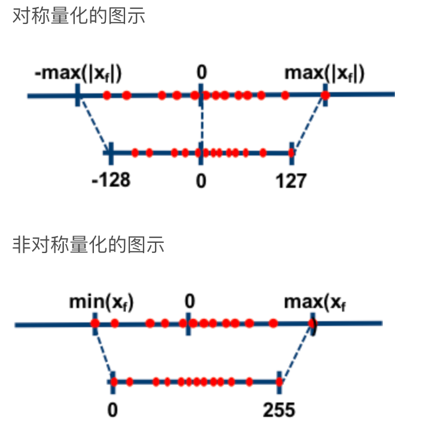
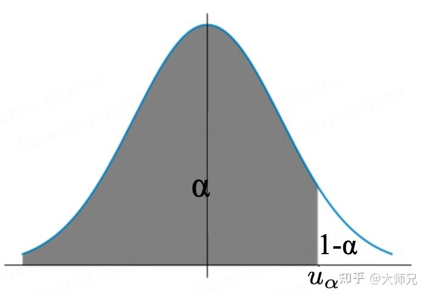
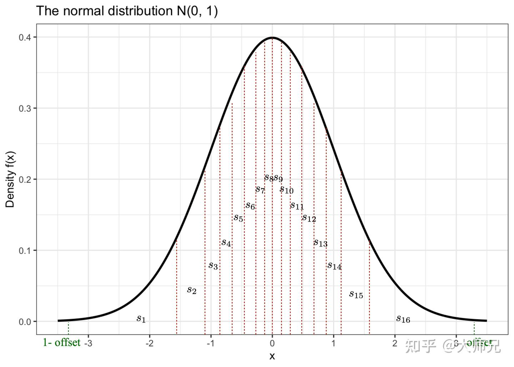
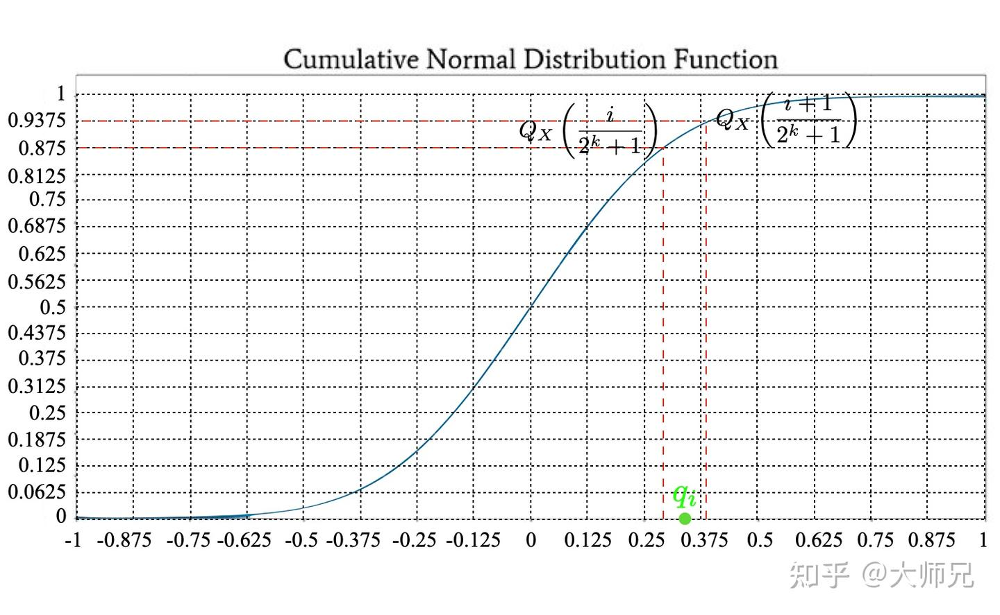
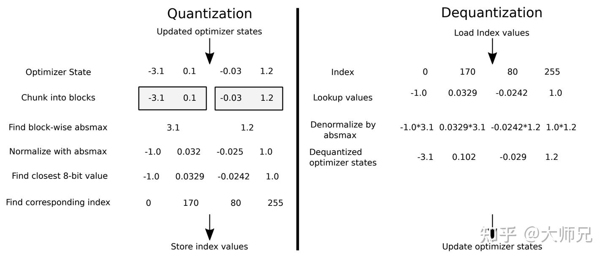
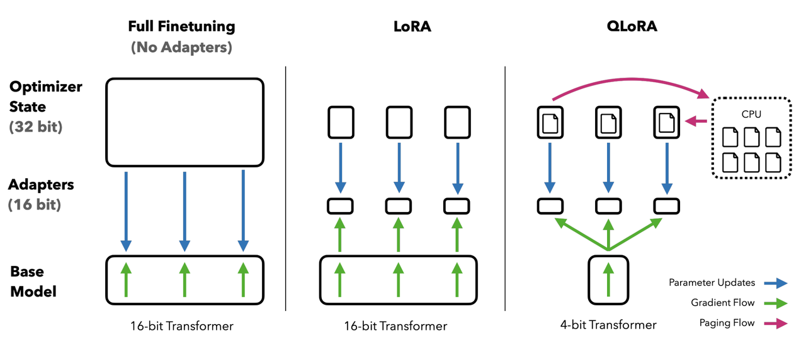
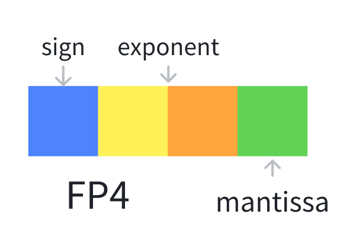
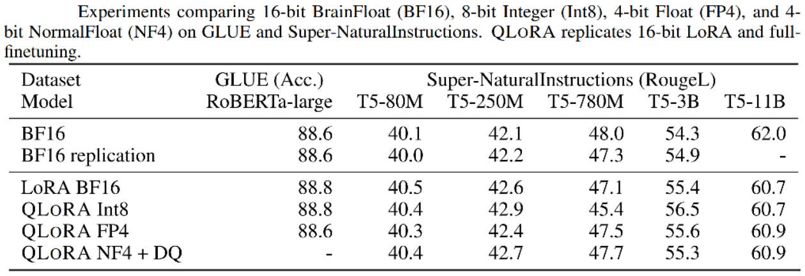
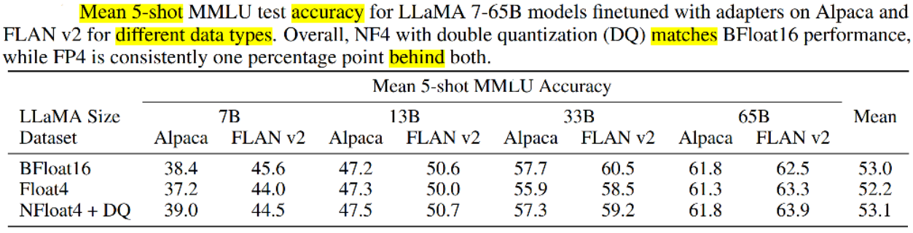

## QLoRA微调

## 模型量化

**模型量化（quantization）**也被叫做模型的低精度表示，指的是在不大幅降低模型效果的前提下使用更低的精度来表示模型中的参数，从而缩减模型的体积和训练模型时占用的显存。量化的本质是函数映射，根据量化过程是否线性我们可以把量化分为**线性量化**和**非线性量化**。量化过程是从一种数据类型“舍入”到另一种数据类型。举个例子，如果一种数据类型的范围为 `0..9`，而另一种数据类型的范围为 `0..4`，则第一种数据类型中的值 `4` 将舍入为第二种数据类型中的 `2` 。但是，如果在第一种数据类型中有值 `3`，它介于第二种数据类型的 `1` 和 `2` 之间，那么我们通常会四舍五入为 `2`。也就是说，第一种数据类型的值 `4` 和 `3` 在第二种数据类型中具有相同的值 `2`。这充分表明量化是一个有噪过程，会导致信息丢失，是一种有损压缩。最常见的**量化技术**是**最大绝对值 (absolute maximum quantization，absmax) 量化**，如式(1)。

$$
\mathbf{X}^{\mathrm{Int} 8}=\operatorname{round}\left(\frac{127}{\operatorname{absmax}\left(\mathbf{X}^{\mathrm{FP} 32}\right)} \mathbf{X}^{\mathrm{FP} 32}\right)=\operatorname{round}\left(c^{\mathrm{FP} 32} \cdot \mathbf{X}^{\mathrm{FP} 32}\right)  \tag1
$$

- $\mathbf{X}^{\mathrm{FP} 32}$：这是原始的 32 位浮点数表示的张量或数据。
- $absmax(\mathbf{X}^{\mathrm{FP} 32})$：这是浮点数张量中绝对值最大的元素。它用来衡量数据的动态范围（即数据中最大值和最小值的尺度）。`absmax` 是一种常用的缩放方法，通过取最大绝对值来估算数据的幅度。
- $127$：这是常见的量化缩放因子之一。在 8 位整数（`Int8`）表示中，整数的取值范围通常是 -128 到 127（即 8 位有符号整数的范围），因此缩放因子使用 127 来将浮动的值映射到这个范围。

举一个例子：

例如，假设你要用 absmax 对向量 `[1.2, -0.5, -4.3, 1.2, -3.1, 0.8, 2.4, 5.4]` 进行量化。首先需要计算该向量元素的最大绝对值，在本例中为 `5.4`。 Int8 的范围为 `[-127, 127]`，因此我们将 `127` 除以 `5.4`，得到缩放因子 `23.5`。最后，将原始向量乘以缩放因子得到最终的量化向量 `[28, -12, -101, 28, -73, 19, 56, 127]`。
  

  
  
还有一种**量化技术**叫做**零点量化（zero-point quantization）**，零点量化分为两步，**第一步值域映射**，即通过缩放将原始的数值范围映射为量化后的数值范围; **第二步零点调整**，即通过平移将映射后的数据的最小值对齐为目标值域的最小值。

量化的好处有很多，首先量化可以减小模型的大小，例如在资源有限的手机端经常使用量化后的模型。其次是量化后的模型拥有更快的速度，这在并发量比较高或者对速度要求比较高的场景非常适用。最后是因为一些硬件只支持低精度的运算单位，所以我们需求将模型也转换到相同的精度。因为量化操作不可避免的带来一些误差，例如从float32到int8的round操作带来的精度损失，超出int8范围的溢出值的截断等等。**模型量化的核心工作就是在尽量保证模型准确率的前提下优化模型的推理速度和模型体积**。

与量化对应的是反量化（dequantization），反量化指的是将模型的低精度恢复为高精度的过程，主要用于减少量化造成的精度损失。 

$$
\operatorname{dequant}\left(c^{\mathrm{FP} 32}, \mathbf{X}^{\mathrm{Int} 8}\right)=\frac{\mathbf{X}^{\mathrm{Int} 8}}{c^{\mathrm{FP} 32}}=\mathbf{X}^{\mathrm{FP} 32}  \tag2
$$

按照量化过程是否以0点为对称点量化又可以分为**对称量化**和**非对称量化**。其中对称量化将原浮点数的最小或最大值的绝对值作为映射值的范围，而非对称量化是将原浮点数的最小和最大值映射为量化数据的最小和最大值。在非对称量化中，0的映射也可能会有偏移，因此不一定会被映射到0。

> 图1：对称量化和非对称量化
                                                             

###  分位数量化

分位数量化（Quantile Quantization）是隶属于非线性量化。**分位数**（Quantile）在数学上的定义指的是把**顺序排列**的一组数据分割为若干个相等块的分割点的数值。在标准正态分布中，对于分布$X$给定的概率$\alpha$，如果存在$u_\alpha $使得它的累积分布函数（CDF）$P(X < u_\alpha ) = \alpha$  则称$u_\alpha$是标准正态分布的$\alpha$分位数，如图2。因为CDF在图3中表示的是概率值小于$u_\alpha$的阴影部分的面积，因此具有严格递增的特性，所以它一定存在反函数。CDF的反函数的一个重要作用是用来生成服从该随机分布的随机变量。假设$\alpha$是 [0,1) 区间上均匀分布的一个随机变量，那么$ F_X^{-1}(a) $服从分布 $X$。

>图2：$\alpha$分位数在标准正态分布中的含义

Tim Dettmers大佬认为，具有k-比特的有损最小熵编码具有如下特性：**当将输入数据进行量化时，每个可能的k-bit的整数值出现的频率是相等的**。这个很好理解，比如我们粗暴的使用round操作去低精度的更近的值，我们可能造成大量的数据都被量化到同一个数上，这样特征之间的差异性在量化过程中就被丢失了。

为了满足这个特性，**我们可以使用分位数将张量分成了大小相同的若干个块**，这样我们得到更加均匀的量化特征，这也就是分位数量化。如图3所示，对于4比特量化，我们希望需要找到15个分位数来将这个曲线下面的面积（积分）等分成16份。两个分位数的中点便是模型量化到这个区间映射的值$q_i$ 。

> 图3：$q_i$在标准正态分布曲线上的可视化
                                                
如果我们通过图3中区域的面积来确定分位数显然很困难。但是我们知道，预训练模型的参数往往是符合正态分布的，因此我们可以通过累积分布函数的反函数$Q_X = F^{-1}_X $来简化分位数的计算。假设我们要将一个张量分成15个块的分位点，我们可以把CDF曲线按照它的$y $等距离分割成16份，然后每个分割点对应的$x $轴上的值便是这个分位点，两个分位点的中心点便是$q_i$，如图4所示。

> 图4：$q_i$在标准正态分布的累积分布函数的可视化

$q_i$的计算可以简化为式(3)。但是我们知道0和1的CDF的反函数的解分别是负无穷和正无穷，因此我们不能将0和1代入式(3)。为了解决这个问题，我们可以设置一个偏移（offset）位。使用偏移位后我们计算的区间不再是 [0,1] ，而是

$$
 [1-\text{offset},\text{offset}] 。 q_i = \frac12\left(Q_X\left( \frac{i}{2^{k}+1} \right) + Q_X\left( \frac{i+1}{2^{k} + 1 } \right)\right) \tag3
$$

有了$q_i$ ，我们便可以进行量化计算了，它的计算过程一般分为三步：

1. 计算归一化常数$ N = \max(|T|)$ ，将输入张量$T$转化到目标量化数据类型的范围内；
2. 对于$T/N$的每个元素，使用二进制搜索在域中找到阈值最接近的对应值$q_i$，其中$Q^\text{map} $是 $q_i$的集合；  

$$
T_i^Q = \mathop{\arg\min}^{2n}_{j=0} \left|Q_j^\text{map} - \frac{T_i}{N}\right| \tag4
$$
3. 将对应$q_i$的索引$i$存储在量化输出的张量中。

### 分块k位量化

在式(1)中，$ \frac{127}{\text{absmax}(\mathbf X^\text{FP32})} $的作用是依据参数中的最大值确定缩放尺度。但是如果这个值是一个异常的极大或者极小值，那么使用它计算缩放尺度就不合适了，因为它会造成整个张量的绝大多数值在量化后都在0附近，从而破坏了量化后特征分布的均匀性。**分块k位量化（block-wise k-bit quantization）**[[3]](https://zhuanlan.zhihu.com/p/666234324#ref_3)的策略是通过将张量分成若干个块，让每个块都有独立的量化常数c，从而解决模型参数的极大极小的异常值的问题。分块量化的另外一个好处是减少了核之间的通信，可以实现更好的并行性，并充分利用硬件的多核的能力。

图5展示了分块k位量化的量化和反量化的一个例子。在量化过程中，状态张量被分块处理，通过每个块的最大值进行归一化，最后得到的是最近的值以及它所在块的最大值。在反量化时，我们根据存储的量化后的低精度的值以及它所在块的最大值恢复到高精度的值。

> 图5：分块k位量化的量化和反量化的过程

## QLoRA介绍

QLoRA的工作有三个，

1. 第一个工作是结合了**分位数量化**和**分块量化**的**4位标准浮点数量化**（4-bit NormalFloat Quantization）。
2. 第二个工作是对模型进行两次量化的**双重量化**（Double Quantization），它的第二次量化只作用在第一次量化产生的量化常数上，可以进一步节约显存占用。
3. 第三个工作是**分页优化**（Paged Optimizer），使用CPU内存代替GPU显存保存部分梯度参数。下面我们来详细介绍它们。 
  
  
这个图很好的展示了全量微调，LoRA和QLoRA的演变。

**全量微调中**，16bit的Transformer模型直接进行微调。

**LoRA中**，我们使用了两个低秩矩阵来代替原始的矩阵，降低了模型实际的参数，但是仍要保存16bit的Transformer模型参数。

**QLoRA中**，将16bit的Transformer量化成4bit保存，又进一步的降低了显存，同时又使用了分页优化。

  
### FP4量化

FP4量化，一共有4bit其中，1bit为符号位，2bit为指数位，1bit为尾数位

具体规则参考如下C++代码：

```C++
__device__ float d2DequantizeFP4(unsigned char val)
{
  float sign = (val & 0b1000) == 8 ? -1.0f : 1.0f;
  if((val & 0b0110) == 0)
  {
    // subnormal
    if((val & 0b0001) == 0)
      return 0.0f;
    else
      return sign*0.0625f;
  }
  else
  {
    // normal
    float exponent = ((val & 0b0100) == 4 ? 2.0f : 8.0f) + ((val & 0b0010) == 2 ? 0.0f : 2.0f);
    float fraction = (val & 0b0001) == 1 ? 1.5f : 1.0f;

    return sign*exponent*fraction;
  }
}
```

**符号位**：符号位为1则为负号，符号位为0则为正号。

**指数位**：指数位不能全为0，指数位为`00`的话，如果尾数为`0`，则为`0`，如果尾数为`1`，则为`符号位×0.0625`

`0000=0`、`1000=0`、`1001=-0.0625`、`0001=0.0625 `

```C++
 float exponent = ((val & 0b0100) == 4 ? 2.0f : 8.0f) + ((val & 0b0010) == 2 ? 0.0f : 2.0f)
```

如果第三位为`1`则是`2`，第三位为`0`则是`8`，如果第二位为`1`则是`0`，第二位为`0`则是`2`

因此所有的组合值为：`01=8`，`10=4`，`11=2`

**尾数位**：1则为`1.5`，0则为`1`

因此可以推算出所有的值：

`0000=0`、`0001=0.625`、`0010=8`、`0011=12`、`0100=4`、`0101=6`、`0110=2`、`0111=3`、`1000=0`、`1001=-0.625`、`1010=-8`、`1011=-12`、`1100=-4`、`1101=-6`、`1110=-2`、`1111=-3`

所有的值算出来如下：

`[ -12 , -8 , -6 , -4 , -3 , -2 , -0.0625 , 0 , 0.0625 , 2 , 3 , 4 , 6 , 8 , 12]`

归一化后为：

`[ -1.0, -0.6667, -0.5, -0.3333, -0.25, -0.1667, -0.0052, 0.0, 0.0052, 0.1667, 0.25, 0.3333, 0.5, 0.6667, 1.0]`

### NF4量化

使用上面介绍的分位数量化方法我们可以将FP2精度量化到4bit的精度，但是直接这么用的一个问题是不能保证高精度的0一定被映射到低精度的0，但是0点又是深度学习中一个重要的值，例如在模型稀疏化，数据padding的时候一般都是使用0来完成。

为了确保零点映射到0并且使用4位数据类型的全部16位，我们通过估计正负两个范围的分位数来创建一个非对称的数据类型：负数部分映射其中7位，正数部分映射8位，0占据1位，总共用满了4位数的16位。**标准正态分布量化函数把[-1, 0]分成7份，然后生成[-1, ..., 0]共8个分位数, 把[0, 1]分成8份，然后生成[0, ..., 1]共9个分位数，两个合起来去掉一个0就生成全部的16个分位数了**。

源码如下：

```Python
def create_normal_map(offset=0.9677083, use_extra_value=True):

    if use_extra_value:
        # one more positive value, this is an asymmetric type
        v1 = norm.ppf(torch.linspace(offset, 0.5, 9)[:-1]).tolist()
        v2 = [0]*(256-15) ## we have 15 non-zero values in this data type
        v3 = (-norm.ppf(torch.linspace(offset, 0.5, 8)[:-1])).tolist()
        v = v1 + v2 + v3
    else:
        v1 = norm.ppf(torch.linspace(offset, 0.5, 8)[:-1]).tolist()
        v2 = [0]*(256-14) ## we have 14 non-zero values in this data type
        v3 = (-norm.ppf(torch.linspace(offset, 0.5, 8)[:-1])).tolist()
        v = v1 + v2 + v3

    values = torch.Tensor(v)
    values = values.sort().values
    values /= values.max()
    assert values.numel() == 256
    return values
```

函数`create_normal_map`有两个入参：`offset`和`use_extra_value`。

`offset`：确定分位数的始末值，**offset最直观的作用就是避免取到无穷值**，

`use_extra_value`：控制是使用对称量化还是非对称量化。函数体内部有两个核心功能，其中if...else...部分是用来计算分位数。其中`v1`计算正数部分，`v3`计算负数部分。`v2`直接将0映射到0，并且根据要量化的单位计算0的个数。源码是使用NF4来表示8比特的量化，如果是使用4比特的量化，我们将计算`v2`的256改成16就行。接下来最后几行用来将量化值归一化到 [-1,1]。


```Python
# v2 = [0]的结果
Q = [-1.0, -0.6961928009986877, -0.5250730514526367, 
-0.39491748809814453, -0.28444138169288635, 
-0.18477343022823334, -0.09105003625154495,
 0.0, 0.07958029955625534, 0.16093020141124725,
 0.24611230194568634, 0.33791524171829224, 
 0.44070982933044434, 0.5626170039176941, 
 0.7229568362236023, 1.0]
```

在量化时，我们根据特征与Q中最接近的值，根据它的索引将特征量化到4比特的[0-255]的值。在反量化时，我们将4比特的值通过从Q中索引可以将它还原到float32精度。

举个例子：

QLoRA采用的也是分块量化。假设一个张量有16个值，它的被分成了4块：

```Python
input_blocked_tensor = 
[[-1.28645003578589, -1.817660483275528, 9.889441349505042, 0.010208034676132627],
 [ -15.009014631551885, 1.4136255086268115, -7.815595761491153, 10.766760590950263], 
 [-0.731406153917959, 3.468224595908726, 2.445252541840315, -8.970824523299282], 
 [-9.641638854625175, 7.696158363188889, -5.323939281255154, 5.97160401402024]]
```

根据每个块的特征的绝对值的最大值，我们为每个块保存一个量化常数，它的计算方式是每个块中特征的绝对值中最大的那个：

```text
c1 = max(|-1.28645003578589|, |-1.817660483275528|, |9.889441349505042|, |0.010208034676132627|) = 9.889441349505042
c2 = max(|-15.009014631551885|, |1.4136255086268115|, |-7.815595761491153|, |10.766760590950263|) = 15.009014631551885
c3 = max(|-0.731406153917959|, |3.468224595908726|, |2.445252541840315|, |-8.970824523299282|) = 8.970824523299282
c4 = max(|-9.641638854625175|, |7.696158363188889|, |-5.323939281255154|, |5.97160401402024|) = 9.641638854625175
```

最后我们便可以计算这个张量的量化值了。例如第一个值`-1.28645003578589`，它除以这个块的量化常数`c1`后得到`-0.13008318572517502`，我们可以在Q中找到与它最接近的值是 `-0.09105003625154495`，这个值在Q中对应的索引是`6`，因此这个值被量化后的值是`6`。同理我们可以得到这个输入张量所有的值量化后的结果。在模型保存时，除了要保存量化后的值，我们还要保存每个块对应的量化常数$c_i$，因为这个值在我们进行反量化时需要用到。

```JSON
[[6, 5, 15, 7],
[0, 8, 2, 14],
[6, 11, 10, 0],
[0, 14, 2, 13
```

在反量化时，我们以量化结果作为索引，从Q中查找到它对应的分位数，再乘以为每个块保存的量化常数$c_i$，便可以得到最终结果。

```JSON
[[-0.9004339933799617, -1.8273060011889755, 9.889441349505042, 0.0],
 [-15.009014631551885, 1.1944218804231184,  -7.880829111886221,  10.850869732860506],
 [-0.816793898052648, 3.0313783372030603, 2.2078302737800004, -8.970824523299282],
 [-9.641638854625175, 6.970488722350373, -5.062564734402345, 5.424549965245643]]
```


### 双重量化

在量化的过程中，为了降低异常值的影响，我们采用分块的方式进行进行量化。

具体来说就是每64个参数共享一个量化常数(Absmax, 32bit)， 这样的话相当于每一个参数的量化额外开销为$32/64 = 0.5 \text{bit}$。这个总体来说也是比较大的一个开销，所以为了进一步优化这个量化开销，我们对其进行二次量化($\text{Double Quantization}$)，对量化常数进行进一步的量化。我们采用256的块大小对量化常数进行$\text{FP8}$量化，这样的话，我们可以把每个参数的量化额外开销降低到：

$$
8 / 64+32 /(64 * 256)=0.127 bit
$$

### 分页优化

分页优化是针对梯度检查点做的进一步优化，以防止在显存使用峰值时发生显存OOM的问题。QLoRA分页优化其实就是当显存不足是，将保存的部分梯度检查点转移到CPU内存上，和计算机的内存数据转移到硬盘上的常规内存分页一个道理。


## 实验

实验证明，无论是使用16bit、8bit还是4bit的适配器方法，都能够复制16bit全参数微调的基准性能。这说明，尽管量化过程中会存在性能损失，但通过适配器微调，完全可以恢复这些性能。

实验还比较了不同的4bit数据类型对效果（zero-shot均值）的影响，其中，NFloat 显著优于Float，而NFloat + DQ略微优于NFloat，虽然DQ对精度提升不大，但是对于内存控制效果更好。

除此之外，论文中还对不同大小模型、不同数据类型、在 MMLU数据集上的微调效果进行了对比。使用QLoRA（NFloat4 + DQ）可以和Lora(BFloat16)持平，同时， 使用QLORA（ FP4）的模型效果落后于前两者一个百分点。

作者在实验中也发现了一些有趣的点，比如：指令调优虽然效果比较好，但只适用于指令相关的任务，在聊天机器人上效果并不佳，而聊天机器人更适合用Open Assistant数据集去进行微调。通过指令类数据集的调优更像是提升大模型的推理能力，并不是为聊天而生的。