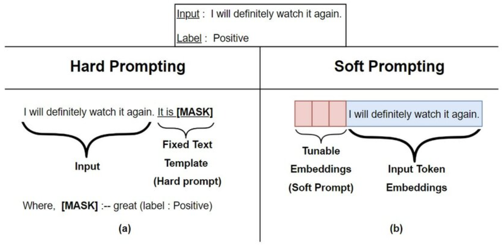

## BitFit

BitFit（论文：**BitFit: Simple Parameter-efficient Fine-tuning or Transformer-based Masked Language-models**）是一种**稀疏的微调方法**，它**训练时只更新bias的参数或者部分bias参数**。

对于Transformer模型而言，**冻结大部分 transformer-encoder 参数，只更新bias参数跟特定任务的分类层参数**。涉及到的bias参数有attention模块中计算`query`,`key`,`value`跟合并多个attention结果时涉及到的bias，MLP层中的bias，Layernormalization层的bias参数。

在Bert-Base/Bert-Large这种模型里，bias参数仅占模型全部参数量的0.08%～0.09%

示例代码如下：

```Python
for name, param in model.named_parameters():
    if "bias" not in name:
        param.requires_grad = False
```

# Prefix Tuning


在Prefix Tuning之前的工作主要是人工设计离散的模版或者自动化搜索离散的模版。对于人工设计的模版，模版的变化对模型最终的性能特别敏感，加一个词、少一个词或者变动位置都会造成比较大的变化。而对于自动化搜索模版，成本也比较高；同时，以前这种离散化的token搜索出来的结果可能并不是最优的。

除此之外，传统的微调范式利用预训练模型去对不同的下游任务进行微调，对每个任务都要保存一份微调后的模型权重，一方面微调整个模型耗时长；另一方面也会占很多存储空间。

基于上述两点，Prefix Tuning提出**固定预训练LM**，**为LM添加可训练，任务特定的前缀，** 这样就可以为不同任务保存不同的前缀，微调成本也小；同时，这种Prefix实际就是连续可微的Virtual Token（Soft Prompt/Continuous Prompt），相比离散的Token，更好优化，效果更好。


#### 技术原理

Prefix Tuning（论文：**Prefix-Tuning: Optimizing Continuous Prompts for Generation**），**在输入token之前构造一段任务相关的virtual tokens作为Prefix，然后训练的时候只更新Prefix部分的参数，而PLM中的其他部分参数固定**。

该方法其实和构造Prompt类似，只是Prompt是人为构造的“显式”的提示，并且无法更新参数，而Prefix则是可以学习的“隐式”的提示。



同时，**为了防止直接更新Prefix的参数导致训练不稳定和性能下降的情况，在Prefix层前面加了MLP结构，训练完成后，只保留Prefix的参数**。


使用代码如下：
```Python
from peft import get_peft_config, get_peft_model, PrefixTuningConfig, TaskType, PeftType

config = PrefixTuningConfig(task_type=TaskType.CAUSAL_LM, num_virtual_tokens=10, prefix_projection=True)

model = get_peft_model(model, config)

```

`PrefixTuningConfig` 配置类参数说明：

- `task_type`：指定任务类型。如：条件生成任务（SEQ_2_SEQ_LM），因果语言建模（CAUSAL_LM）等。
- `num_virtual_tokens`：虚拟token的数量，换句话说就是提示（prompt）。
- `inference_mode`：是否在推理模式下使用Peft模型。
- `prefix_projection`：是否投影前缀嵌入(token)，**默认值为false，表示使用P-Tuning v2**， **如果为true，则表示使用 Prefix Tuning。**


PEFT 中 Prefix Tuning源码如下：

```Python
class PrefixEncoder(torch.nn.Module):
    def __init__(self, config):
        super().__init__()
        self.prefix_projection = config.prefix_projection
        token_dim = config.token_dim
        num_layers = config.num_layers
        encoder_hidden_size = config.encoder_hidden_size
        num_virtual_tokens = config.num_virtual_tokens
        if self.prefix_projection and not config.inference_mode:
            # Use a two-layer MLP to encode the prefix
            # 初始化重参数化的编码器
            self.embedding = torch.nn.Embedding(num_virtual_tokens, token_dim)
            self.transform = torch.nn.Sequential(
                torch.nn.Linear(token_dim, encoder_hidden_size),
                torch.nn.Tanh(),
                torch.nn.Linear(encoder_hidden_size, num_layers * 2 * token_dim),
            )
        else:
            self.embedding = torch.nn.Embedding(num_virtual_tokens, num_layers * 2 * token_dim)

    def forward(self, prefix: torch.Tensor):
        if self.prefix_projection:
            prefix_tokens = self.embedding(prefix)
            past_key_values = self.transform(prefix_tokens)
        else:
            past_key_values = self.embedding(prefix)
        return past_key_values
```

从上面的源码也可以看到** Prefix Tuning** 与 **P-Tuning v2** 最主要的差别就是是否进行**重新参数化编码**。

整体的`PrefixEncoder`作为`past_key_values`进行返回，会和原始的`k`，`v`进行拼接。

假设对`Qwen2.5-1.5B`进行**prefix tuning**，那么增加的部分为：

```Python
ModuleDict(
  (default): PrefixEncoder(
    (embedding): Embedding(10, 1536)
    (transform): Sequential(
      (0): Linear(in_features=1536, out_features=1536, bias=True)
      (1): Tanh()
      (2): Linear(in_features=1536, out_features=86016, bias=True)
    )
  )
)
```

`Linear(in_features=1536, out_features=86016, bias=True)` 的输出维度为`86016`，通过源码可以看出是由`num_layers * 2 * token_dim`得到，`num_layers`为28，**2表示k，v**，`token_dim`为1536。相乘正好为`86016`。


## Prompt Tuning

- Prompt-Tuning的思想: 冻结主模型全部参数，在训练数据前加入一小段Prompt，只训练**Prompt的表示层，即一个Embedding模块**。总的来说就是，只要模型规模够大，简单加入 Prompt tokens 进行微调，就能取得很好的效果。


该方法可以看作是 Prefix Tuning 的简化版本，只在输入层加入 prompt tokens，`并不需要加入 MLP 进行调整来解决难训练的问题`，主要在 T5 预训练模型上做实验。

作者做了一系列对比实验，都在说明：`随着预训练模型参数的增加，一切的问题都不是问题，最简单的设置也能达到极好的效果`。

具体代码可以参考`prompt-tuning.ipynb`

加载Qwen2.5-1.5B

```Python
from transformers import AutoModelForCausalLM, AutoTokenizer
model_path = '/Qwen/Qwen2___5-1___5B-Instruct'
model = AutoModelForCausalLM.from_pretrained(
    model_path,
    torch_dtype="auto",
    device_map="auto"
)
tokenizer = AutoTokenizer.from_pretrained(model_path)
```

加载peft config，在peft库中，Prompt又存在两种形式，一种是`hard prompt`，一种是`soft prompt`。

```Python
from peft import PromptTuningConfig, get_peft_model, TaskType, PromptTuningInit

# Soft Prompt
config = PromptTuningConfig(task_type=TaskType.CAUSAL_LM, num_virtual_tokens=10)
config
# Hard Prompt
#config = PromptTuningConfig(task_type=TaskType.CAUSAL_LM,
#       prompt_tuning_init=PromptTuningInit.TEXT,
#       prompt_tuning_init_text="下面是一段人与机器人的对话。",
#       num_virtual_tokens=len(tokenizer("下面是一段人与机器人的对话。")["input_ids"]),
#       tokenizer_name_or_path="/Qwen/Qwen2___5-1___5B-Instruct")
# config
```

参数说明：

- `task_type`：指定任务类型。如：条件生成任务（SEQ_2_SEQ_LM），因果语言建模（CAUSAL_LM）等。
- `prompt_tuning_init`：提示嵌入的初始化方法。PEFT支持文本（TEXT）和随机（RANDOM）初始化。
- `prompt_tuning_init_text`：用于初始化提示嵌入的文本，在使用文本（TEXT）初始化方法时使用。
- `num_virtual_tokens`：指定虚拟Token数。原始论文提到过提示虚拟 Token 的长度在20左右时的表现已经不错（超过20之后，提升Prompt token长度，对模型的性能提升不明显了）；同样的，这个gap也会随着模型参数规模的提升而减小（即对于超大规模模型而言，即使提示虚拟 Token 长度很短，对性能也不会有太大的影响）。

```Python
model = get_peft_model(model, config)
print(model)
# 打印结果
PeftModelForCausalLM(
  (base_model): Qwen2ForCausalLM(
    (model): Qwen2Model(
      (embed_tokens): Embedding(151936, 1536)
      (layers): ModuleList(
        (0-27): 28 x Qwen2DecoderLayer(
.....
      (norm): Qwen2RMSNorm((1536,), eps=1e-06)
    )
    (lm_head): Linear(in_features=1536, out_features=151936, bias=False)
  )
  (prompt_encoder): ModuleDict(
    (default): PromptEmbedding(
      (embedding): Embedding(10, 1536)
    )
  )
  (word_embeddings): Embedding(151936, 1536)
)

```

从模型类结构可以看到，Prompt Tuning 只在输入层加入 prompt virtual tokens，其他地方均没有变化。

```Python
model.print_trainable_parameters()
# trainable params: 15,360 || all params: 1,543,729,664 || trainable%: 0.0010

```

可训练的参数非常少了。

```Python
from transformers import DataCollatorForSeq2Seq, TrainingArguments, Trainer
args = TrainingArguments(
    output_dir="./prompt_tuning_output",
    per_device_train_batch_size=16,
    gradient_accumulation_steps=8,
    logging_steps=10,
    num_train_epochs=1,
    save_steps=20,
)
trainer = Trainer(
    model=model,
    args=args,
    tokenizer=tokenizer,
    train_dataset=tokenized_ds,
    data_collator=DataCollatorForSeq2Seq(tokenizer=tokenizer, padding=True),
)
trainer.train()  
```

### **P-Tuning**

该方法的提出主要是为了解决这样一个问题：大模型的Prompt构造方式严重影响下游任务的效果。比如：GPT-3采用人工构造的模版来做上下文学习（in context learning），但人工设计的模版的变化特别敏感，加一个词或者少一个词，或者变动位置都会造成比较大的变化。

同时，近来的自动化搜索模版工作成本也比较高，以前这种离散化的token的搜索出来的结果可能并不是最优的，导致性能不稳定。

基于此，作者提出了P-Tuning，设计了一种**连续可微的virtual token**（同Prefix-Tuning类似）。

### 技术原理

P-Tuning（论文：**GPT Understands, Too**），该方法**将Prompt转换为可以学习的Embedding层，并用MLP+LSTM的方式来对Prompt Embedding进行一层处理**。


相比Prefix Tuning，P-Tuning加入的可微的virtual token，**但仅限于输入层，没有在每一层都加；另外，virtual token的位置也不一定是前缀，插入的位置是可选的**。这里的出发点实际是把传统人工设计模版中的真实token替换成可微的virtual token。

经过预训练的LM的词嵌入已经变得高度离散，如果随机初始化virtual token，容易优化到局部最优值，而这些virtual token理论是应该有相关关联的。因此，作者通过实验发现**用一个prompt encoder来编码会收敛更快，效果更好**。即用一个LSTM/MLP去编码这些virtual token以后，再输入到模型。

代码和prompt-tuning差不多，改变如下：

```Python
from peft import PromptEncoderConfig, TaskType, get_peft_model, PromptEncoderReparameterizationType

config = PromptEncoderConfig(task_type=TaskType.CAUSAL_LM, num_virtual_tokens=10,
            encoder_reparameterization_type=PromptEncoderReparameterizationType.MLP,
            encoder_dropout=0.1, encoder_num_layers=5, encoder_hidden_size=1024)
model = get_peft_model(model, config)      
```


### **P-Tuning** V2

之前的Prompt Tuning和P-Tuning等方法存在两个主要的问题：

第一，缺乏**模型参数规模**和**任务通用性**。

- 缺乏规模通用性：Prompt Tuning论文中表明当模型规模超过100亿个参数时，提示优化可以与全量微调相媲美。但是对于那些较小的模型（从100M到1B），提示优化和全量微调的表现有很大差异，这大大限制了提示优化的适用性。
- 缺乏任务普遍性：尽管Prompt Tuning和P-tuning在一些 NLU 基准测试中表现出优势，但提示调优对硬序列标记任务（即序列标注）的有效性尚未得到验证。

第二，缺少深度提示优化，在Prompt Tuning和P-tuning中，连续提示只被插入transformer第一层的输入embedding序列中，在接下来的transformer层中，插入连续提示的位置的embedding是由之前的transformer层计算出来的，这可能导致两个可能的优化挑战。

- 由于序列长度的限制，可调参数的数量是有限的。
- 输入embedding对模型预测只有相对间接的影响。

考虑到这些问题，作者提出了P-tuning v2，它利用深度提示优化（如：Prefix Tuning），对Prompt Tuning和P-Tuning进行改进，作为一个跨规模和NLU任务的通用解决方案。

### 技术原理

P-Tuning v2（论文： **P-Tuning v2: Prompt Tuning Can Be Comparable to Fine-tuning Universally Across Scales and Tasks**），该方法在每一层都加入了Prompts tokens作为输入，而不是仅仅加在输入层，这带来两个方面的好处：

- 更多可学习的参数（从P-tuning和Prompt Tuning的0.01%增加到0.1%-3%），同时也足够参数高效。
- 加入到更深层结构中的Prompt能给模型预测带来更直接的影响。

代码参考Prefix Tuning中的代码。


### 参考

[大模型参数高效微调技术原理综述（二）-BitFit、Prefix Tuning、Prompt Tuning - 知乎](https://zhuanlan.zhihu.com/p/635686756)

[llm_interview_note/05.有监督微调/2.prompting/2.prompting.md at main · wdndev/llm_interview_note](https://github.com/wdndev/llm_interview_note/blob/main/05.有监督微调/2.prompting/2.prompting.md)

[https://zhuanlan.zhihu.com/p/646748939](https://zhuanlan.zhihu.com/p/646748939)

[https://zhuanlan.zhihu.com/p/635848732](https://zhuanlan.zhihu.com/p/635848732)

