## **Transformer** **简介**

Transformer 包括编码器和解码器两部分，由于当前主流的大语言模型几乎都基于只含解码器而不含编码器的仅解码器 (decoder-only) 模型，因此此处主要介绍仅解码器模型中的 Transformer 解码器，该解码器通过多个解码器层堆叠而成，每层包含自注意力层、前馈神经网络、层归一化、残差连接等组件。

其中，自注意力层接收一个特征序列作为输入，并将该序列输入作为查询 (Query, 下文简称 Q)、键 (Key, 下文简称 K) 和值 (Value, 下文简称 V)，使用缩放点积 (Scaled-dot Production) 来计算 Q 和 K 之间的注意力权重矩阵，然后再通过注意力权重和 V 来计算自注意力层的输出。

自注意力层的主体代码如下。简单起见，此处省略自注意力层中的 Q、K、V 各自的线性映射、Dropout、多头注意力、掩码机制等内容。

```python
import unittest

import torch
import torch.nn as nn
from torch.nn import functional as F

class StandardAttention(object):
    def __init__(self) -> None:
        """
        Attention module implemented in Numpy.

        Formula:
            P = QK^T
            S = softmax(P / sqrt(d_k))
            O = SV
        """
        pass

    def _validity_check(self, q: np.ndarray, k: np.ndarray, v: np.ndarray) -> None:
        assert q.ndim == 3, "q should be a 3D tensor"      # [batch_size, seq_len, hidden_size]
        assert k.ndim == 3, "k should be a 3D tensor"
        assert v.ndim == 3, "v should be a 3D tensor"
        assert q.shape[0] == k.shape[0], "batch_size of q and k should be the same"
        assert q.shape[2] == k.shape[2], "hidden_size of q and k should be the same"
        assert q.shape[2] == v.shape[2], "hidden_size of q and v should be the same"

    def forward(self, q: np.ndarray, k: np.ndarray, v: np.ndarray) -> np.ndarray:
        self._validity_check(q, k, v)
        batch_size, q_len, hidden_size = q.shape
        denom = np.sqrt(hidden_size)
        attn = np.matmul(q, k.transpose(0, 2, 1))       # [batch_size, q_len, k_len]
        attn = np.exp((attn - attn.max(axis=-1, keepdims=True)) / denom)
        attn = attn / attn.sum(axis=-1, keepdims=True)
        out = np.matmul(attn, v)                        # [batch_size, q_len, hidden_size]
        return out

    def __call__(self, *args, **kwargs):
        return self.forward(*args, **kwargs)


def self_attention(x):
    return StandardAttention()(x, x, x)


class TestSelfAttention(unittest.TestCase):
    def test_forward(self):
        input_dim = 10
        batch_size = 32
        seq_len = 20

        x = torch.randn(batch_size, seq_len, input_dim)
        output = self_attention(x)
        expected = F.scaled_dot_product_attention(x, x, x)

        self.assertTrue(torch.allclose(output, expected, atol=1e-6, rtol=1e-6))

if __name__ == '__main__':
    unittest.main()
```

我们可以通过 PyTorch 库所给的 F.scaled_dot_production 函数来验证 self_attention 函数的正确性。单元测试的结果此处略过。

## **Attention** **为什么慢？**

上一节提到，Transformer 的主要组成部分为 attention，因此优化 Transformer 重点在于优化 attention 的计算。那么，attention 为什么需要优化呢？或者说，注意力机制为什么慢？

> 此处的“快慢”是相对而言的。严格意义上来说，相比于传统的 RNN，Transformer 中的 attention 可以并行地处理序列所有位置的信息（RNN 只能串行处理），因此计算效率并不低，但是仍然有可以进一步改进的空间。

众所周知，对于科学计算程序而言，按照算数运算和内存读取各自所花的时间比例，**科学计算通常分为计算密集型 (compute-bound) 和内存密集型 (memory-bound) 两类**。其中，计算密集型运算的时间瓶颈主要在于算数计算，比如大型矩阵的相乘等，而**内存密集型运算的时间瓶颈主要在于内存的读写时间，比如批归一化、层归一化**等等。

我们可以从计算和内存两方面来分析“attention为什么慢”这个问题，分别对应于时间复杂度和空间复杂度两个方面。

- 时间复杂度方面，attention 需要对矩阵 和矩阵 的转置做乘法来得到注意力权重矩阵。不考虑 batch 维度，假设矩阵 和 的尺寸都为 (n , dim)，一个 ( n, dim) 和 (dim, n) 的矩阵相乘的时间复杂度是序列长度 的平方级，**即 attention 的时间复杂度为 O(n^2)** 。当序列较长 (即 较大) 时， attention 的计算非常耗时。
- 空间复杂度方面， attention 的计算过程需要存储 和 这两个尺寸均为 (n, n) 的矩阵，**因此 attention 运算的空间复杂度也为O(n^2)** 。

为了对 attention 的内存读取时间有更清晰的感知，这里简单介绍 GPU 的内存层级。

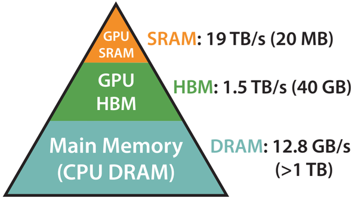

如图 1 所示，GPU 的内存可以分为 HBM 和 SRAM 两部分。例如，A100 GPU 具有 40-80 GB 的高带宽内存 （上图中的 HBM，即我们平时说的“显存”），带宽为 1.5-2.0 TB/s，并且每个流式多处理器都有 192 KB 的片上 SRAM，带宽约为 19 TB/s。片上 SRAM 比 HBM 快一个数量级，但容量要小很多个数量级。**在 GPU 运算之前，数据和模型先从 CPU 的内存（上图中的 DRAM）移动到 GPU 的 HBM，然后再从 HBM 移动到 GPU 的 SRAM，CUDA kernel 在 SRAM 中对这些数据进行运算，运算完毕后将运算结果再从 SRAM 移动到 HBM**。

将 HBM 和 SRAM 之间的数据交换考虑在内，attention 的计算过程可以用如下图所示的算法表示。

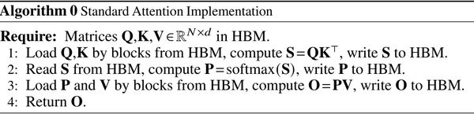

通过前面的空间复杂度分析，attention 运算需要占据的显存空间随着序列长度 nn 的增长呈平方级增长。由于运算需要在 GPU 的 SRAM上 完成，这一过程需要不停地在 HBM 和 SRAM 之间交换数据，因此会导致大量的时间都消耗在 SRAM 和 HBM 之间的数据的换入换出上。

综合上面的关于 attention 的时间和空间复杂度的分析，为了加速 attention 运算，我们可以从降低时间复杂度和降低空间复杂度两个角度入手，接下来逐一进行介绍部分相关工作。

## **如何提高** **attention** **的计算效率**

### **路径1：降低 attention 的计算复杂度**

计算复杂度方面，一些工作尝试提出近似的 attention 算法，来降低 attention 的理论上的计算复杂度。主要可以分为稀疏 (sparse) 估计、低秩 (low-rank) 估计等。

其中，稀疏估计的基本思想是通过一个稀疏的矩阵来估计完整的、稠密 (dense)的注意力矩阵。比如，Reformer (https//openreview.net/forum%3Fid%3DrkgNKkHtvB)对 和 进行局部敏感哈希 (Local Sensitive Hashing(https//en.wikipedia.org/wiki/Locality-sensitive_hashing)， LSH)，只对同一个桶 (bucket) 中的 和 计算 attention，将 attention 的时间复杂度从 降低到 ，而 Routing Transformer (https//aclanthology.org/2021.tacl-1.4)  和 进行聚类，只对同一个簇 (cluster) 中的 和 计算attention，从而将attention的时间复杂度从 降低到 。

低秩估计的基本思想通过一个低秩 (low-rank) 矩阵来估计注意力矩阵。比如， linear transformer(http//proceedings.mlr.press/v119/katharopoulos20a/katharopoulos20a.pdf) 引入核函数 ，将 score 形式化成 score ，来解耦开 softmax 运算中的 和 。这样操作之后，可以先计算 ，然后再和 相乘，由于 的尺寸为 ， 和 的尺寸为 ，因此 的时间复杂度为 (简要推导: ，时间复杂度为 。

虽然降低 attention 的计算复杂度在理论上非常具有吸引力，但是在实际应用中仍然存在一些短板，比如以下两点：

-  **性能比不上原始** **attention****。**不论是稀疏估计、低秩估计还是其他，这些方法都采用了某种近似算法来估算注意力权重矩阵，难免会丢失信息。目前主流的还是原始的attention；
-  **无法减少内存读取的时间消耗**。这些方法只能降低 attention 的计算复杂度，但是无法对 attention 运算过程中的空间复杂度等进行控制，无法减少内存读写带来的时间损耗。

### **路径2：降低attention的空间复杂度**

空间复杂度方面，这方面工作的基本思路是**降低** **attention** **对于显存的需求，减少** **HBM** **和** **SRAM** **之间的换入换出**，进而减少 attention 运算的时间消耗。

为降低空间复杂度，一种具有代表性的方法是 **kernel fusion**。kernel fusion 的思想很简单，即将需要通过多个 CUDA kernel 来分步完成的操作融合到一个或者少数几个 CUDA kernel，从而减少数据在HBM和SRAM之间换入换出的次数，进而节省运算时间。

比如，在图 2 的 attention 算法中，我们在 SRAM 上计算 ，将矩阵 写入到 HBM 中，然后再将矩阵 从 HBM 读入到 SRAM 中，计算 。上述两步可以合并在一个 kernel 中完成，即在 SRAM 中计算完 之后紧接着就通过 计算 ，这样就可以避免在 HBM 和 SRAM 交换 。

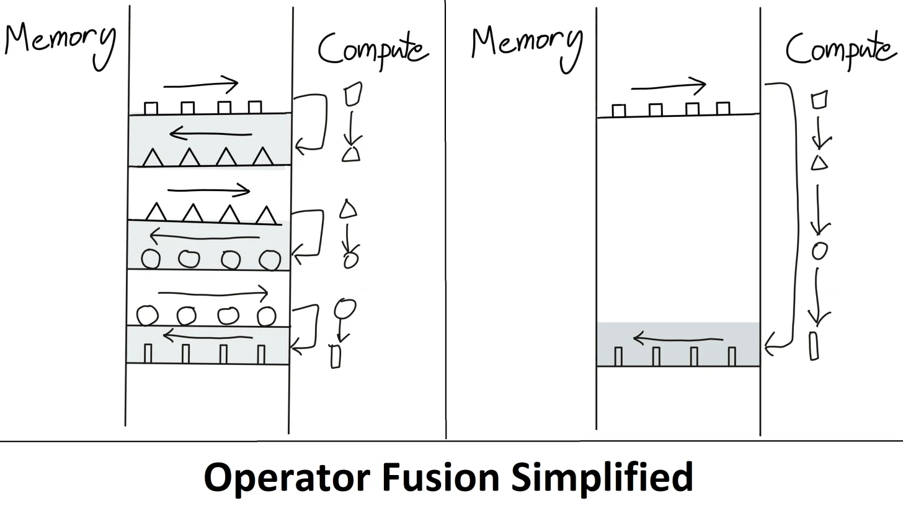

Flash Attention 的做法其实也是 kernel fusion，只是对应的 kernel 专门针对数据的换入换出进行了优化 (**IO-aware**)，尽可能最小化 HBM 和 SRAM 之间的数据交换次数。

## **Flash Attention** **介绍**

本节介绍 Flash ttention 的动机、具体方法和实现细节，并基于 Numpy 实现 Flash Attention 的主体算法（代码已开源，链接(https//gist.github.com/xiabingquan/a4a9a743f97aadd531ed6218be20afd2)）。

和 Transformer 的原始 attention 相比，Flash Attention 有以下三点特点：

- **运算速度更快** **(Fast)****；**
- **更节省显存** **(Memory-Efficient)****；**
- **计算结果相同** **(Exact)**。

这三点刚好和 Flash Attention 论文名《FLASHATTENTION: Fast and Memory-Efficient Exact Attention with IO-Awareness》相对应。得益于 Flash Attention 的这几点特性，自 PyTorch 2.0(https//pytorch.org/blog/accelerated-pytorch-2/) 开始，Flash Attention 已经被集成到 PyTorch 官方库中，使用者可以直接通过 torch.nn.functional.scaled_dot_product_attention(https//pytorch.org/docs/stable/generated/torch.nn.functional.scaled_dot_product_attention.html) 进行调用。

### **摘要**

Flash Attention 的动机是尽可能避免大尺寸的注意力权重矩阵在 HBM 和 SRAM 之间的换入换出。具体方法包含两个部分：**tiling** 和 **recomputation**。

tiling 的基本思路：不直接对整个输入序列计算注意力，而是将其分为多个较小的块，逐个对这些块进行计算，增量式地进行 softmax 的规约。规约过程中只需要更新某些中间变量，**不需要计算整个注意力权重矩阵**。

recomputation 的基本思路：基于 tiling 技巧，在反向传播过程中不保留整个注意力权重矩阵，而是只保留前向过程中 tiling 的某些中间变量，然后**在反向传播过程中重新计算注意力权重矩阵**。recomputation 可以看作是**一种基于** **tiling** **的特殊的** **gradient checkpointing**，因此后文主要介绍 tiling，想进一步了解 recomputation 的读者可以翻阅 Flash Attention 原文。

得益于上述技巧，Flash Attention 可以同时做到又快（运算速度快）又省（节省显存）。

### **基于Tiling技巧的Softmax**

Tiling 技巧的核心思想是，尽可能避免对整个序列进行操作，而是通过维护一些中间变量来递推式地完成某些操作，从而减少内存的消耗。

#### 原始softmax

以 softmax 为例，原始的 softmax 可以用如下算法表示：

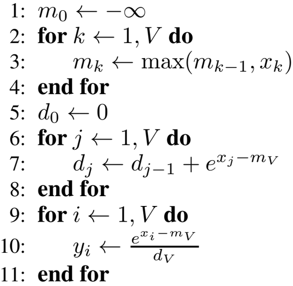

该算法的实现如下。为了展示 softmax 运算的详细过程，以下代码没有使用 PyTorch、Numpy 等科学计算库，或者Python原生的 max、min 等归约函数，而仅仅使用 Python 原生的数值运算符对浮点数的列表进行操作。注意这是safe softmax，减去最大值保证不会超过float的极值。

```python
class SoftMax(object):
    def forward(self, x: List[float]):

        # loop 1: get the maximum value
        max_x = -np.inf
        for t in x:
            max_x = t if t > max_x else max_x

        # loop 2: get the accumulative sum of exp(x_i - x_max)
        accum_exp = 0.
        for t in x:
            accum_exp += np.exp(t - max_x)

        # loop 3: get the softmax output by dividing the exponential of `x-max(x)` with `accum_exp`
        output = [0. for _ in range(len(x))]
        for i, t in enumerate(x):
            output[i] = np.exp(t - max_x) / accum_exp

        return output

    def __call__(self, *args, **kwargs):
        return self.forward(*args, **kwargs)

```

从上面的代码可以看出，softmax 函数需要三个循环，第一个循环计算数组的最大值，第二个循环计算 softmax 的分母，第三个循环计算 softmax 输出。

#### tiling softmax 

使用 tiling 技巧的 softmax 的算法如下图所示。

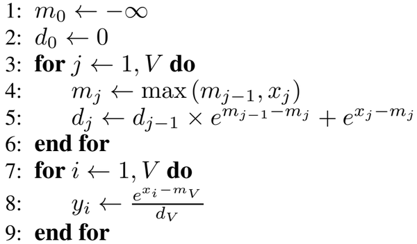

该算法的实现如下：

```python
class SoftMaxWithTiling(object):
    def forward(self, x: List[float]):
        # loop 1: get the maximum value of x and the accumulated exponential values
        max_x = -np.inf
        accum_exp = 0.
        for t in x:
            max_x_new = t if t > max_x else max_x
            accum_exp = np.exp(max_x - max_x_new) * accum_exp + np.exp(t - max_x_new)
            max_x = max_x_new

        # loop 2: get the softmax output by dividing the exponential of `x-max(x)` with `accum_exp`
        out = [0. for _ in range(len(x))]
        for i, t in enumerate(x):
            out[i] = np.exp(t - max_x) / accum_exp

        return out
```

```python
class SoftMaxTest(unittest.TestCase):
    def test_softmax(self):

        n_test = 10
        for _ in range(n_test):
            n_elem = np.random.randint(1, 11)
            x = np.random.randn(n_elem).tolist()
            expected = torch.nn.functional.softmax(torch.tensor(x), dim=-1).tolist()

            out = SoftMax()(x)
            self.assertTrue(np.allclose(expected, out, atol=1e-4))

            out_with_tiling = SoftMaxWithTiling()(x)
            self.assertTrue(np.allclose(expected, out_with_tiling, atol=1e-4))


if __name__  == "__main__":
    unittest.main()

```

该算法和原始的 softmax 最大的区别在于，我们在第一个循环中同时对最大值 以及 softmax 的分母 进行更新，从而减少了一个循环。

在这个循环中，最大值 的更新和原始 softmax 相同，但是 softmax 分母的更新却稍有区别。在原始 softmax 中，我们已经通过第一个循环拿到了整个数组 的最大值，因此在第二个循环中可以直接计算 ，但是在此处，当进行到 for 循环的第j（1≤j＜V）步时，我们手头只有子数组 的最大值，此时计算得到的 e 并不等于 e 。为了一直维护正确的 e，我们需要同步地对 之前的 e 进行更新。

**通过 tiling 的方式，softmax 的循环数从三个减到了两个，从而可以降低内存消耗。**

### **Flash Attention****的Numpy实现**

Flash Attention 同样基于上述的tiling技巧实现，但是和上述的 sofmax 有两点不同：

1. attention 的计算过程需要对 Q 和 K 进行内积，并且需要维护 attention 的输出矩阵 O ；
2. 在上述 tiling 形式的 softmax 中，我们的每一步只更新一个元素，但是 **Flash Attention 将输入分为多个块，每个块包含多个元素**。

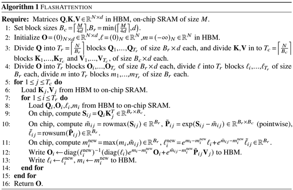

由于我们无法直接从 Python 层面在 GPU 的 SRAM 和 HBM 之间进行数据交换，因此我们使用 load 和 write 方法来分别模拟 HBM -> SRAM 和 SRAM -> HBM 的数据传输过程：

```
def load(self, arr, st, ed, step):
   \# Simulate the process that moves data from HBM to SRAM
   return arr[:, st * step: ed * step]

 def write(self, arr, val, st, ed, step):
   \# Simulate the process that moves data from SRAM to HBM
   arr[:, st * step: ed * step] = val
```

接下来去我们结合代码来逐步理解该算法：

**输入**: 矩阵 QKV

**输出**: attention 的输出矩阵

```
def forward(self, q, k, v):
        """
        The following implementation strictly follows the Algorithm 1 in the paper of FLASH-ATTENTION.
        Except that we put it in a batched way, i.e. the batch_size is the first dimension of q, k, v.
        Algorithm 1 is on the 5th page of the orginal paper of FLASH-ATTENTION.
        """

        self._validity_check(q, k, v)
        batch_size, q_len, hidden_size = q.shape
        k_len = k.shape[1]

        # (Line 2): initialize O, l and m
        # O: output, will be updated in a row-block-wise manner
        out = np.zeros((batch_size, q_len, hidden_size))
        # l: exp-sum of each row block, will be the denominator in softmax. 
        # l will be updated in a exponential moving average way.
        l = np.zeros((batch_size, q_len))
        # m: max of each row block, will be part of the numerator in softmax.
        # m will also be updated in a exponential moving average way.
        m = np.zeros((batch_size, q_len))
        m.fill(-np.inf)

        # (Line 3): divide q into row blocks and k, v into column blocks
        Tr = q_len // self.row_block_size       # Tr: number of row blocks
        Tc = k_len // self.col_block_size       # Tc: number of column blocks

        # (Line 4): pass. We do not need to explicitly split the output into row blocks, 
        # but we will update the output in a row-block-wise manner to simulate the process of FLASH-ATTENTION.
        
        # (Line 5): iterate over column blocks
        for j in range(Tc):

            # (Line 6), load the key and value block
            # kj: key block, [batch_size, col_block_size, hidden_size]
            # vj: value block, [batch_size, col_block_size, hidden_size]
            kj = self.load(k, j, j + 1, self.col_block_size)
            vj = self.load(v, j, j + 1, self.col_block_size)

            # (Line 7): iterate over row blocks
            for i in range(Tr):
                
                # (Line 8): load the query block. [batch_size, row_block_size, hidden_size]
                qi = self.load(q, i, i + 1, self.row_block_size)
                oi = self.load(out, i, i + 1, self.row_block_size)
                mi = self.load(m, i, i + 1, self.row_block_size)
                li = self.load(l, i, i + 1, self.row_block_size)

                # (Line 9): compute the dot-product attention score
                sij = np.matmul(qi, kj.transpose(0, 2, 1)) / np.sqrt(hidden_size)

                # (Line 10): compute max, softmax, and exp-sum
                mij = np.max(sij, axis=-1)                                              # [batch_size, row_block_size]
                pij = np.exp((sij - mij[..., np.newaxis]))                              # [batch_size, row_block_size, col_block_size]
                lij = pij.sum(axis=-1)                                                  # [batch_size, row_block_size]

                # (Line 11): update m and l
                # 11.a. update m, the max of each row block
                m_new = np.maximum.reduce([mi, mij])
                # 11.b. update l, the accumulated exp-sum of each row block
                l_new = np.exp(mi - m_new) * li + np.exp(mij - m_new) * lij

                # (Line 12): update output
                temp = li[..., np.newaxis] * np.exp(mi - m_new)[..., np.newaxis] * oi + np.exp(mij - m_new)[..., np.newaxis] * np.matmul(pij, vj)
                temp /= l_new[..., np.newaxis]
                self.write(out, temp, i, i + 1, self.row_block_size)

                # (Line 13): store the m and l of current row block to the global m and l
                self.write(m, m_new, i, i + 1, self.row_block_size)
                self.write(l, l_new, i, i + 1, self.row_block_size)

        return out
```

> 注：上述代码只是Flash Attention原文算法1的直观实现，可能和底层C++实现在细节上存在一些出入。官方实现请请翻阅Flash Attention的原始仓](https//github.com/Dao-AILab/flash-attention)。


## Transformer的时空复杂度与标准注意力的问题

FlashAttention是斯坦福联合纽约州立大学在22年6月份提出的一种具有 IO 感知，且兼具快速、内存高效的新型注意力算法。它要解决一个什么样的问题呢？

首先，GPT3、LLaMA、ChatGLM、BLOOM等大语言模型输入输出的最大序列长度只有2048或4096，扩展到更长序列的难度在哪里呢？**本质原因是，transformer模型的计算复杂度和空间复杂度都是 $ O(N^2) $的，其中𝑁 为序列长度**，如此，FlashAttention提出了一种加速计算、节省显存和IO感知的精确注意力，可以有效地缓解上述问题。

###  Transformer计算复杂度*——*Self-Attention层与MLP层

https://blog.csdn.net/v_JULY_v/article/details/133619540

### **标准注意力Standard Attention的两个问题：显存占用多、HBM读写次数多**

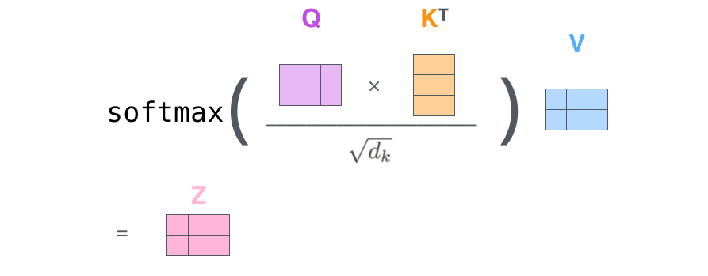

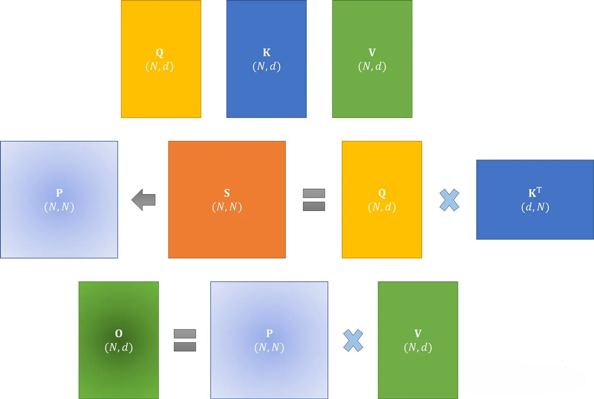

在标准注意力实现中， 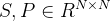 都要写回到HBM中(*下文很快会解释这个HBM*)，占用了 -1731826374665-30.png)的内存，通常 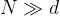
例如，对于GPT2， 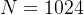，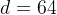 ；对于GPT3，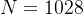，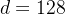 
总之，注意力矩阵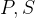 需要的内存 远大于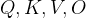 所需要的内存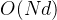

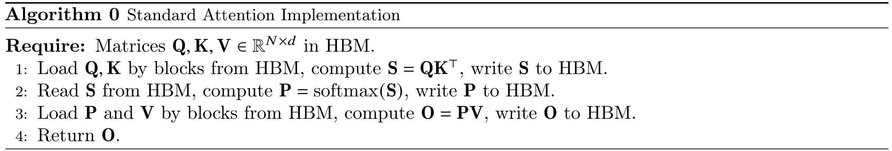

其中，一共包含八次HBM的矩阵读写操作。这八次读写操作分别为：
第一行对 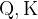 的读 共两次，对 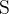 的写一次，读写操作总共三次
第二行对  读一次，对 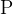 写一次，读写操作总共两次
第三行对 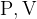 的读 共两次，对  的写一次，读写操作总共三次

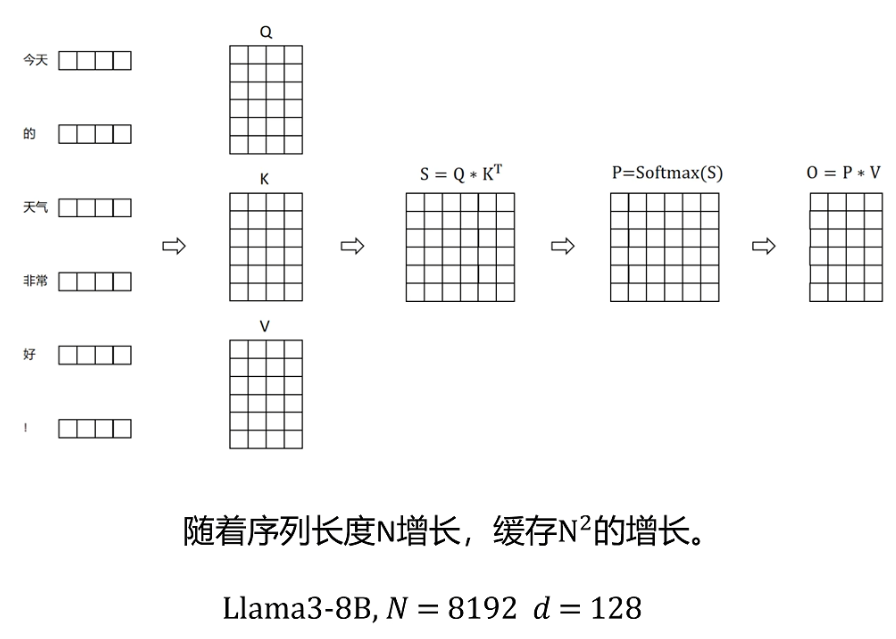

### 制约速度的情况

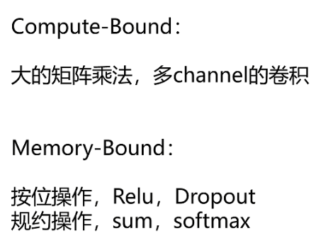

compute-bound计算复杂，但不需要很多数据，memory-bound计算不复杂，但需要很多数据。

在现代GPU中，计算速度已经远超过了显存访问速度，**transformer中的大部分计算操作的瓶颈是显存访问**。对于显存受限的操作，IO感知是非常重要的，因为显存读写占用了大部分的运行时间


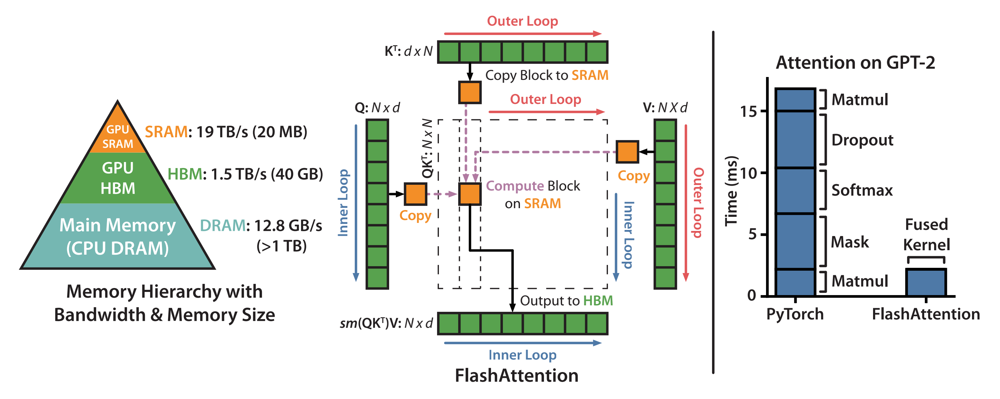

总之，transformer的核心组件self-attention块的计算复杂度和空间复杂度是序列长度 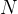的二次方
且对于self-attention块，除了两个大矩阵乘法是计算受限的(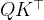、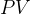)，其他都是内存受限的逐点运算( 例如对 S 的mask操作、 S 的softmax操作、对 P 的dropout操作，这些逐点操作的性能是受限于内存带宽的，会减慢运行时间)

### **Memory-efficient Attention：把显存复杂度从平方降低到线性，但HBM访问次数仍是平方**

这个方法本质是lazy softmax，把P矩阵不保留，直接计算 S*V 和 他们的总和，最后相除得到结果。

相比标准attention，空间复杂度降到了O(N)，但时间复杂度和BM访问次数还是O(N^2)，因此运行时间并没有减少


## 参考

https://gist.github.com/xiabingquan/a4a9a743f97aadd531ed6218be20afd2


