# Transformer中的两种不同类型的mask

## mask类型

在Transformer中通常有两种主要的 **mask**，分别是：

1. **Padding Mask**（填充掩码）：  
   - **目的**：用于忽略填充的无效部分，以避免这些无效部分影响计算结果。
   - **应用场景**：
     - 输入序列中某些位置可能是填充的 `<PAD>` 标记（例如，用于对齐批量中不同长度的序列）。
     - Padding Mask 会确保模型在计算注意力分数时，不关注这些填充值。
   - **实现**：通过将填充值的位置标记为 `-∞`（在softmax之前），使其在注意力分布中权重为0。

2. **Causal Mask**（因果掩码，也称 Look-Ahead Mask）：  
   - **目的**：用于确保解码阶段的自注意力机制只关注当前位置及其之前的位置，从而防止模型看到未来的词。
   - **应用场景**：
     - 在语言模型（如GPT）或生成任务中，解码器不能提前看到未来的目标词。
   - **实现**：将注意力矩阵中未来的词位置标记为 `-∞`，确保模型只能依赖已经生成的词。

### 它们的组合应用
在具体应用中，这两种掩码可能会结合使用，例如：
- 在序列到序列（Seq2Seq）模型中：
  - 编码器使用 **Padding Mask**。
  - 解码器的自注意力使用 **Causal Mask**。
  - 解码器的编码器-解码器注意力使用 **Padding Mask**，避免关注编码器的填充值。

这两种掩码的具体实现依赖于场景，通常可以通过布尔矩阵或数值掩码（如 `0` 和 `-∞`）来表达。


## mask实现

在 Transformer 的实现中，输入的 **mask** 通常是二维的 `(batch_size, seq_length)`，但在用于注意力（attention）计算时，mask 会广播或扩展为三维或更高维度以适配操作。下面分别举例说明 **Padding Mask** 和 **Causal Mask** 的输入形式以及其在 Attention 中的扩展。

---

### **1. Padding Mask**
**作用**：遮掩序列中的无效位置（如 `<PAD>` 标记），防止这些位置影响注意力计算。

#### 输入 Mask（二维）
假设 batch 中有两个序列，最大序列长度为 5：
```plaintext
Mask (batch_size, seq_length):
[[1, 1, 1, 0, 0],   # 第一个序列有效长度为 3
 [1, 1, 1, 1, 0]]   # 第二个序列有效长度为 4
```
这里的 `1` 表示有效位置，`0` 表示填充位置。

#### 广播后的 Mask（三维或四维）
在 **多头注意力** 中，Padding Mask 需要广播到形状 `(batch_size, 1, seq_length)` 或更高：
```plaintext
Mask_broadcasted (batch_size, 1, seq_length):
[
 [[1, 1, 1, 0, 0]],  # 对于第一个序列
 [[1, 1, 1, 1, 0]]   # 对于第二个序列
]
```

若进一步扩展到 `(batch_size, num_heads, seq_length, seq_length)`，用于注意力矩阵操作：
```plaintext
Mask_broadcasted (batch_size, num_heads, seq_length, seq_length):
[
  [[[1, 1, 1, 0, 0],    # 第1个序列的每个head
     [1, 1, 1, 0, 0],
     [1, 1, 1, 0, 0],
     [1, 1, 1, 0, 0],
     [1, 1, 1, 0, 0]]],

  [[[1, 1, 1, 1, 0],    # 第2个序列的每个head
     [1, 1, 1, 1, 0],
     [1, 1, 1, 1, 0],
     [1, 1, 1, 1, 0],
     [1, 1, 1, 1, 0]]]
]
```

#### 应用
- 在注意力分数计算 \( QK^T \) 后，将无效位置添加负无穷大值：
```python
masked_scores = attention_scores + (1 - mask_broadcasted) * -1e9
```
- Softmax 结果中无效位置权重为 0。

---

### **2. Causal Mask**
**作用**：在解码时，防止模型关注未来的位置信息（即当前位置只能看到它之前的位置）。

#### 输入 Mask（二维）
对于单个序列（长度为 5），Causal Mask 是一个二维的上三角矩阵：
```plaintext
Mask (seq_length, seq_length):
[[1, 0, 0, 0, 0],   # 第1个位置只能看到自身
 [1, 1, 0, 0, 0],   # 第2个位置能看到自身和之前的位置
 [1, 1, 1, 0, 0],   # 第3个位置能看到自身和之前的位置
 [1, 1, 1, 1, 0],   # 第4个位置能看到自身和之前的位置
 [1, 1, 1, 1, 1]]   # 第5个位置能看到自身和之前的位置
```

#### 广播后的 Mask（三维或四维）
假设 batch_size 为 2，num_heads 为 2，Causal Mask 会扩展到形状 `(batch_size, num_heads, seq_length, seq_length)`：
```plaintext
Mask_broadcasted (batch_size, num_heads, seq_length, seq_length):
[
  [[[1, 0, 0, 0, 0],    # 第1个序列，head 1
     [1, 1, 0, 0, 0],
     [1, 1, 1, 0, 0],
     [1, 1, 1, 1, 0],
     [1, 1, 1, 1, 1]],

    [[1, 0, 0, 0, 0],    # 第1个序列，head 2
     [1, 1, 0, 0, 0],
     [1, 1, 1, 0, 0],
     [1, 1, 1, 1, 0],
     [1, 1, 1, 1, 1]]],

  [[[1, 0, 0, 0, 0],    # 第2个序列，head 1
     [1, 1, 0, 0, 0],
     [1, 1, 1, 0, 0],
     [1, 1, 1, 1, 0],
     [1, 1, 1, 1, 1]],

    [[1, 0, 0, 0, 0],    # 第2个序列，head 2
     [1, 1, 0, 0, 0],
     [1, 1, 1, 0, 0],
     [1, 1, 1, 1, 0],
     [1, 1, 1, 1, 1]]]
]
```

#### 应用
- 同样在注意力分数计算 \( QK^T \) 后，将不可见的位置赋值为负无穷：
```python
masked_scores = attention_scores + (1 - mask_broadcasted) * -1e9
```
- 确保模型只关注可见的位置信息。

---

### 总结对比

| Mask 类型        | 作用                           | 初始维度                   | 扩展后的维度                                      | 特点                                                 |
| ---------------- | ------------------------------ | -------------------------- | ------------------------------------------------- | ---------------------------------------------------- |
| **Padding Mask** | 忽略填充值的位置               | `(batch_size, seq_length)` | `(batch_size, num_heads, seq_length, seq_length)` | 对填充的无效位置分数设为负无穷，确保不分配注意力权重 |
| **Causal Mask**  | 防止解码阶段看到未来的位置信息 | `(seq_length, seq_length)` | `(batch_size, num_heads, seq_length, seq_length)` | 上三角矩阵，用于遮掩未来位置，防止信息泄露           |

## mask输入说明

**Causal Mask** 的生成完全由模型结构决定，与任务和输入数据无关（例如，解码器的自注意力机制需要这一特性，每次的生成都是固定逻辑，不需要用户干预。Causal Mask 只依赖于序列的长度（`seq_length`），而不依赖具体的输入内容。Causal Mask 通常在模型内部基于序列长度 LLL 生成。例如，假设序列长度为 5，则对应的 Causal Mask 是一个 **上三角矩阵**，其中上三角部分填充 0（表示遮掩），下三角及对角线部分填充 1（表示可见）：

```python
import torch

seq_length = 5
causal_mask = torch.tril(torch.ones((seq_length, seq_length))).unsqueeze(0).unsqueeze(0)
print(causal_mask)

```

```
[[[[1, 0, 0, 0, 0],
    [1, 1, 0, 0, 0],
    [1, 1, 1, 0, 0],
    [1, 1, 1, 1, 0],
    [1, 1, 1, 1, 1]]]]

```

用户通常需要提供的是 **Padding Mask**，因为它依赖具体的输入数据。例如：**序列中哪些位置是有效的，哪些是填充值**。这需要用户明确告知模型哪些部分需要遮掩。

## **总结：三种注意力的 Mask 对比**

| **注意力类型**       | **Query** 来源     | **Key/Value** 来源 | **需要的 Mask 类型** | **作用**                                            |
| -------------------- | ------------------ | ------------------ | -------------------- | --------------------------------------------------- |
| **编码器自注意力**   | 编码器输入         | 编码器输入         | **Padding Mask**     | 忽略编码器输入中的 `<PAD>` 填充值。                 |
| **解码器自注意力**   | 解码器已生成的序列 | 解码器已生成的序列 | **Causal Mask**      | 防止解码器看到未来的位置，确保生成的自回归特性。    |
| **解码器交叉注意力** | 解码器已生成的序列 | 编码器输出         | **Padding Mask**     | 忽略编码器输出中的 `<PAD>` 填充值，专注于有效内容。 |

# 关于mask掩码的解释

在研究自注意力时，有很多的名词需要我们着重的关注，比如填充掩码，前瞻掩码等等，但网上没有太多注意力掩码的教程和它是如何工作的信息，另外还有以下的细节需要详细的解释：

- 为什么要对多个层应用注意力掩码？、
- 为什么不沿键和查询应用注意力掩码？
- 键、查询和值权重是否混淆了原始矩阵的序列顺序？

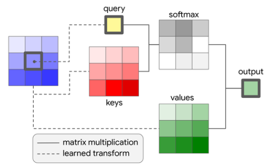

## 问题定义

让我们从一个有 4 个单词的矩阵 X 开始。 当这些词被转换成它们的令牌嵌入，每个令牌的嵌入大小将是 3 个值。 例如下面是我们的句子：

“a b c D”

现在让我们把这些词变成令牌。

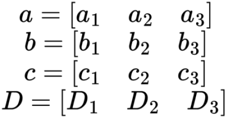

向量a b c D各有3个分量，这个序列本质上是由4个令牌符号组成的。每个令牌是3个值的向量。我们把这些符号变成一个矩阵X。

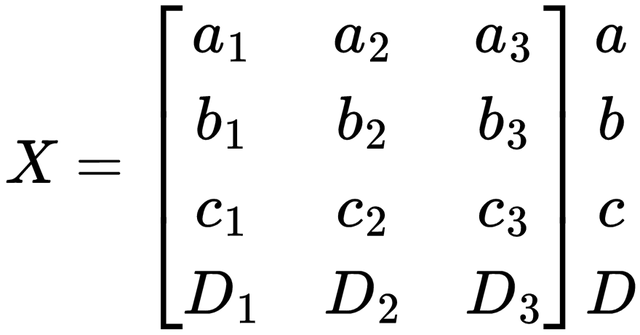

X是由向量a、b、c和D组成的4 × 3矩阵这是我们想要用自注意力来转化的矩阵。

### 注意力计算前的准备

为了准备注意力，我们必须首先使用加权矩阵生成键K、查询Q和值V。对于这个句子，我们想把它转换成一个嵌入空间为2的矩阵。所以每个权重矩阵的形状都是3 * 2 （原始embedding大小 * 新embedding大小）。例如下面是Q的权值矩阵QW。

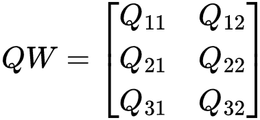

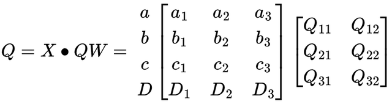

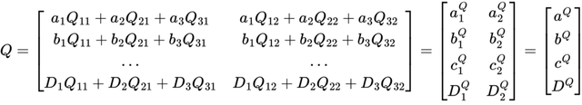

现在我们有了 Q 的表示。注意力结果矩阵中的每个向量不是所有其他令牌的线性组合。 而每**个向量都是其自身和一些权重的线性组合**。 第一个向量只是 a 的线性组合。 第二个只是b的线性组合。 这种转换不会弄乱矩阵内的序列顺序。 a 仍然在矩阵的顶部，而 D 仍然在矩阵的底部。 对于未来的操作，我将使用最右边的矩阵来表示 Q ，这样轻松地可视化 a、b、c 和 D 的向量，并且也可以说明这**些向量是没有被转换为彼此相结合的某种组合**。

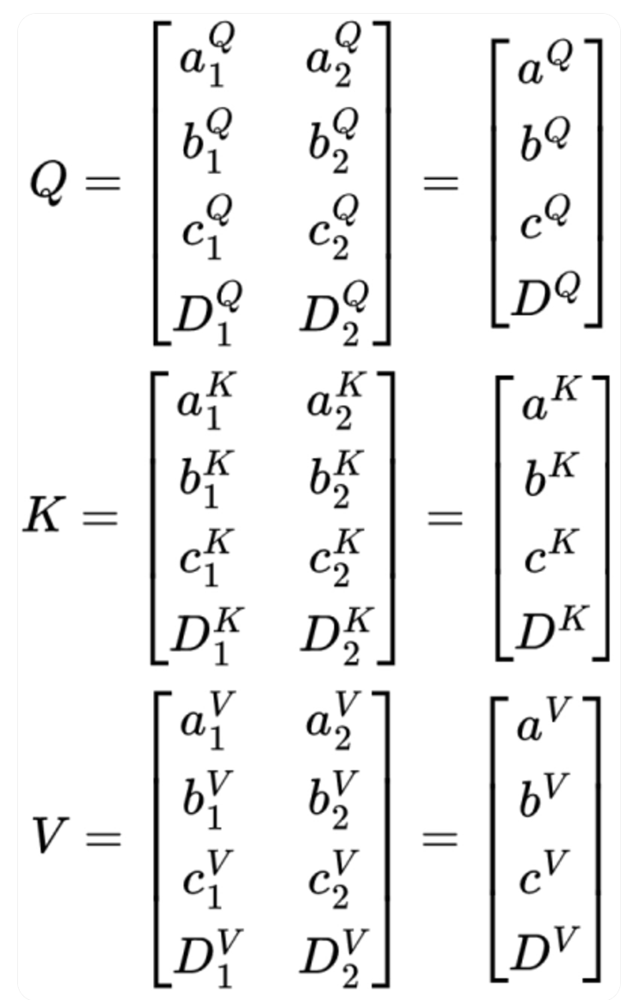

## QK矩阵

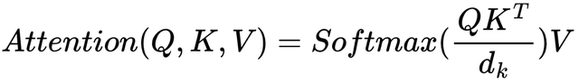

为了更容易地可视化发生了什么，我将删除d常数。《The Attention is All You Need 》的作者声明，**使用标量d是因为“我们怀疑对于d的大值，点积的量级变大，将softmax函数推到具有非常小的梯度的区域**“。所以d只是一个帮助数值量级转换的标量，所以在本文中不用不关心它，那么可以使用下面的公式来代替，也就是把d删除了

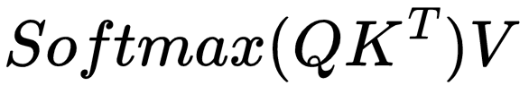

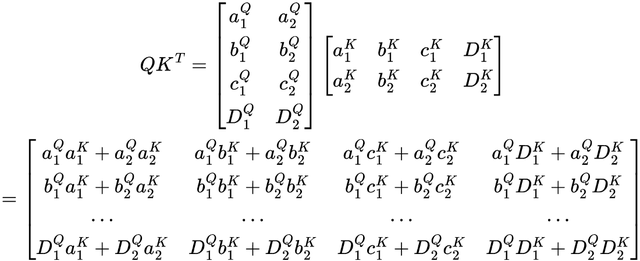

看很复杂，但是这个其实是由Q和K转置相乘得到的矩阵，我们可以把它化简成向量积的形式。并且令牌行和列，这样以帮助可视化矩阵表示的内容。

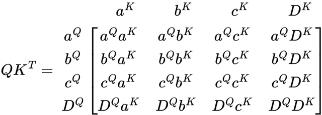

这样是不是就好很多了，每个值基本上都乘以另一个值，包括矩阵中的自己。这个值表示当将V应用到这个矩阵时V中的每个分量将得到多少权重。

### 不带掩码的注意力

在学习如何掩码注意力之前，我们首先需要查看没有掩码的注意力是如何工作的。

计算序列注意力的下一步是对QK矩阵应用softmax函数。那么就出现了一个问题，softmax应该应用在什么维度上?在论文提出的自注意力中，softmax函数应用于每一行。

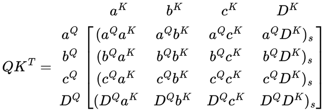

在没有掩码的情况下，softmax函数只是一个归一化函数。所以为了减少可视化的复杂度，我们可以不在这个矩阵中表示它。

现在只剩下最后一步了，将QK矩阵乘以V矩阵。QK矩阵与V矩阵乘积就得到了子注意力计算的结果。

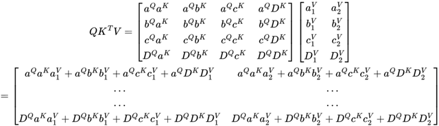

矩阵中的每个编码是QK矩阵中的值和权重的线性组合。实际上得到的矩阵中的每一行都是QK矩阵中的相应行和V矩阵中的相应列的线性组合。不带掩码的注意力模块的输出可以理解为让每个令牌注意所有其他令牌。这意味着每一个令牌对所有其他令牌都有影响。

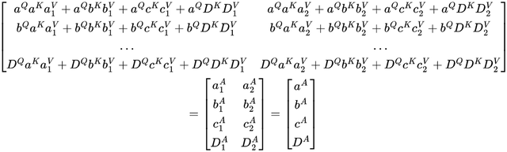

QK矩阵与V矩阵乘积的向量表示，注意力转换本质上产生了一组新的向量，序列中的每个单词对应一个向量。

## 注意力的填充掩码

在使用填充掩码（padding mask）计算注意力之前，我们需要将掩码 M 添加到等式中：

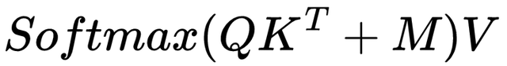

我们已经有了QK和V，但是M是什么样的呢?我们的序列是

" a b c D "

用一个更实际的例子替换这些任意:

I like coffee <PAD>

注意这里有一个PAD令牌。这个令牌出现的原因是，**句子的长度是变化的而矩阵并不能处理不同的大小**。所以为了把很多句子放在一起作为一批处理，**可以在较短句子中添加令牌，使所有句子的长度相同**。

但是使用PAD令牌的一个问题是PAD成为句子中最频繁出现的部分。而训练时模型会注意到这一点，并错误的认为PAD是句子的基础，这样就会产生很多问题。

**为了防止模型对 PAD令牌进行建模，我们可以通过找到 QK 矩阵中PAD位置并进行屏蔽的方法来实现**。 如上例所示，D 是一个PAD令牌，如果我们想要屏蔽它则需要使用与 QK 具有相同维度的掩码，并在表示在要掩码的列上使用 -∞。 M矩阵将如下所示：

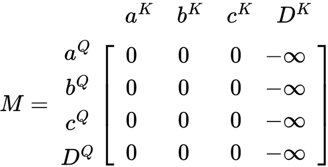

填充掩码的矩阵表示中 D 列是被屏蔽的，但 DQ 行不是。 下一步是将M添加到QK

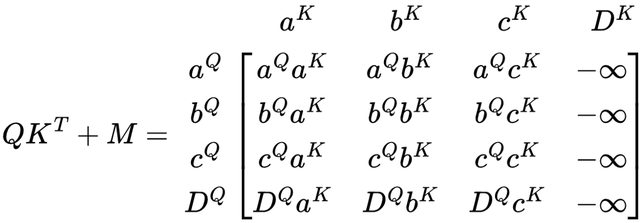

任何数值与-∞ 相加结果都变为 -∞，所以结果列 D 是 -∞ 列。 那么当 softmax 应用于矩阵时会发生什么？

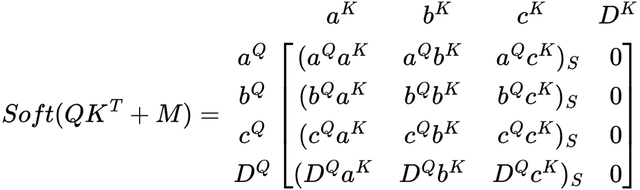

Softmax后D都是0，基本上不会影响权重矩阵中其他值的权重。 这里的D 不是其他行的一部分，而是仅在其自己的 DQ 行中。 这里我们不会担心非∞ 值的 softmax ，因为该函数只是起到归一化的作用。 最后让我们看看将权重矩阵乘以 V 矩阵时得到的矩阵的样子。

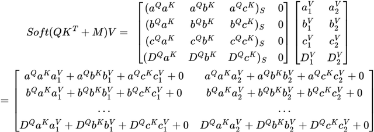

通过将屏蔽QK矩阵与V矩阵相乘得到最终的自注意力结果，让我们仔细看看最终的矩阵。

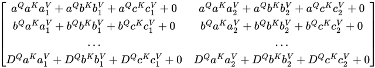

结果矩阵中的每一行如何没有 D 分量。所以D对任何其他元素都没有影响，这意味着任何PAD令牌（这里的D）对序列的其余部分都没有影响。这就是使用对填充进行掩码的原因：不希望它影响序列中的任何其他令牌。

那么DQ 呢，它仍然存在并且没有被遮蔽掉。这是因为如果 DQ 被屏蔽了，矩阵中的 DQ 向量将在应用 softmax 变换后产生一个均匀值的向量，也就是说 DQ 将丢失它之前拥有的所有信息。而我们进行掩码遮蔽的目的不是完全去除 D 的所有信息而是让它不影响其他令牌。所以在结果矩阵中仍然需要关于 D 的信息，也就是说我们要告诉模型的是那里有一个PAD令牌，我们只希望PAD令牌不与其他的令牌令牌产生影响，但是PAD令牌的位置和信息模型还是要知道的。

那么如果同时屏蔽了 DQ 和 D，生成的矩阵将如下所示：

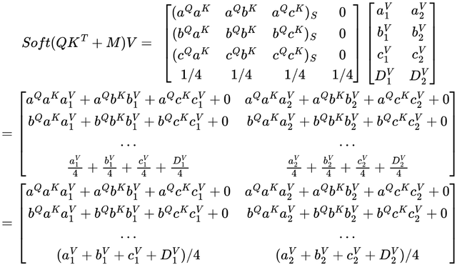

填充掩码同时覆盖DQ和D时的结果可以看到，由于 DQ 和 D 是常数，因此它们不会对结果增加太多。 但是矩阵最后一部分的结果向量只是 V 的 1/4 加权分量的组合。 这会导致 D 丢失其自身的所有信息，这也意味着结果向量中 D 的新表示将是 D 的的一个糟糕的表示方式。

## 注意力的前瞻掩码（Decoder部分）

Look-ahead mask （前瞻掩码）最初来自 Attention is All You Need的论文。使用前瞻掩码的目的是一次在整个文本序列上训练模型而不是一次训练一个单词。原始的 Transformer 模型就是所谓的自回归模型，它仅使用过去的数据进行预测。因为最初的Transformer 是为翻译而制作的，所以这种类型的模型是有意义的。在预测翻译后的句子时，模型会一次预测一个单词。比如：

“How are you”

该模型一次将句子翻译成西班牙语：

预测1：给定“”，模型预测下一个词是“cómo”

预测 2：给定“cómo”，模型预测下一个词是“estás”

预测 3：给定“cómo estás”，模型预测下一个词是“”，表示序列的结束

如果想让模型学习这种翻译怎么办？如果一次输入一个词，则需要输入三次并且做三次的预测，这个过程非常缓慢，因为它需要模型的 S（序列长度）个预测才能从模型中获得单句翻译。但是如果将整个句子“cómo estás ...”提供给它，并使用巧妙的掩码技巧，**让模型就不能向前看到未来的令牌，只能看到过去的令牌**。这样，只需要一个推理步骤就能从模型中获得整个句子的翻译。这就是Look-ahead mask 的由来，所以我们这里将他翻译为前瞻掩码。

使用前瞻掩码进行自注意力的公式与填充掩码相同。唯一的变化与掩码有关。

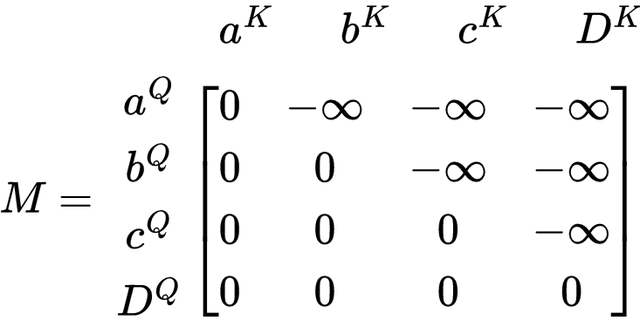

前瞻掩码的矩阵在右上角有一个三角形 -∞，在其他地方是 0。 让我们看看这如何影响权重矩阵的 softmax。

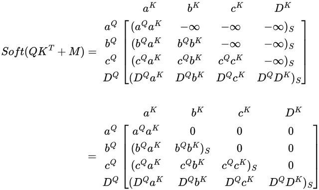

使用前瞻掩码的掩码查询键矩阵的 Softmax时，权重矩阵会得到一些有趣的结果。 第一行 aQ 仅由自身 a 加权。 由于 a 是序列中的第一个令牌，因此它不应受到序列中任何其他令牌的影响，没有不存在其他令牌。

在第二行，b 同时受到 a 和 b 的影响。 由于 b 是第二个令牌，它应该只受第一个令牌 a 的影响。

同理在最后一行中，序列中的最后一个令牌 D 受到所有其他令牌的影响，因为它是序列中的最后一个令牌，应该具有序列中所有其他令牌的上下文。

让我们看看掩码如何影响注意力函数的输出。

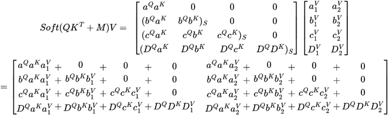

使用前瞻掩码时自注意力的最终结果，与权重矩阵类似，结果向量仅受该向量中表示的令牌之前的令牌的影响。 a 的新令牌嵌入在结果向量的第一行。 由于这个令牌只有它自己的上下文，它只会是它自己的组合。

第二个令牌 b 具有 a 的上下文，因此结果向量是 a 和 b 的组合。

最后一个令牌 D 具有所有其他令牌的上下文，因此结果向量是所有其他令牌的组合。

### 矩阵结果对比

为了可视化生成的矩阵有何不同，我将他们放在一起，下图是使用 no mask、padding mask 和 look-ahead mask 时的 self-attention 函数的最终结果

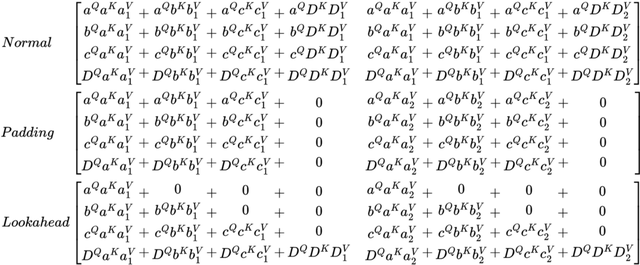

## 在多层中使用掩码

最后一点要说明的是为什么要在多层中使用相同的掩码。如果你仔细看了矩阵就会发现。

首先注意力函数时可以总结为从矩阵X到矩阵a的一个单一变换。

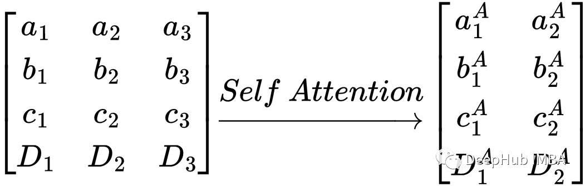

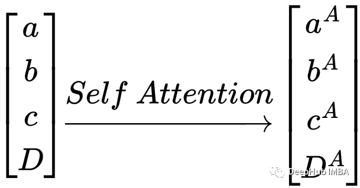

向量的向量之间的自注意力变换

上面已经讲过了，自注意力转换保留了每个向量的上下文。输出序列只是输入序列的形式变换。

假设我们想要屏蔽所有PAD令牌，并且我们认为上面问题定义中的D 是一个PAD令牌。那么输出 Dᴬ 仍然是一个 PAD令牌，只是这个令牌已经被表示为一个转换后的嵌入了。所以任何正在进行的自注意力都需要一个掩码来确保 PAD令牌不会影响任何其他令牌。

我们甚至可以把一个transformer想象成一系列的self-attention函数。**线性层和归一化层不会弄乱令牌之间的序列关系**，所以在本例中可以忽略不计。

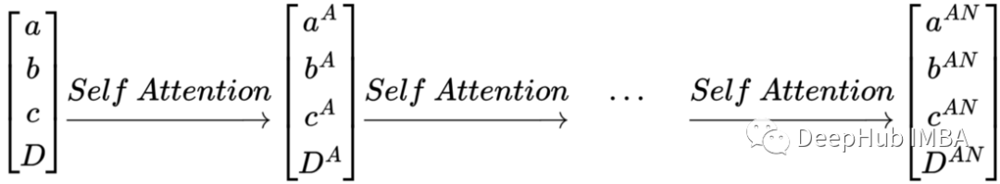

向量的向量之间的多重自注意力转换，**由于保留了自注意力层之间的序列，每个自注意力函数都需要使用相同的掩码**。在填充掩码的例子中，如果 掩码只用在第一个自注意力层上，那么序列将不受第一个自注意力层中的PAD令牌的影响。而在所有其他层中因为缺少掩码序列将会受到PAD令牌的影响，这样就会产生糟糕的结果。

## 总结

注意力掩码本质上是一种阻止模型看我们不想让它看的信息的方法。这不是一种非常复杂的方法，但是它却非常有效。我希望这篇文章能让你更好地理解掩码在自注意力中的作用，希望以上的矩阵计算是正确的，如果有错误，欢迎指出。