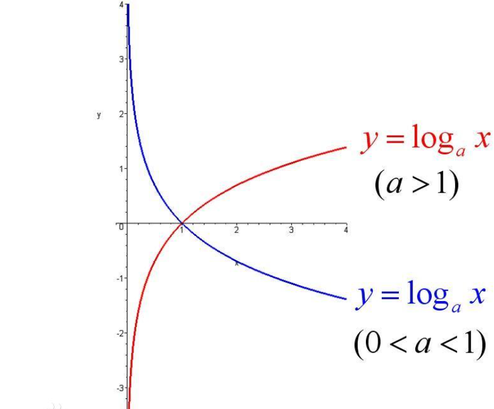

关于样本集的两个概率分布p和q，设p为真实的分布，比如[1, 0, 0]表示当前样本属于第一类，q为拟合的分布，比如[0.7, 0.2, 0.1]。

按照真实分布p来衡量识别一个样本所需的编码长度的期望，即平均编码长度（**信息熵**）：

$$
H(p)=-\sum_{i=1}^{C} p\left(x_{i}\right) \log \left(p\left(x_{i}\right)\right)
$$

如果**使用拟合分布q来表示来自真实分布p的编码长度的期望**，即平均编码长度（**交叉熵**）：

$$
H(p, q)=-\sum_{i=1}^{C} p\left(x_{i}\right) \log \left(q\left(x_{i}\right)\right)
$$

直观上，用p来描述样本是最完美的，用q描述样本就不那么完美，根据[吉布斯不等式](https://link.zhihu.com/?target=https://en.wikipedia.org/wiki/Gibbs%27_inequality)，$H(p, q) \geq H(p)$ 恒成立，当q为真实分布时取等，我们将由q得到的平均编码长度比由p得到的平均编码长度多出的bit数称为**相对熵**，也叫KL散度：

$$
D(p \| q)=H(p, q)-H(p)=\sum_{i=1}^{C} p\left(x_{i}\right) \log \left(\frac{p\left(x_{i}\right)}{q\left(x_{i}\right)}\right)
$$

在机器学习的分类问题中，我们希望缩小模型预测和标签之间的差距，即KL散度越小越好，在这里由于KL散度中的$H(p)$项不变（**在其他问题中未必**），故在优化过程中只需要关注交叉熵就可以了，因此一般使用交叉熵作为损失函数。


#### **多分类任务中的交叉熵损失函数**

$$
Loss =-\sum_{i=0}^{C-1} y_{i} \log \left(p_{i}\right)=-\log \left(p_{c}\right)
$$

$p=\left[p_{0}, \ldots, p_{C-1}\right]$是一个概率分布，每个元素$p_i $表示样本属于第$i$类的概率

$y=\left[y_{0}, \ldots, y_{C-1}\right]$**是样本标签的onehot表示**


#### **PyTorch中的交叉熵损失函数实现**

PyTorch提供了两个类来计算交叉熵，分别是CrossEntropyLoss() 和NLLLoss()。

- torch.nn.CrossEntropyLoss()

```Python
torch.nn.CrossEntropyLoss(
    weight=None,
    ignore_index=-100,
    reduction="mean",
)
criterion = nn.CrossEntropyLoss()
criterion(pred, label)
```

**pred**为预测标签，这里的pred表示一个样本的**非softmax输出，因为CrossEntropyLoss里面有一个log_softmax函数，**

**label**为标签, CrossEntropyloss会将label转换为one-hot形式

**源代码如下：**

```Python
def cross_entropy(input, target, weight=None, size_average=None, ignore_index=-100,
                  reduce=None, reduction='mean'):
  """
    Examples::

        >>> input = torch.randn(3, 5, requires_grad=True)
        >>> target = torch.randint(5, (3,), dtype=torch.int64)
        >>> loss = F.cross_entropy(input, target)
        >>> loss.backward()
    """
    if not torch.jit.is_scripting():
        tens_ops = (input, target)
        if any([type(t) is not Tensor for t in tens_ops]) and has_torch_function(tens_ops):
            return handle_torch_function(
                cross_entropy, tens_ops, input, target, weight=weight,
                size_average=size_average, ignore_index=ignore_index, reduce=reduce,
                reduction=reduction)
    if size_average is not None or reduce is not None:
        reduction = _Reduction.legacy_get_string(size_average, reduce)
    return nll_loss(log_softmax(input, 1), target, weight, None, ignore_index, None, reduction)
```

可以看到input是经过了log_softmax后传入nll_loss才得到的结果，其中log_softmax对应了公式里面的$\log \left(p_{i}\right)$


- torch.nn.NLLLoss()

nn.NLLLoss**输入是一个对数概率向量和一个目标标签**。NLLLoss() ，即**负对数似然损失函数**（Negative Log Likelihood）

```Python
torch.nn.NLLLoss(
    weight=None,
    ignore_index=-100,
    reduction="mean",
)
criterion = torch.nn.NLLLoss()
criterion (pred, label)

```

NLLLoss()将 label 转换成 one-hot 编码，然后与 pred点乘得到的结果

正如上文所讲的那样，对于多分类任务，NLLLoss 函数输入 input 之前，需要对 input 进行 log_softmax 处理，即将 input 转换成概率分布的形式。


**通过上面的说明可以知道：torch.nn.CrossEntropyLoss在一个类中组合了log_softmax和nn.NLLLoss**


#### 例子

假设现在有输出结果如下：

|预测|标签|是否正确|
|-|-|-|
|0.3    0.3    0.4|2 (猪)|正确|
|0.3    0.4    0.3|1 (狗)|正确|
|0.1    0.2    0.7|0 (猫)|错误|


将标签转换为one-hot形式的标签

**猪 0 0 1   狗 0 1 0    猫  1 0 0**

#### Mean Squared Error (均方误差)

均方误差损失也是一种比较常见的损失函数，其定义为$M S E=\frac{1}{n} \sum_{i}^{n}\left(\hat{y}_{i}-y_{i}\right)^{2}$

很容易得到：

$$
sample1\ \ loss =(0.3-0)^{2}+(0.3-0)^{2}+(0.4-1)^{2}=0.54 \\sample2 \ \ loss =(0.3-0)^{2}+(0.4-1)^{2}+(0.3-0)^{2}=0.54 \\ sample 3\ \ loss =(0.1-1)^{2}+(0.2-0)^{2}+(0.7-0)^{2}=1.34
$$

对所有样本求平均值：

$$
M S E=\frac{0.54+0.54+1.34}{3}=0.81
$$

不采用MSE作为损失主要原因是在分类问题中，使用sigmoid/softmx得到概率，配合MSE损失函数时，采用梯度下降法进行学习时，会出现模型一开始训练时，学习速率非常慢的情况（[MSE损失函数](https://zhuanlan.zhihu.com/p/35707643)）


#### Cross Entropy Loss Function（交叉熵损失函数）

对于交叉熵损失，我们可以根据上面的公式来计算：

$$
Loss =-\sum_{i=0}^{C-1} y_{i} \log \left(p_{i}\right)=-\log \left(p_{c}\right)
$$

**首先对预测值求softmax**

0.3220,  0.3220, 0.3559    

0.3220,  0.3559, 0.3220 

0.2546,  0.2814, 0.4640   

然后根据公式计算：

$$
\begin{array}{l}\text { sample } 1 \text { loss }=-(0 \times \log 0.3220+0 \times \log 0.3220+1 \times \log 0.3559)=1.033 \\ \text { sample } 2 \text { loss }=-(0 \times \log 0.3220+1 \times \log 0.3559+0 \times \log 0.3220)=1.033 \\ \text { sample } 3 \text { loss }=-(1 \times \log 0.2546+0 \times \log 0.2814+0 \times \log 0.4640)=1.368\end{array}
$$


对所有样本的loss求平均：

$$
L=\frac{1.033+1.033+1.368}{3}=1.1447
$$

下面代码演示：

```Python
import torch.nn as nn
import torch
# 定义CrossEntropyLoss
loss_func = nn.CrossEntropyLoss()
label_one_hot = torch.Tensor([[0, 0, 1], [0, 1, 0], [1, 0, 0]])  # one-hot格式label
label = torch.Tensor([2.,1.,0.]).long()   # 普通格式label
pred = torch.Tensor([[0.3, 0.3, 0.4], [0.3, 0.4, 0.3], [0.1, 0.2, 0.7]])


## 1. 手动计算交叉熵的loss
print(-torch.sum(torch.mul(torch.log(torch.softmax(pred, dim=-1)), label_one_hot), dim=-1).mean())
## output  tensor(1.1447)


## 2. 用nn.CrossEntropyLoss()计算loss
print(loss_func(pred, label))
## tensor(1.1447)

```

**可以发现他们的输出是一样的**

