# Batch Normalization, Layer Normalization

## 前言

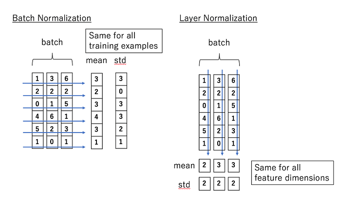

这一篇写 Transformer 里标准化的方法。在 Transformer 中，数据过 Attention 层和 FFN 层后，都会经过一个 [Add &amp; Norm](https://zhida.zhihu.com/search?content_id=189656123&content_type=Article&match_order=1&q=Add+%26amp%3B+Norm&zhida_source=entity) 处理。其中，Add 为 [residule block](https://zhida.zhihu.com/search?content_id=189656123&content_type=Article&match_order=1&q=residule+block&zhida_source=entity)（残差模块），数据在这里进行 [residule connection](https://zhida.zhihu.com/search?content_id=189656123&content_type=Article&match_order=1&q=residule+connection&zhida_source=entity)（残差连接）。而 Norm 即为 Normalization（标准化）模块。**Transformer 中采用的是 Layer Normalization（层标准化）方式**。常用的标准化方法有 Batch Normalization，Layer Normalization，Group Normalization，Instance Normalization 等，这篇笔记将在论文研究的基础上，着重聚焦于前两者。笔记内容包括：

一、Batch Normalization

*   1.1 提出背景

*   1.1.1 ICS 所带来的问题
*   1.1.2 解决 ICS 的常规方法

*   1.2 BN 的实践

*   1.2.1 思路
*   1.2.1 训练过程中的 BN
*   1.2.2 测试过程中的 BN

*   1.3 BN 的优势总结
*   1.4 大反转：著名深度学习方法 BN 成功的秘密竟不在 ICS？

二、Layer Normalization

*   2.1 背景 (为何 NLP 多用 LN，图像多用 BN)
*   2.2 思路
*   2.3 训练过程和测试过程中的 LN

三、Transformer LN 改进方法：Pre-LN

*   3.1 思路和实践方法
*   3.2 实验效果

四、参考


一、Batch Normalization
------------------------

本节 1.2-1.3 的部分，在借鉴[天雨粟：Batch Normalization 原理与实战](https://zhuanlan.zhihu.com/p/34879333)解说的基础上，增加了自己对论文和实操的解读，并附上图解。上面这篇文章写得非常清晰，推荐给大家阅读～

 

### 1.1 提出背景


Batch Normalization（以下简称 BN）的方法最早由 [Ioffe&Szegedy](https://link.zhihu.com/?target=https%3A//arxiv.org/pdf/1502.03167.pdf) 在 2015 年提出，主要用于解决在深度学习中产生的 ICS（[Internal Covariate Shift](https://zhida.zhihu.com/search?content_id=189656123&content_type=Article&match_order=1&q=Internal+Covariate+Shift&zhida_source=entity)）的问题。若模型输入层数据分布发生变化，则模型在这波变化数据上的表现将有所波动，输入层分布的变化称为 Covariate Shift，解决它的办法就是常说的 [Domain Adaptation](https://zhida.zhihu.com/search?content_id=189656123&content_type=Article&match_order=1&q=Domain+Adaptation&zhida_source=entity)。同理，在深度学习中，第 L+1 层的输入，也可能随着第 L 层参数的变动，而引起分布的变动。这样每一层在训练时，都要去适应这样的分布变化，使得训练变得困难。这种层间输入分布变动的情况，就是 Internal Covariate Shift。而 BN 提出的初衷就是为了解决这一问题。


（线性变化层）（非线性变化激活函数层）$\begin{aligned} Z^{[L]} &= W^{[L]} * A^{[L-1]} + b^{[L]} （线性变化层）\\ A^{[L]} &= g^{[L]}(Z^{[L]})（非线性变化/激活函数层） \end{aligned}$\begin{aligned} Z^{[L]} &= W^{[L]} * A^{[L-1]} + b^{[L]} （线性变化层）\\ A^{[L]} &= g^{[L]}(Z^{[L]})（非线性变化 / 激活函数层） \end{aligned}

（ICS：随着梯度下降的进行， $W^{[L]}$ 和 $b{[L]}$ 都会被更新，则 $Z^{[L]}$ 的分布改变，进而影响 $A^{[L]}$ 分布，也就是第 L+1 层的输出）

 

1.1.1 ICS 所带来的问题


**（1）在过激活层的时候，容易陷入激活层的梯度饱和区，降低模型收敛速度。**
这一现象发生在我们对模型使用饱和激活函数 (saturated activation function)，例如 sigmoid，tanh 时。如下图：

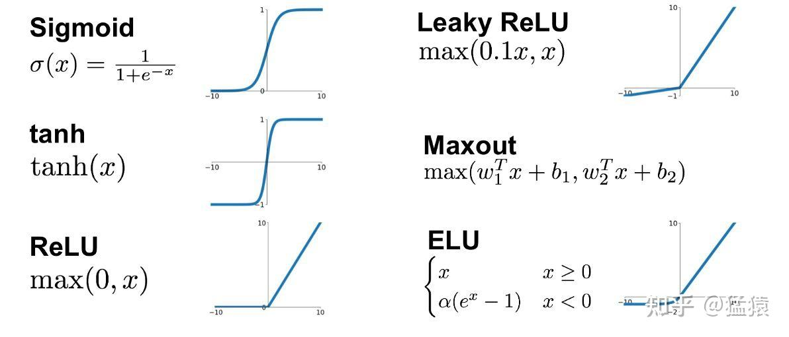


可以发现当绝对值越大时，数据落入图中两端的梯度饱和区（saturated regime），造成梯度消失，进而降低模型收敛速度。当数据分布变动非常大时，这样的情况是经常发生的。当然，解决这一问题的办法可以采用非饱和的激活函数，例如 ReLu。
**（2）需要采用更低的学习速率，这样同样也降低了模型收敛速度。**
如前所说，由于输入变动大，上层网络需要不断调整去适应下层网络，因此这个时候的学习速率不宜设得过大，因为梯度下降的每一步都不是 “确信” 的。

#### 1.1.2 解决 ICS 的常规方法


综合前面，在 BN 提出之前，有几种用于解决 ICS 的常规办法：

*   采用非饱和激活函数
*   更小的学习速率
*   更细致的参数初始化办法
*   数据白化（whitening）

其中，最后一种办法是在模型的每一层输入上，采用一种线性变化方式（例如 PCA），以达到如下效果：

*   使得输入的特征具有相同的均值和方差。例如采用 PCA，就让所有特征的分布均值为 0，方差为 1
*   去除特征之间的相关性。

然而在每一层使用白化，给模型增加了运算量。而小心地调整学习速率或其他参数，又陷入到了超参调整策略的复杂中。因此，BN 作为一种更优雅的解决办法被提出了。

 

### 1.2 BN 的实践

#### 1.2.1 思路

*   对每一个 batch 进行操作，使得对于这一个 batch 中所有的输入数据，它们的每一个特征都是均值为 0，方差为 1 的分布
*   单纯把所有的输入限制为 (0,1) 分布也是不合理的，这样会降低数据的表达能力（第 L 层辛苦学到的东西，这里都暴力变成（0,1）分布了）。因此需要再加一个线性变换操作，让数据恢复其表达能力。这个线性变化中的两个参数 $\gamma, \beta$ 是需要模型去学习的。

整个 BN 的过程可以见下图：

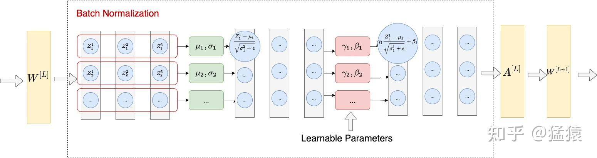


上图所示的是 2D 数据下的 BN，而在 NLP 或图像任务中，我们通常遇到 3D 或 4D 的数据，例如：

*   图像中的数据维度：（N, C, H, W)。其中 N 表示数据量（图数），C 表示 channel 数，H 表示高度，W 表示宽度。
*   NLP 中的数据为度：（B, S, E）。其中 B 表示批量大小，S 表示序列长度，E 表示序列里每个 token 的 embedding 向量维度。

如下图，它们在执行 BN 时，在图中每一个蓝色的平面上求取 $\mu, \sigma$ (也就是一个 batch 里同一 channel 上的所有数据)，同时让模型自己学习 $\gamma, \beta$ 。其中 "H,W" 表示的是 "H*W"，即每一个 channel 里 pixel 的数量。为了表达统一，这张图用作 NLP 任务说明时，可将 (N, C, H*W) 分别理解成(B, E, S)。

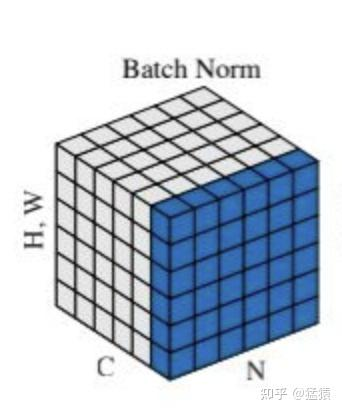

**这张图中，取同一个 $c_i$ 的其他两维度的数据归一化，即对 NLP 的每个 embedding 维度的数据作归一化。**

##### 1.2.1 训练过程中的 BN

配合上面的图例，我们来具体写一下训练中 BN 的计算方式。
假设一个 batch 中有 m 个样本，则在神经网络的某一层中，我们记第 i 个样本在改层第 j 个神经元中，经过线性变换后的输出为 $Z^i_j$ ，则 BN 的过程可以写成（图中的每一个红色方框）：


$\begin{aligned} \mu_j &= \frac{1}{m} \sum_{i=1}^{m} Z^i_j \\ \sigma^2_j &= \frac{1}{m} \sum_{i=1}^{m} (Z^i_j - \mu_j)^2 \\ \tilde{Z_j} &= \gamma_{j}\frac{Z_j - \mu_j}{\sqrt{\sigma^2_j + \epsilon}} + \beta_{j} \end{aligned}$

其中 $\epsilon$ 是为了防止方差为 0 时产生的计算错误，而 $\gamma_j, \beta_j$ 则是模型学习出来的参数，目的是为了尽量还原数据的表达能力。

 

##### 1.2.2 测试过程中的 BN


在训练过程里，我们等一个 batch 的数据都装满之后，再把数据装入模型，做 BN。但是在测试过程中，我们却更希望模型能来一条数据就做一次预测，而不是等到装满一个 batch 再做预测。也就是说，我们希望测试过程共的数据不依赖 batch，每一条数据都有一个唯一预测结果。**这就产生了训练和测试中的 gap：测试里的** $\mu, \sigma$ **要怎么算呢？**一般来说有两种方法。


**（1）用训练集中的均值和方差做测试集中均值和方差的无偏估计**


保留训练模型中，**每一组** batch 的**每一个**特征在**每一层**的 $\mu_{batch}, \sigma^2_{batch}$ ，这样我们就可以得到测试数据均值和方差的无偏估计：


$\begin{aligned} \mu_{test} &= \mathbb{E}(\mu_{batch}) \\ \sigma^2_{test} &= \frac{m}{m-1}\mathbb{E}(\sigma^2_{batch})\\ BN(X_{test}) &= \gamma \frac{X_{test} - \mu_{test}}{\sqrt{\sigma^2_{test} + \epsilon}} + \beta \end{aligned}$
其中 m 表示的是批量大小。
这种做法有一个明显的缺点：需要消耗较大的存储空间，保存训练过程中所有的均值和方差结果（每一组，每一个，每一层）。

**（2）Momentum：移动平均法 (Moving Average)**


稍微改变一下训练过程中计算均值和方差的办法，设 $\mu_{t}$ 是当前步骤求出的均值， $\bar \mu$ 是之前的训练步骤累积起来求得的均值（也称 running mean），则：
$\bar\mu \gets p\bar\mu + (1-p)\mu^{t}$
其中，p 是 momentum 的超参，表示模型在多大程度上依赖于过去的均值和当前的均值。 $\bar\mu$ 则是新一轮的 ruuning mean，也就是当前步骤里最终使用的 mean。同理，对于方差，我们也有：
$\bar{\sigma^2} \gets p\bar{\sigma^2} + (1-p){\sigma^2}^{t}$

采用这种方法的好处是：

*   节省了存储空间，不需要保存所有的均值和方差结果，只需要保存 running mean 和 running variance 即可
*   方便在训练模型的阶段追踪模型的表现。一般来讲，在模型训练的中途，我们会塞入 validation dataset，对模型训练的效果进行追踪。采用移动平均法，不需要等模型训练过程结束再去做无偏估计，我们直接用 running mean 和 running variance 就可以在 validation 上评估模型。

 

## 1.3 BN 的优势总结

*   通过解决 ICS 的问题，使得每一层神经网络的输入分布稳定，在这个基础上可以使用较大的学习率，加速了模型的训练速度
*   起到一定的正则作用，进而减少了 dropout 的使用。当我们通过 BN 规整数据的分布以后，就可以尽量避免一些极端值造成的 overfitting 的问题
*   使得数据不落入饱和性激活函数（如 sigmoid，tanh 等）饱和区间，避免梯度消失的问题

 

## **1.4 大反转：著名深度学习方法 BN 成功的秘密竟不在 ICS？**


以解决 ICS 为目的而提出的 BN，在各个比较实验中都取得了更优的结果。但是来自 MIT 的 [Santurkar et al. 2019](https://link.zhihu.com/?target=https%3A//arxiv.org/pdf/1805.11604.pdf) 却指出：

*   就算发生了 ICS 问题，模型的表现也没有更差
*   BN 对解决 ICS 问题的能力是有限的
*   **_BN 奏效的根本原因在于它让 optimization landscape 更平滑_**

而在这之后的很多论文里也都对这一点进行了不同理论和实验的论证。
（每篇论文的 Intro 部分开头总有一句话类似于：“BN 的奏效至今还是个玄学”。。。）

图中是 VGG 网络在标准，BN，noisy-BN 下的实验结果。其中 noisy-BN 表示对神经网络的每一层输入，都随机添加来自分布 (non-zero mean, non-unit variance) 的噪音数据，并且在不同的 timestep 上，这个分布的 mean 和 variance 都在改变。noisy-BN 保证了在神经网络的每一层下，输入分布都有严重的 ICS 问题。但是从试验结果来看，noisy-BN 的准确率比标准下的准确率还要更高一些，这说明 ICS 问题并不是模型效果差的一个绝对原因。

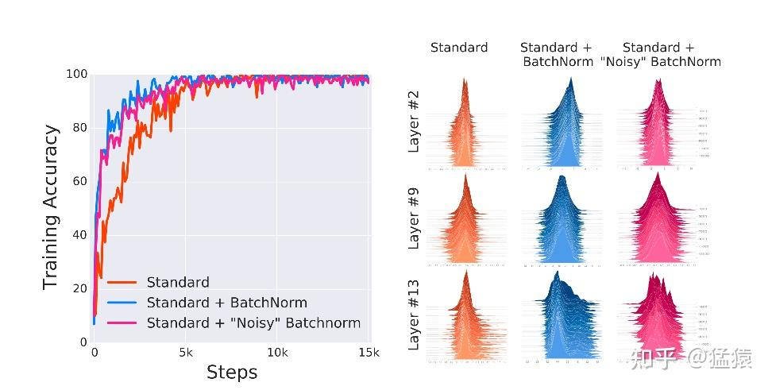


而当用 VGG 网络训练 CIFAR-10 数据时，也可以发现，在更深层的网络（例如 Layer11）中，在采用 BN 的情况下，数据分布也没有想象中的 “规整”：

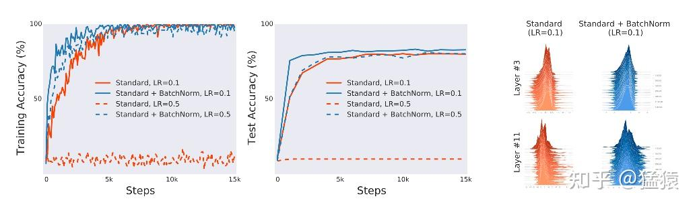


最后，在 VGG 网络上，对于不同的训练 step，计算其在不同 batch 上 loss 和 gradient 的方差（a 和 b 中的阴影部分），同时测量 $\beta-smoothness$ （简单理解为 l2-norm 表示的在一个梯度下降过程中的最大斜率差）。可以发现 BN 相较于标准情况都来得更加平滑。

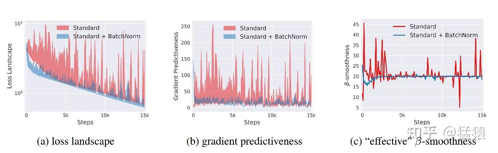


二、Layer Normalization
------------------------

### 2.1 背景


BN 提出后，被广泛作用在 CNN 任务上来处理图像，并取得了很好的效果。针对文本任务，[Ba et al. 2016](https://link.zhihu.com/?target=https%3A//arxiv.org/pdf/1607.06450.pdf) 提出在 RNN 上使用 Layer Normalization（以下简称 LN）的方法，用于解决 BN 无法很好地处理文本数据长度不一的问题。例如采用 RNN 模型 + BN，我们需要对不同数据的同一个位置的 token 向量计算 $\mu, \sigma^2$ ，在句子长短不一的情况下，容易出现：

*   测试集中出现比训练集更长的数据，由于 BN 在训练中累积 $\mu_{batch}, \sigma^2_{batch}$ ，在测试中使用累计的经验统计量的原因，导致测试集中多出来的数据没有相应的统计量以供使用。 （**在实际应用中，通常会对语言类的数据设置一个 max_len，多裁少 pad，这时没有上面所说的这个问题。但这里我们讨论的是理论上的情况，即理论上，诸如 Transformer 这样的模型，是支持任意长度的输入数据的**）
*   长短不一的情况下，文本中的某些位置没有足够的 batch_size 的数据，使得计算出来的 $\mu, \sigma^2$ 产生偏差。例如 [Shen et al. (2020)](https://link.zhihu.com/?target=https%3A//arxiv.org/pdf/2003.07845.pdf) 就指出，在数据集 Cifar-10（模型 RestNet20) 和 IWLST14（模型 Transformer）的训练过程中，计算当前 epoch 所有 batch 的统计量 $\mu_{B}, \sigma^2_{B}$ 和当前累计（running）统计量 $\mu, \sigma^2$ 的平均 Euclidean distance，可以发现文本数据较图像数据的分布差异更大：

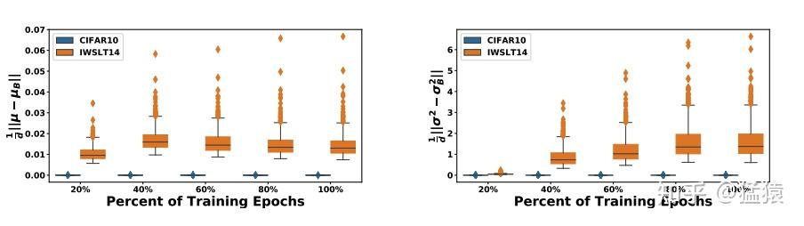

这是一个结合实验的解释，而引起这个现象的原因，**可能不止是 “长短不一” 这一个，也可能和数据本身在某一维度分布上的差异性有关（想一下，对不同句子之间的第一个词做 BN，求出来的 mean 和 variance 几乎是没有意义的）**。目前相关知识水平有限，只能理解到这里，未来如果有更确切的想法，会在这里补充。 

### 2.2 思路


整体做法类似于 BN，不同的是 LN 不是在特征间进行标准化操作（横向操作），而是在整条数据间进行标准化操作（纵向操作）。

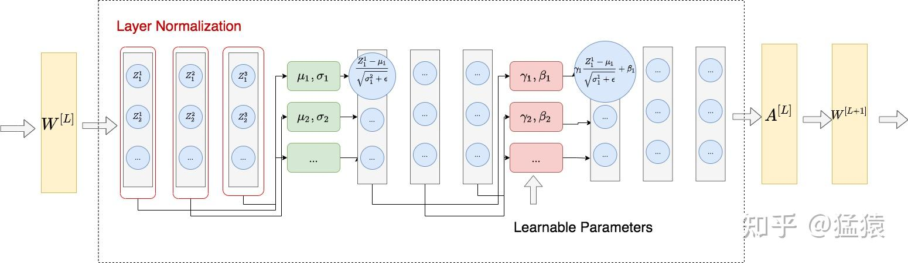


**在图像问题中，LN 是指对一整张图片进行标准化处理，即在一张图片所有 channel 的 pixel 范围内计算均值和方差。而在 NLP 的问题中，LN 是指在一个句子的一个 token 的范围内进行标准化。**

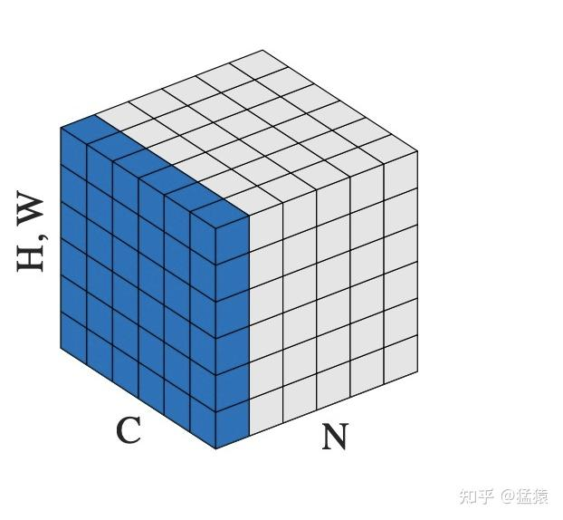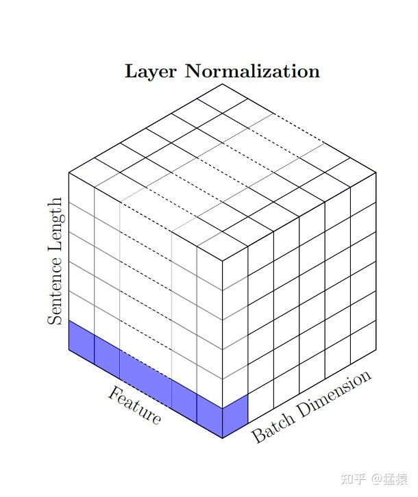 

### 2.3 训练过程和测试过程中的 LN


LN 使得各条数据间在进行标准化的时候相互独立，因此 LN 在训练和测试过程中是一致的。LN 不需要保留训练过程中的 $\mu, \sigma^2$ ，每当来一条数据时，对这条数据的指定范围内单独计算所需统计量即可。


三、Transformer LN 改进方法：Pre-LN
-------------------------------


原始 transformer 中，采用的是 Post-LN，即 LN 在 residule block（图中 addtion）之后。[Xiong et al. (2020)](https://link.zhihu.com/?target=https%3A//arxiv.org/pdf/2002.04745.pdf) 中提出了一种更优 Pre-LN 的架构，即 LN 在 residule block 之前，它能和 Post-LN 达到相同甚至更好的训练结果，同时规避了在训练 Post-LN 中产生的种种问题。两种架构的具体形式可以见下图。

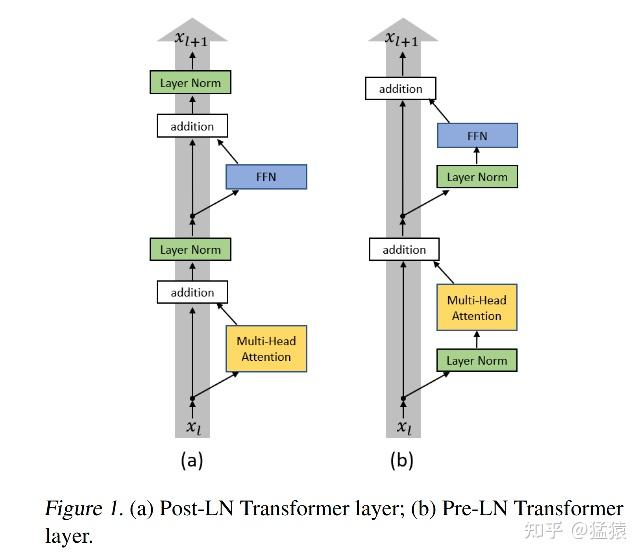


这篇论文通过理论分析和实验的方式，证明了 Pre-LN 相比的 Post-LN 的优势，主要表现在：

*   在 learning rate schedular 上，Pre-LN 不需要采用 warm-up 策略，而 Post-LN 必须要使用 warm-up 策略才可以在数据集上取得较好的 Loss 和 BLEU 结果。
*   在收敛速度上，由于 Pre-LN 不采用 warm-up，其一开始的 learning rate 较 Post-LN 更高，因此它的收敛速度更快。
*   在超参调整上，warm-up 策略带来了两个需要调整的参数： $lr_{max}$ （最大学习率）和 $T_{warmup}$ (warmup 过程的总步数）。这两个参数的调整将会影响到模型最终的效果。而由于 transformer 模型的训练代价是昂贵的，因此多引入超参，也给模型训练带来了一定难度。

> **Quick Tips：**warm-up learning rate，即指在训练初期的一定步数内，缓慢将学习率从 0 升至 $lr_{max}$ ，超过此步数范围则采用 decay learning rate 的策略。在大 batch 数据集的训练中，warm-up learning rate 具有较好的表现。

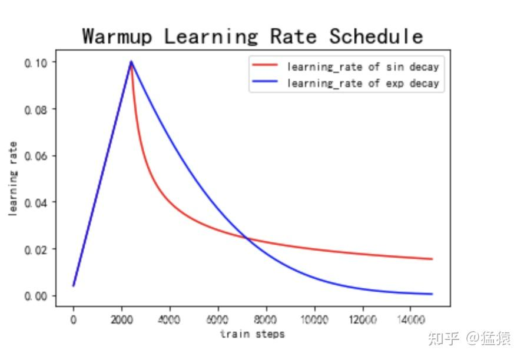


$lr(t) = \frac{t}{T_{warmup}} lr_{max},t\le T_{warmup}$
其中，t 表示当前训练步数， $T_{warmup}$ 表示 warm-up 过程总步数， $lr_{max}$ 表示 learning rate 最高点。

总结看来，Pre-LN 带来的好处，基本都是因为不需要做 warm-up 引起的。而引起这一差异的根本原因是：

*   Post-LN 在输出层的 gradient norm 较大，且越往下层走，gradient norm 呈现下降趋势。这种情况下，在训练初期若采用一个较大的学习率，容易引起模型的震荡。
*   Pre-LN 在输出层的 gradient norm 较小，且其不随层数递增或递减而变动，保持稳定。
*   无论使用何种 Optimzer，不采用 warm-up 的 Post-LN 的效果都不如采用 warm-up 的情况，也不如 Pre-LN。

以三点原因在论文中有详细的理论和实验证明，为了节省篇幅，这里仅贴上实验结果。实验场景为机器翻译，分别在 IWSLT(German to English) 和 WMT(English to German) 这两个数据集上进行。w/o warm-up 表示 without warm-up，w/warm-up 表示 with warm-up， $lr_{max}$ 在 Post-LN 中表示 warm-up 步骤的最高 learning rate，在 Pre-LN 中表示初始化的 learning rate。评价指标分别为 Loss 和 BLEU。这个实验结果证明了上述所说的 Pre-LN 的优势。更细节的实验和内容可以参见论文。

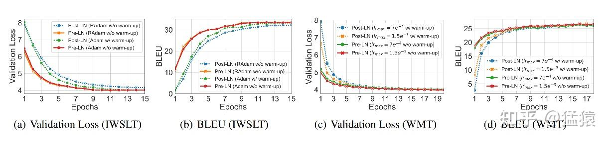

四、参考
----

1.  [https://arxiv.org/pdf/1805.11604.pdf](https://link.zhihu.com/?target=https%3A//arxiv.org/pdf/1805.11604.pdf)
2.  [https://arxiv.org/pdf/1502.03167.pdf](https://link.zhihu.com/?target=https%3A//arxiv.org/pdf/1502.03167.pdf)
3.  [https://arxiv.org/pdf/1607.06450.pdf](https://link.zhihu.com/?target=https%3A//arxiv.org/pdf/1607.06450.pdf)
4.  [https://arxiv.org/pdf/2002.04745.pdf](https://link.zhihu.com/?target=https%3A//arxiv.org/pdf/2002.04745.pdf)
5.  [https://arxiv.org/pdf/2003.07845.pdf](https://link.zhihu.com/?target=https%3A//arxiv.org/pdf/2003.07845.pdf)
6.  [天雨粟：Batch Normalization 原理与实战](https://zhuanlan.zhihu.com/p/34879333)


## 代码

```python
import torch

class MyBatchNorm:
    def __init__(self, hidden_dim, eps=1e-5, momentum=0.1):
        self.eps = eps
        self.momentum = momentum
        self.running_mean = torch.zeros(hidden_dim)  # 训练时更新，测试时使用
        self.running_var = torch.ones(hidden_dim)
        self.gamma = torch.ones(hidden_dim)  # 可训练参数
        self.beta = torch.zeros(hidden_dim)

    def __call__(self, x, training=True):
        # x: (batch_size, seq_len, hidden_dim)
        batch_size, seq_len, hidden_dim = x.shape
        x_reshaped = x.view(-1, hidden_dim)  # (batch_size * seq_len, hidden_dim)

        if training:
            mean = x_reshaped.mean(dim=0)  # 计算每个特征维度的均值 (768,)
            var = x_reshaped.var(dim=0, unbiased=False)  # 计算方差 (768,)
            # 更新全局均值和方差
            self.running_mean = (1 - self.momentum) * self.running_mean + self.momentum * mean
            self.running_var = (1 - self.momentum) * self.running_var + self.momentum * var
        else:
            mean = self.running_mean
            var = self.running_var

        x_norm = (x_reshaped - mean) / torch.sqrt(var + self.eps)  # 归一化
        x_scaled = self.gamma * x_norm + self.beta  # 线性变换
        return x_scaled.view(batch_size, seq_len, hidden_dim)  # 变回原形状

class MyLayerNorm:
    def __init__(self, hidden_dim, eps=1e-5):
        self.eps = eps
        self.gamma = torch.ones(hidden_dim)  # 可训练参数
        self.beta = torch.zeros(hidden_dim)

    def __call__(self, x):
        # x: (batch_size, seq_len, hidden_dim)
        mean = x.mean(dim=-1, keepdim=True)  # 对最后一个维度求均值 (20, 1024, 1)
        var = x.var(dim=-1, keepdim=True, unbiased=False)  # 对最后一个维度求方差 (20, 1024, 1)
        
        x_norm = (x - mean) / torch.sqrt(var + self.eps)  # 归一化
        return self.gamma * x_norm + self.beta  # 线性变换

# 测试
batch_size, seq_len, hidden_dim = 20, 1024, 768
x = torch.randn(batch_size, seq_len, hidden_dim)

bn = MyBatchNorm(hidden_dim)
ln = MyLayerNorm(hidden_dim)

x_bn = bn(x, training=True)
x_ln = ln(x)

print(x_bn.shape)  # (20, 1024, 768)
print(x_ln.shape)  # (20, 1024, 768)

```

BN对非dim的维度归一化，LN对dim维度归一化