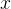
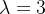
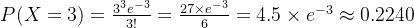
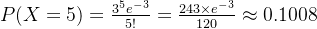
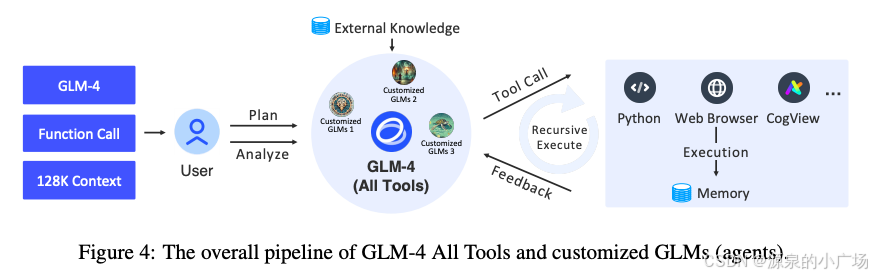

## 背景    

---------

国内的 “百模大战” 以及[开源](https://edu.csdn.net/cloud/pm_summit?utm_source=blogglc&spm=1001.2101.3001.7020)大模型的各类评测榜单令人眼花缭乱，极易让人陷入迷茫。面对如此众多的大模型，我们该如何审视和选择呢？本文将从大模型架构的角度，对常见的开源大模型架构进行汇总与分析。资料来源于公开的[学术论文](https://so.csdn.net/so/search?q=%E5%AD%A6%E6%9C%AF%E8%AE%BA%E6%96%87&spm=1001.2101.3001.7020)、技术报告、企业官网、技术讨论等。经过深入分析可以发现，尽管参与大模型研发的机构众多，但大模型的结构大致可分为几个主要类别：

1. **Encoder-Decoder**
2. **Causal Decoder**
3. **Prefix Decoder**

接下来，我们将对这几个大类模型进行一定的介绍，并由此引出当前业内常用大模型的架构分析。

         首先，有必要介绍一篇文章【1】，提出了统一语言模型预训练概述。模型参数在语言模型目标（即双向语言模型、单向语言模型和序列到序列语言模型）之间共享。使用不同的自注意力掩码来控制每个词符对上下文的访问。


 统一预训练语言模型架构描述        

        输入向量首先被打包成，然后使用一个 L 层的 Transformer 将其编码为不同抽象级别的上下文表示，其中。在每个 Transformer 模块中，多个自注意力头被用来聚合前一层的输出向量。对于第 l 个 Transformer 层，自注意力头的输出通过以下方式计算：


$$
A_l = \text{softmax}\left(\frac{QK^\top}{\sqrt{d_k}} + M\right)V^l
$$
        其中，前一层的输出通过参数矩阵、、 线性投影为查询、键和值的三元组，掩码矩阵决定了一对 tokens 是否可以彼此关注。使用不同的掩码矩阵 M 来控制计算 tokens 的上下文表示时可以关注的上下文，例如双向语言模型的情况，掩码矩阵的元素全为 0，表示所有 tokens 都可以互相访问。

### Encoder-Decoder

输入双向注意力，输出单向注意力。目前，只有少数 LLM 是基于编码器 - 解码器架构构建的 (如 T5)。在输入端（编码器）双向语言模型允许所有词元相互关注。能够编码来自两个方向的上下文信息。如公式所示，自注意力掩码矩阵 M 为全零矩阵，因此每个词元都可以关注输入序列中的所有位置。

### Causal Decoder

 因果解码器架构采用**单向注意力掩码 (从左到右)，以确保每个输入 token 只能关注过去的 token 和它本身**。GPT、LLaMA 系列模型均是基于此架构，也是目前主流的[大模型](https://edu.csdn.net/cloud/pm_summit?utm_source=blogglc&spm=1001.2101.3001.7020)架构。单向语言模型使用从左到右的语言模型目标。以从左到右的语言模型为例，每个词元的表示仅编码其左侧上下文词元及其自身。例如，在预测 “x1 x2 [MASK] x4” 中被遮蔽的词元时，只能使用 x1、x2 和该词元本身。通过对自注意力掩码矩阵使用一个三角矩阵来实现这一点，其中自注意力掩码的上三角部分设为−∞，其余元素设为 0，如上图所示。

### Prefix Decoder

输入双向注意力，输出单向注意力。前缀解码器架构 (又称非因果解码器) **修改了因果解码器的屏蔽机制，使其能够对前缀 tokens 进行双向关注, 并仅对生成的 tokens 进行单向关注(如 GLM)**。对于预测，第一个（源）片段中的标记可以在片段内从两个方向相互关注，而第二个（目标）片段中的标记只能关注目标片段中的左向上下文以及自身和源片段中的所有标记。例如，给定源片段 t1 t2 及其目标片段 t3 t4 t5，将输入 “[SOS] t1 t2 [EOS] t3 t4 t5 [EOS]” 输入到模型中。虽然 t1 和 t2 都可以访问包括 [SOS] 和 [EOS] 在内的前四个标记，但 t4 只能访问前六个标记。

【2】中讨论了大模型的零样本泛化能力，即它们可以执行各种未经过明确训练的任务。然而，最先进的模型所使用的架构和预训练目标有很大差异。在文中对建模选择及其对零样本泛化的影响进行了大规模评估。特别是，对三种模型架构（因果 / 非因果仅解码器和编码器 - 解码器）进行实验，使用两种不同的预训练目标（自回归和掩码语言建模）进行训练。因此对于模型架构的讨论和对零样本泛化能力的影响，可以参考理解，进一步摸清不同的模型架构的特点。


【3】也对这三类大模型架构进行了讨论，可以参考理解。


【17】中给出了当前业内主流大模型的架构配置分析表（L 表示层数，N 表示注意力头数，H 表示隐藏状态的大小），可以看到因果类型模型占据绝对比例，并且结构上很多模型基本一致，甚至参数设置都趋同。（08.29 更新）


## 常见大模型架构

----------

        在第一部分，我们介绍了目前流行的大模型架构主要分为三类：Encoder-Decoder、Causal Decoder、Prefix Decoder，并且对每一类架构做了关键差异的分析。而其中，又以 Decoder-only 架构最为主流，比如当前的 GPT、Llama、Qwen、ChatGLM 等系列模型。因此，接下来，我们主要是针对 Decoder-only 类型的大模型做进一步讨论分析。

### GPT 系列模型结构

        在文章《[GPT 系列预训练模型原理讲解](https://blog.csdn.net/weixin_65514978/article/details/141018827 "GPT系列预训练模型原理讲解")》中，我们已经系统性讲解了 GPT-1、GPT-2、GPT-3、GPT-3.5（InstructGPT）等模型的结构和各自特点。GPT 系列模型，主要涉及：

> *   **输入嵌入（Input Embeddings）**：
>
>     *   将输入文本中的每个词或子词转换为向量表示。包括词嵌入（Word Embedding）和位置嵌入（Position Embedding），后者用于保留序列中的位置信息。
> *   **多头自注意力机制（Multi-head Self-Attention Mechanism）**：
>
>     *   自注意力机制是 Transformer 模型的核心。它允许模型在处理每个词时，关注输入序列中的其他词。多头自注意力机制则通过并行计算多个不同的注意力头，使模型能够关注序列中的不同部分，并捕捉丰富的上下文信息。
> *   **前馈神经网络（Feed-Forward Neural Network, FFN）**：
>
>     *   在每个 Transformer 层中，注意力机制的输出会通过一个全连接的前馈神经网络进行进一步处理。这个网络通常包含两层线性变换和 ReLU 激活函数。
> *   **残差连接和层归一化（Residual Connections and Layer Normalization）**：
>
>     *   每个自注意力模块和前馈网络模块都包含残差连接（即跳跃连接），将输入直接添加到输出以避免梯度消失。层归一化则有助于加快训练速度和提高模型的稳定性。
> *   **层堆叠（Layer Stacking）**：
>
>     *   GPT 模型由多个 Transformer 层堆叠而成，每一层都由一个多头自注意力模块、一个前馈神经网络模块及其相应的残差连接和层归一化组成。层数通常决定了模型的深度和表示能力。
> *   **输出层（Output Layer）**：
>
>     *   最终的隐藏状态会被映射到词汇表大小的向量，用于预测下一个词。这个映射通常通过一个线性层和一个 softmax 函数来实现，以计算每个词的生成概率。
> *   **自回归机制（Autoregressive Mechanism）**：
>
>     *   GPT 采用自回归方式生成文本，这意味着在生成序列中的每个词时，模型只能访问之前生成的词。这种机制通过掩码操作来实现，确保模型在生成第 t 个词时只能看到前 t-1 个词。

        详细内容这里不再赘述，有兴趣可以看下我们之前的[技术分析文章](https://blog.csdn.net/weixin_65514978/article/details/141018827 "技术分析文章")。GPT 系列大模型，是典型的 Decoder-only 模型【4，5，6，7】。

       GPT 模型架构概览         

### Llama 系列模型结构

在《[关于 LLaMA 3.1 405B](https://blog.csdn.net/weixin_65514978/article/details/141339961 "关于LLaMA 3.1 405B")》、《[LLaMA3 结构关键模块分析](https://blog.csdn.net/weixin_65514978/article/details/141356008 "LLaMA3结构关键模块分析")》两篇文章中，我们对 Llama 大模型的架构、关键模块都进行了详细的介绍。Llama 大模型的整体结构与 GPT 基本保持一致，同样涉及上述提到的关键模块内容。但它进一步做了改进，分别为：新增 Pre-Norm、Layer Norm 换成了 RMSNorm、  Self-Attension 采用了 Group Query Attention、Positional Embedding 采用了 ROPE、FFN 结构采用了 SwiGLU。

首先是 Pre-Norm，归一化模块置于注意力和前馈层之前。Pre-norm 可以使每一层的输入分布更加稳定。有助于防止梯度在反向传播过程中出现剧烈的变化，减少梯度消失或爆炸的风险。


其次是位置嵌入不同，Llama 使用旋转位置嵌入。

注意力机制不同，Llama 使用分组多查询注意力。前馈网络（FFN）中的激活函数是 SwiGLU。这些模块的算法原理介绍，可以参考 《[LLaMA3 结构关键模块分析](https://blog.csdn.net/weixin_65514978/article/details/141356008 "LLaMA3结构关键模块分析")》，另外也可以参考讲解视频【8】。

此外，【9】专门讨论了 GPT 模型与 LLama 模型的差异，也可以关注。除了我们讨论的关键模块，还针对具体的分类能力、架构的学习效能做了对比。        

GPT 模型与 Llama 模型架构差异对比

### Qwen2 模型结构

关于 Qwen2-72b 大模型的资料，来自于阿里云官方分享以及其官方[技术报告](https://so.csdn.net/so/search?q=%E6%8A%80%E6%9C%AF%E6%8A%A5%E5%91%8A&spm=1001.2101.3001.7020)【10, 11】。


Qwen2-72b 模型架构图

从模型架构图来看, Qwen2 与 Llama 模型结构一致，使用的关键模块也都一样。可能与 Llama 的差异，主要就是参数量设置以及使用的训练预料不同。【12】中提到通义千问基于 LLaMA 结构调整，其中 tied embeddibg 改为 untied embedding，然后在其他层去除 bias，在 QKV 的注意力机制层加入 bias 。不过这种小范围的参数调整不影响大的层面学习，本质上还是一样的结构。不过在【13】中提到 Llama-3 不能有效地处理多语言提示，暗示 Qwen 可能在提示词的处理方便可能会更优。

以下是 Qwen2 的参数列表。

```
{
  "architectures": [
    "Qwen2ForCausalLM"
  ],
  "attention_dropout": 0.0,
  "bos_token_id": 151643,
  "eos_token_id": 151645,
  "hidden_act": "silu",
  "hidden_size": 8192,
  "initializer_range": 0.02,
  "intermediate_size": 29568,
  "max_position_embeddings": 32768,
  "max_window_layers": 80,
  "model_type": "qwen2",
  "num_attention_heads": 64,
  "num_hidden_layers": 80,
  "num_key_value_heads": 8,
  "rms_norm_eps": 1e-06,
  "rope_theta": 1000000.0,
  "sliding_window": 131072,
  "tie_word_embeddings": false,
  "torch_dtype": "bfloat16",
  "transformers_version": "4.40.1",
  "use_cache": true,
  "use_sliding_window": false,
  "vocab_size": 152064
}
```

### ChatGLM 模型结构

本章节会重点对 GLM 模型进行展开分析讲解，以便更好地理解该模型底层原理。

#### ChatGLM 模型介绍

ChatGLM 是智谱 AI 的大模型。受 GPT-3 的启发，该团队提出了通用语言模型（GLM）架构，其特点是具有自回归空白填充目标，并在 2021 年开源了 GLM-10B 模型。随后推出了 GLM-130B 的千亿参数大模型。与此同时，一个较小的版本 ChatGLM-6B 在同一天开源。2024GLM-4 已通过 GLM-4 API 对外提供服务。 

【14】介绍了在 ChatGLM 中采用和开发的预训练和后训练技术，包括模型架构、预训练数据、对齐等。预训练数据。预训练语料库由来自不同来源的多语言（主要是英语和中文）文档组成，包括网页、维基百科、书籍、代码和论文。数据处理流程主要包括三个阶段：去重、过滤和 tokenization。去重阶段通过去除重复或相似的文档来提高数据多样性，包括精确去重和模糊去重。过滤阶段通过去除包含攻击性语言、占位符文本、源代码等的噪声文档来提高数据质量。tokenization 阶段将文本转换为一系列 token。预训练数据中的 token 数量直接影响模型训练速度。采用字节级字节对编码（BPE）算法分别学习中文和多语言 token，并将它们与 tiktoken 中的 cl100k_base tokenizer 的 token 合并为一个大小为 150,000 的统一词汇表。在最终的训练集中，对不同的来源进行重新加权，以增加像书籍和维基百科这样的高质量和教育性来源的比例。预训练语料库由大约十万亿个 token 组成。数据质量和多样性对于构建有效的大型语言模型非常重要。

GLM 系列大型语言模型基于 Transformer 构建。GLM-130B 采用 DeepNorm 作为层归一化策略，并在 FFN 中使用旋转位置编码（RoPE）以及带有 GeLU 激活函数的门控线性单元。**在 GLM-4 模型中，架构上的关键模块技术与 Llama 有所趋同**：

*   除 QKV 外无偏置：为了提高训练速度，去除所有偏置项，除了注意力层的查询（Query）、键（Key）和值（Value）（QKV）中的偏置。这样做在长度外推方面略有改进。
*   RMSNorm 和 SwiGLU：采用 RMSNorm 和 SwiGLU 分别替代 LayerNorm 和 ReLU。这两种策略具有更好的模型性能。
*   旋转位置嵌入（RoPE）：将 RoPE 扩展为二维形式以适应 GLM 中的二维位置编码。
*   分组查询注意力（GQA）：用分组查询注意力（GQA）替代多头注意力（MHA），以减少推理过程中的 KV 缓存大小。鉴于 GQA 比 MHA 使用更少的参数，增加了 FFN 的参数数量以保持相同的模型大小。

模型的上下文长度从 2K（ChatGLM）扩展到 32K（ChatGLM2 和 ChatGLM3），再到 128K 和 1M（GLM-4）。这种扩展通过上下文扩展 (位置编码扩展和在长文本上的持续训练实现)，还通过长上下文对齐实现，使 GLM-4 能够有效地处理长上下文。预训练为大型语言模型奠定基础，而后训练进一步细化这些模型以与人类偏好对齐，例如理解人类意图、遵循指令和促进多轮对话。对于 GLM-4，对齐主要通过有监督微调（SFT）和基于人类反馈的[强化学习](https://edu.csdn.net/cloud/sd_summit?utm_source=glcblog&spm=1001.2101.3001.7020)（RLHF）实现。不过目前针对 RLHF 对于模型的性能影响在业内有一些争议。对于第一代模型（ChatGLM-6B 和 ChatGLM-130B），提示 - 响应对主要由模型开发人员标注。对于后续模型，对齐数据是内部标注数据和从第三方获取的专有数据的组合，并受到相对严格的质量控制措施。

#### GLM 模型介绍      

GLM (General Language Model) 是一种预训练语言模型，它**结合了自回归和填充缺失的方法**，称为 “Autoregressive Blank Infilling”。该模型的核心思想是通过**一个混合的自回归和填充策略进行预训练，以提高模型在生成和理解文本方面的能力**【15，16】。   


#### 关键特点：

> * **自回归 (Autoregressive) 生成：**
>
>   GLM 结合了自回归的生成方式，即从左到右逐步生成文本。这使得模型能够在生成过程中考虑到上下文信息，从而生成连贯的文本。
>
> * **填充缺失 (Blank Infilling)：**
>
>   **在预训练阶段，模型会随机掩盖一些词或片段，并要求模型填充这些空白。这种方法类似于 BERT 的掩码语言模型，但不同之处在于 GLM 可以在不同位置填充多个连续的空白，而不仅仅是单个词汇**。
>
> * **统一的框架：**
>
>   GLM 的框架将生成和理解结合在一起，既可以用于生成任务（如文本生成）又可以用于理解任务（如问答、文本分类等）。这种统一的预训练目标使得 GLM 在不同的下游任务中表现优异。

##### **GLM Pretraining：**


GLM 预训练过程如下：

> (a) 原始文本为 [x1, x2, x3, x4, x5, x6]，从中选取了两个片段 [x3] 和 [x5, x6]。
>
> (b) 在 Part A 中，将选取的片段替换为 [M]，并在 Part B 中对这些片段进行打乱。[x3] 和 [x5, x6]变成了[x5, x6， x3]
>
> (c) GLM 自回归地生成 Part B。**每个片段在输入时前置 [S]，在输出时后置 [E]**。**二维位置编码用于表示片段间和片段内的位置。**第一位是片段间，你可以看到不同片段的编码不一样，第二个编码是片段内部编码，[S]-x6的编码依次递增。
>
> (d) 自注意力掩码中，灰色区域表示被掩盖部分。Part A 的标记可以互相注意（蓝色框），但不能关注 Part B。Part B 的标记可以关注 Part A 及其在 Part B 中的前置部分（黄色和绿色框分别对应两个片段）。[M] 表示 [MASK]， [S] 表示 [START]， [E] 表示 [END]。

        在这里，给定输入文本 x=[x1, …, xn]，从中采样多个文本片段 {s1, …, sm}，其中每个片段 si 对应于文本 x 中一系列连续的标记 [s_i,1; … ; s_i,li]。每个片段都被替换为一个 [MASK] token，从而形成一个被破坏的文本 。在预测片段中的缺失 token 时，模型可以访问被破坏的文本和之前预测的片段。这些片段的顺序会被随机打乱。形式上，设 **Zm 为长度为 m 的索引序列 [1, 2, , …, m] 的所有可能排列的集合**，而 为，则预训练目标定义为：


        在 Part A 中，将采样的片段替换为 [M]，并在 Part B 中打乱这些片段。输入 x 被分为两部分：Part A 是被破坏的文本 ，Part B 包含被掩盖的片段。GLM 以自回归方式生成 Part B。每个片段在输入时前置 [S]，在输出时后置 [E]。二维位置编码用于表示片段间和片段内的位置。为了实现自回归生成，每个片段在输入和输出时分别填充特殊标记 [START] 和 [END]。**通过这种方式，GLM 自动在一个统一的模型中学习到一个双向编码器（用于 Part A）和一个单向解码器（用于 Part B)。**对该模型有兴趣的话，可以看看原论文。

>                 综上所述，虽然目前各厂家都在力推自己的大模型，但是从模型架构来看，差异并不大，从当前的形势看，可能会越来越统一。反而在输入 token 的长度、输出文本的长度、多任务能力、多模态能力、垂直领域的商用能力等这类功能层面的能力提升，各厂家会逐步形成了自身的壁垒。

3. 参考文献 

--------

【1】[Unified Language Model Pre-training for Natural Language Understanding and Generation](https://arxiv.org/pdf/1905.03197 "Unified Language Model Pre-training for Natural Language Understanding and Generation")

【2】[What Language Model Architecture and Pretraining Objective](https://arxiv.org/pdf/2204.05832 "What Language Model Architecture and Pretraining Objective") Work Best for Zero-Shot Generalization?

【3】[Exploring Architectures and Configurations for Large Language Models](https://www.labellerr.com/blog/exploring-architectures-and-configurations-for-large-language-models-llms/ "Exploring Architectures and Configurations for Large Language Models")

【4】[gpt-4-research](https://openai.com/index/gpt-4-research/ "gpt-4-research")

【5】[A brief on GPT-2 and GPT-3 models](https://mvschamanth.medium.com/a-brief-on-gpt-2-and-gpt-3-models-f4889330328e "A brief on GPT-2 and GPT-3 models")

【6】[The GPT-3 Architecture](https://dugas.ch/artificial_curiosity/GPT_architecture.html "The GPT-3 Architecture")

【7】[The Transformer architecture of GPT models](https://bea.stollnitz.com/blog/gpt-transformer/ "The Transformer architecture of GPT models")

 【8】[LLaMA explained](https://www.youtube.com/watch?v=Mn_9W1nCFLo "LLaMA explained"): KV-Cache, Rotary Positional Embedding, RMS Norm, Grouped Query Attention, SwiGLU

【9】[Towards Optimal NLP Solutions: Analyzing GPT and LLaMA-2 Models](https://www.researchgate.net/publication/381112819_Towards_Optimal_NLP_Solutions_Analyzing_GPT_and_LLaMA-2_Models_Across_Model_Scale_Dataset_Size_and_Task_Diversity?_tp=eyJjb250ZXh0Ijp7ImZpcnN0UGFnZSI6Il9kaXJlY3QiLCJwYWdlIjoiX2RpcmVjdCJ9fQ "Towards Optimal NLP Solutions: Analyzing GPT and LLaMA-2 Models")

【10】[QWEN TECHNICAL REPORT](https://arxiv.org/pdf/2309.16609 "QWEN TECHNICAL REPORT")    

【11】[预训练一个 72b 模型需要多久（阿里云开发者公众号）](https://mp.weixin.qq.com/s/E0OIgufVW8dm-fRhlRoA6A "预训练一个72b模型需要多久（阿里云开发者公众号）")

【12】[LLM 大语言模型 - ChatGPT、LLaMA、ChatGLM、文心一言、通义千问](https://www.cnblogs.com/yqw0710/p/18323155 "LLM大语言模型-ChatGPT、LLaMA、ChatGLM、文心一言、通义千问")

【13】[Hello Qwen2](https://qwenlm.github.io/blog/qwen2/ "Hello Qwen2")

【14】[ChatGLM: A Family of Large Language Models from GLM-130B to GLM-4 All Tools](https://arxiv.org/html/2406.12793v1 "ChatGLM: A Family of Large Language Models from GLM-130B to GLM-4 All Tools")

【15】[GLM: General Language Model Pretraining with Autoregressive Blank Infilling](https://sh-tsang.medium.com/review-glm-general-language-model-pretraining-with-autoregressive-blank-infilling-c217bc91b7d5 "GLM: General Language Model Pretraining with Autoregressive Blank Infilling")

【16】[acl-GLM: General Language Model Pretraining with Autoregressive Blank Infilling](https://aclanthology.org/2022.acl-long.26.pdf "acl-GLM: General Language Model Pretraining with Autoregressive Blank Infilling")

【17】[大语言模型 - RUC AI BOX](http://aibox.ruc.edu.cn/zws/index.htm "大语言模型-RUC AI BOX")


# GLM介绍

-------

        我们曾在《[通用大模型架构分类及技术统一化](https://blog.csdn.net/weixin_65514978/article/details/141595911 "通用大模型架构分类及技术统一化")》一文中，引出过对于 [GLM](https://so.csdn.net/so/search?q=GLM&spm=1001.2101.3001.7020)（General Language Model）【1】模型结构的讨论。该基于自回归式空白填充的通用语言模型，是为了能同时应对自然语言理解（NLU）、无条件生成和条件生成。GLM 通过引入二维位置编码并允许以任意顺序预测片段，对空白填充预训练进行了改进。同时，GLM 可以通过调整空白的数量和长度，适应不同类型的任务。


        上图为 GLM 示意图，将文本片段（绿色部分，连续的 token 片段（类似于自编码思想））置为空白，并以自回归方式生成这些片段。

        事实上，空白填充已被 T5【2】用于文本到文本的预训练，不过 GLM 提出了两项改进：**片段乱序（span shuffling）和二维位置编码（2D positional encoding）**。另外，受到 Pattern-Exploiting Training（PET）【3】的启发，GLM 将 NLU 任务重新表述为手工设计的 cloze 问题，以模仿人类语言的形式，GLM 能够通过自回归式空白填充自然处理包含多个 token 的答案。更进一步，通过调整空白片段的数量和长度，展示了自回归式空白填充目标可以预训练[语言模型](https://so.csdn.net/so/search?q=%E8%AF%AD%E8%A8%80%E6%A8%A1%E5%9E%8B&spm=1001.2101.3001.7020)以支持条件生成和无条件生成。通过对多种预训练目标的多任务学习，一个单一的 GLM 能够在 NLU 和（条件生成与无条件生成）文本生成任务中都表现出色。实验表明，与单一任务基线相比，采用多任务预训练的 GLM 在 NLU、条件文本生成和语言建模任务上均有全面提升，并通过参数共享进一步增强了性能表现。

        关于 PET，这里举一个例子帮助理解：


 PET 基本思想为填空式任务重新表述。PET 通过将传统的 NLP 任务（如文本分类）重新表述为填空问题来匹配预训练语言模型的能力。具体步骤如下：

> *   **设计模式（Pattern）**：为每个任务定义一个模板，将任务转化为类似人类语言的问题。例如：
>     *   文本分类任务：给定一个句子，判断其情感：
>         *   原始输入：`The movie was fantastic!`
>         *   模板：`The movie was fantastic! It was [MASK].`
>         *   标签映射：`great` 对应积极情感，`terrible` 对应消极情感。
> *   **填空预测**：利用预训练语言模型预测 `[MASK]` 的值。
> *   **标签映射（Verbalizer）**：将模型输出的 token 映射到具体的任务标签。例如，`great` -> 积极，`terrible` -> 消极。

        这种方法充分利用了语言模型的上下文建模能力，使模型更容易从少量数据中捕捉到语义信息。

        有了上述背景信息，我们再来看下 glm 模型系列的发展时间线【4】。


## GLM 预训练框架

------------

        GLM 是基于自回归空白填充目标的通用预训练框架。GLM 将自然语言理解（NLU）任务形式化为包含任务描述的填空问题，这些问题可以通过自回归生成进行回答。

### 2.1 预训练目标

#### 2.1.1 自回归空白填充

        GLM 通过优化自回归空白填充目标进行训练。给定输入文本 $x = [x_1, \dots, x_n]$，随机抽取多个文本片段$\{s_1, \dots, s_m\}$，其中每个片段 $s_i$对应于$x$中的一系列连续的 token $[s_{i,1}, \dots, s_{i,l_i}]$。每个片段被替换为单个 [MASK] token，形成一个损坏文本$x_{corrupt}$。模型通过自回归方式预测缺失的 token，在预测一个片段中的缺失 token 时，模型可以访问损坏文本以及之前预测的片段。为了充分捕捉不同片段之间的相互依赖关系，随机打乱片段的顺序，这类似于排列语言模型【5】。形式化地，设 $Z_m$ 为长度为 m 的索引序列 $[1, 2, \dots, m]$ 的所有可能排列集合，$s_{z<i} $  为 ，$[s_{z_1}, \dots, s_{z_{i-1}}]$ 将预训练目标定义为：

$$
\max_\theta \mathbb{E}_{z \sim Z_m} \left[ \sum_{i=1}^{m} \log p_\theta(s_{z_i} | x_{\text{corrupt}}, s_{z<i}) \right]
$$
        按照从左到右的顺序生成每个空白中的 token，即生成片段 $s_i$ 的概率可以分解为：

$$
p_\theta(s_i | x_{\text{corrupt}}, s_{z<i}) = \prod_{j=1}^{l_i} p(s_{i,j} | x_{\text{corrupt}}, s_{z<i}, s_i,_{<j})
$$
        通过以下描述实现自回归空白填充目标。输入  被分为两部分：A 部分是损坏文本 ，B 部分包含被掩码的片段。A 部分的 token 可以相互注意，但不能关注 B 部分中的任何 token；B 部分的 token 可以关注 A 和 B 部分中的前置 token，但不能关注 B 中的后续 token。为了启用自回归生成，每个片段会通过特殊的 [START] 和 [END] token 填充，分别用于输入和输出。通过这种方式，模型在统一模型中自动学习到双向编码器（用于部分 A）和单向解码器（用于部分 B）。GLM 的实现如下图所示。        

        从泊松分布中随机抽取长度为的片段长度。反复抽取新片段，直到至少 15% 的原始 token 被掩码，15% 的比例对下游 NLU 任务表现至关重要。

        这里关于几个技术点展开说一下：

**（1）排列语言模型**

        排列语言模型（Permutation Language Model）是一种改进的自回归语言模型，通过对输入文本进行排列来增强模型的表达能力，尤其是在处理语言建模和生成任务时。该模型的核心思想是，**传统的自回归语言模型通常按顺序预测每个单词或标记，而排列语言模型通过对标记的顺序进行随机化排列，来捕捉输入序列中不同部分之间的依赖关系**。

> *   **排列顺序**：排列语言模型的一个核心特征是，通过对输入序列中的标记进行随机排列，来生成不同的序列顺序。每次训练时，输入的标记序列的顺序都被打乱，从而模拟各种可能的语境，避免模型仅仅捕捉到线性顺序的依赖关系。
>
> *   **增强依赖关系捕获**：传统的语言模型（如 GPT）倾向于捕捉文本中的顺序依赖性，而排列语言模型通过不同顺序的排列，增强模型对非线性依赖关系的理解。这样做能够提高模型的泛化能力。
>
> *   **适应不同任务**：排列语言模型可以适应多种任务，包括文本生成、语言理解、分类等。这是因为在训练过程中，模型学会了在不同的输入顺序下进行有效预测，而不是局限于固定的顺序。

        但是，由于需要处理所有可能的排列，排列语言模型通常比传统的[自回归模型](https://so.csdn.net/so/search?q=%E8%87%AA%E5%9B%9E%E5%BD%92%E6%A8%A1%E5%9E%8B&spm=1001.2101.3001.7020)需要更多的计算资源，尤其在训练阶段。此外尽管排列语言模型增强了对上下文的捕捉，但它可能在某些任务上没有像 GPT 那样自然地捕捉序列的顺序信息。

**（2）泊松分布采样**

        在 GLM 中，采样是基于泊松分布的，主要与其目标 “有效地训练和建模文本中空缺部分的填充（blank infilling）任务” 相关。这里的核心思想是通过泊松分布来控制被遮掩（masked）的文本片段的长度，而不是直接给定固定长度的片段。

        泊松分布描述的是在一个固定时间间隔或空间区域内，某个事件发生的次数的概率分布。它的概率质量函数（PMF）为：


        其中，是事件的平均发生次数（期望值），k 是实际观察到的事件发生次数。

        在文本处理中，文本片段（如句子或短语）的长度具有自然的变化和随机性。使用泊松分布采样可以在不同的训练实例中产生不同长度的遮掩片段，从而使模型在训练时能够应对不同长度的缺失部分，提高泛化能力。泊松分布的参数（均值）控制了每个采样的片段的平均长度。在 GLM 中，λ=3 作为一个超参数来定义，意味着大约 3 个单词的片段会被遮掩。这种分布在遮掩的长度上引入了一定的随机性，使得模型不仅学习如何填补固定长度的空白，还能适应不同长度的缺失部分。泊松分布通常不产生极端长的片段，而是更多地产生中等长度的片段。这有助于避免训练过程中出现过长或过短的片段，既能保持足够的上下文信息，又能避免遮掩的内容太少，导致模型无法有效地学习。

        假设：泊松分布参数为 λ=3，另假设我们需要知道片段长度为 0 到 5 的概率。

        计算各个长度（0 到 5）的概率：

> **长度为 0（即没有遮掩）**：
>
> 
>
> **长度为 1**：
>
> 
>
> **长度为 2**：
>
> 
>
> **长度为 3**：
>
> 
>
> **长度为 4**：
>
> 
>
> **长度为 5**：
>
> 

        另外提到概率质量函数，这里顺便说一下几个名词的区别：

#### 2.1.2 多任务预训练

        GLM 对短片段进行掩码，适合用于 NLU 任务。然而希望预训练一个可以同时处理 NLU 和文本生成任务的模型。因此引入一种多任务预训练方案，其中生成更长文本的第二个目标与空白填充目标共同优化。考虑以下两种目标：

> *   **文档级别**：抽取一个单一片段，片段长度从原始长度的 50%–100% 之间的均匀分布中抽取。该目标旨在生成较长文本。
> *   **句子级别**：限制掩码片段必须是完整的句子。多个片段（句子）被抽取以覆盖原始文本的 15%。该目标旨在处理 seq2seq 任务，这些任务的预测通常是完整的句子或段落。

        这两个新目标与 2.1.1 中原始目标的定义相同。唯一的不同是片段的数量和长度。

### 2.2 模型架构

        GLM 使用单一 Transformer，并对架构进行了几项修改：

**(1) 重新安排了层归一化和残差连接的顺序，避免大模型发生数值错误【6】。**

        在 GLM 中，重新安排层归一化（Layer Normalization）和残差连接（Residual Connection）的顺序，是为了避免在训练大规模语言模型时出现数值不稳定的问题，也被【6】证明是解决训练过程中数值错误的一种有效方法。


        层归一化是一种标准化技术，通常用于神经网络的每一层，用来调整输入数据的分布，使得数据的均值为 0，方差为 1。有助于加速模型的收敛，并减少训练过程中的数值不稳定性。在标准化之后，网络的每一层将更稳定地进行训练，避免梯度爆炸或梯度消失的问题。

        残差连接指的是在神经网络的每一层中，将输入直接加到输出上。能够缓解深层网络的训练困难，避免梯度消失问题。残差连接让信息在网络中更直接地流动，有助于深层网络的训练。

        在标准的 Transformer 模型中，层归一化通常放在残差连接之前。即：


> *   输入通过残差连接直接加到输出。
> *   然后对结果进行 层归一化。

        然而，对于大模型，尤其是在训练时使用的参数非常多（比如亿级甚至百亿级参数时），传统的顺序（残差连接 → 层归一化）会在训练过程中引发数值不稳定或梯度消失 / 爆炸问题。因为大模型可能会在深层计算时导致数值的精度丢失或溢出，特别是在反向传播梯度的传递过程中。

        在 GLM 中，层归一化和残差连接的顺序被反过来排列，即先进行层归一化，然后再应用残差连接。这一调整的目的是通过将标准化步骤提前来保持数值的稳定性。

**（2）使用一个线性层进行输出 token 的预测；**

**（3）将 ReLU 激活函数替换为 GeLU 激活函数。**

#### 2.2.1 2D 位置编码

        自回归空白填充任务的一个挑战是如何编码位置信息。Transformer 依赖位置编码来注入 token 的绝对和相对位置。【1】提出了 2D 位置编码来解决这个问题。具体来说，每个 token 使用两个位置 id 进行编码。第一个位置 id 表示在损坏文本​ 中的位置。对于被掩码的片段，它是对应的 [MASK] token 的位置。第二个位置 id 表示片段内的位置。对于 A 部分的 token，其第二个位置 id 为 0；对于 B 部分的 token，其第二个位置 id 范围从 1 到片段的长度。两个位置 id 通过可学习的嵌入表映射到两个向量，这两个向量被加到输入 token 的嵌入中。编码方法确保模型在重建时不会意识到掩码片段的长度，设计适应下游任务，因为生成文本的长度通常事先是未知的。

### 2.3 GLM 微调

        对于下游的 NLU 任务，线性分类器将预训练模型生成的序列或 token 表示作为输入，并预测正确的标签。这与生成预训练任务不同，导致预训练和微调之间存在不一致。因此将 NLU 分类任务重新表述为空白填充的生成任务，参考了 PET【3】。具体来说，给定一个标注示例 (x,y)，通过包含单个掩码 token 的模式将输入文本 x 转换为填空问题 c(x)。该模式以自然语言编写，以表示任务的语义。例如，情感分类任务可以表述为：“{SENTENCE}。它真的很 [MASK]”。候选标签 y∈Y 也被映射为填空问题的答案，称为 verbalizer v(y)。在情感分类中，标签 “positive” 和“negative”分别映射为 “good” 和“bad”。给定 x 的条件概率为：

  c(x))}.png)

        其中 Y 是标签集合。因此，句子为正面或负面的概率与预测 “good” 或“bad”填入空白的概率成正比。


        然后，使用交叉熵损失对 GLM 进行微调。对于文本生成任务，给定的上下文构成输入的 A 部分，最后附加一个掩码 token。模型自回归地生成 B 部分的文本。可以直接将预训练的 GLM 应用于无条件生成，或在下游条件生成任务上对其进行微调。

### 2.4 GLM-4 All Tools 模型能力

        GLM-4 All Tools 模型能更好地理解用户意图，并能够自动选择最合适的工具来完成任务【4】。如可以通过网页浏览器以多轮方式访问在线信息，使用 Python 解释器解决数学问题，利用文本到图像模型生成图像，并调用用户定义的函数。下图展示了一个示例，说明 GLM-4 All Tools 如何通过网页浏览器和 Python 解释器来解决用户的查询 “搜索 2000 到 2023 年的全球人口数据，然后计算年均增长率”。





## GLM 以及 ChatGLM 的技术演进

-----------------------

首先来看 GLM 系列与 ChatGLM 的对应关系，以及能力提升点。


### 3.1 GLM-4 关键点

#### 3.1.1 预训练数据

        预训练语料库由多语言（主要是英语和中文）文档组成，来源包括网页、维基百科、书籍、代码和研究论文。数据处理流程主要包括三个阶段：去重、过滤和分词。去重阶段通过去除重复或相似文档来提高数据多样性，包括精确去重和模糊去重。网页过滤阶段通过去除包含攻击性语言、占位符文本、源代码等的噪声文档来提高数据质量。分词阶段将文本转换为标记序列，以便进一步处理。预训练数据中的 token 数量直接影响模型的训练速度。采用了字节对编码（BPE）算法在字节级别上分别学习中文和多语言标记，并将其与 tiktoken 中的 cl100k_base 分词器的标记合并，形成一个大小为 150,000 的统一词汇表。在最终的训练集里，对不同的数据来源进行了重新加权，以增加高质量和教育性资源（如书籍和维基百科）的重要性。预训练语料库包含了约十万亿个标记。在 ChatGLM4 中，数据质量和多样性有助于构建有效的大模型。

#### **3.1.2 架构**

        GLM 系列 LLM 是基于 Transformer 构建的。GLM-130B 采用了 DeepNorm 作为层归一化策略，使用旋转位置编码（RoPE）以及带 GeLU 激活函数的门控线性单元（GLU），并在前馈网络（FFN）中使用它们。探索过程中研究了不同的策略以提升模型性能和推理效率。最近的 GLM-4 模型采用了以下架构设计选择：

> *   **除 QKV 外不使用偏置项**：为了提高训练速度，移除了除了注意力层中查询（Q）、键（K）和值（V）矩阵的偏置项之外的所有偏置项。这样做发现在长度推断方面有轻微的改进。
> *   **RMSNorm 和 SwiGLU**：采用了 RMSNorm 替代了 LayerNorm，采用 SwiGLU 替代了 ReLU，这两种策略提高了模型性能。
> *   **旋转位置嵌入（RoPE）**：将 RoPE 扩展为二维形式，以适应 GLM 中的 2D 位置编码。
> *   **群体查询注意力（GQA）**：用群体查询注意力（GQA）替代了多头注意力（MHA），从而减少了推理过程中的 KV 缓存大小。由于 GQA 使用的参数比 MHA 少，增加了 FFN 参数数量以保持相同的模型大小。

        模型的上下文长度从 2K（ChatGLM），到 32K（ChatGLM2 和 ChatGLM3），再到 128K 和 1M（GLM-4）。这些扩展不仅通过上下文扩展—位置编码扩展和长文本的持续训练来实现，还通过长上下文对齐，使 GLM-4 能够有效处理非常长的上下文【7】。


#### 3.1.3 对齐

        预训练为 LLM 奠定了基础，而后训练则进一步优化这些模型，使其与人类偏好对齐，例如理解人类意图、遵循指令并支持多轮对话。对于 GLM-4，主要通过监督微调（SFT）和强化学习人类反馈（RLHF）来实现对齐。在 SFT 中，真实的人工提示和交互，而非基于模板或模型生成的响应，对于对齐质量有帮助。虽然 SFT 在很大程度上使基础模型与人类偏好对齐，但 RLHF 可以进一步帮助解决响应拒绝、安全性、生成的双语标记混合以及多轮一致性等问题。对于第一代模型（ChatGLM-6B 和 ChatGLM-130B），提示 - 响应对大多由模型开发人员注释。对于后续的模型，对齐数据则是内部注释和通过第三方获得的专有数据的结合，且这些数据经过严格的质量控制。

**扩展阅读：**

《[全方位解读大模型](https://blog.csdn.net/weixin_65514978/article/details/143043450 "全方位解读大模型")》

4. 参考材料

-------

【1】[GLM: General Language Model Pretraining with Autoregressive Blank Infilling](https://arxiv.org/pdf/2103.10360 "GLM: General Language Model Pretraining with Autoregressive Blank Infilling")

【2】[Exploring the Limits of Transfer Learning with a Unified Text-to-Text Transformer](https://arxiv.org/pdf/1910.10683 "Exploring the Limits of Transfer Learning with a Unified Text-to-Text Transformer")

【3】[Exploiting Cloze Questions for Few Shot Text Classification and Natural Language](https://arxiv.org/pdf/2001.07676 "Exploiting Cloze Questions for Few Shot Text Classification and Natural Language") Inference

【4】[ChatGLM: A Family of Large Language Models from GLM-130B to GLM-4 All Tools](https://arxiv.org/pdf/2406.12793 "ChatGLM: A Family of Large Language Models from GLM-130B to GLM-4 All Tools")

【5】[XLNet: Generalized Autoregressive Pretraining for Language Understanding](https://papers.nips.cc/paper/2019/file/dc6a7e655d7e5840e66733e9ee67cc69-Paper.pdf "XLNet: Generalized Autoregressive Pretraining for Language Understanding")

【6】[Megatron-LM: Training Multi-Billion Parameter Language Models Using Model Parallelism](https://arxiv.org/pdf/1909.08053 "Megatron-LM: Training Multi-Billion Parameter Language Models Using Model Parallelism")

【7】[LongAlign: A Recipe for Long Context Alignment of Large Language Models](https://arxiv.org/pdf/2401.18058 "LongAlign: A Recipe for Long Context Alignment of Large Language Models")