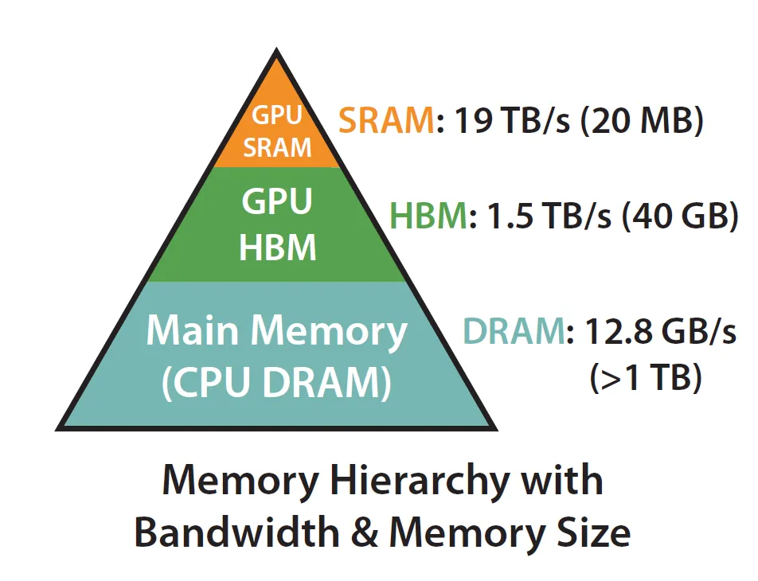
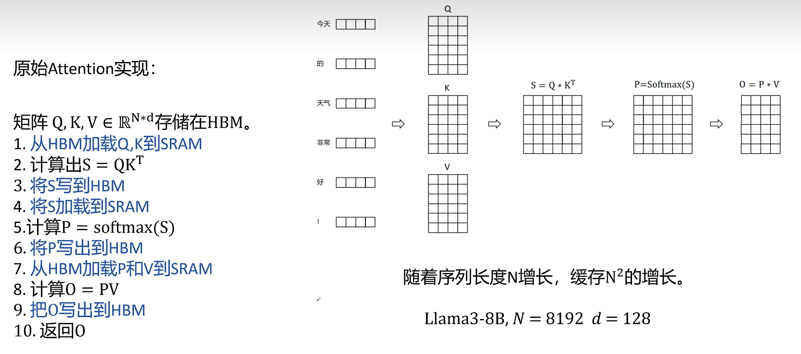
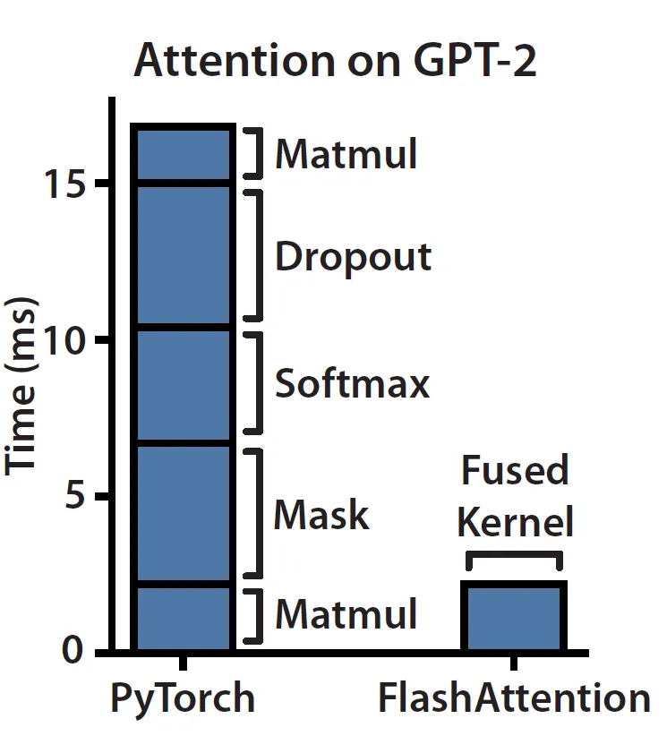
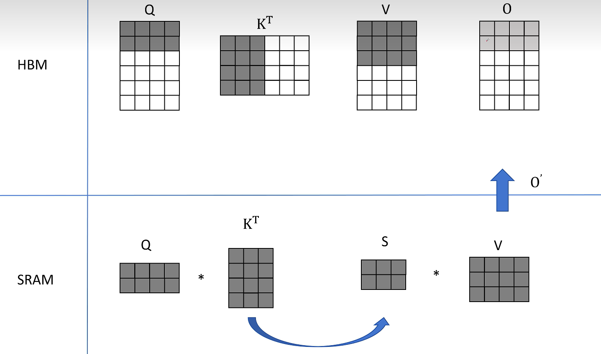
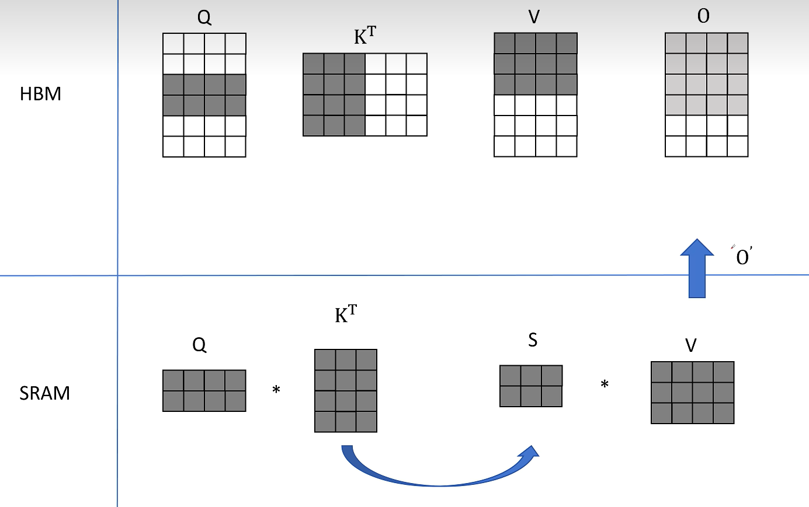
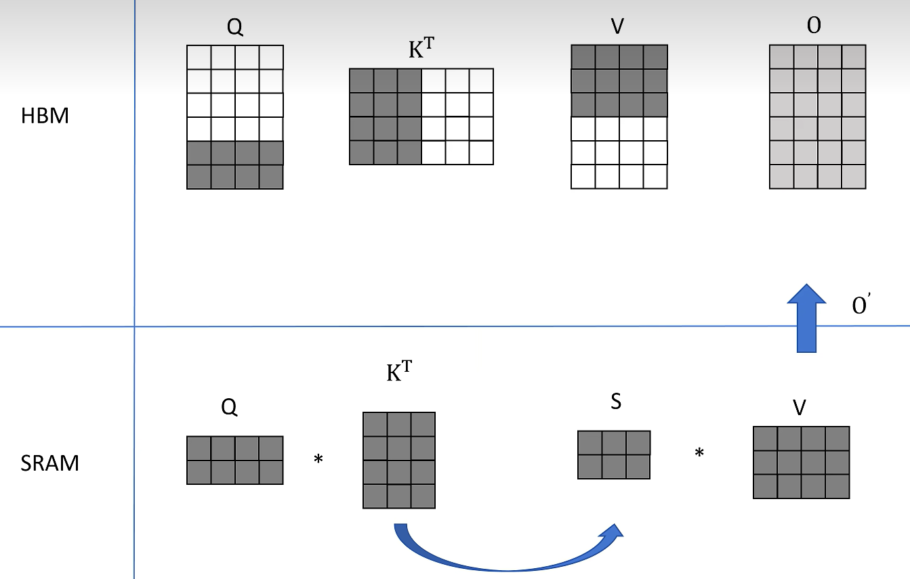
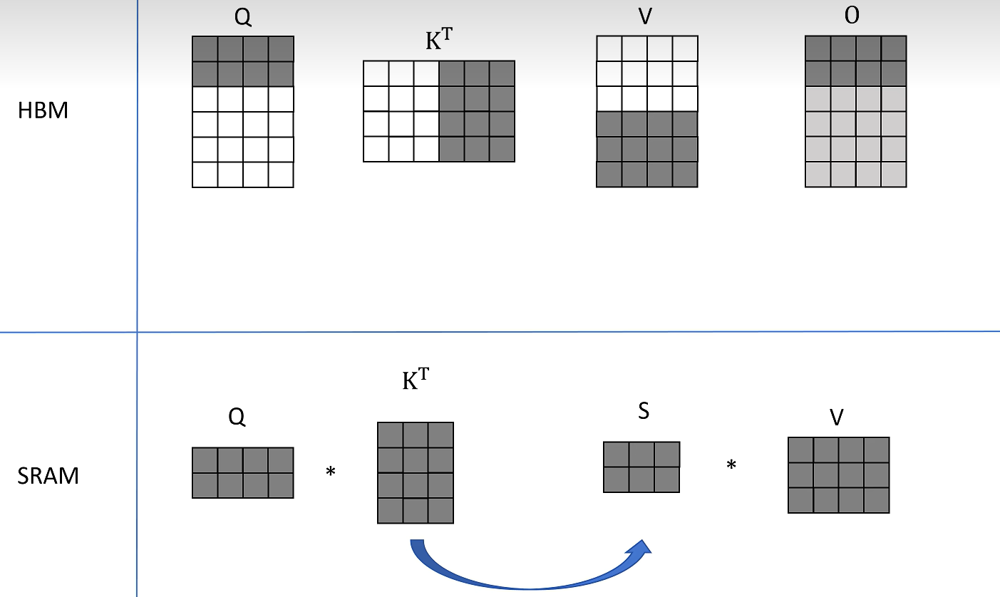
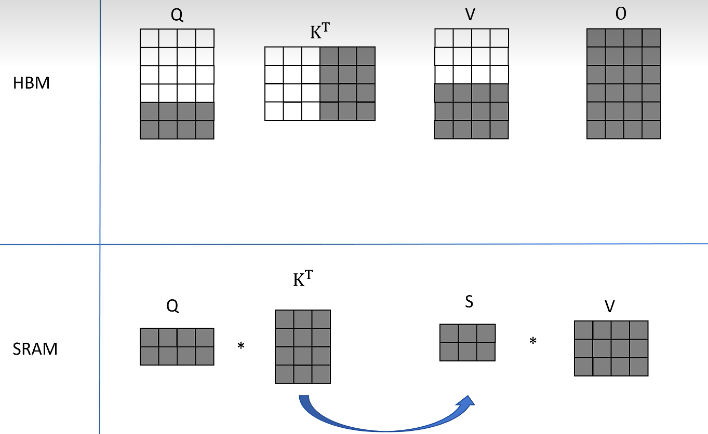
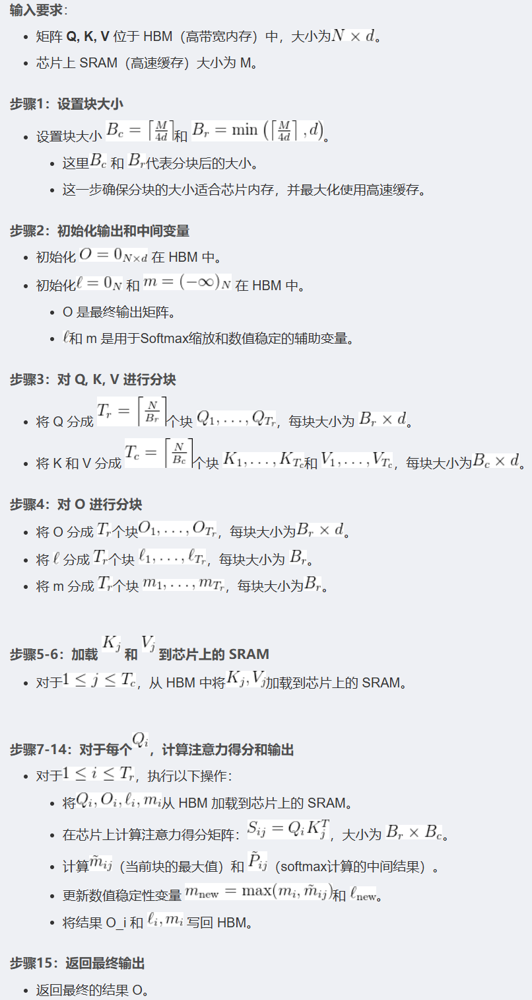

## FlashAttention

GPU 的内存可以分为 HBM 和 SRAM 两部分。片上 SRAM 比 HBM 快一个数量级，但容量要小很多个数量级。**在 GPU 运算之前，数据和模型先从 CPU 的内存（上图中的 DRAM）移动到 GPU 的 HBM，然后再从 HBM 移动到 GPU 的 SRAM，CUDA kernel 在 SRAM 中对这些数据进行运算，运算完毕后将运算结果再从 SRAM 移动到 HBM**。

原始的attention的计算过程上图所示，中间涉及到了很多临时变量的读写，非常耗时。

众所周知，对于科学计算程序而言，按照算数运算和内存读取各自所花的时间比例，

科学计算通常分为**计算密集型 (compute-bound) 和内存密集型 (memory-bound) 两类**。

**计算密集型运算**的时间瓶颈主要在于算数计算，比如大型矩阵的相乘等，

**内存密集型运算**的时间瓶颈主要在于内存的读写时间，比如批归一化、层归一化等等。

**Attention**计算过程主要是**memory-bound**，因此需要消耗很多数据读取的时间。

对于**memory-bound**的优化一般都是进行Fusion融合操作，不对中间结果缓存，减少HBM的访问。

因此FlashAttention的思路就是减少IO量，目标是避免Attention Matrix从HBM的读写。

**FlashAttention**基本上归结为两个主要思想：

- 通过分块计算，融合多个操作，减少中间结果缓存
- 反向传播时，重新计算中间结果。

下面举个例子简单说明下如何进行分块计算

在例子中，我们不考虑softmax操作，仅仅考虑$Q \cdot K^{T} \cdot V$这个矩阵操作

Attention分块计算，首先取$Q (2\times4)$的前两行，$K^{T}(4\times3)$的前三列，计算得到$S(2\times3)$然后再和$V(3\times4)$的前三行相乘得到$O(2\times4)$的前2行。

然后同样的操作，不过取得是$Q (2\times4)$的中间两行，得到了$O(2\times4)$的中间两行。

取$Q (2\times4)$的最后两行，得到了$O(2\times4)$的最后两行的结果。

接着我们取$K^{T}(4\times3)$的后三列，$V(3\times4)$的后三行，分别再次和$Q$的分块结果计算，相加后得到最终的$O $。

算法流程图如下：

接着我们对softmax操作进行分块计算，softmax公式如下所示

$$
\operatorname{softmax}\left(\left\{x_{1}, \ldots, x_{N}\right\}\right)=\left\{\frac{e^{x_{i}}}{\sum_{j=1}^{N} e^{x_{j}}}\right\}_{i=1}^{N}
$$

FP16下，最大表示数为65536，但是如果使用softmax，$e^{12}=162754$大于可以表示的最大的数，会出现数值溢出的问题。

因此我们使用safe softmax方法，找到$x_i$中的最大值$m=max(x_i)$

计算：

$$
\operatorname{softmax}\left(\left\{x_{1}, \ldots, x_{N}\right\}\right)=\left\{\frac{e^{x_{i}} / e^{m}}{\sum_{j=1}^{N} e^{x_{j}} / e^{m}}\right\}_{i=1}^{N}=\left\{\frac{e^{x_{i}-m}}{\sum_{j=1}^{N} e^{x_{j}-m}}\right\}_{i=1}^{N}
$$

下面进行分块计算操作

假设现在有$x=[x_1,...,x_N]$，通过$m(x)=max(x)$得到$x$中的最大值，设定$p(x)=\left[e^{x_{1}-m(x)}, \ldots, e^{x_{N}-m(x)}\right]$为经过最大值约束后的结果，$l(x)=\sum_{i} p(x)_{i}$为所有$p(x)$的和，因此改写以后的公式为

$$
\operatorname{softmax}(x)=\frac{p(x)}{l(x)}
$$

有$x=[x_1,..,x_N,..x_{2N}]$,分成两块，表示为$x^1=[x_1,...,x_N]$、$x^2=[x_{N+1},...,x_{2N}]$

分别计算$m(x^1)、p(x^1)、l(x^1)$和$m(x^2)、p(x^2)、l(x^2)$

然后计算出所有块的最大值$m(x)=\max \left(m\left(x^{1}\right), \quad m\left(x^{2}\right)\right)$

接着对所有的$p(x)$进行最大值约束

$$
p(x)=\left[e^{m\left(x^{1}\right)-m(x)} p\left(x^{1}\right), e^{m\left(x^{2}\right)-m(x)} p\left(x^{2}\right)\right]
$$

假设$m(x)=m(x^2)$那么$e^{m\left(x^{2}\right)-m(x)}=1$，因此$p(x^2)$没有任何变化，对于第二块的数据来说就经历了一次最大值约束$p(x^2)=1*p(x^2)=e^{x^2}/e^{m(x)}=e^{x^2-m(x)}$，但是对于$p(x^1)$来说，又添加了$e^{m\left(x^{1}\right)-m(x)}$这个权重，因此$p(x^1)=e^{m(x^1)}/e^{m(x)}*e^{x^1}/e^{m(x^1)}=e^{x^1}/e^{m(x)}=e^{x^1-m(x)}$。

通过上述公式我们对所有分块都进行了最大值约束，然后得到$p(x)$的和

$$
l(x)=e^{m\left(x^{1}\right)-m(x)} l\left(x^{1}\right)+e^{m\left(x^{2}\right)-m(x)} l\left(x^{2}\right)
$$

最后计算softmax

$$
\operatorname{softmax}(x)=\frac{p(x)}{l(x)}
$$

## 参考
[https://fancyerii.github.io/2023/10/23/flashattention/](https://fancyerii.github.io/2023/10/23/flashattention/)

[Flash Attention 为什么那么快？原理讲解_哔哩哔哩_bilibili](https://www.bilibili.com/video/BV1UT421k7rA/?buvid=XUBEC6DB8F7B609F3EF5529B348C21ACFBE75&from_spmid=search.search-result.0.0&is_story_h5=false&mid=14KIPRGgPH2WHmfjGAwEFg==&plat_id=116&share_from=ugc&share_medium=android&share_plat=android&share_session_id=b981fc2f-ca86-4208-961f-07cda9984672&share_source=WEIXIN&share_source=weixin&share_tag=s_i&spmid=united.player-video-detail.0.0&timestamp=1737017157&unique_k=QzUTe2p&up_id=18235884&vd_source=df8edb354538b32afc637d2d9df59b04)

