# GPT系列预训练模型原理讲解

## 背景简述

GPT的全称是Generative Pre-Trained Transformer，以Transformer为基础模型（可以看Transformer的原理解析），先后迭代了GPT-1，GPT-2，GPT-3、GPT3.5(InstructGPT)、GPT4。参考技术细节的公开程度，本篇文章主要关注前四个版本，重点将会讲解前四种模型的演变趋势和各自特点。基于文本预训练的GPT-1，GPT-2，GPT-3三代模型采用的是同种架构，即以Transformer为核心结构的模型，不同的是模型的层数和词向量长度等超参数，如图1所示。

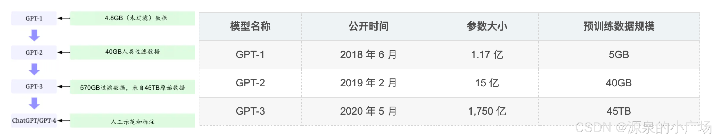

## GPT-1 (2018)

### Idea

在 GPT-1 之前，**自然语言处理（NLP）通常采用监督学习模型**。每个任务都有一些标注数据，然后基于这些标注数据开发一个监督模型。这种方法存在几个问题：**首先，需要大量的标注数据**。然而，与计算机视觉（CV）中有着良好标注的数据集 ImageNet 不同，NLP 领域缺乏类似的标注数据。其次，不同任务训练的模型往往不够通用。例如，用于翻译任务训练的模型很难直接用于分类任务。

GPT-1 提出了一些新的想法：首先，**现实中存在大量未标注的文本数据，是否可以利用这些大量的未标注数据**？其次，**是否可以预训练一个通用模型，使其能够迁移到不同任务中**？然而，利用未标注数据存在两个主要挑战：首先，应该使用什么目标函数来优化，以便学习到可迁移的文本表示？其次，没有统一的模型可以将这些学到的表示转移到目标任务中。GPT-1 采用**自监督**的方法来预训练模型，**从大量未标注数据中学习文本表示，并使用有监督的模型对每个子任务进行带标注训练数据的微调**。这里的**自监督意味着不需要人工标注数据，而是通过当前时间点之前的词来预测下一个词**。

---

### Model intro

在模型结构方面，GPT-1 使用了 Transformer 解码器，如图2所示，因为其在处理文本中的长期依赖关系时提供了更结构化的记忆，从而在不同任务中表现出稳健的迁移性能。相比之下，BERT 也基于Transformer，但它使用的是 Transformer 编码器。这意味着 GPT-1 选择了一种更困难的方式，因为解码器仅使用 t 时刻之前的信息来预测 t+1 时刻的下一个词，而编码器则利用掩码词前后的信息进行预测，这更容易，性能也可能更好，因为预测时已经看到后续的词。这就是为什么 GPT 被称为单向（从左到右），而 BERT 被称为双向（使用掩码词前后的词进行预测）。

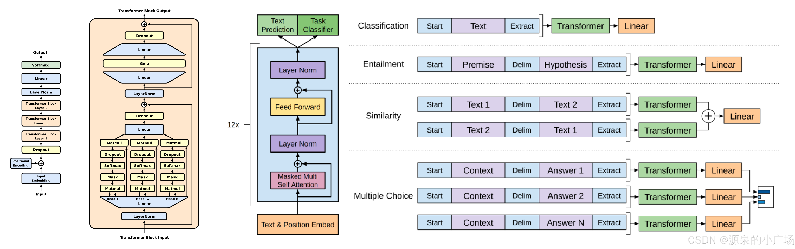

图2. （左图）本研究中使用的 Transformer 架构和训练目标。（右图）针对不同任务的输入转换。将所有结构化输入转换为token序列，以便由预训练模型处理，然后通过一个线性+softmax 层进行处理。

按以上所述，GPT-1 包括两个阶段。第一个阶段是对大量文本语料库进行高容量语言模型的学习，这部分的训练虽然有一定的差异，但还是可以参考[Transformer的原理解析](https://blog.csdn.net/weixin_65514978/article/details/140954252)来理解。第二个阶段是微调阶段，将模型适应到一个带标注数据的判别任务中。

---

### SFT

$$
L_1(\mathcal{U}) = \sum_i \log P(u_i | u_{i-k}, \cdots, u_{i-1}; \Theta) \\
$$

$$
P(y|x^1, \cdots, x^m) = \mbox{softmax}(h_l^m W_y)\\
L_2(\mathcal{C}) = \sum_{(x, y)} \log (P(y|x^1, \cdots, x^m)) 
$$

$$
L_3(\mathcal{C}) = L_2(\mathcal{C})+ \lambda * L_1(\mathcal{C})
$$

关于Supervised Fine Tuning，原论文中提到的训练方式：对模型进行预训练后，将参数调整到有监督的目标任务。假设有一个已标记的数据集C，其中每个实例都由一个输入标记序列 $x_1,..., x_m$ 以及一个标签 y 组成。输入通过我们预先训练的模型以获得最终的Transformer模块的激活值，然后将其输入到一个具有参数 $W_y$ 的线性输出层以预测 y：.png)。这给了我们以下要最大化的目标：$L_2(C)=log P(y|x_1,...,x_m)$。**进一步发现，将语言建模作为微调的辅助目标有助于学习，其方式为：(a)改进有监督模型的泛化，以及(b)加速收敛。**这与先前的工作一致，他们也观察到了有这样一个辅助目标时性能的提升。具体来说，优化以下目标（权重为λ）：.png)。总的来说，在微调期间需要的额外参数只有 $W_y$ 以及分隔符标记的嵌入。

对于某些任务，如文本分类，可以像图2中直接对模型进行微调。某些其他任务，如问答或文本蕴含，具有结构化的输入，例如有序的句子对，或者文档、问题和答案的三元组。**由于预训练模型是在连续的文本序列上进行训练的，所以需要进行一些修改才能将其应用于这些任务。使用一种遍历式方法，将结构化输入转换为我们的预训练模型可以处理的有序序列。**这些输入转换使我们能够避免在不同任务中对架构进行大量更改。所有转换都包括添加随机初始化的开始和结束标记。对于文本蕴含任务，将前提 p 和假设 h 的标记序列连接起来，中间用分隔符标记（\$）。对于相似性任务，被比较的两个句子没有内在的顺序。为了反映这一点，修改输入序列，使其包含两种可能的句子顺序（中间有分隔符），并分别对其进行处理，以生成两个序列表示 h 和 m，它们在被送入线性输出层之前按元素相加。对于问答与常识推理这些任务，给定一个上下文文档 z、一个问题 q 以及一组可能的答案 {$a_k$} 。将文档上下文和问题与每个可能的答案连接起来，中间添加一个分隔符标记，得到 $z; q; \$; a_k$。这些序列中的每一个都用我们的模型独立处理，然后通过 softmax 层进行归一化，以在可能的答案上产生一个输出分布。在按照前面所述的自监督目标（即最大化似然）对模型进行训练之后，参数会针对监督目标任务进行调整。标记数据集 C 的每个实例都有一个输入标记序列 $x_1,...,x_m$以及一个标签 y。为了获得最终的变压器模块的激活状态，接着将输入通过预训练模型，然后将结果注入一个带有参数 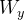 的额外线性输出层，以便估计 y。

---

GPT-1 的架构是一个由十二层解码器组成的 Transformer 模型，使用了十二个掩码自注意力头，每个头有 64 维状态（总共 768 维）。与简单的随机梯度下降不同，该模型使用了 Adam 优化算法；学习率在前 2,000 次更新中线性增加，从零增加到最大值 2.5×10⁻⁴，然后使用余弦调度将其衰减至零。GPT-1 具有 1.17 亿个参数。尽管微调阶段针对特定任务进行了调整，但其预训练阶段并没有进行适配；在执行各种任务时，对其基础的任务无关模型架构进行了最小的修改。

---

GPT-1 论文最后部分讨论，通过更复杂的模型（更多层数——更深，层大小更高——更宽），可以提升预训练模型的性能。它还可以直接用于目标任务（零样本学习），模型能够进行零样本学习：在没有额外训练的情况下，模型可以在一些任务中表现良好。

## GPT2 (2019)

正如 GPT-1 末尾所讨论的（也是受到 BERT 的启发？），预训练模型的性能可以通过更复杂的模型（更多层 - 更深，更高层大小 - 更宽）来提高。它也可以直接用于目标任务（零样本学习）并击败 LSTM 的性能。这就是 GPT-2。与 GPT-1 类似，GPT-2 也是带有 Transformer 解码器的自监督模型，但参数更多。而且 GPT-2 主要专注于零样本学习。

为什么是零样本？在 GPT-1 之后推出的 BERT 在许多任务中都优于 GPT-1。在 GPT-1 的最后一部分，它表明预训练模型的性能可以通过更大的模型来提高。但如果只是单纯地增加参数，GPT-2 论文的价值可能意义不大。所以 GPT-2 想从另一个方面来讨论模型可以做零样本：不需要额外的训练，模型就可以在某些任务中表现良好。这也说明GPT模型有很强的泛化能力，而这一点其实是BERT所缺乏的。

### Intro / Scale law

OpenAI 在2019年开发了生成式预训练模型GPT-2，使用了更大的数据集(在包含数百万网页的全新数据集 WebText 上训练)，并增加了额外的参数，以构建一个更强大的语言模型。**该工作最大的贡献就是证明了用更大的数据集、更多的参数，能够显著提升自然语言处理任务的效果 (scale law)**。论文中给出了四种不同size大小的模型，以及在不同NLP任务上不同size模型的指标表现。

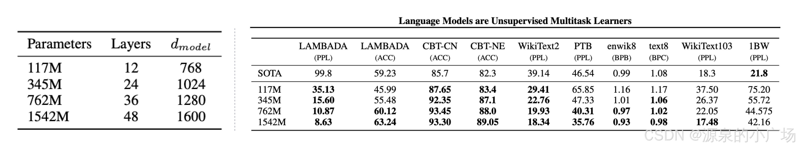

---

### Concept

与 GPT-1 类似，GPT-2 也利用了 transformer 模型的解码器。GPT-2在其模型架构和实现上做了改进，参数数量达到了 15 亿，比 GPT-1（1.17 亿参数）大了 10 倍。此外，与其前身 GPT-1 相比，GPT-2 的参数数量和数据量都增加了 10 倍。在自然语言处理（NLP）的背景下，这项工作涵盖了两个关键概念，如下所示：

- **任务条件化：** 语言模型的训练目标通常表示为 $P(output|input)$ 。在 GPT-2 中，多个任务通过单一的无监督模型来学习。为此，学习目标被修改为 $P(output|input, task)$，**模型基于必须完成的任务进行条件化**。任务条件化是指教会模型根据任务生成多个输出的过程。当在架构层面上提供输入和任务时，某些模型就会融合任务条件化。语言模型的任务、输出和输入都是自然语言序列。给语言模型提供自然语言指令，用于对其进行任务条件化。任务条件化为零样本任务转移奠定了基础，即模型可以执行没有经过明确训练的任务。
- **零样本学习和零样本任务转移：** GPT-2 具备进行**零样本任务**的能力，这意味着它可以在没有提供任何示例的情况下执行任务。零样本学习是零样本任务转移的一个特殊实例，**在这种情况下，只提供指令而没有示例**。GPT-2 不仅仅是像 GPT-1 那样重新排列序列进行微调，它以预定义的格式提供输入，预期模型理解任务的性质并提供解决方案。例如，为了将英语翻译成法语，模型会被提供一个英语句子，然后是单词“French”和一个提示符（:），并且期望模型理解这是一个翻译任务，并提供该英语句子的法语对应。

GPT-2 在多样化的数据集上进行训练，使其在处理与翻译、摘要等相关的各种语言任务时非常强大，只需使用原始文本作为输入，并且几乎不需要或仅需少量训练数据。对多个下游任务数据集的评估显示，GPT-2 在识别长程依赖性和预测句子方面显著提高了准确性。

---

### Zero-shot learning

由于没有微调任务，GPT-2 不需要像 GPT-1 那样使用像 <BOS>, <EOS> 这样的特殊标记。相反，GPT-2 **使用 promot 来控制模型的输入**。**提示是提供给模型的一小段文本，模型将根据此输入生成附加文本。提示是特定于任务的，取决于特定的输入序列和任务。**

相反，GPT-2 使用提示来控制模型的输入。提示是作为初始输入提供给模型的一小段文本，模型将根据此输入生成附加文本。提示是特定于任务的，取决于特定的输入序列和任务。例如，要翻译成法语，提示就像“翻译成法语”，然后是英文句子，然后是法语句子。所以示例数据是一个序列，如（翻译成法语，英文文本，法语文本）。

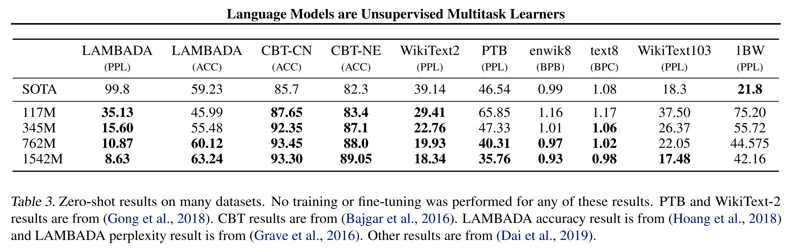

从实验中可以看出：

1. 零样本的 GPT-2 在 NLP 任务上（使用相应的数据集）可以胜过大多数其他 SOTA 零样本模型。
2. 随着参数数量的增加，GPT-2 的性能也随之提高。最大的模型在这些任务上几乎击败了所有 SOTA 模型。

---

### 分析

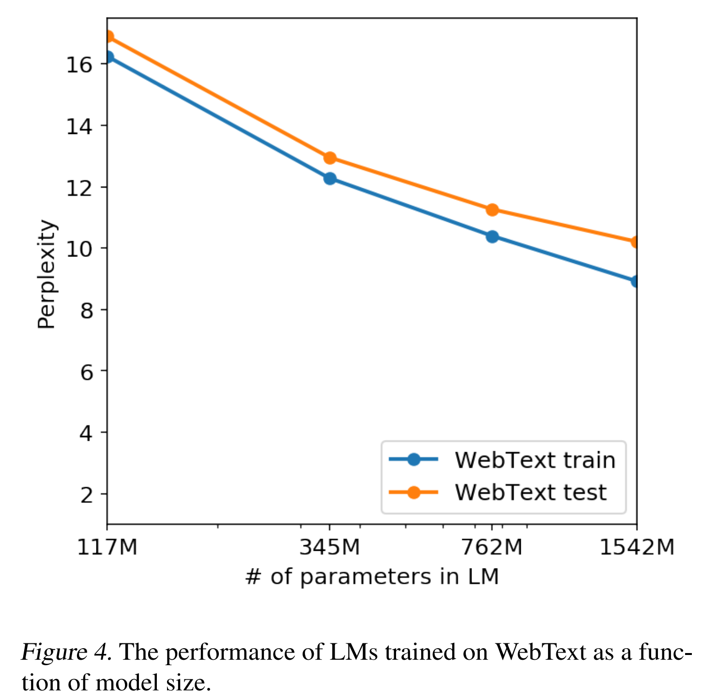

GPT-2 在阅读理解等某些任务上的表现与监督模型相似，其表现与人类表现相差不大，但**在 QA 等其他任务上，它的表现仍然不佳**，并不比随机模型好，尤其是与人类表现相差甚远。与具有相似参数数量的其他自监督预训练模型（如 BERT）相比，GPT-2 在子任务上的表现并不优于它们。这意味着**虽然零样本学习可以提供强大的预训练模型，但它可能仍需要对特定任务进行一些微调以提高其在特定任务上的性能**。问题是，它是否需要与每个子任务中的微调一样多的标记数据，还是只需要少量的标记数据？以下论文 GPT-3 表明仅使用少量数据（小样本学习甚至一次性学习）就对提高性能大有帮助。

第二个观察结果是，随着参数数量的增加（更多层和更大的层大小），模型性能仍然会提高。如上图所示，随着 LM 中的参数数量从 117M 增加到 1542M，训练数据和测试数据中的困惑度都下降了。这也是 GPT-3 要做的：增加模型参数数量，同时增加训练数据大小。最后一个发现是 GPT-2 可以撰写新闻文章。虽然作者没有花太多篇幅讨论这个功能，但这个功能是 GPT 系列未来大放异彩的主要原因之一——它可以生成内容。我们将在下面讨论这一点。

## GPT3 (2020)

### Intro

GPT-3 于 2020 年由 OpenAI 推出，作为GPT-2 的后续迭代版本。该模型拥有约 1750 亿个可训练参数，参数规模比 GPT-2 大 100 倍，使用“Common Crawl”数据集（包含 5000 亿个词汇）进行训练。但1750 亿参数的规模，也意味着推理成本高且耗时。另外，还有一个问题，它有时可能生成不正确的结果，甚至是有害的回复，在处理敏感话题时也不一定合适。

首先我们来看，GPT-3解决了什么问题？**在特定目标任务上训练的模型通常需要特定任务的数据集和特定任务的微调，因此需要一些有标签的数据**。这存在一些局限性：

1. 每个任务的特定数据限制了训练模型的泛化能力。而且对于许多任务来说，很难收集到大规模的有监督训练数据集；

2. 模型性能可能取决于数据：训练模型的潜力与模型的表达能力和训练分布的狭窄程度有关。当大型模型在狭窄的任务分布上进行微调时，大型模型不一定能更好地泛化。换句话说，微调后表现更好的模型并不意味着大型预训练模型更好。这可能只是因为微调训练数据与评估数据有重叠；
3. 人类可以在没有大量数据的情况下更高效地学习。

---

### Concept

为了解决这些问题，GPT-3 提出了以下想法：**首先，它在训练时训练一个具有广泛技能和模式识别能力的模型，并在推理时依赖这种能力来处理新任务**。具体来说，**GPT-3 训练一个具有良好泛化能力（元学习 meta learning）的优秀模型，并且它不会为子任务更新大型预训练模型中的参数（上下文学习），而是仅用少量数据样本（少样本学习）更新该任务的输出权重（通常是最后一层）**。这就像是为特定任务添加了一层。在少样本学习中，大模型的参数不会更新，以便保留预训练模型的泛化能力和模式识别能力。它仅用该特定任务的少量样本更新该特定任务最后一层的参数。例如，如果是分类任务，它将有一个用于分类的层，并且该层的参数将由分类任务数据更新。预训练模型中的其他参数是冻结的。

GPT3中提出了一些学习目标和概念：

1. **上下文学习**（In-context learning） ：大型语言模型通过训练文本数据来发展模式识别和其他技能。在学习预测给定上下文词的下一个词的主要目标时，语言模型还开始识别数据中的模式，这有助于它们最小化语言建模任务的损失。随后，这种能力在零样本任务迁移中帮助模型。当提供少量示例和/或任务描述时，语言模型将示例的模式与过去在类似数据中学到的知识匹配，并利用这些知识执行任务。这是大型语言模型的一种强大能力，随着模型参数数量的增加而增强。
2. **少样本、单样本和零样本设置** (few/one/zero-shot learning)：如前所述，少样本、单样本和零样本设置是零样本任务迁移的特殊情况。在少样本设置中，模型会提供任务描述以及适合模型上下文窗口的多个示例。在单样本设置中，模型只提供一个示例，而在零样本设置中则不提供任何示例。随着模型容量的增加，模型的少样本、单样本和零样本能力也会提高。
   - **微调（Fine-tuning）**： 微调是为每个任务收集数千个数据点，以更新模型中的参数。GPT-3中未使用。但在随后的InstructGPT工作中，作者开始基于人工标注的反馈调整参数。
   - **少样本学习（Few-shot）**： 在推理时，模型会提供几个样本数据，但不会更新预训练模型的权重。例如，在将英语翻译成法语的推理过程中，首先会提供任务描述，然后提供一些（10到100个）英语到法语的例子。接着会给出一个提示，模型会根据提示中的输入自动生成法语翻译。其优点是只需有限数量的输入数据。缺点是少样本学习的性能通常不如最新的微调模型。
   - **一例学习（One-shot）**： 这类似于少样本设置，但在任务描述后只提供一个样本数据。这接近于人类接收任务的方式。当要求人类做某件事时，通常会给出一个任务的示例。
   - **零样本学习（Zero-shot）**： 在任务描述后没有数据。从模型使用的角度来看，这是最简单的方法。但也最具挑战，因为没有提供示例。

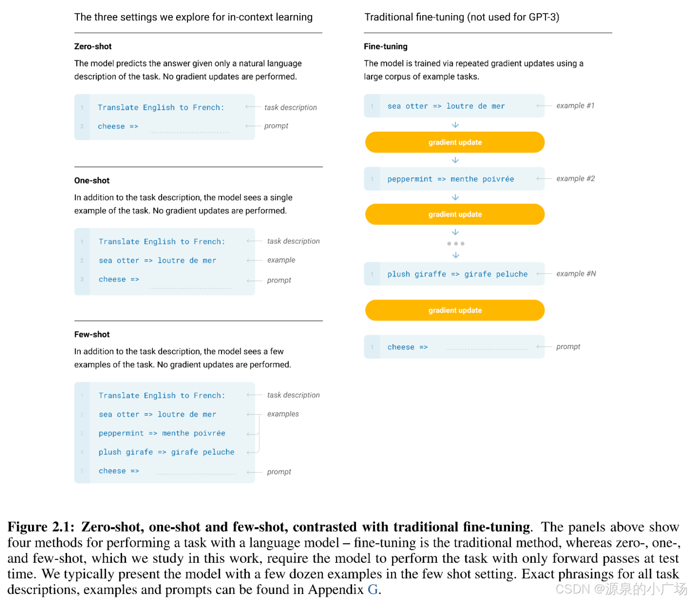

**数据集**： GPT-3 训练使用了五种不同语料库的混合数据集，每种数据集都有特定的权重分配。高质量的数据集被更频繁地抽样，模型在这些数据上训练了多个轮次。使用的数据集包括 Common Crawl、WebText2、Books1、Books2 和 Wikipedia。

### **模型和实施细节**

GPT-3 的架构与 GPT-2 相同。与 GPT-2 相比，主要的区别有：

- GPT-3 具有 96 层，每层有 96 个注意力头。
- 词嵌入的大小从 GPT-2 的 1600 增加到 GPT-3 的 12888。
- 上下文窗口大小从 GPT-2 的 1024 增加到 GPT-3 的 2048 个标记。
- 使用 Adam 优化器，β_1=0.9，β_2=0.95，ε= 10^(-8)。
- 使用交替稠密和局部带状稀疏注意力模式。

> Adam（Adaptive Moment Estimation）优化器是一种用于训练神经网络的梯度下降算法。结合了动量算法和自适应学习率算法，通过对每个参数计算不同的自适应学习率来实现更快的收敛和更好的泛化能力。定义了两个指数加权平均值：第一个指数加权平均值是梯度的指数加权平均值，第二个指数加权平均值是梯度的平方的指数加权平均值。这两个加权平均值被用来调整每个参数的学习率，从而实现自适应学习率的效果。

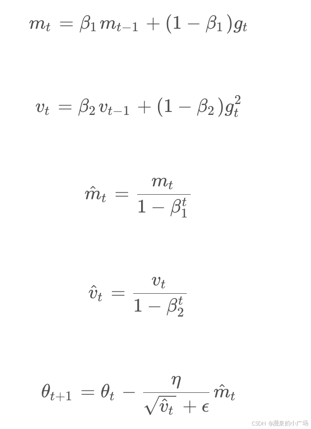

> 交替稠密和局部带状稀疏注意力模式是一种用于提升计算效率的策略。下面是这两种注意力模式的简要解释：
>
> 稠密注意力模式（Dense Attention）：
>
> 1. 在稠密注意力模式下，**模型的每个位置都会与所有其他位置进行注意力计算**。这意味着，给定一个序列的每个单词，模型会计算它与序列中所有其他单词的注意力权重。
> 2. **稠密注意力模式提供了对整个序列的全面关注，有助于捕捉长程依赖关系，但计算复杂度较高，因为每个位置的注意力计算涉及整个序列**。
>
> 局部带状稀疏注意力模式（Locally Band-Sparse Attention）：
>
> 1. 局部带状稀疏注意力模式**只关注序列中的某些局部区域或带状区域**。也就是说，模型**只计算序列中相邻或相关的部分之间的注意力**，而忽略其他部分。
> 2. 这种模式**减少了计算量和内存使用**，因为它限制了计算的范围。虽然它可能不如稠密注意力模式全面，但**在许多实际应用中能够提高效率，同时仍能有效捕捉局部上下文信息**。
>
> 交替模式：在GPT-3中，交替使用这两种模式，意味着模型在不同的层或不同的计算阶段采用不同的注意力模式。例如，**某些层可能使用稠密注意力模式来捕捉全局信息，而其他层使用局部带状稀疏注意力模式来提高计算效率**。这种混合策略旨在**平衡计算复杂度和性能，使模型在处理长序列时仍然高效且有效**。

---

**性能和总结**： GPT-3 在多个语言建模和 NLP 数据集上进行了评估。在少样本或零样本设置下，GPT-3 在语言建模数据集（如 LAMBADA 和 Penn Tree Bank）的表现优于最先进技术。对于其他数据集，尽管 GPT-3 未能超越最先进技术，但改善了零样本的最先进技术表现。GPT-3 在封闭书籍问答、模式解析、翻译等 NLP 任务中也表现得相当不错，通常能击败最先进技术或与微调模型表现相当。对于大多数任务，模型在少样本设置下的表现优于单样本和零样本设置。除了在传统 NLP 任务上评估模型，模型还在诸如算术加法、单词解码、新闻文章生成、学习和使用新词等合成任务上进行了评估。对于这些任务，性能随着参数数量的增加而提高，模型在少样本设置下的表现优于单样本和零样本设置。

---

论文讨论了 GPT-3 模型的几个弱点和改进空间，以下是总结：

- 尽管 GPT-3 能够生成高质量的文本，但在构建长句子时有时会失去连贯性，并且会重复文本序列。GPT-3 在自然语言推理（判断一个句子是否暗示另一个句子）、填空和一些阅读理解任务上的表现也不佳。论文指出 GPT 模型的单向性可能是这些限制的原因，并建议在这种规模下训练双向模型以克服这些问题。
- 论文还指出了 GPT-3 的通用语言建模目标的局限性，该目标对每个标记的权重相等，缺乏任务或目标导向的标记预测概念。为解决这个问题，论文建议采用增强学习目标、使用强化学习来微调模型、增加其他模态等方法。
- GPT-3 还存在由于其庞大的架构而导致的复杂和昂贵的推理，模型生成的语言和结果的解释性较差，以及对模型如何实现少样本学习行为的不确定性。
- 除了这些局限性，GPT-3 还存在滥用其类似人类的文本生成能力的潜在风险，例如用于网络钓鱼、垃圾邮件、传播虚假信息或其他欺诈活动。此外，GPT-3 生成的文本可能带有训练语言的偏见，生成的文章可能存在性别、种族、宗教等偏见。

GPT-3还有一个更根本的局限性是，它是基于文本数据的语言模型，因此预训练模型对其他经验领域没有了解。例如，它无法处理视频数据或现实世界的物理交互。比如通过InstructGPT采用RLHF[强化学习](https://edu.csdn.net/cloud/sd_summit?utm_source=glcblog&spm=1001.2101.3001.7020)进行微调，以及添加额外的模态，例如GPT-4引入图像和视频。

## GPT3.5(InstructGPT)(2022)

### Intro

InstructGPT虽然和GPT-3.5（Chatgpt）还是有一点区别，但不大，所以后续还是用InstructGPT来称呼。 与GPT-3一样，使用互联网、维基百科和电子书等各种来源的超过 570 GB 数据的训练。它于 2022 年发布，**参数数量与 GPT-3 相同。GPT-3.5 的不同之处在于它遵循了一些以人类价值体系为基础的指南**，这些指南通过一种名为“**基于人类反馈的强化学习”（RLHF）**的技术被纳入其中。InstructGPT 经过修改，以更好地符合人类意图，同时确保准确性和真实性。

给出了InstructGPT与GPT1/2/3之间的对比分析：

- 首先，GPT-3 不记得之前的几次输入。而InstructGPT 可以持续记住你之前的对话，并基于这些上下文信息继续进行多轮对话。

- 其次，随着模型变得越来越大，GPT-3 的输出有时难以控制。例如，如果你问“高斯过程是什么”，它可能会生成一些低质量的文本。或者有时模型可能会生成一些有害的信息，例如带有偏见、种族歧视或性别歧视的文本。

- 第三，语言模型使用自监督方法来预训练一个大规模的泛化模型。由于自监督模型中没有标签数据，如果你希望模型回答类似“高斯过程是什么”的问题，训练数据中应该包含这方面的信息，以便模型可以学习。因此，为了让模型具备足够的泛化能力，训练数据的文本量应该足够大。

这些意外行为的原因主要在于**语言模型的目标是预测下一个词**（即 GPT-1/2/3 的做法，使用Transformer解码器在给定前面的词的情况下预测下一个词），**这与按照用户指令帮助和安全地响应的目标不同**。为了克服这些局限性，InstructGPT使用标签数据对 GPT-3 模型进行微调，**将语言模型与来自人类反馈的强化学习（RLHF）结合，以微调 GPT-3，使其更好地遵循人类编写的指令，并使用人类偏好作为奖励信号来调整模型**。

InstructGPT关键特点：

- 对人类意图的对齐：模型经过微调，以理解和执行用户意图的指令。
- 提高准确性和相关性：通过自我评估和人类反馈，InstructGPT 提供的响应更加准确且上下文相关。
- 基于指令的任务执行：它被设计为根据特定指令执行结构化任务。

----

### RLHF过程介绍

InstructGPT专注于通过微调方法对齐语言模型。原论文提到使用基于人类反馈的强化学习（RLHF；Christiano et al., 2017；Stiennon et al., 2020）来微调 GPT-3，这种技术利用人类偏好作为奖励信号来微调模型。OpenAI聘请了一个由 40 名承包商组成的团队来标注数据，收集数据集，其中包含基于（主要是英语）提示提交给 OpenAI API 的期望输出行为的人类编写的示例，以及一些标注者编写的提示，并使用这些数据来训练我们的监督学习基线。接下来，再收集一个数据集，其中包含对模型输出在更大范围 API 提示上的人类标注比较。然后，在这个数据集上训练一个奖励模型（RM），以预测标注者更喜欢哪个模型输出。最后，使用这个 RM 作为奖励函数，并使用 PPO 算法（Schulman et al., 2017）对监督学习基线进行微调，以最大化这一奖励。这个程序将 GPT-3 的行为对齐到特定人群（主要是我们的标注者和研究人员）的偏好。

更详细描述如下：

**1.用标注数据对 GPT-3 进行微调**：通过标注数据对 GPT-3 进行监督学习微调，训练一个监督微调（SFT）模型以生成输出。

> 从提示数据集中抽取一个提示，然后由人工（或模型）为该提示撰写答案。准备好提示和答案后，它们将被用来对 GPT-3 进行监督学习微调（SFT）。这里的挑战是获取人工准备提示答案的成本较高。通过这种模型，可以学习如何基于 SFT 生成答案。

**2.奖励模型（RM）**：构建一个奖励模型，用于比较 SFT 生成的不同答案。

>当给定一个提示时，首先使用 GPT-3 生成几个答案。例如，如果生成了 4 个答案，它们将标记为 A、B、C、D。然后，人工只需对这些答案进行排名（例如，A > B > C = D）。通过这种方式，人工无需编写答案，只需对模型生成的答案进行排名。利用这些比较数据，InstructGPT 训练一个奖励模型（RM）来比较 4 个 <提示，答案> 对，以便在奖励模型中学习排名关系。这个模型可以用于比较生成的答案并计算奖励。

**3. 基于奖励模型的强化学习**：利用奖励模型进行强化学习 (**[Proximal Policy Optimization Algorithms](https://arxiv.org/abs/1707.06347)**) ，以指导 SFT 生成更优的输出。

> 使用 RM 来指导 SFT 模型生成更好的结果，以获得更高的 RM 奖励。InstructGPT 使用 RM 的输出作为标量奖励，并微调监督策略以优化这一奖励。训练后的模型称为 InstructGPT。

所以这个阶段，会涉及到3份数据集。3 个数据集分别是：1) SFT 数据集（13k 个提示），用于训练 SFT 模型；2) RM 数据集（33k 个提示），包含模型输出的标记排名，用于训练 RM 模型；3) PPO 数据集（31k 个提示），没有人工标签，用于 RLHF 微调。

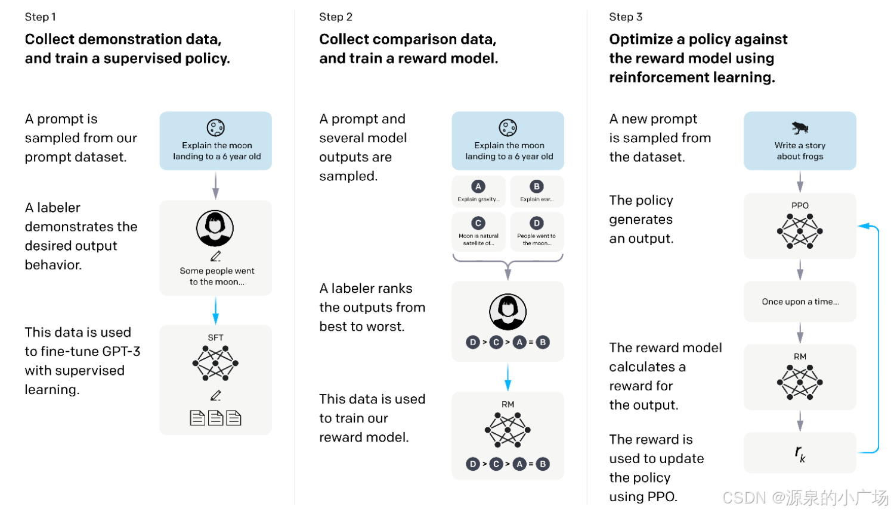

---

关于RLHF过程，这里不具体展开，只给出一些实现思想的介绍，后续会有新的一篇文章，单独来描述RLHF的原理分析以及实现。

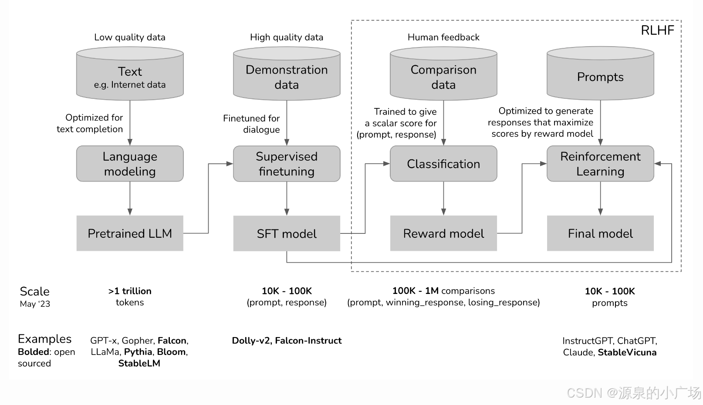

思路介绍：

SFT（监督微调）： SFT 是通过在 SFT 数据上微调 GPT-3 来训练的监督模型，其中每个数据点包含一个提示和标注者的答案。由于数据集只有 13k 条数据，模型在训练 1 个 epoch 后容易出现过拟合。不过，训练更多的 epochs 对于 RM（奖励模型）的评分有益。

RM（奖励模型）： 首先，将 SFT 模型的最后一层（即 softmax 层）替换为线性层，以输出一个标量奖励。因此，对于每个输入 <提示，答案>，修改后的 SFT 模型将输出一个标量值（奖励）。如果一个提示有 K 个答案，为了逐对比较这些答案，会有 C(K,2) 种组合。对于两个答案 yw 和 yl，如果 yw 比 yl 更好，目标是尽可能区分这两个答案，因此损失函数是两个奖励差值（r(x, yw)−r(x, yl)）的 logit 损失。作者提到，使用逐对答案比较（而不是选择最佳答案）可以帮助避免过拟合。

RL（强化学习）： RL 的目标是学习一个更好的 GPT-3 模型 πRLϕ 来生成答案。目标函数旨在引导模型生成符合用户给定指令或约束的响应。

目标函数为：
$$
\text{objective}(\phi) = \mathbb{E}_{(x, y) \sim D_{\pi_{RL\phi}}} [r_{\theta}(x, y) - \beta \log(\pi_{RL\phi}(y|x) / \pi_{SFT}(y|x))] + \gamma \mathbb{E}_{x \sim D_{pretrain}} [\log(\pi_{RL\phi}(x))]
$$
其中包含 3 项：

第一项 $E_{(x, y) \sim D_{\pi_{\phi}^{RL}}}[r_{\theta}(x, y)]$： 这项表示对于新模型生成的答案 y，尝试最大化奖励模型的期望。πSFTϕ 是来自标注数据的 SFT 模型。πRLϕ 是通过 RL 从生成数据中学习到的模型，其中 ϕ 是参数。它初始化为 SFT 模型。意味着将提示 x 输入模型 πRLϕ 生成答案 y，然后将生成的对 (x, y) 输入训练好的 RM 计算奖励，最终目标是最大化这一奖励。这样，新模型 πRLϕ 将接近标注者的最佳模型。

第二项 $\beta \log (\pi_{\phi}^{RL}(y|x) / \pi_{\phi}^{SFT}(y|x))$：这是 KL 散度。这一项的作用是：在经过多次迭代后，πRLϕ 和 πSFTϕ 可能会变得越来越不同。然而，奖励模型 rθ 是从第一个 SFT 和相应的 y 中训练得到的。如果新模型和原始 SFT 模型不同，则奖励模型将不再有效。添加这一惩罚项是为了确保 RM 模型仍然能够有效评估新模型 πRLϕ。这就是“PPO”算法的含义。

第三项 $\gamma E_{x\sim D_{pretrain}}[\log(\pi_{\phi}^{RL}(x))]$：对于 GPT-3 的预训练数据，计算损失并将其添加到目标函数中。如果 γ=0，则称为 PPO-ptx 模型。

RLHF带来的收益，InstructGPT的效果比GPT-3更加真实，提升了模型的无害性效果。

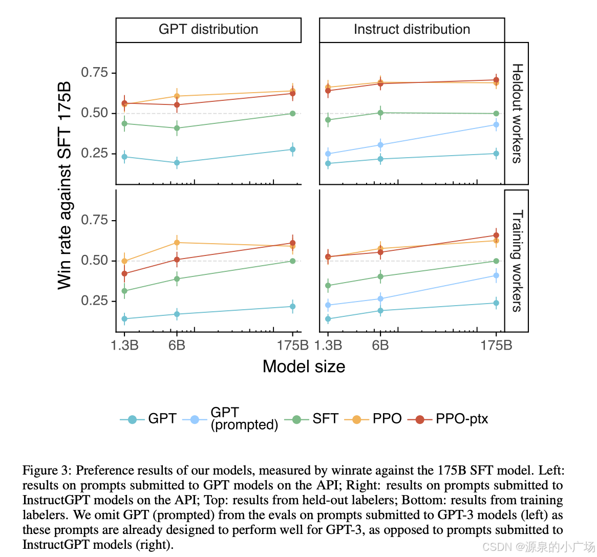

## GPT4（2023）

GPT-4【12】 同样是一种基于 Transformer 架构的模型，预训练目的是预测文档中的下一个词。但GPT-4 是多模态模型，能够接受图像和文本输入提示，并输出文本。GPT-4 模型架构进行了一定的改进，使其能够同时处理视觉和文本信息。后续也会带来更多分析。

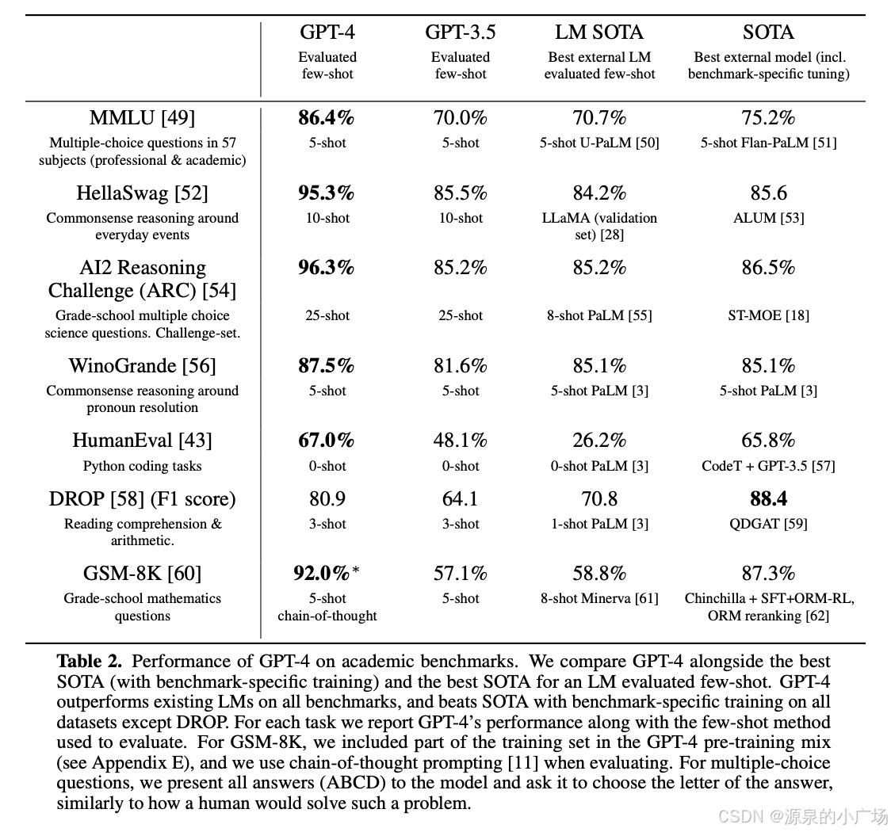

## 参考

https://blog.csdn.net/weixin_65514978/article/details/141018827?spm=1001.2014.3001.5502

https://songhuiming.github.io/pages/2023/05/28/gpt-1-gpt-2-gpt-3-instructgpt-chatgpt-and-gpt-4-summary/

