## PagedAttention

Paged Attention 的设计灵感来自操作系统的[虚拟内存分页管理](https://zhida.zhihu.com/search?content_id=241694683&content_type=Article&match_order=1&q=%E8%99%9A%E6%8B%9F%E5%86%85%E5%AD%98%E5%88%86%E9%A1%B5%E7%AE%A1%E7%90%86&zhida_source=entity)技术。

一、LLM 推理的两阶段
------------

一个常规的 LLM 推理过程通常分为两个阶段：**prefill 和 decode**。通常会使用 [KV cache](https://zhida.zhihu.com/search?content_id=241694683&content_type=Article&match_order=1&q=KV+cache&zhida_source=entity) 技术加速推理。

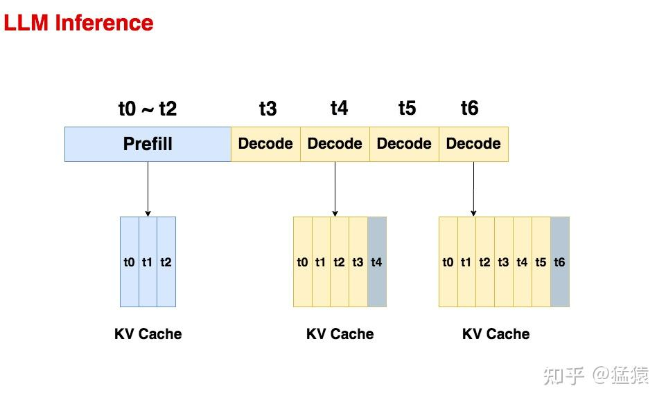

### 1.1 Prefill

**预填充阶段。**在这个阶段中，我们**把整段 prompt 喂给模型做 forward 计算**。如果**采用 KV cache 技术，在这个阶段中我们会把 prompt 过** $W_{k}, W_{v}$ **后得到的** $X_{k}, X_{v}$ **保存在 cache_k 和 cache_v 中**。这样在对后面的 token 计算 attention 时，我们就不需要对前面的 token 重复计算 $X_{k}, X_{v}$ 了，可以帮助我们节省推理时间。
在上面的图例中，我们假设 prompt 中含有 3 个 token，prefill 阶段结束后，这三个 token 相关的 KV 值都被装进了 cache。

### 1.2 Decode

**生成 response 的阶段**。在这个阶段中，**我们根据 prompt 的 prefill 结果，一个 token 一个 token 地生成 response**。
同样，如果采用了 KV cache，则每走完一个 decode 过程，我们就把对应 response token 的 KV 值存入 cache 中，以便能加速计算。例如对于图中的 t4，它与 cache 中 t0~t3 的 KV 值计算完 attention 后，就把自己的 KV 值也装进 cache 中。对 t6 也是同理。
**由于 Decode 阶段的是逐一生成 token 的，因此它不能像 prefill 阶段那样能做大段 prompt 的并行计算，所以在 LLM 推理过程中，Decode 阶段的耗时一般是更大的**。
从上述过程中，我们可以发现使用 KV cache 做推理时的一些特点：

*   **随着 prompt 数量变多和序列变长，KV cache 也变大，对 gpu 显存造成压力**
*   **由于输出的序列长度无法预先知道，所以我们很难提前为 KV cache 量身定制存储空间**

下图展示了一个 13B 的模型在 A100 40GB 的 gpu 上做推理时的显存占用分配（others 表示 forward 过程中产生的 activation 的大小，这些 activation 你可以认为是转瞬即逝的，即用完则废，因此它们占据的显存不大），从这张图中我们可以直观感受到推理中 KV cache 对显存的占用。**因此，如何优化 KV cache，节省显存，提高推理吞吐量，就成了 LLM 推理框架需要解决的重点问题**。

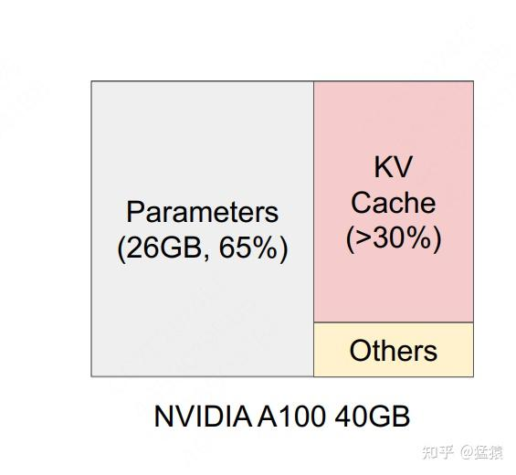

大模型在生成过程中面临内存限制。**在生成的解码部分，为先前token生成的所有注意力键和值都存储在 GPU 内存中以供重复使用。这被称为 KV Cache**，在 《Transformer KV Cache原理深入浅出》有做过详细说明。所谓KV Cache，这里再简单解释下，在基于Transformer的大模型解码过程中，随着每个输入token被处理，模型生成相应的注意力键和值张量。这些键和值张量编码了关于当前输入及其与上下文关系的重要信息。模型不是在解码过程的每个步骤中从头重新计算这些与注意力相关的张量，而是将它们存储在 GPU 内存中。

像 GPT - 4 这样的大模型可以有数万亿个参数，使得它们能力非常强大，但在服务期间进行推理时也极其消耗内存。内存的主要瓶颈是由于 KV 缓存。对于大模型和长序列，会占用大量内存。对于一个具有 130 亿参数的大模型，KV 缓存的大小可以达到占比30%以上。另外，KV 缓存的大小也是动态且不可预测的，取决于输入序列的长度。

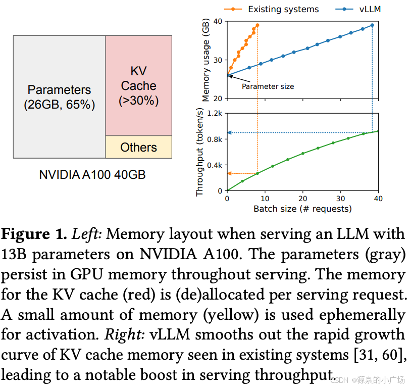

此外，现有系统中的 KV 缓存内存管理，存在三种类型的内存浪费 —— **预留内存(给当前生成预留且会使用到的内存)、内部碎片(预留但不会用到的)和外部碎片(两个不同生成的内存在实际存储中的碎片)**。每个内存槽中的token代表其 KV 缓存。相同的token在不同位置时可以具有不同的 KV 缓存。

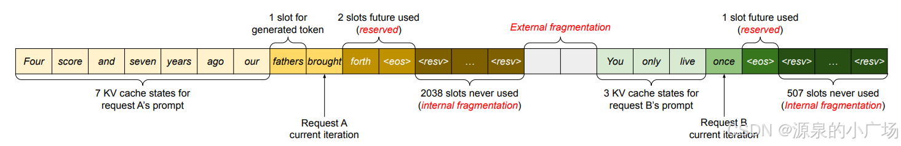

因此，Kwon 等人提出PagedAttention技术，大幅减少大模型 KV 缓存的内存占用，从而使得大模型更高效利用内存且易于访问。PagedAttention背后的核心思想是将每个序列的 KV 缓存分割成更小、更易于管理的 “页” 或块。每个块包含固定数量token的键值向量。这样，在注意力计算期间可以更高效地加载和访问 KV 缓存。

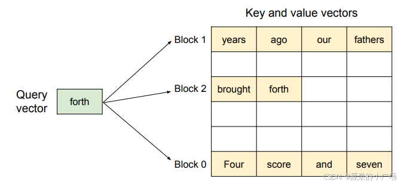

 分页注意力算法的图示，其中注意力键和值向量作为非连续的块存储在内存中

 PagedAttention管理用于存储键和值向量的内存的方法**类似于操作系统处理虚拟内存的方式**。**分页注意力将数据的逻辑组织与其物理存储解耦**。属于一个序列的逻辑块使用块表映射到可能不连续的物理块。有利于内存利用，在生成新token时可以分配新的物理块。PagedAttention通过将 KV 缓存分割成通过查找表访问的块来优化内存使用。**因此，KV 缓存不需要存储在连续的内存中，并且可以根据需要分配块**。内存效率可以提高内存受限工作负载下的 GPU 利用率，因此可以支持更多的推理批次。

使用查找表访问内存块也有助于进行 KV 共享，对于并行采样有帮助，在并行采样中，对于相同的提示同时生成多个输出。在这种情况下，缓存的 KV 块可以在多次生成之间共享。

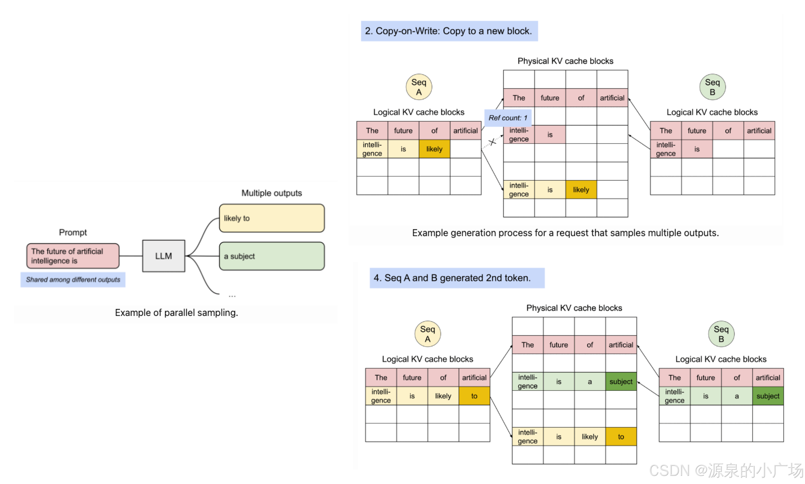

PagedAttention处理流程：

1. 分割 KV 缓存：将 KV 缓存分成固定大小的块或 “页”。每个块包含原始缓存中的一部分键值对。

2. 构建查找表：构建并维护一个查找表，该表将查询键映射到存储相应值的特定页。这个表将每个可能的查询键映射到存储相应值的特定页。实现快速分配和检索。
3. 选择性加载：在推理期间，模型仅加载处理当前输入序列所需的页。与加载整个 KV 缓存相比，可以大幅减少总体内存占用。
4. 注意力计算：加载相关页后，模型可以像之前一样进行注意力计算，根据需要从加载的页中访问键值对。

PagedAttention已被 vLLM 采用，vLLM 是由加州伯克利开发的用于快速 LLM 推理和服务的开源库。vLLM 支持在线服务和离线推理，可以通过Python 库直接在 Python 脚本中使用。

二、为 KV cache 分配存储空间的常规方式
------------------------

对于训练好的模型，一种常用的部署方式是将其打包成一个推理服务（server），它接收客户端发送来的请求（request），读取请求中的数据（prompt）来做推理。一个请求中可以只有 1 个 prompt，也可以包含多个 prompt。
在常规的推理框架中，当我们的服务接收到一条请求时，它会为这条请求中的 prompts 分配 gpu 显存空间，其中就包括对 KV cache 的分配。**由于推理所生成的序列长度大小是无法事先预知的，所以大部分框架会按照`(batch_size, max_seq_len)`这样的固定尺寸，在 gpu 显存上预先为一条请求开辟一块连续的矩形存储空间。然而，这样的分配方法很容易引起 “gpu 显存利用不足” 的问题，进而影响模型推理时的吞吐量。**你可能觉得这个描述有点抽象，别着急，我们来具体看一个例子。
下图展示了一个常规的推理框架是如何为请求中的 prompt 在 gpu 显存上分配 KV cache 的。在本例中，我们假设一个请求只发送 1 条 prompt（本例中共有 3 条请求）：

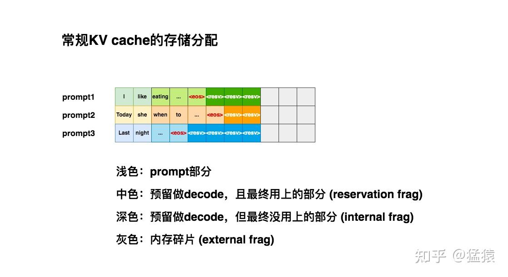

我们假设`max_seq_len = 8`，所以当第 1 条请求 (prompt1) 过来时，我们的推理框架为它安排了`(1, 8)`大小的连续存储空间。
当第 2 条请求（prompt2）过来时，同样也需要 1 块`(1, 8)`大小的存储空间。但此时 prompt1 所在的位置上，只剩 3 个空格子了，所以它只能另起一行做存储。对 prompt3 也是同理。
仔细观察这 3 条 prompt 的 KV cache 排布，你是不是隐约觉得这种排布似乎没有充分利用起 gpu 的显存？：

*   **浅色块：**观察图中的浅色块，它是 prefill 阶段 prompt 的 KV cache，是无论如何都会被使用的空间，它不存在浪费。
*   **中色块**：观察图中的中色块，它是 decode 阶段的 KV cache，其中`<eos>`表示序列生成的截止符。虽然这些中色块最终都会被我们用上，但是在 decode 阶段一个个 token 生成时，我们并不能预知哪些块会被最终用上。例如对于 prompt2，当你生成 when 的时候，你无法知道下一个会生成`<eos>`，还是会生成别的词。所以**这些中色块都是一种 “潜在的浪费”，我们称中色块的部分为预留碎片（reservation fragment）。**
*   **深色块：**观察图中的深色块，它也是 decode 阶段的 KV cache，但直到序列生成完毕，它都没有被用上。**由于这些深色块是预留的 KV cache 的一部分，所以我们称其为内部碎片（internal fragment）。**
*   **灰色块：**观察图中的灰色块，它不是我们预留的 KV cache 的一部分，且最终也没有被用上，**我们称这些灰色块为外部碎片（external fragment）。**想象一下，此时新来了一条 prompt4，它也要求显存中的 8 个格子作为 KV cache。**此时你的显存上明明有 9 个空格子，但因为它们是不连续的碎片，所以无法被 prompt4 所使用**。这时 prompt4 的这条请求只好在队列中等待，直到 gpu 上有足够显存资源时再进行推理，这不就对模型推理的吞吐量造成显著影响了吗？

**观察整个 KV cache 排布，你会发现它们的毛病在于太过 “静态化”**。当你无法预知序列大小时，你为什么一定要死板地为每个序列预留 KV cache 空间呢？**为什么不能做得更动态化一些，即 “用多少占多少” 呢？**这样我们就能减少上述这些存储碎片，使得每一时刻推理服务能处理的请求更多，提高吞吐量，这就是 vLLM 在做的核心事情，我们先通过一张实验图来感受下 vLLM 在显存利用上的改进效果（VS 其它推理框架）：

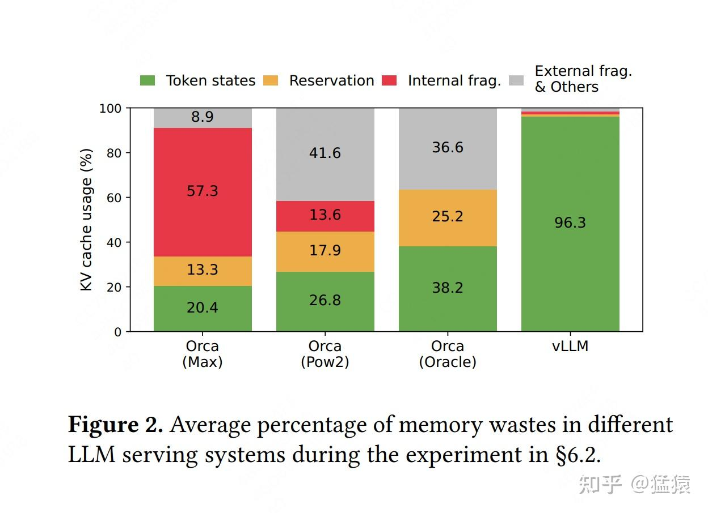

不难发现，相比于别的推理框架，vLLM 几乎能做到将显存完全打满。
读到这里，你可能会有以下疑问：

*   **vLLM 是通过什么技术，动态地为请求分配 KV cache 显存，提升显存利用率的？**
*   **当采用动态分配显存的办法时，虽然明面上同一时刻能处理更多的 prompt 了，但因为没有为每个 prompt 预留充足的显存空间，如果在某一时刻整个显存被打满了，而此时所有的 prompt 都没做完推理，那该怎么办？**

在后文的第三～四章，我们将回答问题 1。第五章回答问题 2。

三、PagedAttention 原理
-------------------

在本节中，**我们先来回答问题 1：vLLM 通过一种名为 PagedAttention 的技术，动态地为请求分配 KV cache 显存，提升显存利用率。**

**整体上来说，PagedAttention 的设计灵感来自操作系统中虚拟内存的分页管理技术。**所以本节会先通过通俗易懂的方式，和大家一起快速回顾操作系统的虚拟内存技术，在这个过程中和大家一起具象化感受 PagedAttention 的设计思想。然后再来详细介绍 PagedAttention 的运作流程。

### 3.1 操作系统的虚拟内存

**（1）不使用虚拟内存**

我们知道程序运行时，会将代码、数据等内容存放在物理内存上。在**最原始的做法中（没有操作系统，例如单片机），程序直接对物理内存进行操作，决定使用它的哪些存储地址**。

**如果你只跑一个进程，那还好说。但如果需要运行多个进程时，麻烦就来了**：由于我直接操作了物理内存地址，所以我在为自己的进程分配物理内存时，还要考虑别的进程是如何分配物理内存的（别人已经占用的我不能用）。这样不同进程间的耦合性太高了，给开发带来难度。

**有没有一种办法，让各个进程间的开发能够相互独立呢？一种直觉的做法是**：

*   **给每个进程分配一个虚拟内存**。每个进程在开发和运行时，可以假设这个虚拟内存上只有自己在跑，这样它就能大胆操作。
*   **虚拟内存负责统一规划代码、数据等如何在物理内存上最终落盘。**这个过程对所有进程来说都是透明的，进程无需操心

虚拟内存的核心思想可简化成下图:

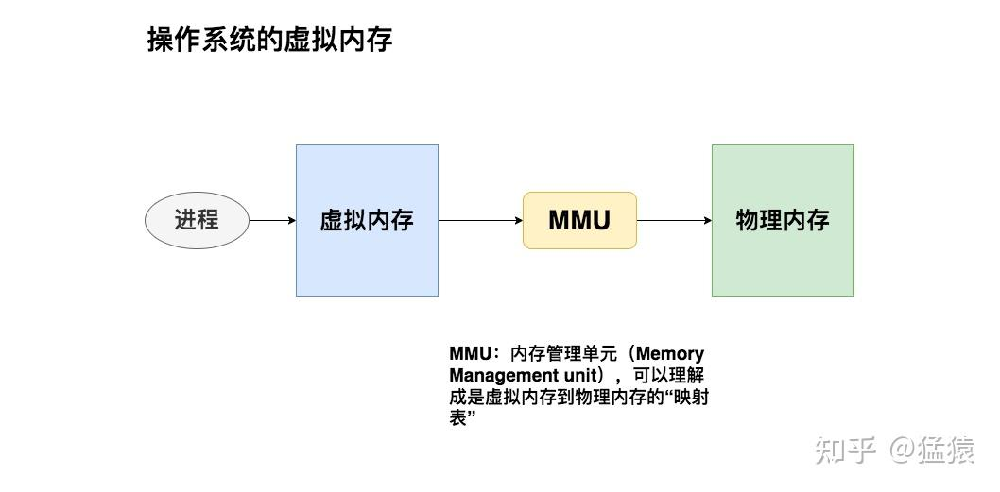

**（2）虚拟内存的分段管理**

**在分段式内存管理中，虚拟内存会尽量为每个进程在物理内存上找到一块连续的存储空间，让进程加载自己的全部代码、数据等内容**。我们来看一个具体的例子：

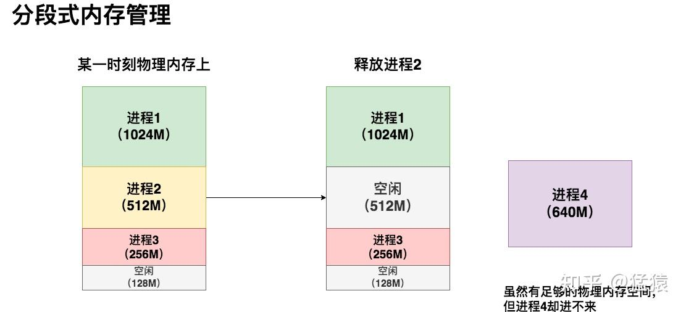

在这个例子中，3 个进程的虚拟内存各自为它们在物理内存上映射了一块连续的存储空间。在某一时刻，我释放了进程 2，同时想运行进程 4。**这时我尴尬地发现，虽然物理内存上有 640M 的空间剩余，但因为是碎片化的，我的进程 4 无法加载进去**，因此它只能等待（回想一下本文第二部分对传统 KV cache 显存分配的分析）。
在这个情况下，如果我硬要运行进程 4，也是有办法的：我可以先把进程 3 从物理内存上**交换（swap）**到磁盘上，然后把进程 4 装进来，然后再把进程 3 从磁盘上加载回来。通过这种方法我**重新整合了碎片**，让进程 4 能够运行。
**但这种办法的显著缺点是**：如果进程 3 过大，同时内存到磁盘的带宽又不够，整个交换的过程就会非常卡顿。这就是分段式内存管理的缺陷。
这时，我自然而然会想到：**我为什么要给所有进程都预分配一个固定的存储块（段）呢？**假设这个进程是一个浏览器，我难道会一下就用到这个进程里所有的功能吗？就不能进程运行到哪里，或者我想用哪个具体功能时，再加载这部分相关的内容去内存，以此让整个内存分配更加动态？

**（3）虚拟内存的分页管理**

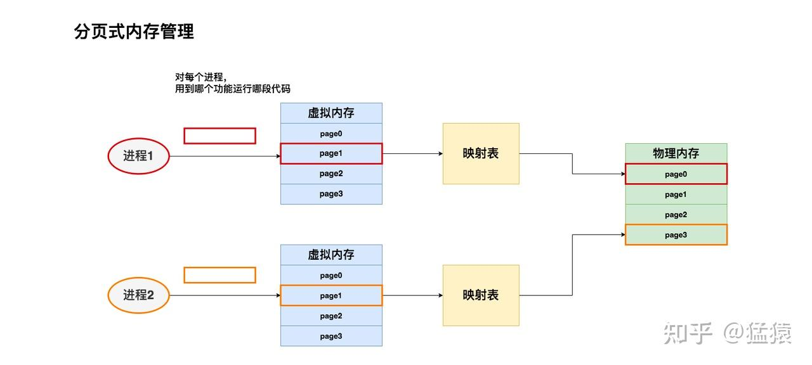

**我们可以将进程 1、进程 2 想成是两本书。代码分布在书的不同 page 上。我们希望想读哪一页，就加载哪一页，而不是一下把两本书都加载进来。**同时，当我们不想读某些页的时候，我们也能根据页码将其清空**。**
现在，我们希望读进程 1 和进程 2 的 page1，我们就将其加载到物理内存上。虚拟内存会帮我们做好映射，把来自不同进程的这两页分别加载到物理内存对应位置。
**虚拟内存的分业管理技术总结起来就是：**

*   **将物理内存划分为固定大小的块，我们称每一块为页（page）**。从物理内存中模拟出来的虚拟内存也按相同的方式做划分
*   对于 1 个进程，我们不需要静态加载它的全部代码、数据等内容。我们想用哪部分，或者它当前跑到哪部分，我们就动态加载这部分到虚拟内存上，然后由虚拟内存帮我们做物理内存的映射。
*   对于 1 个进程，虽然它在物理内存上的存储不连续（可能分布在不同的 page 中），但它在自己的虚拟内存上是连续的。**通过模拟连续内存的方式，既解决了物理内存上的碎片问题，也方便了进程的开发和运行。**

### 3.2 PagedAttention

**（1）处理单个请求

现在，你已经知道虚拟内存分页管理的基本原理和优势，趁热打铁，我们马上来看以其为灵感的 PagedAttention 技术是如何操作的。我们还是从具体的例子讲起。

假设现在你向模型 server 发送一条请求，prompt 为`Four score and seven years ago our`，你希望模型能做续写。PagedAttention 的运作流程如下图：

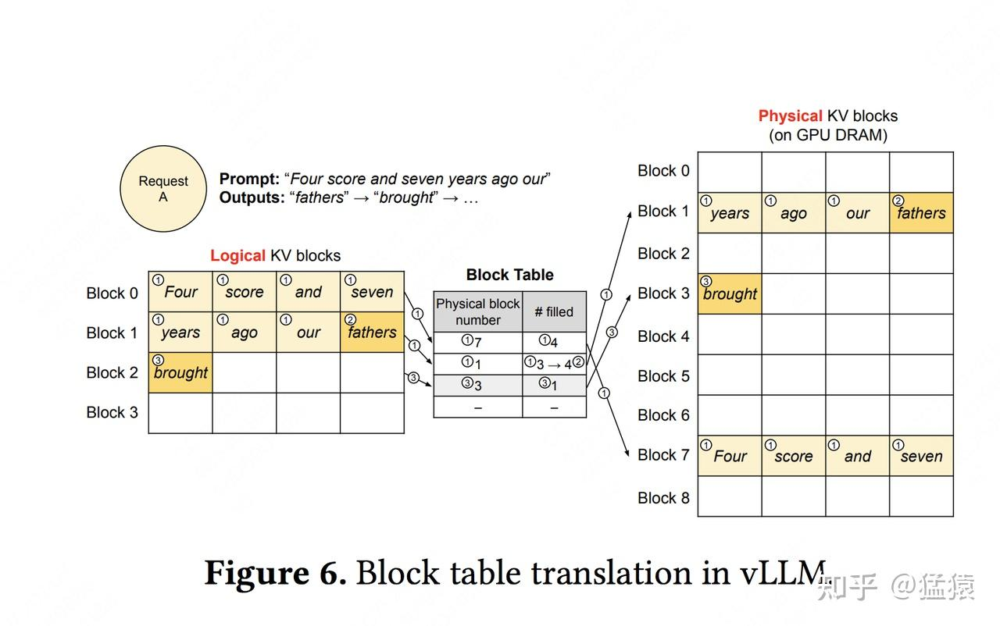

在图中：

*   **请求（request）可理解为操作系统中的一个进程**
*   **逻辑内存（logical KV blocks）可理解为操作系统中的虚拟内存，每个 block 类比于虚拟内存中的一个 page。每个 block 的大小是固定的，在 vLLM 中默认大小为 16，即可装 16 个 token 的 K/V 值**
*   **块表（block table）可理解为操作系统中的虚拟内存到物理内存的映射表**
*   **物理内存（physical KV blocks）可理解为操作系统中的物理内存，物理块在 gpu 显存上，每个 block 类比于虚拟内存中的一个 page**

图中带圈的序号表示操作步骤，我们就按这个顺序来看看。

**(i) Prefill 阶段**

*   **划分逻辑块**：vLLM 拿到这条 prompt，先按照设定好的 block 大小 B（本例中 B=4），为 prompt 划分逻辑块（Logical KV blocks）。由于 prompt 中有 7 个 token，所以 vLLM 用 2 个逻辑块（block 0， block 1）来装它们的 KV 值。其中，在逻辑块 1 中目前只装了 "years", "ago", "hour" 这 3 个 token 的 KV 值，有 1 个位置是空余的。这个位置就被称为保留位（reservation）
*   **划分物理块**：划分好逻辑块后，我们就可以将其映射到物理块中去了。物理块是实际存放 KV 值的地方。我们通过一张 block table 来记录逻辑块和物理块的映射关系，block table 的主要内容包括：

*   **逻辑块和物理块的映射关系（physical block number）**：例如逻辑块 0 对应物理块 7
*   **每个物理块上被填满的槽位（# filled）**：例如在 prefill 阶段，对物理块 7，其 4 个槽位都被填满；对物理块 1，其 3 个槽位被填满。

*   **正常计算 prompt 的 KV 值，并通过划分好的关系填入物理块中。**

**(ii) Decode 阶段 - 生成第 1 个词。**

*   **使用 KV cache 计算 attention，生成第 1 个词 fathers**。不难发现，当我们计算时，我们使用的是逻辑块，即形式上这些 token 都是连续的。与此同时，vLLM 后台会通过 block table 这个映射关系，帮我们从物理块上获取数据做实际计算。**通过这种方式，每个 request 都会认为自己在一个连续且充足的存储空间上操作，尽管物理上这些数据的存储并不是连续的。**
*   **基于新生成的词，更新逻辑块、物理块和 block table**。对于 block table，vLLM 将它 filled 字段由 3 更新至 4。
*   **分配新的逻辑块和物理块**。当 fathers 更新进去后，逻辑块已装满。所以 vLLM 将开辟新的逻辑块 2，并同时更新对应的 block table 和物理块。

**(ii)** **Deocde 阶段 - 生成第 2 个词**

类比步骤（2）来进行。

**（2）处理多个请求**

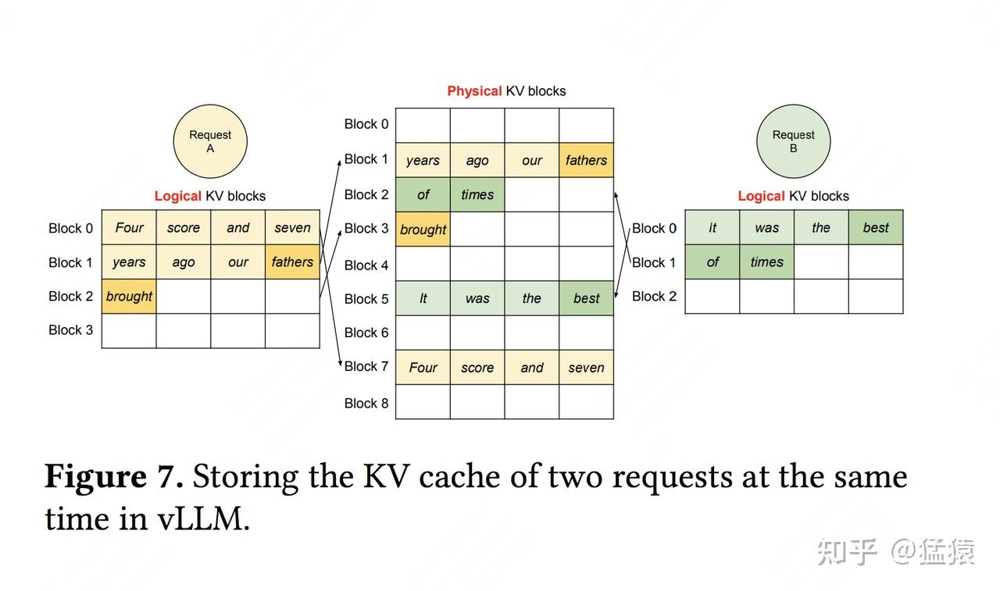

有了（1）的解释，大家看懂这张图应该不难。通过多个请求（prompt）同时做推理的例子，大家可以更好感受到 PagedAttention 是如何通过动态存储 KV cache 的方式，来更充分利用 gpu 显存的。

四、PagedAttention 在不同解码策略下的运作
----------------------------

通过前文的解释，我们已经基本掌握了 PagedAttention 的设计思想、运作流程。你可能隐隐能感受到它在显存管理上的 “灵活性”，和减少碎片化显存的能力。**但可能你觉得还不够具象，所以在本节中，我们通过更具体的场景，再假设一下对 PagedAttention 优势的理解。**
**我们知道，根据实际需求，大模型的解码方式也比较复杂，例如：**

*   **[Parallel Sampling](https://zhida.zhihu.com/search?content_id=241694683&content_type=Article&match_order=1&q=Parallel+Sampling&zhida_source=entity)**：我给模型发送一个请求，希望它对 prompt 做续写，并给出三种不同的回答。我们管这个场景叫 parallel sampling。在这个场景中，我们可以将 prompt 复制 3 次后拼接成 1 个 batch 喂给模型，让它做推理。但我们也需注意到，这种方式会产生 prompt 部分 KV cache 的重复存储。
*   **[Beam Search](https://zhida.zhihu.com/search?content_id=241694683&content_type=Article&match_order=1&q=Beam+Search&zhida_source=entity)**：束搜索，这是 LLM 常用的 deocde 策略之一，即在每个 decode 阶段，我不是只产生 1 个 token，而是产生 top k 个 token（这里 k 也被称为束宽）。top k 个 token 必然对应着此刻的 top k 个序列。我把这 top k 个序列喂给模型，假设词表的大小为 | V|，那么在下一时刻，我就要在 k*|V | 个候选者中再选出 top k，以此类推。不难想象每一时刻我把 top k 序列喂给模型时，它们的前置 token 中有大量的 KV cache 是重复的。
*   **Shared prefix：**在某些大模型中，所有请求可能都会共享一个前置信息（比如 system message: “假设你是一个有帮助的 AI 助手...."），这些前置信息没有必要重复存储 KV cache
*   **其余一般场景：**在一些更通用的场景中，虽然两个 prompt 可能完全没有关系，但它们中某些 KV cache 却是可以共用的。例如两个 prompt 的相同位置（position）恰好出现了完全一样的序列，比如它们的结尾都是`好想下班`。假设这个相同序列已经存在于 KV cache 中，那也没有必要重复计算和存储了。

在下文里，我们会详细解释 PagedAttention 在 Parallel Sampling 和 Beam Search 场景上的优势。剩余两个场景读者可以自行做类比分析。

### 4.1 Parallel Sampling

下面说明在 parallel sampling 的场景下，vLLM（PagedAttention）是怎么做到节省显存的。
**传统 KV cache 怎么做：**
假设模型的 max_seq_len = 2048。传统 KV cache 可能在显存中分配两块长度是 2048 的空间。由于 prompt 一致，这两块 2048 的空间中存在大量重复的 KV cache。
**vLLM 怎么做：**

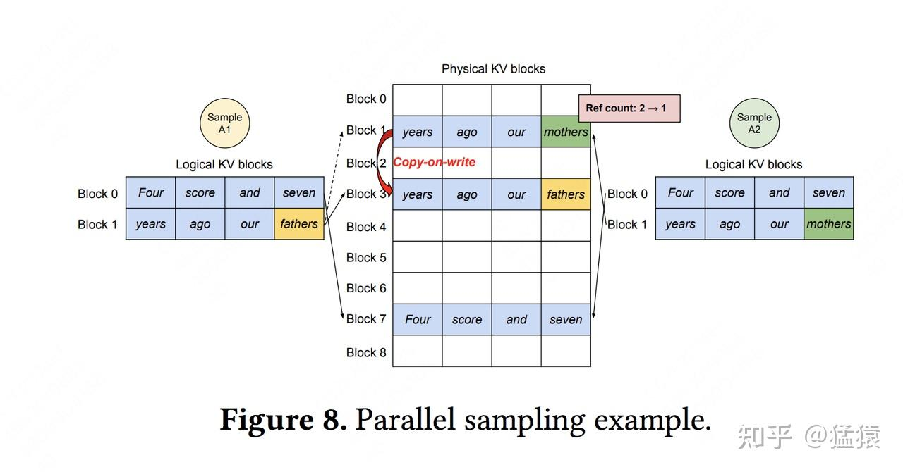

假定我们发给模型 1 个 request，这个 request 中包含 2 个 prompt/sample，记为 Sample A1 和 Sample A2，这两个 prompt 完全一致，都为`Four score and seven years ago our`，我们希望模型对这两个 prompt 分别做续写任务。
**（1）首先，Prefill 阶段，vLLM 拿到 Sample A1 和 Sample A2，根据其中的文字内容，为其分配逻辑块和物理块。**

*   **分配逻辑块：**对于 A1，vLLM 为其分配逻辑块 block0 和 block1；对于 A2，vLLM 为其分配逻辑块 block0 和 block1。**需要注意的是，A1 的逻辑块和 A2 的逻辑块是独立的（尽管它们都叫 block0 和 block1）**，你可以将 A1 和 A2 视作操作系统中两个独立运行的进程。
*   **分配物理块**：对于 A1 和 A2，虽然逻辑块独立，但因为它们的文字完全相同，所以可以**在物理内存上共享相同的空间**。所以 A1 的逻辑块 block0/1 分别指向物理块 block7/1；A2 的逻辑块 block0/1 分别指向物理块 block7/1。我们设每个物理块下映射的逻辑块数量为`ref count`，所以对物理块 block7/1 来说，它们的 ref count 都为 2。

**（2）然后，进入 decode 阶段，A1 和 A2 各自做推理，得到第一个 token，分别为`fathers`和`mothers`。**

*   **将生成的 token 装入逻辑块**：对于 A1 和 A2 来说，将其生成的 token 装入各自的逻辑块 block1。
*   **触发物理块 copy-on-write 机制**：由于 fathers/mothers 是两个完全不同的 token，因此对物理块 block1 触发复制机制，即在物理内存上新开辟一块空间。此时物理块 block1 只和 A2 的逻辑块 block1 映射，将其 ref count 减去 1；物理块 block3 只和 A1 的逻辑块 block1 映射，将其 ref count 设为 1。

总结起来，vLLM 节省 KV cache 显存的核心思想是，对于相同数据对应的 KV cache，能复用则尽量复用；无法复用时，再考虑开辟新的物理空间。

### 4.2 Beam Search

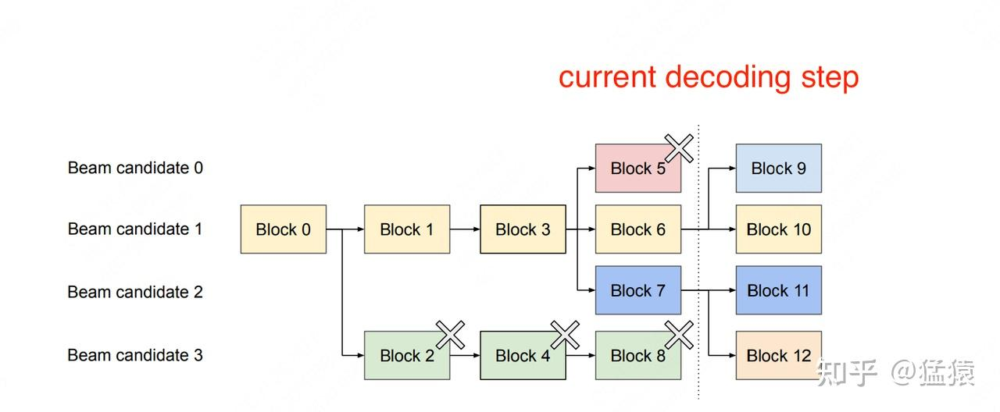

**我们从右往左来看这张图。**虚线位置表示 “**当前 decoding 时刻**”，beam width = 4。**图中所有的 block 皆为逻辑块。**
因为 beam width = 4，这意味着根据 beam search 算法，在当前阶段我们生成了 top 4 个概率最大的 token（我们记这 4 个 token 为 beam candidate 0/1/2/3），它们分别装在 block5，block6，block7 和 block8 中。
现在我们继续使用 beam search 算法做 decoding，继续找出 top 4 个最可能的 next token。经过我们的计算，这 top 4 next token，有 2 个来自 beam candidate 1，有 2 个来自 beam candidate 2。因此我们在 block6 中引出 block9 和 block10，用于装其中两个 top 2 next token；对 block7 也是同理。
现在，block9/10/11/12 中装的 top 4 next token，就成为新的 beam candidates，可以按照和上述一样的方式继续做 beam search 算法。**而对于 block5 和 block8，它们已经在 beam search 的搜索算法中被淘汰了，后续生成的 token 也不会和它们产生关系，所以可以清除掉这两个逻辑块，并释放它们对应的物理块的内存空间。**
好，我们继续往左边来看这幅图。block3 引出 block5/6/7，block4 引出 block8，这意味着当前这 4 个 top4 token，是上一个 timestep 下 candidate1 和 candidate3 相关序列生成的（candidate0 和 2 的 block 没有画出，是因为它们所在的序列被 beam search 算法淘汰了，因此没有画出的必要）。**由于 block8 已经被淘汰，所以 block4 也相继被淘汰，并释放对应的物理内存空间。**
**由此往左一路推，直到 block0 为止（block0 代表着 prompt，因此被 beam seach 中所有的序列共享）。这一路上，我们都根据最新时刻的 beam search decoding 结果，释放掉不再被需要的逻辑块和对应的物理内存空间，达到节省显存的目的。**

五、调度和抢占
-------

到目前为止，我们已经回答了 “vLLM 是如何优化 KV cache 显存分配” 的问题，现在我们来回答另一个重要的问题：

*   **当采用动态分配显存的办法时，虽然明面上同一时刻能处理更多的 prompt 了，但因为没有为每个 prompt 预留充足的显存空间，如果在某一时刻整个显存被打满了，而此时所有的 prompt 都没做完推理，那该怎么办？**

### 5.1 总原则

当有一堆请求来到 vLLM 服务器上时，vLLM 需要一个调度原则来安排如何执行这些请求，这个调度原则概括如下：

*   **先来的请求先被服务（First-Come-First-Serve, FCFS）**
*   **如有抢占的需要，后来的请求先被抢占（preemption）**

**（1）先来的请求先被服务**
这个很好理解，当有一堆请求到达 vLLM 服务器时，vLLM 肯定优先处理来得早的请求
**（2）后来的请求先被抢占**
想象一下，当一堆请求来到 vLLM 服务器做推理，导致 gpu 显存不足时，vLLM 会怎么做呢？
**最直接的办法，就是暂停这堆请求中最后到达的那些请求的推理，同时将它们相关的 KV cache 从 gpu 上释放掉，以便为更早到达的请求留出足够的 gpu 空间**，**让它们完成推理任务**。如果不这样做的话，各个请求间相互争夺 gpu 资源，最终将导致没有任何一个请求能完成推理任务。等到先来的请求做完了推理，vLLM 调度器认为 gpu 上有足够的空间了，就能恢复那些被中断的请求的执行了。
**在资源不足的情况下，暂时中断一些任务的执行，这样的举动就被称为 “抢占（preemption）”**。

### 5.2 终止和恢复被抢占的请求

对于这些因 gpu 资源不足而被抢占的任务，vLLM 要完成两件事：

*   **暂停它们的执行，同时将与之相关的 KV cache 从 gpu 上释放掉**
*   **等 gpu 资源充足时，重新恢复它们的执行**

针对这两件事，vLLM 分别设计了 **Swapping（交换策略）**和 **Recomputation（重计算策略）**来解决。我们来细看这两个策略。

**（1）Swapping**

对于被抢占的请求，vLLM 要将其 KV cache 从 gpu 上释放掉，那么：

*   **问题 1：该释放哪些 KV cache？**
*   **问题 2：要把这些 KV cache 释放到哪里去？**

**先看问题 1**。由前文 PagedAttention 原理可知，一个请求可能对应多个 block。我们既可以选择释放掉部分 block，也可以选择释放掉全部 block，或者更科学地，我们可以预测一下哪些 block 被使用的频率最低，然后释放掉这些低频 block（但这种方式实现起来难度较大，性价比不是很高）。**在 vLLM 中，采取的是 all-or-nothing 策略，即释放被抢占请求的所有 block**。
**再来看问题 2**。**对于这些被选中要释放的 KV block**，如果将它们直接丢掉，那未免过于浪费。**vLLM 采用的做法是将其从 gpu 上交换（Swap）到 cpu 上**。这样等到 gpu 显存充份时，再把这些 block 从 cpu 上重载回来。
**（2）Recomputation**

知道了 Swapping 机制，重计算的过程也很好理解了：对于有些任务（比如 parallel sampling 中并行采样数 n=1 的任务），当它们因为资源不足而被抢占时，可以不做 swap，而是直接释放它们的物理块，把它们重新放入等待处理的队列中，等后续资源充足时再重新从 prefill 阶段开始做推理
好，到这里，**我们总结一下 vLLM 对请求的调度处理流程**：

*   当一堆请求来到 vLLM 服务器上时，按照 **First-Come-First-Serve（FCFS）**原则，优先处理那些最早到来的请求。
*   当 gpu 资源不足时，为了让先来的请求能尽快做完推理，**vLLM 会对那些后到来的请求执行 “抢占**”，即暂时终止它们的执行。
*   **一旦 vLLM 决定执行抢占操作，它会暂停处理新到来的请求**。在此期间，它会将被抢占的请求相关的 KV block 全部交换（swap）至 cpu 上。**等交换完成后，vLLM 才会继续处理新到来的请求。**
*   当 vLLM 认为 gpu 有足够资源时，它会将 cpu 上的 KV block 重新加载回 gpu，恢复被抢占请求的执行（recomputation）

六、分布式管理
-------

在本文的最后部分，我们再来看看分布式环境下 vLLM 的整体架构。本文不再对 vLLM 的性能实验部分做说明，感兴趣的朋友可以自行阅读。

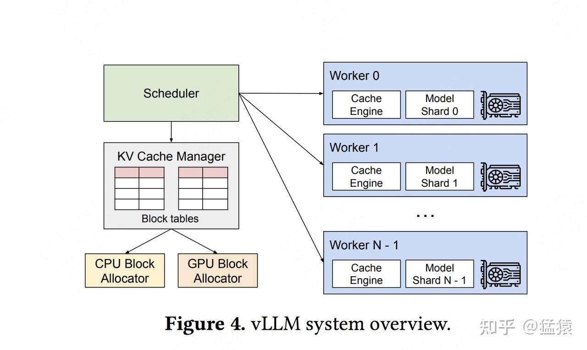

在 LLM 推理实操中，某些场景下单卡是完成不了推理的，需要多卡。那么对于多 gpu 这种更普适性的情况，vLLM 是怎么处理的呢？
上图显示了在分布式场景下，vLLM 的整体运作流程：

*   首先，vLLM 有一个中央调度器（Scheduler），它负责计算和管理每张卡上 KV cache 从逻辑块到物理块的映射表 (block tables)
*   在做分布式计算时，Schedular 会将映射表广播到各张卡上，每张卡上的 Cache engine 接收到相关信息后，负责管理各卡上的 KV block

上图中给出的例子，是用张量模型并行（megatron-lm）做分布式推理时的情况，所以图中每个 worker 上写的是 model shard。**在张量并行中，各卡上的输入数据相同，只是各卡负责计算不同 head 的 KV cache**。所以这种情况下，各卡上的逻辑块 - 物理块的映射关系其实是相同的（用的同一张 block table），只是各卡上物理块中实际存储的数据不同而已。

## PagedAttention的优势与挑战

- 好处：接近最优的内存利用率，在分页注意力中，内存浪费主要局限于输入序列的最后一个块。接近最优的内存使用，平均只有大约 4% 的浪费。这种内存效率的大幅提升使系统能够将更多序列批处理在一起，从而提高 GPU 利用率并显著增加总体吞吐量。

- 挑战：查找表的开销，用于将查询键映射到 KV 缓存页的查找表在推理期间会增加一些计算开销。模型需要在加载相关页之前执行此查找，如果实现效率不高，可能会影响推理速度。根据具体的实现和页的大小，可能会引入一些延迟。例如，如果页太小，频繁的页加载和卸载可能会引入延迟。

## 参考

https://blog.csdn.net/weixin_65514978/article/details/141609201?spm=1001.2014.3001.5501