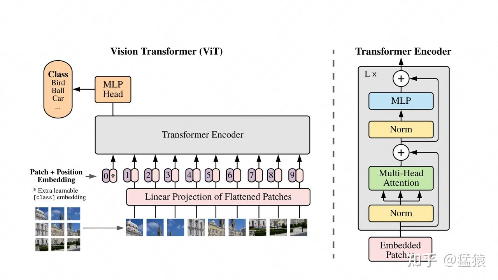
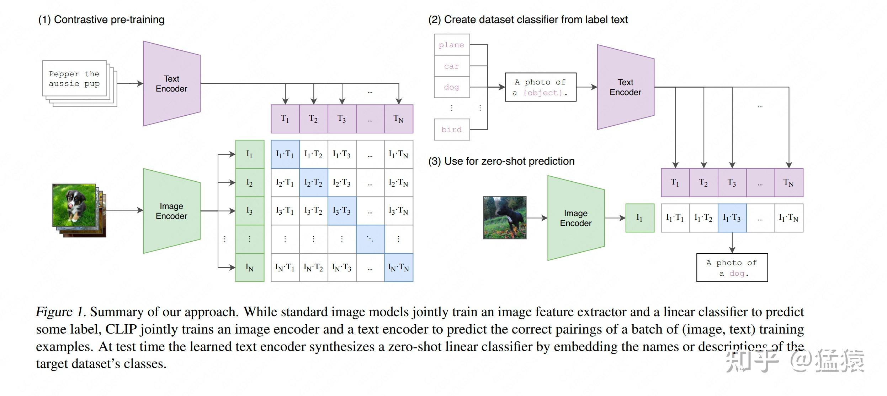
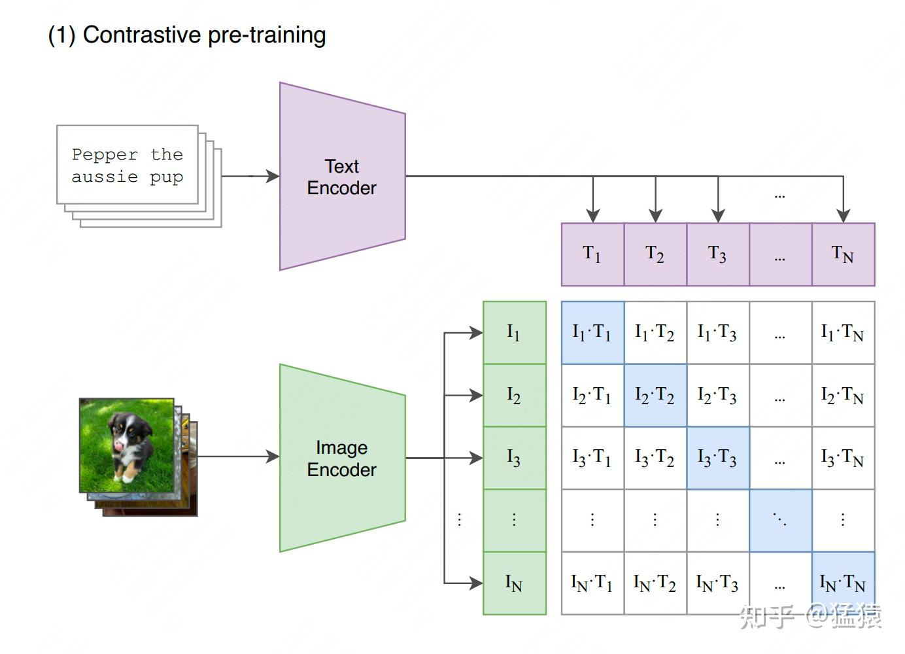
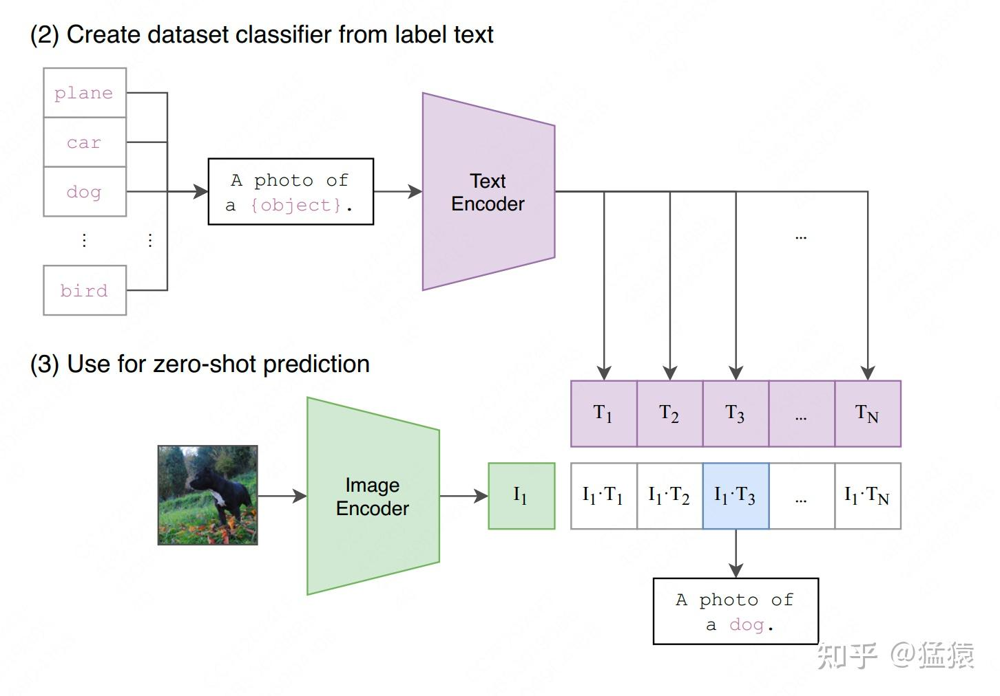
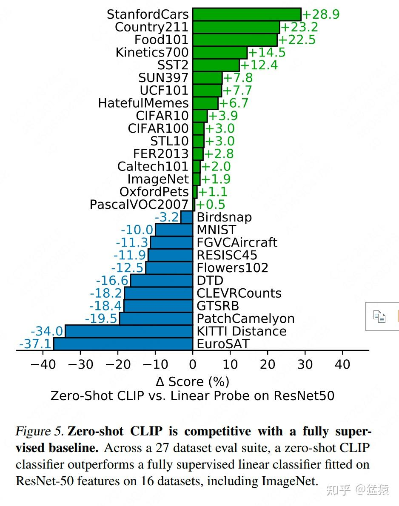

# CLIP (Contrastive Language-Image Pre-training)

一、CLIP 在做一件什么事
-----------------


在使用 VIT 做传统图像分类的过程中，**我们的训练是 “有标签的”**。如下图所示，每张输入数据都是`<image, label>`的形式，最终我们用 MLP Head 位置上对应的向量，来做图片的类别预测。




这样的设计有 2 个显著缺点：

*   **缺点 1**：如果出现了一张图，其中包含模型从来没见过的类别，那么模型就不能输出正确的结果。（例如，训练时用的是动物图片，预测时给模型一张汽车图片）
*   **缺点 2**：如果输入数据出现了分布偏移（distribution shift），那么模型可能也无法输出正确的结果。（例如，缺点 1 中描述的算一种偏移，另外训练时用的是正常的动物图片，预测时给的是毕加索风格的动物图片也算一种偏移）

**解决这 2 个缺点的传统方法是：微调。但是多模态却想做一步到位的事情：不用做任何微调，也能实现 zero-shot 的图片分类**。
**对于缺点 1 来说，zero-shot 是指**，你给我一串标签`<dog>, <cat>....<car>`，即使训练数据中从没有出现过汽车图片（zero-shot，一张都没命中），当我喂一张汽车图片时，模型能告诉我属于`<car>`（图 -> 文）。或者说，当我让模型从一堆图片里找出`<car>`的时候，它也能准确地找到（文 -> 图）。
**对于缺点 2 来说，zero-shot 是指**，我的训练数据中从没毕加索风格的动物图片，我只给模型喂正常的动物图片。但是在测试阶段，模型在毕加索风格的动物图片上的准确率依然不错。**在 CLIP 的实验过程中，它从没有用 ImageNet 这个经典分类数据集上的数据做训练**，但是在测试中，它却能达到和用了 ImageNet 做训练集的 ResNet 架构模型比肩的效果。
**在我个人看来，CLIP 解决缺点 2 的意义，要高于缺点 1**。因为对缺点 1 来说，只要训练数据集够大，那么模型是能做排除法的。而对缺点 2，却意味着模型不仅要能提炼出不同模态数据中的关键特征，还要真正掌握这些特征间的相关性。同时，在现实世界中，文字分类基本是固定的，但图像内容却可以千变万化。
当然了，CLIP 的作用也不止于单纯的图像分类，例如传统的 OCR 识别、视频中的动作识别等任务，都可以用相似的原理来实现，只需要在训练 / 预测时修改文字输入的 prompt 即可。我们会在下文中来看这一点。
好，说明了 CLIP 要实现的目的后，我们接下来看看，它是通过什么办法，来达到这个目的的。

二、CLIP 整体架构
-----------

###   

2.1 CLIP 的训练




图中（1）部分刻画了 CLIP 的预训练过程，我们来详细解读下。
**2.1.1 训练数据**
**CLIP 的训练数据是`<图像，文本>`pair。如图所示，一个 batch 的数据里，有若干张图像，每张图像都配有相应的文字描述信息（prompt）**，比如：

*   一张小狗图片，prompt 为`<dog>`，或者为`<A photo of a dog>`


值得一提的是，CLIP 的作者发现，**prompt 的设计也会影响模型最终的效果**，比如：

*   把 prompt 从单词`<dog>`换成句子`<A photo of a dog>`后，模型在 ImageNet 分类任务上的准确率直接提高了 1.3%
*   在 **OCR 数据集**上，作者发现如果把要识别的文字、数字用引号扩起来，能达到更好的效果
*   在**卫星图分类数据集**上，作者发现把 prompt 替换成`<A satellite photo of a house>`，效果会更好
*   在设计到多语义的场景，比如 crane 既可以表示仙鹤，又可以表示起重机。这时如果把 prompt 写成`<A photo of a crane, a type of pet>`，就能解决歧义问题。

在论文的 3.1.4 部分，还有关于 prompt 工程的详细讨论，感兴趣的朋友，可以详读。
在训练中，**CLIP 没有用前人已经做好的 “图像 - 文本” 数据集，因为一来这些数据集质量不高，二来数量太少。CLIP 团队自己动手，制作了一个含 4 亿“图像 - 文本“对的数据集**。制作的方法是，首先从 Wikipedia 上取出出现次数在 100 以上的词制作成一个 query list，然后保证其中每个 query 都有约 2w 个 “图像 - 文本” 对。
好，介绍完了数据集，我们可以来看 CLIP 的训练方法了。
**2.1.2 CLIP 预训练方法：对比学习**




**（1）Text Encoder 和 Image Encoder**
CLIP 模型由两个主体部分组成：Text Encoder 和 Image Encoder。**这两部分可以分别理解成文本和图像的特征提取器**。
**对于 Text Encoder**，CLIP 借鉴的是 [GPT2](https://zhida.zhihu.com/search?content_id=234900718&content_type=Article&match_order=1&q=GPT2&zhida_source=entity)（Radford et al.2019）的架构。对于每条 prompt，在进入 Text Encoder 前，都会添加表示开始和结束的符号`[SOS]`与`[EOS]`。最终将最后一层`[EOS]`位置的向量作为该 prompt 的特征表示向量，也就是图中所绘的 $T_{i}$ 。
**对于 Image Encoder**，CLIP 则尝试过 **5 种不同的 ResNet 架构**和 **3 种 VIT 架构**，**最终选用的是 “[ViT-L/14@336px](https://zhida.zhihu.com/search?content_id=234900718&content_type=Article&match_order=1&q=ViT-L%2F14%40336px&zhida_source=entity)” 这个模型**，也就是架构为 Large，patch_size = 14 的 ViT，同时在整个 CLIP 预训练结束后，用更高分辨率（336*336）的图片做了一个 epoch 的 fine-tune，目的是让 CLIP 能涌现出更好的效果。与 Text Encoder 类似，每张图片对应一个最终特征表示向量 $I_{i}$ 。在读论文的过程中，我没有发现 $I_{i}$ 是来自于哪一出入层位置（也可能是我读漏了），但我猜测应该和 Text Encoder 差不多，可能来自分类头`[CLS]`。
需要注意的是，**CLIP 是从头开始训练它的 Text Encoder 和 Image Encoder 的**，没有借助其余预训练结果。
**（2）对比学习**


假设一个 batch 中共有 N 对`<图像，文字>`对，那么它们过完各自的 Encoder 后，就会分别产生：

*   N 条文字向量 $[T_1, T_2, ..., T_N]$
*   N 条图片向量 $[I_1, I_2, ..., I_N]$


这两组向量，将会分别过一次**多模态 Embedding（multimodal embedding）**，也就是在图中代表文字的紫色向量下，还有一层参数 $W_t$ （图中没有画出来），文字向量需要先和 $W_t$ 做矩阵相乘后，才能得到最终的文字向量。对图片向量，同理也有个对应的 $W_i$ 。 $W_t, W_i$ **的作用可以理解成把文字、图片特征投影到多模态的特征空间中去**。
经过多模态 Emebdding 的处理，我们得到了最终的 $[T_1, T_2, ..., T_N]$ 和 $[I_1, I_2, ..., I_N]$ 。接下来，**我们就能通过 “对比学习”，找到图像和文字的相似关系**。做法也很简单，对于图中列出的 N*N 个格子，我们只需计算每个格子上对应的向量点积（余弦相似度）即可。由于对角线上的图片 - 文字对是真值，我们自然希望对角线上的相似度可以最大，据此我们可设置交叉熵函数，来求得每个 batch 下的 Loss。
如果听起来还是觉得抽象，我们再来看代码实现（大家详细看下注释）：

```
# image_encoder - ResNet or Vision Transformer
# text_encoder - CBOW or Text Transformer
# I[n, h, w, c] - minibatch of aligned images
# T[n, l] - minibatch of aligned texts
# W_i[d_i, d_e] - learned proj of image to embed
# W_t[d_t, d_e] - learned proj of text to embed
# t - learned temperature parameter
# extract feature representations of each modality

# -------------------------------------------------
# 1、图像/文字数据过image/text encoder，提取单模态特征
# 每张图片对应一个基本特征I_i
# 每张文字对应一个基本特征T_i
# -------------------------------------------------
I_f = image_encoder(I) #[n, d_i]
T_f = text_encoder(T) #[n, d_t]

# -------------------------------------------------
# 2. 图像/文字的基本特征过多模态Embedding，提取多模态特征
# 同时对这两个多模态特征做Layer Norm
# -------------------------------------------------
I_e = l2_normalize(np.dot(I_f, W_i), axis=1) # [n, d_i] * [d_i, d_e] = [n, d_e]
T_e = l2_normalize(np.dot(T_f, W_t), axis=1) # [n, d_t] * [d_t, d_e] = [n, d_e]

# -------------------------------------------------
# 3、计算图片-文字向量的余弦相似度
# -------------------------------------------------
logits = np.dot(I_e, T_e.T) * np.exp(t) # [n, n]

# -------------------------------------------------
# 4、计算Loss
# -------------------------------------------------
labels = np.arange(n)
loss_i = cross_entropy_loss(logits, labels, axis=0)
loss_t = cross_entropy_loss(logits, labels, axis=1)
loss = (loss_i + loss_t)/2

```


很多朋友可能对最后一步计算 Loss 有迷惑，搞不懂为什么要算两个 Loss 再取平均，这里解释一下：

*   CLIP 分为**按行计算 Loss** 和**按列计算 Loss**
*   **按行计算 Loss**，在每一行范围内做 softmax，然后计算 cross_entropy（蓝色格子部分是真值）。这样计算 Loss 的意义是：对于每一张图片，我们都希望找到和它最相似的文字。
*   **按列计算 Loss**，在每一列的范围内做 softmax，然后计算 cross_entropy（蓝色格子部分是真值）。这样计算 Loss 的意义是：对于每一段文字，我们都希望找到和它最相似的图片。
*   **最后将这两个 Loss 相加取平均**，代表我们在模型优化过程中**考虑了 “图片 -> 文字”和 “文字 -> 图片”的双向关系**。

 

**2.2. CLIP Zero-shot 推理**




当我们做完模型的预训练后，就能用模型来做之前说的 zero-shot 预测了，方法也非常简单：

*   首先，我们创建一个标签全集，如图中（2）所示，并得到每一个标签的特征向量
*   然后，我们取一张图片，如图中（3）所示，过 Image Encoder 后得到该图片的特征向量
*   最后，计算图片向量和文字向量间的相似度，取相似度最高的那条 label 即可。


代码实现如下：

```
import os
import clip
import torch
from torchvision.datasets import CIFAR100

# -------------------------------------------------
# 1、读取模型
# -------------------------------------------------
device = "cuda" if torch.cuda.is_available() else "cpu"
model, preprocess = clip.load('ViT-B/32', device)

# -------------------------------------------------
# 2、下载数据集
# -------------------------------------------------
cifar100 = CIFAR100(root=os.path.expanduser("~/.cache"), download=True, train=False)

# -------------------------------------------------
# 3、（1）从数据集中随机抽取一张图片，作为图片输入
#（2）取出该数据集下所有的标签，作为文字数据
# -------------------------------------------------
image, class_id = cifar100[3637]
image_input = preprocess(image).unsqueeze(0).to(device)
text_inputs = torch.cat([clip.tokenize(f"a photo of a {c}") for c in cifar100.classes]).to(device)

# -------------------------------------------------
# 4、计算图像、文字的特征向量
# -------------------------------------------------
with torch.no_grad():
image_features = model.encode_image(image_input)
text_features = model.encode_text(text_inputs)

# -------------------------------------------------
# 5、分别对图像、文字特征向量做归一化处理，
#然后计算余弦相似度
#取最相似的top5结果
# -------------------------------------------------
image_features /= image_features.norm(dim=-1, keepdim=True)
text_features /= text_features.norm(dim=-1, keepdim=True)
similarity = (100.0 * image_features @ text_features.T).softmax(dim=-1)
values, indices = similarity[0].topk(5)

# -------------------------------------------------
# 6、打印结果
# -------------------------------------------------
print("\nTop predictions:\n")
for value, index in zip(values, indices):
print(f"{cifar100.classes[index]:>16s}: {100 * value.item():.2f}%")

```


在读 Zero-shot 预测的代码中，你可能已经发现，**对于标签来说，CLIP 需要一个标签全集**。也就是说，**当你喂给 CLIP 一张图时，不管这张图片它是否有见过，CLIP 都不会生成一个全新的标签，而是去全集标签中找一个最相似的给你**（其实，这也是 CLIP 的缺陷之一，在论文的后面有做讨论）。借助这个代码，我们可以更好理解 CLIP zero-shot 的含义，也可以更好理解前文所说：只要训练数据集够大，模型总有办法做排除法的含义。

三、CLIP 的缺陷
----------


到目前为止，我们已经把 CLIP 技术部分讲完了，怎么样，是不是比想象中的简单多了？虽然技术简单，但 CLIP 的论文肝了 48 页，来分析各种实验效果和其训练代价（CLIP 训起来也是很贵）。因此，我这里就不花篇幅去介绍这两块了，感兴趣的朋友可以看看论文。
在这里我们想讨论的，是 CLIP 这个厉害的模型，到底存在哪些缺陷。
**缺陷一：Zero-shot 的能力很强，但不是最强的。**
根据实验结果，CLIP 从来没有用 ImageNet 的数据训练过，但它在 ImageNet 上的预测效果可以达到 76.2%，和用 ImageNet 做训练集的 ResNet50 基本一致。乍看之下，CLIP 的表现很不错了。但其实，ResNet50 并不是在 ImageNet 分类任务上表现最 SOTA 的模型，例如 MAE 之类在 ImageNet 上可以达到 80%+。虽然 CLIP 同样具有涌现能力，即当模型变大时，模型的效果会更好，但是因为 CLIP 训练昂贵的原因，为了提升预测百分点而需要的代价是巨大的。因此这也是 CLIP 当前的限制之一。
**缺陷二：CLIP 无法处理更抽象的任务。**
抽象的任务指：输出图片中物体的个数等需要一定逻辑思维推理的任务。在论文的实验中也有给出一些说明，下图中刻画了 CLIP 和 ResNet 在不同数据集任务上的表现情况。绿色表示 CLIP 表现更好的数据集，蓝色表示 ResNet 表现更好的数据集。注意到蓝色部分的 DTD（纹理分类）和 CLEVRCountS（给图中物体计数）这两个数据集，都是相对抽象的任务，在这方面 CLIP 的表现明显不如 ResNet。




**缺陷三：当测试数据集分布严重偏移时，CLIP 也束手无策。**
虽然 CLIP 以 Zero-shot 标榜，但是如果测试数据集分布相对训练数据集分布存在严重偏移情况时，CLIP 的表现也不理想。论文中提出了一个很有代表性的例子：MNIST（手写数字数据集）。这样一个简单的数据集，可能用 SVM 都能做到 90% 以上的准确率了，但 CLIP 在上面的表现只有 88%，原因就是在 CLIP 的训练数据集里，可能还真没见过和 MNIST 相似的图片数据。
**缺陷四：文字标签是个闭集。**
前文说过，在对 CLIP 做 zero-shot 预测时，我们的文字标签是一个闭集，模型吃一张可能没有见过的图片，然后从这个闭集中找出最匹配的标签，而不是去预测出一个新的文字标签。从这一点上说，CLIP 依然不够自动化。
**缺陷五：受限于计算资源，无法做图像 - 文本的生成式网络。**
这个在 CLIP 看来是缺陷的问题，不久之后已经被我们熟知的 DALLE2，Stable Diffusion 解决了（没错，正是采在 CLIP 的肩膀上）。因此这是 CLIP 的限制，但也是后人研究的启发点。

四、参考
----

1、[https://arxiv.org/abs/2103.00020](https://link.zhihu.com/?target=https%3A//arxiv.org/abs/2103.00020)
2、[https://github.com/OpenAI/CLIP](https://link.zhihu.com/?target=https%3A//github.com/OpenAI/CLIP)