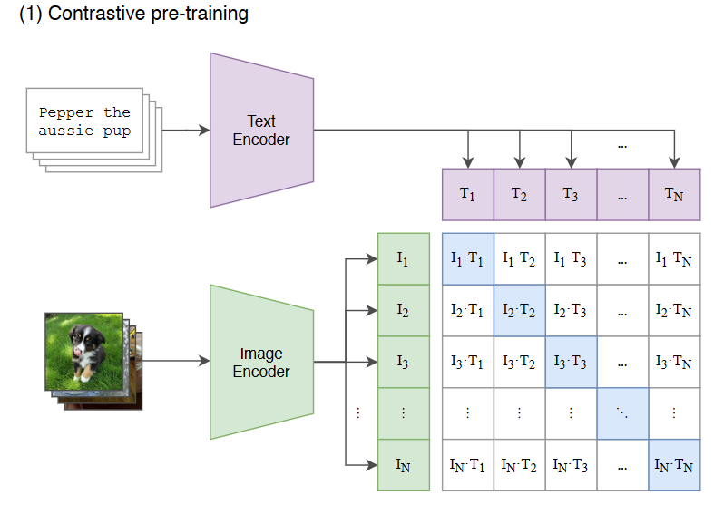
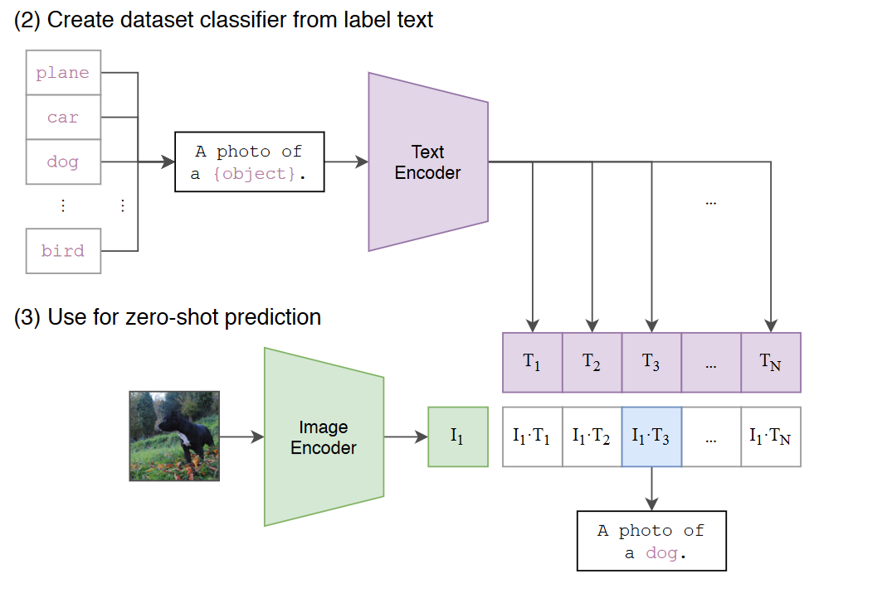

## CLIP模型
**CLIP是用文本作为监督信号来训练可迁移的视觉模型**

CLIP的英文全称是**Contrastive Language-Image Pre-training**，即**一种基于对比文本-图像对的预训练方法或者模型**。CLIP的训练数据是文本-图像对：一张图像和它对应的文本描述，这里希望通过对比学习，模型能够学习到文本-图像对的匹配关系。如下图所示，CLIP包括两个模型：**Text Encoder**和**Image Encoder**，其中Text Encoder用来提取文本的特征，可以采用NLP中常用的text transformer模型；而Image Encoder用来提取图像的特征，可以采用常用CNN模型或者vision-transformer。  

  

这里对提取的**文本特征和图像特征进行对比学习**。对于一个包含$N$个文本-图像对的训练batch，将$N$个文本特征和$N$个图像特征两两组合，CLIP模型会预测出$N^2$个可能的文本-图像对的相似度，这里的相似度直接**计算文本特征和图像特征的余弦相似性（cosine similarity）**，即上图所示的矩阵。这里共有$N$个正样本，即真正属于一对的文本和图像（矩阵中的对角线元素），而剩余的$N^2-N$个文本-图像对为负样本，那么CLIP的训练目标就是最大$N$个正样本的相似度，同时最小化$N^2-N$个负样本的相似度，对应的伪代码实现如下所示：
```Python
# image_encoder - ResNet or Vision Transformer
# text_encoder - CBOW or Text Transformer
# I[n, h, w, c] - minibatch of aligned images
# T[n, l] - minibatch of aligned texts
# W_i[d_i, d_e] - learned proj of image to embed
# W_t[d_t, d_e] - learned proj of text to embed
# t - learned temperature parameter

# 分别提取图像特征和文本特征
I_f = image_encoder(I) #[n, d_i]
T_f = text_encoder(T) #[n, d_t]

# 对两个特征进行线性投射，得到相同维度的特征，并进行l2归一化
I_e = l2_normalize(np.dot(I_f, W_i), axis=1)
T_e = l2_normalize(np.dot(T_f, W_t), axis=1)

# 计算缩放的余弦相似度：[n, n]
logits = np.dot(I_e, T_e.T) * np.exp(t)

# 对称的对比学习损失：等价于N个类别的cross_entropy_loss
labels = np.arange(n) # 对角线元素的labels
loss_i = cross_entropy_loss(logits, labels, axis=0)
loss_t = cross_entropy_loss(logits, labels, axis=1)
loss = (loss_i + loss_t)/2
```
简单说下CLIP的Loss计算吧，我们已经得到了计算后的**余弦相似度[n, n]**，然后定义标签`labels = np.arange(n)` n为batch size，如果n为5，那么`label=[0,1,2,3,4]`，然后计算了两次交叉熵，本质是按照行，列最大化对角线元素。

# CLIP实现zero-shot分类

**与CV中常用的先预训练然后微调不同，CLIP可以直接实现zero-shot的图像分类，即不需要任何训练数据，就能在某个具体下游任务上实现分类，**这也是CLIP亮点和强大之处。用CLIP实现zero-shot分类很简单，只需要简单的两步：

1. 根据任务的分类标签构建每个类别的描述文本：`A photo of {label}`，然后将这些文本送入Text Encoder得到对应的文本特征，如果类别数目为$N$，那么将得到$N$个文本特征；
2. 将要预测的图像送入Image Encoder得到图像特征，然后与$N$个文本特征计算缩放的余弦相似度（和训练过程一致），然后选择相似度最大的文本对应的类别作为图像分类预测结果，进一步地，可以将这些相似度看成logits，送入softmax后可以到每个类别的预测概率。

  


参考：

[https://zhuanlan.zhihu.com/p/493489688](https://zhuanlan.zhihu.com/p/493489688)