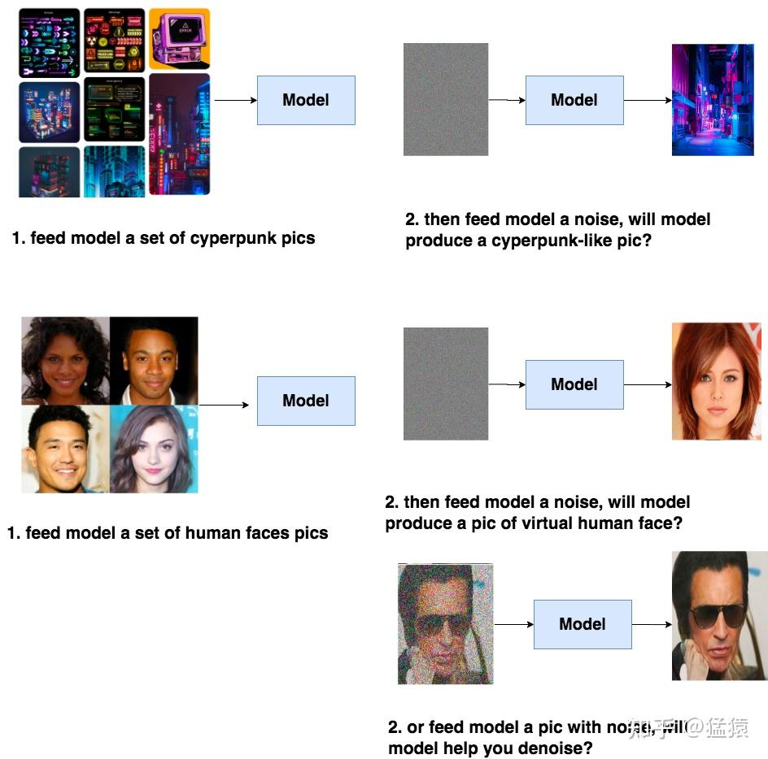
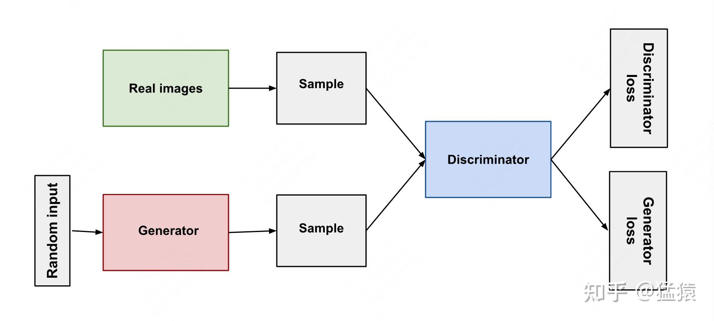
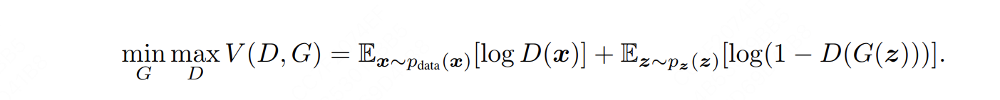
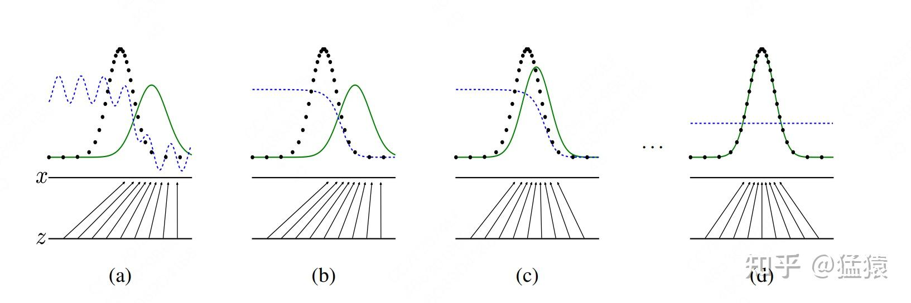
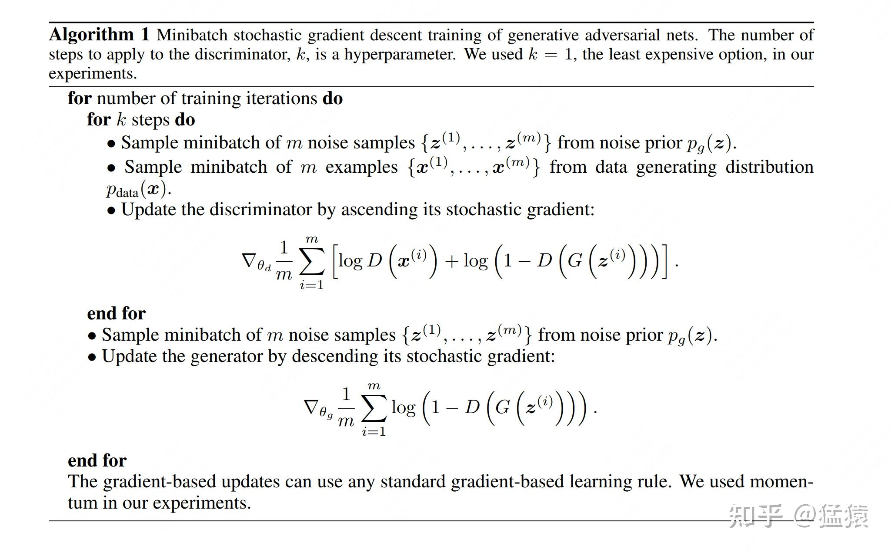
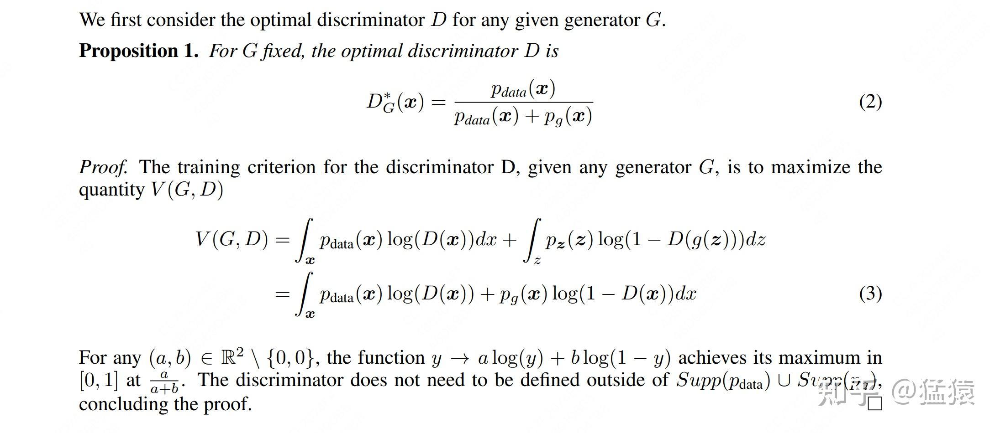
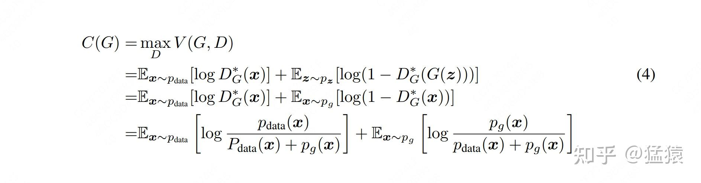
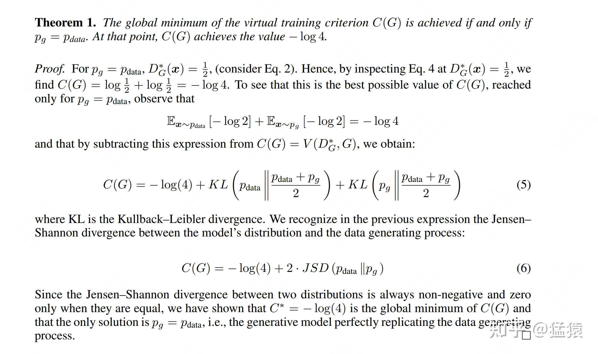
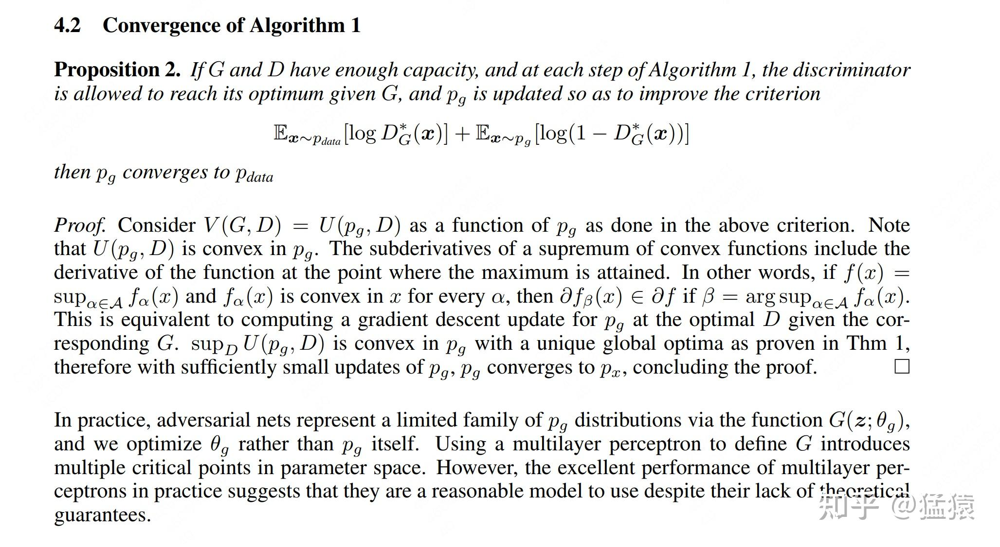

# GAN (Generative Adversarial Nets)

一、GAN 在做一件什么事
-------------

在经济学里，我们经常讨论一个名词，叫**[博弈论](https://zhida.zhihu.com/search?content_id=235518710&content_type=Article&match_order=1&q=%E5%8D%9A%E5%BC%88%E8%AE%BA&zhida_source=entity)（Game Theory）**。假设有一场**双人游戏（Two Player's game）**，参赛的双方彼此是**竞争或对抗**的角色，拥有不同的目标或利益。双方为了实现自己的目标，就必须要揣测对方可能会采用的所有行为，然后选取对自己最有利的方案，如此交手，最终使得整个游戏系统达到一种**均衡**。

我们平常和人打牌、打麻将就是博弈论的一个实例；大家耳熟能详的名词 “囚徒困境” 也是博弈论的一个实例。同样，**今天我们要谈的 GAN，也是博弈论的一个实例**。

**我们先来看 GAN 想做一件什么事**。如果你读过之前讲解扩散模型 DDPM 的这篇文章，你一定对下面这张图很熟悉。**其实 GAN 和 DDPM 的目标是一致的**：我想训练一个模型，在训练的时候，喂给它一堆图片，让它去学习这堆图片的分布。这样，在推理阶段，我喂给模型一个随机噪声，它就可以帮我 “生成” 一张和它吃进去的那些图片风格相似的图出来了。**一句话总结：GAN 和扩散模型，终极目标都是学习训练数据的分布。**

但是 GAN 学习数据分布的方法和 DDPM 不同：

*   DDPM 是通过重参数等技巧，去学习数据的均值 $\mu$ 和方差 $\sigma^{2}$ ，**相当于真得是把这个分布具象化地学出来了**。
*   GAN 则是采用一种更简便的方式，**它才不去预先假设好什么数学分布，它也不关心这个分布具象化长什么样子**。它就是粗暴地放一个模型，用某些技巧（即后面我们要说的对抗性），**强迫模型能学出长得像真实图片的数据就行**（有点半玄学的意味在里面，至于为什么是 “半”，我们后面讲理论部分的时候会说）。

你可能会想，那乍一看，GAN 好像比 DDPM 方便多了。**但也正是因为这种不依赖具象分布的方便性，导致了 GAN 在训练过程中难收敛的问题**，这也是后人对其着重做的改进点之一。好，明确了 GAN 的目标后，我们现在来细看，GAN 到底是通过何种方法，来强迫模型产出像模像样的图片的

二、GAN 的原理
---------

### 2.1 GAN 架构

上图刻画了 GAN 模型的主体架构，最关键的是两部分：

*   **Generator（生成器）**：用于学习数据的分布，并输出其学习成果。
*   **Discriminator（鉴别器）**：用于评估生成器的学习成果。

在代码实现中，这两者都是常见的 MLP。
我们对这两部分做详细的解释：
（1）首先，你得有一些真实图片（real images），你从中筛选 m 张出来，组成一个 sample
（2）然后，你可以从某个分布中（例如高斯分布），随机筛选 m 个噪声
（3）接着，你把 m 个噪声喂给 **Generator**，得到它的学习成果。
（4）然后，你把**真实图片**和 **Generator 的学习成果**，一起输入给 Discriminator。
（5）最后，作为鉴别器，**Discriminator 需要去鉴别一张图片是来自真实图片，还是来自 Generator 杜撰的学习成果**。
欸，从这个过程里，你是不是能体会到 **“对抗”** 的含义了：在这场游戏中，Generator 的目标是训练出尽可能逼真的图片，Discriminator 的目标则是打假。所以**我们不仅要提升 Generator 的造假能力，也要训练 Discriminator 的辨假能力**，只有当这两者都足够强时，模型才能达到一种最优的均衡，产生理想的结果。

### 2.2 GAN Loss

看完了模型构造，我们来看一下 GAN 的损失函数设计。

和大部分损失函数不同，GAN 的损失函数分成两部分：**Generator（以下简称 G）的损失和 Discriminator（以下简称 D）的损失**。
我们先不看前面那个 min 和 max，直接看**主体式子部分（式子中 V 表示 Value，GAN 不将其称呼为损失函数，而是称为价值函数）：**

*   $p_{data}(x)$ ： $p_{data}$ 是客观存在的、真实世界的数据分布，也就是我们希望让模型学到的分布。x 是指真实世界中的某张图片。 $x \sim p_{data}(x)$ 指随机抽取真实世界的图片。
*   $p_{z}(z)$ ： $p_{z}$ 是指喂给 G 的噪声的分布，这个分布是我们定好的（例如定为高斯分布）。 $z \sim p_{z}(z)$ 是指从定好的噪声分布中随机抽取噪声。
*   $G(z)$ ：表示随机噪声经过 G 后的输出结果，也就是 2.1 中所说的 G 的学习成果
*   $logD(x)$ ：指真实世界图片 x 过 D 的输出结果，**表示根据 D 的鉴别，x 属于真实世界图片的概率**。
*   $log(1-D(G(z))$ ： $D(G(z))$ 表示经过 D 的鉴别，噪声 z 属于真实世界图片的概率。因此 $1-D(G(z))$ 自然表示 “**噪声 G 不属于真实世界图片的概率**”
*   $p_{g}(x)$ ：这一项在上式中没有出现，但是后文我们会经常用到，所以这里也作下说明。 $p_{g}$ **表示 G 学出来的数据分布**，换句话说，我们希望 $p_{g}$ 能够逼近 $p_{data}$ 。

明确了主体部分的含义，我们再来细看 min 和 max

#### **2.2.1 max**

max 的意思是，**假设我们把 G 固定下来（G 的参数不再变了）**。那么此时，**我们的优化目标就变成**：

*   当输入数据是真实世界图片 x 时，我们希望 $logD(x)$ 尽量大
*   当输入数据是由 G 加工产生的噪声 z 时，我们希望 $log(1-D(G(z))$ 也尽量大。

这样就能**提升 D 的鉴别能力**。这就是式子中 max 的含义。

#### **2.2.2 min**

min 的意思是，**假设我们把 D 固定下来，那么此时 G 要做的事情就是生成尽可能逼真的图片，去欺骗 D**。此时我们的**优化目标就变成：**

*   当 D 固定时，使得 $log(1-D(G(z))$ 这一项尽可能小。这项变小，意味着 $D(G(z))$ 这项变大，表示此时 D 难以分辨真假图片。

你可能想问，那为啥不管 $log D(x)$ 这项了呢？因为此时 D 是固定的，这一项相当于是个常数，对我们的优化目标没有影响。
如此一来，我们就能**提升 G 的造假能力**，这就是式子中 min 的含义。

### 2.3 GAN 训练分布变动可视化

通过对训练函数的解释，现在你可能**对 GAN 的运作原理有更深刻的理解了**：它是从一个确定的噪声分布 $p_{z}$ （例如高斯分布）中，随机抽取一个噪声喂给 G，然后通过加强 D 的辨别能力，一步步迫使 G 能从噪声中还原数据真实的分布，产生以假乱真的图片。也即，在这个过程里，让 G 学到的分布 $p_{g}$ 去逼近真实分布 $p_{data}$ 。
**你看，在这个过程中，各种 p 都是一个抽象的代表，我们并没有用数学语言明确写出它的样子**。如果你读过这个系列之前的 DDPM，你就能感受到 GAN 和它的差异：DDPM 的本质是去拟合一个数学分布中的各种参数的。
接下来，我们把 GAN 在训练过程中， $p_{g}$ 和 $p_{data}$ 的变动可视化地表达出来，更方便我们理解 GAN 的训练过程：

图中：

*   黑色：真实图片 $p_{data}$ 的分布
*   绿色：G 学出的 $p_{g}$ 的分布
*   蓝色：D 的输出分布

**（a）表示在 GAN 训练的初始阶段**，此时 G 和 D 都不强。因此绿色 $p_{g}$ 距离黑色 $p_{data}$ 相差甚远。蓝色的 D 输出也十分混乱，没有规律性。但总体来看，D 还是可以区分出真实世界图片和 G 造假图片的（表现在靠近黑色的部分较高，靠近绿色的部分较低）。
**（b）模型学习的中间阶段**，D 在慢慢变强，可以发现这时蓝色的曲线更加稳定。
**（c）同样是模型学习的中间阶段**，G 也在慢慢变强，可以发现绿色 $p_{g}$ 正在向黑色 $p_{data}$ 靠近。
**（d）模型学习的最终阶段，** $p_{g}$ **和** $p_{data}$ **吻合（理想情况）**，这时 D 已经分不清真假数据了，因此它的输出分布变成一条蓝色的直线（理想情况下，它输出的概率为 1/2，即每张图片都有一半的概率是真实图片）。

### 2.4 GAN 整体训练流程（必看）

到这一步为止，我们就把 GAN 的核心技术讲完了，现在，我们将整个训练流程用伪代码的形式表达出来，并完整地串讲一次：

如上图，在每个 step 中，我们做以下几件事：
总体来说，**GAN 的训练遵循先 “固定 G 训练 D”，再“固定 D 训练 G” 的模式**。
（1）首先，设定一个超参数 k，表示在一个 step 中，我们要更新 k 次 D。
（2）**在每一个 k 的循环中，**我们从 minibatch 里随机抽取 m 张真实图片 x，再从确定的噪声分布 $p_{z}$ 中随机抽取 m 个噪声 z。**在保持 G 不变的情况下**，执行 2.2.1 中 max 的逻辑，更新 k 次 D，**增强 D 的鉴别能力**。
（3）**结束 k 次循环后，我们将 D 固定下来**，随机抽取 m 个噪声 z，执行 2.2.2 中 min 的逻辑，更新 1 次 G，**增强 G 的造假能力**。
（4）如此循环，直到模型收敛。
（4）这句话其实挺耐人寻味的，**因为实践中来看，GAN 的收敛是很难的。这里我们相当于有 G 和 D 的两个目标函数，那怎么判断是否收敛呢？**很可能的情况是，**训练过程就像个翘翘板，一会你收敛，一会我收敛**，**导致整个系统很难达到平衡**。这个坑也是 GAN 挖给后人来填的，后续有不少工作就是对 Loss 函数做改进，让其能更好收敛。

三、GAN 的全局最优解与收敛性
----------------

尽管在实操中，GAN 被证明是难收敛的。但是作者在论文中给出了详细的证明：**虽然实操难收敛，但理论上，我们的 GAN 是有全局唯一的最优解，并且一定是可以收敛到最优解的。**我们来详细看一下作者的证明。

### 3.1 全局最优解

为了找出 $V(G, D)$ 这个总价值函数（损失函数）的全局最优解，**由于我们的目标是让 G 去拟合真实数据的分布，因此，这个全局最优解也可以理解成当 V 满足前面所说的 min 和 max 条件时，** $p_{g}$ **究竟长什么样子。**为了从理论上解答这个问题，作者按照训练流程，分成了两步：

*   先在固定 G 的情况下，找出 D 的全局最优解
*   再在固定 D 的情况下，找出 G 的全局最优解，也即求出 $p_{g}$ 的最优解

**3.1.1 D 的全局最优解**

根据作者的理论推理，**在固定 G 的情况下，D 的全局最优解就是（2）中列出的样子**。那么具体是怎么推导出（2）的呢？我们来看（3）
在（3）的第一行，作者首先根据 “**期望的定义**”，将原来用期望 E 表达的式子改写成了积分的形式（有疑惑的朋友，可以百度一下期望的定义复习下）。然后，在固定 G 的情况下，对于 D 来说，它接受到的真实世界图片就可以表示成 $p_{data}(x)$ ，接受到的 G 造假的图片就可以表示成 $p_{g}(x)$ 。接下来我们求个导，就可以得到（2）中的结果啦，是不是很简单。

**3.1.2 G 的全局最优解**

知道了 D 的全局最优解，我们就把 D 固定下来，把这个全局最优解带入回 V 中，我们就会得到：

好，根据 2.2.2 的 min 逻辑，我们就要来 minimize C(G)，那这里作者也采用了一个很巧妙的证明，即对于（4）中的分母，我们把它先乘上 1/2，再乘上 2，然后便可改写成下图中（5）的形式：

（5）中的两个 KL 散度又可以被写成（6）中 Jensen-Shannon 散度的形式（简称 JSD），而 JSD 永远是非负的，且仅当 $p_{g} = p_{data}$ 时，它才为 0。因此 C(G) 的最小值必然就是 $p_{g} = p_{data}$ 。
经过这一番推到，我们知道我们构造的损失函数是有全局最优解的，且刚好就是我们想要的 $p_{g} = p_{data}$ 。所以现在我们要进一步证明，模型是可以收敛到这个全局最优解的。

### 3.2 模型收敛到全局最优解

作者在这里说，假设整个训练过程都比较稳健，同时在固定 G 的情况下，D 可以收敛到它的最优解，那么最终 $p_{g}$ 也可以收敛到 $p_{data}$ 。作者下面给出了一堆证明，总结起来，这个证明的思路就是：convex 函数的上限函数还是 convex，因此它的上限函数依然可以收敛。
但是你可能也注意到了，这个证明的成立，是在作者说的一堆假设的前提下，而其实在实践中，作者所说的训练健壮性，是很难满足的（欸又有坑可以填）。所以，这也是文章开篇所说的，“半玄学”的 “半” 字的来由。
好啦，关于 GAN 的介绍，我们就讲到这里了（实验部分就不讲了，因为感觉不是很有意思 ）。是不是比大家想象得简单多了？在看完这篇文章后，建议大家再看一遍 DDPM 的数学原理篇，将两者比较阅读，可以方便大家感受 GAN 和扩散模型之间的异同之处。