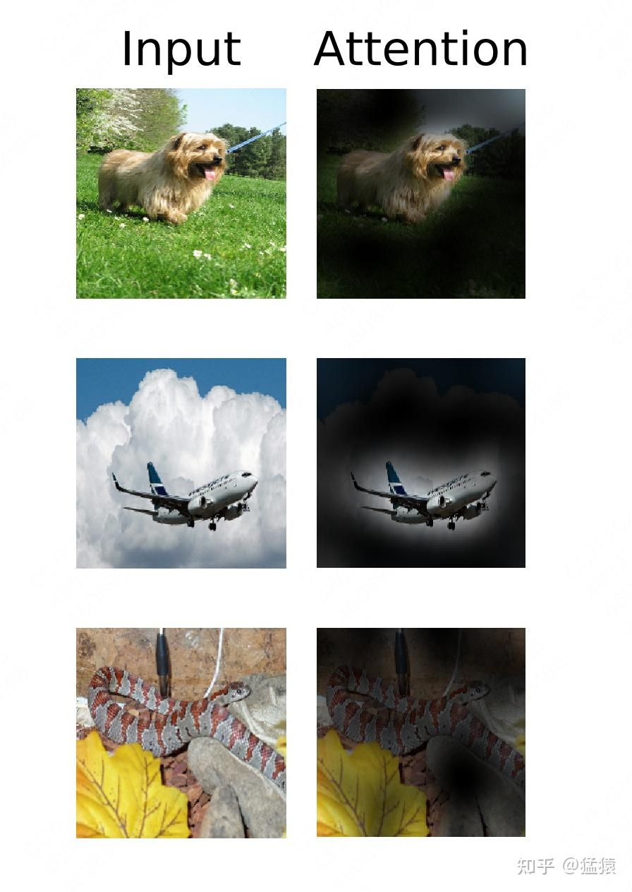

# VIT(vision transformer)

**这个模型的重点在于对特征的提炼能力，预训练只用简单的 softmax 作为 分类头，使得特征提取尽量优化，而不是更复杂的分类头**

## 一、模型架构

提起一个新模型，我想大家最关心的事就是：它到底长什么样？输入输出是什么？我要怎么用？ 
所以，我们先来看模型架构。

### 1.1[Bert](https://zhida.zhihu.com/search?content_id=234276776&content_type=Article&match_order=1&q=Bert&zhida_source=entity) 架构


前面说过，VIT 几乎和 Bert 一致，我们来速扫一下 Bert 模型：


*   input：输入是一条文本。文本中的每个词（token）我们都通过 embedding 把它表示成了向量的形式。、
*   训练任务：在 Bert 中，我们同时做 2 个训练任务：

*   **Next Sentence Prediction Model（下一句预测）**：input 中会包含两个句子，这两个句子有 50% 的概率是真实相连的句子，50% 的概率是随机组装在一起的句子。我们在每个 input 前面增加特殊符`<cls>`，这个位置所在的 token 将会在训练里不断学习整条文本蕴含的信息。最后它将作为 “下一句预测” 任务的输入向量，该任务是一个二分类模型，输出结果表示两个句子是否真实相连。
*   **Masked Language Model（遮蔽词猜测）**：在 input 中，我们会以一定概率随机遮盖掉一些 token（`<mask>`)，以此来强迫模型通过 Bert 中的 attention 结构更好抽取上下文信息，然后在 “遮蔽词猜测” 任务重，准确地将被覆盖的词猜测出来。

*   Bert 模型：Transformer 的 Encoder 层。

### 1.2 VIT 模型架构


我们先来看左侧部分。

*   **[Patch](https://zhida.zhihu.com/search?content_id=234276776&content_type=Article&match_order=1&q=Patch&zhida_source=entity)**：对于输入图片，首先将它分成几个 patch（例如图中分为 9 个 patch），每个 patch 就类似于 NLP 中的一个 token（具体如何将 patch 转变为 token 向量，在下文会细说）。
*   **[Position Embedding](https://zhida.zhihu.com/search?content_id=234276776&content_type=Article&match_order=1&q=Position+Embedding&zhida_source=entity)**：每个 patch 的位置向量，用于指示对应 patch 在原始图片中的位置。和 Bert 一样，这个位置向量是 learnable 的，而并非原始 Transformer 中的函数式位置向量。同样，我们会在下文详细讲解这一块。
*   **Input:** 最终传入模型的 Input = patching_emebdding + position embedding，同样，在输入最开始，我们也加一个分类符`<cls>`，在 bert 中，这个分类符是作为 “下一句预测” 中的输入，来判断两个句子是否真实相连。**在 VIT 中，这个分类符作为分类任务的输入，来判断原始图片中物体的类别**。

右侧部分则详细刻画了 Transformer Encoder 层的架构，它由 L 块这样的架构组成。图片已刻画得很详细，这里不再赘述。
**总结起来，VIT 的训练其实就在做一件事**：把图片打成 patch，送入 Transformer Encoder，然后拿`<cls>`对应位置的向量，过一个简单的 softmax 多分类模型，去预测原始图片中描绘的物体类别即可。
你可能会想：“这个分类任务只用一个简单的 softmax，真得能分准吗？” 其实，**这就是 VIT 的精华所在了：VIT 的目的不是让这个 softmax 分类模型强大，而是让这个分类模型的输入强大。这个输入就是 Transformer Encoder 提炼出来的特征**。**分类模型越简单，对特征的要求就越高。**
**所以为什么说 Transformer 开启了大一统模型的预训练大门呢？主要原因就在于它对特征的提炼能力——这样我们就可以拿这个特征去做更多有趣的任务了**。这也是 VIT 能成为后续多模态 backbone 的主要原因。

二、从 patch 到 token
-----------------


讲完了基本框架，我们现在来看细节。首先我们来看看，图片的 patch 是怎么变成 token embedding 的。

### 2.1 patch 变 token 的过程


如图，假设原始图片尺寸大小为：`224*224*3` (H * W * C)。
现在我们要把它切成小 patch，**每个 patch 的尺寸设为 16**（**P=16**），则每个 patch 下图片的大小为`16*16*3`。
则容易计算出共有 $\frac{224*224}{16*16} = 196$ 个 patch。
不难看出每个 patch 对应着一个 token，将每个 patch 展平，则得到输入矩阵 X，其大小为`(196, 768)`，也就是每个 token 是 768 维。
通过这样的方式，我们成功将图像数据处理成自然语言的向量表达方式。
好，**那么现在问题来了，对于图中每一个`16*16*3`的小方块，我要怎么把它拉平成`1*768`维度的向量呢？**
比如说，我先把第一个 channel 拉成一个向量，然后再往后依次接上第二个 channel、第三个 channel 拉平的向量。但这种办法下，同一个 pixel 本来是三个 channel 的值共同表达的，现在变成竖直的向量之后，这三个值的距离反而远了。基于这个原因，你可能会想一些别的拉平方式，但归根究底它们都有一个共同的问题：太规则化，太主观。
所以，**有办法利用模型来做更好的特征提取吗**？当然没问题。VIT 中最终采用 [CNN](https://zhida.zhihu.com/search?content_id=234276776&content_type=Article&match_order=1&q=CNN&zhida_source=entity) 进行特征提取，具体方案如下：


采用 768 个`16*16*3`尺寸的卷积核，stride=16，padding=0。这样我们就能得到`14*14*768`大小的特征图。如同所示，特征图中每一个`1*1*768`大小的子特征图，都是由卷积核对第一块 patch 做处理而来，因此它就能表示第一块 patch 的 token 向量。
【**备注】：**
你可能会问，**前面不是说 VIT 已经摆脱 CNN 了吗？这里怎么又用卷积了**？由于这一步只是输入预处理阶段，和主体模型没有关系，只要将其试为一致特征提取方法即可，并不影响我们之前的结论。

### 2.2 为什么要处理成 patch


**你可能想问，为什么一定要先分 patch，再从 patch 转 token 呢？**


**第一个原因，是为了减少模型计算量。**
在 Transformer 中，假设输入的序列长度为 N，那么经过 attention 时，计算复杂度就为 $O(N^{2})$ ，因为注意力机制下，每个 token 都要和包括自己在内的所有 token 做一次 attention score 计算。
在 VIT 中， $O(N^{2})$ ，当 patch 尺寸 P 越小时，N 越大，此时模型的计算量也就越大。因此，我们需要找到一个合适的 P 值，来减少计算压力。


**第二个原因，是图像数据带有较多的冗余信息。**
和语言数据中蕴含的丰富语义不同，像素本身含有大量的冗余信息。比如，相邻的两个像素格子间的取值往往是相似的。因此我们并不需要特别精准的计算粒度（比如把 P 设为 1）。这个特性也是之后 MAE，MoCo 之类的像素级预测模型能够成功的原因之一。

三、Emebdding
-----------

如下图，我们知道在 Bert（及其它 NLP 任务中）：
输入 = **token_embedding**(将单个词转变为词向量) + **position_embedding**(位置编码，用于表示 token 在输入序列中的位置) + **segment_emebdding(**非必须，在 bert 中用于表示每个词属于哪个句子)。
**在 VIT 中，同样存在 token_embedding 和 postion_emebedding**。

 

3.1 Token Emebdding

我们记 token emebdding 为 $E$ ，则 $E$ 是一个形状为`(768, 768)`的矩阵。

由前文知经过 patch 处理后输入的形状为`(196, 768)`，则输入 X 过 toke_embedding 后的结果为：
$X_{TE} = X * E = (196, 768) * (768 * 768) = (196, 768)$

**你可能想问，输入 X 本来就是一个`(196，768)`的矩阵啊，我为什么还要过一次 embedding 呢？**这个问题的关键不在于数据的维度，而在于 embedding 的含义。原始的 X 仅是由数据预处理而来，和主体模型毫无关系。而 token_embedding 却参与了主体模型训练中的梯度更新，在使用它之后，能更好地表示出 token 向量。更进一步，E 的维度可以表示成`(768, x)`的形式，也就是第二维不一定要是 768，你可以自由设定词向量的维度。

### 3.2 Position Embedding（位置向量）


在 NLP 任务中，位置向量的目的是让模型学得 token 的位置信息。在 VIT 中也是同理，我们需要让模型知道每个 patch 的位置信息（参见 1.2 中架构图）。


我们记位置向量为 $E_{pos}$ ，则它是一个形状为`(196，768)`的矩阵，表示 196 个维度为 768 的向量，**每个向量表示对应 token 的位置信息**。


构造位置向量的方法有很多种，在 VIT 中，作者做了不同的消融实验，来验证不同方案的效果（论文附录 D.4）部分，我们来详细看看，作者都曾尝试过哪些方案。


**方案一： 不添加任何位置信息**


将输入视为一堆无序的 patch，不往其中添加任何位置向量。


**方案二：使用 1-D 绝对位置编码**


**也就是我们在上文介绍的方案，这也是 VIT 最终选定的方案。**
1-D 绝对位置编码又分为**函数式**（Transformer 的三角函数编码，详情可参见[这篇文章](https://zhuanlan.zhihu.com/p/454482273)）和**可学习式**（Bert 采用编码方式），VIT 采用的是后者。之所以被称为 “绝对位置编码”，是因为位置向量代表的是 token 的绝对位置信息（例如第 1 个 token，第 2 个 token 之类）。


**方案三：使用 2-D 绝对位置编码**


如图所示，因为图像数据的特殊性，在 2-D 位置编码中，认为按全局绝对位置信息来表示一个 patch 是不足够的（如左侧所示），一个 patch 在 x 轴和 y 轴上具有不同含义的位置信息（如右侧所示）。因此，2-D 位置编码将原来的 PE 向量拆成两部分来分别训练。
**方案四：相对位置编码（relative positional embeddings）**


相对位置编码（RPE）的设计思想是：**我们不应该只关注 patch 的绝对位置信息，更应该关注 patch 间的相对位置信息**。如图所示，对于 token4，它和其余每一个 token 间都存在相对位置关系，我们分别用 $w_{-3}, w_{-2}, ... w_{1}$ 这 5 个向量来表示这种位置关系。

那么接下来，**只要在正常计算 attention 的过程中，将这 5 个向量当作 bias 添加到计算过程中（如图公式所示），我们就可以正常训练这些相对位置向量了**。为了减少训练时的参数量，我们还可以做 **clip 操作**，在制定 clip 的步数 k 之后，在 k 范围之外的 w 我们都用固定的 w 表示。例如图中当 k=2 时，向 token4 的前方找，我们发现 $w_{-3}$ 已经在 k=2 步之外了，因此就可以用 $w_{-2}$ 来替代 $w_{-3}$ ，如果 token1 之前还有 token，那么它们的 w 都可用 $w_{-2}$ 替代。向 token4 的后方找，发现大家都在 k=2 步之内，因此无需做任何替换操作。


关于相对位置编码的更多信息，可以阅读原始论文（[https://arxiv.org/pdf/1803.02155.pdf](https://link.zhihu.com/?target=https%3A//arxiv.org/pdf/1803.02155.pdf)）


**实验结果**


这四种位置编码方案的实验结果如下：


可以发现除了 “不加任何位置编码” 的效果显著低之外，其余三种方案的结果都差不多。所以作者们当然选择最快捷省力的 1-D 位置编码方案啦。当你在阅读 VIT 的论文中，会发现大量的消融实验细节（例如分类头`<cls>`要怎么加），**作者这样做的目的也很明确：“我们的方案是在诸多可行的方法中，逐一做实验比对出来的，是全面考虑后的结果。”** 这也是我一直觉得这篇论文在技术之外值得借鉴和反复读的地方。

四、模型架构的数学表达
-----------


到这一步位置，我们已基本将 VIT 的模型架构部分讲完了。结合 1.2 中的模型架构图，我们来用数学语言简练写一下训练中的计算过程：


(1）即是我们说的图像预处理过程:

*   $w_{-2}$ ：第 i 块 patch
*   $E, E_{pos}$ ：Token Embedding，1-D Positional Embedding
*   $x_{class}$ ：和 Bert 类似，是额外加的一个分类头
*   $z_{0}$ ：最终 VIT 的输入


（2）即是计算 multi-head attention 的过程，（3）是计算 MLP 的过程。
（4）是最终分类任务，LN 表示是一个简单的线性分类模型， $z_{0}$ 则是`<cls>`对应的向量。

五、微调（fine-tune）
---------------


目前为止，按照一至五部分所说的内容，通过让模型做分类预测，我们可以**预训练（pretrain）**好一个 VIT 了。
前面说过，预训练好的 VIT 模型是个有力的特征提取器，我们可以用它输出的特征，去做更多有趣的**下游任务（downstream task)**。例如拿它去做类型更丰富的分类，目标检测等事情。在做这些任务时，我们会喂给预训练模型一堆新的数据，同时尽量保证模型的主体架构不变（例如 VIT 整体参数不动，只在输出层后接一个新模型，再次训练时只对新模型做参数更新之类）。**这种既利用了已有模型的特征提取能力，又能让模型更好适应不同任务的操作，称为微调（fine-tune）。**
在 fine-tune 的时候，我们用的图像大小可能和预训练时的并不一致，比如：

*   预训练时用`224*224*3`大小的图片，fine-tune 时为了效果更好，一般选择分辨率更高的图片，例如`1024*1024*3`
*   假设保持 patch 尺寸 P=16 不变，则预训练时产生的 patch 数有 196 个，fine-tune 时产生的 patch 数有 4096 个（ $\frac{H*W}{P^{2}}$ ）
*   我们知道，Transformer 主体架构理论上是可以处理任意长度的输入序列的（相关分析参见[这篇](https://www.zhihu.com/question/445895638/answer/2306274526)文章）。但是**可学习的（learnable）**位置编码不是，由于一个位置对应一条位置编码，它和输入序列长度密切相关。


那么多出来的 patch，在 fine-tune 时要怎么给它们位置编码呢？如果统一都赋成 0 向量，然后在 fine-tune 的时候再去训练这些向量，看起来可以，但这样粗暴的赋值不仅增加了计算量，也浪费了已有的信息（例如，是否能从已有的位置编码粗略地初始化一些新的位置编码出来？）考虑到这一点，**VIT 在 fine-tune 时，对预训练阶段的位置编码做了 2D 插值处理。** 

### 5.1 VIT fine-tune: 2D 插值位置编码


如图绿色部分所示，在 fine-tune 阶段要处理的 patch/token 数 $s_{finetune}$ 可能比预训练阶段要处理的 $\frac{H*W}{P^{2}}$ 要多。
图中红色部分演示了如何通过插值方法将 $s_{pretrain}$ 扩展至 $s_{finetune}$ 。其中 interpolate 部分就是 2D 插值，这部分是重点，我们直接看下代码中的操作：

```
new_pos_embedding_img = nn.functional.interpolate(
pos_embedding_img,
size=new_seq_length_1d,
mode=interpolation_mode,
align_corners=True,
)

```


可以发现这里用了 pytorch 内置的 interpolate 函数，mode 表示具体的插值方法，在 VIT 中采用的是 bicubic。`align_corners=True` 的意思是在固定原矩阵四角的情况下按 mode 进行插值，可以参加图中，白色圆圈表示原始的矩阵，蓝色点表示做完插值后的矩阵。插值后矩阵的四角保持不变，中间则按设置的方法做插值。关于插值位置编码更详细的讲解，可以参考[这篇](https://link.zhihu.com/?target=https%3A//blog.csdn.net/qq_44166630/article/details/127429697)文章。

六、VIT 效果
--------


到目前为止，我们已讲完了预训练和微调的内容。接下来，我们来看 VIT 的效果，及一些有趣的实验结果。

### 6.1 不同 VIT 模型的表示符号


VIT 预训练了三种不同参数规模的模型，分别是`VIT-Base` ，`VIT-Large`和`VIT-Huge`。其规模可具体见上图。
在论文及实际使用中，我们常用`VIT-size/patch_size`的形式来表示该模型是在 “什么规模” 及“多大的 patch 尺寸”上预训练出来的。例如`VIT-H/14` 就表示该模型是在 Huge 规模上，用 patch 尺寸为 14 的数据做预训练的

### 6.2 VIT VS 卷积神经网络


既然 VIT 的目的是替换卷积神经网络，那么当然要比较一下它和目前 SOTA 的卷积网络间的性能了。
作者选取了 [ResNet](https://zhida.zhihu.com/search?content_id=234276776&content_type=Article&match_order=1&q=ResNet&zhida_source=entity) 和 [Noisy Student](https://zhida.zhihu.com/search?content_id=234276776&content_type=Article&match_order=1&q=Noisy+Student&zhida_source=entity) 这两种经典高性能的卷积神经网络与 VIT 进行比较，比较内容为 “**预测图片类别的准确性**” 与 “**训练时长**”，结果如下：


前三列 Ours-JFT(VIT-H/14)，Ours-JFT(VIT-L/16)，Ours-I12K(VIT-L/16) 表示三个 VIT 预训练模型，它们分别在不同规模和不同数据集（JFT, I12K）上预训练而来。后两列表示两个卷积神经网络模型。


纵向的 ImageNet，ImageNet Real 等表示不同的图像数据集，当我们的 VIT 模型和卷积模型预训练好后，我们就可以借助这些 pretrain 模型，在图像数据集上做 fine-tune，而表格里给出的就是 fine-tune 后的准确率。
观察表格，我们发现一个有趣的现象：**VIT 和卷积神经网络相比，表现基本一致**。关于这一点，我们会在下文详细分析。


虽然准确率没有突出表现，但是训练时间上 VIT 的还是有亮点的，表格最后一行表示，假设用单块 TPU 训练模型，所需要的天数。**我们发现 VIT 最高也只需要 2500 核 - 天（当然其实这个值也不小啦），卷积网络要花至 9900 核 - 天以上。所以 VIT 的一个优势在于，训练没那么贵了。**关于这点，我的猜想是基于 Transformer 架构的 VIT，和卷积神经网络相比，更适合做**切分均匀**的矩阵计算，这样我们就能把参数均匀切到不同卡上做分布式训练，更好利用 GPU 算力，平衡整个训练系统了。
现在，我们回到刚才的问题，**为什么 VIT 相比卷积网络，在准确率上没有突出优势**？为了解答这个问题，我们先来看卷积神经网络的**归纳偏置（inductive biases）**
**6.2.1 卷积神经网络的归纳偏置**


**归纳偏置用大白话来说，就是一种假设，或者说一种先验知识。有了这种先验，我们就能知道哪一种方法更适合解决哪一类任务。所以归纳偏置是一种统称，不同的任务其归纳偏置下包含的具体内容不一样。**
对图像任务来说，它的归纳偏置有以下两点：

*   **空间局部性（locality）**：假设一张图片中，相邻的区域是有相关特征的。比如太阳和天空就经常一起出现。
*   **平移等边性（translation equivariance）**： 卷积平 $f(g(x)) = g(f(x)), f=卷积, g=平$f(g(x)) = g(f(x)), f = 卷积, g = 平 。假设一张图中，左上角有一个太阳，你对这张图正常做卷积得到特征图，则左上角的卷积可表示为 $f(x)$ ，做完卷积后，你想把左上角的特征图移动到右上角去，则你这一顿操作可以用 $g(f(x))$ 来表示。这一系列操作等同于，你先把左上角的太阳移动到右上角去 ( $g(x)$ )，然后再做卷积 $f(g(x))$ ，这就是图像的平移等边性。不论物体移动到哪里，只要给卷积核的输入不变，那么输出也是一致的。

在这两种先验假设下，CNN 成为了图像任务最佳的方案之一。**卷积核能最大程度保持空间局部性（保存相关物体的位置信息）和平移等边性**，使得在训练过程中，最大限度学习和保留原始图片信息。
好，那么现在，如果说 VIT 相比于卷积，在图像任务上没有显著优势，那大概率 VIT 对这两种先验的维护没有 CNN 做的好，具体来看：


图中箭头所指的两部分都属于同一栋建筑。在卷积中，我们可以用大小适当的卷积核将它们圈在一起。但是在 VIT 中，它们之间的位置却拉远了，如果我把 patch 再切分细一些，它们的距离就更远了。虽然 attention 可以学习到向量间的想关系，但是 VIT 在**空间局部性**的维护上，确实没有卷积做的好。而在**平移等边性**上，由于 VIT 需要对 patch 的位置进行学习，所以对于一个 patch，当它位置变幻时，它的输出结果也是不一样的。**所以，VIT 的架构没有很好维护图像问题中的归纳偏置假设**。
但是，这就意味着 VIT 没有翻盘的一天了吗？当然不是，**不要忘了，Transformer 架构的模型都有一个广为人知的特性：大力出奇迹**。只要它见过的数据够多，它就能更好地学习像素块之间的关联性，当然也能抹去归纳偏置的问题。

**6.2.2 VIT：大力出奇迹**


作者当然也考虑到了这点，所以采用了不同数量的数据集，对 VIT 进行训练，效果如下：


如图，横轴表示不同量级的数据集（越往右数据集越大），纵轴表示准确率。图中灰色阴影部分表示在相应数据集下，不同架构的卷积神经网络的准确率范围。**可以发现，当数据集较小时，VIT 表现明显弱于卷积网络。但当数据量级大于 21k 时，VIT 的能力就上来了**。

### 6.3 VIT 的 Attention 到底看到了什么


讲完了 VIT 的整体效果，我们来探究下 VIT 具体学到了什么，才能帮助它达到这样的效果。我们首先来看 attention 层。


这张实验图刻画了 VIT 的 16 个 multi-head attention 学到的像素距离信息。横轴表示网络的深度，纵轴表示 “平均注意力距离”，我们设第 i 个和第 j 个像素的平均注意力距离为 $d_{ij}$ ，真实像素距离为 $d_{ij}^{\prime}$ ，这两个像素所在 patch 某一个 head 上的 attention score 为 $a_{ij}$ ，则有： $d_{ij} = a_{ij} * d_{ij}^{\prime}$ 。当 $d_{ij}$ 越大时，说明 VIT 的 attention 机制能让它关注到距离较远的两个像素，类似于 CNN 中的 “扩大感受野”。
图中每一列上，都有 16 个彩色原点，它们分别表示 16 个 head 观测到的平均像素距离。由图可知，在浅层网络中，VIT 还只能关注到距离较近的像素点，**随着网络加深，VIT 逐渐学会去更远的像素点中寻找相关信息了。这个过程就和用在 CNN 中用卷积逐层去扩大感受野非常相似**。
下图的左侧表示原始的输入图片，右侧表示 VIT 最后一层看到的图片信息，可以清楚看见，VIT 在最后一层已经学到了将注意力放到关键的物体上了，这是非常有趣的结论：


 

6.4 VIT 的位置编码学到了什么

我们在上文讨论过图像的**空间局部性（locality）**，即有相关性的物体（例如太阳和天空）经常一起出现。CNN 采用卷积框取特征的方式，极大程度上维护了这种特性。**其实，VIT 也有维护这种特性的方法，上面所说的 attention 是一种，位置编码也是一种。**
我们来看看 VIT 的位置编码学到了什么信息：


上图是`VIT-L/32`模型下的位置编码信息，图中每一个方框表示一个 patch，图中共有 7*7 个 patch。而每个方框内，也有一个 7*7 的矩阵，这个矩阵中的每一个值，表示当前 patch 的 position embedding 和其余对应位置的 position embedding 的余弦相似度。**颜色越黄，表示越相似，也即 patch 和对应位置间的 patch 密切相关**。
注意到每个方框中，最黄的点总是当前 patch 所在位置，这个不难理解，因为自己和自己肯定是最相似的。除此以外**颜色较黄的部分都是当前 patch 所属的行和列，以及以当前 patch 为中心往外扩散的一小圈。这就说明 VIT 通过位置编码，已经学到了一定的空间局部性**。

七、总结：VIT 的意义何在
--------------


到此为止，关于 VIT 模型，我们就介绍完毕了。一顿读下来，你可能有个印象：**如果训练数据量不够多的话，看起来 VIT 也没比 CNN 好多少呀，VIT 的意义是什么呢？**
这是个很好的问题，**因为在工业界，人们的标注数据量和算力都是有限的，因此 CNN 可能还是首要选择**。
但是，VIT 的出现，不仅是用模型效果来考量这么简单，今天再来看这个模型，发现它的意义在于：

*   证明了一个统一框架在不同模态任务上的表现能力。在 VIT 之前，NLP 的 SOTA 范式被认为是 Transformer，而图像的 SOTA 范式依然是 CNN。**VIT 出现后，证明了用 NLP 领域的 SOTA 模型一样能解图像领域的问题，同时在论文中通过丰富的实验，证明了 VIT 对 CNN 的替代能力**，同时也论证了**大规模 + 大模型在图像领域的涌现能力**（论文中没有明确指出这是涌现能力，但通过实验展现了这种趋势）。这也为后续两年多模态任务的发展奠定了基石。
*   虽然 VIT 只是一个分类任务，但在它提出的几个月之后，立刻就有了用 Transformer 架构做检测（detection）和分割（segmentation）的模型。而不久之后，GPT 式的无监督学习，也在 CV 届开始火热起来。
*   工业界上，对大部分企业来说，受到训练数据和算力的影响，预训练和微调一个 VIT 都是困难的，但是这不妨碍直接拿大厂训好的 VIT 特征做下游任务。同时，低成本的微调方案研究，在今天也层出不穷。长远来看，2 年前的这个 “庞然大物”，已经在逐步走进千家万户。


八、参考
-------

1、[https://arxiv.org/pdf/2010.11929.pdf](https://link.zhihu.com/?target=https%3A//arxiv.org/pdf/2010.11929.pdf)
2、[https://www.bilibili.com/video/BV15P4y137jb/?spm_id_from=333.337.search-card.all.click](https://link.zhihu.com/?target=https%3A//www.bilibili.com/video/BV15P4y137jb/%3Fspm_id_from%3D333.337.search-card.all.click)
3、[https://arxiv.org/pdf/1803.02155.pdf](https://link.zhihu.com/?target=https%3A//arxiv.org/pdf/1803.02155.pdf)
4、[https://blog.csdn.net/qq_44166630/article/details/127429697](https://link.zhihu.com/?target=https%3A//blog.csdn.net/qq_44166630/article/details/127429697)