# 提示技术

时至今日，改进提示词显然有助于在不同任务上获得更好的结果。这就是提示工程背后的整个理念。

尽管基础示例很有趣，但在本节中，我们将介绍更高级的提示工程技术，使我们能够完成更复杂和有趣的任务。

《A Systematic Survey of Prompt Engineering in Large Language Models: Techniques and Applications》(地址：**https://arxiv.org/abs/2402.07927**)按应用领域对prompt工程进行了分类，提供了对提示工程最新进展的结构化概述，从实际应用出发，对现有的策略进行了总结：

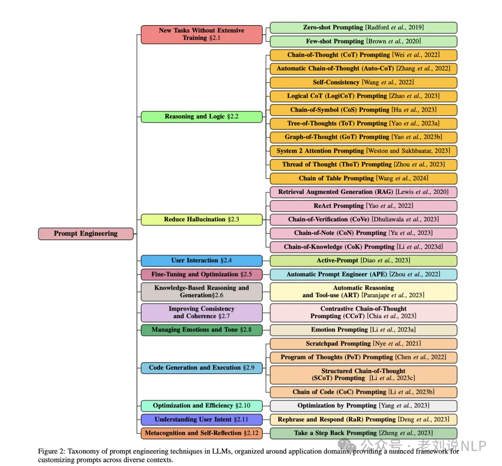

## 基本认识

在语言模型的语境中，提示是指给模型的输入，以引导模型产生输出。基础模型在特定任务上的表现会受到提示的很大影响，而且影响的方式往往出人意料。

例如，最近的研究表明，在GSM8K基准数据集上，模型的性能会有10%以上的变化，而模型的学习参数不会有任何变化。

**1、情境学习（ICL）思路**

情境学习（In Context Learning）是基础模型的一项关键能力，它能让模型从少量任务演示中解决新任务，例如，可以在测试问题之前用几个不同的问题示例和预期结果来创建ICL提示。

ICL不需要更新模型参数，但可以提供类似于微调的效果。少量提示中使用的示例的选择会极大地影响模型的性能。

将提示限制在基本的上下文学习方法上，如固定的1-shot提示50shot提示，GPT-4可以很容易地被引导以出色地完成任务。

**2、思维链（CoT）思路**

思维链（CoT）是一种在引入样本答案之前采用中间推理步骤的提示方法。通过将复杂问题分解成一系列CoT被认为能帮助基础模型生成更准确的答案。

CoT-ICL提示将CoT的中间推理步骤直接整合到fewshot当中。例如，在Med-PaLM工作中，一个临床医生小组被要求为复杂的医学挑战问题量身定制CoT提示。

**可以通过提供训练数据集中的问题、正确答案对来让GPT-4能够自动生成高质量、详细的CoT提示。**

**3、集成（Ensembling）思路** 

集成（Ensembling）是一种将多个模型运行的输出结果进行组合的方案，通过**平均、共识或多数票**等功将单独的输出结果组合起来，从而得出更稳健或更准确的结果。

集成方法采用一种被称为自洽性的技术，使用采样方法产生多个输出结果，然后对这些输出结果进行合并，以确定一个共识输出结果。

其中：

**输出结果的多样性可以通过改变模型生成过程中的"温度"参数来控制。**

**通过重新排序或shuffle少量提示的组件，还可以解决基础模型中常见的位置敏感性****(order sensitivity****)问题，从而提高鲁棒性。**

不过，需要注意的是，虽然集成技术可以提高性能，但其代价是计算需求的增加，比较费token数量。

# **无需训练的新任务prompt策略**

## **Zero-shot Prompting** 零样本提示

Zero-ShotPrompting无需大量训练数据，而是依靠精心设计的提示，引导模型完成新任务。

具体来说，模型在提示中接收到任务描述，但缺乏训练特定输入输出映射的相关数据，模型利用已有的知识，根据新任务的提示生成预测结果。


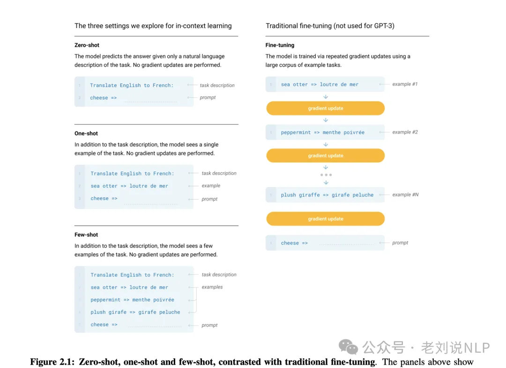

**论文地址：《Language Models are Few-Shot Learners》，https://arxiv.org/abs/2005.14165v4**

如今，经过大量数据训练并调整指令的LLM能够执行零样本任务。我们在前一节中尝试了一些零样本示例。以下是我们使用的一个示例：

*提示：*

```
将文本分类为中性、负面或正面。
文本：我认为这次假期还可以。
情感：
```

*输出：*

```
中性
```

请注意，在上面的提示中，我们没有向模型提供任何示例——这就是零样本能力的作用。

指令调整已被证明可以改善零样本学习[Wei等人（2022）](https://arxiv.org/pdf/2109.01652.pdf)。指令调整本质上是在通过指令描述的数据集上微调模型的概念。此外，[RLHF](https://arxiv.org/abs/1706.03741)（来自人类反馈的强化学习）已被采用以扩展指令调整，其中模型被调整以更好地适应人类偏好。这一最新发展推动了像ChatGPT这样的模型。我们将在接下来的章节中讨论所有这些方法和方法。

当零样本不起作用时，建议在提示中提供演示或示例，这就引出了少样本提示。在下一节中，我们将演示少样本提示。

## **Few-shot Prompting** 少样本提示（上下文学习 In-context learning）

虽然大型语言模型展示了惊人的零样本能力，但**在使用零样本设置时，它们在更复杂的任务上仍然表现不佳**。**少样本提示可以作为一种技术，以启用上下文学习**，我们在提示中提供演示以引导模型实现更好的性能。演示作为后续示例的条件，我们希望模型生成响应。

Few-ShotPrompting为模型提供了一些输入-输出示例，以诱导模型理解给定任务。

与zeroshot相比，即使提供几个高质量的示例，也能提高模型在复杂任务中的表现，不过，fewshot需要额外的标记来包含示例，这对于较长的文本输入来说可能会变得难以承受。

**此外，提示示例的选择和组成也会对模型行为产生重大影响，而偏向频繁出现的单词等偏差仍会影响少量提示的结果。**虽然少量提示增强了复杂任务的处理能力，尤其是在像GPT-3这样的大型预训练模型中，但谨慎的提示设计对于实现最佳性能和减少意外的模型偏差至关重要。

**论文地址：《Language Models are Few-Shot Learners》，https://arxiv.org/abs/2005.14165v4**

根据 [Touvron et al. 2023](https://arxiv.org/pdf/2302.13971.pdf) 等人的在 2023 年的论文，当模型规模足够大时，小样本提示特性开始出现 [(Kaplan et al., 2020)](https://arxiv.org/abs/2001.08361)。

让我们通过[Brown等人2020年](https://arxiv.org/abs/2005.14165)提出的一个例子来演示少样本提示。在这个例子中，任务是在句子中正确使用一个新词。

*提示：*

```
“whatpu”是坦桑尼亚的一种小型毛茸茸的动物。
一个使用whatpu这个词的句子的例子是：我们在非洲旅行时看到了这些非常可爱的whatpus。
“farduddle”是指快速跳上跳下。
一个使用farduddle这个词的句子的例子是：
```

*输出：*

```
当我们赢得比赛时，我们都开始庆祝跳跃。
```

我们可以观察到，模型通过提供一个示例（即1-shot）已经学会了如何执行任务。对于更困难的任务，我们可以尝试增加演示（例如3-shot、5-shot、10-shot等）。

根据[Min等人（2022）](https://arxiv.org/abs/2202.12837)的研究结果，以下是在进行少样本学习时关于演示/范例的一些额外提示：

- “标签空间和演示指定的输入文本的分布都很重要（无论标签是否对单个输入正确）”
- 使用的格式也对性能起着关键作用，即使只是使用随机标签，这也比没有标签好得多。
- 其他结果表明，从真实标签分布（而不是均匀分布）中选择随机标签也有帮助。

让我们尝试一些例子。让我们首先尝试一个随机标签的例子（意味着将标签Negative和Positive随机分配给输入）：

*提示：*

```
这太棒了！// Negative
这太糟糕了！// Positive
哇，那部电影太棒了！// Positive
多么可怕的节目！//
```

*输出：*

```
Negative
```

即使标签已经随机化，我们仍然得到了正确的答案。请注意，我们还保留了格式，这也有助于。实际上，通过进一步的实验，我们发现我们正在尝试的**新GPT模型甚至对随机格式也变得更加稳健**。例如：

*提示：*

```
Positive This is awesome! 
This is bad! Negative
Wow that movie was rad!Positive
What a horrible show! --
```

*输出：*

```
Negative
```

上面的格式不一致，但模型仍然预测了正确的标签。我们必须进行更彻底的分析，以确认这是否适用于不同和更复杂的任务，包括提示的不同变体。

### 少样本提示的限制

标准的少样本提示对许多任务都有效，但仍然不是一种完美的技术，特别是在处理更复杂的推理任务时。让我们演示为什么会这样。您是否还记得之前提供的任务：

```
这组数字中的奇数加起来是一个偶数：15、32、5、13、82、7、1。A：
```

如果我们再试一次，模型输出如下：

```
是的，这组数字中的奇数加起来是107，是一个偶数。
```

这不是正确的答案，这不仅突显了这些系统的局限性，而且需要更高级的提示工程。

让我们尝试添加一些示例，看看少样本提示是否可以改善结果。

*提示：*

```
这组数字中的奇数加起来是一个偶数：4、8、9、15、12、2、1。A：答案是False。
这组数字中的奇数加起来是一个偶数：17、10、19、4、8、12、24。A：答案是True。
这组数字中的奇数加起来是一个偶数：16、11、14、4、8、13、24。A：答案是True。
这组数字中的奇数加起来是一个偶数：17、9、10、12、13、4、2。A：答案是False。
这组数字中的奇数加起来是一个偶数：15、32、5、13、82、7、1。A：
```

*输出：*

```
答案是True。
```

这没用。似乎少样本提示不足以获得这种类型的推理问题的可靠响应。上面的示例提供了任务的基本信息。**如果您仔细观察，我们引入的任务类型涉及几个更多的推理步骤。换句话说，如果我们将问题分解成步骤并向模型演示，这可能会有所帮助**。最近，[思维链（CoT）提示](https://arxiv.org/abs/2201.11903)已经流行起来，以解决更复杂的算术、常识和符号推理任务。

总的来说，提供示例对解决某些任务很有用。当零样本提示和少样本提示不足时，这可能意味着模型学到的东西不足以在任务上表现良好。从这里开始，建议开始考虑微调您的模型或尝试更高级的提示技术。接下来，我们将讨论一种流行的提示技术，称为思维链提示，它已经获得了很多关注。


# **逻辑推理Reasoning and Logic的prompt策略**

**在逻辑推理Reasoning and Logic方面**，包括以下几种：

Chain-of-Thought Prompting 链式思考（CoT）
--------------------------

面对复杂的推理，LLM经常会磕磕绊绊，从而限制了其潜力。为了弥补这一缺陷，思维链（CoT）提示技术，作为一种以促进连贯和逐步推理过程的方式提示LLMs能有效地诱导LLM做出更有条理、更深思熟虑的回答。

例如，提示将显示一个多步骤数学问题的推理过程和最终答案，并模仿人类如何将问题分解为逻辑中间步骤。

**论文地址：《Chain-of-Thought Prompting Elicits Reasoning in Large Language Models》，https://arxiv.org/pdf/2201.11903.pdf**

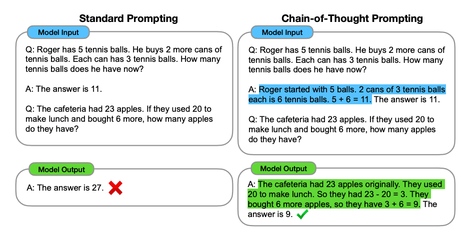

图片来源：[Wei 等人（2022） ](https://arxiv.org/abs/2201.11903)

在 [Wei 等人（2022） ](https://arxiv.org/abs/2201.11903) 中引入的链式思考（CoT）提示通过中间推理步骤实现了复杂的推理能力。您可以将其与少样本提示相结合，以获得更好的结果，以便在回答之前进行推理的更复杂的任务。

_提示：_

```
这组数中的奇数加起来是偶数：4、8、9、15、12、2、1。
A：将所有奇数相加（9、15、1）得到25。答案为False。
这组数中的奇数加起来是偶数：17、10、19、4、8、12、24。
A：将所有奇数相加（17、19）得到36。答案为True。
这组数中的奇数加起来是偶数：16、11、14、4、8、13、24。
A：将所有奇数相加（11、13）得到24。答案为True。
这组数中的奇数加起来是偶数：17、9、10、12、13、4、2。
A：将所有奇数相加（17、9、13）得到39。答案为False。
这组数中的奇数加起来是偶数：15、32、5、13、82、7、1。
A：
```

_输出：_

```
将所有奇数相加（15、5、13、7、1）得到41。答案为False。
```

哇！我们可以看到在提供推理步骤时得到了完美的结果。实际上，我们可以通过提供更少的示例来解决此任务，即仅一个示例似乎就足够了：

_提示：_

```
这组数中的奇数加起来是偶数：4、8、9、15、12、2、1。
A：将所有奇数相加（9、15、1）得到25。答案为False。
这组数中的奇数加起来是偶数：15、32、5、13、82、7、1。
A：
```

_输出：_

```
将所有奇数相加（15、5、13、7、1）得到41。答案为False。
```

请记住，作者声称这是足够大的语言模型才会出现的新兴能力。

### 零样本 COT 提示

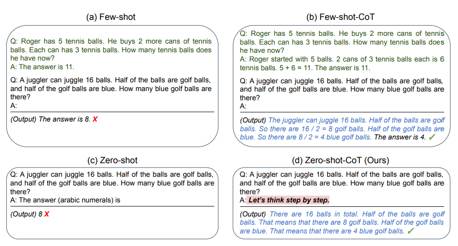

图片来源：[Kojima 等人（2022） ](https://arxiv.org/abs/2205.11916)

最近提出的一个新想法是 [零样本 CoT ](https://arxiv.org/abs/2205.11916)（ Kojima 等人，2022 年），它基本上**涉及将 “让我们逐步思考” 添加到原始提示中**。让我们尝试一个简单的问题，看看模型的表现如何：

_提示：_

```
我去市场买了10个苹果。我给了邻居2个苹果和修理工2个苹果。然后我去买了5个苹果并吃了1个。我还剩下多少苹果？
```

_输出：_

```
11个苹果
```

答案是不正确的！现在让我们尝试使用特殊提示。

_提示：_

```
我去市场买了10个苹果。我给了邻居2个苹果和修理工2个苹果。然后我去买了5个苹果并吃了1个。我还剩下多少苹果？
让我们逐步思考。
```

_输出：_

```
首先，您从10个苹果开始。
您给了邻居和修理工各2个苹果，所以您还剩下6个苹果。
然后您买了5个苹果，所以现在您有11个苹果。
最后，您吃了1个苹果，所以您还剩下10个苹果。
```

令人印象深刻的是，**这个简单的提示在这个任务中非常有效**。这在您没有太多示例可用于提示时特别有用。

**Automatic Chain-of-Thought 自动思维链(Auto-CoT)**  
---------------------------------

手工创建高质量的CoT示例既耗时又不理想，Auto-CoT，通过“Let'sthinkstep”提示自动指导大模型生成推理链。考虑到在单独生成的链中存在误差的可能性，Auto-CoT通过不同的采样来增强鲁棒性，通过对各种问题进行采样，并为每个问题生成多个不同的推理链，形成最终的示例集合，这种自动化的多样化采样最大限度地减少了错误。

当使用思维链提示时，这个过程需要手工制作有效且多样化的例子。这种手动工作可能会导致次优解决方案。[Zhang et al. （2022） ](https://arxiv.org/abs/2210.03493) 提出了一种消除人工的方法，即利用 LLMs “让我们一步一步地思考” 提示来生成一个接一个的推理链。这种自动过程仍然可能在生成的链中出现错误。为了减轻错误的影响，演示的多样性很重要。这项工作提出了 Auto-CoT，它对具有多样性的问题进行采样，并生成推理链来构建演示。

Auto-CoT 主要由两个阶段组成：

*   阶段 1：**问题聚类**：将给定问题划分为几个聚类
*   阶段 2：**演示抽样**：从每组数组中选择一个具有代表性的问题，并使用带有简单启发式的 Zero-Shot-CoT 生成其推理链

简单的启发式方法可以是问题的长度（例如，60 个 tokens）和理由的步骤数（例如，5 个推理步骤）。这鼓励模型使用简单而准确的演示。

该过程如下图所示：

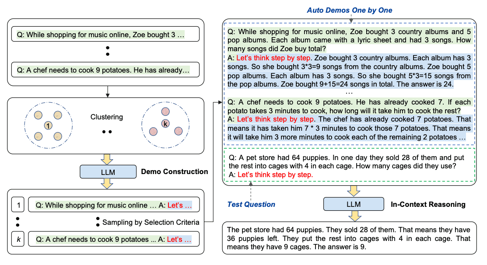

图片来源：[Zhang 等人（2022） ](https://arxiv.org/abs/2210.03493)

Auto-CoT 的代码可在这里找到：[Github ](https://github.com/amazon-science/auto-cot)。

**Self-Consistency**  自我一致性
-----

也许在提示工程中更高级的技术之一是自我一致性。由 [Wang 等人（2022） ](https://arxiv.org/pdf/2203.11171.pdf) 提出，自我一致性旨在 “**替换链式思维提示中使用的天真贪婪解码方法**”。其想法是**通过少样本 CoT 采样多个不同的推理路径，并使用生成结果选择最一致的答案**。这有助于提高 CoT 提示在涉及算术和常识推理的任务中的性能。

Self-Consistency 在CoT提示中引入了自一致性解码策略，与贪婪解码相比，这种解码策略可以提高推理性能。对于具有多个有效路径的复杂推理任务，自一致性Self-Consistency通过从语言模型的解码器中采样产生不同的推理链。然后，通过边缘化这些采样链来确定最一致的最终答案。这种方法利用了需要深思熟虑的分析的问题往往需要更大的推理多样性，最终生成解决方案。

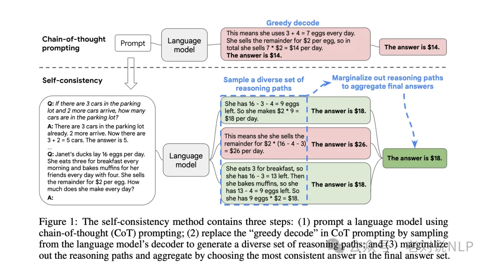

**论文地址：《 Self-consistency improves chain of thought reasoning in language models》，https://arxiv.org/pdf/2203.11171.pdf**

让我们尝试以下算术推理示例：

_提示：_

```
当我6岁时，我的妹妹是我的一半年龄。现在我70岁了，我的妹妹多大？
```

_输出：_

```
35
```

输出是错误的！我们如何通过自我一致性来改进这个问题？让我们试试。我们将使用 Wang 等人 2022 年的少量样本范例（表 17 ）：

_提示：_

```
Q：林中有15棵树。林业工人今天将在林中种树。完成后，将有21棵树。林业工人今天种了多少棵树？
A：我们从15棵树开始。后来我们有21棵树。差异必须是他们种树的数量。因此，他们必须种了21-15 = 6棵树。答案是6。
Q：停车场有3辆汽车，又来了2辆汽车，停车场有多少辆汽车？
A：停车场已经有3辆汽车。又来了2辆。现在有3 + 2 = 5辆汽车。答案是5。
Q：Leah有32块巧克力，她的姐姐有42块。如果他们吃了35块，他们总共还剩多少块？
A：Leah有32块巧克力，Leah的姐姐有42块。这意味着最初有32 + 42 = 74块巧克力。已经吃了35块。因此，他们总共还剩74-35 = 39块巧克力。答案是39。
Q：Jason有20个棒棒糖。他给Denny一些棒棒糖。现在Jason只有12个棒棒糖。Jason给Denny多少棒棒糖？
A：Jason有20个棒棒糖。因为他现在只有12个，所以他必须把剩下的给Denny。他给Denny的棒棒糖数量必须是20-12 = 8个棒棒糖。答案是8。
Q：Shawn有五个玩具。圣诞节，他从他的父母那里得到了两个玩具。他现在有多少个玩具？
A：他有5个玩具。他从妈妈那里得到了2个，所以在那之后他有5 + 2 = 7个玩具。然后他从爸爸那里得到了2个，所以总共他有7 + 2 = 9个玩具。答案是9。
Q：服务器房间里有9台计算机。从周一到周四，每天都会安装5台计算机。现在服务器房间里有多少台计算机？
A：从周一到周四有4天。每天都添加了5台计算机。这意味着总共添加了4 * 5 =
20台计算机。一开始有9台计算机，所以现在有9 + 20 = 29台计算机。答案是29。
Q：Michael有58个高尔夫球。星期二，他丢失了23个高尔夫球。星期三，他又丢失了2个。星期三结束时他还剩多少个高尔夫球？
A：Michael最初有58个球。星期二他丢失了23个，所以在那之后他有58-23 = 35个球。星期三他又丢失了2个，所以现在他有35-2 = 33个球。答案是33。
Q：Olivia有23美元。她用每个3美元的价格买了五个百吉饼。她还剩多少钱？
A：她用每个3美元的价格买了5个百吉饼。这意味着她花了15美元。她还剩8美元。
Q：当我6岁时，我的妹妹是我的一半年龄。现在我70岁了，我的妹妹多大？
A：
```

_输出 1：_

```
当我6岁时，我的妹妹是我的一半年龄，也就是3岁。现在我70岁了，所以她是70-3 = 67岁。答案是67。
```

_输出 2：_

```
当叙述者6岁时，他的妹妹是他年龄的一半，也就是3岁。现在叙述者70岁了，他的妹妹应该是70-3 = 67岁。答案是67。
```

_输出 3：_

```
当我6岁时，我的妹妹是我的一半年龄，也就是3岁。现在我70岁了，所以她是70/2 = 35岁。答案是35。
```

计算最终答案涉及几个步骤（详见论文），但为了简单起见，我们可以看到已经出现了大多数答案，因此这基本上将成为最终答案。

## **Logical CoT (LogiCoT) Prompting**

执行逻辑推理的能力对于llm解决跨不同领域的复杂、多步骤问题至关重要。如CoT提示，鼓励逐步推理，但缺乏有效的验证机制。逻辑思维链(LogiCoT)提示，**利用符号逻辑的原则以连贯和结构化的方式增强推理**。

具体来说，LogiCoT运用归谬论的概念来验证模型生成的推理的每一步，并提供有针对性的反馈来修正不正确的步骤。LogiCoT可以通过思考-验证-修改循环减少逻辑错误和幻觉。

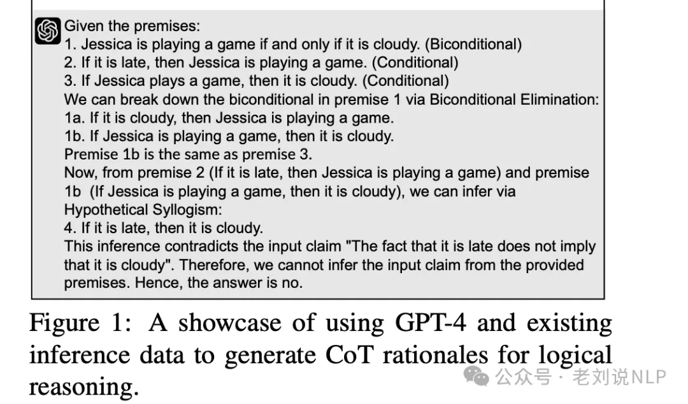

**论文地址：《LogiCoT: Logical Chain-of-Thought Instruction-Tuning》，https://arxiv.org/pdf/2305.12147.pdf**

## **Chain-of-Symbol (CoS) Prompting**

大模型经常在涉及复杂空间关系的任务中挣扎，因为他们依赖于自然语言，容易产生歧义和偏见。为了克服这一限制，**CoS使用浓缩符号代替自然语言**。

CoS提供了清晰简洁的提示，提高了llm的空间推理能力，并提高了人类的可解释性，但也面临着诸如可伸缩性、通用性、内嵌性等挑战。

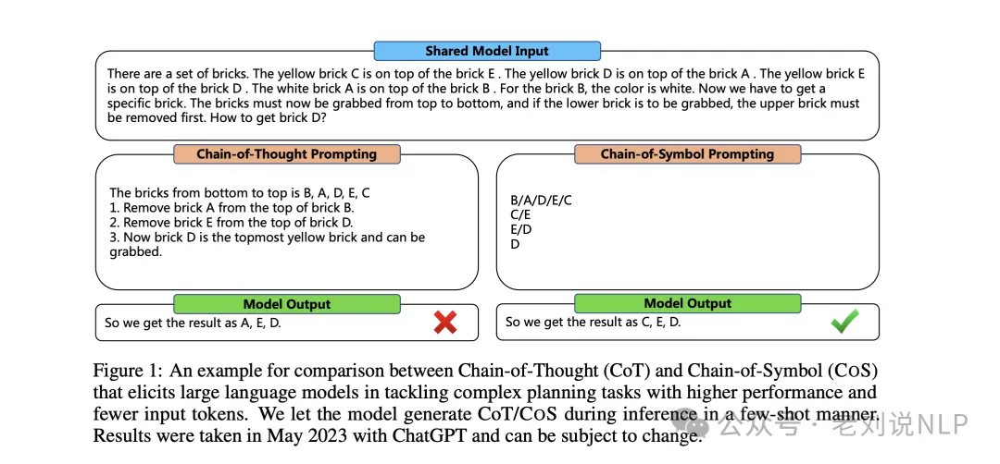

**论文地址：《Chain-of-Symbol Prompting Elicits Planning in Large Langauge Models》，https://arxiv.org/pdf/2305.10276.pdf**

**Tree-of-Thoughts (ToT) Prompting** 思维树 (ToT)
---------

对于需要探索或预判战略的复杂任务来说，传统或简单的提示技巧是不够的。最近，[Yao et el. (2023) ](https://arxiv.org/abs/2305.10601) 提出了思维树（Tree of Thoughts，ToT）框架，该框架基于思维链提示进行了总结，引导语言模型探索把思维作为中间步骤来解决通用问题。

**ToT 维护着一棵思维树，思维由连贯的语言序列表示，这个序列就是解决问题的中间步骤。使用这种方法，LM 能够自己对严谨推理过程的中间思维进行评估。LM 将生成及评估思维的能力与搜索算法（如广度优先搜索和深度优先搜索）相结合，在系统性探索思维的时候可以向前验证和回溯。**

ToT 框架原理如下：

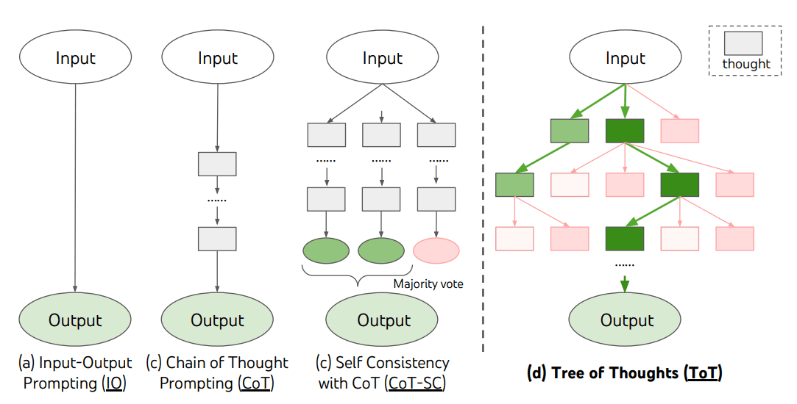

图片援引自：[Yao et el. (2023) ](https://arxiv.org/abs/2305.10601)

ToT 需要针对不同的任务定义思维 / 步骤的数量以及每步的候选项数量。例如，论文中的 “算 24 游戏” 是一种数学推理任务，需要分成 3 个思维步骤，每一步都需要一个中间方程。而每个步骤保留最优的（best） 5 个候选项。

ToT 完成算 24 的游戏任务要执行广度优先搜索（BFS），每步思维的候选项都要求 LM 给出能否得到 24 的评估：“sure/maybe/impossible”（一定能 / 可能 / 不可能） 。作者讲到：“目的是得到经过少量向前尝试就可以验证正确（sure）的局部解，基于‘太大 / 太小’的常识消除那些不可能（impossible）的局部解，其余的局部解作为‘maybe’保留。” 每步思维都要抽样得到 3 个评估结果。整个过程如下图所示：

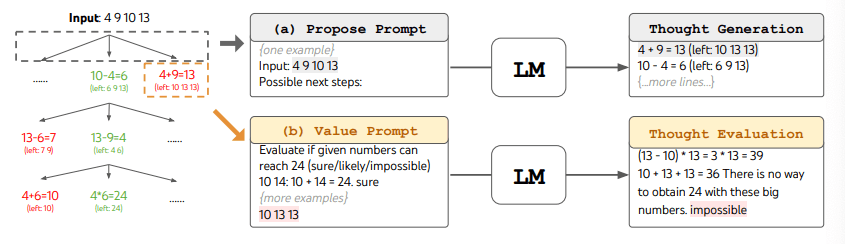

图片援引自：[Yao et el. (2023) ](https://arxiv.org/abs/2305.10601)

从下图中报告的结果来看，ToT 的表现大大超过了其他提示方法：

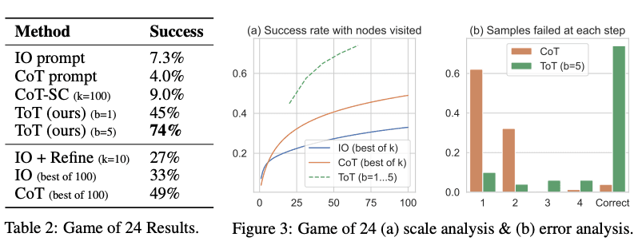

图片援引自：[Yao et el. (2023) ](https://arxiv.org/abs/2305.10601)

[这里 ](https://github.com/princeton-nlp/tree-of-thought-llm) 还有[这里 ](https://github.com/jieyilong/tree-of-thought-puzzle-solver) 可以找到代码例子。

从大方向上来看，[Yao et el. (2023) ](https://arxiv.org/abs/2305.10601) 和 [Long (2023) ](https://arxiv.org/abs/2305.08291) 的核心思路是类似的。两种方法都是以多轮对话搜索树的形式来增强 LLM 解决复杂问题的能力。主要区别在于 [Yao et el. (2023) ](https://arxiv.org/abs/2305.10601) 采用了深度优先（DFS）/ 广度优先（BFS）/ 集束（beam）搜索，而 [Long (2023) ](https://arxiv.org/abs/2305.08291) 则提出由强化学习（Reinforcement Learning）训练出的 “ToT 控制器”（ToT Controller）来驱动树的搜索策略 (包括什么时候回退和搜索到哪一级回退等等)。深度优先 / 广度优先 / 集束搜索是通用搜索策略，并不针对具体问题。相比之下，由强化学习训练出的 ToT 控制器有可能从新的数据集学习，或是在自对弈（AlphaGo vs. 蛮力搜索）的过程中学习。因此，即使采用的是冻结的 LLM，基于强化学习构建的 ToT 系统仍然可以不断进化，学习新的知识。

[Hulbert (2023) ](https://github.com/dave1010/tree-of-thought-prompting) 提出了思维树（ToT）提示法，将 ToT 框架的主要概念概括成了一段简短的提示词，指导 LLM 在一次提示中对中间思维做出评估。ToT 提示词的例子如下：

```
假设三位不同的专家来回答这个问题。
所有专家都写下他们思考这个问题的第一个步骤，然后与大家分享。
然后，所有专家都写下他们思考的下一个步骤并分享。
以此类推，直到所有专家写完他们思考的所有步骤。
只要大家发现有专家的步骤出错了，就让这位专家离开。
请问...
```


# **减少幻觉Reduce Hallucination常用策略**

生成知识提示（先要求生成相关知识再基于知识回答）
------

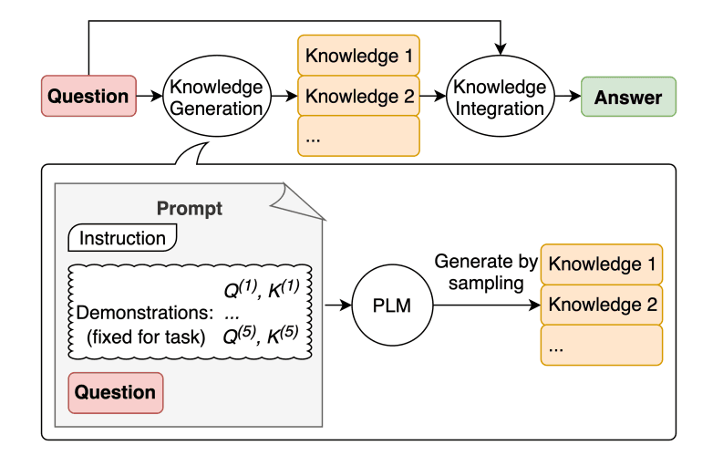

图片来源：[Liu 等人 2022 ](https://arxiv.org/pdf/2110.08387.pdf)

LLM 继续得到改进，其中一种流行的技术是能够融合知识或信息，以帮助模型做出更准确的预测。

使用类似的思路，模型是否也可以在做出预测之前用于生成知识呢？这就是 [Liu 等人 2022 ](https://arxiv.org/pdf/2110.08387.pdf) 的论文所尝试的——生成知识以作为提示的一部分。特别是，这对于常识推理等任务有多大帮助？

让我们尝试一个简单的提示：

_提示：_

```
高尔夫球的一部分是试图获得比其他人更高的得分。是或否？
```

_输出：_

```
是。
```

这种错误揭示了 **LLM 在执行需要更多关于世界的知识的任务时的局限性**。我们如何通过生成知识来改进呢？

首先，我们生成一些 “知识”：

_提示：_

```
输入：希腊比墨西哥大。
知识：希腊的面积约为131,957平方公里，而墨西哥的面积约为1,964,375平方公里，使墨西哥比希腊大了1,389%。
输入：眼镜总是会起雾。
知识：当你的汗水、呼吸和周围的湿度中的水蒸气落在冷的表面上，冷却并变成微小的液滴时，会在眼镜镜片上产生冷凝。你看到的是一层薄膜。你的镜片相对于你的呼吸会比较凉，尤其是当外面的空气很冷时。
输入：鱼有思考能力。
知识：鱼比它们看起来更聪明。在许多领域，如记忆力，它们的认知能力与或超过非人类灵长类动物等“更高级”的脊椎动物。鱼的长期记忆帮助它们跟踪复杂的社交关系。
输入：一个人一生中吸烟很多香烟的常见影响是患肺癌的几率高于正常水平。
知识：那些一生中平均每天吸烟不到一支香烟的人，患肺癌的风险是从不吸烟者的9倍。在每天吸烟1到10支香烟之间的人群中，死于肺癌的风险几乎是从不吸烟者的12倍。
输入：一块石头和一颗卵石大小相同。
知识：卵石是一种根据Udden-Wentworth沉积学尺度的颗粒大小为4到64毫米的岩屑。卵石通常被认为比颗粒（直径2到4毫米）大，比卵石（直径64到256毫米）小。
输入：高尔夫球的一部分是试图获得比其他人更高的得分。
知识：
```

_知识 1：_

```
高尔夫球的目标是以最少的杆数打完一组洞。一轮高尔夫球比赛通常包括18个洞。每个洞在标准高尔夫球场上一轮只打一次。每个杆计为一分，总杆数用于确定比赛的获胜者。
```

_知识 2：_

```
高尔夫球是一项精密的球杆运动，竞争选手（或高尔夫球手）使用许多类型的球杆，用最少的杆数将球打入球场上一系列洞中。目标是以最低的分数完成比赛，该分数是通过将每个洞上所用的杆数相加计算出来的。得分最低的选手赢得比赛。
```

我们使用 [Liu 等人 2022 ](https://arxiv.org/pdf/2110.08387.pdf) 的论文中提供的提示。

下一步是将知识整合并得出预测。我将问题重新格式化为 QA 格式，以指导答案格式。

_提示：_

```
问题：高尔夫球的一部分是试图获得比其他人更高的得分。是或否？
知识：高尔夫球的目标是以最少的杆数打完一组洞。一轮高尔夫球比赛通常包括18个洞。每个洞在标准高尔夫球场上一轮只打一次。每个杆计为一分，总杆数用于确定比赛的获胜者。
解释和答案： 
```

_答案 1（置信度非常高）：_

```
不是，高尔夫球的目标不是获得比其他人更高的得分。相反，目标是以最少的杆数打完一组洞。总杆数用于确定比赛的获胜者，而不是总得分。
```

```
问题：高尔夫球的一部分是试图获得比其他人更高的得分。是或否？
知识：高尔夫球是一项精密的球杆运动，竞争选手（或高尔夫球手）使用许多类型的球杆，用最少的杆数将球打入球场上一系列洞中。目标是以最低的分数完成比赛，该分数是通过将每个洞上所用的杆数相加计算出来的。得分最低的选手赢得比赛。
解释和答案：
```

_答案 2（置信度要低得多）：_

```
是的，高尔夫球的一部分是试图获得比其他人更高的得分。每个选手都试图以最少的杆数打完一组洞。总杆数用于确定比赛的获胜者，而不是总得分。得分最低的选手赢得比赛。
```

这个例子发生了一些非常有趣的事情。在第一个答案中，模型非常自信，但在第二个答案中不太自信。我简化了过程以进行演示，但在得出最终答案时还有一些细节需要考虑。请查看论文以了解更多。

## 检索增强生成 (RAG)

通用语言模型通过微调就可以完成几类常见任务，比如分析情绪和识别命名实体。这些任务不需要额外的背景知识就可以完成。

**要完成更复杂和知识密集型的任务，可以基于语言模型构建一个系统，访问外部知识源来做到**。这样的实现与事实更加一性，生成的答案更可靠，还有助于缓解“幻觉”问题。

Meta AI 的研究人员引入了一种叫做[检索增强生成（Retrieval Augmented Generation，RAG）](https://ai.facebook.com/blog/retrieval-augmented-generation-streamlining-the-creation-of-intelligent-natural-language-processing-models/)的方法来完成这类知识密集型的任务。RAG 把一个信息检索组件和文本生成模型结合在一起。RAG 可以微调，其内部知识的修改方式很高效，不需要对整个模型进行重新训练。

RAG 会接受输入并检索出一组相关/支撑的文档，并给出文档的来源（例如维基百科）。这些文档作为上下文和输入的原始提示词组合，送给文本生成器得到最终的输出。这样 RAG 更加适应事实会随时间变化的情况。这非常有用，因为 LLM 的参数化知识是静态的。RAG 让语言模型不用重新训练就能够获取最新的信息，基于检索生成产生可靠的输出。

Lewis 等人（2021）提出一个通用的 RAG 微调方法。这种方法使用预训练的 seq2seq 作为参数记忆，用维基百科的密集向量索引作为非参数记忆（使通过神经网络预训练的检索器访问）。这种方法工作原理概况如下：

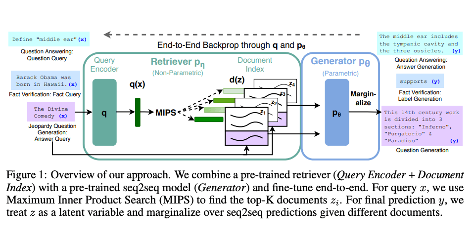

图片援引自: [Lewis et el. (2021)](https://arxiv.org/pdf/2005.11401.pdf)

RAG 在 [Natural Questions](https://ai.google.com/research/NaturalQuestions)、[WebQuestions](https://paperswithcode.com/dataset/webquestions) 和 CuratedTrec 等基准测试中表现抢眼。用 MS-MARCO 和 Jeopardy 问题进行测试时，RAG 生成的答案更符合事实、更具体、更多样。FEVER 事实验证使用 RAG 后也得到了更好的结果。

这说明 RAG 是一种可行的方案，能在知识密集型任务中增强语言模型的输出。

最近，基于检索器的方法越来越流行，经常与 ChatGPT 等流行 LLM 结合使用来提高其能力和事实一致性。

LangChain 文档中可以找到[一个使用检索器和 LLM 回答问题并给出知识来源的简单例子](https://python.langchain.com/docs/use_cases/question_answering/quickstart)。


## ReAct 框架

从 [Yao 等人，2022](https://arxiv.org/abs/2210.03629) 引入了一个框架，其中 LLMs 以交错的方式生成 *推理轨迹* 和 *任务特定操作* 。

生成推理轨迹使模型能够诱导、跟踪和更新操作计划，甚至处理异常情况。操作步骤允许与外部源（如知识库或环境）进行交互并且收集信息。

ReAct 框架允许 LLMs 与外部工具交互来获取额外信息，从而给出更可靠和实际的回应。

结果表明，ReAct 可以在语言和决策任务上的表现要高于几个最先进水准要求的的基线。ReAct 还提高了 LLMs 的人类可解释性和可信度。总的来说，作者发现了将 ReAct 和链式思考 (CoT) 结合使用的最好方法是在推理过程同时使用内部知识和获取到的外部信息。

### 它是如何运作的?

ReAct 的灵感来自于 “行为” 和 “推理” 之间的协同作用，正是这种协同作用使得人类能够学习新任务并做出决策或推理。

链式思考 (CoT) 提示显示了 LLMs 执行推理轨迹以生成涉及算术和常识推理的问题的答案的能力，以及其他任务 [(Wei 等人，2022)](https://arxiv.org/abs/2201.11903)。但它因缺乏和外部世界的接触或无法更新自己的知识，而导致事实幻觉和错误传播等问题。

ReAct 是一个将推理和行为与 LLMs 相结合通用的范例。ReAct 提示 LLMs 为任务生成口头推理轨迹和操作。这使得系统执行动态推理来创建、维护和调整操作计划，同时还支持与外部环境(例如，Wikipedia)的交互，以将额外信息合并到推理中。下图展示了 ReAct 的一个示例以及执行问题回答所涉及的不同步骤。

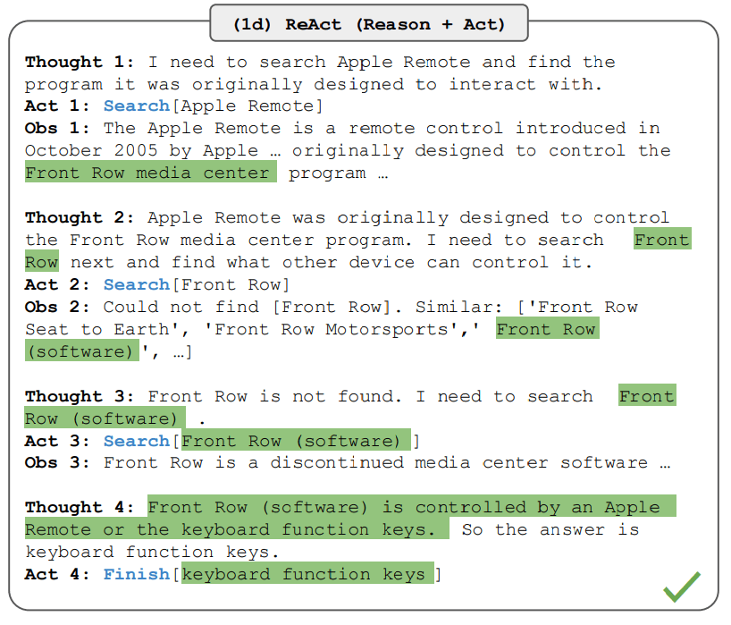

图片来源：[Yao等人，2022](https://arxiv.org/abs/2210.03629)

在上面的例子中，我们将如下问题作为提示给出，该问题出自 [HotpotQA](https://hotpotqa.github.io/)：

```
除了苹果遥控器，还有哪些设备可以控制苹果遥控器最初设计用来交互的程序?
```


请注意，上下文中的示例也被添加到提示符中，但为了简单起见，我们在这里排除了它。我们可以看到，该模型生成了 “任务解决轨迹” (思考，行动)。Obs 对应与之交互的环境的观察 (例如搜索引擎)。从本质上讲，ReAct 可以检索信息来支持推理，而推理则有助于确定下一步检索的目标。

### ReAct 提示

为了更好的阐释 ReAct 提示是如何运作的，我们继续跟随论文的示例。

第一步是从训练集 (例如 HotPotQA) 中选择案例，并组成 ReAct 格式的轨迹。这些在提示中作为少样本示例。轨迹由多思考-操作-观察步骤组成，如图所示。自由形式的思考用来完成不同的任务，如分解问题、提取信息、执行常识或算术推理、引导搜索公式和合成最终答案。

下面是一个 ReAct 提示的示例(摘自论文，为简单起见缩短为一个示例):

```
问题 科罗拉多造山带东部区域延伸到的区域的海拔范围是多少?思考 1 我需要搜索科罗拉多造山带，找到科罗拉多造山带东段延伸的区域，然后找到该区域的海拔范围。操作 1 搜索 [科罗拉多造山带]观察 1 科罗拉多造山带是科罗拉多及其周边地区造山运动的一段。思考 2 它没有提到东部地区。所以我需要查一下东部地区。操作 2 查找 [东部地区]观察 2 (结果 1 / 1) 东部区域延伸至高平原，称为中原造山带。思考 3 科罗拉多造山运动的东部区域延伸到高平原。所以我需要搜索高平原，找到它的海拔范围。操作 3 搜索 [高平原]观察 3 高平原指的是两个截然不同的陆地区域之一。思考 4 我需要搜索高平原（美国）操作 4 搜索 [高平原（美国）]观察 4 高平原是大平原的一个分区。从东到西，高平原的海拔从 1800 到 7000 英尺 (550 到 2130 米) 不等。[3]思考 5 高平原海拔高度从 1800 到 7000 英尺，所以答案是 1800 到 7000 英尺。操作 5 结束 [1800 到 7000 英尺]...
```


请注意，不同的提示设置用于不同类型的任务。对那些以推理为主要目标的任务 (例如 HotpotQA)，多思考-操作-观察步骤用于任务-解决轨迹。对于涉及许多操作步骤的决策任务来说，则较少使用思考。


## 自动推理并使用工具 (ART)

使用 LLM 完成任务时，**交替运用 CoT 提示和工具**已经被证明是一种即强大又稳健的方法。这类方法通常需要针对特定任务手写示范，还需要精心编写交替使用生成模型和工具的脚本。[Paranjape et al., (2023)](https://arxiv.org/abs/2303.09014)提出了一个新框架，该框架使用冻结的 LLM 来自动生成包含中间推理步骤的程序。

ART（Automatic Reasoning and Tool-use）的工作原理如下：

- 接到一个新任务的时候，从任务库中选择多步推理和使用工具的示范。
- 在测试中，调用外部工具时，先暂停生成，将工具输出整合后继续接着生成。

ART 引导模型总结示范，将新任务进行拆分并在恰当的地方使用工具。ART 采用的是零样本形式。ART 还可以手动扩展，只要简单地更新任务和工具库就可以修正推理步骤中的错误或是添加新的工具。这个过程如下：

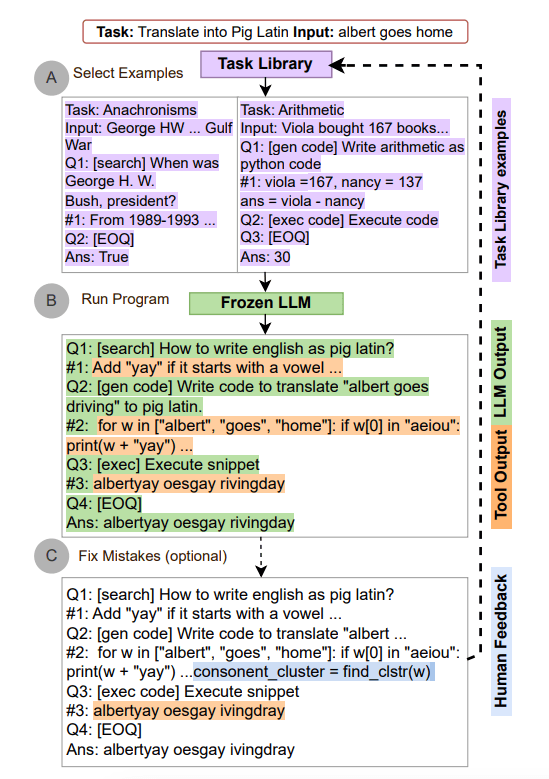

图片援引自: [Paranjape et al., (2023)](https://arxiv.org/abs/2303.09014)

在 BigBench 和 MMLU 基准测试中，ART 在未见任务上的表现大大超过了少样本提示和自动 CoT；配合人类反馈后，其表现超过了手写的 CoT 提示。

下面这张表格展示了 ART 在 BigBench 和 MMLU 任务上的表现：

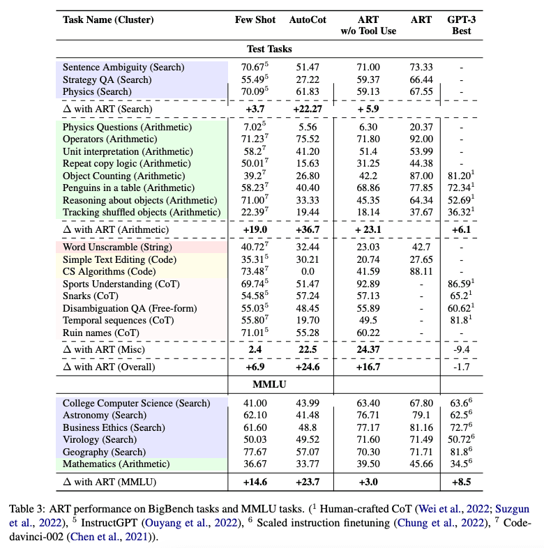

图片援引自: [Paranjape et al., (2023)](https://arxiv.org/abs/2303.09014)


## **Chain-of-Verification (CoVe)：**

验证链(CoVe)涉及一个系统的四步过程，包括模型生成基线回复，计划验证问题以检查其工作，独立回答问题，并生成包含验证的修订回复。通过这种深思熟虑的多步骤方法验证其工作，LLM提高了逻辑推理能力，即使在矛盾的信息中也减少了错误。

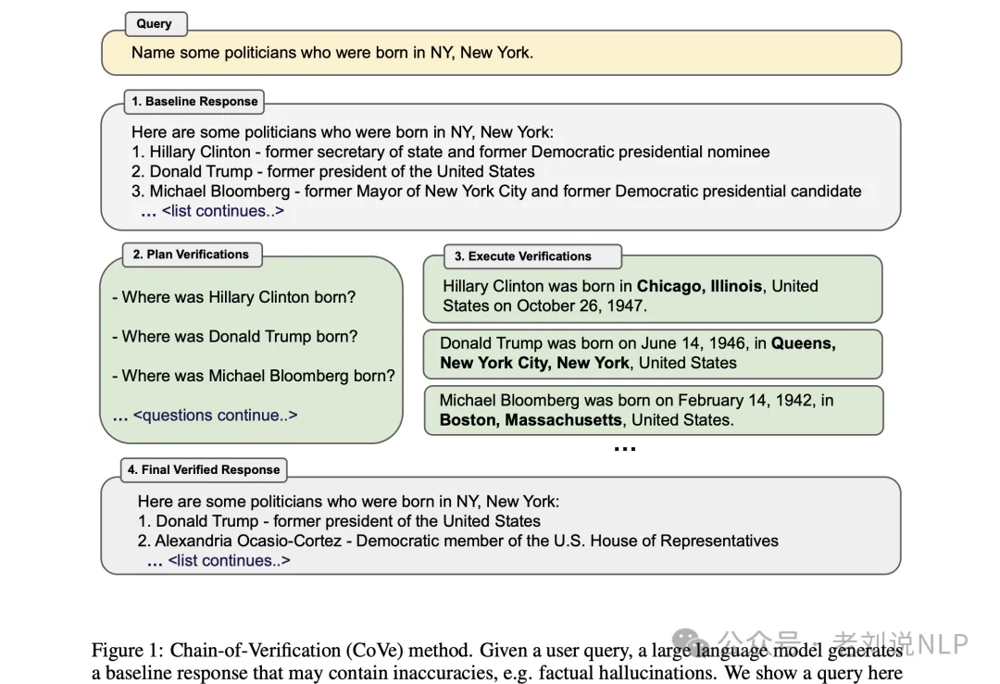

**论文地址：《Chain-of-Verification Reduces Hallucination in Large Language Models》，https://arxiv.org/pdf/2309.11495.pdf**


## 自我反思（Reflexion）

自我反思是一个通过语言反馈来强化基于语言的智能体的框架。根据 [Shinn et al. (2023)](https://arxiv.org/pdf/2303.11366.pdf)，“自我反思是一种‘口头’强化的新范例，它将策略参数化为智能体的记忆编码与 LLM 的参数选择配对。”

在高层次上，自我反思将来自环境的反馈（自由形式的语言或者标量）转换为语言反馈，也被称作 **self-reflection**，为下一轮中 LLM 智能体提供上下文。这有助于智能体快速有效地从之前的错误中学习，进而提升许多高级任务的性能。

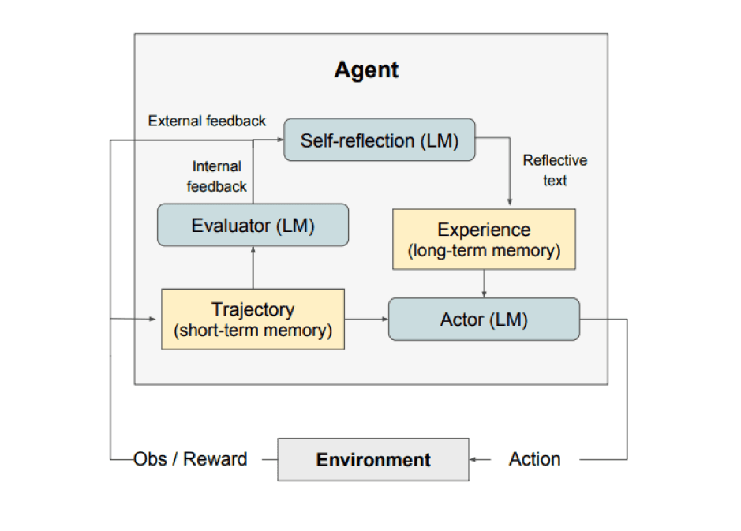

如上图所示，自我反思由三个不同的模型组成：

- **参与者（Actor）**：根据状态观测量生成文本和动作。参与者在环境中采取行动并接受观察结果，从而形成轨迹。[链式思考（CoT）](https://www.promptingguide.ai/techniques/cot) 和 [ReAct](https://www.promptingguide.ai/techniques/react) 被用作参与者模型。此外，还添加了记忆组件为智能体提供额外的上下文信息。
- **评估者（Evaluator）**：对参与者的输出进行评价。具体来说，它将生成的轨迹（也被称作短期记忆）作为输入并输出奖励分数。根据人物的不同，使用不同的奖励函数（决策任务使用LLM和基于规则的启发式奖励）。
- **自我反思（Self-Reflection）**：生成语言强化线索来帮助参与者实现自我完善。这个角色由大语言模型承担，能够为未来的试验提供宝贵的反馈。自我反思模型利用奖励信号、当前轨迹和其持久记忆生成具体且相关的反馈，并存储在记忆组件中。智能体利用这些经验（存储在长期记忆中）来快速改进决策。

总的来说，自我反思的关键步骤是a)定义任务，b)生成轨迹，c)评估，d)执行自我反思，e)生成下一条轨迹。下图展示了自我反思的智能体学习迭代优化其行为来解决决策、编程和推理等各种人物的例子。自我反思（Refelxion）通过引入自我评估、自我反思和记忆组件来拓展 ReAct 框架。

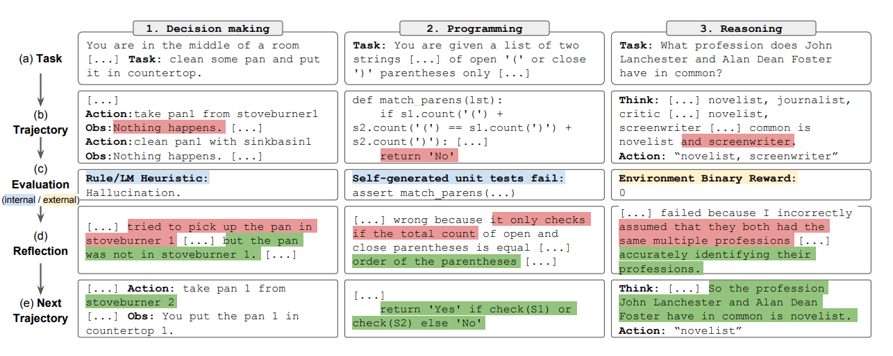

### 结果

实验结果表明，自我反思能够显著提高 AlfWorld 上的决策任务、HotPotQA 中的问题推理以及在 HumanEval 上的 Python 编程任务性能。

在序列决策 (AlfWorld) 任务上进行评估时，ReAct + Reflexion 用启发式和 GPT 的自我评估进行二元分类，完成了 130/134 项任务，显着优于 ReAct。

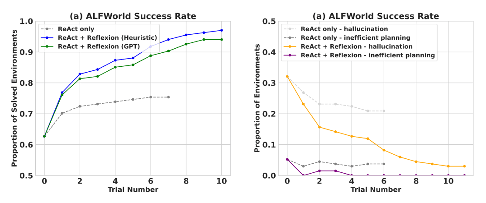

在仅仅几个学习步骤中，自我反思显著优于所有基线方法。仅对于推理以及添加由最近轨迹组成的情景记忆时，Reflexion + CoT 的性能分别优于仅 CoT 和具有情景记忆的 CoT。

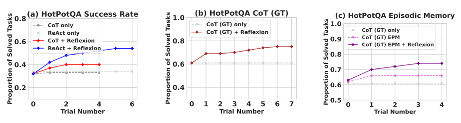

如下表所示，在 MBPP、HumanEval 和 Leetcode Hard 上编写 Python 和 Rust 代码时，Reflexion 通常优于之前的 SOTA 方法。

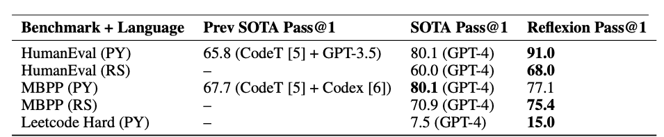

### 何时自我反思？

自我反思最适合以下情况：

1. **智能体需要从尝试和错误中学习**：自我反思旨在通过反思过去的错误并将这些知识纳入未来的决策来帮助智能体提高表现。这非常适合智能体需要通过反复试验来学习的任务，例如决策、推理和编程。
2. **传统的强化学习方法失效**：传统的强化学习（RL）方法通常需要大量的训练数据和昂贵的模型微调。自我反思提供了一种轻量级替代方案，不需要微调底层语言模型，从而使其在数据和计算资源方面更加高效。
3. **需要细致入微的反馈**：自我反思利用语言反馈，这比传统强化学习中使用的标量奖励更加细致和具体。这让智能体能够更好地了解自己的错误，并在后续的试验中做出更有针对性的改进。
4. **可解释性和直接记忆很重要**：与传统的强化学习方法相比，自我反思提供了一种更可解释、更直接的情景记忆形式。智能体的自我反思存储在其记忆组件中，让分析和理解其学习过程变得更加简单。

自我反思在以下任务中是有效的：

- **序列决策**：自我反思提高了智能体在 AlfWorld 任务中的表现，涉及在各种环境中导航并完成多步目标。
- **推理**：自我反思提高了 HotPotQA 上智能体的性能，HotPotQA 是一个需要对多个文档进行推理的问答数据集。
- **编程**：自我反思的智能体在 HumanEval 和 MBPP 等基准测试上编写出了更好的代码，在某些情况下实现 SOTA 结果。

以下是自我反思的一些限制：

- **依赖自我评估能力**：反思依赖于智能体准确评估其表现并产生有用反思的能力。这可能是具有挑战性的，尤其是对于复杂的任务，但随着模型功能的不断改进，预计自我反思会随着时间的推移而变得更好。
- **长期记忆限制**：自我反思使用最大容量的滑动窗口，但对于更复杂的任务，使用向量嵌入或 SQL 数据库等高级结构可能会更有利。
- **代码生成限制**：测试驱动开发在指定准确的输入输出映射方面存在限制（例如，受硬件影响的非确定性生成器函数和函数输出）。

------

*图像来源：[Reflexion: Language Agents with Verbal Reinforcement Learning](https://arxiv.org/pdf/2303.11366.pdf)*

### 参考文献

- [Reflexion: Language Agents with Verbal Reinforcement Learning](https://arxiv.org/pdf/2303.11366.pdf)
- [Can LLMs Critique and Iterate on Their Own Outputs?](https://evjang.com/2023/03/26/self-reflection.html)


# 链式提示 Prompt Chaining

## 简介

为了提高大语言模型的性能使其更可靠，一个重要的提示工程技术是将任务分解为许多子任务。 确定子任务后，将子任务的提示词提供给语言模型，得到的结果作为新的提示词的一部分。 这就是所谓的链式提示（prompt chaining），一个任务被分解为多个子任务，根据子任务创建一系列提示操作。

链式提示可以完成很复杂的任务。LLM 可能无法仅用一个非常详细的提示完成这些任务。在链式提示中，提示链对生成的回应执行转换或其他处理，直到达到期望结果。

除了提高性能，链式提示还有助于提高 LLM 应用的透明度，增加控制性和可靠性。这意味着您可以更容易地定位模型中的问题，分析并改进需要提高的不同阶段的性能。

链式提示在构建 LLM 驱动的对话助手和提高应用程序的个性化用户体验方面非常有用。

## 链式提示使用示例

### 文档问答中的链式提示

提示链可以用于不同的场景，这些场景可能涉及多个操作或转换。例如，LLM 的一个常见用途是根据大型文本文档回答问题。**想要更好阅读大文本文档，可以设计两个不同的提示，第一个提示负责提取相关引文以回答问题，第二个提示则以引文和原始文档为输入来回答给定的问题**。换句话说，可以创建两个不同的提示来执行根据文档回答问题的任务。

下面的第一个提示根据问题从文档中提取相关引文。请注意，为了简化，我们为文档添加了一个占位符`{{文档}}`。要测试此提示，您可以从维基百科复制并粘贴一篇文章，例如这个关于[提示工程](https://zh.wikipedia.org/wiki/提示工程)的页面。由于此任务使用了较长的上下文，我们使用了 OpenAI 的 `gpt-4-1106-preview` 模型。您也可以将此提示与其他长上下文 LLM（如 Claude）一起使用。

提示 1:

```
你是一个很有帮助的助手。你的任务是根据文档回答问题。第一步是从文档中提取与问题相关的引文，由####分隔。请使用<quotes></quotes>输出引文列表。如果没有找到相关引文，请回应“未找到相关引文！”。####
{{文档}}
####
```

这是整个提示的截图，包括通过 `user` 角色传递的问题。


提示 1 的输出：

```
<quotes>
- Chain-of-thought (CoT) prompting[27]
- Generated knowledge prompting[37]
- Least-to-most prompting[38]
- Self-consistency decoding[39]
- Complexity-based prompting[41]
- Self-refine[42]
- Tree-of-thought prompting[43]
- Maieutic prompting[45]
- Directional-stimulus prompting[46]
- Textual inversion and embeddings[59]
- Using gradient descent to search for prompts[61][62][63][64]
- Prompt injection[65][66][67]
</quotes>
```

在第一个提示中返回的引文现在可以用作下面第二个提示的输入。您可以对这些引文进行清理，比如移除引用标志。可以在提示链中新建另一个提示来移除或使用这些引用标志，但现在您可以忽略这些。然后，第二个提示接收由第一个提示提取的相关引文，并根据文档和这些提取的引文生成一个有帮助的回答。第二个提示可以是以下内容：

提示 2：

```
根据从文档中提取的相关引文（由<quotes></quotes>分隔）和原始文档（由####分隔），请构建对问题的回答。请确保答案准确、语气友好且有帮助。
####
{{文档}}
####
<quotes>
- Chain-of-thought (CoT) prompting[27]
- Generated knowledge prompting[37]
- Least-to-most prompting[38]
- Self-consistency decoding[39]
- Complexity-based prompting[41]
- Self-refine[42]
- Tree-of-thought prompting[43]
- Maieutic prompting[45]
- Directional-stimulus prompting[46]
- Textual inversion and embeddings[59]
- Using gradient descent to search for prompts[61][62][63][64]
- Prompt injection[65][66][67]
</quotes>
```

提示 2 的输出：

```
文档中提到的提示技术包括：
1. Chain-of-thought (CoT) prompting[27]
2. Generated knowledge prompting[37]
3. Least-to-most prompting[38]
4. Self-consistency decoding[39]
5. Complexity-based prompting[41]
6. Self-refine[42]
7. Tree-of-thought prompting[43]
8. Maieutic prompting[45]
9. Directional-stimulus prompting[46]
10. Textual inversion and embeddings[59]
11. Using gradient descent to search for prompts[61][62][63][64]
12. Prompt injection[65][66][67]
每一种技术都采用独特的策略来增强或明确与大型语言模型的互动，以产生期望的结果。
```

如您所见，简化并创建提示链是一种有用的提示方法，其中响应需要经过多个操作或转换。作为练习，您可以自由设计一个提示，它会在将响应作为最终回应发送给应用程序用户之前，移除响应中的引用标志（例如，`[27]`）。

您还可以在这份[文档](https://docs.anthropic.com/claude/docs/prompt-chaining)中找到更多关于提示链的示例，这些示例利用了 Claude LLM。我们的示例灵感来源于他们，并采用了他们的示例。


