# LoRA微调

## 背景

### 全参数微调

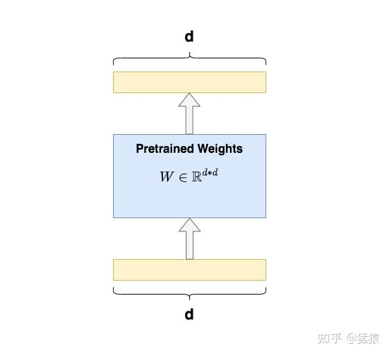

我们知道，微调的含义，就是把已经训练好的模型（pretrained model）拿来，给它吃特定的下游任务数据，使得模型在预训练权重上继续训练，直至满足下游任务性能标准。预训练模型就像一个**特征提取器**，能够基于先前训练数据中学到的经验，为我们提取有效的特征，大大提升下游任务的训练效果和收敛速度。

**全量微调**指的是，在下游任务的训练中，对预训练模型的每一个参数都做更新。例如图中，给出了 Transformer 的 Q/K/V 矩阵的全量微调示例，对每个矩阵来说，在微调时，其`d*d`个参数，都必须参与更新。

全量微调的显著缺点是，**训练代价昂贵**。例如 GPT3 的参数量有 175B，我等单卡贵族只能望而却步，更不要提在微调中发现有 bug 时的覆水难收。同时，由于模型在预训练阶段已经吃了足够多的数据，收获了足够的经验，因此我**只要想办法给模型增加一个额外知识模块，让这个小模块去适配我的下游任务，模型主体保持不变（freeze)即可**。那这样的知识小模块，具体要怎么添加呢？

### Adapter Tuning 与 Prefix Tuning

我们来看在 LoRA 出现前，两种主流的局部微调办法：**Adapter Tuning 与 Prefix Tuning**。这也是 LoRA 的原始论文中，重点比对的两种微调方式。

#### 2.1 Adapter Tuning

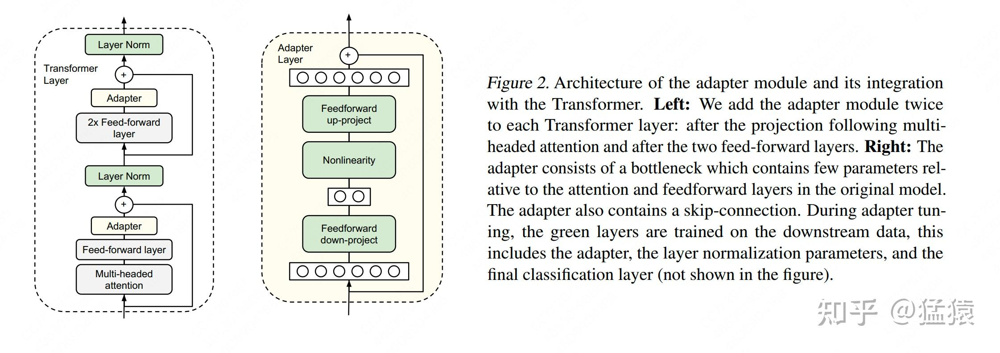


Adapter Tuning 的方法有很多种，这里我们举出 Houlsby et al. ,2019 提出的方法，这也是 LoRA 论文中提及这项技术时所引用的第一篇文章。
图例中的左边是一层 Transformer Layer 结构，其中的 Adapter 就是我们说的 “额外知识模块”；右边是 Adatper 的具体结构。**在微调时，除了 Adapter 的部分，其余的参数都是被冻住的（freeze）**，这样我们就能有效降低训练的代价。Adapter 的内部架构不是本文所述的重点，这里我们就不再介绍了。
但这样的设计架构存在一个**显著劣势**：**添加了 Adapter 后，模型整体的层数变深，会增加训练速度和推理速度**，原因是：

*   需要耗费额外的运算量在 Adapter 上
*   当我们采用并行训练时（例如 Transformer 架构常用的[张量模型并行](https://zhuanlan.zhihu.com/p/622212228)），Adapter 层会产生额外的通讯量，增加通讯时间

#### 2.2 Prefix Tuning

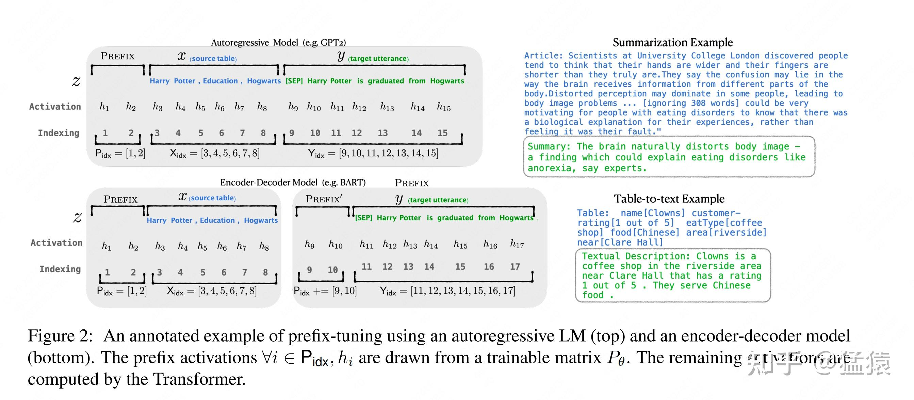


Prefix Tuning 的方法也有很多种，这里我们选取 Li&Liang,2021 这一篇进行简述。在这篇中，作者通过对输入数据增加前缀（prefix）来做微调。**当然，prefix 也可以不止加载输入层，还可以加在 Transformer Layer 输出的中间层**，感兴趣的朋友可以查找论文自行研究。
如图所示，对于 **GPT 这样的生成式模型**，在输入序列的最前面加入 prefix token，图例中加入 2 个 prefix token，在实际应用中，prefix token 的个数是个超参，可以根据模型实际微调效果进行调整。对于 **BART 这样的 Encoder-Decoder 架构模型**，则在 x 和 y 的前面同时添加 prefix token。**在后续微调中，我们只需要冻住模型其余部分，单独训练 prefix token 相关的参数即可，每个下游任务都可以单独训练一套 prefix token。**
**那么 prefix 的含义是什么呢？**prefix 的作用是引导模型提取 x 相关的信息，进而更好地生成 y。例如，我们要做一个 **summarization** 的任务，那么经过微调后，prefix 就能领悟到当前要做的是个 “总结形式” 的任务，然后引导模型去 x 中提炼关键信息；如果我们要做一个**情感分类**的任务，prefix 就能引导模型去提炼出 x 中和情感相关的语义信息，以此类推。这样的解释可能不那么严谨，但大家可以大致体会一下 prefix 的作用。
Prefix Tuning 虽然看起来方便，但也存在以下两个显著劣势；

*   较难训练，且模型的效果并不严格随 prefix 参数量的增加而上升，这点在原始论文中也有指出
*   会使得输入层有效信息长度减少。为了节省计算量和显存，我们一般会固定输入数据长度。增加了 prefix 之后，留给原始文字数据的空间就少了，因此可能会降低原始文字中 prompt 的表达能力。

什么是 LoRA
-------------

总结一下，**全参数微调太贵，Adapter Tuning 存在训练和推理延迟，Prefix Tuning 难训且会减少原始训练数据中的有效文字长度**，那是否有一种微调办法，能改善这些不足呢？
在这样动机的驱动下，作者提出了 **LoRA（Low-Rank Adaptation，低秩适配器）这样一种微调方法**。我们先抛开对 “低秩”、“适配器” 这样抽象词语的解释，我们先来看 LoRA 长什么样，要怎么用。在下一节中，我们再来详细解释 “低秩” 作用的原理。

### LoRA 整体架构

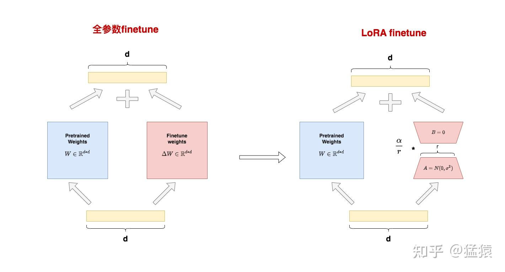


**图中左侧表示 “全参数 finetune” 的场景**。我们将参数分成了两个部分：

*   $W \in \mathbb R^{d*d}$ ：预训练权重
*   $\Delta W \in \mathbb R^{d*d}$ ：finetune 增量权重

之所以这么拆分，是因为**全参数 finetune 可以理解成 “冻住的预训练权重” + “微调过程中产生的权重更新量”**。
设输入为 $x$ ，输出为 $h$ ，则有：
$h = Wx + \Delta W x$
**图中右侧表示 “LoRA finetune” 的场景。在 LoRA 中，我们用矩阵 A 和 B 来近似表达** $\Delta W$ ：

*   $A \in \mathbb R^{r*d}$ ：低秩矩阵 $A$ ，其中 $r$ 被称为 “**秩**”，对 $A$ 用高斯初始化。
*   $B \in \mathbb R^{d*r}$ ：低秩矩阵 $B$ ，对 B 采用零初始化。

经过这样一番拆分，**我们将** $\Delta W$ **改写成** $\Delta W = B$ **的形式，使得微调参数量从`d*d`降低至`2*r*d`，同时不改变输出数据的维度**，即在 LoRA 下我们有:
$h = Wx + BAx$
另外，**在原论文中提到过对于两个低秩矩阵，会用超参** $\alpha$ **（一个常数）来做调整**，但没有说明这个超参的作用位置。在读完 LoRA 的源码后，我发现**这个超参是作为 scaling rate 直接和低秩矩阵相乘的**，也就是最终的输出为：
$h = Wx + \frac{\alpha}{r}BAx$
在实操中，一般取 $\alpha \ge r$ ，例如在 LoRA 源码对 GPT2 微调，做 NLG 任务时，就取 $\alpha = 32, r=4$ 。**我们会在后文详细介绍这个 scaling rate 的作用，以及 “秩” 的具体含义。**
**A 和 B 的初始化方法**


需要注意的是，这里对 $A$ 采用高斯初始化，对 $B$ 采用零初始化的目的是，让训练刚开始时 $B$$$的值为 0，这样不会给模型带来额外的噪声。那么你可能想问，**那我对** $A$ **做零初始化，对** $B$ **做高斯初始化行不行呢？反正看起来只要让** $BA$ **初始化为 0 就行？**
针对这个问题，我在 github issue 上找到了 LoRA 一作的回答：

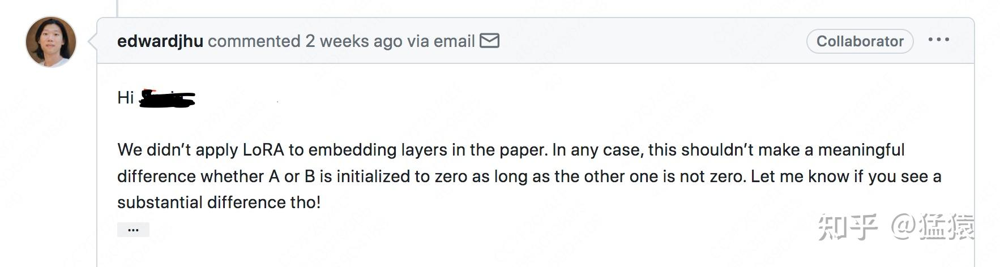


简单来说，当前作者还没有发现转换 $A,B$ 初始化方式产生的显著区别，只要这两者中任意一者为 0，另一者不为 0 即可。

### LoRA 的训练和推理过程


在 3.1 中，**我们介绍了 LoRA 的整体架构：在原始预训练矩阵的旁路上，用低秩矩阵 A 和 B 来近似替代增量更新** $\Delta W$ 。你可以在你想要的模型层上做这样的操作，比如 Transformer 中的 $W_{q}, W_{k}, W_{v}, W_{o}$ 、MLP 层的权重、甚至是 Embedding 部分的权重。在 LoRA 原始论文中，只对 Attention 部分的参数做了低秩适配，但在实际操作中，我们可以灵活根据需要设置实验方案，找到最佳的适配方案（有钱万事通）。

#### **训练**

在**训练过程**中，我们固定住预训练权重 $W$ ，只对低秩矩阵 $A$ 和 $B$ 进行训练。**在保存权重时，我们只需保存低秩矩阵的部分即可**。按照 LoRA 论文中的统计，这样的操作使得在微调 GPT3 175B 时，显存消耗从 1.2TB 降至 350GB；当 r=4 时，最终保存的模型从 350GB 降至 35MB，极大降低了训练的开销。
关于训练部分，我们再来看一个有趣的问题：总体上来看，LoRA 对显存的节约是显著的，但是在训练的每一时刻，LoRA 都能做到节省显存吗？
考虑 backward 时对 $B$ 计算梯度，根据 $h = Wx + BAx = W_{sum}x$ （为了敲公式方便，暂时忽略掉 $\alpha$ 一项），我们有：


$\begin{aligned} \frac{\partial L}{\partial B} &= \frac{\partial L}{\partial h}\frac{\partial h}{\partial W_{sum}}\frac{\partial W_{sum}}{\partial B}\\ &=\frac{\partial L}{\partial h}x^{T}\frac{\partial W_{sum}}{\partial B} \end{aligned}$


注意 $\frac{\partial L}{\partial h}x^{T}$ 这一项，你会发现，它和预训练权重 $W$ 的维度`d*d` 一模一样，也就是为了计算 $B$ 的梯度，我们需要用到和全参数微调过程中一样大小的中间值结果。因此对 LoRA 来说，**这一层的峰值显存，和全量微调基本是一致的**（算上 $\frac{\partial W_{sum}}{\partial B}$ 一项的话则高于全量微调）。
**但是为什么 LoRA 又能从整体上降低显存使用呢**，因为：

*   LoRA 并不是作用在模型的每一层，例如论文里的 LoRA 只作用在 attention 部分
*   LoRA 虽然会导致某一层的峰值显存高于全量微调，但计算完梯度后，这个中间结果就可以被清掉了，不会一致保存
*   当待训练权重从`d*d`降为`2*r*d`时，需要保存的 optimizer states 也减少了（那可是 fp32）。

#### ** 推理**


在**推理过程**中，**我们按照** $W = W + \frac{\alpha}{r}BA$ **的方式，合并低秩矩阵和预训练权重，然后正常做 forward 推理。这样我们完全不会更改模型的架构，因此不会像 Adapter Tuning 一样产生推理上的延时**。下图展示了论文中的实验效果，推理时长的单位是 milliseconds，可以发现，LoRA 的推理速度显著高于 Adapter Tuning。

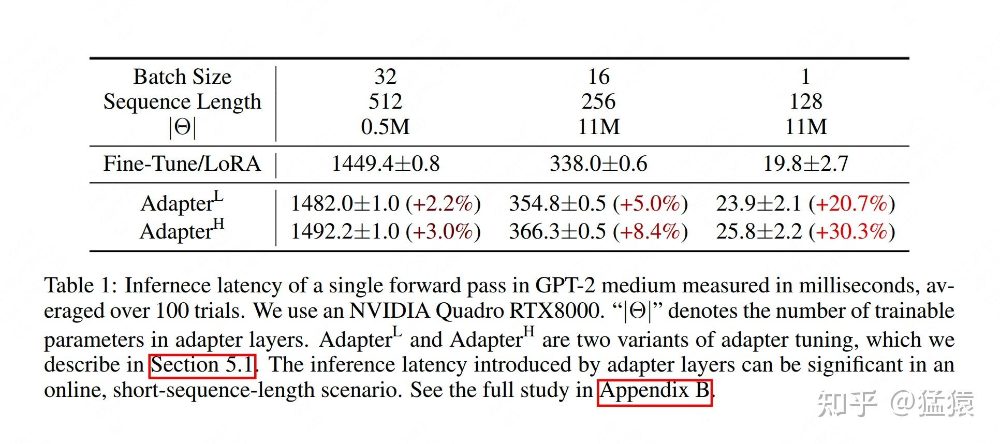

在**切换不同下游任务**时，我们可以灵活从 $W$ 中移除低秩权重的部分。例如我们先做下游任务 A，做完后通过 $W = W + \frac{\alpha}{r}BA$ 合并权重，并单独保留低秩权重 $A,B$ 。当我们切换到下游任务 B 时，我们可以通过从 $W$ 中减去低秩权重部分，然后再开启新的 LoRA 微调。也就是说，**每个下游任务，都可以有自己的一套低秩权重**。
**你可能想问，在每次微调结束后，我一定要把低秩权重合进** $W$ **中吗？我可以将 “预训练权重” 和“低秩权重”分开存储吗？**当然没问题啦，LoRA 是很灵活的，你完全可以根据自身需要，改写代码，决定权重的保存方式，只要掌握一个核心原则：不管是合还是不合，你总有办法能区分出预训练和 LoRA 的部分，就行。在源码解读篇中，我们会再详细来看这点。
恭喜你！到这一步你已经掌握了 LoRA 的架构，是不是很简单，是不是跃跃欲试？但是，作为一名合格的炼丹师，为了能对训练过程更好 debug，我们还要需要更深入研究 LoRA 的原理。


神经网络包含很多全连接层，其借助于矩阵乘法得以实现，然而，很多全连接层的权重矩阵都是满秩的。当针对特定任务进行微调后，**模型中权重矩阵其实具有很低的本征秩**（intrinsic rank），因此，论文的作者认为**权重更新的那部分参数矩阵尽管随机投影到较小的子空间，仍然可以有效的学习，可以理解为针对特定的下游任务这些权重矩阵就不要求满秩**。

LoRA 低秩适配的原理
--------------


在前文中，我们曾反复提到 “秩” 的概念，并说明 LoRA 的秩即为超参 $r$ ，同时，我们也不断强调 $BA$ 是 $\Delta W$ 的**近似。**在这一节中，**我们将具象化地来看看 “秩”，并说明为何是 “近似”，在了解这些后，我们就能来解读超参** $\alpha$ **的作用，并掌握一定的炼丹感觉了。**

### 什么是秩


我们首先来看一个矩阵 A：

```
A = [[1, 2, 3],
     [2, 4, 6],
     [3, 6, 9]]

```

该矩阵中，row2 = row1 * 2，row3 = row1*3，也就是说，矩阵中的每一行，都可以通过第一行线性表示。
我们再来看一个矩阵 B：

```
B = [[1, 2, 3],
     [7, 11, 5],
     [8, 13, 8]]

```

该矩阵中，任意一行，总可以用其他两行的线性组合来表示。
我们最后再来看一个矩阵 C：

```
C = [[1, 0, 0],
     [0, 1, 0],
     [0, 0, 1]]

```

该矩阵中，任意一行，都不能从其余行的线性组合中推导而来。
调用`np.linalg.matrix_rank`函数，我们可以算出任意矩阵的秩，上面三个矩阵的秩分别为：

```
A = np.array(A)
B = np.array(B)
C = np.array(C)

print("Rank of A:", np.linalg.matrix_rank(A)) # 1
print("Rank of B:", np.linalg.matrix_rank(B)) # 2
print("Rank of C:", np.linalg.matrix_rank(C)) # 3


```


对矩阵 A 来说，由于只要掌握其中的任意一行，其余行都可以由这一行线性推导而来，因此 A 的秩是 1。
对矩阵 B 来说，由于只要掌握其中的任意两行，其余行都可以由这两行线性组合推导而来，因此 B 的秩是 2。
对矩阵 C 来说，由于必须完全掌握三行，才能得到完整的 C，因此 C 的秩是 3。
看到这里，你是不是已经对秩有了感性的理解了？**秩表示的是矩阵的信息量**。如果矩阵中的某一维，总可以通过其余维度线性推导而来，那么对模型来说，这一维的信息是冗余的，是重复表达的。对 A 和 B 的情况，我们称为**秩亏（rank deficient）**，对 C 的情况，我们称为**满秩（full rank）**。更严谨的数学定义，大家可以参考《线性代数》（狗头）。
有了对秩的这层认识，我们自然会想到，**全参数微调中的增量权重** $\Delta W$ **可能也存在冗余的信息，因此我们并不需要用完整的`d*d` 尺寸来表示它**。那么，**我们要如何找出**$\Delta W$ **中真正有用的特征维度呢？SVD 分解**（奇异值分解），可以帮我们解决这个问题

### SVD 分解

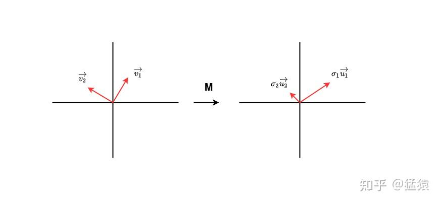

如图，矩阵 $M$ 是我们需要做信息量检查的矩阵。假设在输入数据的特征空间中，**存在一组正交的单位向量** $\vec{v_1}, \vec{v_2}$ ，经过 $M$ 的变换后，它们变成另一组正交向量 $\sigma_1 \vec{u_1}, \sigma_2 \vec{u_2}$ ，其中 $\vec{u_1}, \vec{u_2}$ **也是一组正交的单位向量**， $\sigma_1, \sigma_2$ 分别表示对应方向上的模。上面这一顿变幻，可以写成：
$M[\vec{v_1}, \vec{v_2}] = [\sigma_1 \vec{u_1}, \sigma_2 \vec{u_2}]$


稍加改写，就有：
$M = \begin{bmatrix}\vec{u_1}&\vec{u_2}\end{bmatrix}\begin{bmatrix}\sigma_1&0 \\0&\sigma_2\end{bmatrix}\begin{bmatrix}\vec{v_1}\\\vec{v_2}\end{bmatrix}$


不难发现， $\sigma_{1}, \sigma_{2}$ **中隐含了对 “信息量” 的提示。**在本例中 $v$ 经过 $M$ 的转换投射到 $u$ 上时， $M$ 强调了在 1 方向上蕴含的信息。
现在再宽泛一些，如果我们能找到这样的一组 $v$ 和 $u$ ，并令 $\sigma$ 矩阵的值从大到小进行排列，那么我们不就能对 $M$ 进行拆解，同时在拆解过程中，找出 $M$ 所强调的那些特征方向了吗？也就是说：
$M = U\Sigma V^{T}$


**当我们找到这样的** $U, \Sigma, V$ **矩阵后，我们再从这三者中取出对应的`top r` 行（或列），不就相当于关注到了** $M$ **最强调的那几维特征，进而就能用更低维的矩阵，来近似表达** $M$ **了？**按这种思维拆解 M 的方法，我们称为 **SVD 分解（奇异值分解）**。在本篇里我们不讲述它的具体方法，感兴趣的朋友们，欸，又可以参考《线性代数》。
我们再通过一个代码例子，更直观地感受一下这种近似，大家注意看下注释（例子改编自：[https://medium.com/@Shrishml/lora-low-rank-adaptation-from-the-first-principle-7e1adec71541](https://link.zhihu.com/?target=https%3A//medium.com/%40Shrishml/lora-low-rank-adaptation-from-the-first-principle-7e1adec71541)）

```
import torch
import numpy as np
torch.manual_seed(0)

# ------------------------------------
# n：输入数据维度
# m：输出数据维度
# ------------------------------------
n = 10
m = 10

# ------------------------------------
# 随机初始化权重W
# 之所以这样初始化，是为了让W不要满秩，
# 这样才有低秩分解的意义
# ------------------------------------
nr = 10
mr = 2
W = torch.randn(nr,mr)@torch.randn(mr,nr)

# ------------------------------------
# 随机初始化输入数据x
# ------------------------------------
x = torch.randn(n)

# ------------------------------------
# 计算Wx
# ------------------------------------
y = W@x
print("原始权重W计算出的y值为:\n", y)

# ------------------------------------
# 计算W的秩
# ------------------------------------
r= np.linalg.matrix_rank(W)
print("W的秩为: ", r)

# ------------------------------------
# 对W做SVD分解
# ------------------------------------
U, S, V = torch.svd(W)

# ------------------------------------
# 根据SVD分解结果，
# 计算低秩矩阵A和B
# ------------------------------------
U_r = U[:, :r]
S_r = torch.diag(S[:r])
V_r = V[:,:r].t()

B = U_r@S_r # shape = (d, r)
A = V_r     # shape = (r, d)

# ------------------------------------
# 计算y_prime = BAx
# ------------------------------------
y_prime = B@A@x

print("SVD分解W后计算出的y值为:\n", y_prime)

print("原始权重W的参数量为: ", W.shape[0]*W.shape[1])
print("低秩适配后权重B和A的参数量为: ", A.shape[0]*A.shape[1] + B.shape[0]*B.shape[1])

```

输出结果为：

```
原始权重W计算出的y值为:
 tensor([ 3.3896,  1.0296,  1.5606, -2.3891, -0.4213, -2.4668, -4.4379, -0.0375,
        -3.2790, -2.9361])
W的秩为:  2
SVD分解W后计算出的y值为:
 tensor([ 3.3896,  1.0296,  1.5606, -2.3891, -0.4213, -2.4668, -4.4379, -0.0375,
        -3.2790, -2.9361])
原始权重W的参数量为:  100
低秩适配后权重B和A的参数量为:  40


```

**参数量变少了，但并不影响最终输出的结果**。通过这个例子，大家是不是能更好体会到低秩矩阵的作用了呢～

### LoRA 低秩适配


好，那既然 SVD 分解这么有效，那我直接对 $\Delta W$ 做 SVD，找到对应的低秩矩阵 $A,B$ ，不就大功告成了吗？
**想法虽然好，但困难是明显的：能直接做 SVD 的前提是**$\Delta W$ **是确定的**，而现实中$\Delta W$ 作为全参数微调中的权重增量，如果你不全参数微调一遍，又怎么能知道$\Delta W$ 长什么样呢？而如果你做了全量微调，那还要低秩适配做什么呢？
欸，你可能又想：那我能不能对预训练权重 $W$ 做 SVD 呢，因为 $W$ 是确定的呀。
**想法虽然好，但逻辑是不合理的：我们说过，微调的目的是给模型注入和下游任务相关的领域新知识**。也就是说，$\Delta W$ **和** $W$ **的表达含义是不同的，前者是新知识，后者是旧知识**，我们的目的是要去新知识中拆解信息量丰富的维度。
好，**那既然通过数学方法直接做 SVD 行不通，那就让模型自己去学怎么做 SVD 吧！**因此 LoRA 最终的低秩适配策略是：我把秩 $r$ 当成一个超参，再让模型自己去学低秩矩阵 $A,B$ ，这不就简单又省事吗！
行，到这里我们已经具象化地了解了 LoRA 低秩适配的原理了，也知道 $W$ 和$\Delta W$ 所表达含义的差异了，**现在，我们可以来看前文遗留的问题：超参** $\alpha$ **是什么意思？**

### 超参 $\alpha$


我们先来看论文对$\alpha$ 的解释：

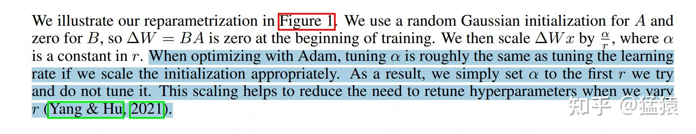


这段话大致意思是说，在我们采用 Adam 做优化器时，调整$\alpha$ 的作用就相当于调整 learning rate。一般而言，我们把$\alpha$ 设置为我们第一次做实验时设置的 $r$ ，然后就把$\alpha$ 固定下来，之后只调整 $r$ 即可，这样做的好处是当我们尝试不同的 $r$ 时，我们不需要再去调整别的超参了。
不知道大家第一次读到这段话是什么感受，反正我是没有读懂。google 搜了一遍，也没找到具体的解释。直到我按顺序捋了一遍 LoRA 低秩适配的设计思想后，我好像领悟了一些，下面我来谈谈我的个人见解。
首先，回顾一下我们的输出计算方法为：
$h = Wx + \frac{\alpha}{r}BAx$
其中， $W$ 表示预训练权重（**旧知识**）， $\frac{\alpha}{r}BA$ 表示增量权重 $\Delta W$ 的近似（**新知识**）。理论上说，当 $r$ **较小时，我们提取的是** $\Delta W$ **中信息含量最丰富的维度，此时信息精炼，但不全面；当** $r$ **较大时，我们的低秩近似越逼近**$\Delta W$**，此时信息更加全面，但带来的噪声也越多（含有很多冗余无效的信息）**。
基于这个猜想，当我们第一次做实验时，我们会尽量把 $r$ 调得大些，例如 32、64，并假设在这个秩下，低秩权重已经非常近似 $\Delta W$ 了，因此这时我们设置 $\alpha = r$ ，意味着我们假定 LoRA 低秩微调的效果和全参数微调持平。
那么接下来，我们肯定就要往小的 $r$ 进行尝试了。这时我们把 $\alpha$ 固定住，意味着随着 $r$ 的减小， $\frac{\alpha}{r}$ 会越来越大，我们这样做的原因是：

*   **当** $r$ **越小时，低秩矩阵表示的信息精炼，但不全面。我们通过调大** $\frac{\alpha}{r}$ **，来放大 forward 过程中新知识对模型的影响。**
*   **当** $r$ **越小时，低秩矩阵表示的信息精炼，噪声 / 冗余信息少，此时梯度下降的方向也更加确信，所以我们可以通过调大** $\frac{\alpha}{r}$ **，适当增加梯度下降的步伐，也就相当于调整 learning rate 了。**


好，到这里，我们已经一起学完了 LoRA 低秩适配的核心思想了。我们前面说过，因为无法用 SVD 做直接分解，所以作者寄希望于 LoRA 能 **“学习”** 到 $\Delta W$ 真正的低秩分解矩阵 $A, B$ ，但是怎么证明 LoRA 学到的东西就和 SVD 分解出来的东西有关系呢？接下来，我们一起来解读作者的实验。

## 技术原理
LoRA（论文：**LoRA: LOW-RANK ADAPTATION OF LARGE LANGUAGE MODELS**），该方法的核心思想就是**通过低秩分解来模拟参数的改变量，从而以极小的参数量来实现大模型的间接训练。**
在涉及到矩阵相乘的模块，在原始的PLM旁边增加一个新的通路，通过前后两个矩阵`A`,`B`相乘，第一个矩阵`A`负责降维，第二个矩阵`B`负责升维，中间层维度为`r`，从而来模拟所谓的本征秩（intrinsic rank）。
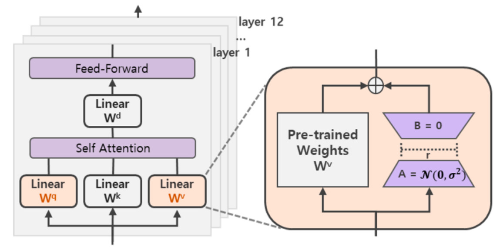

可训练层维度和预训练模型层维度一致为`d`，先将维度`d`通过全连接层降维至r，再从`r`通过全连接层映射回`d`维度，其中，`r<<d`，`r`是矩阵的秩，这样矩阵计算就从`d x d`变为`d x r + r x d`，参数量减少很多。

若原本全连接层为`768×768`。我们通过`A`,`B`替代，可以变成`768×8 `、`8×768`。
参数量从`768×768`变成了`768×8 + 8×768`

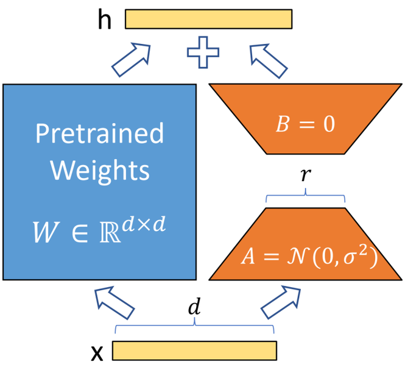
微调时，**固定模型的其他参数，只优化新增的两个矩阵**`A`**,**`B`**的权重参数**，将PLM（Pre-trained Language Model）跟新增的通路两部分的结果加起来作为最终的结果（两边通路的输入跟输出维度是一致的），即`h=Wx+BAx`。**第一个矩阵的A的权重参数会通过高斯函数初始化**，而**第二个矩阵的B的权重参数则会初始化为零矩阵**，这样能保证训练开始时新增的通路BA=0从而对模型结果没有影响。
$$
h=W_{0} x+\Delta W x=W_{0} x+B A x
$$

在推理时，将左右两部分的结果加到一起即可，`h=Wx+BAx=(W+BA)x`，所以只要将训练完成的矩阵乘积`BA`跟原本的权重矩阵`W`加到一起作为新权重参数替换原本PLM的W即可，对于推理来说，不会增加额外的计算资源。

此外，Transformer的权重矩阵包括Attention模块里用于计算`query`, `key`, `value`的`Wq`，`Wk`，`Wv`以及多头attention的`Wo`,以及MLP层的权重矩阵，LoRA只应用于Attention模块中的4种权重矩阵，而且**通过消融实验发现同时调整 Wq 和 Wv 会产生最佳结果**。

实验还发现，保证权重矩阵的种类的数量比起增加隐藏层维度r更为重要，增加r并不一定能覆盖更加有意义的子空间。

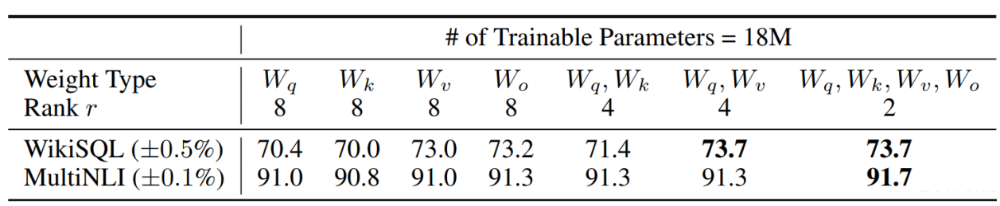


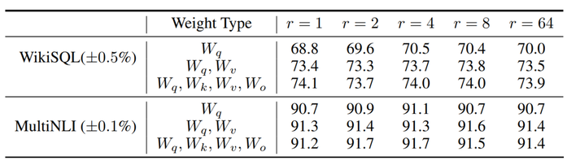

那么关于秩的选择，通常情况下，rank为4，8，16即可。

通过实验也发现，在众多数据集上LoRA在只训练极少量参数的前提下，最终在性能上能和全量微调匹配，甚至在某些任务上优于全量微调。
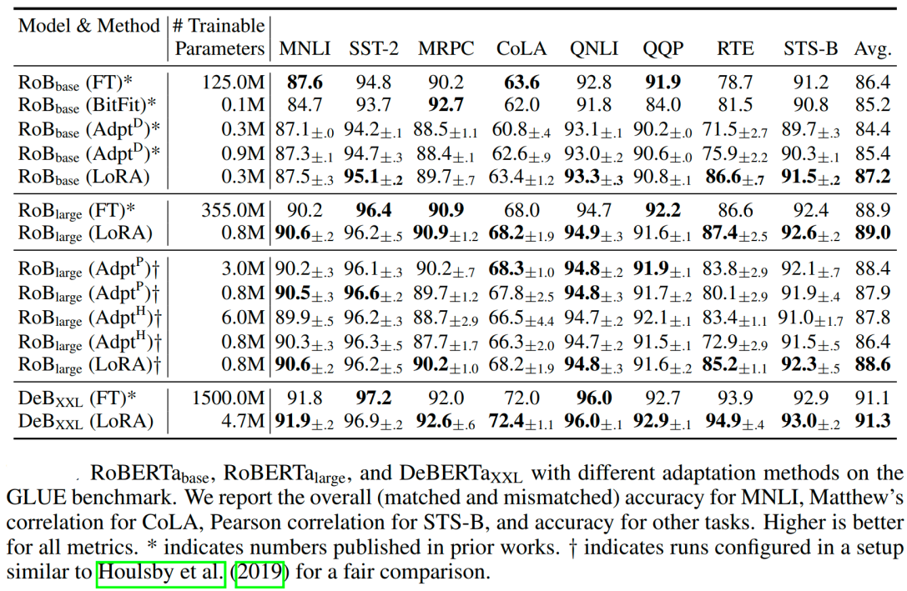

## 代码示例

使用Qwen2.5-1.5B进行代码演示

```Python
from transformers import AutoModelForCausalLM, AutoTokenizer
model_path = '/Qwen/Qwen2___5-1___5B-Instruct'
model = AutoModelForCausalLM.from_pretrained(
    model_path,
    torch_dtype="auto",
    device_map="auto"
)
tokenizer = AutoTokenizer.from_pretrained(model_path)
print(model)
```

加载一个原始的Qwen model

```Python
Qwen2ForCausalLM(
  (model): Qwen2Model(
    (embed_tokens): Embedding(151936, 1536)
    (layers): ModuleList(
      (0-27): 28 x Qwen2DecoderLayer(
        (self_attn): Qwen2SdpaAttention(
          (q_proj): Linear(in_features=1536, out_features=1536, bias=True)
          (k_proj): Linear(in_features=1536, out_features=256, bias=True)
          (v_proj): Linear(in_features=1536, out_features=256, bias=True)
          (o_proj): Linear(in_features=1536, out_features=1536, bias=False)
          (rotary_emb): Qwen2RotaryEmbedding()
        )
        (mlp): Qwen2MLP(
          (gate_proj): Linear(in_features=1536, out_features=8960, bias=False)
          (up_proj): Linear(in_features=1536, out_features=8960, bias=False)
          (down_proj): Linear(in_features=8960, out_features=1536, bias=False)
          (act_fn): SiLU()
        )
        (input_layernorm): Qwen2RMSNorm((1536,), eps=1e-06)
        (post_attention_layernorm): Qwen2RMSNorm((1536,), eps=1e-06)
      )
    )
    (norm): Qwen2RMSNorm((1536,), eps=1e-06)
  )
  (lm_head): Linear(in_features=1536, out_features=151936, bias=False)
)
```

导入LoRA的配置

```Python
from peft import LoraConfig, TaskType, get_peft_model
config = LoraConfig(task_type=TaskType.CAUSAL_LM, target_modules=['q_proj', 'v_proj'], modules_to_save=['lm_head'], r=16, lora_alpha=16)
config
```

这里的`task_type`为任务类型，因为Qwen属于因果模型，因此这里选择`CAUSAL_LM`，

其他选择如下(源码目录为：**/peft/utils/peft_types.py**)：

```Python
class TaskType(str, enum.Enum):
    """
    Enum class for the different types of tasks supported by PEFT.

    Overview of the supported task types:
    - SEQ_CLS: Text classification.
    - SEQ_2_SEQ_LM: Sequence-to-sequence language modeling.
    - CAUSAL_LM: Causal language modeling.
    - TOKEN_CLS: Token classification.
    - QUESTION_ANS: Question answering.
    - FEATURE_EXTRACTION: Feature extraction. Provides the hidden states which can be used as embeddings or features
      for downstream tasks.
    """

    SEQ_CLS = "SEQ_CLS"
    SEQ_2_SEQ_LM = "SEQ_2_SEQ_LM"
    CAUSAL_LM = "CAUSAL_LM"
    TOKEN_CLS = "TOKEN_CLS"
    QUESTION_ANS = "QUESTION_ANS"
    FEATURE_EXTRACTION = "FEATURE_EXTRACTION"
```

其他比较重要的参数如下：

1. `r` :LoRA模型的注意力维度（也叫秩）。表示低秩适应矩阵的维度。
2. `target_modules`:要应用LoRA的模块名称。如果是字符串，会执行正则匹配；如果是列表，会精确匹配或检查模块名是否以指定的字符串结尾。
3. `lora_dropout`:LoRA层的dropout概率，防止过拟合。
4. `modules_to_save`:除了LoRA适配器层之外，还要保存并训练的模块。用于某些模型，如分类任务中的输出层。
5. `lora_alpha：`**缩放因子**,起到的是调节作用。

    在 LoRA 中，`lora_alpha` 是一个缩放因子，用来控制微调部分 ( $ A \cdot B $) 对原始权重矩阵 $ W_0 $ 的影响。其目的是为了更好地调节微调的幅度，从而避免对原始模型造成过大的扰动。

    具体来说，调整后的模型权重可以表示为：

$$
W_{\text {new }}=W_{0}+\frac{\alpha}{r}(A \cdot B)
$$

   - $W_0$是原始模型的权重矩阵。

   - $ A \cdot B $是通过低秩矩阵计算出来的增量。

   - $\alpha$是 `lora_alpha`，用于缩放 ( $ A \cdot B $ ) 的值。

   - $r$ 是低秩矩阵的秩$rank$，用于标准化。

`target_modules`参数如果不指定的话，会根据微调的模型选择默认的modules。

源码目录为：**/peft/utils/**[**constants.py**](http://constants.py)

```Python
TRANSFORMERS_MODELS_TO_LORA_TARGET_MODULES_MAPPING = {
    "t5": ["q", "v"],
    "mt5": ["q", "v"],
    "bart": ["q_proj", "v_proj"],
    "gpt2": ["c_attn"],
    "bloom": ["query_key_value"],
    "blip-2": ["q", "v", "q_proj", "v_proj"],
    "opt": ["q_proj", "v_proj"],
    "gptj": ["q_proj", "v_proj"],
    "gpt_neox": ["query_key_value"],
    "gpt_neo": ["q_proj", "v_proj"],
    "bert": ["query", "value"],
    "roberta": ["query", "value"],
    "xlm-roberta": ["query", "value"],
    "electra": ["query", "value"],
    "deberta-v2": ["query_proj", "value_proj"],
    "deberta": ["in_proj"],
    "layoutlm": ["query", "value"],
    "llama": ["q_proj", "v_proj"],
    "chatglm": ["query_key_value"],
    "gpt_bigcode": ["c_attn"],
    "mpt": ["Wqkv"],
    "RefinedWebModel": ["query_key_value"],
    "RefinedWeb": ["query_key_value"],
    "falcon": ["query_key_value"],
    "btlm": ["c_proj", "c_attn"],
    "codegen": ["qkv_proj"],
    "mistral": ["q_proj", "v_proj"],
    "mixtral": ["q_proj", "v_proj"],
    "stablelm": ["q_proj", "v_proj"],
    "phi": ["q_proj", "v_proj", "fc1", "fc2"],
    "gemma": ["q_proj", "v_proj"],
}
```

因为Qwen2并没有默认值，因此需要我们指定微调的modules，我们指定微调模型的`q_proj` 和`v_proj`两个投影层。

然后我们通过`get_peft_model`函数得到需要微调的模型。

```Python
lora_model = get_peft_model(model, config)  
print(lora_model)
```

lora_model的结构如下：

```Python
PeftModelForCausalLM(
  (base_model): LoraModel(
    (model): Qwen2ForCausalLM(
      (model): Qwen2Model(
        (embed_tokens): Embedding(151936, 1536)
        (layers): ModuleList(
          (0-27): 28 x Qwen2DecoderLayer(
            (self_attn): Qwen2SdpaAttention(
              (q_proj): lora.Linear(
                (base_layer): Linear(in_features=1536, out_features=1536, bias=True)
                (lora_dropout): ModuleDict(
                  (default): Identity()
                )
                (lora_A): ModuleDict(
                  (default): Linear(in_features=1536, out_features=16, bias=False)
                )
                (lora_B): ModuleDict(
                  (default): Linear(in_features=16, out_features=1536, bias=False)
                )
                (lora_embedding_A): ParameterDict()
                (lora_embedding_B): ParameterDict()
              )
              (k_proj): Linear(in_features=1536, out_features=256, bias=True)
              (v_proj): lora.Linear(
                (base_layer): Linear(in_features=1536, out_features=256, bias=True)
                (lora_dropout): ModuleDict(
                  (default): Identity()
                )
                (lora_A): ModuleDict(
                  (default): Linear(in_features=1536, out_features=16, bias=False)
                )
                (lora_B): ModuleDict(
                  (default): Linear(in_features=16, out_features=256, bias=False)
                )
                (lora_embedding_A): ParameterDict()
                (lora_embedding_B): ParameterDict()
              )
              (o_proj): Linear(in_features=1536, out_features=1536, bias=False)
              (rotary_emb): Qwen2RotaryEmbedding()
            )
            (mlp): Qwen2MLP(
              (gate_proj): Linear(in_features=1536, out_features=8960, bias=False)
              (up_proj): Linear(in_features=1536, out_features=8960, bias=False)
              (down_proj): Linear(in_features=8960, out_features=1536, bias=False)
              (act_fn): SiLU()
            )
            (input_layernorm): Qwen2RMSNorm((1536,), eps=1e-06)
            (post_attention_layernorm): Qwen2RMSNorm((1536,), eps=1e-06)
          )
        )
        (norm): Qwen2RMSNorm((1536,), eps=1e-06)
      )
      (lm_head): ModulesToSaveWrapper(
        (original_module): Linear(in_features=1536, out_features=151936, bias=False)
        (modules_to_save): ModuleDict(
          (default): Linear(in_features=1536, out_features=151936, bias=False)
        )
      )
    )
  )
)
```

可以看到需要我们微调的`q_proj` 和`v_proj`投影层多了`lora_A`和`lora_B`两个分路。

打印下可学习的参数

```Python
lora_model.print_trainable_parameters()  
# trainable params: 235,552,768 || all params: 1,779,267,072 || trainable%: 13.2388

```

可以看到训练的参数仅仅是是全部参数的 13.23%。

lora模型定义好后，就可以训练了

```Python
from transformers import DataCollatorForSeq2Seq, TrainingArguments, Trainer
args = TrainingArguments(
    output_dir="./output_model/",  
    per_device_train_batch_size=16,  
    gradient_accumulation_steps=8,  
    logging_steps=50,  
    num_train_epochs=3 
    
)
trainer = Trainer(
    model=lora_model,
    args=args,
    tokenizer=tokenizer,
    train_dataset=tokenized_ds,
    data_collator=DataCollatorForSeq2Seq(tokenizer=tokenizer, padding=True),
)  
trainer.train()  

```

接着我们看下具体执行代码的时候lora是如何执行的

源码目录：**/peft/tuners/lora/layer.py** 

为了方便我们只看 **Linear**类。

```Python
    def forward(self, x: torch.Tensor, *args: Any, **kwargs: Any) -> torch.Tensor:
        self._check_forward_args(x, *args, **kwargs)
        adapter_names = kwargs.pop("adapter_names", None)

        if self.disable_adapters:
            if self.merged:
                self.unmerge()
            result = self.base_layer(x, *args, **kwargs)
        elif adapter_names is not None:
            result = self._mixed_batch_forward(x, *args, adapter_names=adapter_names, **kwargs)
        elif self.merged:
            result = self.base_layer(x, *args, **kwargs)
        else:
            result = self.base_layer(x, *args, **kwargs)
            torch_result_dtype = result.dtype
            for active_adapter in self.active_adapters:
                if active_adapter not in self.lora_A.keys():
                    continue
                lora_A = self.lora_A[active_adapter]
                lora_B = self.lora_B[active_adapter]
                dropout = self.lora_dropout[active_adapter]
                scaling = self.scaling[active_adapter]
                x = x.to(lora_A.weight.dtype)

                if not self.use_dora[active_adapter]:
                    result = result + lora_B(lora_A(dropout(x))) * scaling
                else:
                    x = dropout(x)
                    result = result + self._apply_dora(x, lora_A, lora_B, scaling, active_adapter)

            result = result.to(torch_result_dtype)

        return result
```

可以看到数据`x`有两条分路：1. 原始的PLM。2. **`lora_B(lora_A(dropout(x))) * scaling`**其中**`scaling`**可以参考我上文提到的**`lora_alpha`** 参数。
两条分路的相加为最后的结果。

训练完成后，需要合并lora模型 

```Python
from peft import PeftModel
lora_train_model = PeftModel.from_pretrained(model, model_id="./output_model/checkpoint")

merge_model = lora_train_model.merge_and_unload()
merge_model.save_pretrained("./output_model/merge_model")

```

完整代码请参考lora.ipynb，本文对过程只做简单的讲解。


## 参考
 通俗易懂理解全量微调和LoRA微调

[https://www.bilibili.com/video/BV1tthPeFEWb/?share_source=copy_web&vd_source=5b4170cace78b47030b76c83c2d0dace](https://www.bilibili.com/video/BV1tthPeFEWb/?share_source=copy_web&vd_source=5b4170cace78b47030b76c83c2d0dace)

【手把手带你实战HuggingFace Transformers-高效微调篇】LoRA 原理与实战

 [https://www.bilibili.com/video/BV13w411y7fq/?share_source=copy_web&vd_source=5b4170cace78b47030b76c83c2d0dace](https://www.bilibili.com/video/BV13w411y7fq/?share_source=copy_web&vd_source=5b4170cace78b47030b76c83c2d0dace)

[通过代码，一步步解析ChatGLM的Lora微调实现细节_chatglm lora-CSDN博客](https://blog.csdn.net/weixin_41712499/article/details/136666112)

[https://arxiv.org/pdf/2106.09685.pdf](https://link.zhihu.com/?target=https%3A//arxiv.org/pdf/2106.09685.pdf)
[https://github.com/microsoft/LoRA](https://link.zhihu.com/?target=https%3A//github.com/microsoft/LoRA)
[https://medium.com/@Shrishml/lora-low-rank-adaptation-from-the-first-principle-7e1adec71541](https://link.zhihu.com/?target=https%3A//medium.com/%40Shrishml/lora-low-rank-adaptation-from-the-first-principle-7e1adec71541)
[https://blog.sciencenet.cn/blog-696950-699432.html](https://link.zhihu.com/?target=https%3A//blog.sciencenet.cn/blog-696950-699432.html)
https://kexue.fm/archives/9590/comment-page-1