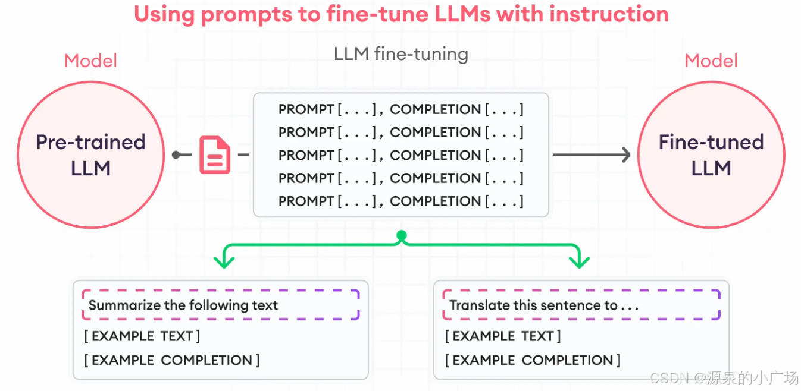
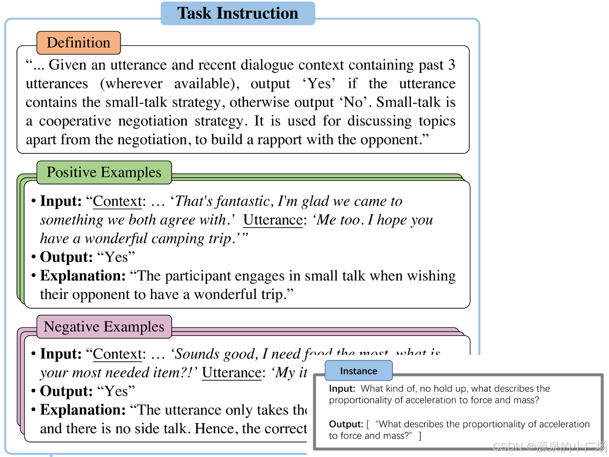

## 大模型项目pipeline

理想情况下，模型调的对且能力够的情况下，prompt工程就能实现功能，单不能的情况下就得SFT

## 背景介绍

**通用大模型（例如GPT-4、Llama-3.1等）是基于大量的（包含公开的互联网爬取数据）文本数据训练的深度学习模型，具有通用的自然语言处理能力，可以处理多种任务**，如文本生成、翻译、问答、情感分析等。但是这些通用模型在训练过程中一**般没有针对特定的任务或领域进行微调**。所以在具体到某一个细分场景，表现可能达不到商用的标准。

因此，为了提升面向商用标准能力，往往就会需要**对通用大模型进行微调，以使其在特定任务或领域上表现得更精确**、更有效。可以用一个比喻来形容：很多学校大一并不直接开设专业课，而是以基础学科位置，比如数学、物理、语言等。到了大二，才开始开设具体的专业课程。相当于大一期间锻炼基础的学术、学科储备能力，大二才进行专业课程的微调，以使学生在某一个具体的专业方向上具备更针对性、更强的专业能力。而涉及到微调，又细分为多种方法。还是以大学生培养的例子继续描述，学生专业课程的学习方式，既有经验丰富的资深老师来进行直接授课，也有专业课考试来检测并指导进一步提升的方向，还有动手实践课程，甚至是去相应的岗位进行实习。不同的学习方式可以带来不同的效果，并在一定程度上全面提升学生的专利能力。

每个行业以及不同的应用场景都有其特定的个性化的需求，预训练的通用大模型往往难以全方位满足这些需求。模型微调是将预训练的通用大模型进一步调整，使其更好地适应特定任务或领域。一般是通过在专门的数据集上进行额外的训练来实现，目的是提升模型在特定任务上的性能。通过微调，模型能够针对特定任务进行优化，从而在该任务上表现更为出色。例如，经过情感分析微调的模型在情感分类任务上的表现会明显优于未微调的通用模型。微调所需的计算资源通常比训练通用大模型低得多，因为只需在已有模型基础上进行进一步的调整。微调后的模型在特定任务上的推理效率也可能更高。

---

## 微调类别

1. 指令微调（Instruction Fine-Tuning）

- 方法描述: 通过为模型提供特定任务的明确指令或示例来进行微调，通常保持预训练模型的知识。

- 优点: 专注于特定任务的微调，适应性强，同时保留了模型的基础能力。

- 缺点: 可能无法充分挖掘模型在某些高度复杂任务中的潜力。

2. 全量微调（Full Fine-Tuning）

- 方法描述: 全量微调涉及对模型的所有参数进行微调。这种方法最为彻底，可以最大程度地适应特定任务，但也可能导致过拟合。

- 优点: 高度适应特定任务，能够大幅度提高模型的性能。

- 缺点: 需要大量计算资源和时间，同时可能导致模型在新任务上泛化能力下降。

3. 部分参数微调（Partial Fine-Tuning）

- 方法描述: 仅微调模型的部分参数（如后期层或特定层），而不是全部参数。这种方法减少了计算成本，并降低了过拟合的风险。

- 优点: 计算资源需求较低，过拟合风险较小。

- 缺点: 对复杂任务的适应能力可能不如全量微调。

4. 适应性微调（Adapter Fine-Tuning）

- 方法描述: 通过在预训练模型的特定层之间插入小型适应性模块（adapter），仅对这些模块进行微调，而保持主模型参数不变。

- 优点: 高效灵活，减少了微调的计算成本和内存占用，适用于多个任务。

- 缺点: 性能提升可能不如全量微调显著。

5. 低秩近似微调（Low-Rank Adaptation, LoRA）

- 方法描述: 通过低秩矩阵来微调模型参数，这种方法只微调一个较小的参数子集，通常是模型权重矩阵的低秩近似部分。

- 优点: 极大地减少了微调参数的数量和计算成本，适合资源受限的场景。

- 缺点: 对某些复杂任务，可能不如全量微调效果好。

6. 微调后层（Fine-Tuning Last Layers）

- 方法描述: 仅微调模型的最后几层，这种方法适用于希望在保持原模型能力的基础上增加一些特定任务的适应性。

- 优点: 减少了微调的复杂性和资源需求，同时仍然能够提升模型在特定任务上的表现。

- 缺点: 微调深度有限，可能无法充分适应任务需求。

7. 多任务微调（Multi-Task Fine-Tuning）

- 方法描述: 在多个任务上同时进行微调，使模型能够在多个相关任务上均表现良好。

- 优点: 提高了模型的泛化能力，能够在多个任务上取得较好的平衡性能。

- 缺点: 需要处理不同任务之间的冲突，微调过程较为复杂。

## 指令微调

### 定义

指令微调是一种在带有指令提示和相应输出的标记数据集上微调大模型的技术。通过提供一组概述所需操作的指南或指令，使预训练模型适应执行特定任务。能提高模型在特定任务上的性能，还能在总体上提高遵循指令的能力，有助于调整预训练模型用于实际应用。指令微调是用于调整预训练基础大模型以适应下游任务的一种微调技术。通用大模型可以出于各种目的进行微调，从风格定制到补充预训练模型的核心知识和词汇，再到针对特定用例优化性能。

指令既可用于提示词，也可以用于微调。通过自然语言指令引导模型生成最符合需求的输出。这种机制类似于搜索引擎，添加更多关键词通常有助于首先找到最佳结果。对于大模型，你可以理解成是某种具有非常丰富知识的数据源，通过某种检索匹配的技术，找到你想要的答案。指令与上下文和进一步的输入文本（例如问题）一起放入提示词中，提示词实际上就是一个字符串。比如一般在问答场景中可能会设置一个较长的指令：

>指令：“你是一个乐于助人、尊重他人且诚实的助手。始终尽可能有帮助地回答，同时确保安全。你的回答不应包含任何有害、不道德、种族主义、性别歧视、恶毒、危险或非法的内容。请确保你的回答在社会上不带有偏见，并且具有积极的性质。如果一个问题没有意义，或事实不连贯，请解释原因，而不是回答错误的内容。如果你不知道问题的答案，请不要分享错误信息。”
>
>上下文：<<输入你的上下文>>
>
>问题：<<输入你的问题>>

用于微调大模型的数据集必须服务于你的指令目的。例如，假设微调模型以提高其总结能力。在这种情况下，应该构建一个示例数据集，以总结指令为开头，后面跟着文本或类似的短语。在翻译的情况下，应该包括像 “翻译这段文本” 这样的指令。这些提示补全对允许模型以一种新的特定方式思考并服务于给定的特定任务。

### 为什么要对大模型进行指令微调

指令微调，在于预训练基座大模型并未针对对话或遵循指令进行优化。**大模型不会回答提示：它们只是在提示后附加文本。指令微调有助于使生成的附加文本更有用。**自回归生成式语言模型（如用于生成文本的GPT）的预训练过程会优化大模型使其简单地预测给定序列中的下一个单词，直到序列完成。

所以可以想象，如果没有微调，基础大模型可能会对 “教我如何游泳” 的提示回复 “去专业的游泳馆”。这在语法上是一种合理的完成句子的方式，但显然不能满足用户的需求，用户的初始用意应该是让大模型输出游泳的姿势动作以及如何掌控等，以帮助其学会怎么游泳。所以在实际使用大模型的时候，微调一般是必须的，只不过你可能还没有意识到。就像之前开玩笑说会出现大量的提示语工程师（Prompt Engineer），提示语工程其实就是在做任务的微调，以便模型输出的结果更可能满足业务所需。

所以指令微调实际是一方面学习新的预训练里没涉及到的任务，另一方面学习如何提供一个合理的答案。

### 指令微调与普通微调的差异

指令微调与标准的有监督微调之间的主要区别在于模型所训练的数据。有监督微调是在示例输入及其得出的输出上训练模型，而**指令微调则用指令来充实输入 - 输出示例**。以这种方式微调的大模型能够变得更加多功能和透明有用。**指令微调通过给予模型明确的指令和反馈，为使模型专门化提供了一种替代方法**。与微调只是提供输入输出示例不同，指令微调能够利用自然语言和对话，解释期望的行为和评估标准。例如，像 “请专注于仅总结这份报告的要点” 这样的指令提示。当然就像我们之前提到的，指令微调和其他微调技术不冲突，指令微调通常与微调结合使用。微调提供领域知识基础，而指令微调允许高效适应。

指令微调与其他形式的有监督微调（SFT）的区别在于，**指令数据集中的输入样本完全由类似于用户在提示中可能提出的请求的任务以及对应的文本组成**。

指令微调的主要优势：

- 与微调相比，需要的数据更少，适应速度更快。指令直接解释需要改进的地方。
- 如果需求发生变化，指令可以迭代。
- 能够通过对话式指导。
- 指令微调的大模型能力与给定的指令有明确的联系。这一点对于商用系统非常重要，因为它使机构组织能够理解和解释大模型是如何做出决策和生成响应的。

| **对比项**     | **监督微调 (SFT)**                                           | **指令微调 (Instruction Tuning)**                            |
| -------------- | ------------------------------------------------------------ | ------------------------------------------------------------ |
| **目标**       | 通过监督学习让模型在特定任务上表现得更好。重点是提高模型对特定任务的预测准确性。 | 训练模型通过理解**自然语言指令**来完成任务，目标是让模型能泛化到**未见过的任务**，通过用户提供的指令理解任务需求并生成合适的回答。 |
| **数据集格式** | 通常是**任务特定**的标注数据集，数据格式一般是输入和对应的输出。例如：输入一段文本，输出其情感类别（正面/负面）。 | 包含任务相关的**指令-输入-输出**三元组。例如：指令为“请总结以下文本”，输入为一段文章，输出为文章摘要。 |
| **泛化能力**   | 主要局限于特定任务                                           | 能通过指令适应未见过的新任务                                 |
| **示例**       | 情感分类                                                     | “判断这段文字的情感倾向”                                     |

**指令微调**的核心目标是让模型学会如何按照用户提供的**自然语言指令**完成任务。但它不仅限于特定任务，而是希望通过“指令”这种通用方式，训练模型能理解和执行**多种任务**，包括模型未见过的新任务。例如，像 OpenAI 的 InstructGPT 或 Anthropic 的 Claude，都是通过指令微调来优化模型的用户对话能力和对任务的适应性。

### 怎么进行指令微调

**指令微调中的关键，其实是指令数据集的构建**。有了训练的指令数据集后就可以通过SFT完成模型微调。另外构建数据集的挑战之一是创建用于微调的高质量指令，这个在稍后的 Alpaca数据集中给出解决示例。

指令数据集可以由人工创建，也可以由其他大模型生成。如《Finetuned Language Models are Zero-Shot Learners》中所描述的，指令微调的目标是提高大模型对自然语言处理（NLP）指令的响应能力。指令微调结合了预训练-微调和提示工程这两种范式的优势。本质上，通过将提示工程的原则有机地融入到监督微调中，指令微调减少了为从微调模型中获得有效准确响应所需的提示工程和示例的数量。

在一个指令数据集中，每个训练样本包括三个要素：

1. 指令：指定给定任务的自然语言文本输入。例如，“将这句话从英语翻译成中文。”

2. 附加信息：可选的补充信息，提供与当前任务相关的上下文。例如，阅读理解任务的输入可能包括一段简短的文章（然后指示模型回答关于它的给定问题）。
3. 期望输出：根据提供的指令和上下文生成的目标输出，即响应。作为模型预测的真实标准，模型根据此标准进行评估和优化。

这里以Alpaca 数据集为例，来看下数据的格式。Alpaca 数据集是用于指令微调语言模型的公开数据集之一。这个数据集被用于训练Alpaca模型(Llama 2 的指令微调版本)。该数据集包含 52000 个样本，这些样本是使用 text-davinci-003 模型生成的。数据集可以直接从 Hugging Face 数据集下载。    

 数据字段如下：

- instruction（指令）：描述模型应执行的任务。52000 条指令中的每一条都是唯一的。

- input（输入）：任务的可选上下文或输入。大约 40% 的示例有输入。
- output（输出）：由 text-davinci-003 生成的指令答案。
- text（文本）：指令、输入和输出按照作者用于微调他们的模型的提示模板进行格式化。其实就是把instruction、input、ouput组合起来的模板。

### 为什么指令微调能显著提升模型能力

 Google的论文指出，他们的LaMDA-PT模型通过指令微调生成的变体模型，在那些自然呈现为指令的任务上取得了最显著的改进，例如翻译、问答、阅读理解和自然语言推理（NLI），即确定给定“假设”是否合乎逻辑地从给定“前提”中推导出来。

一种解释是，为什么未经额外微调的预训练LLM在处理自然语言推理等任务时表现不佳，是**因为类似典型NLI任务的段落在用于自监督预训练的未标注数据语料库中不太可能自然出现（这种解释还是比较直观的，比如总结文本的任务在一般的文本数据集中不太会自然出现）**。相反，对于那些更接近预训练语言建模目标的任务，如要求模型正确完成句子的常识推理任务，指令在很大程度上是多余的（因此指令微调的益处较小）。

因此针对NLI任务，指令微调有助于弥合模型的基本目标与用户让模型遵循指令并执行特定任务的目标之间的差距。这使得模型行为更加有用和可预测。

## 参考

https://blog.csdn.net/weixin_65514978/article/details/141530837