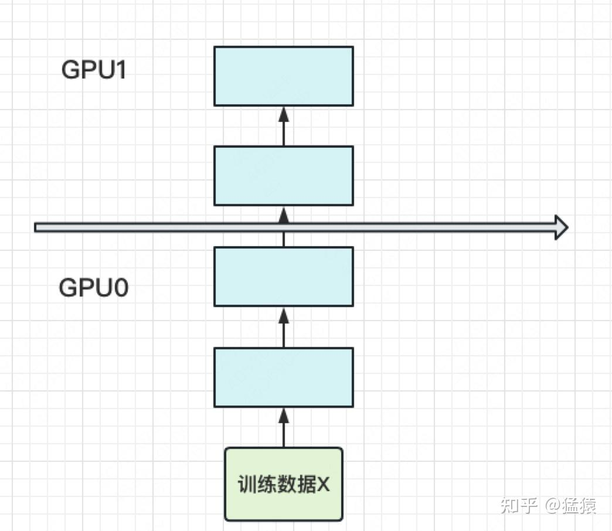
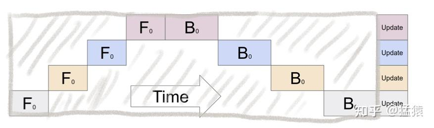
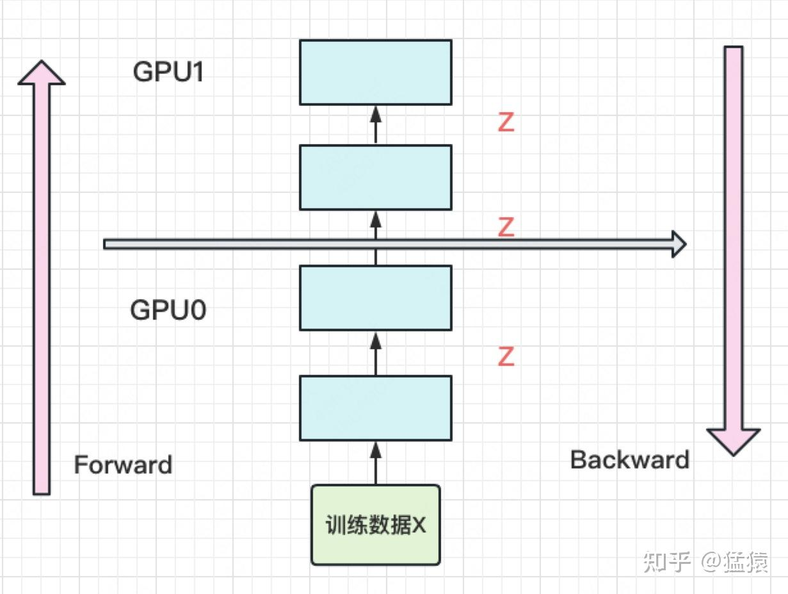
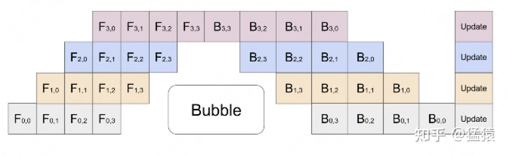
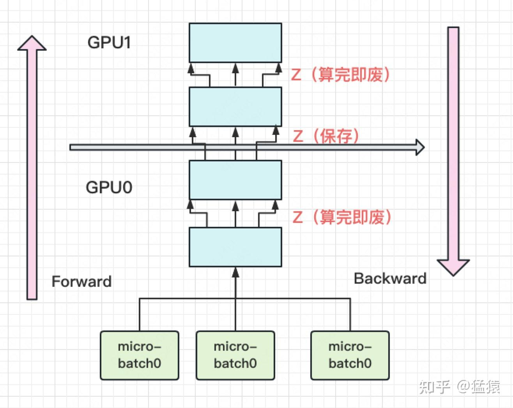
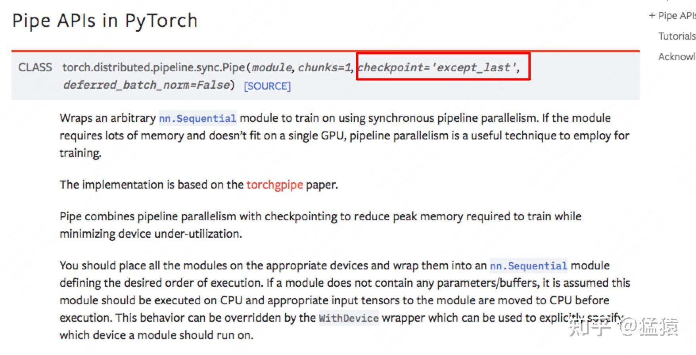
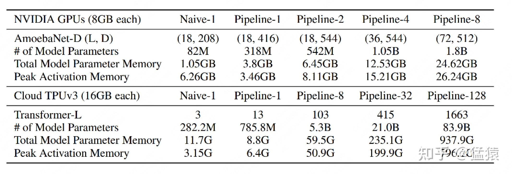
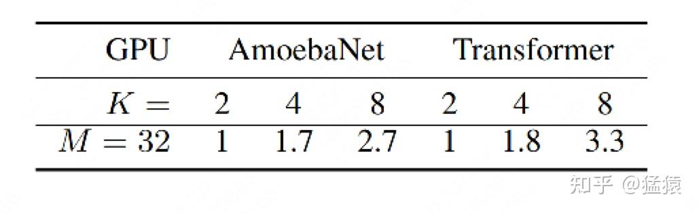
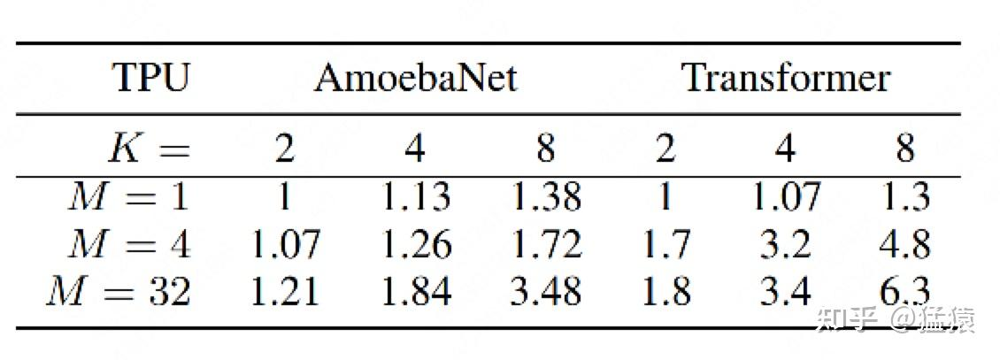
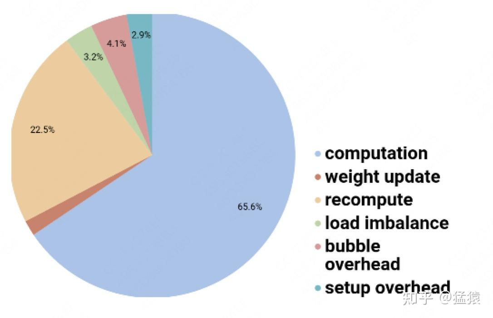

# Pipeline Parallelism

在大模型训练这个系列里，我们将一起探索学习几种经典的分布式并行范式，包括**流水线并行（Pipeline Parallelism），数据并行（Data Parallelism）和张量并行（Tensor Parallesim）**。微软开源的分布式训练框 [DeepSpeed](https://zhida.zhihu.com/search?content_id=224397503&content_type=Article&match_order=1&q=DeepSpeed&zhida_source=entity)，融合了这三种并行范式，开发出 **3D 并行**的框架，实现了千亿级别模型参数的训练。 
本篇文章将探索流水线并行，经典的流水线并行范式有 Google 推出的 Gpipe，和微软推出的PipeDream。两者的推出时间都在 2019 年左右，大体设计框架一致。主要差别为：在梯度更新上，Gpipe 是同步的，PipeDream 是异步的。异步方法更进一步降低了 GPU 的空转时间比。虽然 PipeDream 设计更精妙些，但是 Gpipe 因为其 “够用” 和浅显易懂，更受大众欢迎（torch 的 pp 接口就基于 Gpipe）。因此本文以 Gpipe 作为流水线并行的范例进行介绍。 
本文内容包括： 
1、优化目标 
2、模型并行 
3、流水线并行

*   切分 micro-batch
*   Re-materialization (active checkpoint)

4、实验效果

*   GPU 数量 VS 模型大小
*   GPU 数量 VS 训练速度
*   Gpipe 下单 GPU 的时间消耗分析

## 背景知识

### **计算梯度时需要中间结果**

在神经网络的反向传播过程中，我们使用链式法则计算梯度。例如，对于某一层的参数 $W$ ，梯度计算如下：
$$
\frac{\partial L}{\partial W} = \frac{\partial L}{\partial y} \cdot \frac{\partial y}{\partial W}
$$
其中：

- $L$ 是损失函数，
- $y$ 是该层的输出，
- $W$ 是权重参数。

由于 $\frac{\partial y}{\partial W}$ 依赖于前向传播时计算的 **输入 $x$**（即 $y = f(W, x)$），如果不存储这些中间结果，在反向传播时就必须 **重新进行一次前向计算**，这会极大地增加计算开销。

**示例：** 如果前向传播中的某一层计算为：

$y = Wx + b$

则反向传播计算梯度时需要：

$\frac{\partial y}{\partial W} = x$

但如果没有存储 $x$，就需要重新计算 $x$ 的来源（可能涉及前面的所有计算），导致额外的计算成本。

如果在前向传播时没有保存中间变量，那么反向传播时必须 **重新计算** 这些中间变量，以保证梯度计算的正确性。为了更具体地解释，我们以一个 **三层全连接网络** 为例，假设网络如下：

$\begin{aligned}    h_1 &= W_1 x + b_1, \quad a_1 = \sigma(h_1) \\    h_2 &= W_2 a_1 + b_2, \quad a_2 = \sigma(h_2) \\    h_3 &= W_3 a_2 + b_3, \quad y = \sigma(h_3) \end{aligned}$

其中：

- $x$ 是输入，$h_i$ 是线性变换结果，$a_i$ 是经过激活函数后的值。
- $W_i$ 是权重矩阵，$b_i$ 是偏置，$\sigma$ 是非线性激活函数（比如 ReLU 或 Sigmoid）。
- $y$ 是最终输出。

------

### **1. 传统反向传播（存储中间变量）**

如果存储了 $a_1, a_2, h_1, h_2, h_3, y$ 等变量，反向传播计算梯度时可以直接使用它们，无需重复计算：

$\frac{\partial L}{\partial W_3} = \frac{\partial L}{\partial y} \cdot \frac{\partial y}{\partial h_3} \cdot a_2^T$

由于 $a_2$ 在前向传播时存储过，因此可以直接用来计算梯度。

------

### **2. 时间换空间：不存储中间变量，反向传播时重算**

如果前向传播没有存储中间变量，那么在反向传播时，我们需要**从网络最底层开始，依次重新计算前向传播的中间值**，再计算梯度。

#### **(1) 计算输出层梯度**

我们假设损失函数为 $L(y, y_{\text{true}})$，其关于输出 $y$ 的梯度：

$\delta_3 = \frac{\partial L}{\partial y} \cdot \sigma'(h_3)$

但这里的 $h_3$ 之前没有存储，我们必须重新计算：

$h_3 = W_3 a_2 + b_3, \quad y = \sigma(h_3)$

然后再计算 $\delta_3$ 并继续梯度传播。

------

#### **(2) 计算隐藏层 2 的梯度**

$\delta_2 = (W_3^T \delta_3) \cdot \sigma'(h_2)$

但由于前向传播时没有存储 $h_2$ 和 $a_2$，我们需要**从头计算**：

$h_2 = W_2 a_1 + b_2, \quad a_2 = \sigma(h_2)$

然后计算 $\delta_2$。

------

#### **(3) 计算隐藏层 1 的梯度**

$\delta_1 = (W_2^T \delta_2) \cdot \sigma'(h_1)$

由于没有存储 $h_1$ 和 $a_1$，我们需要重新计算：

$h_1 = W_1 x + b_1, \quad a_1 = \sigma(h_1)$

然后计算 $\delta_1$。

------

### **3. 计算参数梯度**

在反向传播时，我们最终需要计算：

$\frac{\partial L}{\partial W_3} = \delta_3 a_2^T, \quad \frac{\partial L}{\partial W_2} = \delta_2 a_1^T, \quad \frac{\partial L}{\partial W_1} = \delta_1 x^T$

但由于 $a_1, a_2$ 都需要重算，意味着每次计算梯度时，都需要**重新执行前向传播的计算**。

------

### **4. 时间换空间的代价**

这样做的好处：

- **节省内存**，特别适用于**深度神经网络**（如 Transformer 或大规模 CNN），在计算资源受限的情况下使用。
- 适用于**推理时**，因为推理只需要前向传播，不涉及梯度计算。

但代价是：

- **计算量增加**，因为反向传播过程中需要重新计算前向传播的中间变量，导致**计算复杂度翻倍**。

------

### **5. 实际应用：Checkpointing（梯度检查点）**

在 PyTorch 和 TensorFlow 中，可以使用 **梯度检查点（Gradient Checkpointing）** 技术，即：

- **在前向传播时，只保存部分关键的中间变量（如部分层的激活值），丢弃其余变量**。
- **反向传播时，仅对需要的部分重新计算前向传播**，而不是完全重新计算所有中间值。

这种方法在大规模深度学习（如 GPT-4 训练）中很常见，可以**减少 GPU 内存使用，同时避免完全重算所有前向传播**，是一种折中方案。

一、优化目标
---------

当你从单卡穷人变成多卡富翁时，你做分布式训练的总体目标是什么呢？（虽然手握一张 A100 怎么能是穷呢）

*   **能训练更大的模型**。理想状况下，模型的大小和 GPU 的数量成线性关系。即 GPU 量提升 x 倍，模型大小也能提升 x 倍。
*   **能更快地训练模型**。理想状况下，训练的速度和 GPU 的数量成线性关系。即 GPU 量提升 x 倍，训练速度也能提升 x 倍。

这是目标，也是难点，难在于：

*   训练更大的模型时，每块 GPU 里不仅要存模型参数，还要存中间结果（用来做 Backward）。而更大的模型意味着需要更多的训练数据，进一步提高了中间结果的大小。加重了每块 GPU 的内存压力。我们将在下文详细分析这一点。（**对应着 GPU 中的内存限制**）
*   网络通讯开销。数据在卡之间进行传输，是需要通讯时间的。不做设计的话，这个通讯时间可能会抹平多卡本身带来的训练速度提升。（**对应着 GPU 间的带宽限制**）

明确这两个训练目标后，我们来看并行范式的设计者，是如何在现有硬件限制的条件下，完成这两个目标的。 

二、模型并行
---------

当你有一个单卡装不下的大模型时，一个直接的解决办法是，**把模型隔成不同的层，每一层都放到一块 GPU 上**，如下图： 

此时，模型做一轮 forward 和 backward 的过程如下： 

其中下标表示 batch 编号，这里只有一个 batch，因此下标都是 0。每一行表示一个 GPU。每一列表示 timestep。

这张图的含义是：我在 GPU0 上做完一次 forward，然后将 GPU0 上最后一层的输入传给 GPU1，继续做 forward，直到四块 GPU 都做完 forward 后，我再依次做 backward。等把四块 GPU 上的 backward 全部做完后，最后一个时刻我统一更新每一层的梯度。 
这样做确实能训更大的模型了，但也带来了两个问题：

**（1）GPU 利用度不够。** 

如图，阴影部分所表示的时间段里，**总有 GPU 在空转**。在 Gpipe 中，将阴影部分定义为 **bubble**。我们来计算一下 bubble。假设有 $K$  块 GPU，而单块 GPU 上做一次 forward 和 backward 的时间为： $t_{fb} = (t_{f} + t_{b})$ 。则： 

*   图中灰色长方形的整体面积为： $K*Kt_{fb}$ （宽 = $K$  ，长 = $Kt_{fb}$ ）
*   图中实际在做 forward 和 backward 的面积为： $Kt_{fb}$
*   图中阴影部分的面积为： $K*Kt_{fb} - Kt_{fb}=(K-1)Kt_{fb}$ 
*   图像阴影部分的占比为： $(K-1)Kt_{fb}/KKt_{fb} =(K-1)/K$

则我们定义出 bubble 部分的时间复杂度为： $O(\frac{K-1}{K})$  ，**当 K 越大，即 GPU 的数量越多时，空置的比例接近 1，即 GPU 的资源都被浪费掉了**。因此这个问题肯定需要解决。 
**（2）中间结果占据大量内存** 

在做 backward 计算梯度的过程中，我们需要用到每一层的中间结果 z。假设我们的模型有 L 层，每一层的宽度为 d，则对于每块 GPU，不考虑其参数本身的存储，额外的空间复杂度为 $O(N*\frac{L}{K}*d)$  。从这个复杂度可以看出，随着模型的增大，N，L，d 三者的增加可能会平滑掉 K 增加带来的 GPU 内存收益。因此，这也是需要优化的地方。 

三、流水线并行
----------

朴素的模型并行存在 GPU 利用度不足，中间结果消耗内存大的问题。而 Gpipe 提出的流水线并行，就是用来解决这两个主要问题的。

### 3.1 切分 micro-batch

流水线并行的核心思想是：**在模型并行的基础上，进一步引入数据并行的办法，即把原先的数据再划分成若干个 batch，送入 GPU 进行训练**。未划分前的数据，叫 **mini-batch**。在 mini-batch 上再划分的数据，叫 **micro-batch**。 
图例如下： 

其中，第一个下标表示 GPU 编号，第二个下标表示 micro-batch 编号。假设我们将 mini-batch 划分为 M 个，则流水线并行下，bubble 的时间复杂度为： $O(\frac{K-1}{K+M-1})$ (推导过程略，可参照第二部分的 bubble 推导流程)。Gpipe 通过实验证明，当 =4K ">$M>=4K$ M>=4K 时，bubble 产生的空转时间占比对最终训练时长影响是微小的，可以忽略不计。 
将 batch 切好，并逐一送入 GPU 的过程，就像一个流水生产线一样（类似于 CPU 里的流水线），因此也被称为 Pipeline Parallelism。

### 3.2 re-materialization（active checkpoint）

解决了 GPU 的空置问题，提升了 GPU 计算的整体效率。接下来，就要解决 GPU 的内存问题了。 
前文说过，随着模型的增加，每块 GPU 中存储的中间结果也会越大。对此，Gpipe 采用了一种非常简单粗暴但有效的办法：**用时间换空间，在论文里，这种方法被命名为 re-materalization，后人也称其为 active checkpoint**。 
具体来说，就是**几乎不存中间结果，等到 backward 的时候，再重新算一遍 forward**，图例如下：

**每块 GPU 上，我们只保存来自上一块的最后一层输入 z，其余的中间结果我们算完就废**。等到 backward 的时候再由保存下来的 z 重新进行 forward 来算出。 
现在我们来计算每块 GPU 峰值时刻的内存： 
**每块 GPU 峰值时刻存储大小 = 每块 GPU 上的输入数据大小 + 每块 GPU 在 forward 过程中的中间结果大小** 

每块 GPU 上固定需要保存它的起始输入，我们记起始输入为 $N$（即 mini-batch 的大小）。 
每个 micro-batch 是流水线形式进来的，算完一个 micro-batch 才算下一个。在计算一个 micro-batch 的过程中，我们会产生中间变量，它的大小为 $\frac{N}{M}*\frac{L}{K} * d$ （其中 M 为 micro-batch 个数）。 
**因此，每块 GPU 峰值时刻的空间复杂度为** $O(N + \frac{N}{M}*\frac{L}{K} * d)$ 
将其与朴素模型并行中的 GPU 空间复杂度 $O(N*\frac{L}{K}*d)$  比较，可以发现，由于采用了 micro-batch 的方法，当 L 变大时，流水线并行相比于朴素模型并行，对 GPU 内存的压力显著减小。

如果你使用 Pytorch 提供的 pipeline 接口，其中有一个参数叫 checkpoint，就是用来做这一项的。 

最后，再提一点，在 micro-batch 的划分下，我们在计算 **Batch Normalization** 时会有影响。Gpipe 的方法是，在训练时计算和运用的是 micro-batch 里的均值和方差，但同时持续追踪全部 mini-batch 的移动平均和方差，以便在测试阶段进行使用。Layer Normalization 则不受影响。

四、实验效果
---------

回顾第二部分的两个目标，Gpipe 真的实现了吗？如果实现不了，又是因为什么原因呢？我们来看下实验效果。 

### 4.1 GPU 数量 VS 模型大小

Gpipe 分别在 [AmoebaNet](https://zhida.zhihu.com/search?content_id=224397503&content_type=Article&match_order=1&q=AmoebaNet&zhida_source=entity)（图像）和 [Transformer](https://zhida.zhihu.com/search?content_id=224397503&content_type=Article&match_order=1&q=Transformer&zhida_source=entity)（自然语言）两个大模型上做了实验。 

*   Naive 表示单卡
*   Pipeline-N 表示 re-materalization + N 卡。
*   AmeobaNet-D 和 Trasformer-L 一行表示超参数的量
*   of Model Parameter 表示模型的参数量
*   Total Model Parameter Memory 表示模型参数所占内存大小
*   Peak Activation Memory 表示峰值时中间结果大小。可以发现，中间结果占据的内存大小是相当可观的。

从实验结果里，我们可以发现： 

*   在 Transformer 上，Gpipe 基本实现了模型大小（参数量）和 GPU 个数之间的线性关系。例如从 32 卡增到 128 卡时，模型的大小也从 21.08B 增加到 82.9B，约扩 4 倍
*   对 AmoebaNet 而言，却没有完全实现线性增长。例如从 4 卡到 8 卡，模型大小从 1.05B 到 1.8B，不满足 2 倍的关系。本质原因是 AmoebaNet 模型在切割时，没有办法像 Transformer 一样切得匀称，保证每一块 GPU 上的内存使用率是差不多的。因此对于 AmoebaNet，当 GPU 个数上升时，某一块 GPU 可能成为木桶的短板。

### 4.2 GPU 数量 VS 训练速度

**（1）关掉 [NVlinks](https://zhida.zhihu.com/search?content_id=224397503&content_type=Article&match_order=1&q=NVlinks&zhida_source=entity)**

为了验证 Gpipe 框架带来的收益，实验中关掉了 NVlinks（GPU 间快速通信的桥梁。估计是通过强迫 GPU 先连 CPU 然后再连别的 GPU 做到的）。关掉的意义在于说明，不靠硬件本身的高效通讯带来的收益，Gpipe 一样能做的很好。实验效果如下： 

M=32 表示 micro-batch 的数量为 32，K 表示 GPU 数量。从实验结果可知，在关掉 NVlinks 的情况下，Gpipe 一样也能实现随着 GPU 数量的增加，训练速度也增加的效果。虽然这两者间不是线性的。同样，因为模型切割不均的原因，AmoebaNet 的表现不如 Transformer。

**（2）开启 NVlinks，并寻找最佳 M** 

当重新开启 NVlinks 后，我们来看 M 的大小（即流水线的核心）对训练速度的影响。 

*   当 M=1 的时候，如前文所说，GPU 的空置率太高，因此两个模型都没有实现训练速度和 GPU 个数间的线性关系
*   当 M=4 时，表现明显好转。
*   当 M=32 时，表现最佳，且 Transformer 基本实现了训练速度和 GPU 个数的线性关系。 

### 4.3 Gpipe 下时间消耗分布

*   对每块 GPU 来说，约 2/3 的时间，是真正花在计算上的。
*   其余 1/3 的时间，大部分花在 re-materalization 策略下的重计算上。因为采用流水线的方法，bubble 的时间也被压缩到很短，可以忽略不计。

参考
--

1、[https://arxiv.org/abs/1811.06965](https://link.zhihu.com/?target=https%3A//arxiv.org/abs/1811.06965) 
2、[https://www.zhihu.com/question/508671222/answer/2290801813](https://www.zhihu.com/question/508671222/answer/2290801813) 
3、[https://cloud.tencent.com/developer/article/2089268](https://link.zhihu.com/?target=https%3A//cloud.tencent.com/developer/article/2089268)