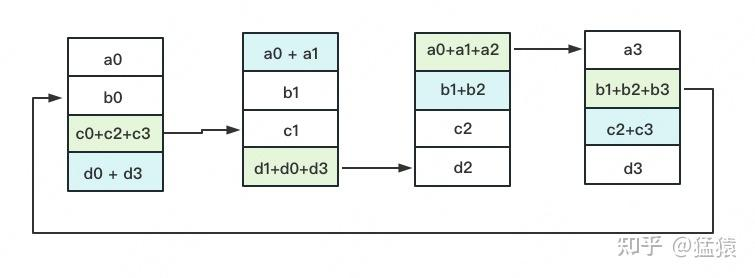
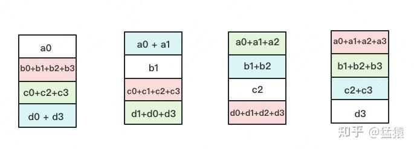

在上一篇的介绍中，我们介绍了以 Google GPipe 为代表的流水线并行范式。当模型太大，一块 GPU 放不下时，流水线并行将模型的不同层放到不同的 GPU 上，通过切割 mini-batch 实现对训练数据的流水线处理，提升 GPU 计算通讯比。同时通过 re-materialization 机制降低显存消耗。 
但在实际应用中，流水线并行并不特别流行，主要原因是模型能否均匀切割，影响了整体计算效率，这就需要算法工程师做手调。**因此，今天我们来介绍一种应用最广泛，最易于理解的并行范式：数据并行。** 
数据并行的核心思想是：**在各个 GPU 上都拷贝一份完整模型，各自吃一份数据，算一份梯度，最后对梯度进行累加来更新整体模型**。理念不复杂，但到了大模型场景，**巨大的存储和 GPU 间的通讯量，**就是系统设计要考虑的重点了。在本文中，我们将递进介绍三种主流数据并行的实现方式：

*   **DP（Data Parallelism）**：最早的数据并行模式，一般采用[参数服务器](https://zhida.zhihu.com/search?content_id=225271909&content_type=Article&match_order=1&q=%E5%8F%82%E6%95%B0%E6%9C%8D%E5%8A%A1%E5%99%A8&zhida_source=entity) (Parameters Server) 这一编程框架。实际中多用于单机多卡
*   **DDP（Distributed Data Parallelism）**：分布式数据并行，采用 Ring AllReduce 的通讯方式，实际中多用于多机场景
*   **ZeRO：**零冗余优化器。由微软推出并应用于其 [DeepSpeed](https://zhida.zhihu.com/search?content_id=225271909&content_type=Article&match_order=1&q=DeepSpeed&zhida_source=entity) 框架中。严格来讲 ZeRO 采用数据并行 + 张量并行的方式，旨在降低存储。

一、数据并行（DP） 
-------------

### 1.1 整体架构

一个经典数据并行的过程如下：

*   若干块**计算 GPU**，如图中 GPU0~GPU2；1 块**梯度收集 GPU**，如图中 AllReduce 操作所在 GPU。
*   在每块计算 GPU 上都拷贝一份完整的模型参数。
*   把一份数据 X（例如一个 batch）均匀分给不同的计算 GPU。
*   每块计算 GPU 做一轮 FWD 和 BWD 后，算得一份梯度 G。
*   每块计算 GPU 将自己的梯度 **push** 给梯度收集 GPU，做聚合操作。这里的聚合操作一般指**梯度累加**。当然也支持用户自定义。
*   梯度收集 GPU 聚合完毕后，计算 GPU 从它那 **pull** 下完整的梯度结果，用于更新模型参数 W。更新完毕后，计算 GPU 上的模型参数依然保持一致。
*   **聚合再下发梯度的操作，称为 AllReduce**。

前文说过，实现 DP 的一种经典编程框架叫 “参数服务器”，在这个框架里，**计算 GPU 称为 Worker**，**梯度聚合 GPU 称为 Server。**在实际应用中，为了尽量减少通讯量，一般可选择一个 Worker 同时作为 Server。比如可把梯度全发到 GPU0 上做聚合。需要再额外说明几点：

*   1 个 Worker 或者 Server 下可以不止 1 块 GPU。
*   Server 可以只做梯度聚合，也可以梯度聚合 + 全量参数更新一起做

在参数服务器的语言体系下，DP 的过程又可以被描述下图：

 

### 1.2 通讯瓶颈与梯度异步更新

DP 的框架理解起来不难，但实战中确有两个主要问题：

*   **存储开销大**。每块 GPU 上都存了一份完整的模型，造成冗余。关于这一点的优化，我们将在后文 ZeRO 部分做讲解。
*   **通讯开销大**。Server 需要和每一个 Worker 进行梯度传输。当 Server 和 Worker 不在一台机器上时，Server 的带宽将会成为整个系统的计算效率瓶颈。

我们对通讯开销再做详细说明。如果将传输比作一条马路，带宽就是马路的宽度，它决定每次并排行驶的数据量。例如带宽是 100G/s，但每秒却推给 Server 1000G 的数据，消化肯定需要时间。那么当 Server 在搬运数据，计算梯度的时候，Worker 们在干嘛呢？当然是在：

人类老板不愿意了：“打工系统里不允许有串行存在的任务！”，于是**梯度异步更新**这一管理层略诞生了。

上图刻画了在**梯度异步更新**的场景下，某个 Worker 的计算顺序为：

*   在第 10 轮计算中，该 Worker 正常计算梯度，并向 Server 发送 push&pull 梯度请求。
*   但是，该 Worker 并不会实际等到把聚合梯度拿回来，更新完参数 W 后再做计算。而是直接拿旧的 W，吃新的数据，继续第 11 轮的计算。**这样就保证在通讯的时间里，Worker 也在马不停蹄做计算，提升计算通讯比。**
*   当然，异步也不能太过份。只计算梯度，不更新权重，那模型就无法收敛。图中刻画的是**延迟为 1** 的异步更新，也就是在开始第 12 轮对的计算时，必须保证 W 已经用第 10、11 轮的梯度做完 2 次更新了。

参数服务器的框架下，延迟的步数也可以由用户自己决定，下图分别刻划了几种延迟情况：

*   **(a) 无延迟**
*   **(b) 延迟但不指定延迟步数**。也即在迭代 2 时，用的可能是老权重，也可能是新权重，听天由命。
*   **(c) 延迟且指定延迟步数为 1**。例如做迭代 3 时，可以不拿回迭代 2 的梯度，但必须保证迭代 0、1 的梯度都已拿回且用于参数更新。

总结一下，**异步很香，但对一个 Worker 来说，只是等于 W 不变，batch 的数量增加了而已，在 SGD 下，会减慢模型的整体收敛速度**。异步的整体思想是，比起让 Worker 闲着，倒不如让它多吃点数据，虽然反馈延迟了，但只要它在干活在学习就行。 
batch 就像活，异步就像画出去的饼，且往往不指定延迟步数，每个 Worker 干越来越多的活，但模型却没收敛取效，这又是刺伤了哪些打工仔们的心（狗头 

二、分布式数据并行 (DDP)
---------------

受通讯负载不均的影响，**DP 一般用于单机多卡场景**。因此，DDP 作为一种更通用的解决方案出现了，既能多机，也能单机。**DDP 首先要解决的就是通讯问题：将 Server 上的通讯压力均衡转到各个 Worker 上。实现这一点后，可以进一步去 Server，留 Worker。** 
前文我们说过，聚合梯度 + 下发梯度这一轮操作，称为 AllReduce。**接下来我们介绍目前最通用的 AllReduce 方法：Ring-AllReduce**。它由百度最先提出，非常有效地解决了数据并行中通讯负载不均的问题，使得 DDP 得以实现。

### 2.1 Ring-AllReduce

如下图，假设有 4 块 GPU，每块 GPU 上的数据也对应被切成 4 份。**AllReduce 的最终目标，就是让每块 GPU 上的数据都变成箭头右边汇总的样子**。

Ring-ALLReduce 则分两大步骤实现该目标：**Reduce-Scatter** 和 **All-Gather。**

**Reduce-Scatter** 
定义网络拓扑关系，使得每个 GPU 只和其相邻的两块 GPU 通讯。每次发送对应位置的数据进行**累加**。每一次累加更新都形成一个拓扑环，因此被称为 Ring。看到这觉得困惑不要紧，我们用图例把详细步骤画出来。

一次累加完毕后，蓝色位置的数据块被更新，被更新的数据块将成为下一次更新的起点，继续做累加操作。

**3 次**更新之后，每块 GPU 上都有一块数据拥有了对应位置完整的聚合（图中红色）。此时，Reduce-Scatter 阶段结束。进入 All-Gather 阶段。目标是把红色块的数据广播到其余 GPU 对应的位置上。 
**All-Gather** 
如名字里 Gather 所述的一样，这操作里依然按照 “相邻 GPU 对应位置进行通讯” 的原则，但对应位置数据不再做相加，而是直接替换。All-Gather 以红色块作为起点。

以此类推，同样经过 **3 轮迭代后**，使得每块 GPU 上都汇总到了完整的数据，变成如下形式：

建议读者们手动推一次，加深理解。

### 2.2 Ring-AllReduce 通讯量分析

假设模型参数 W 的大小为 $\Phi$  ，GPU 个数为 $N$  。则梯度大小也为 $\Phi$ ，每个梯度块的大小为 $\frac{\Phi}{N}$
对单卡 GPU 来说（只算其 send 通讯量）：

*   Reduce-Scatter 阶段，通讯量为 $(N-1)\frac{\Phi}{N}$
*   All-Gather 阶段，通讯量为 $(N-1)\frac{\Phi}{N}$ 

**单卡总通讯量为** $2(N-1)\frac{\Phi}{N}$ **，随着 N 的增大，可以近似为** $2\Phi$  。**全卡总通讯量为** $2N\Phi$ 
而对前文的 DP 来说，它的 Server 承载的通讯量是 $N\Phi$  ，Workers 为 $N\Phi$ ，全卡总通讯量依然为 $2N\Phi$ 。**虽然通讯量相同，但搬运相同数据量的时间却不一定相同**。DDP 把通讯量均衡负载到了每一时刻的每个 Worker 上，而 DP 仅让 Server 做勤劳的搬运工。当越来越多的 GPU 分布在距离较远的机器上时，DP 的通讯时间是会增加的。 
但这并不说明参数服务器不能打（有很多文章将参数服务器当作 old dinosaur 来看）。事实上，参数服务器也提供了多 Server 方法，如下图：

在多 Server 的模式下，进一步，每个 Server 可以只负责维护和更新某一块梯度（也可以某块梯度 + 参数一起维护），此时虽然每个 Server 仍然需要和所有 Worker 通讯，但它的带宽压力会小非常多。经过调整设计后，依然可以用来做 DDP。虽然这篇文章是用递进式的方式来介绍两者，但不代表两者间一定要决出优劣。**我想表达的观点是，方法是多样性的。**对参数服务器有兴趣的朋友，可以阅读参考的第 1 个链接。 
最后，**请大家记住 Ring-AllReduce 的方法，因为在之后的 ZeRO，Megatron-LM 中，它将频繁地出现，是分布式训练系统中重要的算子。**

三、总结
----

1、在 DP 中，每个 GPU 上都拷贝一份完整的模型，每个 GPU 上处理 batch 的一部分数据，所有 GPU 算出来的梯度进行累加后，再传回各 GPU 用于更新参数 
2、DP 多采用参数服务器这一编程框架，一般由若个计算 Worker 和 1 个梯度聚合 Server 组成。Server 与每个 Worker 通讯，Worker 间并不通讯。因此 Server 承担了系统所有的通讯压力。基于此 DP 常用于单机多卡场景。 
3、异步梯度更新是提升计算通讯比的一种方法，延迟更新的步数大小决定了模型的收敛速度。 
4、Ring-AllReduce 通过定义网络环拓扑的方式，将通讯压力均衡地分到每个 GPU 上，使得跨机器的数据并行（DDP）得以高效实现。 
5、DP 和 DDP 的总通讯量相同，但因负载不均的原因，DP 需要耗费更多的时间搬运数据

四、参考
----

1、[https://web.eecs.umich.edu/~mosharaf/Readings/Parameter-Server.pdf](https://link.zhihu.com/?target=https%3A//web.eecs.umich.edu/~mosharaf/Readings/Parameter-Server.pdf) 
2、[https://zh.d2l.ai/chapter_computational-performance/parameterserver.html](https://link.zhihu.com/?target=https%3A//zh.d2l.ai/chapter_computational-performance/parameterserver.html) 
3、[https://blog.csdn.net/dpppBR/article/details/80445569](https://link.zhihu.com/?target=https%3A//blog.csdn.net/dpppBR/article/details/80445569) 
4、[https://arxiv.org/abs/1910.02054](https://link.zhihu.com/?target=https%3A//arxiv.org/abs/1910.02054) 
5、[https://blog.51cto.com/u_14691718/5631471](https://link.zhihu.com/?target=https%3A//blog.51cto.com/u_14691718/5631471)