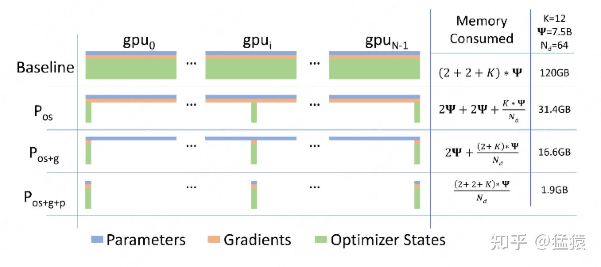
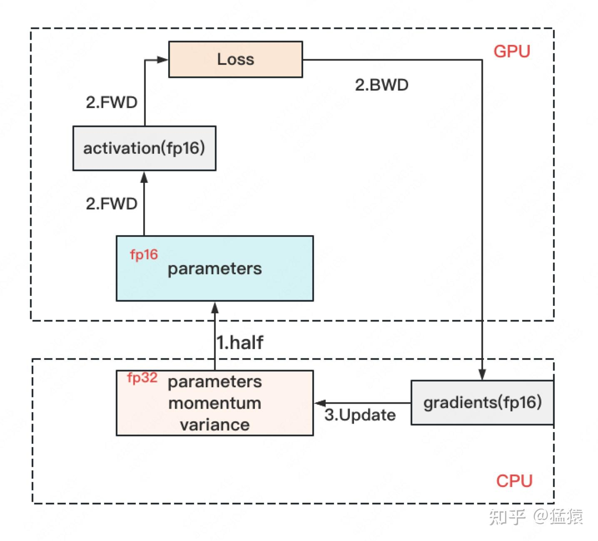

# Zero Redundancy Optimizer

在数据并行上篇中，我们介绍了朴素数据并行（DP）与分布式数据并行（DDP）。两者的总通讯量虽然相同，但 DP 存在负载不均的情况，大部分的通讯压力集中在 Server 上，而 Server 的通讯量与 GPU 数量呈线性关系，导致 **DP** 一般适用于**单机多卡**场景。而 **DDP** 通过采用 **Ring-AllReduce** 这一 NCCL 操作，使得通讯量均衡分布到每块 GPU 上，且该通讯量为一固定常量，不受 GPU 个数影响，因此可实现**跨机器**的训练。（[阅读本文前，强烈建议阅读上一篇](https://zhuanlan.zhihu.com/p/617133971)） 
在上篇介绍中，**通讯负载不均**的优化我们解释过了，但还遗留了一个**显存开销**问题：数据并行中，每个 GPU 上都复制了一份完整模型，当模型变大时，很容易打爆 GPU 的显存，那要怎么办呢？ 
今天这篇文章，我们将介绍由微软开发的 **ZeRO（零冗余优化）**，它是 [DeepSpeed](https://zhida.zhihu.com/search?content_id=225657093&content_type=Article&match_order=1&q=DeepSpeed&zhida_source=entity) 这一分布式训练框架的核心，被用来解决大模型训练中的显存开销问题。**ZeRO 的思想就是用通讯换显存。**如果初读 ZeRO，觉得它逻辑跳跃，晦涩难懂，那么这篇文章或许可以帮到你～

**【20231205 更新】**

**针对评论区问得比较多的问题，这边做一下回复：**

**（1）stage1 的通讯量为什么是 $3\Phi$ 而不是 $2\Phi$ ？**

先说结论：实操中是 $2\Phi$ ，按论文概念定义是 $3\Phi$ 。

在实操中，我们可以只对梯度做一次 scatter-reduce，并用各自维护的 optimizer 去更新对应的 W，然后再对 W 做 all-gather 使得每块卡上都有更新后的完整 W，这样通讯量就是 $2\Phi$ 。

那么 $3\Phi$ 是怎么来的呢？因为论文定义 stage1 只有 optimizer 是切开的，意味着 G 和 W 都是完整的。所以对 G 做 all-reduce（虽然拿回完整的 G 并没有意义），对 W 做 all-gather，这样通讯量就是 $3\Phi$ 。

本文写作时，最终选择按照论文对相关概念的定义，选择了 $3\Phi$ ，但是实操来看是完全可以用 $2\Phi$ 实现的。评论区有朋友提到 deepspeed 的某次代码更新是将 stage1 的通讯量从 $3\Phi$ 降至 $2\Phi$ ，可能也是基于此做了改进。

一、存储消耗
------

### 1.1 存储分类

首先，我们来看在大模型训练的过程中，GPU 都需要存什么内容。

存储主要分为两大块：Model States 和 Residual States 

1. **Model States** 指和模型本身息息相关的，必须存储的内容，具体包括：
   1. **optimizer states**：[Adam 优化](https://zhida.zhihu.com/search?content_id=225657093&content_type=Article&match_order=1&q=Adam%E4%BC%98%E5%8C%96&zhida_source=entity)算法中的 momentum 和 variance
   2. **gradients**：模型梯度
   3. **parameters**：模型参数 W
2. **Residual States** 指并非模型必须的，但在训练过程中会额外产生的内容，具体包括：

   1. **activation**：激活值。在流水线并行中我们曾详细介绍过。在 backward 过程中使用链式法则计算梯度时会用到。有了它算梯度会更快，但它不是必须存储的，因为可以通过重新做 Forward 来算它。
   2. **temporary buffers:** 临时存储。例如把梯度发送到某块 GPU 上做加总聚合时产生的存储。
   3. **unusable fragment memory**：碎片化的存储空间。虽然总存储空间是够的，但是如果取不到连续的存储空间，相关的请求也会被 fail 掉。对这类空间浪费可以通过内存整理来解决。

### 1.2 精度混合训练

知道了存储分类，进一步，我们想知道，假设模型的参数 W 大小是 $\Phi $，那么每一类存储具体占了多大的空间呢？ 在分析这个问题前，我们需要来了解**精度混合训练**。 

对于模型，我们肯定希望其参数越精准越好，也即我们用 **fp32（单精度浮点数，存储占 4byte）**来表示参数 W。但是在 forward 和 backward 的过程中，fp32 的计算开销也是庞大的。那么能否在计算的过程中，引入 **fp16 或 bf16（半精度浮点数，存储占 2byte）**，来减轻计算压力呢？于是，[混合精度训练](https://zhida.zhihu.com/search?content_id=225657093&content_type=Article&match_order=1&q=%E6%B7%B7%E5%90%88%E7%B2%BE%E5%BA%A6%E8%AE%AD%E7%BB%83&zhida_source=entity)就产生了，它的步骤如下图：

*   存储一份 fp32 的 parameter，momentum 和 variance（统称 model states）
*   在 forward 开始之前，额外开辟一块存储空间，将 fp32 parameter 减半到 fp16 parameter。
*   正常做 forward 和 backward，在此之间产生的 activation 和 gradients，都用 fp16 进行存储。
*   用 fp16 gradients 去更新 fp32 下的 model states。
*   当模型收敛后，fp32 的 parameter 就是最终的参数输出。

通过这种方式，混合精度训练在计算开销和模型精度上做了权衡。如果不了解 fp32，fp16 和 bf16 的细节也没关系，不影响下文的阅读。只要记住它们所占的存储空间和精度表达上的差异即可。

### 1.3 存储大小

现在，我们可以来计算模型在训练时需要的存储大小了，假设模型的参数 W 大小是 $\Phi$  ，**以 byte 为单位**，存储如下：

因为采用了 Adam 优化，所以才会出现 momentum 和 variance，当然你也可以选择别的优化办法。因此这里为了更通用些，记模型必存的数据大小为 $K\Phi$ 。因此最终内存开销为： $2\Phi + 2\Phi + K\Phi$ 
另外，**这里暂不将 activation 纳入统计范围**，原因是：

*   activation 不仅与模型参数相关，还与 batch size 相关
*   activation 的存储不是必须的。存储 activation 只是为了在用链式法则做 backward 的过程中，计算梯度更快一些。但你永远可以通过只保留最初的输入 X，重新做 forward 来得到每一层的 activation（虽然实际中并不会这么极端）。
*   因为 activation 的这种灵活性，纳入它后不方便衡量系统性能随模型增大的真实变动情况。因此在这里不考虑它，在后面会单开一块说明对 activation 的优化。

二、ZeRO-DP
------------

知道了什么东西会占存储，以及它们占了多大的存储之后，我们就可以来谈如何优化存储了。 
注意到，在整个训练中，有很多 states 并不会每时每刻都用到，举例来说；

*   Adam 优化下的 optimizer states 只在最终做 update 时才用到
*   数据并行中，gradients 只在最后做 AllReduce 和 updates 时才用到
*   参数 W 只在做 forward 和 backward 的那一刻才用到
*   诸如此类

所以，ZeRO 想了一个简单粗暴的办法：**如果数据算完即废，等需要的时候，我再想办法从个什么地方拿回来，那不就省了一笔存储空间吗？** 
沿着这个思路，我们逐一来看 ZeRO 是如何递进做存储优化的。

### **2.1** $P_{os}$ **：优化状态分割**

首先，从 optimizer state 开始优化。将 optimizer state 分成若干份，每块 GPU 上各自维护一份。这样就减少了相当一部分的显存开销。如下图：

复习一下，此时 W=fp16，G=fp16，O=fp32。此时，整体数据并行的流程如下：

（1）每块 GPU 上存一份完整的参数 W。将一个 batch 的数据分成 3 份，每块 GPU 各吃一份，做完一轮 foward 和 backward 后，各得一份梯度。

（2）对梯度做一次 **AllReduce**，**得到完整的梯度 G**，产生单卡通讯量 $2\Phi$ 。**为了表达简明，这里通讯量我们就不再换算成 byte 了**，而直接根据参数量来计算。对 **AllReduce（reduce-scatter + all-gather）**不熟悉的朋友，可以先去看DP。

（3）得到完整梯度 G，就可以对 W 做更新。我们知道 W 的更新由 optimizer states 和梯度共同决定。**由于每块 GPU 上只保管部分 optimizer states，因此只能将相应的 W（蓝色部分）进行更新**。（2）和（3）可以用下图表示：

（4）此时，每块 GPU 上都有部分 W 没有完成更新（图中白色部分）。所以我们需要对 W 做一次 **All-Gather**，从别的 GPU 上把更新好的部分 W 取回来。产生单卡通讯量 $\Phi$ 。

做完 $P_{os}$ 后，设 GPU 个数为 $N_d$ ，显存和通讯量的情况如下：

假设各变量大小如表格第二列所示，那么 $P_{os}$ 在增加 1.5 倍单卡通讯开销的基础上，将单卡存储降低了 4 倍。看起来是个还不错的 trade-off，那么还能做得更好吗

### **2.2** $P_{os} + P_{g}$ ：优化状态与梯度分割

现在，更近一步，我们把梯度也拆开，每个 GPU 格子维护一块梯度。

此时，数据并行的整体流程如下： 
（1）每块 GPU 上存一份完整的参数 W。将一个 batch 的数据分成 3 份，每块 GPU 各吃一份，做完一轮 foward 和 backward 后，**算得一份完整的梯度（下图中绿色 + 白色）**。 
（2）对梯度做一次 **Reduce-Scatter**，保证每个 GPU 上所维持的那块梯度是聚合梯度。例如对 GPU1，它负责维护 G1，因此其他的 GPU 只需要把 G1 对应位置的梯度发给 GPU1 做加总就可。汇总完毕后，白色块对 GPU 无用，可以从显存中移除。单卡通讯量 $\Phi$ 。（1）和（2）见下图：

（3）每块 GPU 用自己对应的 O 和 G 去更新相应的 W。更新完毕后，**每块 GPU 维持了一块更新完毕的 W**。同理，对 W 做一次 **All-Gather**，将别的 GPU 算好的 W 同步到自己这来。单卡通讯量 $\Phi$ **。**

再次比对下显存和通讯量：

和朴素 DP 相比，**存储降了 8 倍，单卡通讯量持平**，好像更牛皮了呢！那么，还可以优化吗？

### **2.3** $P_{os} + P_{g} + P{p}$ ：优化状态、梯度与参数分割

看到这里，也许你有点感觉了，**ZeRO 的思想就是：万物皆可切，万物皆可抛**。所以现在，我们把参数也切开。每块 GPU 置维持对应的 optimizer states，gradients 和 parameters（即 W）。

数据并行的流程如下： 
（1）每块 GPU 上只保存部分参数 W。将一个 batch 的数据分成 3 份，每块 GPU 各吃一份。 
（2）做 forward 时，对 W 做一次 **All-Gather**，取回分布在别的 GPU 上的 W，得到一份完整的 W，单卡通讯量 $\Phi$ **。forward 做完，立刻把不是自己维护的 W 抛弃。** 
（3）做 backward 时，对 W 做一次 **All-Gather**，取回完整的 W，单卡通讯量 $\Phi$ **。backward 做完，立刻把不是自己维护的 W 抛弃。** 
（4）做完 backward，算得一份完整的梯度 G，对 G 做一次 **Reduce-Scatter**，从别的 GPU 上聚合自己维护的那部分梯度，单卡通讯量 $\Phi$ **。聚合操作结束后，立刻把不是自己维护的 G 抛弃**。 
（5）用自己维护的 O 和 G，更新 W。由于只维护部分 W，因此无需再对 W 做任何 AllReduce 操作。

显存和通讯量如下：

到这一步，**我们用 1.5 倍的通讯开销，换回近 120 倍的显存**。只要梯度计算和异步更新做的好，通讯时间大部分可以被计算时间隐藏，因此这样的额外通讯开销，也是划算的。

到这里，我们可以放出原始论文中的说明图了，经过以上分析，这张说明图是不是瞬间就能看懂了。不得不吐槽下，虽然 ZeRO 的设计不复杂，但对应论文写得真是逻辑跳跃，晦涩难懂....

_仔细一想，ZeRO 其实掌握了降本增效的精髓：用完即弃，需要再补。反正我补一个和你差不多的，也不会花费很多通（找）讯（人）时间，还大大降低了我的成本。模型的每一层多算（造）几（轮）遍（子）有啥关系呢，反正在我的预算里每个人都一刻不停地干活，就行啦！_

 

**2.4 ZeRO VS 模型并行**

知道模型并行的朋友，可能会想，既然 ZeRO 都把参数 W 给切了，那它应该是个模型并行呀？为什么要归到数据并行里呢？ 
其实 **ZeRO 是模型并行的形式，数据并行的实质**。 
模型并行，是指在 forward 和 backward 的过程中，我只需要用自己维护的那块 W 来计算就行。即**同样的输入 X，每块 GPU 上各算模型的一部分，最后通过某些方式聚合结果**。 
但对 ZeRO 来说，它做 forward 和 backward 的时候，是需要把各 GPU 上维护的 W 聚合起来的，即本质上还是用完整的 W 进行计算。**它是不同的输入 X，完整的参数 W，最终再做聚合**。 

三、ZeRO-R
--------

说完了以上对 model states 的显存优化，现在来看对 residual states 的优化。 

### **3.1** $P_{a}$ **: Partitioned Activation Checkpointing**

前面说过，对 activation 的存储是灵活的。**不像 optimizer states，gradients 和 parameters 对模型更新是必须的，activation 只是起到加速梯度计算的作用**。因此，在哪几层保存 activation，保存哪些 activation 都是可以灵活设置的。同样，我们也可以仿照以上切割方式，每块 GPU 上只维护部分的 activation，需要时再从别的地方聚合过来就行。需要注意的是，**activation 对显存的占用一般会远高于模型本身**，通讯量也是巨大的，所以这块要灵活、有效地实验设计。

### **3.2** $C_{B}$ **: Constant Size Buffer**

固定大小的内存 buffer，它的目的在于：

*   提升带宽利用率。当 GPU 数量上升，GPU 间的通讯次数也上升，每次的通讯量可能下降（但总通讯量不会变）。数据切片小了，就不能很好利用带宽了。所以这个 buffer 起到了积攒数据的作用：等数据积攒到一定大小，再进行通讯。
*   使得存储大小可控。在每次通讯前，积攒的存储大小是常量，是已知可控的。更方便使用者对训练中的存储消耗和通讯时间进行预估。

### 3.3 $M_{D}$ : Memory Defragmentation

在前文提过，设置机制，对碎片化的存储空间进行重新整合，整出连续的存储空间。防止出现总存储足够，但连续存储不够而引起的存储请求 fail

四、ZeRO-Offload 与 ZeRO-Infinity
-----------------------------------------------------------------------------------------------------------------------------------------------------------------------------------------------------------------------------------------------------------------------------------------

最后，简单介绍一下 ZeRO-Offload。它的核心思想是：**显存不够，内存来凑**。如果我把要存储的大头卸载 (offload) 到 CPU 上，而把计算部分放到 GPU 上，**这样比起跨机，是不是能既降显存，也能减少一些通讯压力呢**？ 
ZeRO-Offload 的做法是：

*   **forward 和 backward 计算量高**，因此和它们相关的部分，例如参数 W（fp16），activation，就全放入 GPU。
*   **update 的部分计算量低**，因此和它相关的部分，全部放入 CPU 中。例如 W(fp32)，optimizer states（fp32）和 gradients(fp16) 等。

具体切分如下图：

ZeRO-infinity 也是同理，它们在解决的事情都是：找个除 GPU 之外的地方，存数据。感兴趣的朋友可以深入研究，这里就不展开了。

五、参考
-------

1、[https://arxiv.org/pdf/1910.02054.pdf](https://link.zhihu.com/?target=https%3A//arxiv.org/pdf/1910.02054.pdf) 
2、[https://blog.51cto.com/u_14691718/5631471](https://link.zhihu.com/?target=https%3A//blog.51cto.com/u_14691718/5631471) 
3、[https://blog.csdn.net/qq_43307074/article/details/127688761](https://link.zhihu.com/?target=https%3A//blog.csdn.net/qq_43307074/article/details/127688761)