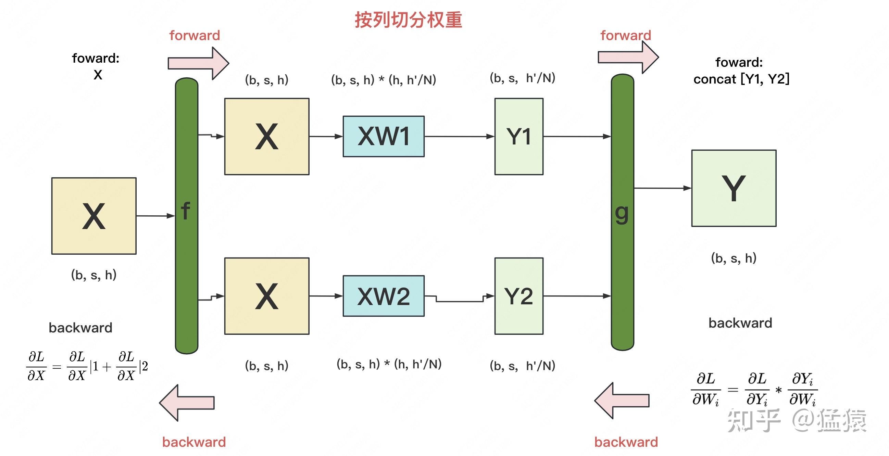
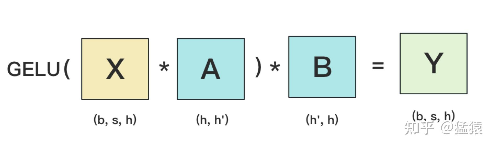

# Tensor Parallelism

在之前的内容中，我们已经介绍过流水线并行、数据并行（DP，DDP 和 ZeRO）。**今天我们将要介绍最重要，也是目前基于 Transformer 做大模型预训练最基本的并行范式：来自 NVIDIA 的张量模型并行 (TP)**。它的基本思想就是**把模型的参数纵向切开，放到不同的 GPU 上进行独立计算，然后再做聚合**。

在读 Megatron 的过程中，我发现要理解 Megatron 的大框架不难，但是涉及到细节，特别是混合并行部分，要考虑的就很多了。**所以我去看了 Megatron 的源码，在此基础上配合图例写了这篇文章，其中的很多设计思想和细节就来自对源码的阅读**。既然看都看了，因此我决定**在大模型系列的下一章里，和大家一起阅读 Megatron 的源码**。毕竟手动并行不像调 API 那样简单，需要根据实际模型设计并行框架，并知道在哪里打日志，做 checkpoint。

全文结构如下：
一、切分权重的两种方法
二、MLP 层
三、self-attention 层
四、Embedding 层
五、Cross-entropy 层
六、经典并行：TP + DP (Megatron + ZeRO)
七、实验效果与 GPU 利用率
八、参考

顺便，Megatron，变形金刚反派队伍霸天虎首领，现任环球影城脱口秀演员（啊不是），没有它就凸显不出擎天柱们的战绩，没有它就没有变形金刚电影，我曾经的暑假快乐就要少很多，而现在没有它就没有大 Transformer 的诞生。所以，引燃人类 AGI 的热情，可以被当作 Megatron 的阴谋拍进下一部电影里么？

一、切分权重
---------

设输入数据为 X，参数为 W。X 的维度 = (b, s, h)，W 的维度 = (h, h')。其中：

*   `b`：batch_size，表示批量大小
*   `s`：sequence_length，表示输入序列的长度
*   `h`：hidden_size，表示每个 token 向量的维度。
*   `h'`：参数 W 的 hidden_size。

则每次 forward 的过程如下：

为画图方便，图中所绘是`b=1`时的情况。
假设现在 W 太大，导致单卡装不下。我们需要把 W 切开放到不同的卡上，则我们面临三个主要问题：

*   怎么切分 W。
*   切完 W 后，怎么做 forward。
*   做完 forward 后，怎么做 backward，进而求出梯度，更新权重。

一般来说，我们可以沿着 W 的行（h 维度），或者列（h'维度）切分 W。下面我们分别介绍这两种切割办法，并说明它们是如何做 forward 和 backward 的。

### 1.1 按行切分权重

**(1) forward**

我们用`N`来表示 GPU 的数量。有几块 GPU，就把 W 按行维度切成几份。下图展示了 N=2 时的切割方式：

W 按照行维度切开后，X 的维度和它不对齐了，这可怎么做矩阵乘法呢？很简单，再把 X“按列切开” 就行了，如下图所示：

**(2) backward**

做完 forward，取得预测值 Y，进而可计算出损失 L，接下来就能做 backward 了。我们重画一下 forward 的过程，并在其中加入 backward 的部分，整体流程图如下：

*   **`f` 和 `g`**：分别表示两个算子，每个算子都包含一组 forward + backward 操作。forward 操作已讲过，不再赘述。
*   图中的每一行，表示单独在一块 GPU 上计算的过程
*   **`g` 的 backward**：假定现在我们要对 $W_i$ 求梯度，则可推出 $\frac{\partial L}{\partial W_i} = \frac{\partial L}{\partial Y} * \frac{\partial Y}{\partial Y_i} * \frac{\partial Y_i}{\partial W_i} = \frac{\partial L}{\partial Y} * \frac{\partial Y_i}{\partial W_i}$ ，也就是说，只要把 $\frac{\partial L}{\partial Y}$ 同时广播到两块 GPU 上，两块 GPU 就可以**独立计算**各自权重的梯度了。
*   **`f` 的 backward**：在上图中，我们只画了模型其中一层的计算过程。当模型存在多层时，梯度要从上一层向下一层传播。比如图中，梯度要先传播到 X，然后才能往下一层继续传递。这就是`f` 的 backward 的作用。这里也易推出， $\frac{\partial L}{\partial X} = concat[\frac{\partial L}{\partial X_1}, \frac{\partial L}{\partial X_2}]$

### 1.2 按列切分权重

**（1）forward**

按列切分权重后，forward 计算图如下：

**（2）backward**

*   `g`的 backward：易推出 $\frac{\partial L}{\partial W_i} = \frac{\partial L}{\partial Y_i} * \frac{\partial Y_i}{\partial W_i}$
*   `f` 的 backward：因为对于损失 L，X 既参与了 XW1 的计算，也参与了 XW2 的计算。因此有 $\frac{\partial L}{\partial X} = \frac{\partial L}{\partial X}|1 + \frac{\partial L}{\partial X}|2$ 。其中 $\frac{\partial L}{\partial X}|i$ 表示第 i 块 GPU 上计算到 X 时的梯度。

现在，我们已分别介绍完了 “按行” 和“按列”切分权重的方法。在 Megatron-LM 中，权重的切分操作就是由这两个基础算子组合而成的。接下来，针对 Transformer 模型，我们依次来看在不同的部分里，Megatron-LM 是怎么做切分的。

二、MLP 层
-------

### 2.1 MLP 层的张量模型并行计算方法

MLP 层构造最简单，所以我们先来看它。MLP 层计算过程如下图：

其中，[GELU](https://zhida.zhihu.com/search?content_id=226400639&content_type=Article&match_order=1&q=GELU&zhida_source=entity) 是激活函数，A 和 B 分别为两个线性层。在 Transformer 里，一般设 h' = 4h。假设现在有 N 块 GPU，我们要把 MLP 层的权重拆到上面做计算，要怎么拆分呢？Megatron 提供的拆分办法如下：

在 MLP 层中，**对 A 采用 “列切割”，对 B 采用 “行切割”**。

*   `f` 的 forward 计算：把输入 X 拷贝到两块 GPU 上，每块 GPU 即可独立做 forward 计算。
*   `g` 的 forward 计算：每块 GPU 上的 forward 的计算完毕，取得 Z1 和 Z2 后，GPU 间做一次 **AllReduce**，相加结果产生 Z。
*   `g` 的 backward 计算：只需要把 $\frac{\partial L}{\partial Z}$ 拷贝到两块 GPU 上，两块 GPU 就能各自独立做梯度计算。
*   `f` 的 backward 计算：当当前层的梯度计算完毕，需要传递到下一层继续做梯度计算时，我们需要求得 $\frac{\partial L}{\partial X}$ 。则此时两块 GPU 做一次 **AllReduce**，把各自的梯度 $\frac{\partial L}{\partial X}|1$ 和 $\frac{\partial L}{\partial X}|2$ 相加即可。

为什么我们对 A 采用列切割，对 B 采用行切割呢？**这样设计的原因是，我们尽量保证各 GPU 上的计算相互独立，减少通讯量**。对 A 来说，需要做一次 GELU 的计算，而 GELU 函数是非线形的，它的性质如下：

也就意味着，如果对 A 采用行切割，我们必须在做 GELU 前，做一次 AllReduce，这样就会产生额外通讯量。但是如果对 A 采用列切割，那每块 GPU 就可以继续独立计算了。一旦确认好 A 做列切割，那么也就相应定好 B 需要做行切割了。

### 2.2 MLP 层的通讯量分析

由 2.1 的分析可知，**MLP 层做 forward 时产生一次 AllReduce，做 backward 时产生一次 AllReduce**。在[之前](https://zhuanlan.zhihu.com/p/617133971)的文章里我们讲过，AllReduce 的过程分为两个阶段，Reduce-Scatter 和 All-Gather，每个阶段的通讯量都相等。现在我们设每个阶段的通讯量为 $\Phi$，则**一次 AllReduce 产生的通讯量为** $2\Phi$ **。MLP 层的总通讯量为** $4\Phi$ 。

根据上面的计算图，我们也易知， $\Phi = b * s * h$

三、Self-Attention 层
------------------

现在，我们来看稍微复杂一点的 self-attention 层切割方式（Transformer 中 Encode 和 Decoder 之间还有做 cross-attention，但计算逻辑和 self-attention 一致，因此这里只拿 self-attention 举例）。
首先，我们快速过一下 [multi-head attention](https://zhida.zhihu.com/search?content_id=226400639&content_type=Article&match_order=1&q=multi-head+attention&zhida_source=entity) 层的参数构造。对 Transformer Attention 不熟悉的读者，可以参见之前写的[这篇](https://zhuanlan.zhihu.com/p/455399791)文章，其中有详细的图解。

### 3.1 Multi-head Attention 的计算方法

当 head 数量为 1 时，self-attention 层的计算方法如下：

*   seq_len，d_model 分别为本文维度说明中的 s 和 h，也即序列长度和每个 token 的向量维度
*   $W^Q, W^K, W^V$ 即 attention 层需要做训练的三块权重。
*   k_dim，v_dim 满足： $k\_dim = v\_dim = d\_model//num\_heads = h // num\_heads$

理清了单头，我们来看多头的情况，下图展示了当 num_heads = 2 时 attention 层的计算方法。即对每一块权重，我们都沿着列方向（k_dim）维度切割一刀。此时每个 head 上的 $W^Q, W^K, W^V$ 的维度都变成 (d_model, k_dim//2)。每个 head 上单独做矩阵计算，最后将计算结果 concat 起来即可。整个流程如下：

可以发现，attention 的多头计算简直是为张量模型并行量身定做的，因为每个头上都可以独立计算，最后再将结果 concat 起来。也就是说，**可以把每个头的参数放到一块 GPU 上**。则整个过程可以画成：

对三个参数矩阵 Q，K，V，**按照 “列切割”**，每个头放到一块 GPU 上，做并行计算。对线性层 B，**按照 “行切割”**。切割的方式和 MLP 层基本一致，其 forward 与 backward 原理也一致，这里不再赘述。
最后，在实际应用中，**并不一定按照一个 head 占用一块 GPU 来切割权重，我们也可以一个多个 head 占用一块 GPU，这依然不会改变单块 GPU 上独立计算的目的。所以实际设计时，我们尽量保证 head 总数能被 GPU 个数整除。**

### 3.2 Self-Attention 层的通讯量分析

类比于 MLP 层，self-attention 层在 forward 中做一次 AllReduce，在 backward 中做一次 AllReduce。总通讯量也是 $4\Phi$ ，其中 $\Phi = b * s * h$

写到这里，我们可以把 self-attention 层拼接起来看整体的计算逻辑和通讯量：

四、Embedding 层
----------------

讲完了中间的计算层，现在我们来看输入和输出层。首先看来自输入层的 Embeddng。

### 4.1 输入层 Embedding

我们知道 Embedding 层一般由两个部分组成：

*   **word embedding**：维度 (v, h)，其中 v 表示词表大小。
*   **positional embedding**：维度 (max_s, h)，其中 max_s 表示模型允许的最大序列长度。

对 positional embedding 来说，max_s 本身不会太长，因此每个 GPU 上都拷贝一份，对显存的压力也不会太大。但是对 word embedding 来说，词表的大小就很客观了，因此需要把 word embedding 拆分到各个 GPU 上，具体的做法如下：

我们来详细说明下这张图。对于输入 X，过 word embedding 的过程，就是等于用 token 的序号去 word embedding 中查找对应词向量的过程。例如，输入数据为 [0, 212, 7, 9]，数据中的每一个元素代表词序号，我们要做的就是去 word embedding 中的 0，212，7，9 行去把相应的词向量找出来。

假设词表中有 300 个词，现在我们将 word embedding 拆分到两块 GPU 上，第一块 GPU 维护词表 [0, 150)，第二块 GPU 维护词表 [150, 299)。当输入 X 去 GPU 上查找时，能找到的词，就正常返回词向量，找到不到就把词向量中的全部全素都置 0。按此方式查找完毕后，每块 GPU 上的数据做一次 AllReduce，就能得到最终的输入。
例如例子中，第一块 GPU 的查找结果为 [ok, 0, ok, ok]，第二块为 [0, ok, 0, 0]，两个向量一相加，变为 [ok, ok, ok, ok]

### 4.2 输出层 Embedding

输出层中，同样有一个 word embedding，把输入再映射回词表里，得到每一个位置的词。一**般来说，输入层和输出层共用一个 word embeding**。其计算过程如下：

需要注意的是，**我们必须时刻保证输入层和输出层共用一套 word embedding**。而在 backward 的过程中，我们在输出层时会对 word embedding 计算一次梯度，在输入层中还会对 word embedding 计算一次梯度。在用梯度做 word embedding 权重更新时，我们必须保证用两次梯度的总和进行更新。

**当模型的输入层到输入层都在一块 GPU 上时（即流水线并行深度 = 1），我们不必担心这点（实践中大部分用 Megatron 做并行的项目也是这么做的）。但若模型输入层和输出层在不同的 GPU 上时，我们就要保证在权重更新前，两块 GPU 上的 word embedding 梯度做了一次 AllReduce**。

五、Cross-entropy 层
-----------------

终于，我们来到了计算损失函数的一层。回顾一下 4.2 中，输出层过完 embedding 后的样子：

正常来说，我们需要对 Y1 和 Y2 做一次 **All-Gather**，把它们 concat 起来形成 Y，然后对 Y 的每一行做 softmax，就可得到对于当前位置来说，每个词出现的概率。接着，再用此概率和真值组做 cross-entropy 即可。
但是 All-Gather 会产生额外的通讯量 $b *s*v$ 。当词表 v 很大时，这个通讯开销也不容忽视。针对这种情况，可以做如下优化：

*   每块 GPU 上，我们可以先按行求和，得到各自 GPU 上的 GPU_sum(e)
*   将每块 GPU 上结果做 AllReduce，得到每行最终的 sum(e)，也就 softmax 中的分母。此时的**通讯量**为 $b *s$
*   在每块 GPU 上，即可计算各自维护部分的 e/sum(e)，将其与真值做 cross-entropy，得到每行的 loss，按行加总起来以后得到 GPU 上 scalar Loss。
*   将 GPU 上的 scalar Loss 做 AllReduce，得到总 Loss。此时通讯量为 N。

这样，我们把原先的通讯量从 $b *s*v$ 大大降至 $b * s + N$。

**⚠️⚠️关于交叉熵计算，Megatron 源码中的实现方式，可能和我们理解的交叉熵有些许不同，最终的版本和图解可以参见[猛猿：图解大模型训练之：Megatron 源码解读 2，模型并行](https://zhuanlan.zhihu.com/p/634377071) 的第八部分。**

六、张量模型并行 + 数据并行
---------------

到这里为止，我们基本把张量模型并行的计算架构说完了。在实际应用中，对 Transformer 类的模型，采用最经典方法是张量模型并行 + 数据并行，并在数据并行中引入 ZeRO 做显存优化。具体的架构如下：

其中，node 表示一台机器，**一般我们在同一台机器的 GPU 间做张量模型并行。在不同的机器上做数据并行**。图中颜色相同的部分，为一个数据并行组。凭直觉，我们可以知道这么设计大概率和两种并行方式的通讯量有关。具体来说，**它与 TP 和 DP 模式下每一层的通讯量有关，也与 TP 和 DP 的 backward 计算方式有关**。我们分别来看这两点。

### 6.1 TP 与 DP 通讯量

首先，我们来分析两者的通讯量。我们关注 Transformer 中每一层的通讯情况。

在**张量模型并行**中，我们设每次通讯量为 $\Phi_{TP}$ ，从上面分析中我们知道每层做 4 次 AllReduce，其通讯总量为 $8\Phi_{TP}$ 。其中， $\Phi_{TP} = b * s * h$，则通讯总量为 $8 *b * s * h$ 。

在**数据并行**中，设每次通讯量为 $\Phi_{DP}$ ，从先前的文章中，我们知道每层做 1 次 AllReduce（先不考虑 ZeRO 拆分权重的情况），其通讯总量为 $2\Phi_{DP}$ 。其中，通讯的主要是梯度，则 $\Phi_{DP} = h * h$ ，总通讯量为 $2 * h * h$ 。

因此，我们要比较的就是 $8 *b * s * h$ 和 $2 * h * h$ 。忽略常数和共同项，我们最终比较的是：$[b * s ] VS [h]$ 

在实际应用中，前者可能会比后者大一些，但量级基本在 $10^5$ 左右。因此，从通讯量上来说，有差异但不会显著（主要还是和模型设计相关）。不过按照常理，通讯量大的，尽量放在一台机器里（机器内的带宽大，通讯时间也会小）。通讯量相对小的，可以考虑在不同机器间做并行

### 6.2 TP 与 DP 计算 backward 的方式

回顾上文，我们知道 TP 在从上一层往下一层做 backward 的过程中，所有 GPU 间需要做一次 AllReduce 的。例如下图：

而对 DP 来说，本层算完梯度以后，就正常把本层的梯度发出去，和属于一个 DP 组的 GPU 做 AllReduce，同时继续往下一层做 backward。下一层也是同理。**也就是在 DP 组中，下一层不依赖上一层的梯度聚合结果**。因此在 DP 组中对带宽的要求就没那么高了。所以可以放到机器间做 DP。例如下图：

七、实验效果
---------

在讲完 Megatron 整体的设计后，现在我们可以更好来解读实验效果了。在原始论文中，采用 32 台 [DGX-2H](https://zhida.zhihu.com/search?content_id=226400639&content_type=Article&match_order=1&q=DGX-2H&zhida_source=entity)，每台里有 16 张 Telsa V100 SXM3 32GB 的 GPU，总共 512 块 GPU。在这个硬件配置上，训练不同大小的 GPT2 模型。核心实验数据如下：

每一行表示模型的不同大小，Model parallel 列表示只用 TP 并行时消耗的 GPU 卡数，其对应的单卡效率为蓝色柱状图部分。model + data parallel 列表示 TP + DP 并行时消耗的 GPU 卡数，单卡计算效率为绿色柱状图部分。

### 7.1 纯 TP 实验效果

我们先来看纯 TP 部分。**表格中的第一行是整个实验的基线，它设计了一个可以装在单卡里的 GPT 模型**。此时不涉及卡间的通信，因此 GPU 的计算效率为 100%。

然后，调大 GPT 模型到需要用 2 卡做 TP。此时因为涉及卡间的通信，所以 GPU 的计算效率略有下降。从蓝色柱状图可以看出，随着模型的增大，需要的 GPU 数量变多，通讯量增大，单卡的计算效率是在下降的。
从 1 卡增加到 8 卡，我们可以发现需要的 GPU 数量和模型大小是成正比的。例如当参数量从 1.2B 增加到 8.3B，时，需要的 GPU 数量也对应增加 8 倍。

但是，到了 8 以后呢？**在这篇论文里，最大只做到了 8 卡。可是一台机器明明有 16 张卡，为啥不能再做到一个 16B 左右的模型呢**？回想上一篇 ZeRO 部分对显存消耗的分析，**当模型增大时，不仅是参数变多，还有例如 activation 这样的中间结果，也在占据大头显存**。因此需要的 GPU 数量渐渐不再和模型大小成正比了。**如果不引入显存优化，一台机器装不下 16B 的模型**。

### 7.2 TP + DP 实验效果

再来看 TP + DP 的结果。表格的第一行是 TP + DP 的基线。前面说过第一行的模型大小是可以塞进单卡里的。因此，这行中，是在每台机器中选 2 块 GPU，一共选择 64 块 GPU，每个 GPU 上都放置了一个完整的模型，GPU 间做纯数据并行。其单卡计算效率为绿色柱状图第 1 条，96%。

在第二行中，模型大小上升，单卡已装不下完整模型。因此在每台机器中，选择 4 块 GPU，每 2 块 GPU 组成一个 TP 组，因此一台机器上共 2 个 TP 组。所有机器上共 64 个 TP 组，占据 128 卡。这些 TP 组间做数据并行。以此类推模型大小再往上走时的实验配置。

不难发现，蓝色柱状图和绿色柱状图是一一对应的关系。分别表示单个模型在 1 卡、2 卡、4 卡、8 卡上时的单卡效率。**在引入数据并行的前提下（跨机），绿色的单卡效率并没有下降很多。这个原因我们在 6.2 中解释过：因为 DP 组内做 backward 计算梯度时，下一层的计算不需要依赖上一层的梯度 AllReduce 结果**。你算你的，我发我的，对计算通讯比不会产生太大影响。
最后呢，一台 DGX-2H 的售价大概是 40w 刀，这里的硬件成本就有 40 * 32 = 1280w 刀。要么怎么说 Megatron，注定生于 NVIDIA 家呢？

### 7.3 GPU 效率计算

最后，在实验这块，咱们再来说说柱状图的 weak scaling 指标是怎么算出来的。毕竟在论文一开头，也摆出了一堆指标，乍一看还确实比较迷糊。

首先，在单卡装下一个模型的情况下，单 GPU 每秒计算量是 39TeraFlOPs（可以近似理解成做矩阵乘法及加法的次数），不涉及通讯，是基线，因此计算效率为 100%。

上到 512 卡的 TP + DP 后，512 卡上总计每秒计算量为 15100TeraFlops，因为涉及到通讯，GPU 肯定不是每时每刻都在计算的，那么我们到底利用了多少 GPU 的算力呢？

假设 512 卡间无任何通讯影响，则理论算力应该为：39 * 512 = 19968TeraFlops，实际算力为 15100TeraFlops。则算力利用比 = 15100/19968 = 76%。这就是文章中贯穿的 76% 这一指标的由来，它体现了即使做分布式训练，GPU 的计算能力也不会被通信浪费掉太多，这也是 Megatron 的卖点之一。

关于 Megatron 的理论介绍，就写到这里啦！在大模型训练的下个篇章里，我们将一起读 Megatron 的源码，一起学习经典的大模型预训练方法，顺便看看 Megatron 的第二个卖点：“我们的代码用起来很简单！” 是不是个事实（狗头
八、参考
1、[https://arxiv.org/pdf/1909.08053.pdf](https://link.zhihu.com/?target=https%3A//arxiv.org/pdf/1909.08053.pdf)
2、[https://github.com/NVIDIA/Megatron-LM](https://link.zhihu.com/?target=https%3A//github.com/NVIDIA/Megatron-LM)
3、[https://github.com/THUDM/CodeGeeX](https://link.zhihu.com/?target=https%3A//github.com/THUDM/CodeGeeX)
4、[https://zhuanlan.zhihu.com/p/366906920](https://zhuanlan.zhihu.com/p/366906920)