## 前言 ---DeepSpeed 核心思想

DeepSpeed 的核心就在于，**GPU 显存不够，CPU 内存来凑**。

比方说，我们只有一张 10GB 的 [GPU](https://so.csdn.net/so/search?q=GPU&spm=1001.2101.3001.7020)，那么我们很可能需要借助 80GB 的 CPU，才能够训练一个大模型。

看一下官网对于这个理念的描述：

> Why would you want to use DeepSpeed with just one GPU?
>
> 1.  It has a ZeRO-offload feature which can **delegate some computations and memory to the host’s CPU and RAM, and thus leave more GPU resources for model’s needs** - e.g. larger batch size, or enabling a fitting of a very big model which normally won’t fit.
> 2.  It provides a smart GPU memory management system, that minimizes memory fragmentation, which again allows you to fit bigger models and data batches.

具体点说，DeepSpeed 将当前时刻，训练模型用不到的参数，缓存到 [CPU](https://so.csdn.net/so/search?q=CPU&spm=1001.2101.3001.7020) 中，等到要用到了，再从 CPU 挪到 GPU。这里的 “参数”，不仅指的是模型参数，还指 optimizer、梯度等。

越多的参数挪到 CPU 上，GPU 的负担就越小；但随之的代价就是，更为频繁的 CPU，GPU 交互，极大增加了训练推理的时间开销。因此，DeepSpeed 使用的一个核心要义是，**时间开销和显存占用的权衡**。

以下是deepspeed技术的列表，之后解释：

1.  Optimizer state partitioning (ZeRO stage 1)  只对 optimizer 进行切片后分布式保存
2.  Gradient partitioning (ZeRO stage 2)   对 optimizer 和 grad 进行切片后分布式保存
3.  Parameter partitioning (ZeRO stage 3)  对 optimizer、grad 和模型参数进行切片后分布式保存
4.  Custom mixed precision training handling
5.  A range of fast CUDA-extension-based optimizers
6.  ZeRO-Offload to CPU and NVMe

offload：将 forward 中间结果保存到内存、硬盘（NVMe）等缓存中，然后在需要时进行加载或重计算，进一步降低显存占用

```
对应deepspeed参数
zero_stage  : 这个对应者DeepSpeed工具中的zero方式，分别是0，1，2，3
offload     : ZeRO-Offload 通过利用主机CPU上的计算和内存资源来执行优化器，从而减少此类模型的GPU计算和内存需求。
local_rank  : 分布式训练时的一个变量，用于标识当前 GPU 设备的本地排名（本机排名，与global-rank不同）
gradient_checkpointing : 降低深度学习模型训练过程中内存消耗的技术
```

一 为什么需要 Deepspeed
-----------------

### 1.0 前言

#### 分布式训练

**大模型（LLM）在训练时往往需要大量内存来存储中间激活、权重等参数**，百亿模型甚至无法在单个 GPU 上进行训练，使得[模型训练](https://so.csdn.net/so/search?q=%E6%A8%A1%E5%9E%8B%E8%AE%AD%E7%BB%83&spm=1001.2101.3001.7020)在某些情况下非常低效和不可能。这就**需要进行多卡，或者多节点分布式训练**。


在大规模深度学习模型训练中有个主要范式：

*   数据并行：数据并行是将**训练数据**划分到多个设备（如GPU）上，每个设备拥有一个完整的模型副本。每个设备处理不同的训练数据子集，并独立计算梯度，然后在设备之间同步这些梯度进行模型更新。
*   模型并行：模型并行是将一个**模型的不同部分**划分到多个设备上，以分担模型的计算和存储需求。每个设备负责模型的一部分计算。有以下两个子类型：
    *   **张量并行（Tensor Parallelism）**：将单个层的参数切分到不同设备（例如，将大型矩阵分块分布到多个GPU）。
    *   **流水线并行（Pipeline Parallelism）**：将模型的不同层分布在多个设备上，数据流经这些设备时进行前向传播和后向传播。


目前训练超大规模语言模型技术路线：GPU + PyTorch + Megatron-LM + DeepSpeed

#### DeepSpeed 优势

DeepSpeed 是由 Microsoft 提供的分布式训练工具，旨在支持更大规模的模型和提供更多的优化策略和工具。与其他框架相比，DeepSpeed 支持更大规模的模型和提供更多的优化策略和工具。其中，主要优势在于支持更大规模的模型、提供了更多的优化策略和工具（例如 ZeRO 和 Offload 等）

*   **用 3D 并行化实现万亿参数模型训练：** DeepSpeed 实现了三种并行方法的灵活组合：ZeRO 支持的数据并行，流水线并行和张量切片模型并行。3D 并行性适应了不同工作负载的需求，以支持具有**万亿**参数的**超大型模型**，同时实现了近乎完美的显存扩展性和吞吐量扩展效率。此外，其提高的通信效率使用户可以在网络带宽有限的常规群集上以 2-7 倍的速度训练有数十亿参数的模型。
*   **ZeRO-Offload 使 GPU 单卡能够训练 10 倍大的模型：** 为了同时利用 CPU 和 GPU 内存来训练大型模型，我们扩展了 ZeRO-2。我们的用户在使用带有**单张英伟达 V100 GPU** 的机器时，可以在不耗尽显存的情况下运行**多达 130 亿个参数的模型**，模型规模扩展至现有方法的 10 倍，并保持有竞争力的吞吐量。此功能使数十亿参数的模型训练更加大众化，，并为许多深度学习从业人员打开了一扇探索更大更好的模型的窗户。
*   **通过 DeepSpeed Sparse Attention 用 6 倍速度执行 10 倍长的序列：** DeepSpeed 提供了稀疏 attention kernel ——一种工具性技术，可支持长序列的模型输入，包括文本输入，图像输入和语音输入。与经典的稠密 Transformer 相比，它支持的**输入序列长一个数量级**，并在保持相当的精度下获得最高 6 倍的执行速度提升。它还比最新的稀疏实现快 1.5–3 倍。此外，我们的稀疏 kernel 灵活支持稀疏格式，使用户能够通过自定义稀疏结构进行创新。
*   **1 比特 Adam 减少 5 倍通信量：** Adam 是一个在大规模深度学习模型训练场景下的有效的（也许是最广为应用的）优化器。然而，它与通信效率优化算法往往不兼容。因此，在跨设备进行分布式扩展时，通信开销可能成为瓶颈。我们推出了一种 1 比特 Adam 新算法，以及其高效实现。该算法**最多可减少 5 倍通信量**，同时实现了与 Adam 相似的收敛率。在通信受限的场景下，我们观察到分布式训练速度提升了 3.5 倍，这使得该算法可以扩展到不同类型的 GPU 群集和网络环境。

### **1.1  基本概念**

*   在分布式计算环境中，需要理解几个非常基础的概念：节点编号、全局进程编号、局部进程编号、全局总进程数和主节点。其中，主节点负责协调所有其他节点和进程的工作，因此是整个系统的关键部分。
*   DeepSpeed 还提供了 mpi、gloo 和 nccl 等通信策略，可以根据具体情况进行选择和配置。在使用 DeepSpeed 进行分布式训练时，可以根据具体情况选择合适的通信库，例如在 CPU 集群上进行分布式训练，可以选择 mpi 和 gloo；如果是在 GPU 上进行分布式训练，可以选择 nccl。
*   ZeRO（Zero Redundancy Optimizer）是一种用于大规模训练优化的技术，主要是用来减少内存占用。ZeRO 将模型参数分成了三个部分：Optimizer States、Gradient 和 Model Parameter。在使用 ZeRO 进行分布式训练时，可以选择 ZeRO-Offload 和 ZeRO-Stage3 等不同的优化技术。
*   混合精度训练是指在训练过程中同时使用 FP16（半精度浮点数）和 FP32（单精度浮点数）两种精度的技术。使用 FP16 可以大大减少内存占用，从而可以训练更大规模的模型。在使用混合精度训练时，需要使用一些技术来解决可能出现的梯度消失和模型不稳定的问题，例如动态精度缩放和混合精度优化器等。
*   结合使用 huggingface 和 deepspeed

在分布式计算环境中，有几个非常基础的概念需要理解：

*   节点编号（node_rank:）：分配给系统中每个节点的唯一标识符，用于区分不同计算机之间的通信。
*   全局进程编号（rank）：分配给整个系统中的每个进程的唯一标识符，用于区分不同进程之间的通信。
*   局部进程编号（local_rank）：分配给单个节点内的每个进程的唯一标识符，用于区分同一节点内的不同进程之间的通信。
*   全局总进程数（word_size）：在整个系统中运行的所有进程的总数，用于确定可以并行完成多少工作以及需要完成任务所需的资源数量。
*   主节点（master_ip+master_port）：在分布式计算环境中，主节点负责协调所有其他节点和进程的工作，为了确定主节点，我们需要知道它的 IP 地址和端口号。主节点还负责监控系统状态、处理任务分配和结果汇总等任务，因此是整个系统的关键部分。

### **1.2 通信策略**

deepspeed 还提供了 mpi、gloo 和 nccl 等通信策略，可以根据具体情况进行选择和配置。

*   mpi 是一种跨节点通信库，常用于 CPU 集群上的分布式训练；
*   gloo 是一种高性能的分布式训练框架，支持 CPU 和 GPU 上的分布式训练；
*   nccl 是 NVIDIA 提供的 GPU 专用通信库，被广泛应用于 GPU 上的分布式训练。

在使用 DeepSpeed 进行分布式训练时，可以根据具体情况选择合适的通信库。通常情况下，如果是在 CPU 集群上进行分布式训练，可以选择 mpi 和 gloo；如果是在 GPU 上进行分布式训练，可以选择 nccl。

export CUDA_LAUNCH_BLOCKING=1

### 1.3 DeepSpeed 训练介绍

*   在 DeepSpeed 中，可以通过在配置文件中设置 “bf16.enabled”: true 来启用 BF16 混合精度训练，减少占用内存。
    *   混合精度训练是指在训练过程中同时使用 FP16（半精度浮点数）和 FP32（单精度浮点数）两种精度的技术。
*   DeepSpeed 的核心技术：
    *   Zero（Zero Redundancy Optimizer，3D 优化与卸载）：在 deepspeed 中通过`zero_optimization.stage=0/1/2/3` 设置
    *   卸载通过`zero_optimization.offload_optimizer.device`设置
*   DeepSpeed 的推理优化技术：
    *   Deep fusion：如下图，红色虚线框是以该单位为优化 Kernel，对应的数字是优化的效率倍数
    *   Inference-customized GeMM

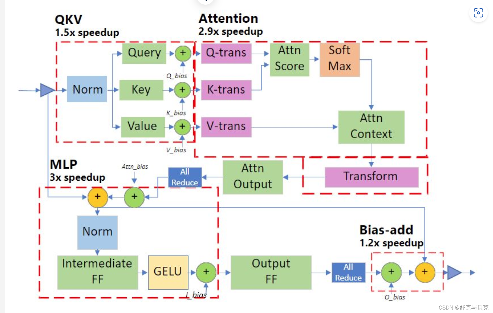

**二 混合精度**
----------

### **混合精度**

混合精度训练是指在训练过程中同时使用 FP16（半精度浮点数）和 FP32（单精度浮点数）两种精度的技术。使用 FP16 可以大大减少内存占用，从而可以训练更大规模的模型。

但是，由于 FP16 的精度较低，训练过程中可能会出现梯度消失和模型不稳定的问题。

因此，需要使用一些技术来解决这些问题，例如动态精度缩放（Dynamic Loss Scaling）和混合精度优化器（Mixed Precision Optimizer）等。

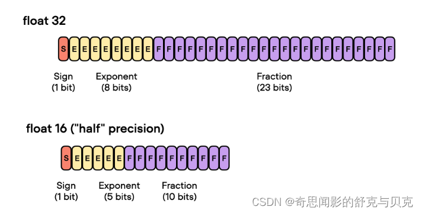

deepspeed 提供了混合精度训练的支持，可以通过在配置文件中设置 "fp16.enabled": true 来启用混合精度训练。在训练过程中，deepspeed 会自动将一部分操作转换为 FP16 格式，并根据需要动态调整精度缩放因子，从而保证训练的稳定性和精度。

在使用混合精度训练时，需要注意一些问题，例如梯度裁剪（Gradient Clipping）和学习率调整（Learning Rate Schedule）等。梯度裁剪可以防止梯度爆炸，学习率调整可以帮助模型更好地收敛。因此，在设置混合精度训练时，需要根据具体情况进行选择和配置。

*   存储一份 fp32 的 parameter，momentum 和 variance（统称 model states）
*   在 forward 开始之前，额外开辟一块存储空间，将 fp32 parameter 减半到 fp16 parameter。
*   正常做 forward 和 backward，在此之间产生的 activation 和 gradients，都用 fp16 进行存储。
*   用 fp16 gradients 去更新 fp32 下的 model states。
*   当模型收敛后，fp32 的 parameter 就是最终的参数输出。

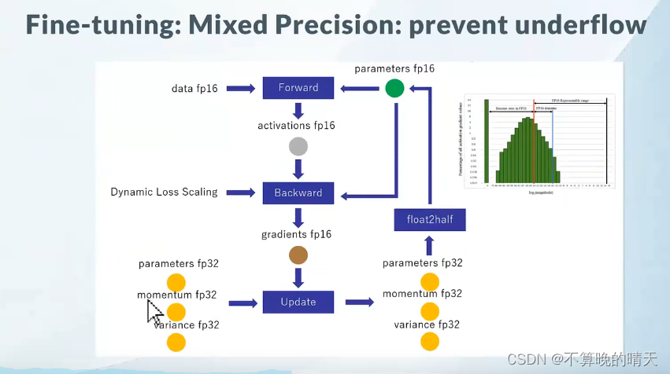

**BF16**

BF16 和 FP16 都是混合精度训练中使用的浮点数表示格式。


BF16 是一种 Brain Floating Point 格式，由英特尔提出，可以提供更好的数值稳定性和更高的精度，但需要更多的存储空间。在混合精度训练中，BF16 可以作为一种精度更高的替代品，用于一些关键的计算操作，例如梯度累加和权重更新等。使用 BF16 可以提高模型的训练速度和精度，并减少内存占用。

在 DeepSpeed 中，可以通过在配置文件中设置 "bf16.enabled": true 来启用 BF16 混合精度训练。这将会将一部分操作转换为 BF16 格式，并根据需要动态调整精度缩放因子，从而提高模型的训练速度和精度，并减少内存占用。

**NVIDIA Tesla V100 不支持 BF16**

### **显存占用分析**

混合精度训练，字如其名，同时存在 fp16 和 fp32 两种格式的数值，其中模型参数、模型梯度都是 fp16，此外还有 fp32 的模型参数，如果优化器是 Adam，则还有 fp32 的 momentum 和 variance。

总的来说，模型训练时显存主要分为两部分。

存储主要分为两大块：Model States 和 Residual States  
**Model States** 指和模型本身息息相关的，必须存储的内容，具体包括：

*   **optimizer states**：Adam 优化算法中的 momentum 和 variance
*   **gradients**：模型梯度
*   **parameters**：模型参数 W

**Residual States** 指并非模型必须的，但在训练过程中会额外产生的内容，具体包括：

*   **activation**：激活值。在流水线并行中我们曾详细介绍过。在 backward 过程中使用链式法则计算梯度时会用到。有了它算梯度会更快，但它不是必须存储的，因为可以通过重新做 Forward 来算它。
*   **temporary buffers:** 临时存储。例如把梯度发送到某块 GPU 上做加总聚合时产生的存储。
*   **unusable fragment memory**：碎片化的存储空间。虽然总存储空间是够的，但是如果取不到连续的存储空间，相关的请求也会被 fail 掉。对这类空间浪费可以通过内存整理来解决。

      模型在训练过程中需要储存自身的参数和梯度（注意这里还不是 Adam 最后算出来的参数更新量，只是根据 loss 反向传播得到的原始梯度），这便需要 2Ψ+2Ψ 的内存，同时混合精度 fp32 训练时，Adam 需要一份 fp32 大小的模型拷贝，momentum 和 variance 去储存模型的优化器状态，这需要 4Ψ+4Ψ+4Ψ ，最终我们需要 16Ψ𝐵 的内存用于训练，即对于一个 GPT-2 模型，我们训练时需要 24GB 的内存，对比一张 V100 的显存为 32GB

       一个 1.5𝐵 参数的 GPT-2 模型，我们用 Ψ 代表这个参数量的数量，不难看出，一个 GPT-2 模型的训练就能吃光 V100 的显存了，对于 175B 的 GPT-3 的训练，哪怕是目前的 H100（显存 188GB）也无法单卡装载。因此对于这类大模型只能通过张量并行等方式训练，比如后面会介绍的 Megatron 和 DeepSpeed。

因为采用了 Adam 优化，所以才会出现 momentum 和 variance，当然也可以选择别的优化办法

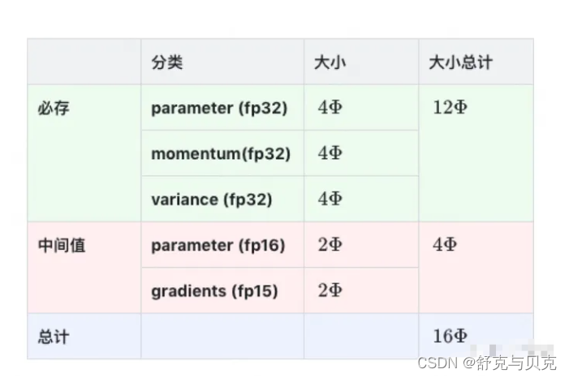

另外，**这里暂不将 activation 纳入统计范围**，原因是：

*   activation 不仅与模型参数相关，还与 batch size 相关
*   activation 的存储不是必须的。存储 activation 只是为了在用链式法则做 backward 的过程中，计算梯度更快一些。但你永远可以通过只保留最初的输入 X，重新做 forward 来得到每一层的 activation（虽然实际中并不会这么极端）。
*   因为 activation 的这种灵活性，纳入它后不方便衡量系统性能随模型增大的真实变动情况。

**ZeRO-DP 主要是优化第一部分的显存占用，所以这里主要介绍第一部分的显存。**

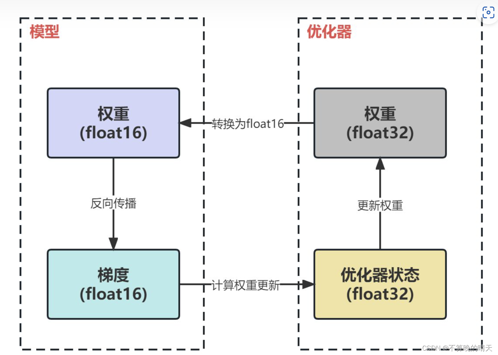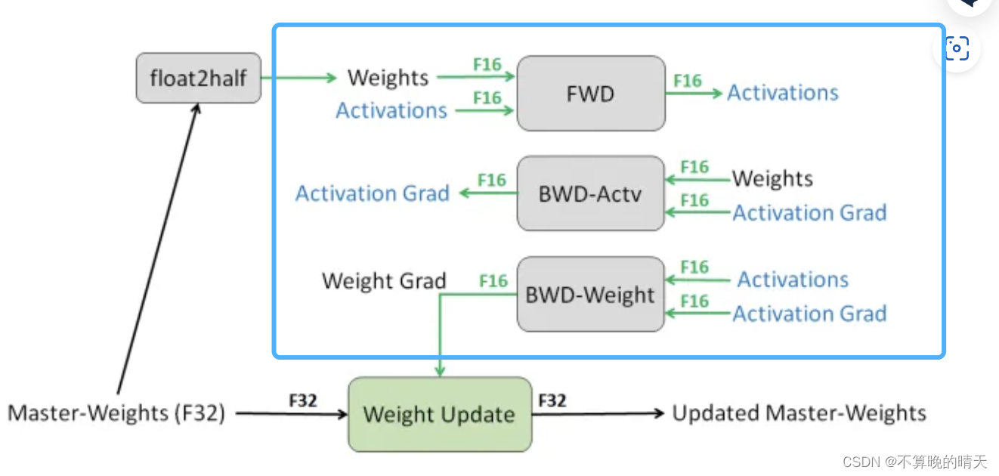

1.   将权重转换为 FP16：在这一步中，神经网络的权重（或参数）最初是 FP32 格式，被转换为低精度的 FP16 格式。这减少了内存的占用，并允许更快的计算，因为 FP16 操作需要更少的内存，并且可以被硬件更快地处理。计算梯度：神经网络的前向和后向通道是使用较低精度的 FP16 权重进行的。这一步计算损失函数相对于网络权重的梯度（部分导数），在优化过程中用于更新权重。

2.   将梯度转换为 FP32：在 FP16 中计算梯度后，它们被转换回高精度的 FP32 格式。这种转换对于保持数值稳定性和避免使用低精度算术时可能出现的梯度消失或爆炸等问题至关重要。乘以学习率和更新权重：现在是 FP32 格式，梯度被乘以学习率（一个标量值，决定了优化过程中的步长）。乘积被用来更新原始 FP32 神经网络权重。学习率有助于控制优化过程的收敛性，对于实现良好的性能至关重要。

3.   **模型状态**（model states）：假设模型的参数量是 Ψ ，使用 Adam 为优化器进行混合精度训练。

a. 由于模型的参数和梯度使用 float16，所以显存消耗分别为 2Ψ 和 2Ψ 。

b. Adam 会维护一个 float32 的模型备份副本，消耗 4Ψ 显存。Adam 优化器本身会为模型的每个参数维护两个 float32 的辅助变量（fp32 的 momentum 和 fp32 的 variance），所以显存消耗占用为 4Ψ+4Ψ 。

总的来说，模型会消耗 2Ψ+2Ψ=4Ψ ，Adam 优化器这消耗 4Ψ+4Ψ+4Ψ=12Ψ 。最终的总消耗为 4Ψ+12Ψ=16Ψ 。

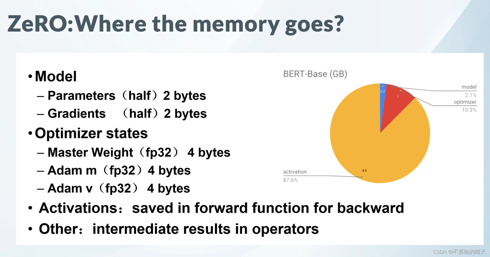

**这里为了方便讨论，将优化器显存占用表示为** KΨ **(不同的优化器不同)，则混合精度训练的显存占用为** 4Ψ+KΨ **。**

来看一个例子，GPT-2 含有 1.5B 个参数，如果用 fp16 格式，只需要 1.5G*2Byte=3GB 显存

但是模型状态实际上需要耗费 1.5*16=24GB, 相比之下，激活值可以用 [activation checkpointing](https://link.zhihu.com/?target=https%3A//arxiv.org/pdf/1604.06174.pdf "activation checkpointing") 来大大减少，所以模型状态就成了头号显存杀手，它也是 ZeRO 的重点优化对象。而其中 Adam 状态又是第一个要被优化的。

比如说有一个模型参数量是 1M，在一般的深度学习框架中 (比如说 PyTorch)，一般是 32 位存储。32 位存储的意思就是 1 个参数用 32 个 bit 来存储。那么这个拥有 1M 参数量的模型所需要的存储空间的大小即为：1M * 32 bit = 32Mb = 4MB。因为 1 Byte = 8 bit。现在的 quantization 技术就是减少参数量所占的位数：比如我用 16 位存储，那么：所需要的存储空间的大小即为：1M * 16 bit = 16Mb = 2MB。

### 不同精度对内存的占用

*   fp32 精度，一个参数需要 32 bits, 4 bytes
*   fp16 精度，一个参数需要 16 bits, 2 bytes
*   int8 精度，一个参数需要 8 bits, 1 byte
*   混合精度（fp16/32）训练，模型参数和激活值是以 fp16 的格式进行保存，前向和反向传播中也使用 fp16 的权重和激活值进行计算。然而为了在反向传播结束时有效地计算和参数更新，保证梯度更新的正确（混合精度训练 fp16 会有一个大的累积舍入误差，例如大的浮点数 + 小的浮点数，会体现不出来），通常会同时拷贝一份 fp32 的参数权重和优化器状态 (包括动量估计 + 梯度方差)。

即混合精度使用 Adam 优化算法，需要保存以下状态信息：

Fp16 的参数、梯度（2 +2 内存消耗）

Fp32 的参数、动量、方差（4 +4 +4 内存消耗）

_**模型训练过程中，大部分的内存开销用于 model states(模型参数、优化器的状态、梯度）。剩下的内存开销则来自于 residual states（激活值、临时区缓存和内存碎片）。**_

**以 LLaMA 7B 模型为例:**

1. 模型参数 P 所需的内存是 (参数量 * 每个参数的内存)：

混合精度（fp16/32）训练: 存储 fp16 精度 + fp32 精度 = 14GB +28GB = 42GB

2. 梯度 G 所需的内存（计算方式同模型参数一样，参数量 * 每个参数的内存）：

混合精度（fp16/32）训练: 只存储 fp16 精度 = 14GB

3. 以 Adam 为例，它需要存储两部分的**优化器状态**：time averaged momentum(动量估计) 和 variance of the gradients(梯度方差)。

混合精度（fp16/32）训练: 存储 fp32 精度 = 56 G

model states 所需的内存，混合精度（fp16/32）训练: **42+14+56 = 112GB**

#### **Model States**

#### Residual States

除了模型状态之外的显存占用，包括激活值（activation）、各种临时缓冲区（buffer）以及无法使用的显存碎片（fragmentation）。

显然，激活在训练中也会消耗大量的显存。

尽管激活的显存占用已经显著减少，但是对于更大的模型来说，激活所占用的显存也会非常大。例如，对于 100B 参数量的 GPT 模型且 batch size 为 32，即使用来 activation checkpointing，显存占用也需要 60GB。

Activation checkpointing：前向计算时，只保留部分算子的激活值。 反向更新时，需要其他算子的激活值时，再重新对其进行前向计算，得到其激活值。分为两种方式：

*   full checkpoint: 对所有算子都进行 Activation checkpointing，等于走了两遍完整的前向计算，虽然将内存消耗减小到平方根的量级，即从 60GB->8GB； 但是会带来 36% 的重新计算开销。
*   Selective checkpointing: 只对那些计算时间小，占显存多的 op（如 attention 部分的 op）进行 Activation checkpointing。重新计算开销从 36% -> 4%

**临时缓存区 (Temporary buffers)**。对于大模型，用于存储中间结果的临时 buffer 也会消耗大量显存。例如在 all-reduce 时，需要一个平坦的 buffer 来融合所有的梯度，从而改善吞吐量。例如，跨设备的 all-reduce 操作会随着消息的增大而增加。虽然，梯度本文是 fp16 的张量，但是有些操作中可能需要融合的 buffer 为 fp32。当模型尺寸很大时，临时的 buffer 也不小。例如，对于 1.5B 参数的模型，一个 fp32 的 buffer 需要 6GB 的显存。

**显存碎片**。即使在有足够显存的情况下，也可能会导致 Out of Memory，这是由于显存碎片导致的。在进程发出显存请求时，如果没有连续的显存来满足请求，即使总的显存仍然足够，该请求也会失败。当训练非常大的模型时，可以观察到明显的显存碎片。极端情况下，可能会导致 30% 的显存碎片。

#### DeepSpeed 不同 ZeRO 策略训练 LLama-7B 参数模型

使用 DeepSpeed ZeRO 策略训练 LLama-7B 参数模型，8 卡机器，混合精度训练，显存占用情况如下：

计算每张卡的总显存占用情况：

**模型参数：**模型参数存储占用约 14GB（FP16）(每卡显存 = 14GB/8=1.75GB    zero3)

**梯度：** 梯度存储占用约 14GB（FP16).  (每卡显存 = 14GB/8=1.75GB    zero2,  zero3)

**优化器状态： 每卡优化器状态占用 10.5GB。**[优化器状态总共占用 84GB（7GB * 12），在 8 张卡上进行分片，每张卡分担的优化器状态显存为：每卡优化器状态显存 = 84GB/8=10.5GB, 每卡优化器状态显存​=10.5G （zero-1, zero-2, zero3）

**激活显存：** 

**激活值显存占用计算步骤**

1.  **模型架构**：

    *   假设 LLaMA 7B 模型具有 32 层，每层有 4096 个隐藏单元。
2.  **batch size 和序列长度**：

    *   假设 batch size 为 1，序列长度为 1024。
3.  **激活值大小**：

    *   激活值的大小取决于 batch size、序列长度和隐藏层维度。

计算激活值显存占用如下：

**单层激活值计算**

*   每层激活值占用的显存大小为：`batch size * 序列长度 * 隐藏层维度`

**全模型激活值计算**

*   总激活值显存占用为：`模型层数 * 单层激活值大小`

假设使用 FP16（每个值 2 字节），具体计算如下：

1.  **单层激活值大小**：

    *   激活值大小 = 1`（batch size） * 1024（序列长度） * 4096（隐藏层维度）* 2字节`
    *   单层激活值大小 = 1 `* 1024 * 4096 * 2 =` 8,388,608 字节 `≈ 8MB`
2.  **全模型激活值大小**：

    *   总激活值大小 = `32（层数） * 8MB（单层激活值大小）= 256M`

在上述假设条件下，使用 DeepSpeed ZeRO-1 策略训练 LLaMA 7B 模型，混合精度训练时，激活值的显存占用大约为 256**M**。这个计算是基于 32 层，每层 4096 个隐藏单元，batch size 为 1，序列长度为 1024 的假设条件下进行的。实际显存占用会因具体的模型架构和训练配置而有所不同。

**总显存占用：**

*   每张卡大约需要： `模型参数 + 梯度 + 分片优化器状态 + 激活显存`。

**zero1:**

*   估算：`14GB（模型参数FP16） + 14GB（梯度FP16） + 10.5GB（分片优化器状态） + 0.25 GB（激活显存）`。
*   每卡总显存占用约 `14GB + 14GB + 10.5GB + 0.25 GB = 38.75G`

**zero2:**

*   估算：`14GB（模型参数FP16） + 1.75GB（梯度FP16) + 10.5GB（分片优化器状态） + 0.25 GB（激活显存）`。
*   每卡总显存占用约 `14GB + 1.75GB + 10.5GB + 0.25 GB = 26.5G`

**zero3:**

*   估算：1.75`GB（模型参数FP16） + 1.75GB（梯度FP16） + 10.5GB（分片优化器状态） + 0.25 GB（激活显存）`。
*   每卡总显存占用约 1.75`GB + 1.75GB + 10.5GB + 0.25 GB = 14.25G`

**三 ZeRO-DP 三个级别**
------------------

### ZeRo-Dp 基本思路

知道了什么东西会占存储，以及它们占了多大的存储之后，我们就可以来谈如何优化存储了。  
注意到，在整个训练中，有很多 states 并不会每时每刻都用到，举例来说；

*   Adam 优化下的 optimizer states 只在最终做 update 时才用到
*   数据并行中，gradients 只在最后做 AllReduce 和 updates 时才用到
*   参数 W 只在做 forward 和 backward 的那一刻才用到

所以，ZeRO 想了一个简单粗暴的办法：**如果数据算完即废，等需要的时候，我再想办法从个什么地方拿回来，那不就省了一笔存储空间吗？**  
沿着这个思路，我们逐一来看 ZeRO 是如何递进做存储优化的。

ZeRO-DP(Zero Redundancy Optimizer-Data Parallelism) 是来自于论文《ZeRO: Memory Optimizations Toward Training Trillion Parameter Models》中的一种显存优化方法 ZeRO 的核心部分。通过该方法可以大幅度的优化显存占用，**从而在有限的资源下训练更大的模型**。

微软开发 ZeRO 是为了克服数据并行性和模型并行性的限制，同时实现两者的优点。

**ZeRO 通过在数据并行进程中划分模型状态（参数，梯度和优化器状态），而不是复制它们，从而消除了数据并行进程中的内存冗余。它在训练期间使用动态通信计划，以在分布式设备之间共享必要的状态，以保持计算粒度和数据并行性的通信量。**

ZeRO 驱动的数据并行性，它允许每个设备的内存使用量随数据并行性的程度线性扩展，并产生与数据并行性相似的通信量。 ZeRO 支持的数据并行性可以适合任意大小的模型，只要聚合的设备内存足够大以共享模型状态即可。

ZeRO（Zero Redundancy Optimizer）是一种用于大规模训练优化的技术，主要是用来减少内存占用。

在大规模训练中，内存占用可以分为 Model States 和 Activation 两部分，而 **ZeRO 主要是为了解决 Model States 的内存占用问题。**

ZeRO 将模型参数分成了三个部分：Optimizer States、Gradient 和 Model Parameter。

*   Optimizer States 是 Optimizer 在进行梯度更新时所需要用到的数据，例如 SGD 中的 Momentum。
*   Gradient 是在反向传播后所产生的梯度信息，其决定了参数的更新方向。
*   Model Parameter 则是模型参数，也就是我们在整个过程中通过数据 “学习” 的信息。

ZeRO-Offload 和 ZeRO-Stage3 是 DeepSpeed 中的不同的 Zero-Redundancy Optimization 技术，用于加速分布式训练，主要区别在资源占用和通信开销方面。

*   ZeRO-Stage3 将模型参数分片到不同的 GPU 上，通过交换节点间通信来降低显存占用，但需要进行额外的通信操作，因此可能会导致训练速度的下降。
*   ZeRO-Offload 将模型参数分布在 CPU 和 GPU 上，通过 CPU 去计算一部分梯度，从而减少显存占用，但也会带来一定的计算开销。

DeepSpeed 的 ZeRO config 文件就可以分为如下几类：

ZeRO-0：禁用所有类型的分片，仅使用 DeepSpeed 作为 DDP (Distributed Data Parallel)

*   ZeRO-1 `Stage 1`: 分割 Optimizer states。优化器参数被划分到多个 memory 上，每个 momoey 上的进程只负责更新它自己那部分参数。减少了 4 倍的内存，通信容量与数据并行性相同
*   ZeRO-2 `Stage 2`: 分割 Optimizer States 与 Gradients。每个 memory，只保留它分配到的 optimizer state 所对应的梯度。这很合理，因为梯度和 Optimizer 是紧密联系在一起的。只知道梯度，不知道 Optimizer state，是没有办法优化模型参数的。
*   ZeRO-3 `Stage 3`: 分割 Optimizer States、Gradients 与 Parameters，或者说，不同的 layer. ZeRO-3 会在 forward 和 backward 的时候，自动将模型参数分配到多个 memory。

ZeRO-Infinity 是 ZeRO-3 的拓展。允许通过使用 NVMe 固态硬盘扩展 GPU 和 CPU 内存来训练大型模型。ZeRO-Infinity 需要启用 ZeRO-3。

在 deepspeed 中通过 zero_optimization.stage=0/1/2/3 设置，

卸载通过 zero_optimization.offload_optimizer.device 设置

针对模型状态的存储优化（去除冗余），ZeRO 使用的方法是分片（partition），即每张卡只存 1/N 的模型状态量，这样系统内只维护一份模型状态。

这里 os 指的是 optimizer


看上去比较高大上，可能让你很难专心去理解，但实际上，这个概念非常简单。这只是通常的 DDP，只是没有每个 GPU 都复制完整的模型参数、梯度和优化器状态，​​而是每个 GPU 只存储其中的一部分。在随后的运行过程中，当需要给定层的完整层参数时，所有 GPU 同步以相互提供它们缺失的部分 —— 仅此而已。

第二列给出了一个示例： K=12,Ψ=7.5B,N=64 可以看到显存优化相当明显。

在标准的数据并行中，每个显卡 (rank) 都会保存独立的**权重、梯度和优化器状态**，如上图中的 baseline 所示。那么每个显卡是否有必要存储全部的这些信息呢？**ZeRO-DP 的答案是不需要**。ZeRO-DP 能够对模型状态 (权重、梯度和优化器状态) 进行划分(不像标准 DP 那样进行复制)，然后通过动态通信调度来最小化通信开销。ZeRO-DP 能够在保持整体通信开销接近标准 DP 的同时，线性地降低模型的**单显卡**显存占用。

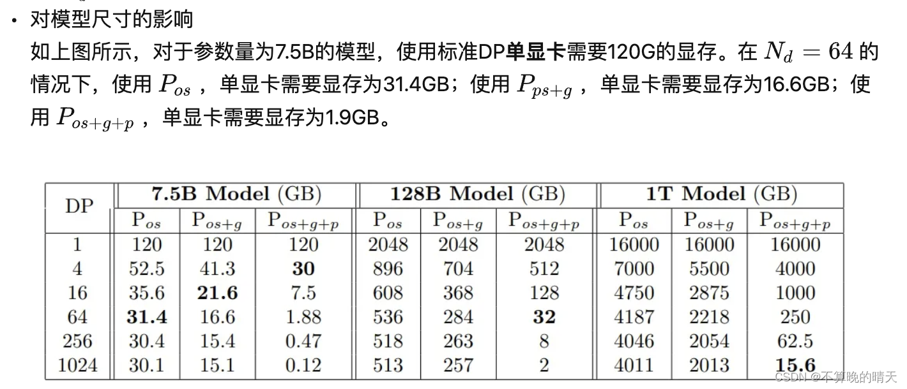


ZeRO-DP 简单来说就是想办法在数据并行的管线上把模型的参数分配到不同的显卡上，而不用所有显卡都装载所有参数

该论文把训练期间的内存消耗归结为三类：

*   OS：优化器状态（如 Adam 的 momentum 和 variance）
*   G：梯度
*   P：模型参数

混合精度下的 Adam 三种消耗占比大约为 12Ψ ， 2Ψ 和 2Ψ 。同样的，ZeRO-DP 根据显存优化粒度也分为 𝑃𝑜𝑠 ， 𝑃𝑔 ， 𝑃𝑝 三种, 三个阶段对应优化器状态划分、梯度划分和模型参数划分，并且三个阶段可以叠加使用 (上图展示了三个阶段的叠加)。

_关于三个阶段是否会增加通信量，会在后面分析，目前先接受这三个阶段并不会显著增加通信开销。_

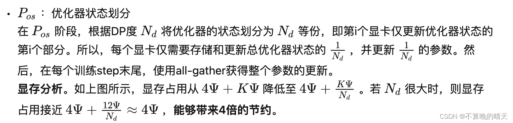

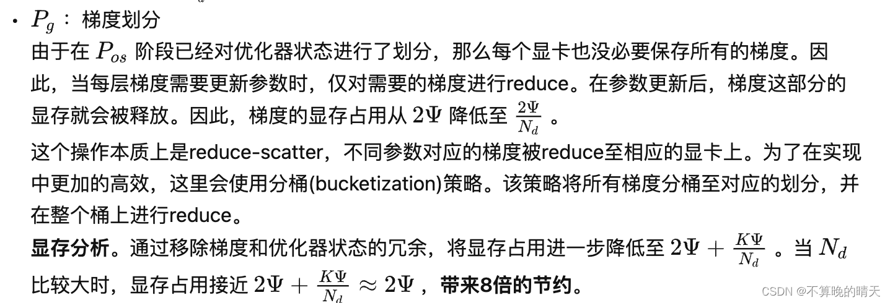

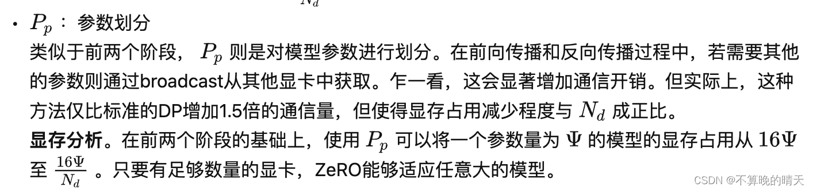

### **ZeRO-1** **优化状态分割**

首先，从 optimizer state 开始优化。将 optimizer state 分成若干份，每块 GPU 上各自维护一份。这样就减少了相当一部分的显存开销。如下图：

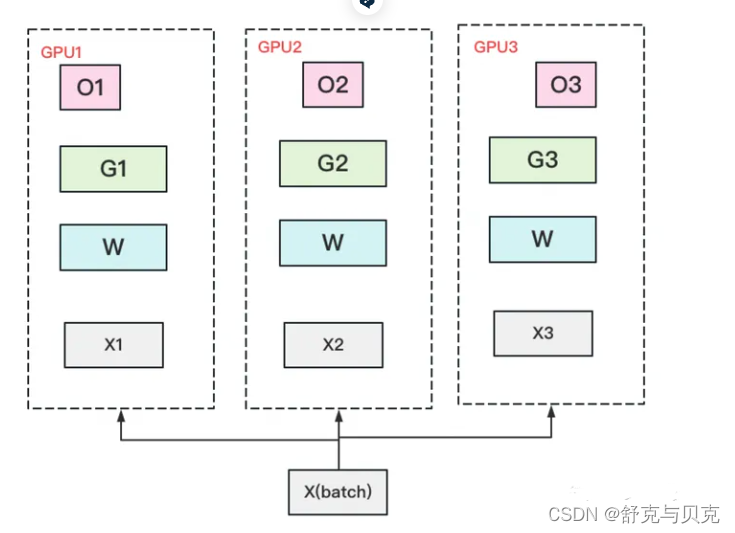

复习一下，此时 W=fp16，G=fp16，O=fp32。此时，整体数据并行的流程如下：

（1）每块 GPU 上存一份完整的参数 W。将一个 batch 的数据分成 3 份，每块 GPU 各吃一份，做完一轮 foward 和 backward 后，各得一份梯度。

（2）对梯度做一次 **AllReduce**，**得到完整的梯度 G**，产生单卡通讯量 2Φ 。**为了表达简明，这里通讯量我们就不再换算成 byte 了**，而直接根据参数量来计算。  
（3）得到完整梯度 G，就可以对 W 做更新。我们知道 W 的更新由 Optimizer states 和梯度共同决定。**由于每块 GPU 上只保管部分 optimizer states，因此只能将相应的 W（蓝色部分）进行更新**。

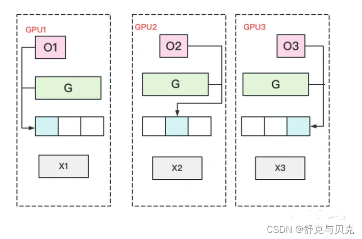

（4）此时，每块 GPU 上都有部分 W 没有完成更新（图中白色部分）。所以我们需要对 W 做一次 **All-Gather**，从别的 GPU 上把更新好的部分 W 取回来。产生单卡通讯量 Φ .

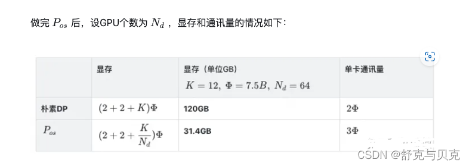

假设各变量大小如表格第二列所示，那么 Pos 在增加 1.5 倍单卡通讯开销的基础上，将单卡存储降低了 4 倍。看起来是个还不错的 trade-off，那么还能做得更好吗?

实操中是 2Φ ，按论文概念定义是 3Φ 。

在实操中，我们可以只对梯度做一次 scatter-reduce，并用各自维护的 optimizer 去更新对应的 W，然后再对 W 做 all-gather 使得每块卡上都有更新后的完整 W，这样通讯量就是 2Φ 。

那么 3Φ 是怎么来的呢？因为论文定义 stage1 只有 optimizer 是切开的，意味着 G 和 W 都是完整的。所以对 G 做 all-reduce（虽然拿回完整的 G 并没有意义），对 W 做 all-gather，这样通讯量就是 3Φ 。

本文写作时，最终选择按照论文对相关概念的定义，选择了 3Φ ，但是实操来看是完全可以用 2Φ 实现的。有朋友提到 deepspeed 的某次代码更新是将 stage1 的通讯量从 3Φ 降至 2Φ ，可能也是基于此做了改进。

### **ZeRO-2** 优化状态与梯度分割

现在，更近一步，我们把梯度也拆开，每个 GPU 各自维护一块梯度。

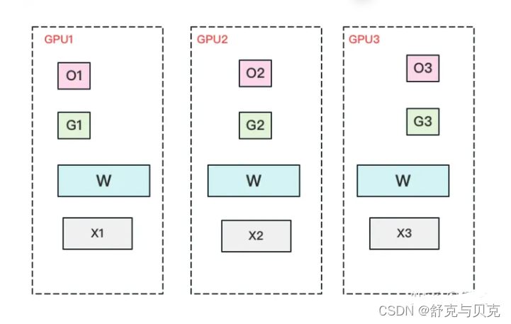

此时，数据并行的整体流程如下：  
（1）每块 GPU 上存一份完整的参数 W。将一个 batch 的数据分成 3 份，每块 GPU 各吃一份，做完一轮 foward 和 backward 后，**算得一份完整的梯度（下图中绿色 + 白色）**。  
（2）对梯度做一次 **Reduce-Scatter**，保证每个 GPU 上所维持的那块梯度是聚合梯度。例如对 GPU1，它负责维护 G1，因此其他的 GPU 只需要把 G1 对应位置的梯度发给 GPU1 做加总就可。汇总完毕后，白色块对 GPU 无用，可以从显存中移除。单卡通讯量 Φ 。（1）和（2）见下图：

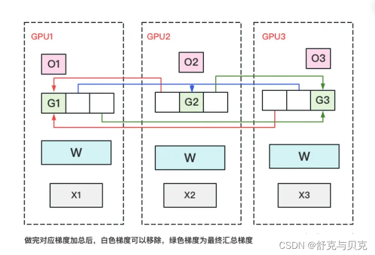

（3）每块 GPU 用自己对应的 O 和 G 去更新相应的 W。更新完毕后，**每块 GPU 维持了一块更新完毕的 W**。同理，对 W 做一次 **All-Gather**，将别的 GPU 算好的 W 同步到自己这来。单卡通讯量 Φ **。**

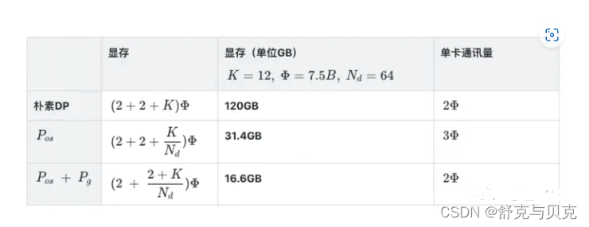

和朴素 DP 相比，**存储降了 8 倍，单卡通讯量持平**，好像更牛了呢！那么，还可以优化吗？

### **ZeRO-3 优化状态、梯度与参数分割**

看到这里，也许你有点感觉了，**ZeRO 的思想就是：万物皆可切，万物皆可抛**。所以现在，我们把参数也切开。每块 GPU 置维持对应的 optimizer states，gradients 和 parameters（即 W）。

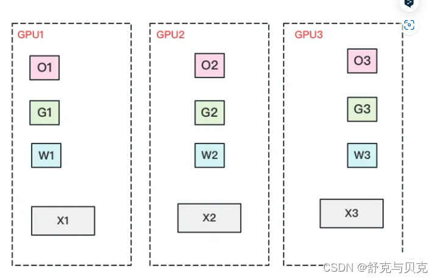

数据并行的流程如下：  
（1）每块 GPU 上只保存部分参数 W。将一个 batch 的数据分成 3 份，每块 GPU 各吃一份。  
（2）做 forward 时，对 W 做一次 **All-Gather**，取回分布在别的 GPU 上的 W，得到一份完整的 W，单卡通讯量 Φ **。forward 做完，立刻把不是自己维护的 W 抛弃。**  
（3）做 backward 时，对 W 做一次 **All-Gather**，取回完整的 W，单卡通讯量 Φ **。backward 做完，立刻把不是自己维护的 W 抛弃。**  
（4）做完 backward，算得一份完整的梯度 G，对 G 做一次 **Reduce-Scatter**，从别的 GPU 上聚合自己维护的那部分梯度，单卡通讯量 Φ **。聚合操作结束后，立刻把不是自己维护的 G 抛弃**。  
（5）用自己维护的 O 和 G，更新 W。由于只维护部分 W，因此无需再对 W 做任何 AllReduce 操作。

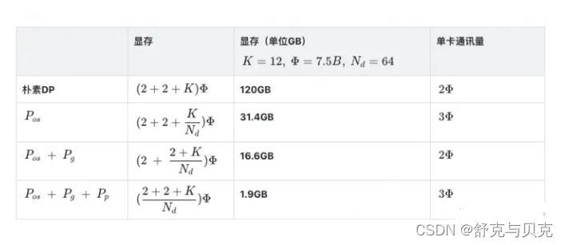

到这一步，**我们用 1.5 倍的通讯开销，换回近 120 倍的显存**。只要梯度计算和异步更新做的好，通讯时间大部分可以被计算时间隐藏，因此这样的额外通讯开销，也是划算的。

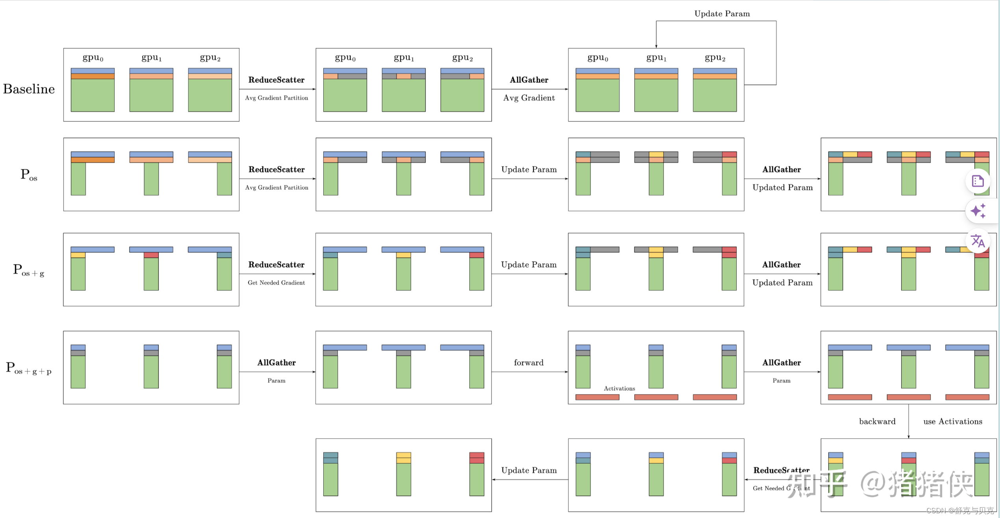

**在 DeepSpeed 中，一般使用 ZeRO-1 就足够了。**

### **ZeRO-DP 通信量**

ZeRO 通过去除显存的冗余来提升模型尺寸，那么该方法是否是通过通信量换取的显存效率。换句话说，ZeRO-DP 相较于标准 DP 来说，通信量增大了吗？

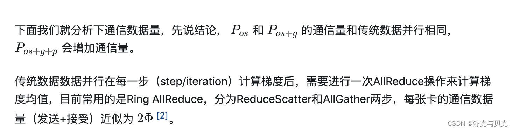

答案分为两部分：

**(1) ZeRO-DP 在使用** Pos **和** Pg **的情况下，能够带来 8 倍的显存降低且不增加额外的通信量**

**(2) 当同时使用** Pos **、** Pg **和** Pp **时，通信量增加 1.5 倍，同时降低倍的显存。**

在分析之前，我们先回顾下常用的集合通信（collective communication）函数 [Collective Operations](https://link.zhihu.com/?target=https%3A//docs.nvidia.com/deeplearning/nccl/user-guide/docs/usage/collectives.html "Collective Operations")。

#### **a. 标准数据并行的通信量**

在标准的数据并行训练中，在反向传播结束后，跨显卡的梯度会被平均。这个平均的过程使用 all-reduce。对于大尺寸的模型，all-reduce 通信是整个通信带宽的上界，因此分析主要集中在 all-reduce 上。

传统数据数据并行在每一步（step/iteration）计算梯度后，需要进行一次 AllReduce 操作来计算梯度均值，目前常用的是 Ring AllReduce，分为 ReduceScatter 和 AllGather 两步，每张卡的通信数据量（发送 + 接受）。总的来说，单个显卡在 reduce-scatter 或者 all-gather 的过程中，都会有 Ψ 的通信量。那么，整个 all-reduce 的单显卡通信量为 2Ψ 。

参考：[[深度学习]Ring All-reduce 的数学性质 - CSDN 博客](https://zengwenqi.blog.csdn.net/article/details/130501965 "[深度学习]Ring All-reduce的数学性质-CSDN博客")

#### **b. Zero-DP 的通信量**

Pos **的通信量**

在单独使用 Pos 的情况下，单个显卡会保存完整的模型参数和梯度。随后使用 reduce-scatter 将梯度 reduce 至不同的显卡上 (**此时不同显卡仅拥有完整平均梯度的一部分**)，该步骤的通信量是 Ψ 。各个显卡使用部分梯度更新对应的优化器状态，然后再更新对应的参数 (**此时每个显卡上的模型都更新了一部分参数**)。最后，使用 all-gather 将分布在各个显卡上的更新后参数分发自所有显卡上 (**此时所有显卡上都有了完整的更新后参数**)，该步骤的通信量是 Ψ 。总的来说，各个显卡仅需要持有部分优化器状态即可，且总的通信量仍然是 2Ψ 

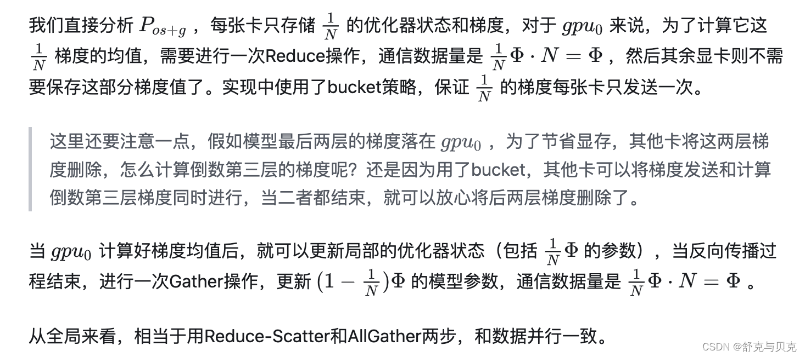

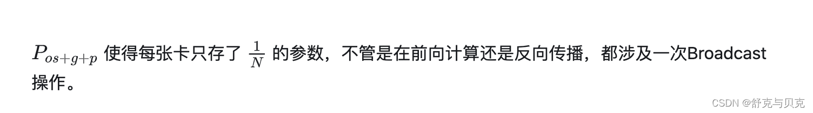

###  **ZeRO VS 模型并行**


知道模型并行的朋友，可能会想，既然 ZeRO 都把参数 W 给切了，那它应该是个模型并行呀？为什么要归到数据并行里呢？  
其实 **ZeRO 是模型并行的形式，数据并行的实质**。  
模型并行，是指在 forward 和 backward 的过程中，我只需要用自己维护的那块 W 来计算就行。即**同样的输入 X，每块 GPU 上各算模型的一部分，最后通过某些方式聚合结果**。  
但对 ZeRO 来说，它做 forward 和 backward 的时候，是需要把各 GPU 上维护的 W 聚合起来的，即本质上还是用完整的 W 进行计算。**它是不同的输入 X，完整的参数 W，最终再做聚合**。

四、ZeRO-Offload 与 ZeRO-Infinity
------------------------------

简单介绍一下 ZeRO-Offload。它的核心思想是：**显存不够，内存来凑**。如果我把要存储的大头卸载 (offload) 到 CPU 上，而把计算部分放到 GPU 上，**这样比起跨机，是不是能既降显存，也能减少一些通讯压力呢**？

ZeRO-Offload 并不希望为了最小化显存占用而让系统的计算效率下降，否则的话，我们只用 CPU 和内存不就得了。但是将部分 GPU 的计算和存储下放到 CPU 和内存，必然涉及 CPU 和 GPU 之间的通信增加，**不能让通信成为瓶颈**，此外 GPU 的计算效率相比于 CPU 也是数量级上的优势，也**不能让 CPU 参与过多计算**，避免成为系统瓶颈，只有前两条满足的前提下，再考虑**最小化显存的占用**。


ZeRO-Offload 的做法是：

*   **forward 和 backward 计算量高**，因此和它们相关的部分，例如 参数 W（fp16），activation，就全放入 GPU。
*   **update 的部分计算量低**，因此和它相关的部分，全部放入 CPU 中。例如 optimizer states（fp32）和 gradients(fp16) 等。

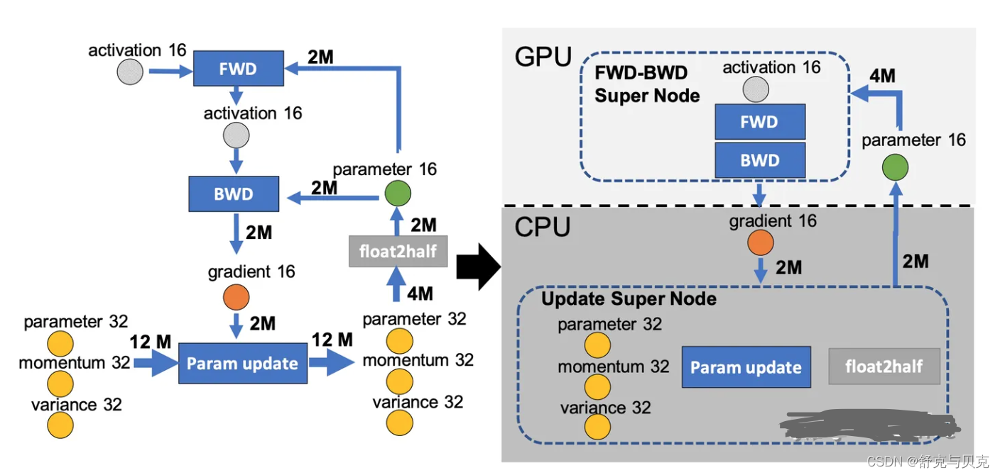

ZeRO-Offload 的核心思路就是让 CPU 和内存也参与到训练中去，回顾一下前文用到的训练流程的图，ZeRO-Offload 就是把这个流程用上图的方式把 fp32 参数的更新和 float2half 操作拆分到了 CPU 和内存上计算，而前向和后向传播依然由 GPU 负责.

ZeRO-infinity 也是同理，它们在解决的事情都是：找个除 GPU 之外的地方，存数据。

[DeepSpeed 之 ZeRO 系列：将显存优化进行到底 | Yet Another Blog (basicv8vc.github.io)](https://basicv8vc.github.io/posts/zero/ "DeepSpeed之ZeRO系列：将显存优化进行到底 | Yet Another Blog (basicv8vc.github.io)")

[DeepSpeed 之 ZeRO 系列：将显存优化进行到底 - 知乎 (zhihu.com)](https://zhuanlan.zhihu.com/p/513571706 "DeepSpeed之ZeRO系列：将显存优化进行到底 - 知乎 (zhihu.com)")

[图解大模型训练之：数据并行下篇 (DeepSpeed ZeRO，零冗余优化) - 知乎 (zhihu.com)](https://zhuanlan.zhihu.com/p/618865052 "图解大模型训练之：数据并行下篇( DeepSpeed ZeRO，零冗余优化) - 知乎 (zhihu.com)")

[【LLM】DeepSpeed 分布式训练框架_山顶夕景的博客 - CSDN 博客](https://blog.csdn.net/qq_35812205/article/details/131607096 "【LLM】DeepSpeed分布式训练框架_山顶夕景的博客-CSDN博客")

[从啥也不会到 DeepSpeed————一篇大模型分布式训练的学习过程总结 - 知乎 (zhihu.com)](https://zhuanlan.zhihu.com/p/688873027 "从啥也不会到DeepSpeed————一篇大模型分布式训练的学习过程总结 - 知乎 (zhihu.com)")


## 参考

[[LLM]大模型训练DeepSpeed(一)-原理介绍](https://blog.csdn.net/zwqjoy/article/details/130732601)