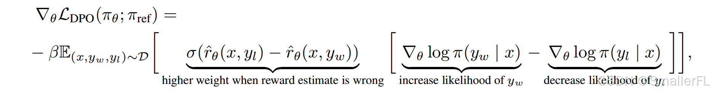

> 本文由 [简悦 SimpRead](http://ksria.com/simpread/) 转码， 原文地址 [blog.csdn.net](https://blog.csdn.net/qq_36803941/article/details/142251643)

#### 文章目录

*   [1. 概述](#1__4)
*   [2. 几个关键的预备知识](#2__13)
*   *   [2.1 Kullback-Leibler 散度（KL 散度）](#21_KullbackLeibler_KL__15)
    *   *   [2.1.1 KL 散度的定义](#211_KL__21)
        *   [2.1.2 KL 散度的性质](#212_KL__41)
        *   [2.1.3 KL 例子](#213_KL__47)
        *   [2.1.4 在 DPO 中的应用](#214_DPO_71)
    *   [2.2 Bradley-Terry 模型](#22_BradleyTerry__85)
    *   *   [2.2.1 BT 模型定义](#221_BT__89)
        *   [2.2.2 参数估计](#222__100)
        *   [2.2.3 BT 例子](#223_BT__110)
*   [3. DPO 的推导过程](#3_DPO__170)
*   *   [3.1 优化目标推导](#31__171)
    *   *   [3.1.1 奖励模型损失](#311__172)
        *   [3.1.2 优化目标](#312__203)
    *   [3.2 损失函数](#32__250)
    *   [3.3 DPO 梯度更新](#33_DPO__275)
    *   [3.4 DPO 主要流程](#34_DPO__295)
*   [4. DPO 数据集](#4_DPO__310)
*   [5. 总结](#5__351)

# 1.概述

-----

Direct Preference Optimization (DPO) 是一种专为大型语言模型（LLMs）设计的训练方法，旨在通过人类偏好数据来[优化模型](https://so.csdn.net/so/search?q=%E4%BC%98%E5%8C%96%E6%A8%A1%E5%9E%8B&spm=1001.2101.3001.7020)，而无需使用复杂的强化学习算法（如 Proximal Policy Optimization, PPO）。DPO 的核心思想是通过偏好数据直接调整模型参数，绕过显式奖励模型的拟合以及复杂的强化学习优化过程。这种简化的训练方法不仅提高了训练效率，还避免了传统 RLHF 方法中常见的不稳定性。

DPO 的亮点在于：  
（1）直接使用最大似然估计（Maximum Likelihood Estimation, MLE）来优化策略；  
（2）在无需显式拟合奖励模型的情况下，能够高效地学习出与人类偏好一致的最优策略；  
（3）相较于 RLHF，DPO 训练更加稳定和简化，并且具有与之相当的性能。

本文主要介绍 DPO 的原理，以及理论公式是如何推导的。

# 2.几个关键的预备知识

------------

DPO 涉及到 KL 散度、Bradley-Terry 模型等预备知识，预备知识是基础，对于后续公式推导的理解至关重要，下面会详细介绍。如果熟悉这部分知识可以跳过这部分。

### 2.1 Kullback-Leibler 散度（KL 散度）

**Kullback-Leibler 散度（KL 散度）**，又称为**相对熵**，是信息论中的一个重要概念。它用于衡量两个概率分布之间的差异，特别是衡量用一个分布 $Q$ 去近似另一个目标分布 $P$ 时的效率损失。

KL 散度可以理解为两种分布之间的 “信息差异”。具体而言，KL 散度衡量的是用分布 $ Q $ 来编码分布 $ P $ 所需要的额外信息量。假设分布 $ P(x) $是我们想要捕捉的真实分布，而我们用分布 $Q(x) $ 来表示它。如果 $Q(x)$ 偏离 $P(x)$，我们在编码时会付出信息损失。

KL 散度值越小，表示两个分布越接近。

#### 2.1.1 KL 散度的定义

KL 散度表示两个概率分布 $P(x)$ 和 $Q(x)$ 之间的 “距离” 或差异程度，定义公式为：

$$D_{\text{KL}}(P \| Q) = \sum_x P(x) \log \frac{P(x)}{Q(x)} $$

或者在连续情形下：

$D_{\text{KL}}(P \| Q) = \int P(x) \log \frac{P(x)}{Q(x)} dx$

其中：

*   $P(x)$：目标分布（真实分布），表示事件 $x$ 发生的概率。
*   $Q(x)$：近似分布（模型分布），表示用来近似 $P(x)$ 的概率。

KL 散度衡量的是，如果 $P(x)$ 是 “真实” 的概率分布，而我们使用 $Q(x)$ 来表示 $P(x)$，我们将损失多少信息。

#### 2.1.2 KL 散度的性质

KL 散度具有以下重要性质：  
（1）**非负性**： $D_{\text{KL}}(P \| Q) \geq 0 $，且当且仅当 $P(x) = Q(x)$ 时， $D_{\text{KL}}(P \| Q) = 0$。这意味着两个分布完全一致时，KL 散度为零。  
（2）**非对称性**： $D_{\text{KL}}(P \| Q) \neq D_{\text{KL}}(Q \| P)$。KL 散度并不是衡量两个分布对称差异的度量，所以 $D_{\text{KL}}(P \| Q)$ 和 $D_{\text{KL}}(Q \| P) $ 的值可能不同。

#### 2.1.3 KL 例子

**例子 1：硬币投掷**  
假设我们有两个硬币，硬币 A 和硬币 B，它们的投掷概率分别是：

*   硬币 A： $P(正面) = 0.8$， $P(反面) = 0.2$
*   硬币 B： $Q(正面) = 0.6$， $Q(反面) = 0.4$

现在，我们希望用硬币 B（分布 $Q$）来近似硬币 A（分布 $P$）。我们可以计算 KL 散度：

$D_{\text{KL}}(P \| Q) = P(正面) \log \frac{P(正面)}{Q(正面)} + P(反面) \log \frac{P(反面)}{Q(反面)}$

代入数值：  

$D_{\text{KL}}(P \| Q) = 0.8 \log \frac{0.8}{0.6} + 0.2 \log \frac{0.2}{0.4}$

$D_{\text{KL}}(P \| Q) \approx 0.8 \times 0.222 + 0.2 \times (-0.301) \approx 0.109$

这个值越小，表示两个分布越接近；而越大，则表示它们的差异越大。在这个例子中，KL 散度表示硬币 B 与硬币 A 之间的差异。

#### 2.1.4 在 DPO 中的应用

在 DPO 中，KL 散度是一个关键组成部分，用于限制模型的训练。DPO 的优化目标是最大化模型生成优选输出的概率，同时最小化模型与参考模型之间的 KL 散度。具体来说，DPO 的目标函数为（后面会详细介绍，这里暂时了解）：

$$
\max_{\pi_\theta} \mathbb{E}_{x \sim D, y \sim \pi_\theta(y | x)} [r_\varphi(x, y)] - \beta D_{\text{KL}}(\pi_\theta(y | x) \| \pi_{\text{ref}}(y | x))
$$
其中：

*   $D_{\text{KL}}$ 表示当前模型分布 $\pi_\theta$ 和参考模型 $\pi_{\text{ref}}$ 之间的差异。
*   $\beta$ 是控制 KL 散度影响的超参数。

通过最小化 KL 散度，DPO 确保了当前模型在优化过程中不会偏离参考策略太远，从而保持模型的稳定性。

### 2.2 Bradley-Terry 模型 (评估相对强度)

Bradley-Terry 模型主要用于评估不同项目之间的相对强度或偏好。这种模型在体育比赛预测、产品推荐系统、社会科学中的偏好排序等多种领域都有广泛应用。

#### 2.2.1 BT 模型定义

假设我们有一组对象 $O_1, O_2, \ldots, O_n$，并且对于任意两个对象 $O_i$i 和 $O_j$，我们知道 $O_i$ 对 $O_j$  获胜的概率。Bradley-Terry 模型的目标是通过一系列配对比较的结果来估计每个对象的相对强度。

Bradley-Terry 模型的核心假设是每个对象 $O_i $ 都有一个潜在的强度参数 $\lambda_i$，这个参数越大，该对象越强。对于任意两个对象 $O_i$ 和 $O_j$， $O_i$ 对 $O_j$ 获胜的概率 $P(i > j)$ 可以表示为：  
$$
P(i > j) = \frac{\lambda_i}{\lambda_i + \lambda_j}
$$


这意味着，对象 $O_i$ 对 $O_j$获胜的概率是 $O_i$ 的强度除以两个对象强度之和。

#### 2.2.2 参数估计

为了估计参数 $\lambda_i$，通常使用极大似然估计（Maximum Likelihood Estimation, MLE）方法。给定一组配对比较结果，目标是最优化似然函数：  
$$
L(\boldsymbol{\lambda}) = \prod_{(i,j) \in \text{pairs}} \left( \frac{\lambda_i}{\lambda_i + \lambda_j} \right)^{x_{ij}} \left( \frac{\lambda_j}{\lambda_i + \lambda_j} \right)^{1-x_{ij}}
$$
其中 $x_{ij}$ 是指示变量，如果 $O_i$ 对 $O_j$获胜，则 $x_{ij} = 1$，否则 $x_{ij} = 0$。

#### 2.2.3 BT 例子

假设我们有一个小型的体育联赛，其中有四支队伍：A、B、C 和 D。我们希望通过它们之间的一系列比赛结果来估计每支队伍的实力。

以下是几场比赛的结果：

*   A vs B: A 胜
*   A vs C: C 胜
*   A vs D: A 胜
*   B vs C: B 胜
*   B vs D: B 胜
*   C vs D: C 胜

**建立 Bradley-Terry 模型：**

我们需要估计每支队伍的强度参数 $\lambda_A, \lambda_B, \lambda_C, \lambda_D$。根据 Bradley-Terry 模型，任意两队 $i$ 和 $j$ 之间的胜率 $P(i > j)$ 可以表示为：  
$$
P(i > j) = \frac{\lambda_i}{\lambda_i + \lambda_j}
$$
为了简化问题，我们通常设定一个参考值，比如 $\lambda_A = 1$。这样我们可以将问题转化为估计其他三个参数 $\lambda_B, \lambda_C, \lambda_D $。

**极大似然估计：**

我们的目标是最优化似然函数。给定比赛结果，似然函数可以写为：  
$$
L(\lambda_A, \lambda_B, \lambda_C, \lambda_D) = \prod_{(i,j) \in \text{pairs}} \left( \frac{\lambda_i}{\lambda_i + \lambda_j} \right)^{x_{ij}} \left( \frac{\lambda_j}{\lambda_i + \lambda_j} \right)^{1-x_{ij}}
$$


其中 $x_{ij}$ 是指示变量，如果 $i$ 胜 $j$，则 $x_{ij} = 1$，否则 $x_{ij} = 0$。

**计算似然函数：**

根据给出的比赛结果，我们可以写出具体的似然函数：  
$$
L(\lambda_A, \lambda_B, \lambda_C, \lambda_D) = \left( \frac{\lambda_A}{\lambda_A + \lambda_B} \right) \left( \frac{\lambda_C}{\lambda_A + \lambda_C} \right) \left( \frac{\lambda_A}{\lambda_A + \lambda_D} \right) \left( \frac{\lambda_B}{\lambda_B + \lambda_C} \right) \left( \frac{\lambda_B}{\lambda_B + \lambda_D} \right) \left( \frac{\lambda_C}{\lambda_C + \lambda_D} \right)
$$
由于我们设定了 $\lambda_A = 1$，所以可以简化为：  
$$
L(\lambda_B, \lambda_C, \lambda_D) = \left( \frac{1}{1 + \lambda_B} \right) \left( \frac{\lambda_C}{1 + \lambda_C} \right) \left( \frac{1}{1 + \lambda_D} \right) \left( \frac{\lambda_B}{\lambda_B + \lambda_C} \right) \left( \frac{\lambda_B}{\lambda_B + \lambda_D} \right) \left( \frac{\lambda_C}{\lambda_C + \lambda_D} \right)
$$


假设我们分别对 $\lambda_B$、$ \lambda_C$、 $lambda_D$ 求导计算，最终得到以下参数值：

*   $\lambda_B \approx 1.5$
*   $\lambda_C \approx 2.0$
*   $\lambda_D \approx 1.2$

这意味着队伍 C 的实力最强，其次是 B 和 D，而 A 的实力相对较弱。

根据这些参数值，我们可以估计每支队伍之间的胜率。例如，队伍 A 对队伍 B 的胜率为：  

$P(A > B) = \frac{1}{1 + 1.5} = \frac{1}{2.5} = 0.4$

这意味着 A 对 B 的胜率大约为 40%。

# 3.DPO 的推导过程

------------

### 3.1 优化目标推导

#### 3.1.1 奖励模型损失

设 $y_w$是人类偏好中的优选， $y_l$是次优选，根据 BT 模型人类偏好 $y_w$ 优于 $y_l$ 的概率为：  
$$
P(y_w \succ y_l|x)=\frac{\lambda_w}{\lambda_w + \lambda_l}
$$
那么在强化模型中，我们用什么来表示 $\lambda$ 呢，用的是奖励模型的分数 $r(x,y)$，考虑到 $r(x,y)$ 可能为负，所以用指数函数表示即 $e^{r(x,y)} $，那么上式可以写成：  
$$
P(y_w \succ y_l|x)=\frac{e^{r(x,y_w)}}{e^{r(x,y_w)}+e^{r(x,y_l)}}
$$


上式分子分母同时除于 $e^{r(x,y_w)}$，得到：  
$$
P(y_w \succ y_l|x)=\frac{1}{1+e^{r(x,y_l)-r(x,y_w)}}=\sigma({r(x,y_w)-r(x,y_l)})
$$


其中 $\sigma$ 是 logistic 函数：  
$$
\sigma(x)=\frac{1}{1+e^{-x}}
$$


对于所有的数据对 $\mathcal{D}= \{ x^{(i)},y_\omega^{(i)},y_l^{(i)} \}_{i=1}^N$ ，我们根据极大似然估计：  
$$
\mathcal{L(r,\mathcal{D})}=\displaystyle\prod_{(x,y_{\omega},y_l)\sim\mathcal{D}} \sigma({r(x,y_w)-r(x,y_l)})^n
$$
然后对等式两边同时取对数、取负数、取平均值，原先极大似然估计，就转换成了负对数似然损失（negative log-likelihood loss）：  
$$
\mathcal{L_R(r_{\phi},\mathcal{D})}=-\mathbb{E}_{(x,y_{\omega},y_l)\sim\mathcal{D}} log \sigma({r_{\phi}(x,y_w)-r_{\phi}(x,y_l)})
$$


其中：

*   $\sigma$ 是 logistic 函数
*   $r_{\phi}(x,y)$ 是隐式奖励模型

#### 3.1.2 优化目标

优化目标是在最大化偏好数据一致性的同时，保持与参考模型（通常是经过监督微调的模型）的相似性。其目标函数为：  
$$
\max_{\pi_\theta} \mathbb{E}_{x \sim D, y \sim \pi_\theta(y | x)} [r_\phi(x, y)] - \beta D_{\text{KL}}(\pi_\theta(y | x) \| \pi_{\text{ref}}(y | x))
$$
其中：

*   $\mathcal{D}= \{ x^{(i)},y_\omega^{(i)},y_l^{(i)} \}_{i=1}^N$ 表示数据对；
*   $\pi_\theta(y | x)$ 是当前策略模型的输出分布；
*   $\pi_{\text{ref}}(y | x)$是参考策略（通常是经过监督学习微调的模型）；
*   $r_\phi(x, y)$ 是隐式奖励模型；
*   $\beta$ 是控制偏离参考策略的参数。

我们来解释下这个式子：  

（1）首先我们需要考虑一个策略 $ \pi_\theta$，该策略对于一个动作输入 $x$，有一个输出 $y$。其中 $x$ 采样于数据 $D$，且 $y$ 遵行概率分布 $ \pi_\theta$，即 $y～\pi_\theta(x)$，这就是 $x \sim D, y \sim \pi_\theta(y | x)$ 的含义；  

（2）我们希望能找到一个最佳的策略 $ \pi_\theta$，使得最终的得分期望最高，这就是 $max_{\pi_\theta} \mathbb{E}_{x \sim D, y \sim \pi_\theta(y | x)} [r_\phi(x, y)]$ 的含义；  

（3）但是 DPO 希望最终的策略 $ \pi_\theta$ 能靠近给定的参考策略 $\pi_{ref}$，因此通过 KL 散度来衡量两者的相近程度，当相差太大时，能给一个负反馈，让策略向 $\pi_{ref}$ 靠近，这就是$- \beta D_{\text{KL}}(\pi_\theta(y | x) \| \pi_{\text{ref}}(y | x))$ 的含义，只不过乘了一个系数 $\beta$。

**下面来进一步对上面优化目标式子推导：**  
$$
\max_{\pi} \mathbb{E}_{x \sim D, y \sim \pi(y | x)} [r(x, y)] - \beta D_{\text{KL}}(\pi(y | x) \| \pi_{\text{ref}}(y | x)) \\ = \max_{\pi} \mathbb{E}_{x \sim D} \mathbb{E}_{y \sim \pi(y | x)} [r(x, y)] - \beta \sum_{x \sim D, y \sim \pi(y | x)} \pi(y|x) \log \frac{\pi(y|x)}{\pi_{ref}(y|x)} \\ = \max_{\pi} \mathbb{E}_{x \sim D} \mathbb{E}_{y \sim \pi(y | x)} [r(x, y)] - \beta\mathbb{E}_{x \sim D} \mathbb{E}_{y \sim \pi(y | x)} \log \frac{\pi(y|x)}{\pi_{ref}(y|x)} \\ = \min_{\pi} \mathbb{E}_{x \sim D} \mathbb{E}_{y \sim \pi(y | x)}[\log \frac{\pi(y|x)}{\pi_{ref}(y|x)} - \frac1{\beta}r(x,y)] \\ = \min_{\pi} \mathbb{E}_{x \sim D} \mathbb{E}_{y \sim \pi(y | x)}[log\frac{\pi(y|x)}{\frac1{Z(x)}\pi_{ref}(y|x)e^{\frac1{\beta}r(x,y)}}-logZ(x)]
$$

其中：  
$$
Z(x)=\sum_y\pi_{ref}(y|x)e^{\frac1{\beta}r(x,y)}
$$

观察到式子中分母，我们可以定义:

$$
\pi^*(y|x) = \frac1{Z(x)}\pi_{ref}(y|x)e^{\frac1{\beta}r(x,y)}
$$

注意到 $Z(x) $ 和 $\pi$ 无关，则原式：  
$$
\min_{\pi} \mathbb{E}_{x \sim D} \mathbb{E}_{y \sim \pi(y | x)}[log\frac{\pi(y|x)}{\frac1{Z(x)}\pi_{ref}(y|x)e^{\frac1{\beta}r(x,y)}}-logZ(x)] \\ = \min_{\pi} \mathbb{E}_{x \sim D} \mathbb{E}_{y \sim \pi(y | x)}[log\frac{\pi(y|x)}{\pi^*(y|x)}-logZ(x)] \\ = \min_{\pi} \mathbb{E}_{x \sim D} [\mathbb{E}_{y \sim \pi(y | x)} log\frac{\pi(y|x)}{\pi^*(y|x)}-logZ(x)] \\ = \min_{\pi} \mathbb{E}_{x \sim D} [\mathbb{D_{KL}}(\pi(y|x)||\pi^*(y|x))-logZ(x)]
$$

因为 $Z(x) $ 和 $\pi$ 无关，对于 KL 散度，当且仅当：  
$$
\pi(y|x)=\pi^*(y|x)=\frac1{Z(x)}\pi_{ref}(y|x)e^{\frac1{\beta}r(x,y)}
$$
存在最小值。

**换句话来说，我们得到了最优模型的公式，反之得到策略模型的公式**

### 3.2 损失函数

根据 3.1.2 节 DPO 优化目标式子推导出：  
$$
\pi_r(y|x)=\frac1{Z(x)}\pi_{ref}(y|x)e^{\frac1{\beta}r(x,y)}
$$

将上面式子变换，得到：  
$$
r(x,y)=\beta log\frac{\pi_r(y|x)}{\pi_{ref}(y|x)} + \beta logZ(x)
$$
根据 3.1.1 节，基于 Bradley-Terry 模型， $y_w$ 优于 $y_l$ 的概率：
$$
P(y_w \succ y_l|x)=\frac{1}{1+e^{r(x,y_l)-r(x,y_w)}}=\frac{1}{1+exp(\beta log\frac{\pi_r(y|x_l)}{\pi_{ref}(y|x_l)}-\beta log\frac{\pi_r(y|x_w)}{\pi_{ref}(y|x_w)})}
$$
同样根据 3.1.1 节，损失函数：  
$$
\mathcal{L}_{DPO}(\pi_\theta; \pi_{\text{ref}}) = -\mathbb{E}_{(x, y_w, y_l) \sim D}\left[\log\sigma\left(\beta \log\frac{\pi_\theta(y_w|x)}{\pi_{\text{ref}}(y_w|x)} - \beta \log\frac{\pi_\theta(y_l|x)}{\pi_{\text{ref}}(y_l|x)}\right)\right]
$$
其中：

*   $\pi_\theta(y | x) π$ 是当前策略模型的输出分布；
*   $\pi_{\text{ref}}(y | x)$ 是参考策略（通常是经过监督学习微调的模型）；

通过该损失函数，模型优化优胜输出的生成概率，并减少劣胜输出的概率。

### 3.3 DPO 梯度更新

DPO 的梯度更新通过以下公式计算：
$$
\nabla_\theta \mathcal{L}_{DPO}(\pi_\theta; \pi_{\text{ref}}) = -\beta \mathbb{E}_{(x, y_w, y_l) \sim D}\left[\sigma(\hat{r}_\theta(x, y_l) - \hat{r}_\theta(x, y_w)) \left(\nabla_\theta \log \pi_\theta(y_w | x) - \nabla_\theta \log \pi_\theta(y_l | x)\right)\right]
$$
其中， $\hat{r}_\theta(x, y)$ 是隐式奖励函数，定义为：

$$
\hat{r}_\theta(x, y) = \beta \log \frac{\pi_\theta(y|x)}{\pi_{\text{ref}}(y|x)}
$$
对于这里的梯度更新解释，论文中有一段说明，如下图：  

  

其中有 2 部分：

1.  $\nabla_\theta \log \pi_\theta(y_w | x) - \nabla_\theta \log \pi_\theta(y_l | x)$ 表示对于一个策略，要偏向于增加出现 $y_w$ 的可能性，降低出现 $y_l$ 的可能性；
2.  $sigma(\hat{r}_\theta(x, y_l) - \hat{r}_\theta(x, y_w))$ 表示当奖励模型 $ r$ 评估出现错误时，可获得更高的权重

梯度更新的直观理解是增加优胜者的生成概率，减少劣胜者的生成概率。

### 3.4 DPO 主要流程

DPO 的一般流程如下：  

（1）对于每一个 prompt $x$，采样完成 $y_1, y_2 \sim \pi_{\text{ref}}(\cdot|x)$，用人类偏好标注以构建离线偏好数据集 $D=\{(x^{(i)}, y_w^{(i)}, y_l^{(i)})\}_{i=1}^{N}$

（2）给定 $\pi_{\text{ref}}$ 和 $D$ 以及所需的 $\beta$，优化语言模型 $\pi_{\theta}$（即策略），使其最小化 $\mathcal{L}_{\text{DPO}}$。

> 在实践中，人们倾向于用公开可用的偏好数据集，而不是生成样本和收集人类偏好。  
>
> 因为偏好数据集是使用 $\pi^{\text{SFT}}$ 采样的，因此我们尽可能初始化 $\pi_{\text{ref}}$。  
>
> 但是，当 $\pi^{\text{SFT}}$不可用时，我们通过最大化首选完成 $(x, y_w)$ 的似然性来初始化 $\pi_{\text{ref}}$，即：  
> $$
> \pi_{\text{ref}} = \arg \max_{\pi} \mathbb{E}_{x,y_w \sim D}[\log \pi(y_w|x)]
> $$
>
> 
> 此过程有助于缓解真实参考分布（不可用）与 DPO 使用的 $\pi_{\text{ref}}$ 之间的分布偏移。

4. DPO 数据集

----------

DPO 主要用于有明确偏好数据的任务，如文本生成、对话生成、摘要生成等。DPO 期望数据集具有非常特定的格式，由三部分组成：

*   prompt。上下文输入
*   chosen。相应的选择响应
*   rejected。相应的否定（拒绝）响应

例如：

```
dpo_dataset_dict = {
    "prompt": [
        "hello",
        "how are you",
        "What is your name?",
        "What is your name?",
        "Which is the best programming language?",
        "Which is the best programming language?",
        "Which is the best programming language?",
    ],
    "chosen": [
        "hi nice to meet you",
        "I am fine",
        "My name is Mary",
        "My name is Mary",
        "Python",
        "Python",
        "Java",
    ],
    "rejected": [
        "leave me alone",
        "I am not fine",
        "Whats it to you?",
        "I dont have a name",
        "Javascript",
        "C++",
        "C++",
    ],
}

```

更具体的数据参考 huggingface 数据集 [Anthropic/hh-rlhf](https://huggingface.co/datasets/Anthropic/hh-rlhf)

5. 总结

-----

DPO 是一种通过人类偏好数据优化大型语言模型的有效方法。与传统的 RLHF 方法相比，DPO 提供了一个更简单、稳定的训练过程，通过最大似然估计直接优化模型，使其生成的输出更加符合人类偏好。