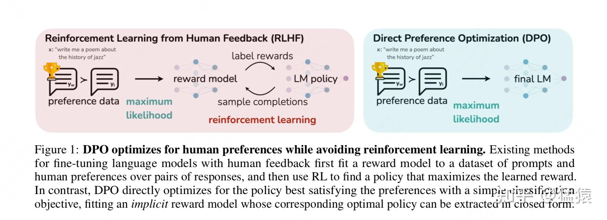
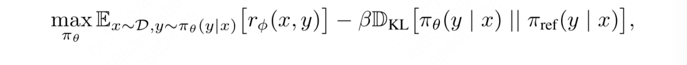
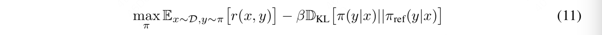
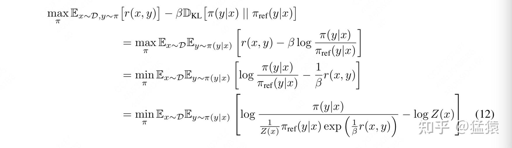
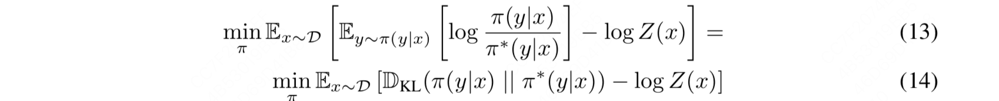
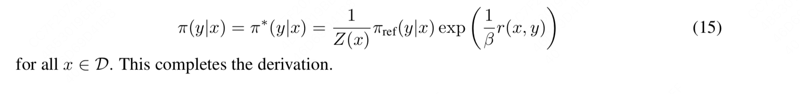
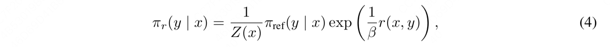
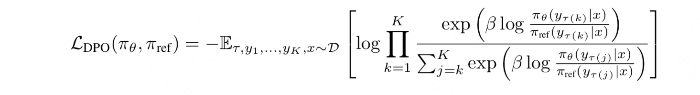

一、DPO 在做一件什么事
-------------

在文章的开始，**我们来思考一个问题：如果想让你训练一个能听得懂人类问题，并给出人类满意答案的模型，你会怎么设计大致的训练步骤？**  
一口吃成一个大胖子是困难的，所以不如让我们**循序渐进**地来设计这个训练过程：  

*   首先，你的模型必须要有充足的知识储备，以应对你可能提出的任何问题
*   其次，你的模型需要明白 “你在提出问题” 或者 “你在下达指令” 这个动作，它在理解这一点的基础上，尝试按照你的指令给出相应的回答
*   **最后，你希望模型不仅能对你的问题给出答案，还需要给出令你满意的回答，也就是你希望模型对齐你的偏好。**

我们以 [chatGPT](https://zhida.zhihu.com/search?content_id=248369051&content_type=Article&match_order=1&q=chatGPT&zhida_source=entity) 的训练为例，看看它是如何贴合这个训练步骤的：

*   首先，它使用大量的数据 (文本、代码、数学等)，先训练出一个 base 模型。这个训练过程赋予模型对文本上下文的理解能力和通用的知识，你也可以理解成它训练出了一个能做好词语接龙的 base 模型
*   然后，我们在这个 base 模型上做微调，使得模型能够听懂人类的指令，这个过程得到的模型我们称为 $\pi_{sft}$
*   **最后，我们采用 rlhf 的方式（奖励模型 + ppo），使得模型不仅能够听懂人类指令，还能产出符合人类偏好的回答。**

关于 chatGPT 原理和 rlhf 原理的部分，可以参考这两篇文章：

现在，我们把焦点放在第三步上：如何训练模型对齐人类的偏好。在以 chatGPT 为代表的训练方法中：  

*   **训练奖励模型（Reward Model， RM）**：  

*   首先，我们需要有一个【标准】，这个标准在告诉待训练的模型，什么回答才是人类喜欢的。这个标准就是奖励模型，它将对各个回答进行打分。
*   然后，在训练奖励模型时，我们可以采用【偏好排序】来标注数据集。即对于一个 prompt，我们可以产出若干个回答。然后让人工对这若干个回答进行偏好排序，我们就用这些数据来训练模型

*   **训练对齐模型：**  

*   **在这篇文章中，我们称经过偏好对齐训练后的模型为【对齐模型】**，这个模型也是我们训练的最终目的
*   **设计对齐模型的优化目标**：这个优化目标不仅考虑到奖励模型的得分，也尽量让对齐模型参数更新后输出的分布不要偏移 $\pi_{sft}$ 太远，防止模型越训越差。
*   **使用强化学习的方法，采用 PPO 手段来训练这个优化目标，因为用到了强化学习，所以这种方法又被称为 rlhf-ppo。**在这个过程中，我们让对齐模型根据 prompt 自生成回答，并采用训练好的奖励模型对回答进行打分，对齐模型会根据评分结果不断调整自己的输出分布。更多细节在上面提到的 rlhf 相关文章中，这里不赘述。

**当你仔细端详【对齐人类偏好】这个训练步骤时，你可能会感觉有些疑惑：**  

*   看起来，在训练奖励模型的过程中，我们就已经在考虑 “什么回答是好的，什么回答是不好的” 这个问题了。而对齐模型依然是在考虑这个问题。**所以，我们能不能避开奖励模型的训练，直接一步到位训练对齐模型呢？**
*   在实际 rlhf-ppo 的训练中，存在【显存占据大】、【超参多】、【模型训练不稳定】等一系列问题。**那么在考虑 “一步到位训练对齐模型” 的过程中，我们是不是也能顺手做到绕过强化学习，采用一个更简单的方式（比如类似于 sft）来使用偏好数据训练对齐模型呢？**

**基于这些考虑，DPO（Direct Preference Optimization）应运而生**，正如它名字中 **Direct** 蕴含的含义一样，比起传统基于强化学习 PPO 的方式，它改进了以下两点：  

*   **不再训练奖励模型，直接使用人类标注的偏好数据，一步到位训练对齐模型。**
*   **不再使用强化学习的方法，通过数学推理，将原始的偏好对齐优化目标步步简化，最后通过类似于 sft 的方式，用更简化的步骤训练出对齐模型。**

我们借用 DPO 论文中的配图，来直观比较 RLHF-PPO 和 DPO 之间的差异：  

**这篇文章将从数学原理上详细解释，DPO 是如何从最原始的偏好对齐优化目标开始，一步步做简化的（不涉及实操代码，这个后续有时间再单开一篇文章）**。本文从更符合大家逻辑思考顺序的角度，重构了 DPO 的推导过程，并对每一步推导过程都给出了详细的注解，希望能帮大家解决一些数学上的困惑，也更好理解 DPO。

二、偏好对齐模型的优化目标
-------------

**不管你是 ppo 还是 dpo，在偏好对齐这一步中，总的优化目标是不变的，如上式所示**，其中：  

*   $\pi_{\theta}$ ：是我们正在训练的、目的是为了对齐人类偏好的模型
*   $r_{\phi}$ ：是训练好的奖励模型
*   $\pi_{ref}$ ：参考模型，一般是 sft 步骤的模型初始化而来

下面开始循序渐进解释 dpo loss 函数是如何从这个总体优化目标中推导而出的**，大家在这个过程中依然牢记两件事：**

*   **绕过奖励模型**
*   **最大可能简化优化目标**

三、步骤 1：从优化目标中直接求解最优对齐模型
--------------------------

###   

3.1 推导细节

式（11）依然是总优化目标，符号稍作了改写。现在我们要找到能最大化这个优化目标的对齐模型 $\pi$ 。  
现在我们开始对它进行改进：  

**第 1 行～第 2 行：**  

$\mathbb{D}_{KL}[\pi(y|x) || \pi_{ref}(y|x)] = \mathbb{E}_{y\sim \pi(y|x)}[log\frac{\pi(y|x)}{\pi_{ref}(y|x)}]$ ，所以可以从第 1 行改写成第 2 行。  

**第 2 行～第 3 行：**  

除以 $\beta$ ，并取反（因此 max 改成 min）  

**第 3 行～第 4 行：**

$\begin{aligned} log\frac{\pi}{\pi_{ref}} - \frac{1}{\beta}r &= log\frac{\pi}{\pi_{ref}} - logexp(\frac{1}{\beta}r)\\ &= log\frac{\pi}{\pi_{ref} * exp(\frac{1}{\beta}r)}\\ &= log\frac{\frac{1}{Z(x)}\pi}{\frac{1}{Z(x)}\pi_{ref} * exp(\frac{1}{\beta}r)}\\ &= log\frac{\pi}{\frac{1}{Z(x)}\pi_{ref} * exp(\frac{1}{\beta}r)} - logZ(x) \end{aligned}$

观察推导结果的最后一步，我们发现 $\pi$ 本身是一个概率分布，那么如果我能让分母 $\frac{1}{Z(x)}\pi_{ref} * exp(\frac{1}{\beta}r)$ 也能变成一个概率分布的形式，那么我不就能以优化 KL 散度的视角来看待最后一步左侧这个式子了吗？基于这个想法，我们**可以将 $Z(x)$ 构造成一个 partition function（配分函数）**，即：

$Z(x) = \sum_{y}\pi_{ref}(y|x)exp(\frac{1}{\beta}r(x,y))$

我们把这个 $Z(x)$ 带入最后一步左侧项的分母中，则有：

$\frac{1}{Z(x)}\pi_{ref} * exp(\frac{1}{\beta}r) = \frac{\pi_{ref} * exp(\frac{1}{\beta}r)}{\sum_{y}\pi_{ref} * exp(\frac{1}{\beta}r)}$

其中，分子表示给定某个 (x,y) 下的奖励期望；分母则表示给定 x，所有可能的 y 的奖励期望之和。这相当于是一个归一化的操作，使得这一项的取值在 [0,1] 之间，也就满足了我们前面说的构造一个概率分布的需求。（论文在这一块没有展开推导，而是直接给出了 Z(x)的形式，所以这边我们做了细节展开，也方便大家理解 Z(x)是怎么设计出来的）。同时，**由** $Z(x)$ **的定义我们知道，它是关于 x 的函数，且它和我们准备优化的模型** $\pi$ **没有关系**。  
现在我们更明确把式子表达成一个概率分布。**鉴于分子** $\pi(y|x)$ **已经是个显式的分布表示了，我们干脆把分母也写成一个显示的分布表示，我们定义一个分布** $\pi^{*}(y|x)$ ：  
$\pi^{*}(y|x) = \frac{1}{Z(x)}\pi_{ref}(y|x)exp(\frac{1}{\beta}r(x,y))$  
好，现在再把这个人为定义的分布表达带回到式（12）中，我们得到：  

观察式（14），**前面我们说过** $Z(x)$ **和我们准备优化的模型** $\pi$ **没有关系，所以可以把它忽略掉**。那么现在我们只用关心 KL 散度这一项。我们知道 KL 散度在两个分布完全相等时达到最小，由此我们可以写出模型 $\pi$ 的显式解：  

我们对式（15）再做一个简单的改写：**因为以上推导都是在假设我们有一个固定的奖励函数的基础上进行的**，所以我们可以加一个下标 $r$ 来强调这一点，则式（15）可进一步被改写成：  

**可是，在正常的对齐训练中，这个奖励函数** $r(x, y)$ **可不是任意的，它是我们先用数据训练出来的最优奖励模型**，**然后在这个最优奖励模型的基础上，我们再通过训练去找到最优对齐模型** $\pi$ 。最优的奖励模型 $r$ 基于它训练出的最优的对齐模型 $\pi$ 依然满足式（4）的关系，我们分别设它们为 $r^{*}(x, y), \pi^{*}(y|x)$ ，则有：  
$\pi^{*}(y|x) = \frac{1}{Z(x)}\pi_{ref}(y|x)exp(\frac{1}{\beta}r^{*}(x,y))$  
后面这些推导步骤没有什么难度，无非是做了些公式和符号上的变化。

### 3.2 步骤 1 总结

到此为止，经过了长长的推导，你可能已经有点懵了，没关系，**我们总结一下步骤 1 中我们做的事情：**  

*   首先，我们有一个对齐人类偏好阶段的总优化目标函数，**它是在假设我们已经有一个奖励函数** $r$ **的基础上设计的**，我们的目标是找到能使这个目标值最大化的对齐模型 $\pi$ ：

*   然后，我们从这个目标函数出发，**找到** $\pi$ **的显式解（也就是在任意固定的奖励函数 r 的基础上最优的** $\pi$ **）**：

$\pi_{r}(y|x) = \frac{1}{Z(x)}\pi_{ref}(y|x)exp(\frac{1}{\beta}r(x,y))$  
其中， $Z(x)$ **是人为定义的 partition function**，它形式为 $Z(x) = \sum_{y}\pi_{ref}(y|x)exp(\frac{1}{\beta}r(x,y))$  

*   最后，**由于在实际训练中，我们肯定是在最优的奖励函数上去训练最优的对齐模型** $\pi$ ，所以我们对上式的符号稍加更改，令星号代表最优，则有：

$\pi^{*}(y|x) = \frac{1}{Z(x)}\pi_{ref}(y|x)exp(\frac{1}{\beta}r^{*}(x,y))$

四、步骤 2：跳过奖励模型的训练
----------------

虽然我们现在得到了对齐模型 $\pi$ 的显式解 $\pi_{r}(y|x)$ ，**但是我们却很难直接利用起这个显式解形式**，原因如下：

*   $Z(x)$ **的值很难估计**。根据 $Z(x)$ 的形式可知，想要估计它，需要对一个 prompt x 采样足够多的回答 y。这个代价是十分昂贵的。
*   **同时回顾最开始我们的目标：省略训练奖励模型这个步骤，一步到位来训练对齐模型**。而目前我们得到的 $\pi$ 的显式解仍然需要一个确定的奖励函数 $r$ ，没有达到我们的目标。

所以现在我们继续来迭代。基于上述第 2 个原因，**我们可以先从** $\pi$ **的显式解中推出奖励函数** $r$ **的形式：**  
 $r^{*}(x, y) = \beta log\frac{\pi^{*}(y|x)}{\pi_{ref}(y|x)} + \beta logZ(x)$ r^{*}(x, y) = \beta log\frac{\pi^{*}(y|x)}{\pi_{ref}(y|x)} + \beta logZ(x)  
**好，现在既然我们能用最优对齐模型** $\pi^{*}$ **表示出最优奖励模型** $r^{*}$ **了，那么我们直接把** $\pi^{*}$ **代入到奖励模型的训练优化目标中去，不就意味着我可以明面上训练奖励模型，实际上却一步到位训练出了对齐模型吗？**这不就能实现我们最开始的目标了么？  
**现在，问题回到 “奖励模型的训练上” 来了。我们通常使用 “偏好排序” 这种数据标注方式来对奖励模型进行训练，一般有 2 种偏好排序方法：**

*   **只生成 2 个回答，`<prompt x, chosen y1, reject y2>`**，即对于一个 prompt，我们只生成 2 个回答，让人工对这两个回答的偏好做排序，我们希望奖励模型对 chosen 回答的给分尽量高于对 reject 回答的给分。
*   **生成 K 个（K > 2）回答，`<prompt x, y1, ..., yK>`**，假设人工标注后的偏好排序组合为 $\tau$ （比如人工人为偏好从大到小应该为 y2 > y3 > y1 >... > yK，则这个排列就为 $\tau$ ），那么我们希望奖励模型对 $\tau$ 这个排序的总得分要大于其余任何可能的偏好排序。

在某些框架（比如 chatGPT）的训练中，当生成的回答 > 2 个时，它会把回答拆成两两 pair 对，这样就可以和只生成 2 个回答时的目标函数做统一。**但在更一般的场景中，对于 > 2 个回答的场景，我们是把每一种可能的回答偏好排序当成一个整体数据进行处理的**，然后希望真值排序 $\tau$ 的得分最高。DPO 的推导是基于后者进行的，所以接下来，我们也对 K=2 和 K>2 这两种情况分别下 DPO 最终的目标函数形式推导进行详细说明。

### 4.1 BT 模型：只生成 2 个回答

`<prompt x, chosen y1, reject y2>`，对于一个 prompt，我们只生成两个答案，然后在这两个答案间进行偏好排序。**那么在这种偏好标注数据下，我们该怎么设计奖励模型的训练目标呢？**  
**首先，我们需要明确，我们到底希望一个好的奖励模型能做什么事？我们当然是希望 “chosen y1 打败 reject y2 的概率尽量大”。**基于此，我们可以引入统计模型 **Bradley-Terry（BT 模型）**进行建模，该模型在 1952 年被首次提出，用于分析成对数据间的相对优势或者偏好，被广泛应用于体育比赛分析、市场研究等场景。**在该模型下，我们假设有一个成对数据** $(y1, y2)$ **，则 “y1 打败 y2 的概率” 可以被表示成：**  
$P(y_{1} \succ y_2) = \frac{e^{\lambda y_{1}}}{e^{\lambda y_{1}} + e^{\lambda y_{2}}}$  
其中， $\lambda y_{1}, \lambda y_{2}$ 分别表示 $y_1, y_2$ 的强度参数。  
**什么是强度参数呢？**假设我们现在想预测球队 1 在本场能打败球队 2 的概率，那么强度参数就可以是这两只球队过往的胜率。那么同理，**如果现在 y1 和 y2 分别表示 chosen 和 reject 回答，那么强度参数就可以是奖励模型对这两个回答打出的分数**，则根据 BT 模型，我们有：  
$P(y_1 \succ y_2 | x) = \frac{exp[r(x, y_1)]}{exp[r(x, y_1)]+ exp[r(x, y_2)]}$  
我们希望 y1 打败 y2 的概率尽量大，**也就是我们希望对于整个标注数据集** $D = \{x^{i}, y_{w}^{i}, y_{l}^{i}\}_{i =1}^{N}$ **，chosen 打败 reject 的期望概率尽量大（其中，w=chosen，l=reject），所以奖励函数的总体优化目标可以设计成**：  
$L_{R}(r_{\phi}, D) = - \mathbb{E}_{(x, y_w, y_l)\sim D}[logP(y_w \succ y_l | x)]$  
我们把 P 的具体形式代入这个函数，则有：

$\begin{aligned} L_{R}(r_{\phi}, D) &= - \mathbb{E}_{(x, y_w, y_l)\sim D}[logP(y_w \succ y_l | x)]\\ & = -\mathbb{E}_{(x, y_w, y_l)\sim D}[log\frac{exp[r(x, y_w)]}{exp[r(x, y_w)]+ exp[r(x, y_l)]}] \\ & = -\mathbb{E}_{(x, y_w, y_l)\sim D}[log\frac{1}{1+ \frac{exp[r(x, y_l)]}{exp[r(x, y_w)]}}] \\ & = -\mathbb{E}_{(x, y_w, y_l)\sim D}[log\frac{1}{1+ exp^{-(r(x,y_w) - r(x, y_l))}}] \\ & = -\mathbb{E}_{(x, y_w, y_l)\sim D}[log\sigma[r(x, y_w)- r(x, y_l)]] \end{aligned}$  
诶，你看，这最后一行公式你眼熟不？这不就是 chatGPT 中构造的奖励模型优化目标的最终形式么？在 chatGPT 的论文中，直接给出了这个优化目标，并做了直觉上的解读。**而这里我们则更进一步：从最经典的 BT 模型开始，一步步推导出成对偏好数据下的奖励模型优化目标应该如何设计。**  
好，现在我们假设，最优奖励模型为 $r^{*}(x, y)$ ，则我们将其带入上面的优化目标中，就有：  
$L_{R}(r_{\phi}, D) = -\mathbb{E}_{(x, y_w, y_l)\sim D}[log\sigma[r^{*}(x, y_w)- r^{*}(x, y_l)]]$  
而同时，根据前文的推导，最优的奖励模型又可以用最优的对齐模型 $\pi^{*}(y|x)$ 来显式表示，即：  
$r^{*}(x, y) = \beta log\frac{\pi^{*}(y|x)}{\pi_{ref}(y|x)} + \beta logZ(x)$  
我们把这个显式表示带入上面的优化目标中，则有：  
$L_{R}(r_{\phi}, D) = -\mathbb{E}_{(x, y_w, y_l)\sim D}[log\sigma[\beta log\frac{\pi^{*}(y_w|x)}{\pi_{ref}(y_w|x)} - \beta log\frac{\pi^{*}(y_l|x)}{\pi_{ref}(y_l|x)}]]$  
**到这里，你是否惊奇地发现：我们已经把训练奖励模型的目标函数转化成只和对齐模型** $\pi$ **相关了！也就是说，我们可以一步到位，绕开训练奖励模型的过程，直接用标注好的【成对】偏好数据，以类似于 sft 的过程直接训练对齐模型了！**因此我们对上述式子再稍加改动，我们设等待训练的对齐模型为 $\pi_{\theta}$ ，则有：  
$L_{DPO}(\pi_{\theta}; \pi_{ref}) = -\mathbb{E}_{(x, y_w, y_l)\sim D}[log\sigma[\beta log\frac{\pi_{\theta}(y_w|x)}{\pi_{ref}(y_w|x)} - \beta log\frac{\pi_{\theta}(y_l|x)}{\pi_{ref}(y_l|x)}]]$  
**看，这就是【成对】偏好数据下 DPO 的优化目标。**  
**总结一下，在这一节中：**  

*   **我们通过经典的 BT 模型，先一步步推导出【成对偏好数据】下训练奖励模型的优化目标**
*   **然后，我们再使用前问推导出的奖励函数和对齐模型的关系，把奖励模型优化目标中和奖励函数相关的部分替换成对齐模型，构造出了【成对偏好数据】下的 DPO 优化目标，以此达到绕过奖励模型的偏好对齐训练。** 

4.2 PT 模型：生成 K（K>2）个回答

现在，如果我不想使用【成对偏好数据】，而是对于一个 prompt，我标出 K（K>2）个回答，然后对这些回答进行人工偏好排序，**在这种方式下，我要怎么设计奖励模型优化目标呢？**  
**类比于 BT，我们同样有一个基于统计的 PT 模型（Plackett-Luce）可以对多数据的偏好进行排序**，假设 $\tau$ 为人工标注出的真值排序，则我们当然希望 $\tau$ 能够打败其余任何一种可能的偏好排序，**我们将 “最优排序** $\tau$ **打败其余任何一种排序” 的概率表示成：**  
$P(\tau | y_1,...,y_K, x) = \prod_{k=1}^{K}\frac{exp[r(x, y_{\tau(k)})]}{ {\textstyle \sum_{j=k}^{K}exp[r(x, y_{\tau(j)})]}}$  
**其中，** $\tau_{k}$ **表示人类标注的偏好序列** $\tau$ **中的第 k 个数据，序列** $\tau$ **中的 K 个回答已经按照偏好从高到低进行排序**  
上面这个公式从直观上理解的话：

*   对于真值 $\tau$ 中的第一个回答 $\tau_{1}$ ，它是人工标注的偏好最高的数据，我们当然希望它的得分在 $\tau_{1} \sim \tau_{K}$ 中占大头
*   对于真值 $\tau$ 中的第一个回答 $\tau_{2}$ ，我们当然希望它的得分在 $\tau_{2} \sim \tau_{K}$ 中占大头
*   对于真值 $\tau$ 中的第一个回答 $\tau_{3}$ ，我们当然希望它的得分在 $\tau_{3} \sim \tau_{K}$ 中占大头
*   以此类推，则不难理解上述在 PT 模型下概率 P 的表达方式。

同样，我们把最优奖励函数 $r^{*}(x, y)$ 代入上面的 P 中，则有：  
$P(\tau | y_1,...,y_K, x) = \prod_{k=1}^{K}\frac{exp[r^{*}(x, y_{\tau(k)})]}{ {\textstyle \sum_{j=k}^{K}exp[r^{*}(x, y_{\tau(j)})]}}$  
然后我们再用 $\pi^{*}$ 去表示 $r^{*}$ ，则有（这里我们可以把 $Z(x)$ 省略掉，因为正如前文所说，它和对齐模型 $\pi$ 没有关系）：  

**那么对于整个数据集来说，我们希望最优序列打败其余任何一个可能序列的期望概率尽量大，则多回答下 DPO 的目标函数可以写成：**  

五、(必看)DPO 优化目标推导过程总结
-----------------------

**我们把 DPO 的推导过程完整总结一次：**  

*   首先，我们有一个对齐人类偏好阶段的总优化目标函数，**它是在假设我们已经有一个奖励函数** $r$ **的基础上设计的**，我们的目标是找到能使这个目标值最大化的对齐模型 $\pi$

*   然后，我们从这个目标函数出发，**找到** $\pi$ **的显式解（也就是在任意固定的奖励函数 r 的基础上最优的** $\pi$ **）**：

$\pi_{r}(y|x) = \frac{1}{Z(x)}\pi_{ref}(y|x)exp(\frac{1}{\beta}r(x,y))$  
其中， $Z(x)$ **是人为定义的 partition function**，它形式为 $Z(x) = \sum_{y}\pi_{ref}(y|x)exp(\frac{1}{\beta}r(x,y))$

*   接着，**由于在实际训练中，我们肯定是在最优的奖励函数上去训练最优的对齐模型** $\pi$ ，所以我们对上式的符号稍加更改，令星号代表最优：

$\pi^{*}(y|x) = \frac{1}{Z(x)}\pi_{ref}(y|x)exp(\frac{1}{\beta}r^{*}(x,y))$  

*   然后，**由于我们的训练目标是尽量绕过奖励模型，直接使用偏好数据，通过类似 sft 的方式一步到位训练对齐模型，所以我们将上式先改写成如下形式。**接下来，我们只需要关注如何构造奖励函数的训练目标，然后把这个式代入训练目标中，就可以一步到位训练对齐模型。

 $r^{*}(x, y) = \beta log\frac{\pi^{*}(y|x)}{\pi_{ref}(y|x)} + \beta logZ(x)$ 

*   在奖励模型的训练过程中，有 2 种数据标注的方式，分别是【成对回答偏好标注】和【多回答偏好标注】。  

*   **成对回答偏好标注**：在这类数据标注方式上，**我们使用 BT 模型**，先推导出奖励模型的优化目标，然后使用 $\pi^{*}$ 替换掉优化目标中的 $r^{*}$ ，得到最终的 dpo 优化目标：

$L_{DPO}(\pi_{\theta}; \pi_{ref}) = -\mathbb{E}_{(x, y_w, y_l)\sim D}[log\sigma[\beta log\frac{\pi_{\theta}(y_w|x)}{\pi_{ref}(y_w|x)} - \beta log\frac{\pi_{\theta}(y_l|x)}{\pi_{ref}(y_l|x)}]]$  

*   **多回答偏好标注**：推导逻辑同上，但不同的是我们**使用的是 PT 模型**，最终得到的 DPO 优化目标为：

