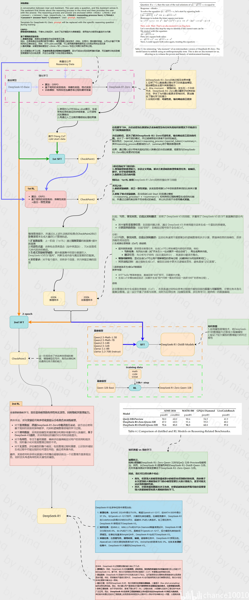
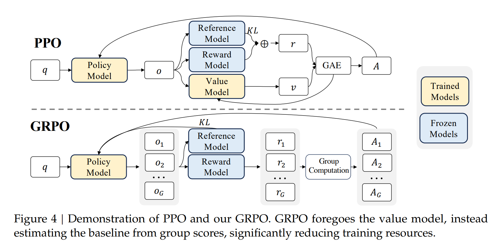

# R1技术报告简介

**报告地址：**

[DeepSeek-R1 发布，性能对标 OpenAI o1 正式版 | DeepSeek API Docs](https://api-docs.deepseek.com/zh-cn/news/news250120)

**DeepSeek-R1-Zero** 是一个通过大规模强化学习（RL）训练而成的模型，在初步阶段没有经过有监督的微调（SFT），它展现出了卓越的推理能力。通过强化学习，DeepSeek-R1-Zero 自然地呈现出许多强大而有趣的推理行为。然而，它也面临着诸如可读性差和语言混合等挑战。

为了解决这些问题并进一步提高推理性能，推出了 **DeepSeek-R1**，它在强化学习之前引入了多阶段训练和冷启动数据。

**DeepSeek-R1-Zero**: 使用 DeepSeek-V3-Base 作为基础模型，并采用 GRPO作为强化学习框架来提高模型在推理方面的性能。

**DeepSeek-R1**: DeepSeek-R1-Zero遇到了可读性差和语言混合等挑战。为了解决这些问题并进一步提高推理性能，引入了 DeepSeek-R1，结合了少量冷启动数据和多阶段训练。具体来说，首先收集数千个冷启动数据，以微调 DeepSeek-V3-Base 模型。在此之后，执行面向推理的 RL，如 DeepSeek-R1 Zero。在 RL 过程中接近收敛后，通过在 RL 检查点上进行拒绝采样创建新的 SFT 数据，并结合来自 DeepSeek-V3 的监督数据

**DeepSeek-R1 到更小的密集模型的蒸馏**：使用 Qwen2.5-32B作为基础模型，从 DeepSeek-R1 直接蒸馏的效果优于在其上应用强化学习。这表明，由更大的基础模型发现的推理模式对于提高推理能力至关重要。作者开源了蒸馏后的 Qwen 和 Llama系列。蒸馏后的14B 模型大大优于最先进的开源 QwQ-32B-Preview

| **模型**   | **方法**                                           |
| ---------------- | -------------------------------------------------------- |
| DeepSeek-R1-Zero | 纯强化学习                                               |
| DeepSeek-R1      | 冷启动 SFT -> RL -> COT + 通用数据 SFT（80w）->全场景 RL |
| 蒸馏小模型       | 直接用上面的 80w 数据进行SFT                             |

## 方法

流程图如下：




```Python
"""
本示例演示论文中DeepSeek-R1的主要流程，包括：
1. 冷启动数据微调（SFT）
2. 面向推理的强化学习（Reasoning-oriented RL）
3. 拒绝采样并再次微调（Rejection Sampling + SFT）
4. 面向全场景的RL
5. 蒸馏到小模型

注：以下代码仅为演示性质，省略了数据加载、超参数配置、训练细节和大规模并行等实际工程实现。
"""
import torch
import random
import numpy as np
from transformers import AutoModelForCausalLM, AutoTokenizer, TrainingArguments, Trainer
# (可选) 下面演示使用一个公开的RL库示例，如TRL等
# from trl import PPOTrainer, PPOConfig

#####################################################################################
#                                数据加载与预处理
#####################################################################################

def load_data_cold_start():
    """
    加载冷启动数据（包含一小批带详细推理过程的示例）。
    返回值为一个简单的列表或DataSet格式，每条数据含(prompt, answer_with_CoT)。
    """
    # 这里仅示例返回一个空列表或简单模拟
    return [
        {
            "prompt": "给定一个整数n，判断它是否是质数，并解释推理过程。",
            "answer": "<reasoning_process>...长链推理示例...</reasoning_process><summary>是质数/不是质数</summary>"
        },
        # ... 这里应该有更多实际冷启动数据
    ]

def load_data_reasoning_rl():
    """
    加载主要用来做推理强化学习的大规模任务数据（如数学、代码、逻辑推理题）。
    返回值通常包含可以自动判分的题目，以便实现基于结果的reward。
    """
    return [
        {"prompt": "请解方程: x^2 - 4x + 3 = 0 ，并给出详细推理。", "reference_answer": "x=1或x=3"},
        # ... 省略更多示例
    ]

def load_data_sft_non_reasoning():
    """
    加载非推理场景的数据，例如写作任务、多轮对话、知识问答等，用于SFT微调后提升通用性。
    """
    return [
        {"prompt": "你好，可以帮我写一段自我介绍吗？", "answer": "好的，这里是一段简单示例......"},
        # ...
    ]

def load_data_for_rejection_sampling():
    """
    用于做拒绝采样时的题目或场景数据，之后会调用强化后的模型生成答案，再根据规则或模型判定是否保留。
    """
    return [
        {"prompt": "证明勾股定理，并写出详细过程。", "reference_answer": "符合题意的正确推理和结论"},
        # ...
    ]

#####################################################################################
#                       冷启动微调 (Stage 1: Cold-Start SFT)
#####################################################################################

def train_sft_cold_start(base_model_name: str, train_data, output_dir: str):
    """
    使用冷启动数据进行SFT（监督微调）。
    :param base_model_name: HuggingFace模型名称或本地路径
    :param train_data: 冷启动数据，需包含prompt和详细的答案（带CoT）
    :param output_dir: 模型输出目录
    :return: 微调后的模型
    """
    tokenizer = AutoTokenizer.from_pretrained(base_model_name)
    model = AutoModelForCausalLM.from_pretrained(base_model_name)

    # 这里为了简单，用huggingface的Trainer做一个监督训练示例
    # 实际中需根据任务自定义collator并拼接 <prompt><separator><answer> 格式输入
    train_texts = []
    for d in train_data:
        prompt = d["prompt"]
        answer = d["answer"]
        # 假设answer里已经含有<reasoning_process>,<summary>等标记
        combined_text = f"{prompt}\n{answer}"
        train_texts.append(combined_text)

    # 简单的train_dataset示例
    encodings = tokenizer(train_texts, truncation=True, padding=True, max_length=512)
    # 为了演示，可把inputs当targets
    dataset = SimpleDataset(encodings)

    training_args = TrainingArguments(
        output_dir=output_dir,
        num_train_epochs=1,  # 示例中只训练一个epoch
        per_device_train_batch_size=2,
        save_steps=10,
        logging_steps=10
    )

    trainer = Trainer(
        model=model,
        args=training_args,
        train_dataset=dataset
    )
    trainer.train()

    return model, tokenizer


#####################################################################################
#         面向推理的强化学习 (Stage 2: Reasoning-Oriented RL，如DeepSeek-R1-Zero)
#####################################################################################

def compute_reward_for_reasoning(output_str: str, reference_answer: str) -> float:
    """
    根据模型输出和参考答案来计算奖励值。
    这里以简单匹配or外部判定为例：正确则+1，不正确则0。
    在实际中可使用更多规则/正则表达式/编译器测试，乃至语言一致性奖励等。
    """
    # 简单示例：如果预期结果在输出字符串里，就给正奖励，否则0
    if reference_answer in output_str:
        return 1.0
    else:
        return 0.0

def train_rl_reasoning(base_model, tokenizer, rl_data, rl_steps=1000):
    """
    针对推理任务进行大规模强化学习训练，示例化演示。
    :param base_model: 已经初始化或SFT过的模型(如DeepSeek-V3-Base或SFT后的模型)
    :param tokenizer: 分词器
    :param rl_data: 大规模推理数据，每条含可自动判定正误的题目
    :param rl_steps: RL训练步数
    :return: 强化学习后的模型
    """
    # 注意：在真实实现中，需要RL库(如trl, accelerate等)来进行策略梯度/PPO等操作
    # 这里仅做概念示例
  
    # pseudo-code:
    model = base_model
    optimizer = torch.optim.AdamW(model.parameters(), lr=1e-5)

    # 模拟若干个训练步，每步从数据集中采样(SGD)
    for step in range(rl_steps):
        data_sample = random.choice(rl_data)
        prompt = data_sample["prompt"]
        ref_ans = data_sample["reference_answer"]

        # 1. 用当前策略（model）生成文本
        inputs = tokenizer(prompt, return_tensors="pt")
        outputs = model.generate(**inputs, max_new_tokens=128)
        output_text = tokenizer.decode(outputs[0], skip_special_tokens=True)

        # 2. 计算奖励
        reward = compute_reward_for_reasoning(output_text, ref_ans)

        # 3. 计算policy gradient的loss(仅示例，不是实际可运行代码)
        #    在真实环境，需要保留log_probs，并使用类似PPO的loss函数
        #    这里假装reward就是loss的负数
        loss = -1.0 * reward  # 纯粹演示，不可用

        # 4. 反向传播并更新模型
        loss.backward()
        optimizer.step()
        optimizer.zero_grad()

        if step % 100 == 0:
            print(f"RL training step {step}, current reward={reward}, output_text={output_text[:50]}...")

    return model


#####################################################################################
#                 拒绝采样并再次SFT (Stage 3: Rejection Sampling + New SFT)
#####################################################################################

def collect_data_with_rejection_sampling(model, tokenizer, data_for_reject_sampling):
    """
    用已强化学习后的模型生成若干答案，进行拒绝采样。
    - 对于每个prompt，采样N次（例如N=4或更多），并将其中正确或可读性好的回答保留下来。
    - 可以组合人工过滤或简单的GPT判定、判分器等。
    """
    recollected = []
    for d in data_for_reject_sampling:
        prompt = d["prompt"]
        ref_ans = d["reference_answer"]
        # 全部候选
        candidates = []
        for _ in range(4):
            inputs = tokenizer(prompt, return_tensors="pt")
            outputs = model.generate(**inputs, max_new_tokens=128)
            output_text = tokenizer.decode(outputs[0], skip_special_tokens=True)
            # 计算正确性
            score = compute_reward_for_reasoning(output_text, ref_ans)
            candidates.append((output_text, score))
        # 选择score最高/可读性最好的
        best_candidate = max(candidates, key=lambda x: x[1])
        # 如果符合一定阈值，则保留
        if best_candidate[1] > 0.5:
            recollected.append((prompt, best_candidate[0]))
    return recollected

def train_sft_second(model_name_or_path, new_sft_data, output_dir):
    """
    对带有更多(拒绝采样后)的推理数据+非推理数据，再次SFT
    """
    tokenizer = AutoTokenizer.from_pretrained(model_name_or_path)
    model = AutoModelForCausalLM.from_pretrained(model_name_or_path)

    # 同理，这里只是示例化
    train_texts = []
    for item in new_sft_data:
        prompt, ans = item
        combined = f"{prompt}\n{ans}"
        train_texts.append(combined)

    encodings = tokenizer(train_texts, truncation=True, padding=True, max_length=512)
    dataset = SimpleDataset(encodings)

    training_args = TrainingArguments(
        output_dir=output_dir,
        num_train_epochs=1,
        per_device_train_batch_size=2,
        save_steps=10,
        logging_steps=10
    )
    trainer = Trainer(
        model=model,
        args=training_args,
        train_dataset=dataset
    )
    trainer.train()

    return model, tokenizer


#####################################################################################
#                 全场景RL (Stage 4: RL for All Scenarios)
#####################################################################################

def train_rl_full_scenarios(model, tokenizer, data_mixed, steps=1000):
    """
    在所有场景（包含推理数据和广泛任务数据）上再次进行RL，
    以同时兼顾有害性检测、帮助度评估等多种reward。
    """
    # 仅示例：引入更多reward维度，如helpfulness_reward, harmless_reward等
    optimizer = torch.optim.AdamW(model.parameters(), lr=1e-5)

    for step in range(steps):
        sample_data = random.choice(data_mixed)
        prompt = sample_data["prompt"]
        ref_answer = sample_data["reference_answer"]
        # 可能还有helpfulness参考或harmlessness判断

        inputs = tokenizer(prompt, return_tensors="pt")
        outputs = model.generate(**inputs, max_new_tokens=128)
        output_text = tokenizer.decode(outputs[0], skip_special_tokens=True)

        # 假设用多重reward简单加和
        correctness_reward = compute_reward_for_reasoning(output_text, ref_answer)
        helpfulness_reward = 0.5  # 仅示例: 可能需要另一个模型打分
        total_reward = correctness_reward + helpfulness_reward
        loss = -1.0 * total_reward

        loss.backward()
        optimizer.step()
        optimizer.zero_grad()

        if step % 100 == 0:
            print(f"[Full RL] Step {step}, total reward={total_reward}, sample output={output_text[:50]}...")

    return model

#####################################################################################
#                 蒸馏到小模型 (Stage 5: Distillation to Smaller Models)
#####################################################################################

def distill_model_to_small(teacher_model, teacher_tokenizer, small_model_name, distilled_data, output_dir):
    """
    将teacher模型（DeepSeek-R1）生成的推理数据，拿来对小模型做微调，达到蒸馏效果。
    :param teacher_model: 已经训练好的教师模型
    :param teacher_tokenizer: 教师模型分词器
    :param small_model_name: 用来加载小模型的名称或路径
    :param distilled_data: 教师模型产出的数据，如<prompt, answer>对
    :param output_dir: 小模型输出路径
    """
    # 1. 小模型初始化
    small_model = AutoModelForCausalLM.from_pretrained(small_model_name)
    small_tokenizer = AutoTokenizer.from_pretrained(small_model_name)

    # 2. 构造"教师强推理数据" → "学生小模型微调"
    #    在实际中，可由teacher_model对大量复杂题目生成正确解答，然后把 (prompt, answer) 存入distilled_data
    #    这里仅做简单示例
    train_texts = []
    for item in distilled_data:
        # item为(prompt, correct_answer)对
        prompt, ans = item
        combined_text = f"{prompt}\n{ans}"
        train_texts.append(combined_text)

    encodings = small_tokenizer(train_texts, truncation=True, padding=True, max_length=512)
    dataset = SimpleDataset(encodings)

    training_args = TrainingArguments(
        output_dir=output_dir,
        num_train_epochs=1,
        per_device_train_batch_size=2,
        save_steps=10,
        logging_steps=10
    )

    trainer = Trainer(
        model=small_model,
        args=training_args,
        train_dataset=dataset
    )
    trainer.train()

    return small_model, small_tokenizer


#####################################################################################
#                                   工具函数
#####################################################################################

class SimpleDataset(torch.utils.data.Dataset):
    """
    简易数据集封装，将tokenizer输出的encodings包装为torch Dataset
    """
    def __init__(self, encodings):
        self.encodings = encodings

    def __getitem__(self, i):
        return {key: torch.tensor(val[i]) for key, val in self.encodings.items()}

    def __len__(self):
        return len(self.encodings["input_ids"])


#####################################################################################
#                                   主流程示例
#####################################################################################

def main():
    # 1. 加载基础模型名称或路径
    base_model_name = "EleutherAI/gpt-neo-1.3B"  # 仅示例，可换成任意支持的LLM
  
    # --------------------- Stage 1: 冷启动SFT ---------------------
    cold_data = load_data_cold_start()
    model_cold, tokenizer_cold = train_sft_cold_start(
        base_model_name,
        cold_data,
        output_dir="model_sft_cold"
    )
    # 这里假设得到一个在冷启动数据上具备一定可读性的模型
  
    # --------------------- Stage 2: 推理强化学习 (Reasoning RL) ---------------------
    rl_data = load_data_reasoning_rl()
    model_reasoning = train_rl_reasoning(model_cold, tokenizer_cold, rl_data, rl_steps=100)
    # 此时得到类似DeepSeek-R1-Zero或DeepSeek-R1初步版本

    # --------------------- Stage 3: 拒绝采样并再次SFT ---------------------
    data_for_reject = load_data_for_rejection_sampling()
    recollected_data = collect_data_with_rejection_sampling(model_reasoning, tokenizer_cold, data_for_reject)
    # 也可合并非推理SFT数据
    non_reasoning_data = load_data_sft_non_reasoning()
    # 将两部分融合
    new_sft_data = []
    for item in recollected_data:
        new_sft_data.append(item)
    for nr in non_reasoning_data:
        prompt = nr["prompt"]
        ans = nr["answer"]
        new_sft_data.append((prompt, ans))

    model_sft2, tokenizer_sft2 = train_sft_second(
        base_model_name,
        new_sft_data,
        output_dir="model_sft_stage2"
    )

    # --------------------- Stage 4: 全场景RL ---------------------
    # 我们可以将更多多样化数据放在一起，让模型既保留强推理能力，也能兼顾安全、形式合规等
    data_mixed = rl_data  # 这里直接重复用推理数据做示例
    model_full = train_rl_full_scenarios(model_sft2, tokenizer_sft2, data_mixed, steps=50)

    # --------------------- Stage 5: 蒸馏到小模型 ---------------------
    # 假设我们先用训练好的model_full生成了大量的 (prompt, answer) 对，存储在distilled_data里
    # 这里为演示，仅以recollected_data为例
    distilled_data = recollected_data
    teacher_model = model_full
    teacher_tokenizer = tokenizer_sft2
    small_model_name = "gpt2"  # 示例小模型
    small_model, small_tokenizer = distill_model_to_small(
        teacher_model, teacher_tokenizer,
        small_model_name,
        distilled_data,
        output_dir="model_distilled_small"
    )

    print("DeepSeek-R1示例流程结束，最终小模型已完成蒸馏。")


if __name__ == "__main__":
    main()
```

# GRPO算法

## 为什么需要关注强化学习与策略优化？

在正式开始介绍 GRPO 之前，我们先谈谈一个较为根本的问题：**为什么需要策略优化？又为什么要在意强化学习？** 其实，无论是做推荐系统、对话系统，还是在数学推理、大语言模型对齐（alignment）场景里，最终我们都希望模型能输出 “更优” 或“更符合某些偏好”的序列。**深度强化学习**（DRL）借用 “奖励”（reward）来衡量我们希望的目标，从而对生成的过程进行引导。策略优化（Policy Optimization）则是其中一个关键方法论。

在语言模型的应用中，比如要让模型解出数学题、满足人类对话偏好（例如避免不良输出，或给出更详细解释），我们往往先用大规模的无监督或自监督训练打下基础，然后通过一些 “监督微调”（SFT）再进一步让模型学会初步符合需求。然而，SFT 有时难以将人类或某些高层目标的偏好显式地整合进去。**这时，“强化学习微调” 就登场了**。PPO 是其中的代表性算法，但它同样有自己的痛点，比如要维护额外的大价值网络，对内存与计算的需求在大模型场景中不容忽视。GRPO 正是在此背景下闪亮登场。

## 强化学习中的基本概念

### 智能体、环境与交互

在传统的强化学习框架中，我们通常有一个“智能体”（Agent）和一个 “环境”（Environment）。智能体每一步会基于自身策略 $\pi(s)$去决定一个动作 $a$，然后环境会根据这个动作给出新的状态和一个奖励 $r$，智能体收集这个奖励并继续下一步。这种循环往复构成了一个时间序列过程，直到到达终止条件（如达成目标或超时等）。

不过在语言模型（尤其是大型语言模型，LLM）当中，我们也可以把一个“问题”（例如一段文本提示 prompt）当作环境给的状态，然后模型（智能体）产出下一 token（动作），再不断重复，直到生成一段完整的回答；人类或额外的奖励模型再给予一个整段回答的质量分，或在每个 token（或步骤）时刻给出一个局部奖励。虽然大语言模型看似和传统强化学习中的“马尔可夫决策过程(MDP)”有一些差别，但本质上也可以抽象为状态—动作—奖励—状态—动作的机制。

### 状态、动作、奖励、策略

- **状态**$s$：对于语言模型来说，可以把已经生成的 token 序列（以及当前问题）视为一种压缩后的状态；在传统 RL 里则是环境观测到的一些向量或特征。
- **动作**$a$：在语言模型生成场景，动作可以是 “在词表 vocabulary 里选出下一个 token”；在机器人或游戏环境中就是“移动、旋转、跳跃” 等操作。
- **奖励**$r$：衡量好坏程度的指标。在语言模型对齐中，常见做法是训练一个奖励模型来打分；或者直接用规则判断回答是否正确等。
- **策略**$\pi$：智能体在状态$s$ 下如何选动作$a$的概率分布函数$\pi(s)$。在语言模型里，这就是产生每个 token 的条件分布。

### 价值函数与优势函数：为什么需要它们

在 PPO 等典型策略梯度方法中，我们通常还会引入一个**价值函数（Value Function）**，它大致表示在当前状态下，未来能期望得到多少奖励；或者更进一步，我们可以在每个动作之后去看 “优势函数（Advantage Function）”，衡量 “这个动作比平均水平好多少”。为什么要搞价值函数或优势函数？因为在训练时，如果只有奖励的直接指引，每个样本都可能方差很大，收敛缓慢。价值函数的引入可以**降低训练方差**，提升训练效率。

## 从传统方法到近端策略优化（PPO）的发展脉络

### 策略梯度与 Actor-Critic 范式

**策略梯度方法（Policy Gradient）** 是强化学习中一种比较直接的做法：我们直接对策略函数$\pi_{\theta}(a \mid s)$

进行建模，计算相应的梯度来最大化期望回报。它不用像价值迭代一样枚举所有状态-动作组合，也不用像 Q-learning 那样先学Q再做贪心决策。策略梯度可以很好地适应高维连续动作空间，以及更灵活的策略表示。

不过，如果单纯用 **REINFORCE **等策略梯度方法，每一步更新都可能有很大方差，甚至出现不稳定现象。为此，研究者们提出了 **Actor-Critic** 框架：将 “策略” 叫做 **Actor**，将 “价值函数” 叫做 **Critic**，两者共同训练，让 **Critic **起到估计价值、降低方差的作用。

### PPO 的核心思路：clip 与优势函数

后来又有了**近端策略优化（PPO）**，它是在 **Actor-Critic **的基础上，为了避免策略更新太猛导致训练不稳定，引入了一个**剪切 (clip)** 技巧，即把

$$
\frac{\pi_{\theta}\left(a_{t} \mid s_{t}\right)}{\pi_{\theta_{\text {old }}}\left(a_{t} \mid s_{t}\right)}
$$

这个概率比率给夹在$[1-\varepsilon, 1+\varepsilon] $ 区间内。这样就能防止每次更新过度，从而保持相对稳定。但要在实践中实现 PPO，需要在每个时间步都有一个价值网络去估计优势函数

$$
A_t = r_t + \gamma V_{\psi}(s_{t+1}) - V_{\psi}(s_t)
$$

或者更常用的是广义优势估计（GAE），来让更新时的方差更小。可问题在于，当我们的模型规模急剧增加——如在数十亿甚至千亿参数的语言模型上搞PPO，就会发现**训练资源消耗巨大**。因为这个价值网络本身通常要和策略网络 “同样大” 或近似大，并且需要在每个 token 都计算价值，从而带来可观的内存占用与计算代价。

### PPO 的局限性：模型规模与价值网络的负担

小模型时代，这也许还好，但是在当代的 LLM 背景下，我们需要**极度节省**训练内存与计算资源。尤其当你要做 RLHF（Reinforcement Learning from Human Feedback）或者别的对齐强化学习时，还要搭建奖励模型Reward Model、价值网络Critic Model，再加上本身的策略模型 Actor Model，算力负担往往让人头痛。

这就是 GRPO 的问题背景：**如何在保证 PPO 那样的收益（稳定、可控等）前提下，减少对昂贵价值网络的依赖？** 这背后的核心思路就是：用 “分组输出相互比较” 的方式来估计基线（Baseline），从而免去对价值网络的需求。

## GRPO（分组相对策略优化）

### GRPO 提出的动机：为何需要它

基于上节的对 PPO 的简要回顾，可以了解到PPO在大模型时代的痛点。要不就牺牲训练速度和成本，要不就需要想其他方法来绕过价值网络的全程参与。而 GRPO（全称 Group Relative Policy Optimization）正是对这一问题做出了一种解答。

**核心动机**：在许多实际应用中，奖励只有在序列末端才给一个分数（称之为 Result/Oucome Supervision），或在每一步给一些局部分数（Process Supervision）。不管怎么样，这个奖励本身往往是离散且比较稀疏的，要让价值网络去学习每个 token 的价值，可能并不划算。而如果我们在同一个问题 q 上**采样多份输出** $o_1, o_2, \ldots, o_G$，对它们进行奖励对比，就能更好地推断哪些输出更好。**由此，就能对每个输出的所有 token 做相对评分**，无须明确地学到一个价值函数。

在数理推理、数学解题等场景，这个技巧尤其管用，因为常常会基于同一个题目 q 生成多个候选输出，有对有错，或者优劣程度不同。那就把它们的奖励进行一个分组内的比较，以获取相对差异，然后把相对优势视为更新策略的依据。

### GRPO 的关键点一：分组采样与相对奖励

GRPO 中，“分组”非常关键：我们会在一个问题 q 上，采样 GRPO 份输出$o_1, o_2, \ldots, o_G$。然后把这组输出一起送进奖励模型（或规则），得到奖励分 $r_1, r_2, \ldots, r_G$。下一步干嘛呢？我们并不是单纯地对每个输出和一个固定基线比较，而是先把$\mathbf{r} = \{r_1, r_2, \ldots, r_G\}$ 做一个归一化（如减去平均值再除以标准差），从而得出分组内的相对水平。这样就形成了相对奖励 $\tilde{r}_i$。最后我们会把这个相对奖励赋给该输出对应的所有 token 的优势函数。

简单来说：**多生成几份答案，一起比较，再根据排名或分数差更新**，能更直接、简洁地反映同一问题下的优劣关系，而不需要用一个显式的价值网络去学习所有中间时刻的估计。

### GRPO 的关键点二：无需价值网络的高效策略优化

因为不再需要在每个 token 上拟合一个价值函数，我们就能**大幅节省内存**——不必再维护和 **Actor **同样大的 **Critic **模型。这不仅是存储层面的解放，也是训练过程中的显著加速。

当然，GRPO 也会引入一些新的代价：我们要为每个问题采样一组输出（不止一条），意味着推理时要多花点算力去生成候选答案。这种方法和 “自洽性采样（Self-consistency）” 思路也有点类似，如果你了解一些数学题多候选合并判断的做法，就能感受到其中的相通之处。

## GRPO 的原理



PPO 和 GRPO 的对比。 GRPO 放弃了价值模型，从分组得分中估计，显著减少了训练资源

先让我们写下一个 PPO 的核心目标函数回顾一下：在 PPO 的简化推导里，假设一次只更新一步，那么

$$
\mathcal{J}^{\mathrm{PPO}}(\theta) = \mathbb{E}_{[q \sim P(Q),\, o \sim \pi_{\theta_{\mathrm{old}}}(O \mid q)]} \Biggl[ \frac{1}{\|o\|} \sum_{t=1}^{\|o\|} \frac{\pi_{\theta}(o_t \mid q, o_{<t})}{\pi_{\theta_{\mathrm{old}}}(o_t \mid q, o_{<t})} \, A_t \Biggr]
$$

- $q$是从一个训练集问题分布$P(Q)$中采样来的问题；
- $o$是在旧策略 $\pi_{\theta_{\mathrm{old}}}$下生成的输出序列；
- $\|o\|$是输出序列的长度（token 数）；
- $A_t$是优势函数，需要一个单独价值网络 $V_\psi$来估计。

而 GRPO 做的事情则是：同样从问题分布中取到$q$，但这一次我们会针对同一个$q$采样出一组输出 $\{o_1, \ldots, o_G\}$。对每个输出$o_i$做奖励打分 $r_i$。然后相对化后，将它当作对各 token 的优势函数。最后也类似 PPO 的做法去最大化一个带有 **ratio **的目标，只不过 “价值函数” 被分组相对奖励给替代了。用更直观的话说：

$$
\mathcal{J}^{\mathrm{GRPO}}(\theta) = \mathbb{E} \Biggl[ \frac{1}{G} \sum_{i=1}^{G} \frac{1}{\|o_i\|} \sum_{t=1}^{\|o_i\|} \min\bigl[ r_{\mathrm{ratio}},\, \operatorname{clip}(r_{\mathrm{ratio}},\, 1-\varepsilon,\, 1+\varepsilon) \bigr] \cdot \hat{A}_{i,t} \biggr] - \text{(KL 正则项)}
$$

其中

- $r_{\mathrm{ratio}} = \frac{\pi_{\theta}(o_{i,t}\mid q, o_{i,<t})}{\pi_{\theta_{\mathrm{old}}}(o_{i,t}\mid q, o_{i,<t})} $，
- $\hat{A}_{i,t}$是分组相对意义上的 “优势”，我们下节会具体解释它是怎么来的；
- KL 正则用来限制策略和一个参考策略（通常是初始 SFT 模型或当前 $\theta_{\mathrm{old}}$之间不要差异过大，以防训练崩坏。

### 分组得分与基线估计

那么$ \hat{A}_{i,t}$到底怎么来？就是**分组相对奖励**：我们先把每个$o_i$的奖励$r_i$做如下归一化

$$
\tilde{r}_i = \frac{r_i - \mathrm{mean}(\mathbf{r})}{\mathrm{std}(\mathbf{r})}
$$

然后令

$$
\hat{A}_{i,t} = \tilde{r}_i
$$

也就是说，输出$o_i$的所有 token 共享同一个分数$\tilde{r}_i$。它们的好坏相对于该分组内的平均水平来衡量，而不依赖外部价值网络去“拆分”或“插值”。这样我们就得到了一个无价值网络的优势函数，核心思路就是**基于相互间的比较与排序**。

如果用的是过程监督（process supervision），即在推理过程中的每个关键步骤都打分，那么就会略有不同。那时每个步骤都有一个局部奖励，就可以把它依时间序列累加或折算成与 token 对应的优势，这在后文示例里我们会详细展示。

### 一步步理解损失函数

让我们把 PPO/GRPO 都视为一种 “Actor 优化” 过程，每个 token 的梯度大致长这样：

$$
\nabla_{\theta} \mathcal{J}(\theta) = \mathbb{E}\bigl[ (\text{gradient coefficient}) \cdot \nabla_{\theta} \log \pi_{\theta}(o_t \mid q, o_{<t}) \bigr]
$$

在 PPO 里，gradient coefficient 里往往含有优势$A_t$以及 ratio 等信息；而在GRPO里，gradient coefficient 变成了以分组奖励为基础的一些值。之所以说GRPO是PPO的一个变体，是因为它同样维持了 ratio 的范式，只不过优势函数来自 “分组内相对奖励”，而非价值网络。

### 惩罚项与 KL 正则

PPO 中常见的 KL 惩罚手段或者 clipping 手段，在 GRPO 中都可以**保留**，以避免训练过程中的策略分布出现暴走。当然，也有一些更精细的做法，比如把 per-token KL正则直接加到损失中，而不是只在奖励函数 $r$里扣一个$\beta \cdot \log \frac{\pi_\theta}{\pi_{\mathrm{ref}}}$。这在各家实现时略有不同，但思路都类似。

## 用 GRPO 来解决一个简单问题

有了上文的理论基础后，可以通过一个简化的实例，帮助你把 GRPO 的实施逻辑走一遍。我们会从最基本的样本生成到分组打分再到反向传播。

### 实验场景与环境：示例说明

假设有一个文本对话场景：系统给定一个问题$q$，模型需要给出回答$o$。我们有一个**奖励模型**来判断回答的好坏（比如回答是否准确、是否违反某些安全规范等），返回一个数值分$r$。为简单起见，就不考虑过程监督，先考虑结果监督（Outcome Supervision）的情境。

在这个设定下，每个问题$q$提供的 “回合” 只有一次——即输出一段文本$o$，即可拿到一个终端奖励$r$。要做GRPO，我们至少要对同一个$q$生成GRPO条回复$o_1, o_2, ..., o_G $。

### 过程监督 VS 结果监督：过程奖励与末端奖励的对比

- **结果监督（Outcome Supervision）**：只有输出序列结束才打一个奖励，如回答对 / 错、得分多少。GRPO 则把这个$r$ 同样分配给序列里每个 token。
- **过程监督（Process Supervision）**：对中间推理步骤也有打分（比如计算正确一步就 + 1，错误一步就 - 1）。那就得收集多个时刻的奖励，然后累加到每个 token 或步骤上，再做分组相对化。

在绝大多数简单场景下，初学者往往更容易先实现结果监督的版本，这也正好方便讲解 GRPO 的主干思路。

### 分组采样的实现：batch 内如何分组？

在实际操作中，我们往往会在一个 batch 中包含若干个问题$q$，对每个问题生成GRPO个答案。也就是说 batch 大小 = $B $，每个问题生成$GRPO$个候选，那么一次前向推理要生成$B*GRPO $条候选。然后，每个候选都送奖励模型$\mathrm{RM}$得到分数$r_i$。注意这样做推理开销不小，如果$GRPO$较大，会显著地增加生成次数，但换来的好处是，我们不再需要价值网络了。

### 实际伪代码示例

我们以**结果监督**为例，先给出一个简化版的伪代码，帮助你更好理解 GRPO 的操作流程。假设$\pi_\theta$是当前策略模型，$ \pi_{\text{ref}}$是参考模型（一般初始可设为和$\pi_\theta$同一个拷贝，用于算KL 正则），$\mathrm{RM}$是奖励模型。

```Python
# 请注意这只是简化的示例，忽略了各种超参数细节
# GPRO 伪代码 (结果监督)

for iteration in range(N_iterations):
    # 1) 设置参考模型 pi_ref <- pi_theta
    pi_ref = clone(pi_theta)
  
    for step in range(M_steps_per_iter):
        # 2) 从训练集中取一批问题 D_b
        D_b = sample_batch(train_dataset, batch_size=B)
      
        # 3) 让旧策略 pi_theta 生成 G 个输出
        #    o_i 表示第 i 个候选答案
        batch_outs = []
        for q in D_b:
            outs_for_q = []
            for i in range(G):
                o_i = sample(pi_theta, q)
                outs_for_q.append(o_i)
            batch_outs.append(outs_for_q)
      
        # 4) 对每个输出用奖励模型 RM 打分
        #    r_i = RM(q, o_i)
        #    同时做分组归一化
        #    r_i_tilde = (r_i - mean(r)) / std(r)
        #    赋值给 A_i (整条序列的优势)
      
        # 这里只是一种写法：对 batch 内每个 q 都做
        for outs_for_q in batch_outs:
            # outs_for_q 大小是 G
            r_list = [RM(q, o_i) for o_i in outs_for_q]
            mean_r = mean(r_list)
            std_r = std(r_list)
            if std_r == 0: std_r = 1e-8  # 避免除0
          
            for i, o_i in enumerate(outs_for_q):
                r_tilde = (r_list[i] - mean_r) / std_r
                # 把这个 r_tilde 记为 A(o_i) 用于后续计算
                # 也可以存在某个 data structure 里

        # 5) 根据 GPRO 目标函数做梯度更新
        #    关键是每个 token 的优势都用 A(o_i)
        #    并加上 KL 正则
        loss = compute_gpro_loss(pi_theta, pi_ref, batch_outs, r_tilde_values)
        optimizer.zero_grad()
        loss.backward()
        optimizer.step()
```

在这个伪代码里，我们可以看到最关键的部分就是**每个问题都采样**$GRPO$**个输出**，分别打分，然后在该分组里做归一化。每个输出$o_i $的所有 token 共享一个相同的优势值 $\hat{A}_{i,t} = \tilde{r}_i$。然后再像 PPO 那样做 ratio + clip 的梯度更新。

这便完成了结果监督版本的 GRPO 训练循环。相比 PPO，差别在于：**不再需要一个大型的价值网络**来估计优劣，而是由分组对比来获得相对优势。

### 源码分析

我们再次分析下GRPO的损失

$$
\begin{array}{c}\mathcal{L}_{\mathrm{GRPO}}(\theta)=-\frac{1}{G} \sum_{i=1}^{G} \frac{1}{\left|o_{i}\right|} \\ \sum_{t=1}^{\left|o_{i}\right|}\left[\min \left(\frac{\pi_{\theta}\left(o_{i, t} \mid q, o_{i,<t}\right)}{\pi_{\theta_{\text {old }}}\left(o_{i, t} \mid q, o_{i,<t}\right)} \hat{A}_{i, t}, \operatorname{clip}\left(\frac{\pi_{\theta}\left(o_{i, t} \mid q, o_{i,<t}\right)}{\pi_{\theta_{\text {old }}}\left(o_{i, t} \mid q, o_{i,<t}\right)}, 1-\epsilon, 1+\epsilon\right) \hat{A}_{i, t}\right)\right. \\ -\beta \mathbb{D}_{\mathrm{KL}}\left[\pi_{\theta} \| \pi_{\mathrm{ref}}\right]\end{array}
$$

GRPO loss看起来复杂，实际上，仅包含三部分：

1. 第一个连加的$G$为一个样本的采样数量，第二个$|o_i|$是第$i$条输出的采样长度
2. 在$min(⋅,⋅)$里，与标准PPO差异不大，这里的advantage需要提前计算$\hat{A}_{i, t}=\frac{r_{i}-\operatorname{mean}(\mathbf{r})}{\operatorname{std}(\mathbf{r})}$，在一条采样回答数据中对于不同的$t$优势值都一样的。另外这里的ratio对比的是新旧策略。 这个式子是token-level的。
3. KL项$\beta$因子控制约束力度，KL计算的是新模型和参考模型。

KL通常用于衡量两个概率分布的差异情况。标准的KL项为：

$$
\mathbb{D}_{K L}\left[\pi_{\theta}| | \pi_{r e f}\right]=-\log \frac{\pi_{r e f}\left(o_{i, t} \mid q, o_{i,<t}\right)}{\pi_{\theta}\left(o_{i, t} \mid q, o_{i,<t}\right)}
$$

GRPO采用以下形式的KL

$$
\mathbb{D}_{K L}\left[\pi_{\theta} \| \pi_{r e f}\right]=\frac{\pi_{r e f}\left(o_{i, t} \mid q, o_{i,<t}\right)}{\pi_{\theta}\left(o_{i, t} \mid q, o_{i,<t}\right)}-\log \frac{\pi_{r e f}\left(o_{i, t} \mid q, o_{i,<t}\right)}{\pi_{\theta}\left(o_{i, t} \mid q, o_{i,<t}\right)}-1,
$$

**trl**库里面的**grpo_trainer.py**文件用于实现GRPO的训练流程，下面我们分析一下该文件的代码。

`class GRPOTrainer`该类为GRPO的类

为了尽量简单的解释清楚，所以只解释重要的代码

下面针对一些参数的来历做简单解释，不做过多讲解，更细致的信息请自行查看源码

`ref_model`：参考模型$ \pi_{\text{ref}}$

`model`：训练模型

`ref_per_token_logps`：参考模型输出的每个tokens的log概率（有$G$个回答）

`per_token_logps`：训练模型输出的每个tokens的log概率（有$G$个回答）

得到 `ref_per_token_logps`和 `per_token_logps`后可以计算KL散度

```Python
# 计算每个token的KL散度（正则化项）
per_token_kl = torch.exp(ref_per_token_logps - per_token_logps) - (ref_per_token_logps - per_token_logps) - 1
```

然后获得相应的奖励

奖励函数可以为模型也可以为函数，R1中奖励模型为规则函数，因此我们主要看下规则函数部分的代码

```Python
 # 如果奖励函数不是模型，假设它是一个普通的函数，直接计算奖励
reward_kwargs = {key: [] for key in inputs[0].keys() if key not in ["prompt", "completion"]}
for key in reward_kwargs:
    for example in inputs:
        reward_kwargs[key].extend([example[key]] * self.num_generations)
output_reward_func = reward_func(prompts=prompts, completions=completions, **reward_kwargs)
rewards_per_func[:, i] = torch.tensor(output_reward_func, dtype=torch.float32, device=device)

 # 计算总奖励（将所有奖励函数的结果相加）
rewards = rewards_per_func.sum(dim=1)
# 计算按组平均的奖励
mean_grouped_rewards = rewards.view(-1, self.num_generations).mean(dim=1)
# 计算按组奖励的标准差
std_grouped_rewards = rewards.view(-1, self.num_generations).std(dim=1)
# 将奖励标准化，用于计算优势函数
mean_grouped_rewards = mean_grouped_rewards.repeat_interleave(self.num_generations, dim=0)
std_grouped_rewards = std_grouped_rewards.repeat_interleave(self.num_generations, dim=0)
advantages = (rewards - mean_grouped_rewards) / (std_grouped_rewards + 1e-4)  # 防止除以零


```

`reward_func`为定义的奖励函数，`prompts`为模型的输出，`completions`为ground truth

通过上面的代码，我们可以得到优势函数$\hat{A}_{i, t}=\frac{r_{i}-\operatorname{mean}(\mathbf{r})}{\operatorname{std}(\mathbf{r})}$

整体的损失函数如下所示：

```Python
# 计算每个token的损失，使用优势函数进行加权
per_token_loss = torch.exp(per_token_logps - per_token_logps.detach()) * advantages.unsqueeze(1)
# 计算最终的损失，考虑KL散度正则化项
per_token_loss = -(per_token_loss - self.beta * per_token_kl)
# 计算每个token的损失并进行掩码操作，以忽略EOS后的token
loss = ((per_token_loss * completion_mask).sum(dim=1) / completion_mask.sum(dim=1)).mean()
```

HuggingFace实现的源码中并没有涉及到剪切（clip）操作，它通过**KL 散度惩罚**来避免策略更新过于剧烈，达到与公式中**clip**部分类似的效果。这是 GRPO 中的一个设计差异，虽然方法不同，但目的基本一致——保证训练的稳定性并防止过大的策略更新。

### 不同项目中奖励函数的设计

OpenR1项目中的GRPO算法详见：**`grpo.py`**

定义了两个奖励函数：**accuracy**和**format**

**accuracy**：用于评估答案正确性，回答正确奖励1，错误奖励为0

**format**：用于奖励格式，格式为 `"^<think>.`*`?</think><answer>.`*`?</answer>$"`正确奖励1，错误奖励为0

下面这两个项目大致是一样的，英文版和中文版的区别，设计了五种奖励函数

**正确性奖励**，模型回答正确奖励2

**数字奖励**，模型推理出数字则奖励0.5

**硬格式奖励**，模型推理严格按照给定格式输出则奖励0.5

**软格式奖励**，模型推理按照给定格式输出则奖励0.5

**固定标签奖励**，模型推理输出包含给定的固定标签时则奖励0.125

[llm_related/deepseek_learn/deepseek_r1_train/deepseek_r1_train.py at main · wyf3/llm_related](https://github.com/wyf3/llm_related/blob/main/deepseek_learn/deepseek_r1_train/deepseek_r1_train.py)

[GRPO Llama-1B](https://gist.github.com/willccbb/4676755236bb08cab5f4e54a0475d6fb)

### 参考

[【DeepSeek】一文详解GRPO算法——为什么能减少大模型训练资源？_group relative policy optimization-CSDN博客](https://blog.csdn.net/qq_38961840/article/details/145384852)

[https://zhuanlan.zhihu.com/p/20812786520](https://zhuanlan.zhihu.com/p/20812786520)

# R1复现

复现基于huggingface官方提供的复现流程open-r1[https://github.com/huggingface/open-r1](https://github.com/huggingface/open-r1)

## 环境配置

cuda版本：12.1

安装步骤如下：

```Bash
conda create -n dsR1 python==3.11.0

conda activate dsR1
# 重要包如下：
pip install latex2sympy2_extended-1.0.6-py3-none-any.whl
pip install math_verify-0.5.2-py3-none-any.whl
pip install torch-2.4.0-cp311-cp311-manylinux1_x86_64.whl
pip install flash_attn-2.7.3+cu12torch2.4cxx11abiFALSE-cp311-cp311-linux_x86_64.whl
# 需要clone open r1然后以开发者模式安装
# git clone https://github.com/huggingface/open-r1.git
# cd ./open-r1
pip install -e ".[dev]"

```

其余依赖根据open r1项目中setup.py文件安装

## 数据集说明

open r1项目中主要涉及两个数据集

### **SFT数据**

数据网址为：[https://huggingface.co/datasets/HuggingFaceH4/Bespoke-Stratos-17k](https://huggingface.co/datasets/HuggingFaceH4/Bespoke-Stratos-17k)

该数据集为：在Berkeley Sky-T1数据的基础上使用DeepSeek-R1 SFT蒸馏得到的（源码：[https://github.com/NovaSky-AI/SkyThought/tree/main](https://github.com/NovaSky-AI/SkyThought/tree/main)）。

为long CoT数据形式

**system字段**：

```Markdown
Your role as an assistant involves thoroughly exploring questions through a systematic long thinking process before providing the final precise and accurate solutions. This requires engaging in a comprehensive cycle of analysis, summarizing, exploration, reassessment, reflection, backtracing, and iteration to develop well-considered thinking process. Please structure your response into two main sections: Thought and Solution. In the Thought section, detail your reasoning process using the specified format: <|begin_of_thought|> {thought with steps separated with '\n\n'} <|end_of_thought|> Each step should include detailed considerations such as analisying questions, summarizing relevant findings, brainstorming new ideas, verifying the accuracy of the current steps, refining any errors, and revisiting previous steps. In the Solution section, based on various attempts, explorations, and reflections from the Thought section, systematically present the final solution that you deem correct. The solution should remain a logical, accurate, concise expression style and detail necessary step needed to reach the conclusion, formatted as follows: <|begin_of_solution|> {final formatted, precise, and clear solution} <|end_of_solution|> Now, try to solve the following question through the above guidelines:


```

该字段要求模型问题思考部分用 `<|begin_of_thought|>`和 `<|end_of_thought|>`包裹，问题解决部分用 `<|begin_of_solution|>`和 `<|end_of_solution|>`包裹。

**messages字段：**

思考部分用 `<|begin_of_thought|>`和 `<|end_of_thought|>`包裹，问题解决部分用 `<|begin_of_solution|>`和 `<|end_of_solution|>`包裹。

```Markdown
[ { "content": "Return your final response within \\boxed{}. Ms. Blackwell gives an exam to two classes. The mean of the scores of the students in the morning class is $84$, and the afternoon class's mean score is $70$. The ratio of the number of students in the morning class to the number of students in the afternoon class is $\\frac{3}{4}$. What is the mean of the scores of all the students?\n$\\textbf{(A)} ~74 \\qquad\\textbf{(B)} ~75 \\qquad\\textbf{(C)} ~76 \\qquad\\textbf{(D)} ~77 \\qquad\\textbf{(E)} ~78$", "role": "user" }, { "content": "<|begin_of_thought|>\n\nOkay, let's see. I need to find the mean score of all the students combined from both the morning and afternoon classes. Hmm, the problem gives me the means of each class and the ratio of the number of students. Let me jot down the details:\n\n- Morning class mean: 84\n- Afternoon class mean: 70\n- Ratio of students (Morning:Afternoon): 3:4\n\nSo, I remember that the overall mean is calculated by the total sum of all scores divided by the total number of students. Right. So, if I can find the total sum from both classes and divide by the total number of students, that should give me the mean.\n\nBut since I don't know the exact number of students, just the ratio, maybe I can use variables to represent them. Let's let the number of students in the morning class be 3k and the afternoon class be 4k, where k is some positive integer. That way, the ratio is maintained as 3:4. Good idea.\n\nNow, the total sum for the morning class would be the mean multiplied by the number of students. So, that's 84 * 3k. Similarly, the total sum for the afternoon class is 70 * 4k. Let me calculate those:\n\nMorning total = 84 * 3k = 252k\n\nAfternoon total = 70 * 4k = 280k\n\nSo, combined total score is 252k + 280k = 532k\n\nTotal number of students is 3k + 4k = 7k\n\nTherefore, the overall mean is total score divided by total students: 532k / 7k\n\nWait, the k cancels out here. So, 532 / 7. Let me compute that.\n\nDividing 532 by 7. Let's see, 7*70=490. 532 - 490 = 42. Then 42/7=6. So total is 70 + 6 = 76. So, 76 is the mean.\n\nLooking back at the options, choice C is 76. So, that's the answer. Let me just verify once again to make sure I didn't make any calculation mistakes.\n\nMean of morning: 84, students 3k. Total morning: 84*3k=252k. Correct.\n\nMean of afternoon:70, students 4k. Total afternoon:70*4k=280k. Correct.\n\nTotal combined: 252k + 280k = 532k. Total students:7k. 532k /7k = 76. Yep, that's right. The ratio was 3:4, so using 3k and 4k works because k cancels. So regardless of the actual number of students, as long as the ratio is 3:4, the mean will be 76. That makes sense.\n\nSo, the answer is C) 76.\n\n**Final Answer**\n\\boxed{C}\n\n<|end_of_thought|>\n\n<|begin_of_solution|>\n\nTo find the mean of the scores of all the students combined from both the morning and afternoon classes, we start by noting the given information:\n\n- The mean score of the morning class is 84.\n- The mean score of the afternoon class is 70.\n- The ratio of the number of students in the morning class to the afternoon class is \\( \\frac{3}{4} \\).\n\nWe represent the number of students in the morning class as \\( 3k \\) and the number of students in the afternoon class as \\( 4k \\), where \\( k \\) is a positive integer. \n\nNext, we calculate the total sum of scores for each class:\n- Total sum for the morning class: \\( 84 \\times 3k = 252k \\)\n- Total sum for the afternoon class: \\( 70 \\times 4k = 280k \\)\n\nThe combined total score of all students is:\n\\[ 252k + 280k = 532k \\]\n\nThe total number of students is:\n\\[ 3k + 4k = 7k \\]\n\nThe mean of the scores of all the students is then calculated by dividing the total score by the total number of students:\n\\[ \\frac{532k}{7k} = \\frac{532}{7} = 76 \\]\n\nThus, the mean of the scores of all the students is \\(\\boxed{C}\\).\n\n<|end_of_solution|>", "role": "assistant" } ]
```

### GRPO数据

原始数据为：

[https://huggingface.co/datasets/AI-MO/NuminaMath-TIR](https://huggingface.co/datasets/AI-MO/NuminaMath-TIR)

原始数据的字段有：**problem**、**solution**、**messages**

使用DeepSeek-R1-Distill-Qwen-7B或者其他DeepSeek-R1模型将原始数据转换为Reasoning Data

```Python
from datasets import load_dataset
from distilabel.models import vLLM
from distilabel.pipeline import Pipeline
from distilabel.steps.tasks import TextGeneration


prompt_template = """\
You will be given a problem. Please reason step by step, and put your final answer within \boxed{}:
{{ instruction }}"""

dataset = load_dataset("AI-MO/NuminaMath-TIR", split="train").select(range(10))

model_id = "deepseek-ai/DeepSeek-R1-Distill-Qwen-7B"  # Exchange with another smol distilled r1

with Pipeline(
    name="distill-qwen-7b-r1",
    description="A pipeline to generate data from a distilled r1 model",
) as pipeline:

    llm = vLLM(
        model=model_id,
        tokenizer=model_id,
        extra_kwargs={
            "tensor_parallel_size": 1,
            "max_model_len": 8192,
        },
        generation_kwargs={
            "temperature": 0.6,
            "max_new_tokens": 8192,
        },
    )
    prompt_column = "problem"
    text_generation = TextGeneration(
        llm=llm, 
        template=prompt_template,
        num_generations=4,
        input_mappings={"instruction": prompt_column} if prompt_column is not None else {}
    )


if __name__ == "__main__":
    distiset = pipeline.run(dataset=dataset)
    distiset.push_to_hub(repo_id="username/numina-deepseek-r1-qwen-7b")
```

利用R1模型一步一步分析问题并且得到最终的答案，将模型的回复存储起来。

Open-R1提供的样例数据：[https://huggingface.co/datasets/HuggingFaceH4/numina-deepseek-r1-qwen-7b](https://huggingface.co/datasets/HuggingFaceH4/numina-deepseek-r1-qwen-7b)

有六个字段：**problem**、**solution**、**messages**、**generation**、**distilabel_metadata**、**model_name**

`generation`：为模型生成的结果

`model_name`：模型名称

## SFT训练

SFT训练

选择模型：qwen2.5-1.5B

脚本路径：`./recipes/qwen/Qwen2.5-1.5B-Instruct/sft/config_full.yaml`

`model_name_or_path`：模型路径

`dataset_name`：数据集路径

`output_dir`：输出路径

完整配置如下：

```YAML
# Model arguments
model_name_or_path: /Qwen/Qwen2___5-1___5B-Instruct
model_revision: main
torch_dtype: bfloat16
# Data training arguments
dataset_name: /HuggingFaceH4B-espoke-Stratos-17k
dataset_configs:
- all
preprocessing_num_workers: 8
# SFT trainer config
bf16: true
do_eval: true
eval_strategy: steps
eval_steps: 100
gradient_accumulation_steps: 8
gradient_checkpointing: true
gradient_checkpointing_kwargs:
  use_reentrant: false
#我不需要推送到huggingface，所以注释掉这两个
# hub_model_id: Qwen2.5-1.5B-Open-R1-Distill
# hub_strategy: every_save
learning_rate: 2.0e-05
log_level: info
logging_steps: 5
logging_strategy: steps
lr_scheduler_type: cosine
packing: true
max_seq_length: 4096
max_steps: -1
num_train_epochs: 1
output_dir: ./save_model/Qwen2.5-1.5B-Open-R1-Distill
overwrite_output_dir: true
per_device_eval_batch_size: 1
per_device_train_batch_size: 1
# 改为不推送到huggingface
push_to_hub: false
# report 如果没有设置wandb和tensorboard可以改为none
report_to:
- none
save_strategy: "no"
seed: 42
warmup_ratio: 0.1
```

`push_to_hub`：是否推送到huggingface，改为false，服务器没有网络

**A40  4*48G 需要跑3小时**

### GRPO训练

GRPO我并没有使用open-r1提供的GRPO，而是使用了以下两个项目的代码

[llm_related/deepseek_learn/deepseek_r1_train/deepseek_r1_train.py at main · wyf3/llm_related](https://github.com/wyf3/llm_related/blob/main/deepseek_learn/deepseek_r1_train/deepseek_r1_train.py)

[GRPO Llama-1B](https://gist.github.com/willccbb/4676755236bb08cab5f4e54a0475d6fb)

代码如下：

```Python
# train_grpo.py
'''
ACCELERATE_LOG_LEVEL=info accelerate launch --config_file ./recipes/accelerate_configs/zero3.yaml train_grpo.py > logs/qwen2.5-grop.log 2>&1
'''
import re
import torch
from datasets import load_dataset, Dataset
from transformers import AutoTokenizer, AutoModelForCausalLM
# from peft import LoraConfig
from trl import GRPOConfig, GRPOTrainer

# Load and prep dataset

SYSTEM_PROMPT = """
Respond in the following format:
<reasoning>
...
</reasoning>
<answer>
...
</answer>
"""

XML_COT_FORMAT = """\
<reasoning>
{reasoning}
</reasoning>
<answer>
{answer}
</answer>
"""

def extract_xml_answer(text: str) -> str:
    answer = text.split("<answer>")[-1]
    answer = answer.split("</answer>")[0]
    return answer.strip()

def extract_hash_answer(text: str) -> str | None:
    if "####" not in text:
        return None
    return text.split("####")[1].strip().replace(",", "").replace("$", "")

# uncomment middle messages for 1-shot prompting
def get_gsm8k_questions(split = "train") -> Dataset:
    data = load_dataset('./data/gsm8k_chinese')[split] # type: ignore
    data = data.map(lambda x: { # type: ignore
        'prompt': [
            {'role': 'system', 'content': SYSTEM_PROMPT},
            {'role': 'user', 'content': x['question']}
        ],
        'answer': extract_hash_answer(x['answer'])
    }) 
    return data 

dataset = get_gsm8k_questions()

# Reward functions
def correctness_reward_func(prompts, completions, answer, **kwargs) -> list[float]:
    responses = [completion[0]['content'] for completion in completions]
    q = prompts[0][-1]['content']
    extracted_responses = [extract_xml_answer(r) for r in responses]
    print('-'*20, f"Question:\n{q}", f"\nAnswer:\n{answer[0]}", f"\nResponse:\n{responses[0]}", f"\nExtracted:\n{extracted_responses[0]}")
    return [2.0 if r == a else 0.0 for r, a in zip(extracted_responses, answer)]

def int_reward_func(completions, **kwargs) -> list[float]:
    responses = [completion[0]['content'] for completion in completions]
    extracted_responses = [extract_xml_answer(r) for r in responses]
    return [0.5 if r.isdigit() else 0.0 for r in extracted_responses]

def strict_format_reward_func(completions, **kwargs) -> list[float]:
    """Reward function that checks if the completion has a specific format."""
    pattern = r"^<reasoning>\n.*?\n</reasoning>\n<answer>\n.*?\n</answer>\n$"
    responses = [completion[0]["content"] for completion in completions]
    matches = [re.match(pattern, r) for r in responses] 
    return [0.5 if match else 0.0 for match in matches]

def soft_format_reward_func(completions, **kwargs) -> list[float]:
    """Reward function that checks if the completion has a specific format."""
    pattern = r"<reasoning>.*?</reasoning>\s*<answer>.*?</answer>"
    responses = [completion[0]["content"] for completion in completions]
    matches = [re.match(pattern, r) for r in responses] 
    return [0.5 if match else 0.0 for match in matches]

def count_xml(text) -> float:
    count = 0.0
    if text.count("<reasoning>\n") == 1:
        count += 0.125
    if text.count("\n</reasoning>\n") == 1:
        count += 0.125
    if text.count("\n<answer>\n") == 1:
        count += 0.125
        count -= len(text.split("\n</answer>\n")[-1])*0.001
    if text.count("\n</answer>") == 1:
        count += 0.125
        count -= (len(text.split("\n</answer>")[-1]) - 1)*0.001
    return count

def xmlcount_reward_func(completions, **kwargs) -> list[float]:
    contents = [completion[0]["content"] for completion in completions]
    return [count_xml(c) for c in contents]

#model_name = "meta-llama/Llama-3.2-1B-Instruct"
model_name = "./Qwen/Qwen2___5-1___5B-Instruct"

if "Llama" in model_name:
    output_dir = "outputs/Llama-1B-GRPO"
    run_name = "Llama-1B-GRPO-gsm8k"
else:
    output_dir="./save_model/Qwen-1.5B-GRPO"
    run_name="Qwen-1.5B-GRPO-gsm8k"
  
training_args = GRPOConfig(
    output_dir=output_dir,
    run_name=run_name,
    learning_rate=5e-6,
    adam_beta1 = 0.9,
    adam_beta2 = 0.99,
    weight_decay = 0.1,
    warmup_ratio = 0.1,
    lr_scheduler_type='cosine',
    logging_steps=1,
    bf16=True,
    per_device_train_batch_size=1,
    gradient_accumulation_steps=4,
    num_generations=16,
    max_prompt_length=256,
    max_completion_length=786,
    num_train_epochs=1,
    save_steps=100,
    max_grad_norm=0.1,
    report_to="none",
    log_on_each_node=False,
)
# peft_config = LoraConfig(
#     r=16,
#     lora_alpha=64,
#     target_modules=["q_proj", "k_proj", "v_proj", "o_proj", "up_proj", "down_proj", "gate_proj"],
#     task_type="CAUSAL_LM",
#     lora_dropout=0.05,
# )
# model = AutoModelForCausalLM.from_pretrained(
#     model_name,
#     torch_dtype=torch.bfloat16,
#     attn_implementation="flash_attention_2",
#     device_map=None
# ).to("cuda")
      
tokenizer = AutoTokenizer.from_pretrained(model_name)
tokenizer.pad_token = tokenizer.eos_token

# use peft at your own risk; not working for me with multi-GPU training
trainer = GRPOTrainer(
    model=model_name,
    processing_class=tokenizer,
    reward_funcs=[
        xmlcount_reward_func,
        soft_format_reward_func,
        strict_format_reward_func,
        int_reward_func,
        correctness_reward_func],
    args=training_args,
    train_dataset=dataset,
    # peft_config=peft_config
)
trainer.train()
```

使用deepspeed运行

```Bash
ACCELERATE_LOG_LEVEL=info accelerate launch --config_file ./recipes/accelerate_configs/zero3.yaml train_grpo.py > logs/qwen2.5-grop.log 2>&1
```

关于GRPO数据集的说明

这里需要说一个比较重要的点就是GRPO数据集的格式

上文说过GRPO训练的封装好的，因此需要注意下数据的格式，我们可以从open-r1项目和我上面的代码中窥见一二，重点看下他们数据处理的代码

首先是open-r1项目中

```Python
SYSTEM_PROMPT = (
    "A conversation between User and Assistant. The user asks a question, and the Assistant solves it. The assistant "
    "first thinks about the reasoning process in the mind and then provides the user with the answer. The reasoning "
    "process and answer are enclosed within <think> </think> and <answer> </answer> tags, respectively, i.e., "
    "<think> reasoning process here </think><answer> answer here </answer>"
)
def make_conversation(example):
        return {
            "prompt": [
                {"role": "system", "content": SYSTEM_PROMPT},
                {"role": "user", "content": example["problem"]},
            ],
        }
```

dataset会新增一列 `“prompt”`用于存放 `system_prompt`和用户的问题

下面的代码也是一样的

```Python
SYSTEM_PROMPT = """
Respond in the following format:
<reasoning>
...
</reasoning>
<answer>
...
</answer>
"""
data = data.map(lambda x: { # type: ignore
        'prompt': [
            {'role': 'system', 'content': SYSTEM_PROMPT},
            {'role': 'user', 'content': x['question']}
        ],
        'answer': extract_hash_answer(x['answer'])
    }) 
```

也是新增了一个 `“prompt”`存放 `system_prompt`和用户的问题。

源码中也有相应的提示

```Markdown
Dataset to use for training. It must include a column `"prompt"`
```

因此在数据处理时必须提供一个 `“prompt”`

## 通过R1模型获得蒸馏数据

可以通过R1模型生成带有思考过程的数据，然后将该数据用于SFT其他模型中

下面展示一个生成数据的代码，利用R1模型生成思考过程

```Python
import os
import json
import requests

URL = "http://172.31.101.26:9995/v1/chat/completions"
RPOMPT_SYSTEM = """
展示思考过程
"""
PROMPT_TEMPLATE = """
<<<input>>>: {input}
<<<target>>>: {target}
"""

def chat_dsR1(query):
    data = {
        "model": "DeepSeek-R1-Distill-Qwen-32B",
        "messages": [
            {"role": "system", "content": RPOMPT_SYSTEM},
            {"role": "user", "content": query}
        ],
        "temperature": 0,
        "max_tokens": 4096
    }
    headers = {
        "Content-Type": "application/json"
    }

    response = requests.post(URL, json=data, headers=headers)
    return response.json()

if __name__ == '__main__':
    file_path = './data/zb_good.json'
    output_path = 'new_zb_goog.json'
    with open(file_path, 'r') as file, open(output_path, 'w') as outfile:
        for line in file:
            try:
                data = json.loads(line.strip())
                query = PROMPT_TEMPLATE.format(input=data['input'], target=data['target'])
                response = chat_dsR1(query)
                response = response['choices'][0]['message']['content']
                data['generate_data'] = response
                json.dump(data, outfile, ensure_ascii=False)
                outfile.write('\n')
            except json.JSONDecodeError:
                print(f"Skipping invalid JSON: {line}")
```

生成的数据包含了`<think>` `</think>`标签，里面包含了思考过程，输出例子如下：

```Markdown
<think>
好，我现在需要处理用户的问题，帮助他们绘制地图。用户给了一段关于南海局势和中印边境冲突的文本，以及一个问题：“请在地图中绘制所有南海局势中美国的目标的路线。”首先，我得确定这个问题属于哪种类型，是问题1还是问题2。
根据任务介绍，问题1是提取位置，问题2是提取路线。用户的问题明确要求绘制路线，所以属于问题2。接下来，我需要从文本中提取所有涉及美国的目标，并分析它们的路线。
首先，我阅读O1  Embedder文本，寻找与美国相关的事件。在南海局势部分，美国有两个事件：6月5日，“阿利·伯克”号驱逐舰进入南海，并在南沙群岛附近进行航行；8月20日，RC-135侦察机在南海上空飞行，经过西沙群岛和南沙群岛。
接下来，我需要为每个目标提取路线。对于“阿利·伯克”号驱逐舰，文本提到它在6月5日进入南海，地点是南沙群岛附近海域，但没有具体经纬度。因此，路线只有一个点，时间是2024/06/05，地点是南沙群岛附近海域。
对于RC-135侦察机，8月20日的事件显示它在南海上空飞行，经过西沙群岛和南沙群岛。同样，没有经纬度信息，所以路线也是一个点，时间是2024/08/20，地点包括南海上空、西沙群岛和南沙群岛。
最后，我需要将这些信息按照指定的JSON格式输出，确保每个目标的路线正确无误。检查是否有遗漏的事件，确认所有美国目标都已涵盖，没有其他涉及南海局势的美国目标。
总结一下，我提取了两个目标的路线，每个目标都有一个路线点，地点和时间准确无误，符合用户的要求。
</think>
{
  "绘制目标": "阿利·伯克号驱逐舰",
  "路线": {
    "点1": "时间：2024/06/05；地点：南沙群岛附近海域（经度：None，纬度：None）"
  }
},
{
  "绘制目标": "RC-135侦察机",
  "路线": {
    "点1": "时间：2024/08/20；地点：南海上空、西沙群岛、南沙群岛（经度：None，纬度：None）"
  }
}
```

`<think>` `</think>`标签后紧接着就是target。

## 参考

[【论文解读】DeepSeek-R1：通过强化学习提升LLM推理能力 - 知乎](https://zhuanlan.zhihu.com/p/19551355661)
