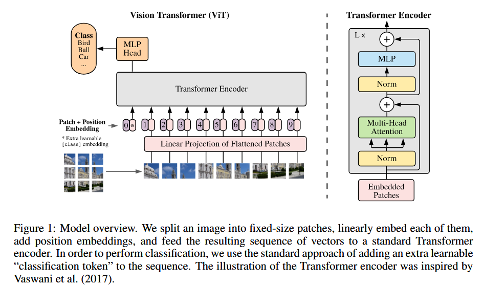
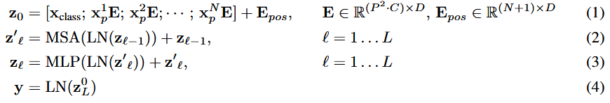

# ViT

## BG

将自我注意力的幼稚应用在图像上需要每个像素都会与其他每个像素一起出现。由于像素数量的二次成本，这并不能扩展到现实的输入尺寸。因此，过去有几个策略在图像处理的上下文中应用transformer:

- 局部像素attention：在邻居像素上应用attention，而不是全局上，这样的局部多头点产物自我注意力块可以完全取代卷积。
- 全局attention近似：Sparse Transformers 采用可扩展的全局attention近似方法，以适用于/scale to图像。
- 将attention应用于不同尺寸的块：这是scale attention的另一种策略，在极端情况下，仅沿单个轴。与我们的最相关的是Cordonnier等人的模型。从输入图像中提取2×2的patch，并再进行完整的self-attention。

ViT其实和最后一种策略是同样的思想，不过scale了，2x2太小了，只能用于低像素的简单任务，ViT就可以用于中等像素图片。

## model

标准transformer接受 1D序列的 embedding （实际整体是2D）。为了针对 2D 序列的图片，要把图片扁平为 2D 的patch。将 HxWxC 的图片转换为 Nx(P^2xC) 的patch，注意是把 图片尺寸 HxW 切分成 P^2 的小块。

之后为了转换为 embedding，将每个patch扁平化，并用linear层映射到embedding，记作 x，这步叫做patch embeddings

融合embedding，类似于bert的[class] token，我们也需要用一个token，来作为最终的整体图片表示；另外将 position embedding添加到 patch embedding中以保留位置信息。我们使用标准可学习的1D位置嵌入，因为我们没有观察到使用更高级的2D感知position embedding的性能提高

之后整体就和正常 transformer 一样了，都是 attention 和MLP的叠加，最后有一个分类head，是由MLP在预训练时间和微调时间的单个线性层的MLP实现的。

混合结构，作为原始图像patch的替代方法，可以先从CNN的特征图中形成输入序列。在此混合模型中，patch embeddings 应用于从CNN特征图中提取的patch。

通常，我们在大型数据集上预先培训VIT，并对（较小）下游任务进行微调。为此，我们删除了预训练的预测头，并连接一个初始化为0的d×k的FFN，其中k是下游类的数量。比预训练更高的分辨率进行微分解通常是有益的。在喂食较高分辨率的图像时，我们保持patch大小相同，从而导致较大的有效序列长度。ViT可以处理任意序列长度（直至记忆约束），但是，预训练的position embedding可能不再有意义。因此，我们根据原始图像中的位置，对预训练的position embedding进行2D插值。

 